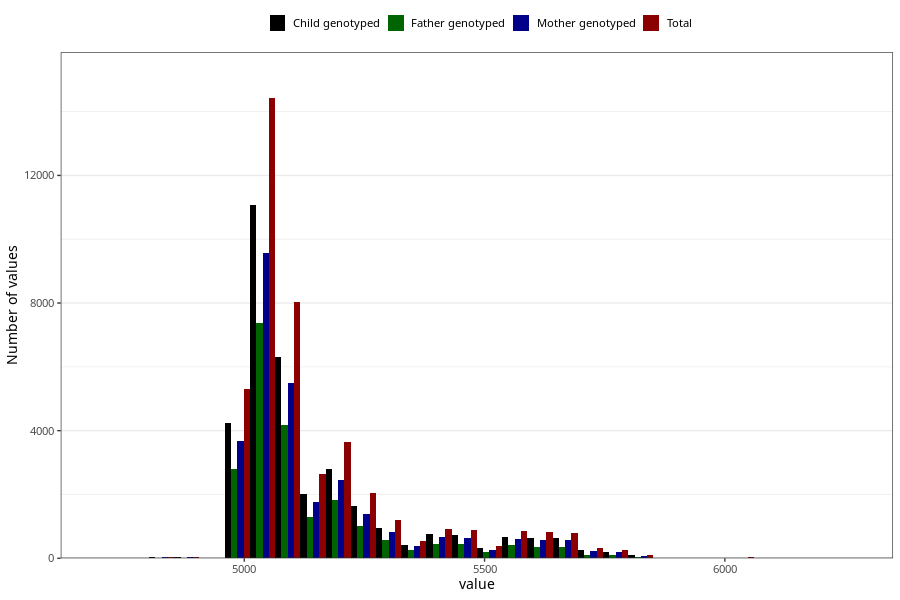

# age_14y
- Number of values:

| Value | Total | Child genotyped | Mother genotyped | Father genotyped |
| ----- | ----- | --------------- | ---------------- | ---------------- |
| Missing | 70221 | 49490 | 42336 | 28372 |
| 4748.25 | 6 | 6 | 5 |1 |
| 4778.6875 | 17 | 13 | 12 |7 |
| 4809.125 | 21 | 18 | 15 |6 |
| 4839.5625 | 22 | 20 | 19 |12 |
| 4870 | 29 | 24 | 19 |12 |
| 4900.4375 | 17 | 13 | 13 |11 |
| 4930.875 | 9 | 9 | 6 |3 |
| 4961.3125 | 4 | 3 | 3 |2 |
| 4991.75 | 5308 | 4228 | 3663 |2799 |
| 5022.1875 | 7405 | 5653 | 4892 |3759 |
| 5052.625 | 7017 | 5428 | 4677 |3607 |
| 5083.0625 | 4867 | 3810 | 3309 |2526 |
| 5113.5 | 3180 | 2486 | 2177 |1645 |
| 5143.9375 | 2642 | 2028 | 1750 |1304 |
| 5174.375 | 2064 | 1567 | 1364 |1036 |
| 5204.8125 | 1588 | 1239 | 1087 |789 |
| 5235.25 | 1124 | 898 | 766 |564 |
| 5265.6875 | 928 | 725 | 626 |458 |
| 5296.125 | 659 | 515 | 457 |331 |
| 5326.5625 | 538 | 430 | 380 |250 |
| 5357 | 539 | 430 | 381 |274 |
| 5387.4375 | 457 | 369 | 317 |225 |
| 5417.875 | 472 | 384 | 344 |236 |
| 5448.3125 | 451 | 373 | 324 |218 |
| 5478.75 | 424 | 346 | 307 |218 |
| 5509.1875 | 399 | 311 | 272 |188 |
| 5539.625 | 417 | 341 | 297 |199 |
| 5570.0625 | 423 | 330 | 294 |202 |
| 5600.5 | 428 | 326 | 283 |183 |
| 5630.9375 | 395 | 304 | 274 |163 |
| 5661.375 | 395 | 320 | 290 |190 |
| 5691.8125 | 409 | 328 | 291 |172 |
| 5722.25 | 317 | 249 | 218 |103 |
| 5752.6875 | 149 | 121 | 110 |55 |
| 5783.125 | 110 | 86 | 77 |42 |
| 5813.5625 | 99 | 83 | 69 |35 |
| 5844 | 16 | 12 | 10 |6 |
| 5874.4375 | 3 | 2 | 2 |0 |
| 5904.875 | 5 | 4 | 4 |2 |
| 5996.1875 | 20 | 14 | 11 |8 |
| 6026.625 | 24 | 15 | 14 |5 |
| 6057.0625 | 4 | 4 | 4 |0 |
| 6270.125 | 1 | 0 | 0 |0 |

