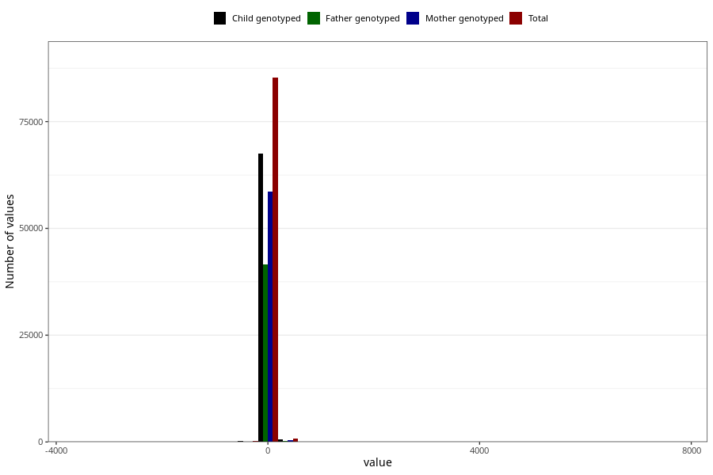

# age_3m
Variable mapping to questionnaire: q4, question ALDER3MND_SJEKK.
.
- Number of values:

| Value | Total | Child genotyped | Mother genotyped | Father genotyped |
| ----- | ----- | --------------- | ---------------- | ---------------- |
| Missing | 27377 | 15080 | 12413 | 8225 |
| -3554 | 1 | 1 | 1 |1 |
| -2465 | 1 | 1 | 1 |0 |
| -2462 | 1 | 1 | 1 |1 |
| -2116 | 1 | 1 | 1 |0 |
| -2103 | 1 | 0 | 0 |0 |
| -2102 | 1 | 1 | 0 |0 |
| -2098 | 1 | 1 | 1 |1 |
| -2095 | 1 | 1 | 1 |1 |
| -1761 | 1 | 0 | 0 |0 |
| -1734 | 2 | 1 | 1 |0 |
| -1731 | 1 | 1 | 1 |1 |
| -1730 | 2 | 2 | 0 |0 |
| -1727 | 3 | 2 | 2 |2 |
| -1726 | 1 | 1 | 1 |1 |
| -1725 | 1 | 1 | 1 |1 |
| -1723 | 1 | 1 | 0 |0 |
| -1721 | 1 | 1 | 1 |0 |
| -1696 | 1 | 1 | 1 |0 |
| -1684 | 1 | 0 | 0 |0 |
| -1681 | 1 | 1 | 1 |0 |
| -1367 | 1 | 1 | 1 |1 |
| -1363 | 1 | 0 | 0 |0 |
| -1011 | 2 | 1 | 1 |0 |
| -1006 | 3 | 3 | 3 |2 |
| -1005 | 1 | 1 | 0 |0 |
| -1003 | 2 | 2 | 1 |1 |
| -1001 | 2 | 0 | 0 |0 |
| -1000 | 1 | 0 | 0 |0 |
| -995 | 1 | 1 | 1 |1 |
| -994 | 1 | 1 | 1 |1 |
| -727 | 1 | 1 | 1 |1 |
| -671 | 1 | 1 | 1 |1 |
| -668 | 2 | 1 | 1 |1 |
| -650 | 1 | 0 | 0 |0 |
| -647 | 1 | 0 | 0 |0 |
| -646 | 1 | 1 | 1 |1 |
| -644 | 2 | 1 | 1 |1 |
| -643 | 1 | 0 | 0 |0 |
| -642 | 1 | 0 | 0 |0 |
| -640 | 3 | 3 | 2 |2 |
| -639 | 1 | 1 | 1 |0 |
| -637 | 1 | 1 | 1 |1 |
| -636 | 3 | 3 | 3 |3 |
| -635 | 1 | 1 | 1 |1 |
| -634 | 1 | 1 | 0 |0 |
| -632 | 1 | 1 | 1 |1 |
| -631 | 1 | 0 | 0 |0 |
| -623 | 1 | 1 | 1 |0 |
| -618 | 1 | 0 | 0 |0 |
| -613 | 1 | 1 | 1 |1 |
| -610 | 1 | 1 | 1 |0 |
| -326 | 1 | 1 | 1 |1 |
| -303 | 1 | 1 | 1 |1 |
| -289 | 2 | 2 | 2 |2 |
| -287 | 2 | 1 | 1 |1 |
| -286 | 2 | 2 | 2 |2 |
| -284 | 2 | 1 | 1 |1 |
| -282 | 3 | 3 | 1 |0 |
| -281 | 2 | 2 | 0 |2 |
| -280 | 2 | 2 | 2 |2 |
| -278 | 2 | 2 | 0 |1 |
| -277 | 6 | 5 | 4 |3 |
| -276 | 6 | 5 | 4 |3 |
| -275 | 4 | 3 | 3 |3 |
| -274 | 5 | 5 | 3 |2 |
| -273 | 13 | 8 | 7 |4 |
| -272 | 16 | 13 | 11 |5 |
| -271 | 10 | 9 | 8 |6 |
| -270 | 13 | 10 | 9 |5 |
| -269 | 10 | 7 | 7 |5 |
| -268 | 7 | 6 | 6 |6 |
| -267 | 5 | 5 | 5 |4 |
| -266 | 4 | 3 | 3 |1 |
| -265 | 3 | 3 | 1 |1 |
| -264 | 5 | 3 | 3 |2 |
| -263 | 5 | 3 | 3 |1 |
| -262 | 6 | 6 | 6 |5 |
| -261 | 7 | 5 | 5 |5 |
| -260 | 2 | 1 | 1 |1 |
| -259 | 2 | 1 | 1 |0 |
| -258 | 3 | 2 | 1 |1 |
| -257 | 2 | 2 | 2 |1 |
| -254 | 2 | 2 | 2 |1 |
| -253 | 1 | 1 | 0 |0 |
| -252 | 1 | 1 | 0 |0 |
| -251 | 2 | 2 | 1 |0 |
| -250 | 2 | 2 | 2 |1 |
| -249 | 1 | 1 | 1 |0 |
| -248 | 1 | 0 | 0 |0 |
| -247 | 1 | 1 | 1 |1 |
| -242 | 1 | 1 | 0 |0 |
| -240 | 1 | 1 | 1 |0 |
| -239 | 1 | 0 | 0 |0 |
| -237 | 1 | 1 | 0 |1 |
| -228 | 1 | 1 | 0 |0 |
| -223 | 1 | 0 | 0 |0 |
| -222 | 1 | 0 | 0 |0 |
| -216 | 1 | 1 | 1 |1 |
| -213 | 1 | 1 | 1 |0 |
| -212 | 2 | 2 | 2 |2 |
| -210 | 1 | 1 | 0 |0 |
| -206 | 2 | 2 | 2 |0 |
| -201 | 1 | 1 | 1 |1 |
| -198 | 2 | 2 | 1 |1 |
| -191 | 1 | 1 | 0 |0 |
| -124 | 1 | 0 | 0 |0 |
| -102 | 1 | 1 | 1 |1 |
| -91 | 2 | 1 | 1 |1 |
| -90 | 2 | 2 | 1 |0 |
| -88 | 2 | 2 | 1 |2 |
| -86 | 1 | 1 | 0 |1 |
| -84 | 1 | 0 | 0 |0 |
| -83 | 1 | 1 | 1 |1 |
| -81 | 1 | 1 | 1 |1 |
| -80 | 1 | 1 | 1 |1 |
| -69 | 2 | 2 | 0 |0 |
| -65 | 1 | 0 | 0 |0 |
| -63 | 1 | 1 | 0 |0 |
| -62 | 1 | 1 | 1 |1 |
| -61 | 2 | 2 | 2 |1 |
| -60 | 2 | 1 | 0 |0 |
| -59 | 1 | 1 | 1 |0 |
| -58 | 1 | 1 | 1 |1 |
| -56 | 1 | 1 | 1 |1 |
| -54 | 1 | 0 | 0 |0 |
| -53 | 1 | 0 | 0 |0 |
| -50 | 1 | 1 | 1 |1 |
| -41 | 1 | 1 | 1 |0 |
| -30 | 1 | 1 | 1 |1 |
| -14 | 1 | 1 | 1 |0 |
| -3 | 1 | 1 | 1 |1 |
| -2 | 1 | 1 | 1 |1 |
| 0 | 7 | 6 | 6 |2 |
| 2 | 1 | 1 | 1 |1 |
| 3 | 4 | 3 | 3 |1 |
| 4 | 1 | 1 | 1 |1 |
| 5 | 2 | 2 | 2 |2 |
| 6 | 1 | 1 | 1 |1 |
| 8 | 1 | 1 | 1 |0 |
| 10 | 1 | 1 | 1 |1 |
| 15 | 1 | 0 | 0 |0 |
| 17 | 1 | 1 | 1 |1 |
| 20 | 1 | 1 | 1 |1 |
| 21 | 1 | 1 | 1 |1 |
| 23 | 4 | 2 | 2 |1 |
| 25 | 1 | 1 | 1 |0 |
| 27 | 1 | 1 | 1 |0 |
| 28 | 4 | 4 | 3 |1 |
| 29 | 5 | 4 | 3 |3 |
| 30 | 3 | 3 | 3 |2 |
| 32 | 2 | 2 | 2 |1 |
| 33 | 3 | 3 | 2 |2 |
| 34 | 2 | 1 | 0 |1 |
| 35 | 5 | 4 | 3 |2 |
| 36 | 3 | 1 | 1 |1 |
| 37 | 3 | 3 | 2 |2 |
| 38 | 9 | 6 | 6 |4 |
| 39 | 11 | 9 | 7 |3 |
| 40 | 16 | 13 | 10 |4 |
| 41 | 12 | 10 | 9 |7 |
| 42 | 18 | 14 | 13 |8 |
| 43 | 20 | 14 | 11 |9 |
| 44 | 24 | 19 | 14 |11 |
| 45 | 27 | 16 | 13 |8 |
| 46 | 29 | 25 | 20 |9 |
| 47 | 33 | 27 | 22 |7 |
| 48 | 30 | 20 | 19 |16 |
| 49 | 34 | 27 | 22 |13 |
| 50 | 35 | 28 | 24 |18 |
| 51 | 39 | 27 | 24 |9 |
| 52 | 31 | 23 | 19 |13 |
| 53 | 23 | 18 | 16 |10 |
| 54 | 27 | 23 | 21 |15 |
| 55 | 18 | 16 | 14 |9 |
| 56 | 40 | 31 | 21 |17 |
| 57 | 39 | 29 | 26 |14 |
| 58 | 54 | 40 | 29 |21 |
| 59 | 50 | 38 | 33 |23 |
| 60 | 44 | 31 | 24 |14 |
| 61 | 64 | 52 | 38 |24 |
| 62 | 49 | 39 | 35 |21 |
| 63 | 70 | 49 | 40 |27 |
| 64 | 66 | 60 | 50 |40 |
| 65 | 74 | 63 | 54 |31 |
| 66 | 70 | 53 | 47 |23 |
| 67 | 81 | 66 | 56 |43 |
| 68 | 94 | 69 | 59 |39 |
| 69 | 96 | 68 | 63 |39 |
| 70 | 106 | 85 | 76 |51 |
| 71 | 99 | 84 | 77 |49 |
| 72 | 122 | 98 | 82 |59 |
| 73 | 122 | 96 | 80 |54 |
| 74 | 171 | 127 | 115 |71 |
| 75 | 182 | 134 | 117 |73 |
| 76 | 207 | 152 | 134 |93 |
| 77 | 245 | 189 | 163 |123 |
| 78 | 295 | 223 | 195 |130 |
| 79 | 300 | 248 | 215 |164 |
| 80 | 401 | 315 | 279 |203 |
| 81 | 457 | 364 | 323 |207 |
| 82 | 573 | 449 | 373 |261 |
| 83 | 701 | 555 | 483 |330 |
| 84 | 1007 | 806 | 700 |491 |
| 85 | 1081 | 832 | 723 |496 |
| 86 | 1320 | 1071 | 927 |650 |
| 87 | 1794 | 1406 | 1223 |895 |
| 88 | 2545 | 2041 | 1784 |1270 |
| 89 | 3547 | 2821 | 2447 |1791 |
| 90 | 5164 | 4079 | 3530 |2527 |
| 91 | 5972 | 4747 | 4149 |3003 |
| 92 | 6926 | 5460 | 4751 |3428 |
| 93 | 6085 | 4848 | 4252 |3085 |
| 94 | 5613 | 4469 | 3872 |2739 |
| 95 | 5201 | 4181 | 3629 |2556 |
| 96 | 4773 | 3743 | 3263 |2296 |
| 97 | 4189 | 3301 | 2858 |1998 |
| 98 | 3544 | 2789 | 2419 |1748 |
| 99 | 2883 | 2310 | 2007 |1417 |
| 100 | 2357 | 1870 | 1653 |1140 |
| 101 | 2150 | 1739 | 1516 |1050 |
| 102 | 1837 | 1470 | 1268 |886 |
| 103 | 1601 | 1250 | 1083 |776 |
| 104 | 1453 | 1125 | 979 |705 |
| 105 | 1243 | 967 | 849 |566 |
| 106 | 1033 | 812 | 698 |492 |
| 107 | 795 | 638 | 555 |383 |
| 108 | 706 | 561 | 482 |326 |
| 109 | 636 | 512 | 454 |311 |
| 110 | 522 | 419 | 374 |261 |
| 111 | 464 | 364 | 306 |218 |
| 112 | 397 | 328 | 279 |191 |
| 113 | 299 | 232 | 206 |148 |
| 114 | 261 | 203 | 181 |125 |
| 115 | 231 | 178 | 166 |119 |
| 116 | 187 | 150 | 132 |92 |
| 117 | 180 | 141 | 131 |91 |
| 118 | 170 | 120 | 100 |72 |
| 119 | 162 | 126 | 110 |69 |
| 120 | 138 | 108 | 94 |60 |
| 121 | 111 | 92 | 79 |59 |
| 122 | 140 | 105 | 88 |59 |
| 123 | 113 | 83 | 74 |46 |
| 124 | 84 | 65 | 56 |37 |
| 125 | 112 | 88 | 74 |52 |
| 126 | 93 | 74 | 63 |40 |
| 127 | 65 | 49 | 44 |30 |
| 128 | 63 | 47 | 42 |27 |
| 129 | 59 | 43 | 37 |26 |
| 130 | 42 | 31 | 27 |16 |
| 131 | 41 | 32 | 27 |15 |
| 132 | 45 | 33 | 28 |21 |
| 133 | 36 | 30 | 22 |16 |
| 134 | 30 | 26 | 22 |15 |
| 135 | 36 | 26 | 20 |17 |
| 136 | 20 | 15 | 13 |6 |
| 137 | 26 | 19 | 17 |12 |
| 138 | 18 | 16 | 11 |6 |
| 139 | 11 | 7 | 7 |5 |
| 140 | 13 | 10 | 9 |7 |
| 141 | 12 | 9 | 8 |6 |
| 142 | 8 | 7 | 5 |6 |
| 143 | 15 | 12 | 10 |8 |
| 144 | 9 | 9 | 7 |4 |
| 145 | 8 | 7 | 3 |2 |
| 146 | 8 | 7 | 4 |5 |
| 147 | 7 | 6 | 5 |3 |
| 148 | 11 | 9 | 8 |6 |
| 149 | 8 | 4 | 3 |1 |
| 150 | 12 | 11 | 10 |6 |
| 151 | 7 | 5 | 5 |2 |
| 152 | 9 | 7 | 6 |5 |
| 153 | 11 | 9 | 6 |5 |
| 154 | 10 | 5 | 5 |4 |
| 155 | 12 | 11 | 8 |6 |
| 156 | 13 | 11 | 10 |6 |
| 157 | 13 | 9 | 7 |7 |
| 158 | 7 | 5 | 4 |4 |
| 159 | 7 | 5 | 5 |3 |
| 160 | 7 | 5 | 5 |4 |
| 161 | 7 | 5 | 4 |3 |
| 162 | 7 | 5 | 5 |2 |
| 163 | 6 | 2 | 2 |1 |
| 164 | 4 | 1 | 1 |0 |
| 165 | 7 | 7 | 6 |4 |
| 166 | 7 | 5 | 4 |4 |
| 167 | 2 | 2 | 1 |0 |
| 168 | 2 | 2 | 2 |1 |
| 169 | 3 | 0 | 0 |0 |
| 170 | 2 | 0 | 0 |0 |
| 174 | 1 | 1 | 0 |0 |
| 175 | 1 | 1 | 1 |1 |
| 178 | 1 | 0 | 0 |0 |
| 181 | 1 | 1 | 1 |1 |
| 182 | 3 | 2 | 2 |1 |
| 183 | 1 | 1 | 1 |1 |
| 184 | 1 | 0 | 0 |0 |
| 185 | 2 | 2 | 1 |0 |
| 187 | 1 | 1 | 1 |0 |
| 193 | 1 | 1 | 0 |0 |
| 194 | 1 | 0 | 0 |0 |
| 197 | 1 | 0 | 0 |0 |
| 199 | 1 | 1 | 1 |1 |
| 203 | 1 | 0 | 0 |0 |
| 207 | 1 | 1 | 1 |1 |
| 208 | 1 | 1 | 1 |1 |
| 210 | 1 | 1 | 1 |1 |
| 211 | 1 | 1 | 1 |1 |
| 213 | 1 | 1 | 1 |0 |
| 214 | 1 | 1 | 1 |1 |
| 217 | 1 | 1 | 1 |0 |
| 218 | 1 | 1 | 1 |0 |
| 219 | 1 | 1 | 1 |1 |
| 221 | 1 | 1 | 1 |0 |
| 224 | 1 | 0 | 0 |0 |
| 225 | 1 | 0 | 0 |0 |
| 232 | 1 | 1 | 1 |0 |
| 239 | 2 | 1 | 1 |1 |
| 240 | 2 | 0 | 0 |0 |
| 242 | 1 | 1 | 1 |0 |
| 245 | 1 | 0 | 0 |0 |
| 246 | 2 | 2 | 2 |2 |
| 256 | 1 | 0 | 0 |0 |
| 258 | 1 | 1 | 0 |0 |
| 272 | 1 | 1 | 1 |1 |
| 273 | 1 | 1 | 1 |1 |
| 276 | 1 | 1 | 1 |1 |
| 277 | 2 | 2 | 2 |2 |
| 280 | 1 | 1 | 1 |0 |
| 284 | 1 | 1 | 1 |1 |
| 286 | 1 | 1 | 1 |0 |
| 291 | 1 | 1 | 1 |0 |
| 294 | 1 | 1 | 1 |0 |
| 299 | 1 | 1 | 1 |0 |
| 313 | 2 | 1 | 1 |0 |
| 364 | 2 | 1 | 1 |1 |
| 381 | 1 | 1 | 1 |0 |
| 393 | 1 | 0 | 0 |0 |
| 395 | 1 | 1 | 1 |1 |
| 396 | 2 | 2 | 2 |2 |
| 397 | 1 | 1 | 1 |0 |
| 400 | 2 | 1 | 1 |1 |
| 404 | 1 | 1 | 0 |0 |
| 406 | 1 | 0 | 0 |0 |
| 407 | 1 | 1 | 1 |1 |
| 411 | 2 | 2 | 2 |1 |
| 419 | 1 | 1 | 1 |0 |
| 424 | 2 | 1 | 1 |0 |
| 425 | 1 | 1 | 1 |1 |
| 426 | 3 | 3 | 3 |1 |
| 428 | 2 | 1 | 0 |0 |
| 429 | 1 | 1 | 1 |0 |
| 432 | 1 | 1 | 1 |0 |
| 433 | 1 | 1 | 0 |0 |
| 435 | 2 | 1 | 1 |1 |
| 436 | 2 | 2 | 1 |0 |
| 437 | 1 | 0 | 0 |0 |
| 441 | 3 | 2 | 2 |1 |
| 442 | 4 | 4 | 4 |1 |
| 443 | 2 | 2 | 2 |2 |
| 444 | 4 | 2 | 1 |1 |
| 445 | 7 | 7 | 6 |3 |
| 446 | 5 | 5 | 5 |3 |
| 447 | 7 | 4 | 4 |3 |
| 448 | 7 | 4 | 4 |1 |
| 449 | 2 | 2 | 1 |1 |
| 450 | 14 | 10 | 8 |6 |
| 451 | 24 | 17 | 14 |9 |
| 452 | 11 | 8 | 8 |5 |
| 453 | 21 | 16 | 14 |9 |
| 454 | 23 | 18 | 16 |11 |
| 455 | 32 | 27 | 25 |20 |
| 456 | 50 | 38 | 36 |20 |
| 457 | 64 | 51 | 41 |25 |
| 458 | 43 | 34 | 30 |20 |
| 459 | 42 | 31 | 27 |20 |
| 460 | 37 | 30 | 26 |22 |
| 461 | 36 | 31 | 27 |15 |
| 462 | 39 | 33 | 27 |17 |
| 463 | 24 | 17 | 14 |12 |
| 464 | 28 | 23 | 20 |16 |
| 465 | 21 | 17 | 14 |7 |
| 466 | 17 | 14 | 12 |7 |
| 467 | 9 | 7 | 7 |7 |
| 468 | 7 | 7 | 6 |3 |
| 469 | 10 | 8 | 8 |6 |
| 470 | 7 | 6 | 6 |4 |
| 471 | 7 | 5 | 5 |3 |
| 472 | 7 | 6 | 6 |1 |
| 473 | 3 | 3 | 3 |2 |
| 474 | 1 | 1 | 1 |1 |
| 475 | 5 | 3 | 3 |1 |
| 476 | 4 | 3 | 3 |2 |
| 477 | 1 | 1 | 1 |1 |
| 478 | 5 | 4 | 3 |1 |
| 479 | 1 | 0 | 0 |0 |
| 481 | 1 | 1 | 1 |1 |
| 482 | 1 | 0 | 0 |0 |
| 485 | 1 | 1 | 1 |1 |
| 491 | 1 | 1 | 1 |1 |
| 493 | 2 | 1 | 1 |1 |
| 511 | 1 | 0 | 0 |0 |
| 822 | 2 | 2 | 2 |0 |
| 824 | 1 | 0 | 0 |0 |
| 828 | 1 | 1 | 1 |1 |
| 1188 | 2 | 1 | 1 |0 |
| 1920 | 1 | 1 | 1 |1 |
| 7395 | 1 | 1 | 1 |1 |

