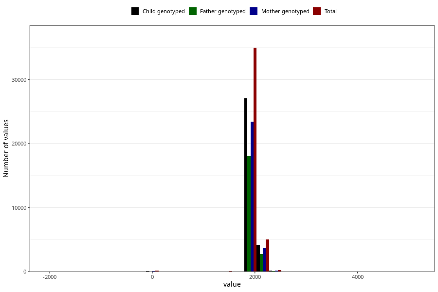

# age_5y
Variable mapping to questionnaire: q7, question AGE_MTHS_Q5AAR.
.
- Number of values:

| Value | Total | Child genotyped | Mother genotyped | Father genotyped |
| ----- | ----- | --------------- | ---------------- | ---------------- |
| Missing | 73105 | 51627 | 44261 | 29190 |
| -1795.8125 | 3 | 2 | 1 |2 |
| -1765.375 | 2 | 2 | 2 |2 |
| -1734.9375 | 1 | 1 | 1 |0 |
| -1430.5625 | 1 | 0 | 0 |0 |
| -1400.125 | 1 | 1 | 0 |0 |
| -1247.9375 | 1 | 1 | 1 |1 |
| -1187.0625 | 1 | 0 | 0 |0 |
| -121.75 | 1 | 1 | 1 |1 |
| -30.4375 | 1 | 0 | 0 |0 |
| 0 | 147 | 96 | 70 |54 |
| 30.4375 | 3 | 2 | 2 |2 |
| 60.875 | 2 | 1 | 1 |0 |
| 91.3125 | 2 | 1 | 1 |1 |
| 182.625 | 1 | 0 | 0 |0 |
| 365.25 | 1 | 1 | 1 |1 |
| 395.6875 | 1 | 0 | 0 |0 |
| 730.5 | 1 | 1 | 1 |1 |
| 791.375 | 1 | 1 | 1 |1 |
| 821.8125 | 1 | 0 | 0 |0 |
| 1095.75 | 2 | 2 | 2 |2 |
| 1126.1875 | 5 | 4 | 2 |2 |
| 1187.0625 | 2 | 2 | 2 |0 |
| 1217.5 | 2 | 2 | 2 |1 |
| 1430.5625 | 1 | 1 | 1 |1 |
| 1461 | 20 | 13 | 13 |9 |
| 1491.4375 | 15 | 10 | 7 |4 |
| 1521.875 | 14 | 11 | 11 |9 |
| 1552.3125 | 11 | 8 | 8 |5 |
| 1582.75 | 6 | 6 | 6 |5 |
| 1613.1875 | 4 | 2 | 2 |1 |
| 1643.625 | 5 | 4 | 4 |2 |
| 1674.0625 | 5 | 5 | 2 |2 |
| 1734.9375 | 3 | 2 | 2 |1 |
| 1765.375 | 8 | 5 | 5 |4 |
| 1795.8125 | 236 | 181 | 148 |110 |
| 1826.25 | 13617 | 10527 | 9146 |6998 |
| 1856.6875 | 9320 | 7187 | 6184 |4731 |
| 1887.125 | 4313 | 3307 | 2865 |2228 |
| 1917.5625 | 3056 | 2400 | 2087 |1603 |
| 1948 | 2177 | 1702 | 1448 |1163 |
| 1978.4375 | 1235 | 991 | 860 |630 |
| 2008.875 | 1022 | 821 | 729 |552 |
| 2039.3125 | 919 | 737 | 651 |496 |
| 2069.75 | 838 | 696 | 607 |460 |
| 2100.1875 | 776 | 645 | 556 |419 |
| 2130.625 | 630 | 552 | 494 |378 |
| 2161.0625 | 559 | 472 | 403 |307 |
| 2191.5 | 549 | 466 | 421 |302 |
| 2221.9375 | 555 | 471 | 416 |294 |
| 2252.375 | 203 | 178 | 156 |113 |
| 2282.8125 | 119 | 106 | 93 |65 |
| 2313.25 | 73 | 64 | 60 |39 |
| 2343.6875 | 19 | 16 | 14 |11 |
| 2374.125 | 3 | 3 | 2 |1 |
| 2435 | 3 | 3 | 3 |3 |
| 2465.4375 | 2 | 2 | 2 |1 |
| 2495.875 | 1 | 0 | 0 |0 |
| 2526.3125 | 4 | 3 | 2 |2 |
| 2556.75 | 2 | 1 | 1 |1 |
| 2587.1875 | 2 | 1 | 1 |1 |
| 2617.625 | 1 | 1 | 1 |1 |
| 2648.0625 | 2 | 1 | 1 |1 |
| 2678.5 | 1 | 1 | 1 |1 |
| 2739.375 | 1 | 1 | 1 |0 |
| 2769.8125 | 1 | 1 | 1 |1 |
| 2891.5625 | 1 | 0 | 0 |0 |
| 3682.9375 | 1 | 1 | 1 |1 |
| 5113.5 | 1 | 1 | 1 |1 |
| 5143.9375 | 1 | 1 | 0 |0 |

