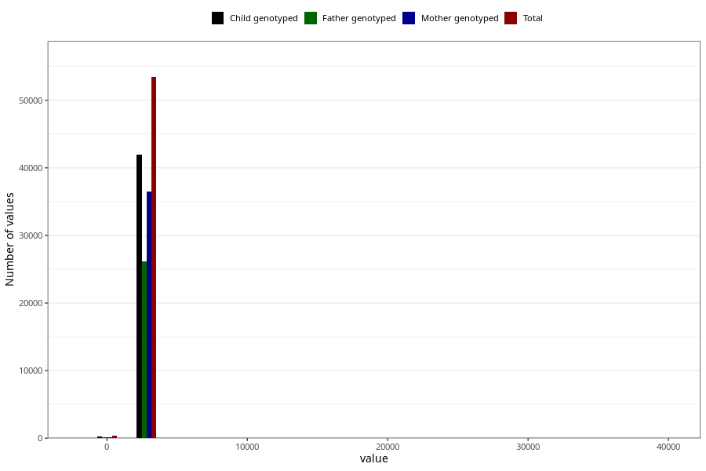

# age_7y
Variable mapping to questionnaire: q8, question AGE_MTHS_Q7.
.
- Number of values:

| Value | Total | Child genotyped | Mother genotyped | Father genotyped |
| ----- | ----- | --------------- | ---------------- | ---------------- |
| Missing | 59811 | 41084 | 35017 | 23912 |
| -1795.8125 | 1 | 0 | 0 |0 |
| -1065.3125 | 5 | 4 | 4 |3 |
| -1034.875 | 4 | 4 | 4 |2 |
| -669.625 | 3 | 3 | 2 |2 |
| -334.8125 | 3 | 2 | 2 |1 |
| -304.375 | 1 | 1 | 1 |0 |
| -60.875 | 1 | 1 | 1 |0 |
| 0 | 300 | 219 | 167 |113 |
| 30.4375 | 3 | 3 | 3 |2 |
| 60.875 | 2 | 2 | 2 |1 |
| 91.3125 | 2 | 1 | 1 |1 |
| 121.75 | 1 | 1 | 1 |1 |
| 152.1875 | 3 | 2 | 2 |2 |
| 182.625 | 1 | 1 | 1 |1 |
| 395.6875 | 1 | 1 | 1 |1 |
| 426.125 | 1 | 0 | 0 |0 |
| 791.375 | 1 | 1 | 1 |1 |
| 852.25 | 1 | 1 | 0 |0 |
| 1065.3125 | 1 | 1 | 1 |1 |
| 1095.75 | 2 | 2 | 2 |1 |
| 1126.1875 | 2 | 2 | 2 |2 |
| 1156.625 | 2 | 2 | 2 |2 |
| 1461 | 3 | 3 | 2 |1 |
| 1491.4375 | 7 | 5 | 4 |3 |
| 1582.75 | 1 | 1 | 1 |1 |
| 1795.8125 | 1 | 1 | 1 |1 |
| 1826.25 | 9 | 7 | 7 |6 |
| 1856.6875 | 7 | 5 | 4 |4 |
| 1887.125 | 8 | 8 | 7 |3 |
| 1917.5625 | 1 | 1 | 1 |0 |
| 1948 | 1 | 1 | 1 |1 |
| 1978.4375 | 1 | 1 | 0 |0 |
| 2069.75 | 1 | 1 | 1 |1 |
| 2100.1875 | 2 | 2 | 2 |0 |
| 2161.0625 | 2 | 1 | 1 |0 |
| 2191.5 | 41 | 37 | 30 |23 |
| 2221.9375 | 39 | 35 | 30 |24 |
| 2252.375 | 13 | 10 | 9 |7 |
| 2282.8125 | 10 | 6 | 5 |5 |
| 2313.25 | 6 | 5 | 5 |3 |
| 2343.6875 | 4 | 2 | 1 |1 |
| 2374.125 | 4 | 3 | 3 |1 |
| 2404.5625 | 8 | 4 | 3 |3 |
| 2435 | 10 | 9 | 9 |4 |
| 2465.4375 | 12 | 10 | 10 |7 |
| 2495.875 | 8 | 8 | 6 |5 |
| 2526.3125 | 574 | 423 | 372 |272 |
| 2556.75 | 18966 | 15033 | 13114 |9546 |
| 2587.1875 | 14955 | 11723 | 10125 |7650 |
| 2617.625 | 7504 | 5853 | 5058 |3711 |
| 2648.0625 | 4182 | 3213 | 2769 |2002 |
| 2678.5 | 2180 | 1677 | 1454 |1050 |
| 2708.9375 | 1156 | 909 | 795 |491 |
| 2739.375 | 890 | 707 | 637 |351 |
| 2769.8125 | 829 | 666 | 601 |339 |
| 2800.25 | 714 | 573 | 514 |251 |
| 2830.6875 | 530 | 447 | 393 |181 |
| 2861.125 | 245 | 205 | 186 |80 |
| 2891.5625 | 175 | 136 | 128 |49 |
| 2922 | 125 | 94 | 87 |28 |
| 2952.4375 | 109 | 90 | 85 |23 |
| 2982.875 | 65 | 47 | 41 |11 |
| 3013.3125 | 31 | 22 | 21 |9 |
| 3043.75 | 10 | 6 | 6 |3 |
| 3074.1875 | 7 | 6 | 6 |4 |
| 3104.625 | 6 | 5 | 4 |3 |
| 3135.0625 | 8 | 5 | 3 |2 |
| 3195.9375 | 2 | 2 | 1 |1 |
| 3226.375 | 1 | 1 | 1 |1 |
| 3287.25 | 1 | 1 | 1 |1 |
| 3317.6875 | 2 | 2 | 2 |2 |
| 3348.125 | 1 | 1 | 1 |0 |
| 3378.5625 | 1 | 1 | 1 |1 |
| 3439.4375 | 1 | 1 | 1 |1 |
| 5844 | 1 | 1 | 1 |1 |
| 39081.75 | 1 | 1 | 1 |1 |

