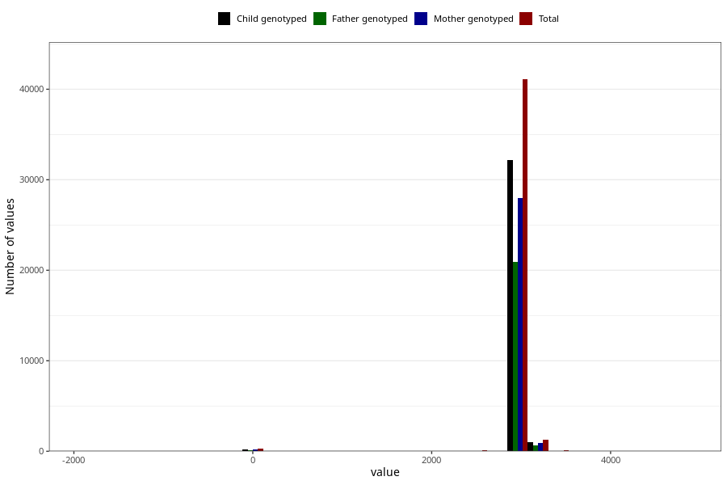

# age_8y
Variable mapping to questionnaire: q9, question AGE_MTHS_Q8AAR.
.
- Number of values:

| Value | Total | Child genotyped | Mother genotyped | Father genotyped |
| ----- | ----- | --------------- | ---------------- | ---------------- |
| Missing | 70713 | 49710 | 42539 | 28414 |
| -1765.375 | 1 | 1 | 1 |1 |
| -974 | 1 | 1 | 1 |0 |
| -700.0625 | 5 | 4 | 4 |2 |
| -669.625 | 3 | 2 | 2 |2 |
| -547.875 | 1 | 1 | 1 |1 |
| -243.5 | 1 | 1 | 1 |1 |
| -182.625 | 1 | 1 | 1 |0 |
| -152.1875 | 1 | 0 | 0 |0 |
| 0 | 264 | 203 | 168 |113 |
| 30.4375 | 6 | 2 | 1 |1 |
| 60.875 | 3 | 2 | 2 |2 |
| 91.3125 | 1 | 1 | 1 |0 |
| 152.1875 | 1 | 0 | 0 |0 |
| 365.25 | 1 | 0 | 0 |0 |
| 730.5 | 2 | 2 | 1 |1 |
| 760.9375 | 2 | 2 | 1 |1 |
| 1156.625 | 1 | 1 | 1 |1 |
| 1187.0625 | 1 | 1 | 1 |0 |
| 1491.4375 | 2 | 2 | 1 |1 |
| 1826.25 | 1 | 0 | 0 |0 |
| 1856.6875 | 1 | 0 | 0 |0 |
| 1887.125 | 1 | 1 | 0 |0 |
| 2191.5 | 5 | 5 | 3 |3 |
| 2221.9375 | 12 | 11 | 10 |6 |
| 2252.375 | 2 | 2 | 2 |2 |
| 2313.25 | 2 | 2 | 2 |1 |
| 2343.6875 | 1 | 0 | 0 |0 |
| 2556.75 | 28 | 24 | 20 |17 |
| 2587.1875 | 37 | 30 | 26 |21 |
| 2617.625 | 10 | 5 | 4 |2 |
| 2648.0625 | 22 | 21 | 17 |13 |
| 2678.5 | 5 | 5 | 4 |2 |
| 2708.9375 | 7 | 6 | 5 |3 |
| 2739.375 | 3 | 2 | 2 |1 |
| 2769.8125 | 4 | 1 | 1 |0 |
| 2800.25 | 5 | 5 | 4 |3 |
| 2830.6875 | 5 | 3 | 2 |2 |
| 2861.125 | 5 | 3 | 3 |3 |
| 2891.5625 | 81 | 59 | 51 |36 |
| 2922 | 10315 | 8061 | 7030 |5245 |
| 2952.4375 | 15368 | 12022 | 10404 |7815 |
| 2982.875 | 7263 | 5681 | 4947 |3737 |
| 3013.3125 | 4412 | 3520 | 3062 |2328 |
| 3043.75 | 2522 | 1989 | 1744 |1242 |
| 3074.1875 | 1126 | 882 | 762 |536 |
| 3104.625 | 640 | 507 | 440 |288 |
| 3135.0625 | 239 | 185 | 169 |118 |
| 3165.5 | 181 | 142 | 122 |99 |
| 3195.9375 | 113 | 91 | 77 |50 |
| 3226.375 | 52 | 37 | 31 |22 |
| 3256.8125 | 34 | 27 | 24 |19 |
| 3287.25 | 17 | 14 | 11 |10 |
| 3317.6875 | 24 | 21 | 18 |17 |
| 3348.125 | 14 | 8 | 8 |6 |
| 3378.5625 | 18 | 14 | 10 |8 |
| 3409 | 9 | 9 | 7 |5 |
| 3439.4375 | 5 | 3 | 3 |3 |
| 3469.875 | 2 | 2 | 1 |1 |
| 3500.3125 | 4 | 4 | 4 |2 |
| 3530.75 | 1 | 0 | 0 |0 |
| 3561.1875 | 3 | 3 | 2 |2 |
| 3591.625 | 3 | 3 | 3 |3 |
| 3652.5 | 1 | 1 | 1 |1 |
| 3682.9375 | 2 | 1 | 1 |0 |
| 3713.375 | 2 | 2 | 2 |2 |
| 3743.8125 | 1 | 1 | 0 |1 |
| 3804.6875 | 1 | 1 | 1 |0 |
| 3926.4375 | 1 | 1 | 1 |1 |
| 4017.75 | 1 | 1 | 1 |1 |
| 4839.5625 | 1 | 0 | 0 |0 |

