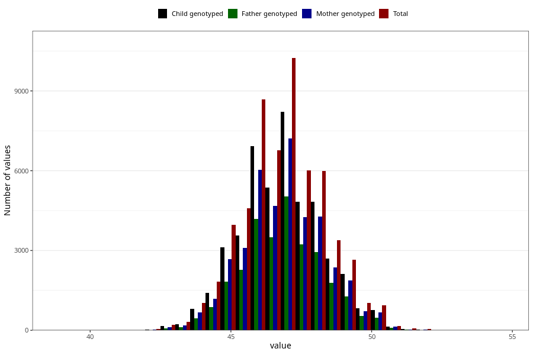

# hc_1y
Variable mapping to questionnaire: q5, question EE394.
.
- Number of values:

| Value | Total | Child genotyped | Mother genotyped | Father genotyped |
| ----- | ----- | --------------- | ---------------- | ---------------- |
| Missing | 55582 | 37227 | 31528 | 21478 |
| 39 | 3 | 2 | 0 |0 |
| 39.4 | 1 | 0 | 0 |0 |
| 39.5 | 1 | 1 | 1 |1 |
| 39.9 | 2 | 2 | 2 |2 |
| 40 | 5 | 4 | 3 |3 |
| 40.1 | 1 | 1 | 0 |0 |
| 40.3 | 2 | 2 | 1 |1 |
| 40.5 | 4 | 2 | 2 |1 |
| 40.6 | 1 | 0 | 0 |0 |
| 40.8 | 2 | 2 | 2 |1 |
| 40.9 | 1 | 1 | 1 |1 |
| 41 | 11 | 4 | 4 |2 |
| 41.1 | 1 | 1 | 1 |1 |
| 41.2 | 2 | 2 | 2 |2 |
| 41.4 | 1 | 1 | 1 |1 |
| 41.5 | 8 | 2 | 1 |1 |
| 41.7 | 1 | 1 | 1 |0 |
| 41.8 | 4 | 1 | 1 |1 |
| 42 | 25 | 14 | 10 |7 |
| 42.1 | 1 | 1 | 1 |0 |
| 42.2 | 5 | 5 | 5 |4 |
| 42.3 | 9 | 6 | 5 |4 |
| 42.4 | 1 | 1 | 0 |0 |
| 42.5 | 21 | 19 | 13 |11 |
| 42.6 | 7 | 6 | 5 |3 |
| 42.7 | 8 | 5 | 3 |3 |
| 42.8 | 15 | 13 | 9 |8 |
| 42.9 | 11 | 7 | 6 |3 |
| 43 | 154 | 110 | 86 |52 |
| 43.1 | 18 | 14 | 12 |7 |
| 43.2 | 45 | 30 | 21 |13 |
| 43.3 | 49 | 36 | 27 |22 |
| 43.4 | 24 | 17 | 15 |9 |
| 43.5 | 180 | 135 | 109 |72 |
| 43.6 | 41 | 33 | 25 |19 |
| 43.7 | 63 | 50 | 35 |30 |
| 43.8 | 86 | 67 | 61 |46 |
| 43.9 | 46 | 31 | 27 |18 |
| 44 | 803 | 623 | 533 |333 |
| 44.1 | 71 | 54 | 47 |39 |
| 44.2 | 202 | 160 | 132 |97 |
| 44.3 | 201 | 147 | 117 |101 |
| 44.4 | 152 | 116 | 100 |69 |
| 44.5 | 982 | 763 | 654 |481 |
| 44.6 | 218 | 163 | 131 |97 |
| 44.7 | 269 | 208 | 184 |136 |
| 44.8 | 382 | 289 | 231 |176 |
| 44.9 | 162 | 131 | 112 |85 |
| 45 | 2934 | 2311 | 1988 |1324 |
| 45.1 | 219 | 171 | 152 |107 |
| 45.2 | 587 | 460 | 404 |299 |
| 45.3 | 569 | 422 | 366 |267 |
| 45.4 | 412 | 306 | 278 |205 |
| 45.5 | 2487 | 1977 | 1701 |1234 |
| 45.6 | 527 | 407 | 352 |268 |
| 45.7 | 594 | 478 | 418 |308 |
| 45.8 | 790 | 621 | 536 |394 |
| 45.9 | 369 | 285 | 239 |190 |
| 46 | 5471 | 4415 | 3856 |2570 |
| 46.1 | 396 | 305 | 269 |196 |
| 46.2 | 1054 | 822 | 710 |529 |
| 46.3 | 835 | 653 | 570 |440 |
| 46.4 | 661 | 525 | 441 |335 |
| 46.5 | 3728 | 2941 | 2578 |1905 |
| 46.6 | 705 | 570 | 490 |361 |
| 46.7 | 842 | 676 | 602 |456 |
| 46.8 | 1175 | 923 | 803 |593 |
| 46.9 | 404 | 318 | 275 |206 |
| 47 | 6343 | 5114 | 4487 |3033 |
| 47.1 | 359 | 283 | 258 |186 |
| 47.2 | 1039 | 837 | 729 |533 |
| 47.3 | 914 | 742 | 660 |485 |
| 47.4 | 559 | 448 | 394 |308 |
| 47.5 | 3328 | 2699 | 2359 |1790 |
| 47.6 | 598 | 469 | 416 |328 |
| 47.7 | 637 | 520 | 462 |331 |
| 47.8 | 893 | 704 | 619 |466 |
| 47.9 | 280 | 221 | 198 |149 |
| 48 | 4236 | 3424 | 3037 |2036 |
| 48.1 | 269 | 210 | 184 |131 |
| 48.2 | 690 | 547 | 471 |348 |
| 48.3 | 521 | 424 | 377 |270 |
| 48.4 | 359 | 278 | 241 |180 |
| 48.5 | 1813 | 1453 | 1274 |954 |
| 48.6 | 346 | 263 | 231 |165 |
| 48.7 | 316 | 257 | 224 |181 |
| 48.8 | 430 | 342 | 303 |222 |
| 48.9 | 132 | 99 | 90 |77 |
| 49 | 1944 | 1559 | 1369 |924 |
| 49.1 | 115 | 83 | 74 |51 |
| 49.2 | 283 | 228 | 201 |152 |
| 49.3 | 177 | 145 | 118 |80 |
| 49.4 | 141 | 109 | 102 |72 |
| 49.5 | 670 | 541 | 469 |345 |
| 49.6 | 85 | 64 | 57 |43 |
| 49.7 | 94 | 78 | 72 |56 |
| 49.8 | 133 | 106 | 98 |74 |
| 49.9 | 41 | 32 | 29 |20 |
| 50 | 612 | 484 | 429 |288 |
| 50.1 | 35 | 29 | 27 |24 |
| 50.2 | 72 | 60 | 52 |34 |
| 50.3 | 47 | 38 | 36 |26 |
| 50.4 | 28 | 24 | 19 |18 |
| 50.5 | 149 | 116 | 105 |77 |
| 50.6 | 20 | 19 | 17 |12 |
| 50.7 | 16 | 13 | 12 |9 |
| 50.8 | 24 | 19 | 17 |10 |
| 50.9 | 9 | 9 | 8 |3 |
| 51 | 96 | 83 | 76 |51 |
| 51.1 | 7 | 5 | 5 |4 |
| 51.2 | 13 | 6 | 5 |4 |
| 51.3 | 6 | 6 | 6 |2 |
| 51.4 | 8 | 4 | 3 |2 |
| 51.5 | 28 | 21 | 17 |13 |
| 51.6 | 5 | 2 | 1 |2 |
| 51.7 | 2 | 2 | 2 |1 |
| 51.8 | 5 | 4 | 2 |0 |
| 52 | 27 | 18 | 15 |10 |
| 52.1 | 2 | 2 | 2 |1 |
| 52.2 | 5 | 3 | 3 |2 |
| 52.3 | 1 | 1 | 1 |1 |
| 52.5 | 6 | 6 | 5 |4 |
| 52.7 | 1 | 0 | 0 |0 |
| 53 | 6 | 2 | 2 |1 |
| 53.5 | 1 | 1 | 1 |1 |
| 53.7 | 1 | 0 | 0 |0 |
| 54 | 1 | 1 | 1 |0 |
| 54.1 | 1 | 1 | 1 |0 |
| 54.5 | 1 | 1 | 1 |0 |

