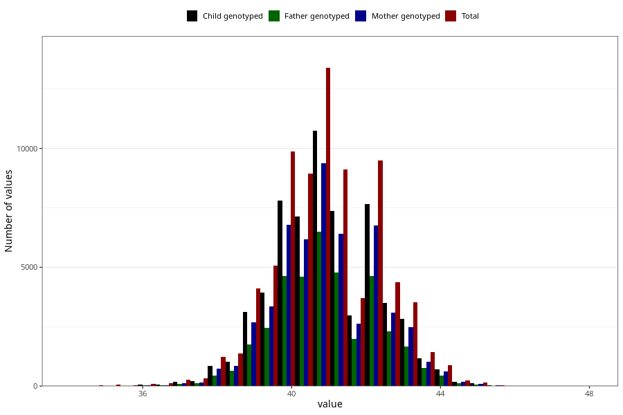

# hc_3m
Variable mapping to questionnaire: q4, question DD220.
.
- Number of values:

| Value | Total | Child genotyped | Mother genotyped | Father genotyped |
| ----- | ----- | --------------- | ---------------- | ---------------- |
| Missing | 35673 | 21596 | 18074 | 12103 |
| 34.1 | 2 | 0 | 0 |0 |
| 34.2 | 3 | 0 | 0 |0 |
| 34.4 | 1 | 1 | 1 |1 |
| 34.5 | 14 | 5 | 4 |2 |
| 34.6 | 4 | 2 | 2 |1 |
| 34.7 | 2 | 0 | 0 |0 |
| 34.8 | 3 | 0 | 0 |0 |
| 34.9 | 1 | 1 | 1 |1 |
| 35 | 41 | 11 | 7 |5 |
| 35.1 | 2 | 1 | 1 |1 |
| 35.2 | 4 | 1 | 1 |1 |
| 35.3 | 3 | 2 | 1 |1 |
| 35.4 | 7 | 1 | 0 |0 |
| 35.5 | 22 | 11 | 9 |7 |
| 35.6 | 5 | 2 | 2 |2 |
| 35.7 | 9 | 3 | 1 |1 |
| 35.8 | 5 | 2 | 2 |1 |
| 35.9 | 6 | 4 | 3 |2 |
| 36 | 73 | 39 | 35 |20 |
| 36.2 | 11 | 6 | 6 |4 |
| 36.3 | 10 | 3 | 3 |3 |
| 36.4 | 8 | 6 | 4 |2 |
| 36.5 | 68 | 30 | 21 |17 |
| 36.6 | 7 | 5 | 4 |3 |
| 36.7 | 10 | 7 | 5 |3 |
| 36.8 | 19 | 8 | 7 |4 |
| 36.9 | 16 | 8 | 5 |5 |
| 37 | 210 | 138 | 102 |69 |
| 37.1 | 8 | 4 | 4 |4 |
| 37.2 | 34 | 20 | 17 |11 |
| 37.3 | 32 | 17 | 10 |9 |
| 37.4 | 29 | 18 | 18 |14 |
| 37.5 | 202 | 118 | 95 |71 |
| 37.6 | 24 | 16 | 14 |9 |
| 37.7 | 43 | 30 | 25 |16 |
| 37.8 | 90 | 60 | 51 |37 |
| 37.9 | 37 | 27 | 25 |20 |
| 38 | 830 | 578 | 491 |287 |
| 38.1 | 71 | 48 | 39 |24 |
| 38.2 | 190 | 138 | 118 |86 |
| 38.3 | 145 | 107 | 86 |63 |
| 38.4 | 151 | 114 | 90 |70 |
| 38.5 | 879 | 647 | 555 |408 |
| 38.6 | 209 | 158 | 129 |94 |
| 38.7 | 251 | 183 | 161 |115 |
| 38.8 | 331 | 241 | 212 |153 |
| 38.9 | 177 | 130 | 110 |81 |
| 39 | 3125 | 2392 | 2072 |1307 |
| 39.1 | 227 | 174 | 144 |105 |
| 39.2 | 678 | 510 | 419 |300 |
| 39.3 | 527 | 400 | 344 |258 |
| 39.4 | 508 | 391 | 337 |246 |
| 39.5 | 2802 | 2197 | 1861 |1357 |
| 39.6 | 565 | 445 | 393 |290 |
| 39.7 | 646 | 497 | 424 |327 |
| 39.8 | 1102 | 859 | 728 |570 |
| 39.9 | 478 | 371 | 325 |246 |
| 40 | 7650 | 6076 | 5297 |3477 |
| 40.1 | 548 | 431 | 367 |277 |
| 40.2 | 1521 | 1193 | 1020 |767 |
| 40.3 | 1190 | 946 | 820 |619 |
| 40.4 | 893 | 715 | 630 |471 |
| 40.5 | 4803 | 3856 | 3336 |2477 |
| 40.6 | 1143 | 921 | 806 |609 |
| 40.7 | 1056 | 830 | 700 |522 |
| 40.8 | 1533 | 1221 | 1043 |796 |
| 40.9 | 636 | 514 | 457 |329 |
| 41 | 9020 | 7266 | 6377 |4247 |
| 41.1 | 601 | 480 | 430 |325 |
| 41.2 | 1704 | 1367 | 1188 |887 |
| 41.3 | 1212 | 985 | 840 |645 |
| 41.4 | 881 | 718 | 630 |466 |
| 41.5 | 4721 | 3817 | 3309 |2464 |
| 41.6 | 921 | 756 | 664 |489 |
| 41.7 | 901 | 721 | 629 |476 |
| 41.8 | 1402 | 1113 | 976 |748 |
| 41.9 | 484 | 380 | 343 |265 |
| 42 | 6767 | 5527 | 4868 |3210 |
| 42.1 | 445 | 361 | 317 |230 |
| 42.2 | 998 | 775 | 688 |530 |
| 42.3 | 799 | 619 | 545 |404 |
| 42.4 | 491 | 385 | 336 |255 |
| 42.5 | 2650 | 2115 | 1871 |1403 |
| 42.6 | 489 | 399 | 354 |270 |
| 42.7 | 425 | 338 | 298 |210 |
| 42.8 | 635 | 515 | 458 |341 |
| 42.9 | 174 | 139 | 118 |94 |
| 43 | 2740 | 2213 | 1944 |1265 |
| 43.1 | 152 | 118 | 103 |74 |
| 43.2 | 364 | 293 | 264 |184 |
| 43.3 | 261 | 205 | 180 |132 |
| 43.4 | 166 | 137 | 116 |88 |
| 43.5 | 809 | 664 | 579 |420 |
| 43.6 | 166 | 135 | 118 |90 |
| 43.7 | 145 | 112 | 95 |71 |
| 43.8 | 155 | 125 | 113 |82 |
| 43.9 | 53 | 43 | 39 |31 |
| 44 | 676 | 550 | 475 |324 |
| 44.1 | 31 | 29 | 23 |20 |
| 44.2 | 72 | 58 | 47 |38 |
| 44.3 | 44 | 33 | 29 |20 |
| 44.4 | 32 | 22 | 20 |16 |
| 44.5 | 161 | 137 | 121 |94 |
| 44.6 | 22 | 19 | 17 |9 |
| 44.7 | 17 | 13 | 10 |6 |
| 44.8 | 29 | 22 | 20 |14 |
| 44.9 | 3 | 3 | 3 |2 |
| 45 | 104 | 89 | 75 |54 |
| 45.1 | 4 | 3 | 3 |1 |
| 45.2 | 13 | 8 | 6 |5 |
| 45.3 | 10 | 9 | 7 |6 |
| 45.4 | 3 | 1 | 0 |0 |
| 45.5 | 24 | 18 | 17 |12 |
| 45.6 | 5 | 3 | 3 |1 |
| 45.7 | 5 | 4 | 4 |3 |
| 45.8 | 3 | 2 | 2 |1 |
| 45.9 | 1 | 1 | 1 |1 |
| 46 | 16 | 13 | 13 |9 |
| 46.4 | 2 | 2 | 1 |1 |
| 46.5 | 2 | 1 | 1 |1 |
| 46.8 | 1 | 1 | 1 |0 |
| 47 | 7 | 5 | 4 |1 |
| 47.3 | 1 | 1 | 1 |1 |
| 47.7 | 1 | 1 | 1 |1 |

