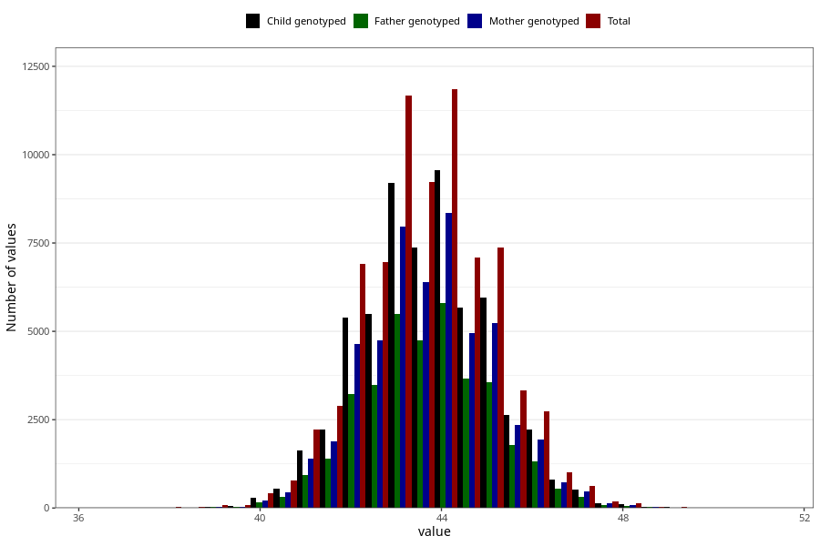

# hc_6m
Variable mapping to questionnaire: q4, question DD226.
.
- Number of values:

| Value | Total | Child genotyped | Mother genotyped | Father genotyped |
| ----- | ----- | --------------- | ---------------- | ---------------- |
| Missing | 37906 | 23447 | 19682 | 13198 |
| 36.3 | 1 | 1 | 1 |0 |
| 37 | 9 | 4 | 3 |4 |
| 37.3 | 1 | 1 | 1 |1 |
| 37.4 | 2 | 1 | 1 |0 |
| 37.5 | 5 | 3 | 2 |2 |
| 37.7 | 1 | 1 | 1 |1 |
| 37.8 | 3 | 0 | 0 |0 |
| 38 | 16 | 9 | 6 |4 |
| 38.1 | 1 | 0 | 0 |0 |
| 38.2 | 4 | 0 | 0 |0 |
| 38.3 | 1 | 0 | 0 |0 |
| 38.4 | 2 | 1 | 1 |1 |
| 38.5 | 13 | 5 | 3 |2 |
| 38.6 | 2 | 1 | 0 |0 |
| 38.7 | 3 | 0 | 0 |0 |
| 38.8 | 5 | 1 | 1 |1 |
| 38.9 | 5 | 2 | 2 |2 |
| 39 | 50 | 26 | 22 |18 |
| 39.1 | 5 | 3 | 2 |2 |
| 39.2 | 16 | 9 | 4 |2 |
| 39.3 | 11 | 4 | 4 |4 |
| 39.4 | 10 | 8 | 7 |3 |
| 39.5 | 46 | 26 | 22 |16 |
| 39.6 | 12 | 3 | 2 |1 |
| 39.7 | 17 | 6 | 5 |4 |
| 39.8 | 26 | 18 | 13 |11 |
| 39.9 | 19 | 16 | 15 |10 |
| 40 | 261 | 180 | 142 |90 |
| 40.1 | 29 | 22 | 15 |13 |
| 40.2 | 78 | 51 | 39 |27 |
| 40.3 | 45 | 29 | 28 |17 |
| 40.4 | 55 | 39 | 32 |22 |
| 40.5 | 315 | 218 | 189 |139 |
| 40.6 | 94 | 65 | 53 |37 |
| 40.7 | 110 | 83 | 72 |54 |
| 40.8 | 159 | 109 | 81 |56 |
| 40.9 | 69 | 41 | 35 |27 |
| 41 | 1385 | 1037 | 870 |547 |
| 41.1 | 120 | 92 | 79 |63 |
| 41.2 | 346 | 247 | 205 |139 |
| 41.3 | 291 | 224 | 199 |152 |
| 41.4 | 227 | 175 | 143 |123 |
| 41.5 | 1374 | 1043 | 893 |645 |
| 41.6 | 357 | 276 | 239 |184 |
| 41.7 | 375 | 295 | 253 |182 |
| 41.8 | 560 | 420 | 363 |270 |
| 41.9 | 262 | 206 | 179 |130 |
| 42 | 4526 | 3536 | 3041 |2032 |
| 42.1 | 338 | 276 | 236 |171 |
| 42.2 | 901 | 693 | 591 |442 |
| 42.3 | 885 | 686 | 596 |449 |
| 42.4 | 551 | 429 | 379 |279 |
| 42.5 | 3487 | 2773 | 2412 |1799 |
| 42.6 | 774 | 614 | 520 |400 |
| 42.7 | 846 | 649 | 557 |389 |
| 42.8 | 1313 | 1021 | 884 |628 |
| 42.9 | 480 | 365 | 322 |242 |
| 43 | 7980 | 6316 | 5468 |3628 |
| 43.1 | 538 | 417 | 363 |267 |
| 43.2 | 1430 | 1136 | 998 |740 |
| 43.3 | 1244 | 958 | 825 |613 |
| 43.4 | 873 | 693 | 596 |435 |
| 43.5 | 4778 | 3835 | 3315 |2465 |
| 43.6 | 942 | 754 | 661 |500 |
| 43.7 | 1113 | 879 | 761 |578 |
| 43.8 | 1527 | 1203 | 1053 |767 |
| 43.9 | 565 | 467 | 407 |311 |
| 44 | 8376 | 6797 | 5952 |3983 |
| 44.1 | 540 | 429 | 365 |302 |
| 44.2 | 1308 | 1023 | 896 |654 |
| 44.3 | 1060 | 845 | 735 |551 |
| 44.4 | 736 | 600 | 526 |389 |
| 44.5 | 3905 | 3166 | 2791 |2060 |
| 44.6 | 752 | 571 | 491 |366 |
| 44.7 | 751 | 577 | 501 |364 |
| 44.8 | 938 | 755 | 650 |490 |
| 44.9 | 372 | 301 | 259 |207 |
| 45 | 5436 | 4392 | 3871 |2529 |
| 45.1 | 318 | 265 | 229 |176 |
| 45.2 | 680 | 537 | 478 |361 |
| 45.3 | 555 | 454 | 393 |279 |
| 45.4 | 404 | 312 | 289 |230 |
| 45.5 | 1855 | 1480 | 1325 |1029 |
| 45.6 | 359 | 276 | 242 |182 |
| 45.7 | 295 | 237 | 200 |151 |
| 45.8 | 411 | 335 | 288 |200 |
| 45.9 | 156 | 119 | 105 |81 |
| 46 | 2080 | 1679 | 1482 |954 |
| 46.1 | 112 | 89 | 80 |62 |
| 46.2 | 216 | 180 | 156 |123 |
| 46.3 | 171 | 142 | 117 |91 |
| 46.4 | 113 | 93 | 81 |59 |
| 46.5 | 592 | 481 | 416 |314 |
| 46.6 | 88 | 68 | 62 |47 |
| 46.7 | 85 | 68 | 63 |50 |
| 46.8 | 127 | 106 | 93 |76 |
| 46.9 | 28 | 24 | 21 |20 |
| 47 | 514 | 419 | 375 |251 |
| 47.1 | 25 | 22 | 21 |17 |
| 47.2 | 36 | 31 | 28 |21 |
| 47.3 | 32 | 24 | 23 |18 |
| 47.4 | 20 | 16 | 16 |10 |
| 47.5 | 116 | 93 | 80 |59 |
| 47.6 | 13 | 11 | 10 |9 |
| 47.7 | 11 | 10 | 8 |6 |
| 47.8 | 14 | 10 | 8 |6 |
| 47.9 | 4 | 2 | 2 |2 |
| 48 | 115 | 86 | 77 |48 |
| 48.1 | 6 | 5 | 4 |4 |
| 48.2 | 8 | 7 | 6 |6 |
| 48.3 | 9 | 7 | 6 |3 |
| 48.4 | 4 | 3 | 3 |2 |
| 48.5 | 29 | 23 | 20 |16 |
| 48.6 | 5 | 3 | 3 |3 |
| 48.7 | 1 | 1 | 1 |0 |
| 48.8 | 6 | 4 | 4 |2 |
| 48.9 | 1 | 0 | 0 |0 |
| 49 | 23 | 17 | 12 |10 |
| 49.1 | 2 | 2 | 2 |2 |
| 49.2 | 1 | 1 | 1 |0 |
| 49.3 | 2 | 1 | 1 |1 |
| 49.5 | 2 | 1 | 1 |0 |
| 49.7 | 2 | 1 | 1 |1 |
| 49.8 | 1 | 1 | 1 |0 |
| 49.9 | 3 | 2 | 2 |1 |
| 50 | 2 | 1 | 0 |0 |
| 50.6 | 1 | 1 | 1 |1 |
| 51 | 1 | 1 | 1 |0 |

