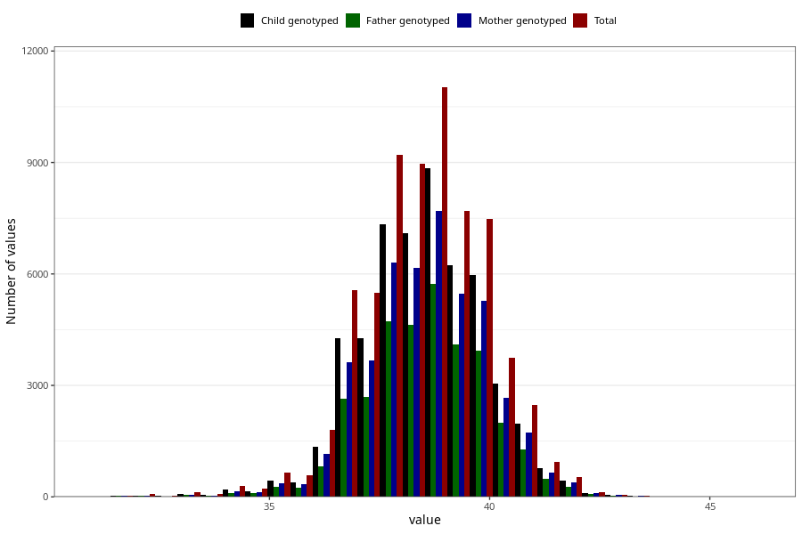

# hc_6w
Variable mapping to questionnaire: q4, question DD214.
.
- Number of values:

| Value | Total | Child genotyped | Mother genotyped | Father genotyped |
| ----- | ----- | --------------- | ---------------- | ---------------- |
| Missing | 46352 | 30174 | 25667 | 15917 |
| 31.2 | 1 | 0 | 0 |0 |
| 31.3 | 4 | 4 | 4 |3 |
| 31.4 | 5 | 2 | 2 |1 |
| 31.5 | 23 | 16 | 13 |12 |
| 31.6 | 1 | 1 | 1 |1 |
| 31.7 | 4 | 2 | 1 |0 |
| 31.8 | 6 | 6 | 6 |6 |
| 31.9 | 3 | 3 | 3 |2 |
| 32 | 53 | 26 | 25 |18 |
| 32.1 | 1 | 1 | 1 |1 |
| 32.2 | 7 | 4 | 3 |1 |
| 32.3 | 1 | 0 | 0 |0 |
| 32.4 | 3 | 2 | 1 |1 |
| 32.5 | 19 | 11 | 11 |7 |
| 32.6 | 5 | 4 | 4 |3 |
| 32.7 | 2 | 2 | 1 |1 |
| 32.8 | 8 | 3 | 2 |1 |
| 32.9 | 2 | 1 | 0 |0 |
| 33 | 95 | 63 | 51 |38 |
| 33.1 | 4 | 1 | 1 |1 |
| 33.2 | 10 | 4 | 4 |2 |
| 33.3 | 10 | 6 | 5 |6 |
| 33.4 | 9 | 4 | 4 |3 |
| 33.5 | 46 | 22 | 19 |13 |
| 33.6 | 5 | 4 | 3 |3 |
| 33.7 | 9 | 6 | 2 |2 |
| 33.8 | 16 | 9 | 8 |7 |
| 33.9 | 10 | 7 | 6 |7 |
| 34 | 232 | 151 | 123 |84 |
| 34.1 | 10 | 6 | 6 |4 |
| 34.2 | 24 | 12 | 9 |7 |
| 34.3 | 13 | 7 | 5 |4 |
| 34.4 | 17 | 15 | 12 |9 |
| 34.5 | 130 | 83 | 73 |52 |
| 34.6 | 18 | 14 | 10 |5 |
| 34.7 | 29 | 21 | 17 |16 |
| 34.8 | 39 | 24 | 22 |15 |
| 34.9 | 13 | 6 | 5 |3 |
| 35 | 470 | 314 | 260 |182 |
| 35.1 | 31 | 20 | 14 |15 |
| 35.2 | 54 | 34 | 33 |26 |
| 35.3 | 38 | 24 | 20 |13 |
| 35.4 | 51 | 35 | 29 |22 |
| 35.5 | 291 | 200 | 170 |123 |
| 35.6 | 73 | 48 | 44 |34 |
| 35.7 | 84 | 57 | 52 |38 |
| 35.8 | 104 | 74 | 61 |47 |
| 35.9 | 38 | 20 | 19 |14 |
| 36 | 1123 | 830 | 695 |505 |
| 36.1 | 71 | 56 | 50 |31 |
| 36.2 | 262 | 189 | 168 |120 |
| 36.3 | 162 | 135 | 117 |90 |
| 36.4 | 186 | 142 | 124 |86 |
| 36.5 | 1144 | 842 | 713 |525 |
| 36.6 | 224 | 176 | 159 |113 |
| 36.7 | 298 | 225 | 187 |131 |
| 36.8 | 424 | 313 | 267 |198 |
| 36.9 | 156 | 114 | 98 |77 |
| 37 | 3322 | 2592 | 2201 |1588 |
| 37.1 | 222 | 161 | 145 |109 |
| 37.2 | 729 | 561 | 477 |339 |
| 37.3 | 552 | 427 | 362 |250 |
| 37.4 | 540 | 427 | 365 |273 |
| 37.5 | 3438 | 2704 | 2321 |1710 |
| 37.6 | 610 | 475 | 408 |320 |
| 37.7 | 650 | 501 | 437 |324 |
| 37.8 | 1120 | 898 | 777 |553 |
| 37.9 | 386 | 303 | 259 |217 |
| 38 | 6446 | 5157 | 4432 |3315 |
| 38.1 | 498 | 392 | 335 |257 |
| 38.2 | 1444 | 1154 | 991 |755 |
| 38.3 | 1058 | 832 | 713 |556 |
| 38.4 | 890 | 702 | 624 |451 |
| 38.5 | 5064 | 4009 | 3494 |2615 |
| 38.6 | 921 | 744 | 635 |501 |
| 38.7 | 976 | 772 | 679 |505 |
| 38.8 | 1388 | 1114 | 977 |727 |
| 38.9 | 558 | 441 | 381 |285 |
| 39 | 7179 | 5779 | 5016 |3707 |
| 39.1 | 525 | 432 | 371 |279 |
| 39.2 | 1283 | 1029 | 897 |669 |
| 39.3 | 922 | 741 | 635 |480 |
| 39.4 | 827 | 671 | 597 |442 |
| 39.5 | 4142 | 3359 | 2958 |2232 |
| 39.6 | 710 | 582 | 507 |386 |
| 39.7 | 627 | 512 | 455 |347 |
| 39.8 | 1061 | 829 | 739 |539 |
| 39.9 | 401 | 318 | 285 |216 |
| 40 | 4677 | 3730 | 3280 |2451 |
| 40.1 | 326 | 260 | 232 |176 |
| 40.2 | 684 | 557 | 478 |364 |
| 40.3 | 524 | 421 | 365 |282 |
| 40.4 | 350 | 282 | 244 |187 |
| 40.5 | 1870 | 1536 | 1350 |993 |
| 40.6 | 310 | 256 | 225 |163 |
| 40.7 | 277 | 216 | 181 |141 |
| 40.8 | 352 | 289 | 259 |194 |
| 40.9 | 114 | 89 | 78 |61 |
| 41 | 1418 | 1126 | 979 |718 |
| 41.1 | 85 | 67 | 60 |53 |
| 41.2 | 215 | 172 | 155 |107 |
| 41.3 | 121 | 99 | 82 |63 |
| 41.4 | 78 | 67 | 54 |44 |
| 41.5 | 444 | 363 | 310 |228 |
| 41.6 | 71 | 57 | 50 |35 |
| 41.7 | 57 | 47 | 40 |25 |
| 41.8 | 78 | 68 | 63 |46 |
| 41.9 | 24 | 21 | 15 |10 |
| 42 | 289 | 240 | 208 |153 |
| 42.1 | 14 | 9 | 8 |6 |
| 42.2 | 24 | 17 | 16 |10 |
| 42.3 | 24 | 22 | 19 |15 |
| 42.4 | 8 | 6 | 4 |4 |
| 42.5 | 67 | 59 | 54 |38 |
| 42.6 | 10 | 5 | 4 |3 |
| 42.7 | 8 | 7 | 4 |4 |
| 42.8 | 13 | 11 | 10 |8 |
| 42.9 | 3 | 2 | 2 |1 |
| 43 | 40 | 31 | 29 |22 |
| 43.2 | 3 | 3 | 3 |2 |
| 43.3 | 4 | 2 | 2 |2 |
| 43.4 | 2 | 2 | 2 |2 |
| 43.5 | 14 | 12 | 11 |7 |
| 43.6 | 3 | 2 | 2 |2 |
| 44 | 1 | 1 | 1 |1 |
| 44.4 | 1 | 1 | 1 |1 |
| 44.5 | 2 | 2 | 2 |1 |
| 44.6 | 1 | 1 | 1 |0 |
| 45 | 1 | 0 | 0 |0 |
| 45.7 | 1 | 1 | 0 |0 |
| 46 | 3 | 3 | 3 |2 |

