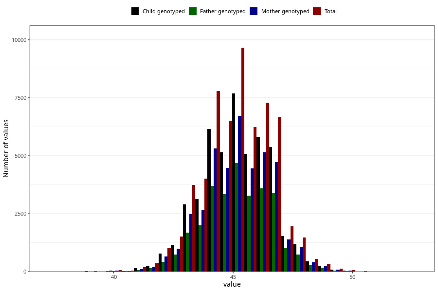

# hc_8m
Variable mapping to questionnaire: q5, question EE388.
.
- Number of values:

| Value | Total | Child genotyped | Mother genotyped | Father genotyped |
| ----- | ----- | --------------- | ---------------- | ---------------- |
| Missing | 53898 | 36002 | 30479 | 20754 |
| 37.6 | 1 | 1 | 0 |0 |
| 37.8 | 1 | 1 | 1 |0 |
| 38 | 7 | 4 | 2 |2 |
| 38.4 | 2 | 2 | 2 |1 |
| 38.5 | 6 | 4 | 3 |3 |
| 38.8 | 1 | 1 | 1 |1 |
| 38.9 | 1 | 1 | 1 |0 |
| 39 | 16 | 13 | 10 |8 |
| 39.2 | 2 | 1 | 1 |0 |
| 39.3 | 2 | 2 | 2 |1 |
| 39.4 | 4 | 1 | 0 |0 |
| 39.5 | 9 | 6 | 5 |5 |
| 39.7 | 2 | 1 | 1 |0 |
| 39.8 | 4 | 1 | 1 |1 |
| 39.9 | 1 | 1 | 1 |0 |
| 40 | 56 | 38 | 33 |23 |
| 40.1 | 3 | 2 | 1 |2 |
| 40.2 | 5 | 2 | 2 |2 |
| 40.3 | 6 | 2 | 1 |1 |
| 40.4 | 4 | 4 | 4 |2 |
| 40.5 | 30 | 15 | 10 |7 |
| 40.6 | 4 | 3 | 2 |2 |
| 40.7 | 9 | 7 | 6 |4 |
| 40.8 | 6 | 4 | 3 |2 |
| 40.9 | 2 | 0 | 0 |0 |
| 41 | 130 | 92 | 62 |42 |
| 41.1 | 10 | 5 | 4 |3 |
| 41.2 | 32 | 20 | 17 |12 |
| 41.3 | 31 | 26 | 21 |17 |
| 41.4 | 23 | 21 | 16 |13 |
| 41.5 | 133 | 95 | 75 |54 |
| 41.6 | 50 | 33 | 26 |17 |
| 41.7 | 66 | 46 | 39 |27 |
| 41.8 | 86 | 62 | 50 |31 |
| 41.9 | 26 | 22 | 17 |11 |
| 42 | 642 | 501 | 421 |267 |
| 42.1 | 48 | 40 | 32 |24 |
| 42.2 | 141 | 98 | 82 |51 |
| 42.3 | 164 | 127 | 112 |77 |
| 42.4 | 100 | 74 | 58 |47 |
| 42.5 | 640 | 493 | 428 |316 |
| 42.6 | 155 | 117 | 99 |70 |
| 42.7 | 193 | 146 | 123 |99 |
| 42.8 | 293 | 217 | 187 |134 |
| 42.9 | 137 | 106 | 94 |77 |
| 43 | 2299 | 1783 | 1537 |1009 |
| 43.1 | 185 | 143 | 126 |86 |
| 43.2 | 461 | 351 | 303 |213 |
| 43.3 | 441 | 348 | 293 |216 |
| 43.4 | 357 | 272 | 233 |166 |
| 43.5 | 1937 | 1507 | 1291 |969 |
| 43.6 | 443 | 339 | 289 |199 |
| 43.7 | 517 | 401 | 338 |250 |
| 43.8 | 815 | 646 | 561 |428 |
| 43.9 | 296 | 233 | 192 |151 |
| 44 | 5051 | 3987 | 3455 |2323 |
| 44.1 | 415 | 331 | 285 |220 |
| 44.2 | 919 | 707 | 618 |459 |
| 44.3 | 819 | 654 | 552 |391 |
| 44.4 | 585 | 471 | 411 |312 |
| 44.5 | 3515 | 2776 | 2442 |1806 |
| 44.6 | 744 | 600 | 521 |395 |
| 44.7 | 768 | 603 | 518 |399 |
| 44.8 | 1043 | 827 | 706 |513 |
| 44.9 | 436 | 340 | 296 |225 |
| 45 | 6522 | 5193 | 4521 |3050 |
| 45.1 | 459 | 373 | 319 |232 |
| 45.2 | 1147 | 906 | 789 |586 |
| 45.3 | 857 | 679 | 607 |447 |
| 45.4 | 670 | 545 | 484 |360 |
| 45.5 | 3452 | 2795 | 2456 |1805 |
| 45.6 | 744 | 609 | 532 |392 |
| 45.7 | 711 | 582 | 510 |367 |
| 45.8 | 930 | 756 | 663 |499 |
| 45.9 | 395 | 317 | 285 |209 |
| 46 | 5087 | 4100 | 3633 |2458 |
| 46.1 | 315 | 243 | 215 |167 |
| 46.2 | 790 | 627 | 543 |395 |
| 46.3 | 629 | 495 | 432 |335 |
| 46.4 | 462 | 355 | 315 |237 |
| 46.5 | 2268 | 1826 | 1593 |1223 |
| 46.6 | 410 | 324 | 290 |202 |
| 46.7 | 462 | 379 | 333 |255 |
| 46.8 | 600 | 477 | 420 |300 |
| 46.9 | 200 | 159 | 143 |109 |
| 47 | 2748 | 2220 | 1958 |1326 |
| 47.1 | 137 | 105 | 93 |70 |
| 47.2 | 386 | 301 | 270 |198 |
| 47.3 | 304 | 245 | 224 |162 |
| 47.4 | 175 | 130 | 113 |77 |
| 47.5 | 947 | 766 | 681 |514 |
| 47.6 | 178 | 139 | 124 |93 |
| 47.7 | 145 | 116 | 107 |78 |
| 47.8 | 226 | 182 | 164 |115 |
| 47.9 | 61 | 49 | 43 |28 |
| 48 | 873 | 696 | 621 |419 |
| 48.1 | 60 | 45 | 40 |32 |
| 48.2 | 117 | 97 | 83 |60 |
| 48.3 | 85 | 69 | 60 |44 |
| 48.4 | 47 | 38 | 35 |25 |
| 48.5 | 244 | 204 | 181 |132 |
| 48.6 | 27 | 22 | 19 |15 |
| 48.7 | 48 | 38 | 38 |31 |
| 48.8 | 49 | 36 | 32 |25 |
| 48.9 | 18 | 11 | 11 |8 |
| 49 | 188 | 150 | 133 |95 |
| 49.1 | 13 | 13 | 11 |5 |
| 49.2 | 18 | 12 | 11 |7 |
| 49.3 | 23 | 16 | 15 |9 |
| 49.4 | 11 | 10 | 7 |7 |
| 49.5 | 57 | 44 | 38 |23 |
| 49.6 | 11 | 9 | 7 |7 |
| 49.7 | 8 | 6 | 6 |6 |
| 49.8 | 3 | 3 | 2 |0 |
| 49.9 | 5 | 4 | 4 |3 |
| 50 | 38 | 29 | 27 |19 |
| 50.1 | 3 | 2 | 1 |1 |
| 50.2 | 5 | 3 | 3 |2 |
| 50.3 | 4 | 4 | 3 |3 |
| 50.4 | 1 | 1 | 1 |1 |
| 50.5 | 6 | 5 | 4 |2 |
| 50.8 | 1 | 1 | 1 |1 |
| 50.9 | 2 | 2 | 2 |1 |
| 51 | 9 | 9 | 8 |6 |
| 52 | 3 | 3 | 2 |0 |
| 52.5 | 1 | 1 | 1 |0 |

