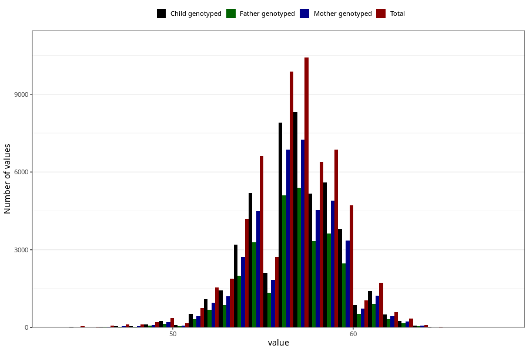

# length_6w
Variable mapping to questionnaire: q4, question DD213.
.
- Number of values:

| Value | Total | Child genotyped | Mother genotyped | Father genotyped |
| ----- | ----- | --------------- | ---------------- | ---------------- |
| Missing | 52664 | 35211 | 29917 | 19396 |
| 44 | 14 | 9 | 8 |7 |
| 44.5 | 4 | 3 | 3 |3 |
| 45 | 39 | 15 | 13 |8 |
| 45.2 | 1 | 0 | 0 |0 |
| 45.5 | 19 | 10 | 10 |7 |
| 45.8 | 1 | 1 | 1 |1 |
| 46 | 65 | 23 | 20 |13 |
| 46.2 | 1 | 1 | 1 |1 |
| 46.5 | 12 | 7 | 6 |6 |
| 46.7 | 1 | 0 | 0 |0 |
| 46.8 | 1 | 1 | 0 |0 |
| 47 | 77 | 34 | 28 |21 |
| 47.1 | 1 | 0 | 0 |0 |
| 47.2 | 2 | 2 | 2 |2 |
| 47.3 | 2 | 0 | 0 |0 |
| 47.5 | 32 | 17 | 16 |13 |
| 47.6 | 2 | 2 | 2 |0 |
| 47.7 | 2 | 2 | 2 |2 |
| 48 | 107 | 51 | 43 |29 |
| 48.2 | 3 | 0 | 0 |0 |
| 48.3 | 3 | 2 | 2 |1 |
| 48.5 | 50 | 27 | 22 |18 |
| 48.6 | 1 | 1 | 1 |1 |
| 48.7 | 1 | 1 | 1 |1 |
| 49 | 164 | 87 | 72 |50 |
| 49.2 | 2 | 1 | 1 |1 |
| 49.25 | 1 | 0 | 0 |0 |
| 49.5 | 66 | 45 | 34 |20 |
| 49.6 | 1 | 1 | 1 |1 |
| 49.7 | 1 | 0 | 0 |0 |
| 49.7661203941958 | 1 | 1 | 1 |1 |
| 49.8 | 3 | 1 | 1 |0 |
| 49.9 | 1 | 1 | 0 |1 |
| 50 | 301 | 200 | 166 |116 |
| 50.1 | 1 | 0 | 0 |0 |
| 50.2 | 6 | 2 | 1 |2 |
| 50.3 | 3 | 2 | 2 |1 |
| 50.4 | 1 | 0 | 0 |0 |
| 50.5 | 133 | 90 | 73 |52 |
| 50.6 | 2 | 2 | 2 |2 |
| 50.7 | 2 | 2 | 1 |1 |
| 50.8 | 6 | 6 | 6 |4 |
| 51 | 475 | 328 | 268 |183 |
| 51.1 | 3 | 2 | 2 |2 |
| 51.2 | 8 | 3 | 3 |2 |
| 51.3 | 5 | 3 | 3 |2 |
| 51.4 | 1 | 1 | 0 |0 |
| 51.5 | 259 | 184 | 157 |120 |
| 51.6 | 6 | 3 | 2 |3 |
| 51.7 | 6 | 2 | 1 |1 |
| 51.8 | 9 | 4 | 3 |3 |
| 51.9 | 2 | 2 | 2 |2 |
| 52 | 974 | 703 | 602 |440 |
| 52.1 | 4 | 4 | 4 |3 |
| 52.2 | 16 | 11 | 9 |6 |
| 52.3 | 17 | 13 | 11 |8 |
| 52.3741134751773 | 1 | 0 | 0 |0 |
| 52.4 | 2 | 2 | 2 |0 |
| 52.5 | 518 | 364 | 317 |224 |
| 52.5795313981768 | 1 | 0 | 0 |0 |
| 52.6 | 6 | 5 | 4 |3 |
| 52.7 | 14 | 10 | 8 |8 |
| 52.8 | 12 | 8 | 8 |6 |
| 52.8421296941153 | 1 | 1 | 0 |0 |
| 52.9 | 1 | 1 | 0 |0 |
| 53 | 1795 | 1370 | 1166 |835 |
| 53.0925925925926 | 1 | 1 | 1 |1 |
| 53.1 | 6 | 3 | 3 |2 |
| 53.2 | 23 | 18 | 12 |8 |
| 53.2845528455285 | 1 | 1 | 0 |0 |
| 53.3 | 20 | 15 | 12 |8 |
| 53.4 | 8 | 8 | 5 |1 |
| 53.5 | 948 | 709 | 617 |416 |
| 53.5688377534245 | 1 | 0 | 0 |0 |
| 53.6 | 9 | 5 | 4 |3 |
| 53.7 | 12 | 11 | 9 |4 |
| 53.8 | 18 | 8 | 5 |5 |
| 53.8377552982844 | 1 | 1 | 1 |1 |
| 53.9 | 7 | 7 | 5 |3 |
| 54 | 3138 | 2394 | 2048 |1528 |
| 54.0367508234145 | 1 | 0 | 0 |0 |
| 54.1 | 5 | 5 | 4 |4 |
| 54.1481079415084 | 1 | 1 | 0 |0 |
| 54.1581021300366 | 1 | 1 | 1 |1 |
| 54.2 | 52 | 39 | 30 |22 |
| 54.3 | 36 | 29 | 27 |18 |
| 54.3719512195122 | 1 | 1 | 1 |1 |
| 54.4 | 24 | 20 | 18 |16 |
| 54.5 | 1652 | 1289 | 1098 |797 |
| 54.6 | 27 | 19 | 17 |14 |
| 54.7 | 21 | 16 | 13 |8 |
| 54.8 | 36 | 25 | 21 |13 |
| 54.9 | 7 | 6 | 6 |5 |
| 54.9884140571857 | 1 | 1 | 1 |1 |
| 55 | 4805 | 3788 | 3285 |2419 |
| 55.0490280786254 | 1 | 1 | 1 |1 |
| 55.0948581560284 | 1 | 1 | 0 |0 |
| 55.1 | 13 | 9 | 8 |5 |
| 55.1100549004935 | 1 | 1 | 1 |1 |
| 55.125 | 2 | 0 | 0 |0 |
| 55.2 | 59 | 46 | 40 |34 |
| 55.3 | 57 | 45 | 38 |30 |
| 55.4 | 23 | 18 | 17 |14 |
| 55.5 | 2437 | 1894 | 1641 |1197 |
| 55.5332073036118 | 1 | 1 | 1 |1 |
| 55.6 | 36 | 29 | 28 |19 |
| 55.7 | 42 | 36 | 31 |26 |
| 55.8 | 39 | 30 | 27 |22 |
| 55.9 | 10 | 7 | 5 |3 |
| 56 | 6600 | 5309 | 4616 |3450 |
| 56.0253003373465 | 1 | 1 | 1 |1 |
| 56.0420249321382 | 1 | 1 | 1 |1 |
| 56.0531914893617 | 1 | 1 | 0 |0 |
| 56.1 | 31 | 20 | 15 |13 |
| 56.1196147089339 | 1 | 0 | 0 |0 |
| 56.2 | 66 | 53 | 45 |30 |
| 56.25 | 1 | 1 | 0 |0 |
| 56.3 | 70 | 56 | 45 |33 |
| 56.3842859802644 | 1 | 1 | 1 |1 |
| 56.3940886699507 | 1 | 1 | 1 |0 |
| 56.4 | 37 | 30 | 25 |17 |
| 56.4627405270209 | 1 | 1 | 1 |1 |
| 56.5 | 2965 | 2355 | 2056 |1512 |
| 56.6 | 80 | 61 | 54 |35 |
| 56.6466236767645 | 1 | 0 | 0 |0 |
| 56.6862571919399 | 1 | 1 | 1 |1 |
| 56.7 | 54 | 40 | 32 |20 |
| 56.8 | 60 | 47 | 38 |29 |
| 56.8774440281401 | 1 | 1 | 1 |1 |
| 56.9 | 21 | 12 | 11 |6 |
| 57 | 6973 | 5556 | 4870 |3614 |
| 57.0283687943262 | 1 | 1 | 0 |0 |
| 57.1 | 24 | 21 | 15 |14 |
| 57.2 | 91 | 76 | 62 |48 |
| 57.2295566502463 | 1 | 1 | 1 |1 |
| 57.3 | 84 | 67 | 56 |46 |
| 57.4 | 40 | 28 | 23 |13 |
| 57.5 | 3065 | 2456 | 2142 |1598 |
| 57.6 | 47 | 36 | 33 |23 |
| 57.6292008757526 | 1 | 1 | 1 |1 |
| 57.6875 | 1 | 0 | 0 |0 |
| 57.7 | 60 | 47 | 39 |30 |
| 57.8 | 63 | 53 | 46 |33 |
| 57.9 | 10 | 9 | 6 |5 |
| 58 | 6046 | 4895 | 4286 |3151 |
| 58.1 | 28 | 22 | 18 |11 |
| 58.2 | 81 | 70 | 65 |47 |
| 58.3 | 57 | 42 | 40 |27 |
| 58.4 | 32 | 28 | 28 |19 |
| 58.4827586206897 | 1 | 1 | 1 |1 |
| 58.5 | 2417 | 1961 | 1742 |1287 |
| 58.5298565181664 | 1 | 1 | 0 |0 |
| 58.6 | 39 | 32 | 27 |19 |
| 58.7 | 46 | 38 | 33 |23 |
| 58.8 | 50 | 36 | 29 |26 |
| 58.8440029295577 | 1 | 1 | 1 |1 |
| 58.8818743128771 | 1 | 1 | 1 |1 |
| 58.9 | 9 | 7 | 6 |5 |
| 59 | 4248 | 3473 | 3023 |2239 |
| 59.0576125246589 | 1 | 1 | 1 |0 |
| 59.1 | 15 | 14 | 11 |10 |
| 59.2 | 76 | 60 | 51 |42 |
| 59.3 | 39 | 34 | 32 |22 |
| 59.4 | 30 | 26 | 23 |20 |
| 59.5 | 1581 | 1283 | 1128 |846 |
| 59.6 | 32 | 24 | 22 |14 |
| 59.6041666666667 | 1 | 0 | 0 |0 |
| 59.7 | 18 | 16 | 16 |11 |
| 59.8 | 28 | 24 | 22 |16 |
| 59.8703703703704 | 1 | 1 | 1 |1 |
| 59.9 | 8 | 7 | 7 |5 |
| 60 | 2898 | 2345 | 2065 |1507 |
| 60.1 | 6 | 5 | 5 |4 |
| 60.2 | 36 | 33 | 27 |21 |
| 60.3 | 26 | 22 | 19 |10 |
| 60.4 | 11 | 8 | 6 |6 |
| 60.5 | 942 | 767 | 649 |454 |
| 60.6 | 9 | 6 | 5 |5 |
| 60.7 | 14 | 12 | 12 |10 |
| 60.8 | 10 | 10 | 9 |7 |
| 60.9 | 4 | 2 | 2 |2 |
| 61 | 1293 | 1054 | 924 |678 |
| 61.1 | 6 | 3 | 2 |2 |
| 61.2 | 19 | 14 | 12 |10 |
| 61.3 | 10 | 10 | 8 |6 |
| 61.4 | 4 | 4 | 4 |4 |
| 61.5 | 389 | 319 | 282 |215 |
| 61.6 | 4 | 4 | 2 |2 |
| 61.7 | 6 | 5 | 5 |4 |
| 61.8 | 1 | 1 | 1 |1 |
| 61.9 | 2 | 1 | 1 |1 |
| 62 | 571 | 478 | 427 |310 |
| 62.1 | 3 | 3 | 3 |3 |
| 62.2 | 5 | 5 | 4 |5 |
| 62.3 | 4 | 2 | 2 |2 |
| 62.5 | 154 | 121 | 108 |82 |
| 62.7 | 2 | 2 | 2 |1 |
| 62.8 | 1 | 1 | 1 |1 |
| 62.9 | 2 | 2 | 2 |1 |
| 63 | 177 | 133 | 112 |81 |
| 63.1 | 2 | 1 | 0 |1 |
| 63.2 | 1 | 1 | 1 |1 |
| 63.3 | 2 | 2 | 2 |1 |
| 63.4 | 1 | 1 | 1 |0 |
| 63.5 | 50 | 34 | 30 |20 |
| 64 | 52 | 42 | 36 |30 |
| 64.2 | 1 | 1 | 1 |0 |
| 64.5 | 18 | 17 | 15 |11 |
| 65 | 7 | 6 | 6 |5 |
| 65.5 | 4 | 3 | 3 |2 |
| 66 | 6 | 6 | 6 |3 |
| 66.5 | 1 | 1 | 1 |1 |
| 66.9 | 1 | 1 | 1 |1 |
| 67 | 2 | 0 | 0 |0 |
| 68 | 2 | 1 | 0 |1 |

