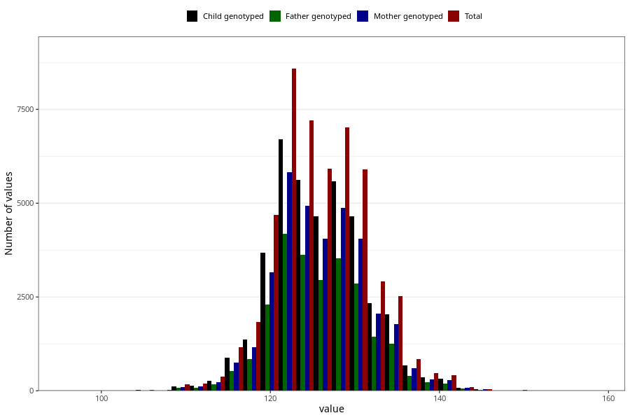

# length_7y
- Number of values:

| Value | Total | Child genotyped | Mother genotyped | Father genotyped |
| ----- | ----- | --------------- | ---------------- | ---------------- |
| Missing | 63180 | 43748 | 37338 | 25432 |
| 97 | 1 | 1 | 1 |0 |
| 98 | 2 | 2 | 1 |1 |
| 100 | 1 | 0 | 0 |0 |
| 101 | 2 | 2 | 0 |0 |
| 102 | 6 | 5 | 2 |0 |
| 103 | 2 | 0 | 0 |0 |
| 104 | 6 | 3 | 3 |3 |
| 105 | 15 | 8 | 5 |5 |
| 106 | 10 | 7 | 5 |5 |
| 107 | 7 | 4 | 3 |1 |
| 108 | 14 | 10 | 9 |4 |
| 109 | 19 | 16 | 14 |8 |
| 110 | 145 | 101 | 84 |63 |
| 111 | 50 | 39 | 28 |21 |
| 111.212790013411 | 1 | 0 | 0 |0 |
| 112 | 143 | 105 | 84 |65 |
| 113 | 153 | 108 | 87 |68 |
| 114 | 218 | 163 | 145 |103 |
| 114.385725946483 | 1 | 0 | 0 |0 |
| 115 | 452 | 344 | 294 |212 |
| 115.328125 | 2 | 0 | 0 |0 |
| 116 | 706 | 537 | 448 |313 |
| 116.28125 | 1 | 0 | 0 |0 |
| 116.456228162677 | 1 | 0 | 0 |0 |
| 116.533353112001 | 1 | 1 | 1 |0 |
| 116.719707633524 | 1 | 1 | 1 |0 |
| 117 | 772 | 581 | 504 |368 |
| 117.146292043997 | 1 | 0 | 0 |0 |
| 117.234375 | 1 | 0 | 0 |0 |
| 117.27008961301 | 1 | 1 | 1 |0 |
| 117.278542025235 | 1 | 0 | 0 |0 |
| 117.466245083897 | 1 | 1 | 1 |1 |
| 117.981475766849 | 1 | 1 | 1 |0 |
| 118 | 1047 | 786 | 648 |477 |
| 118.155218969161 | 1 | 1 | 1 |0 |
| 118.556456395685 | 1 | 1 | 0 |1 |
| 119 | 1100 | 859 | 748 |541 |
| 119.120416040122 | 1 | 1 | 1 |1 |
| 119.140625 | 2 | 0 | 0 |0 |
| 119.186046511628 | 1 | 1 | 1 |0 |
| 119.19234962529 | 1 | 1 | 1 |1 |
| 119.195966107986 | 1 | 1 | 1 |1 |
| 119.281965147577 | 1 | 1 | 0 |0 |
| 119.517865809261 | 1 | 1 | 1 |1 |
| 119.765197902649 | 1 | 1 | 1 |1 |
| 119.818033571543 | 1 | 1 | 1 |1 |
| 119.923849755018 | 1 | 0 | 0 |0 |
| 119.965044740465 | 1 | 1 | 0 |0 |
| 119.971477240633 | 1 | 1 | 1 |0 |
| 120 | 3569 | 2810 | 2404 |1756 |
| 120.09375 | 1 | 1 | 0 |0 |
| 120.291346198081 | 1 | 1 | 1 |0 |
| 120.320878089507 | 1 | 1 | 1 |1 |
| 120.426787616287 | 1 | 1 | 1 |1 |
| 120.448786462981 | 1 | 1 | 1 |1 |
| 120.671377632377 | 1 | 0 | 0 |0 |
| 120.878385990906 | 1 | 1 | 1 |1 |
| 120.981191017039 | 1 | 1 | 1 |1 |
| 121 | 1792 | 1393 | 1195 |854 |
| 121.01626614258 | 1 | 1 | 1 |0 |
| 121.024623695971 | 1 | 1 | 1 |0 |
| 121.046875 | 1 | 1 | 1 |1 |
| 121.093023255814 | 1 | 1 | 1 |1 |
| 121.403920236057 | 1 | 1 | 1 |1 |
| 121.45643392842 | 1 | 0 | 0 |0 |
| 121.543137641709 | 1 | 1 | 1 |1 |
| 121.549339324719 | 1 | 1 | 1 |1 |
| 121.596642505812 | 1 | 1 | 1 |0 |
| 121.613837124858 | 1 | 0 | 0 |0 |
| 121.624755107324 | 1 | 1 | 1 |0 |
| 121.63363116434 | 1 | 0 | 0 |0 |
| 121.687435780827 | 1 | 0 | 0 |0 |
| 121.858195898255 | 1 | 1 | 1 |0 |
| 121.914891759696 | 1 | 1 | 0 |0 |
| 121.937709914649 | 1 | 1 | 1 |1 |
| 121.962649924395 | 1 | 1 | 1 |1 |
| 122 | 3863 | 3046 | 2660 |1873 |
| 122.01264477272 | 1 | 1 | 1 |1 |
| 122.035067751982 | 1 | 1 | 0 |0 |
| 122.046511627907 | 2 | 2 | 2 |1 |
| 122.050370564149 | 1 | 1 | 0 |0 |
| 122.15160466665 | 1 | 1 | 1 |1 |
| 122.319233803157 | 1 | 1 | 1 |1 |
| 122.381482628441 | 1 | 1 | 1 |1 |
| 122.427175939125 | 1 | 1 | 1 |0 |
| 122.428339123973 | 1 | 1 | 1 |1 |
| 122.451100992009 | 1 | 1 | 1 |1 |
| 122.491576613117 | 1 | 1 | 1 |1 |
| 122.519763942486 | 1 | 1 | 1 |1 |
| 122.531393345707 | 1 | 1 | 1 |1 |
| 122.654867256637 | 2 | 2 | 2 |1 |
| 122.655295609889 | 1 | 0 | 0 |0 |
| 122.667977769311 | 1 | 1 | 1 |1 |
| 122.673259423077 | 1 | 1 | 1 |1 |
| 123 | 2891 | 2239 | 1933 |1442 |
| 123.009842998256 | 1 | 1 | 1 |1 |
| 123.013924353767 | 1 | 1 | 1 |1 |
| 123.103677773446 | 1 | 1 | 1 |0 |
| 123.113536836219 | 1 | 1 | 1 |1 |
| 123.175361260592 | 1 | 1 | 1 |1 |
| 123.279041352834 | 1 | 1 | 1 |1 |
| 123.287202495882 | 1 | 1 | 1 |1 |
| 123.349756880527 | 1 | 1 | 1 |1 |
| 123.36169936414 | 1 | 1 | 1 |1 |
| 123.365292859268 | 1 | 1 | 1 |1 |
| 123.392967676929 | 1 | 0 | 0 |0 |
| 123.571380309652 | 1 | 0 | 0 |0 |
| 123.596482637627 | 1 | 1 | 1 |0 |
| 123.622519194414 | 1 | 0 | 0 |0 |
| 123.670324011231 | 1 | 1 | 1 |0 |
| 123.684406509263 | 1 | 1 | 1 |1 |
| 123.686677950475 | 1 | 1 | 1 |1 |
| 123.758934019851 | 1 | 1 | 1 |0 |
| 123.765970934764 | 1 | 1 | 1 |1 |
| 123.770343751797 | 1 | 0 | 0 |0 |
| 123.792908049121 | 1 | 1 | 0 |1 |
| 123.839156694678 | 1 | 1 | 1 |0 |
| 123.90625 | 8 | 7 | 6 |6 |
| 123.93799016631 | 1 | 1 | 0 |0 |
| 123.944122243584 | 1 | 1 | 1 |1 |
| 123.949951389752 | 1 | 1 | 1 |1 |
| 123.953488372093 | 2 | 2 | 2 |2 |
| 123.981994487169 | 1 | 1 | 0 |0 |
| 124 | 2863 | 2227 | 1949 |1432 |
| 124.007869214482 | 1 | 1 | 1 |1 |
| 124.082649143306 | 1 | 1 | 1 |1 |
| 124.13273365363 | 1 | 1 | 1 |0 |
| 124.153360795052 | 3 | 3 | 3 |2 |
| 124.168211321074 | 1 | 1 | 1 |0 |
| 124.171747369613 | 1 | 1 | 1 |1 |
| 124.20861719192 | 1 | 1 | 1 |0 |
| 124.210226862719 | 1 | 1 | 1 |1 |
| 124.220736981581 | 1 | 1 | 1 |0 |
| 124.254634380031 | 1 | 1 | 1 |1 |
| 124.260727914119 | 1 | 1 | 1 |0 |
| 124.262662993175 | 1 | 1 | 1 |1 |
| 124.295744195588 | 1 | 1 | 1 |0 |
| 124.43194676251 | 1 | 0 | 0 |0 |
| 124.53946134107 | 1 | 1 | 1 |1 |
| 124.540394126175 | 1 | 1 | 1 |1 |
| 124.573583234802 | 1 | 1 | 1 |1 |
| 124.586996320664 | 1 | 1 | 1 |1 |
| 124.666500520827 | 1 | 0 | 0 |0 |
| 124.675905539372 | 1 | 0 | 0 |0 |
| 124.691041654399 | 1 | 1 | 1 |0 |
| 124.716952616541 | 1 | 1 | 1 |1 |
| 124.755414481926 | 2 | 2 | 2 |0 |
| 124.820185117069 | 1 | 1 | 1 |1 |
| 124.848982862514 | 1 | 1 | 1 |1 |
| 124.927427457299 | 1 | 1 | 1 |1 |
| 124.982021212621 | 1 | 1 | 1 |1 |
| 125 | 4277 | 3335 | 2925 |2159 |
| 125.027680237271 | 1 | 1 | 1 |1 |
| 125.037065615082 | 1 | 0 | 0 |0 |
| 125.063754897479 | 1 | 1 | 1 |1 |
| 125.12657364328 | 1 | 1 | 1 |0 |
| 125.144943358991 | 1 | 1 | 1 |1 |
| 125.24524382761 | 1 | 1 | 1 |1 |
| 125.317531378365 | 1 | 0 | 0 |0 |
| 125.392862282181 | 1 | 0 | 0 |0 |
| 125.395339300819 | 1 | 1 | 1 |1 |
| 125.415284401155 | 1 | 1 | 1 |1 |
| 125.486882596118 | 1 | 1 | 1 |0 |
| 125.497295472312 | 1 | 0 | 0 |0 |
| 125.504121598434 | 1 | 1 | 1 |1 |
| 125.530632979352 | 1 | 0 | 0 |0 |
| 125.542459944677 | 1 | 1 | 0 |0 |
| 125.555406075502 | 1 | 1 | 1 |1 |
| 125.636490462319 | 1 | 0 | 0 |0 |
| 125.6504110785 | 1 | 1 | 1 |1 |
| 125.669604117401 | 1 | 1 | 1 |1 |
| 125.723689178426 | 1 | 1 | 1 |1 |
| 125.8125 | 3 | 3 | 3 |2 |
| 125.875429279383 | 1 | 1 | 1 |1 |
| 125.879924253686 | 1 | 1 | 1 |1 |
| 125.881232397884 | 1 | 1 | 1 |1 |
| 125.90199967949 | 1 | 1 | 1 |1 |
| 125.916929399588 | 1 | 1 | 1 |1 |
| 125.93960492644 | 1 | 1 | 1 |1 |
| 126 | 3039 | 2377 | 2090 |1515 |
| 126.010585330804 | 1 | 1 | 1 |1 |
| 126.08458471321 | 1 | 0 | 0 |0 |
| 126.227417671222 | 1 | 0 | 0 |0 |
| 126.360539008911 | 1 | 1 | 1 |1 |
| 126.615773123897 | 2 | 2 | 2 |2 |
| 126.672765119714 | 1 | 1 | 1 |1 |
| 126.705551459689 | 1 | 0 | 0 |0 |
| 126.72881275673 | 1 | 1 | 0 |0 |
| 126.765625 | 1 | 1 | 1 |1 |
| 126.769125375064 | 1 | 1 | 1 |1 |
| 126.776319121708 | 1 | 1 | 1 |0 |
| 126.813953488372 | 1 | 1 | 1 |1 |
| 126.853503307492 | 1 | 0 | 0 |0 |
| 126.978193858254 | 1 | 0 | 0 |0 |
| 126.978329139967 | 1 | 1 | 1 |1 |
| 127 | 2830 | 2245 | 1942 |1411 |
| 127.138424947674 | 1 | 0 | 0 |0 |
| 127.223781378365 | 1 | 0 | 0 |0 |
| 127.241548147343 | 1 | 0 | 0 |0 |
| 127.375905539372 | 1 | 0 | 0 |0 |
| 127.461741983099 | 1 | 1 | 1 |0 |
| 127.463457042046 | 1 | 1 | 1 |1 |
| 127.497182539147 | 1 | 1 | 1 |0 |
| 127.512115033973 | 1 | 1 | 1 |1 |
| 127.517983097058 | 1 | 1 | 1 |1 |
| 127.546674749338 | 1 | 1 | 1 |0 |
| 127.563283355988 | 1 | 1 | 1 |1 |
| 127.587391781942 | 1 | 0 | 0 |0 |
| 127.593998180325 | 1 | 1 | 1 |1 |
| 127.604101876399 | 1 | 1 | 0 |0 |
| 127.623681257064 | 1 | 1 | 1 |1 |
| 127.624393407523 | 1 | 0 | 0 |0 |
| 127.630203483465 | 1 | 0 | 0 |0 |
| 127.633613103665 | 1 | 1 | 0 |0 |
| 127.639633083118 | 1 | 1 | 1 |1 |
| 127.650638563927 | 1 | 1 | 1 |0 |
| 127.661034016964 | 1 | 1 | 1 |1 |
| 127.66180675271 | 1 | 0 | 0 |0 |
| 127.681543845531 | 1 | 1 | 1 |1 |
| 127.704674399911 | 1 | 1 | 0 |1 |
| 127.705665871141 | 1 | 0 | 0 |0 |
| 127.71875 | 1 | 1 | 0 |0 |
| 127.784788686489 | 1 | 1 | 1 |1 |
| 127.807982682856 | 1 | 1 | 1 |1 |
| 127.897215365711 | 1 | 1 | 1 |0 |
| 128 | 4687 | 3734 | 3271 |2353 |
| 128.06467206222 | 1 | 1 | 0 |0 |
| 128.0977316651 | 1 | 1 | 1 |1 |
| 128.14351823177 | 1 | 1 | 1 |1 |
| 128.178715354208 | 1 | 0 | 0 |0 |
| 128.230536319429 | 1 | 0 | 0 |0 |
| 128.275905539372 | 1 | 1 | 0 |0 |
| 128.282630556301 | 1 | 1 | 1 |1 |
| 128.286105876346 | 1 | 1 | 1 |1 |
| 128.297451034146 | 1 | 1 | 0 |0 |
| 128.425540398592 | 1 | 0 | 0 |0 |
| 128.478705560513 | 1 | 1 | 1 |0 |
| 128.55049217372 | 1 | 1 | 1 |1 |
| 128.581906469593 | 1 | 1 | 1 |0 |
| 128.59559125139 | 1 | 1 | 1 |1 |
| 128.642902892208 | 1 | 1 | 1 |1 |
| 128.664892494513 | 1 | 1 | 1 |1 |
| 128.666955468987 | 1 | 1 | 0 |0 |
| 128.667114169917 | 1 | 1 | 1 |0 |
| 128.671875 | 1 | 1 | 0 |0 |
| 128.676489678985 | 1 | 1 | 0 |0 |
| 128.770603074225 | 1 | 0 | 0 |0 |
| 128.795836236226 | 1 | 1 | 0 |0 |
| 128.804573865757 | 1 | 1 | 1 |1 |
| 128.867679947569 | 1 | 1 | 1 |0 |
| 128.887540792655 | 2 | 2 | 2 |1 |
| 128.89553928878 | 1 | 1 | 1 |1 |
| 128.920205585502 | 1 | 1 | 1 |0 |
| 128.93141277177 | 1 | 1 | 1 |1 |
| 128.933658738077 | 1 | 0 | 0 |0 |
| 128.948349653972 | 1 | 1 | 1 |1 |
| 128.955688994551 | 1 | 1 | 1 |1 |
| 128.974807351909 | 1 | 0 | 0 |0 |
| 129 | 2268 | 1802 | 1562 |1145 |
| 129.220467258014 | 1 | 1 | 0 |0 |
| 129.232051092489 | 1 | 1 | 1 |1 |
| 129.267725012628 | 1 | 0 | 0 |0 |
| 129.321764643424 | 1 | 1 | 1 |1 |
| 129.32637674021 | 1 | 0 | 0 |0 |
| 129.337340613807 | 1 | 1 | 1 |1 |
| 129.377347060756 | 1 | 1 | 1 |0 |
| 129.380936664129 | 1 | 0 | 0 |0 |
| 129.397756525753 | 1 | 0 | 0 |0 |
| 129.411078060766 | 1 | 0 | 0 |0 |
| 129.424393407523 | 1 | 0 | 0 |0 |
| 129.435783371382 | 1 | 1 | 1 |1 |
| 129.482445447704 | 1 | 1 | 1 |1 |
| 129.488816188154 | 1 | 0 | 0 |0 |
| 129.503706561508 | 1 | 1 | 0 |0 |
| 129.547143521581 | 1 | 1 | 1 |1 |
| 129.581821613272 | 1 | 0 | 0 |0 |
| 129.584625566769 | 1 | 1 | 1 |1 |
| 129.592760728906 | 1 | 0 | 0 |0 |
| 129.612994214692 | 1 | 1 | 0 |0 |
| 129.615014866767 | 1 | 1 | 1 |0 |
| 129.625 | 1 | 0 | 0 |0 |
| 129.629140501277 | 1 | 0 | 0 |0 |
| 129.636274041913 | 1 | 1 | 1 |1 |
| 129.651751986898 | 1 | 1 | 0 |0 |
| 129.656381395182 | 1 | 1 | 1 |1 |
| 129.658345832832 | 1 | 0 | 0 |0 |
| 129.66403342552 | 1 | 1 | 1 |0 |
| 129.674418604651 | 1 | 1 | 1 |0 |
| 129.712344509371 | 1 | 1 | 1 |1 |
| 129.745631061203 | 1 | 1 | 1 |1 |
| 129.861343908755 | 1 | 1 | 1 |1 |
| 129.94554667712 | 1 | 1 | 1 |1 |
| 129.967245569575 | 1 | 0 | 0 |0 |
| 129.979744675421 | 1 | 1 | 1 |0 |
| 130 | 4295 | 3379 | 2950 |2102 |
| 130.00252847896 | 1 | 0 | 0 |0 |
| 130.020944980325 | 1 | 1 | 1 |0 |
| 130.043512826841 | 1 | 1 | 1 |0 |
| 130.060181638469 | 1 | 1 | 1 |1 |
| 130.126496839638 | 1 | 1 | 1 |0 |
| 130.132736934686 | 1 | 1 | 1 |1 |
| 130.162349213263 | 1 | 0 | 0 |0 |
| 130.176765990913 | 1 | 1 | 1 |1 |
| 130.206269944036 | 1 | 1 | 0 |0 |
| 130.216685930514 | 1 | 0 | 0 |0 |
| 130.30949113915 | 1 | 0 | 0 |0 |
| 130.451835366888 | 1 | 1 | 0 |0 |
| 130.503880751931 | 1 | 1 | 1 |1 |
| 130.526347474293 | 1 | 0 | 0 |0 |
| 130.656100052079 | 1 | 1 | 1 |1 |
| 130.6679087454 | 1 | 0 | 0 |0 |
| 130.669448123339 | 1 | 1 | 1 |0 |
| 130.719982260953 | 1 | 1 | 1 |1 |
| 130.763577484534 | 1 | 1 | 1 |1 |
| 130.872355344742 | 1 | 1 | 1 |1 |
| 130.90053759017 | 1 | 1 | 1 |1 |
| 130.991739473882 | 1 | 0 | 0 |0 |
| 131 | 1543 | 1230 | 1064 |732 |
| 131.027200844359 | 1 | 0 | 0 |0 |
| 131.141093056676 | 1 | 0 | 0 |0 |
| 131.156268935169 | 1 | 1 | 1 |0 |
| 131.164781365934 | 1 | 0 | 0 |0 |
| 131.240988033942 | 1 | 1 | 1 |1 |
| 131.248882783616 | 1 | 1 | 1 |1 |
| 131.323491087474 | 1 | 1 | 1 |1 |
| 131.510990829533 | 1 | 1 | 0 |1 |
| 131.552743914125 | 1 | 1 | 1 |1 |
| 131.581395348837 | 1 | 1 | 0 |0 |
| 131.614910059869 | 1 | 1 | 0 |0 |
| 131.641098812827 | 1 | 0 | 0 |0 |
| 131.641313276606 | 1 | 1 | 1 |1 |
| 131.647809190969 | 1 | 1 | 1 |0 |
| 131.668297125086 | 1 | 1 | 1 |1 |
| 131.669132794516 | 1 | 1 | 1 |1 |
| 131.671364477753 | 1 | 1 | 0 |0 |
| 131.705565412387 | 1 | 0 | 0 |0 |
| 131.972431309036 | 1 | 1 | 1 |1 |
| 131.993201849328 | 1 | 1 | 1 |0 |
| 132 | 1799 | 1443 | 1281 |903 |
| 132.211645022221 | 1 | 1 | 0 |0 |
| 132.467446422673 | 1 | 1 | 1 |0 |
| 132.53488372093 | 1 | 1 | 1 |1 |
| 132.603031609894 | 1 | 0 | 0 |0 |
| 132.684823069732 | 1 | 1 | 0 |0 |
| 132.690728887062 | 1 | 0 | 0 |0 |
| 132.708535938292 | 1 | 1 | 1 |0 |
| 132.73539167338 | 1 | 1 | 1 |1 |
| 133 | 1080 | 867 | 752 |521 |
| 133.054389385519 | 1 | 1 | 1 |1 |
| 133.067230759103 | 1 | 1 | 1 |1 |
| 133.277801426063 | 1 | 1 | 1 |0 |
| 133.379469666608 | 1 | 1 | 0 |0 |
| 133.436318575573 | 1 | 1 | 1 |1 |
| 133.4375 | 4 | 3 | 2 |2 |
| 133.488372093023 | 2 | 2 | 2 |2 |
| 133.53460572928 | 1 | 1 | 1 |1 |
| 133.582418527291 | 1 | 1 | 1 |0 |
| 133.590393551643 | 1 | 0 | 0 |0 |
| 133.592133042099 | 1 | 1 | 1 |1 |
| 133.674110064645 | 1 | 1 | 1 |0 |
| 133.805309734513 | 1 | 1 | 1 |1 |
| 133.886495152941 | 1 | 1 | 0 |0 |
| 134 | 1329 | 1071 | 941 |675 |
| 134.036719042727 | 1 | 1 | 1 |1 |
| 134.171793580944 | 1 | 1 | 1 |1 |
| 134.391014535599 | 1 | 0 | 0 |0 |
| 134.501144883662 | 1 | 1 | 1 |1 |
| 134.8082170541 | 1 | 1 | 1 |1 |
| 135 | 1180 | 948 | 832 |574 |
| 135.366805106729 | 1 | 1 | 1 |1 |
| 135.387215328931 | 1 | 0 | 0 |0 |
| 135.61790029072 | 1 | 1 | 1 |1 |
| 136 | 511 | 410 | 367 |247 |
| 136.506661229171 | 1 | 1 | 1 |1 |
| 136.793698725506 | 1 | 1 | 1 |1 |
| 136.824965696107 | 1 | 0 | 0 |0 |
| 136.895720782766 | 1 | 1 | 1 |1 |
| 137 | 334 | 257 | 227 |152 |
| 137.420262260495 | 1 | 1 | 1 |1 |
| 137.660076680888 | 1 | 1 | 1 |1 |
| 137.889295816478 | 1 | 1 | 1 |0 |
| 138 | 314 | 243 | 208 |145 |
| 138.305331878128 | 1 | 1 | 0 |0 |
| 138.487638900679 | 1 | 1 | 1 |1 |
| 139 | 152 | 114 | 101 |74 |
| 139.418344880124 | 1 | 1 | 0 |0 |
| 140 | 365 | 288 | 255 |174 |
| 141 | 46 | 38 | 34 |23 |
| 142 | 51 | 41 | 40 |29 |
| 143 | 28 | 25 | 25 |16 |
| 144 | 18 | 16 | 15 |8 |
| 145 | 26 | 22 | 20 |12 |
| 146 | 15 | 13 | 13 |7 |
| 147 | 5 | 4 | 3 |3 |
| 148 | 7 | 4 | 2 |0 |
| 149 | 4 | 3 | 3 |1 |
| 150 | 11 | 10 | 6 |4 |
| 151 | 3 | 1 | 1 |1 |
| 152 | 1 | 1 | 1 |0 |
| 153 | 3 | 3 | 1 |1 |
| 154 | 1 | 1 | 1 |0 |
| 155 | 3 | 2 | 1 |1 |
| 156 | 1 | 1 | 1 |1 |
| 158 | 1 | 0 | 0 |0 |

