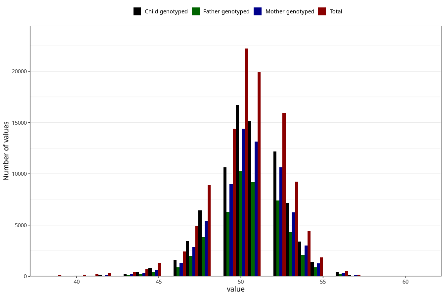

# length_birth
Variable mapping to questionnaire: mfr, question LENGDE.
.
- Number of values:

| Value | Total | Child genotyped | Mother genotyped | Father genotyped |
| ----- | ----- | --------------- | ---------------- | ---------------- |
| Missing | 5607 | 3013 | 2597 | 1874 |
| 39 | 101 | 32 | 26 |18 |
| 40 | 172 | 64 | 53 |39 |
| 40.9448384554768 | 1 | 0 | 0 |0 |
| 41 | 199 | 84 | 73 |53 |
| 42 | 296 | 138 | 108 |78 |
| 43 | 425 | 220 | 184 |116 |
| 43.3770491803279 | 1 | 1 | 1 |1 |
| 44 | 678 | 394 | 325 |214 |
| 45 | 1295 | 811 | 658 |468 |
| 45.670422269927 | 1 | 1 | 1 |0 |
| 46 | 2423 | 1595 | 1325 |887 |
| 46.591804570528 | 1 | 0 | 0 |0 |
| 46.7690166859918 | 1 | 1 | 1 |1 |
| 46.9855054858375 | 1 | 1 | 0 |0 |
| 47 | 4870 | 3428 | 2859 |1967 |
| 47.5099807213577 | 1 | 0 | 0 |0 |
| 47.5492826040099 | 1 | 1 | 0 |0 |
| 47.7269643866591 | 1 | 1 | 1 |1 |
| 47.8032786885246 | 1 | 1 | 1 |1 |
| 48 | 8901 | 6430 | 5436 |3809 |
| 48.1560283687943 | 1 | 0 | 0 |0 |
| 49 | 14377 | 10626 | 8981 |6287 |
| 49.4972514563321 | 1 | 1 | 1 |1 |
| 49.5115838837412 | 1 | 1 | 1 |0 |
| 49.6282620005668 | 1 | 1 | 1 |1 |
| 49.7037037037037 | 1 | 1 | 0 |0 |
| 49.8881453024532 | 1 | 1 | 1 |1 |
| 49.9178556244252 | 1 | 1 | 0 |1 |
| 49.9874646623548 | 1 | 1 | 1 |1 |
| 50 | 22210 | 16694 | 14386 |10248 |
| 50.1111111111111 | 1 | 1 | 0 |0 |
| 50.4799816937447 | 1 | 1 | 1 |1 |
| 51 | 19914 | 15140 | 13131 |9187 |
| 51.9240190791146 | 1 | 1 | 1 |1 |
| 52 | 15930 | 12156 | 10621 |7378 |
| 52.1113404446323 | 1 | 1 | 1 |1 |
| 52.1842775685373 | 1 | 1 | 0 |0 |
| 52.5122541537792 | 1 | 1 | 1 |1 |
| 53 | 9224 | 7142 | 6258 |4295 |
| 54 | 4429 | 3405 | 2983 |2081 |
| 55 | 1825 | 1430 | 1279 |887 |
| 56 | 525 | 392 | 348 |233 |
| 57 | 157 | 113 | 99 |66 |
| 58 | 31 | 23 | 20 |16 |
| 59 | 8 | 4 | 4 |3 |
| 60 | 1 | 1 | 1 |1 |
| 61 | 1 | 0 | 0 |0 |

