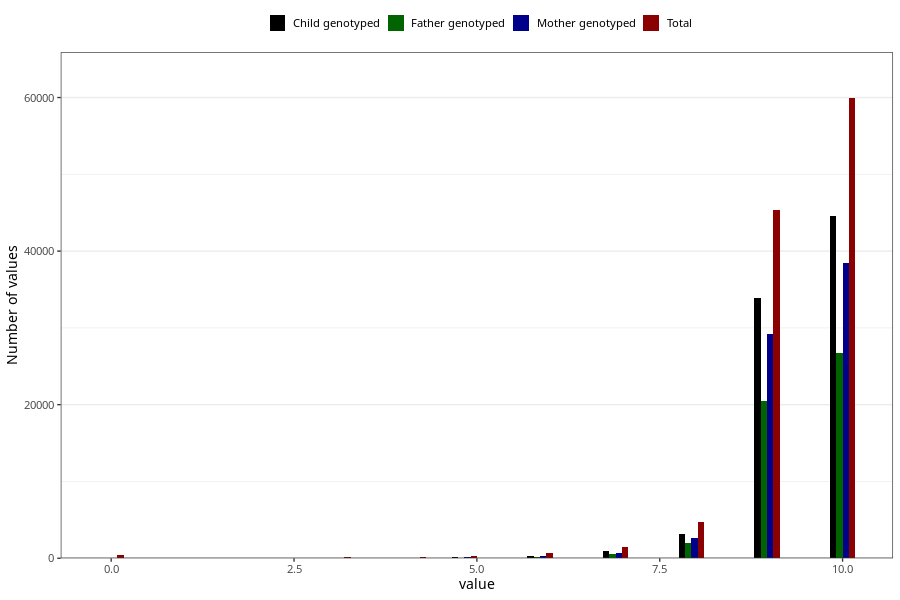

# apgar_5
Variable mapping to questionnaire: mfr, question APGAR5.
.
- Number of values:

| Value | Total | Child genotyped | Mother genotyped | Father genotyped |
| ----- | ----- | --------------- | ---------------- | ---------------- |
| Missing | 483 | 86 | 70 | 43 |
| 0 | 447 | 63 | 53 |37 |
| 1 | 44 | 11 | 10 |5 |
| 2 | 44 | 13 | 10 |9 |
| 3 | 106 | 43 | 32 |22 |
| 4 | 161 | 92 | 82 |61 |
| 5 | 293 | 145 | 119 |91 |
| 6 | 636 | 356 | 298 |218 |
| 7 | 1445 | 898 | 750 |534 |
| 8 | 4688 | 3141 | 2685 |1963 |
| 9 | 45358 | 33922 | 29267 |20489 |
| 10 | 59918 | 44585 | 38393 |26746 |

