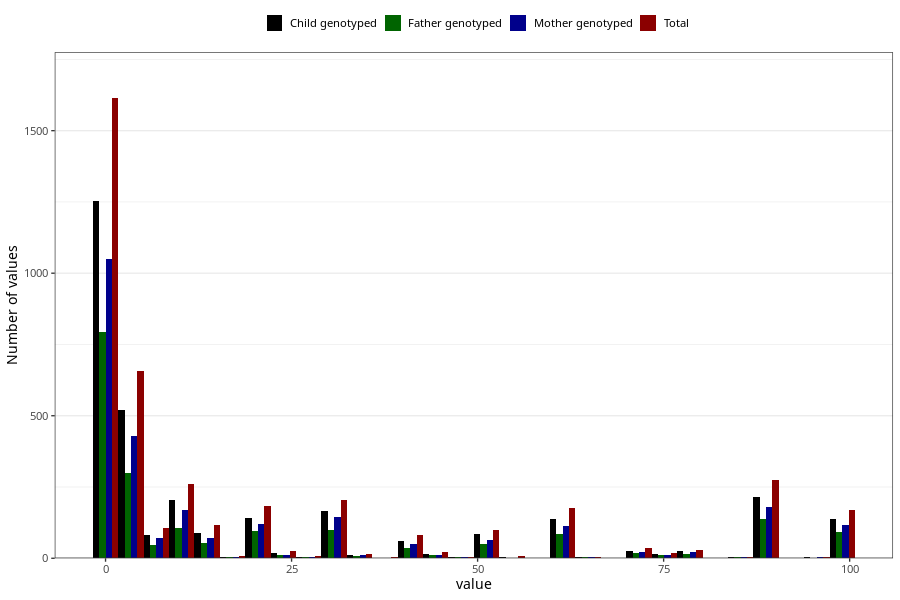

# colic_freq_6m
Variable mapping to questionnaire: q4, question DD304.
.
- Number of values:

| Value | Total | Child genotyped | Mother genotyped | Father genotyped |
| ----- | ----- | --------------- | ---------------- | ---------------- |
| Missing | 109487 | 80110 | 69067 | 48230 |
| 0 | 113 | 89 | 74 |58 |
| 1 | 1501 | 1165 | 977 |734 |
| 2 | 195 | 153 | 131 |98 |
| 3 | 219 | 176 | 145 |97 |
| 4 | 118 | 92 | 73 |47 |
| 5 | 125 | 98 | 80 |58 |
| 6 | 36 | 30 | 26 |20 |
| 7 | 42 | 30 | 25 |16 |
| 8 | 29 | 23 | 20 |12 |
| 9 | 11 | 9 | 8 |5 |
| 10 | 243 | 192 | 159 |100 |
| 11 | 6 | 5 | 1 |1 |
| 12 | 14 | 6 | 6 |4 |
| 13 | 3 | 2 | 2 |1 |
| 14 | 41 | 35 | 31 |23 |
| 15 | 58 | 44 | 32 |24 |
| 16 | 4 | 3 | 2 |2 |
| 17 | 1 | 1 | 1 |1 |
| 18 | 3 | 2 | 2 |1 |
| 20 | 160 | 126 | 106 |82 |
| 21 | 22 | 16 | 14 |12 |
| 24 | 1 | 1 | 1 |1 |
| 25 | 23 | 19 | 11 |10 |
| 28 | 7 | 5 | 5 |4 |
| 30 | 201 | 164 | 144 |97 |
| 32 | 2 | 1 | 1 |1 |
| 33 | 1 | 1 | 1 |1 |
| 35 | 13 | 10 | 9 |8 |
| 36 | 2 | 1 | 1 |0 |
| 37 | 1 | 1 | 0 |1 |
| 40 | 67 | 50 | 42 |30 |
| 41 | 1 | 1 | 1 |0 |
| 42 | 13 | 9 | 8 |6 |
| 44 | 2 | 2 | 2 |2 |
| 45 | 21 | 14 | 11 |11 |
| 49 | 5 | 4 | 4 |4 |
| 50 | 96 | 82 | 62 |46 |
| 51 | 1 | 1 | 0 |0 |
| 52 | 3 | 3 | 3 |3 |
| 55 | 2 | 2 | 1 |0 |
| 56 | 5 | 1 | 1 |1 |
| 57 | 1 | 1 | 0 |1 |
| 60 | 173 | 134 | 108 |83 |
| 61 | 2 | 2 | 2 |1 |
| 62 | 1 | 1 | 1 |1 |
| 63 | 1 | 1 | 1 |1 |
| 64 | 1 | 1 | 1 |1 |
| 65 | 3 | 3 | 3 |2 |
| 70 | 36 | 26 | 22 |18 |
| 74 | 1 | 1 | 1 |1 |
| 75 | 18 | 14 | 10 |9 |
| 76 | 1 | 1 | 1 |1 |
| 80 | 30 | 27 | 22 |14 |
| 81 | 1 | 1 | 1 |0 |
| 83 | 1 | 1 | 1 |0 |
| 84 | 2 | 2 | 2 |1 |
| 85 | 2 | 2 | 2 |2 |
| 86 | 1 | 1 | 1 |1 |
| 90 | 274 | 215 | 181 |137 |
| 94 | 2 | 2 | 2 |0 |
| 95 | 2 | 1 | 1 |1 |
| 97 | 1 | 1 | 1 |0 |
| 98 | 56 | 41 | 33 |26 |
| 99 | 115 | 97 | 82 |65 |

