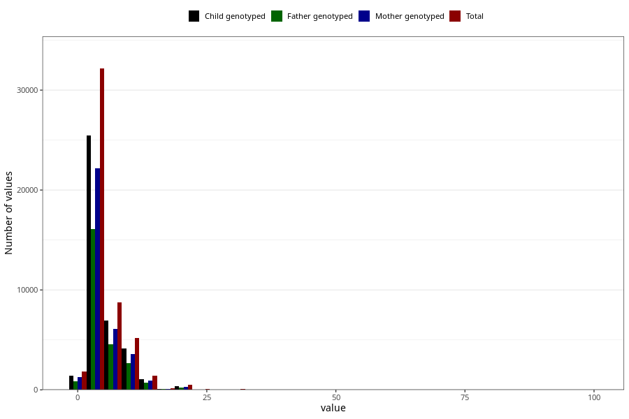

# common_cold_freq_3y
Variable mapping to questionnaire: q6, question GG129.
.
- Number of values:

| Value | Total | Child genotyped | Mother genotyped | Father genotyped |
| ----- | ----- | --------------- | ---------------- | ---------------- |
| Missing | 63424 | 43651 | 37221 | 24870 |
| 0 | 24 | 18 | 16 |13 |
| 1 | 1797 | 1419 | 1233 |872 |
| 2 | 7262 | 5707 | 4973 |3562 |
| 3 | 8689 | 6873 | 5954 |4275 |
| 4 | 8254 | 6619 | 5772 |4143 |
| 5 | 7954 | 6255 | 5456 |4089 |
| 6 | 4772 | 3792 | 3312 |2480 |
| 7 | 1593 | 1262 | 1100 |833 |
| 8 | 2412 | 1911 | 1679 |1263 |
| 9 | 368 | 291 | 247 |175 |
| 10 | 4798 | 3806 | 3319 |2496 |
| 11 | 59 | 46 | 40 |30 |
| 12 | 583 | 446 | 390 |314 |
| 13 | 36 | 26 | 24 |20 |
| 14 | 58 | 50 | 42 |36 |
| 15 | 708 | 544 | 458 |351 |
| 16 | 33 | 27 | 26 |21 |
| 17 | 14 | 11 | 11 |10 |
| 18 | 96 | 73 | 64 |50 |
| 19 | 4 | 3 | 3 |2 |
| 20 | 473 | 364 | 304 |229 |
| 21 | 6 | 4 | 4 |2 |
| 22 | 3 | 2 | 1 |1 |
| 23 | 2 | 2 | 1 |1 |
| 24 | 8 | 6 | 4 |2 |
| 25 | 44 | 33 | 28 |24 |
| 26 | 2 | 2 | 2 |1 |
| 27 | 1 | 1 | 1 |0 |
| 28 | 1 | 0 | 0 |0 |
| 30 | 66 | 52 | 39 |21 |
| 34 | 1 | 1 | 1 |1 |
| 35 | 5 | 4 | 3 |2 |
| 36 | 2 | 1 | 0 |0 |
| 40 | 21 | 20 | 15 |11 |
| 50 | 9 | 8 | 7 |5 |
| 52 | 1 | 0 | 0 |0 |
| 60 | 2 | 1 | 1 |1 |
| 72 | 1 | 0 | 0 |0 |
| 80 | 1 | 0 | 0 |0 |
| 90 | 1 | 1 | 0 |1 |
| 99 | 35 | 23 | 18 |11 |

