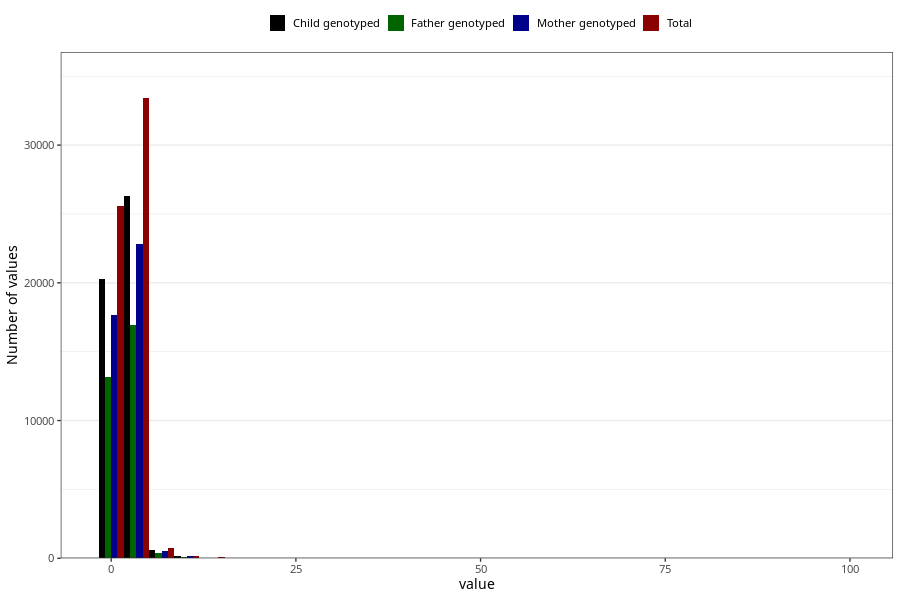

# common_cold_freq_6m
Variable mapping to questionnaire: q4, question DD264.
.
- Number of values:

| Value | Total | Child genotyped | Mother genotyped | Father genotyped |
| ----- | ----- | --------------- | ---------------- | ---------------- |
| Missing | 53568 | 35933 | 30588 | 19591 |
| 0 | 37 | 27 | 23 |20 |
| 1 | 25522 | 20252 | 17641 |13106 |
| 2 | 21364 | 16848 | 14642 |10874 |
| 3 | 8088 | 6347 | 5461 |4111 |
| 4 | 2757 | 2190 | 1899 |1401 |
| 5 | 1200 | 913 | 798 |586 |
| 6 | 486 | 374 | 317 |233 |
| 7 | 197 | 155 | 135 |92 |
| 8 | 96 | 77 | 64 |53 |
| 9 | 16 | 16 | 13 |11 |
| 10 | 174 | 138 | 116 |88 |
| 11 | 10 | 7 | 7 |3 |
| 12 | 13 | 9 | 6 |7 |
| 13 | 2 | 1 | 1 |1 |
| 14 | 40 | 28 | 25 |21 |
| 15 | 10 | 7 | 6 |3 |
| 16 | 5 | 3 | 3 |2 |
| 18 | 1 | 1 | 1 |1 |
| 20 | 15 | 12 | 9 |6 |
| 21 | 1 | 1 | 0 |0 |
| 28 | 1 | 1 | 1 |0 |
| 30 | 9 | 6 | 5 |2 |
| 32 | 1 | 1 | 1 |1 |
| 44 | 1 | 0 | 0 |0 |
| 50 | 1 | 1 | 0 |0 |
| 80 | 1 | 1 | 1 |1 |
| 98 | 1 | 1 | 1 |0 |
| 99 | 6 | 5 | 5 |4 |

