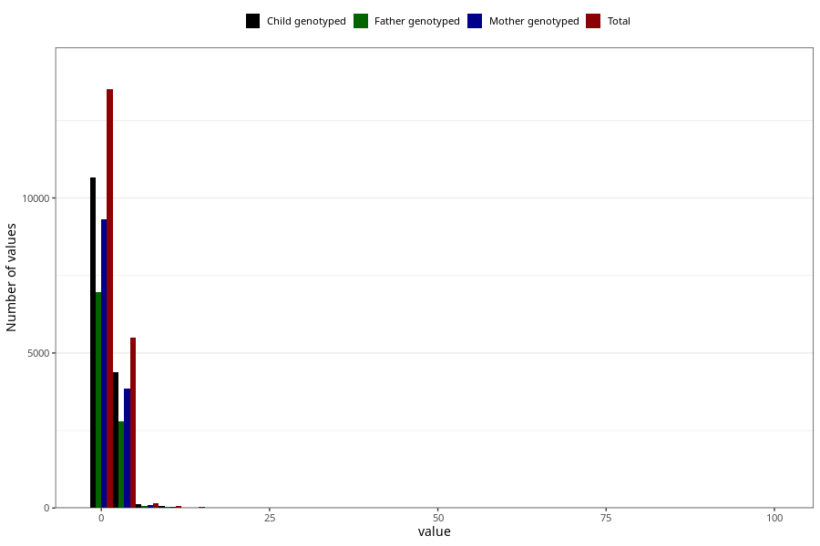

# conjunctivities_freq_6m
Variable mapping to questionnaire: q4, question DD292.
.
- Number of values:

| Value | Total | Child genotyped | Mother genotyped | Father genotyped |
| ----- | ----- | --------------- | ---------------- | ---------------- |
| Missing | 94330 | 68097 | 58406 | 40319 |
| 0 | 100 | 75 | 60 |49 |
| 1 | 13404 | 10573 | 9252 |6917 |
| 2 | 3805 | 3029 | 2668 |1914 |
| 3 | 1102 | 878 | 775 |565 |
| 4 | 384 | 314 | 275 |218 |
| 5 | 215 | 168 | 146 |105 |
| 6 | 76 | 61 | 52 |44 |
| 7 | 56 | 40 | 37 |25 |
| 8 | 15 | 11 | 8 |4 |
| 9 | 3 | 1 | 1 |1 |
| 10 | 59 | 50 | 43 |23 |
| 11 | 3 | 3 | 3 |2 |
| 12 | 7 | 6 | 5 |4 |
| 14 | 15 | 12 | 9 |9 |
| 15 | 5 | 4 | 3 |2 |
| 18 | 1 | 1 | 1 |1 |
| 20 | 11 | 7 | 7 |5 |
| 21 | 1 | 1 | 0 |0 |
| 25 | 2 | 1 | 1 |1 |
| 29 | 1 | 1 | 0 |0 |
| 30 | 5 | 5 | 4 |2 |
| 40 | 2 | 2 | 2 |0 |
| 60 | 4 | 4 | 3 |2 |
| 90 | 2 | 1 | 1 |0 |
| 98 | 5 | 1 | 1 |1 |
| 99 | 10 | 9 | 6 |5 |

