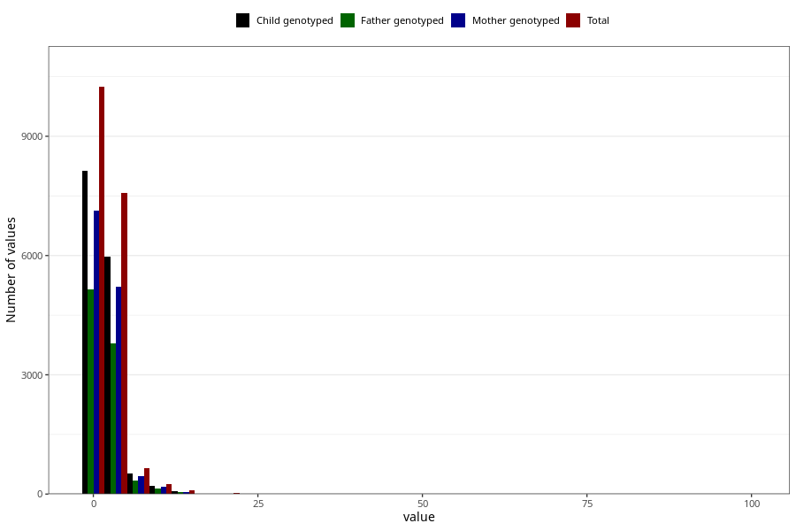

# ear_infection_freq_3y
Variable mapping to questionnaire: q6, question GG138.
.
- Number of values:

| Value | Total | Child genotyped | Mother genotyped | Father genotyped |
| ----- | ----- | --------------- | ---------------- | ---------------- |
| Missing | 94740 | 68410 | 58709 | 40747 |
| 0 | 27 | 19 | 16 |13 |
| 1 | 10216 | 8114 | 7104 |5141 |
| 2 | 4338 | 3423 | 2981 |2161 |
| 3 | 1757 | 1385 | 1219 |867 |
| 4 | 875 | 692 | 592 |440 |
| 5 | 609 | 480 | 421 |317 |
| 6 | 321 | 254 | 223 |162 |
| 7 | 172 | 129 | 118 |91 |
| 8 | 167 | 138 | 118 |89 |
| 9 | 29 | 24 | 18 |12 |
| 10 | 216 | 175 | 155 |116 |
| 11 | 7 | 6 | 5 |2 |
| 12 | 32 | 25 | 20 |16 |
| 13 | 4 | 4 | 3 |2 |
| 14 | 11 | 5 | 4 |3 |
| 15 | 51 | 36 | 31 |23 |
| 16 | 3 | 1 | 1 |1 |
| 18 | 4 | 3 | 3 |2 |
| 20 | 21 | 15 | 12 |6 |
| 23 | 1 | 1 | 1 |0 |
| 24 | 1 | 0 | 0 |0 |
| 25 | 3 | 1 | 1 |1 |
| 30 | 7 | 7 | 7 |4 |
| 35 | 2 | 2 | 2 |2 |
| 40 | 1 | 1 | 1 |0 |
| 50 | 1 | 1 | 1 |0 |
| 99 | 7 | 4 | 3 |0 |

