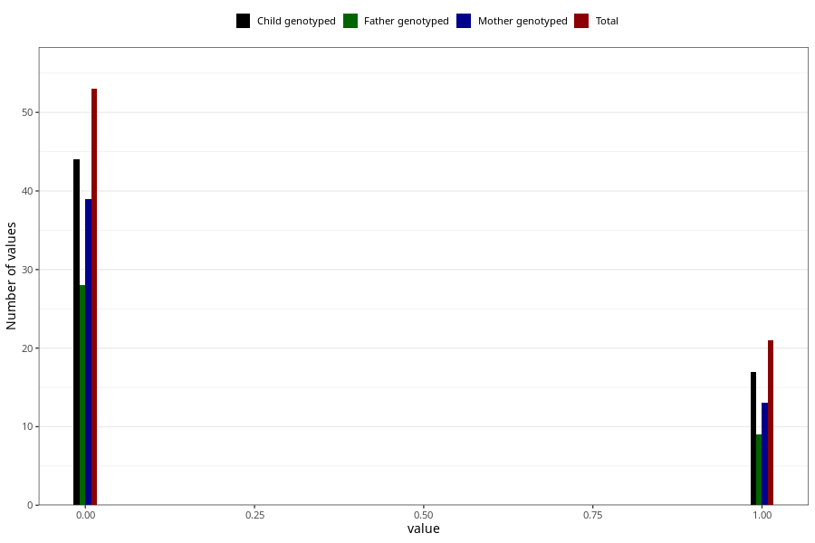

# encephalitis_meningitis_freq_3y
Variable mapping to questionnaire: q6, question GG156.
.
- Number of values:

| Value | Total | Child genotyped | Mother genotyped | Father genotyped |
| ----- | ----- | --------------- | ---------------- | ---------------- |
| Missing | 113549 | 83294 | 71717 | 50181 |
| 0 | 53 | 44 | 39 |28 |
| 1 | 21 | 17 | 13 |9 |

