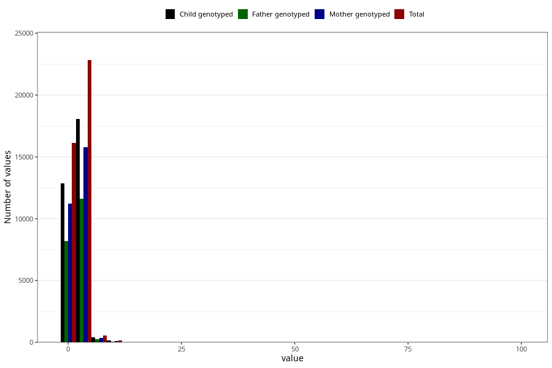

# gastric_flu_diarrhea_freq_3y
Variable mapping to questionnaire: q6, question GG150.
.
- Number of values:

| Value | Total | Child genotyped | Mother genotyped | Father genotyped |
| ----- | ----- | --------------- | ---------------- | ---------------- |
| Missing | 73837 | 51818 | 44219 | 29998 |
| 0 | 18 | 13 | 11 |10 |
| 1 | 16128 | 12842 | 11232 |8175 |
| 2 | 14350 | 11346 | 9933 |7254 |
| 3 | 5475 | 4356 | 3777 |2861 |
| 4 | 2015 | 1587 | 1396 |1034 |
| 5 | 977 | 756 | 659 |485 |
| 6 | 352 | 272 | 238 |179 |
| 7 | 99 | 76 | 64 |42 |
| 8 | 114 | 82 | 66 |52 |
| 9 | 12 | 9 | 6 |3 |
| 10 | 156 | 126 | 105 |77 |
| 11 | 6 | 4 | 3 |3 |
| 12 | 15 | 13 | 10 |10 |
| 13 | 3 | 3 | 1 |1 |
| 14 | 1 | 1 | 1 |1 |
| 15 | 16 | 12 | 12 |7 |
| 18 | 2 | 2 | 1 |2 |
| 20 | 25 | 19 | 19 |15 |
| 25 | 5 | 3 | 3 |3 |
| 30 | 4 | 4 | 4 |2 |
| 35 | 2 | 2 | 1 |1 |
| 40 | 2 | 2 | 2 |0 |
| 50 | 2 | 2 | 1 |1 |
| 99 | 7 | 5 | 5 |2 |

