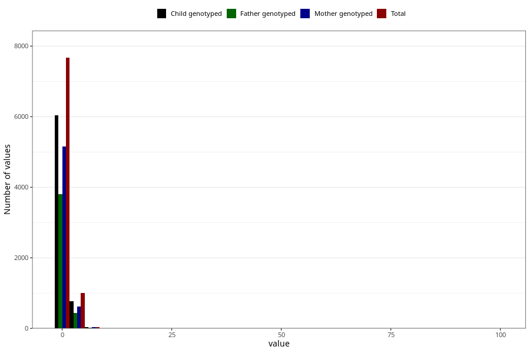

# gastric_flu_diarrhoea_freq_6m
Variable mapping to questionnaire: q4, question DD284.
.
- Number of values:

| Value | Total | Child genotyped | Mother genotyped | Father genotyped |
| ----- | ----- | --------------- | ---------------- | ---------------- |
| Missing | 104871 | 76495 | 65935 | 45939 |
| 0 | 109 | 82 | 71 |52 |
| 1 | 7562 | 5951 | 5085 |3752 |
| 2 | 798 | 615 | 510 |355 |
| 3 | 126 | 94 | 77 |55 |
| 4 | 43 | 32 | 22 |16 |
| 5 | 32 | 22 | 15 |11 |
| 6 | 15 | 9 | 8 |3 |
| 7 | 24 | 21 | 18 |13 |
| 8 | 6 | 6 | 6 |5 |
| 9 | 1 | 1 | 1 |1 |
| 10 | 9 | 7 | 5 |5 |
| 11 | 2 | 2 | 2 |2 |
| 12 | 1 | 1 | 1 |1 |
| 14 | 6 | 5 | 4 |2 |
| 17 | 2 | 1 | 1 |0 |
| 20 | 5 | 4 | 2 |2 |
| 21 | 1 | 1 | 1 |0 |
| 24 | 1 | 1 | 0 |0 |
| 28 | 1 | 1 | 1 |0 |
| 30 | 3 | 1 | 1 |1 |
| 40 | 1 | 1 | 1 |1 |
| 42 | 1 | 1 | 1 |1 |
| 70 | 1 | 0 | 0 |0 |
| 99 | 2 | 1 | 1 |1 |

