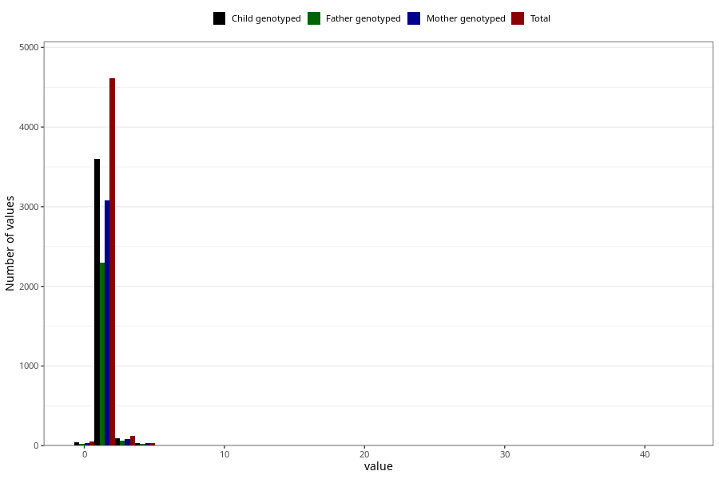

# injury_or_accident_freq_3y
Variable mapping to questionnaire: q6, question GG165.
.
- Number of values:

| Value | Total | Child genotyped | Mother genotyped | Father genotyped |
| ----- | ----- | --------------- | ---------------- | ---------------- |
| Missing | 108797 | 79583 | 68539 | 47813 |
| 0 | 49 | 40 | 36 |27 |
| 1 | 3907 | 3052 | 2618 |1949 |
| 2 | 704 | 552 | 464 |346 |
| 3 | 121 | 92 | 78 |63 |
| 4 | 22 | 19 | 19 |14 |
| 5 | 13 | 12 | 10 |6 |
| 6 | 3 | 0 | 0 |0 |
| 7 | 2 | 1 | 1 |0 |
| 8 | 1 | 1 | 1 |0 |
| 10 | 1 | 1 | 1 |0 |
| 20 | 1 | 0 | 0 |0 |
| 35 | 1 | 1 | 1 |0 |
| 42 | 1 | 1 | 1 |0 |

