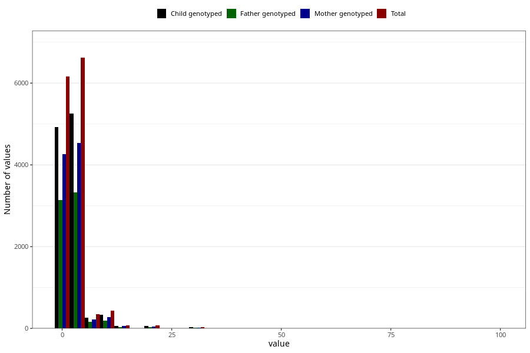

# nappy_rash_freq_6m
Variable mapping to questionnaire: q4, question DD308.
.
- Number of values:

| Value | Total | Child genotyped | Mother genotyped | Father genotyped |
| ----- | ----- | --------------- | ---------------- | ---------------- |
| Missing | 99821 | 72411 | 62320 | 43274 |
| 0 | 89 | 69 | 58 |50 |
| 1 | 6080 | 4851 | 4202 |3092 |
| 2 | 3434 | 2732 | 2365 |1747 |
| 3 | 1661 | 1301 | 1112 |815 |
| 4 | 701 | 559 | 491 |371 |
| 5 | 825 | 657 | 568 |402 |
| 6 | 193 | 147 | 122 |89 |
| 7 | 82 | 64 | 52 |38 |
| 8 | 69 | 50 | 44 |32 |
| 9 | 10 | 8 | 7 |6 |
| 10 | 430 | 326 | 272 |192 |
| 11 | 2 | 1 | 1 |0 |
| 12 | 15 | 11 | 10 |7 |
| 13 | 3 | 1 | 1 |1 |
| 14 | 12 | 11 | 10 |6 |
| 15 | 47 | 38 | 34 |25 |
| 16 | 2 | 1 | 1 |0 |
| 17 | 1 | 0 | 0 |0 |
| 19 | 2 | 2 | 1 |1 |
| 20 | 74 | 56 | 45 |36 |
| 21 | 3 | 3 | 3 |2 |
| 23 | 1 | 0 | 0 |0 |
| 25 | 1 | 1 | 1 |0 |
| 26 | 1 | 1 | 1 |1 |
| 30 | 32 | 26 | 25 |16 |
| 36 | 1 | 1 | 0 |1 |
| 40 | 2 | 1 | 1 |0 |
| 45 | 2 | 2 | 2 |2 |
| 50 | 7 | 6 | 5 |4 |
| 56 | 1 | 0 | 0 |0 |
| 60 | 4 | 3 | 3 |1 |
| 70 | 1 | 1 | 1 |1 |
| 80 | 1 | 1 | 1 |1 |
| 90 | 3 | 3 | 2 |0 |
| 98 | 1 | 1 | 0 |0 |
| 99 | 9 | 9 | 8 |5 |

