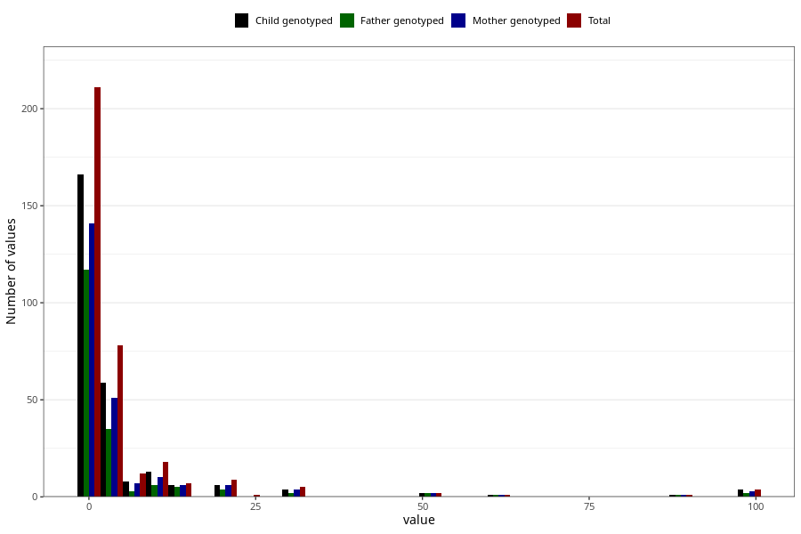

# other_convulsions_with_any_fever_freq_6m
Variable mapping to questionnaire: q4, question DD300.
.
- Number of values:

| Value | Total | Child genotyped | Mother genotyped | Father genotyped |
| ----- | ----- | --------------- | ---------------- | ---------------- |
| Missing | 113274 | 83085 | 71537 | 50040 |
| 0 | 125 | 94 | 81 |65 |
| 1 | 86 | 72 | 60 |52 |
| 2 | 32 | 25 | 22 |15 |
| 3 | 24 | 18 | 14 |9 |
| 4 | 9 | 5 | 5 |4 |
| 5 | 13 | 11 | 10 |7 |
| 6 | 6 | 5 | 5 |2 |
| 7 | 5 | 2 | 1 |1 |
| 8 | 1 | 1 | 1 |0 |
| 9 | 2 | 1 | 1 |1 |
| 10 | 16 | 12 | 9 |5 |
| 12 | 1 | 1 | 1 |1 |
| 13 | 1 | 1 | 1 |1 |
| 15 | 5 | 4 | 4 |3 |
| 20 | 9 | 6 | 6 |4 |
| 25 | 1 | 0 | 0 |0 |
| 30 | 5 | 4 | 4 |2 |
| 50 | 2 | 2 | 2 |2 |
| 60 | 1 | 1 | 1 |1 |
| 90 | 1 | 1 | 1 |1 |
| 99 | 4 | 4 | 3 |2 |

