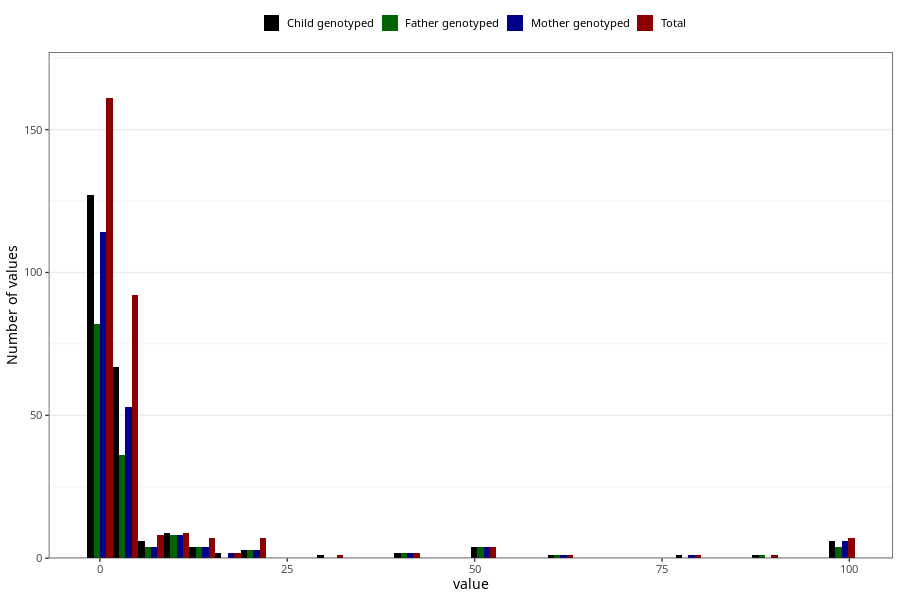

# other_convulsions_without_any_fever_freq_3y
Variable mapping to questionnaire: q6, question GG162.
.
- Number of values:

| Value | Total | Child genotyped | Mother genotyped | Father genotyped |
| ----- | ----- | --------------- | ---------------- | ---------------- |
| Missing | 113320 | 83121 | 71567 | 50069 |
| 0 | 52 | 44 | 39 |28 |
| 1 | 109 | 83 | 75 |54 |
| 2 | 44 | 33 | 25 |15 |
| 3 | 21 | 14 | 11 |8 |
| 4 | 13 | 8 | 7 |6 |
| 5 | 14 | 12 | 10 |7 |
| 6 | 4 | 3 | 2 |2 |
| 7 | 2 | 2 | 1 |1 |
| 8 | 2 | 1 | 1 |1 |
| 10 | 9 | 9 | 8 |8 |
| 12 | 2 | 1 | 1 |1 |
| 13 | 1 | 0 | 0 |0 |
| 14 | 1 | 0 | 0 |0 |
| 15 | 3 | 3 | 3 |3 |
| 16 | 1 | 1 | 1 |0 |
| 18 | 1 | 1 | 1 |0 |
| 20 | 7 | 3 | 3 |3 |
| 30 | 1 | 1 | 0 |0 |
| 40 | 2 | 2 | 2 |2 |
| 50 | 4 | 4 | 4 |4 |
| 60 | 1 | 1 | 1 |1 |
| 80 | 1 | 1 | 1 |0 |
| 90 | 1 | 1 | 0 |1 |
| 99 | 7 | 6 | 6 |4 |

