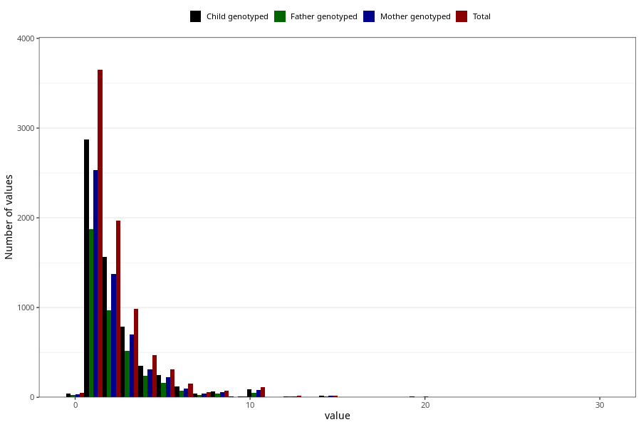

# pseudo_croup_freq_3y
Variable mapping to questionnaire: q6, question GG141.
.
- Number of values:

| Value | Total | Child genotyped | Mother genotyped | Father genotyped |
| ----- | ----- | --------------- | ---------------- | ---------------- |
| Missing | 105733 | 77112 | 66254 | 46197 |
| 0 | 48 | 38 | 35 |26 |
| 1 | 3649 | 2874 | 2535 |1876 |
| 2 | 1966 | 1563 | 1378 |968 |
| 3 | 984 | 786 | 697 |516 |
| 4 | 467 | 352 | 315 |237 |
| 5 | 313 | 250 | 228 |158 |
| 6 | 151 | 123 | 100 |74 |
| 7 | 61 | 43 | 41 |28 |
| 8 | 71 | 63 | 58 |45 |
| 9 | 13 | 12 | 10 |6 |
| 10 | 113 | 92 | 80 |52 |
| 11 | 1 | 1 | 1 |0 |
| 12 | 14 | 12 | 11 |9 |
| 13 | 4 | 4 | 4 |4 |
| 14 | 3 | 3 | 3 |3 |
| 15 | 16 | 14 | 11 |9 |
| 17 | 1 | 1 | 1 |1 |
| 18 | 1 | 1 | 0 |1 |
| 20 | 12 | 9 | 5 |6 |
| 25 | 1 | 1 | 1 |1 |
| 30 | 1 | 1 | 1 |1 |

