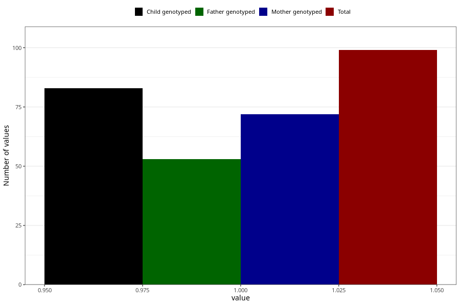

# rheumatoid_arthritis_8y
Variable mapping to questionnaire: q9, question NN26.
.
- Number of values:

| Value | Total | Child genotyped | Mother genotyped | Father genotyped |
| ----- | ----- | --------------- | ---------------- | ---------------- |
| Missing | 113524 | 83272 | 71697 | 50165 |
| 1 | 99 | 83 | 72 |53 |

