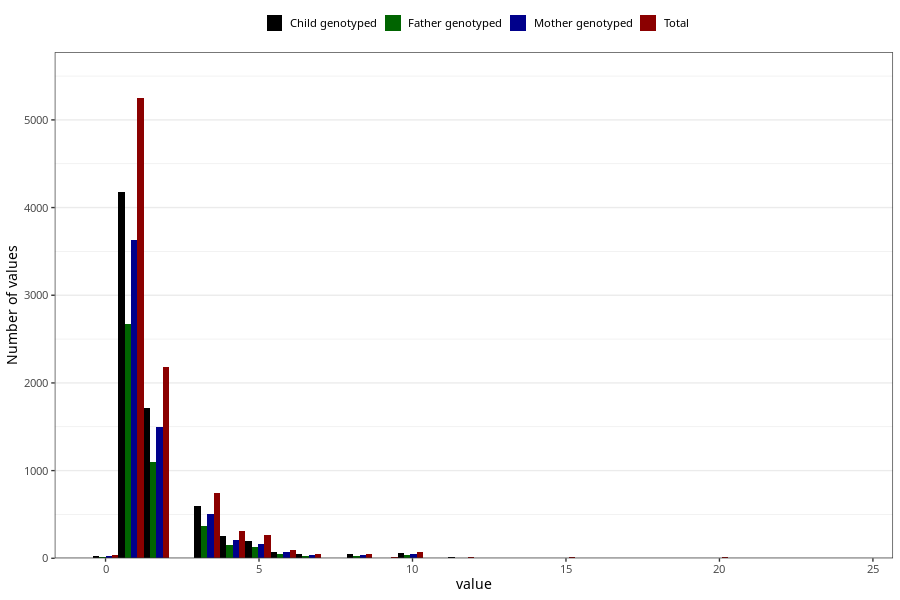

# throat_infection_other_freq_3y
Variable mapping to questionnaire: q6, question GG135.
.
- Number of values:

| Value | Total | Child genotyped | Mother genotyped | Father genotyped |
| ----- | ----- | --------------- | ---------------- | ---------------- |
| Missing | 104516 | 76126 | 65523 | 45615 |
| 0 | 33 | 26 | 22 |14 |
| 1 | 5248 | 4182 | 3627 |2674 |
| 2 | 2176 | 1712 | 1493 |1097 |
| 3 | 745 | 594 | 504 |368 |
| 4 | 313 | 254 | 212 |154 |
| 5 | 264 | 195 | 164 |128 |
| 6 | 92 | 76 | 67 |48 |
| 7 | 52 | 44 | 34 |31 |
| 8 | 53 | 44 | 35 |24 |
| 9 | 9 | 6 | 6 |4 |
| 10 | 74 | 61 | 50 |42 |
| 11 | 3 | 2 | 2 |0 |
| 12 | 11 | 9 | 8 |5 |
| 13 | 1 | 1 | 1 |1 |
| 14 | 7 | 6 | 5 |3 |
| 15 | 13 | 8 | 7 |6 |
| 18 | 1 | 1 | 1 |0 |
| 19 | 1 | 0 | 0 |0 |
| 20 | 9 | 7 | 7 |3 |
| 24 | 2 | 1 | 1 |1 |

