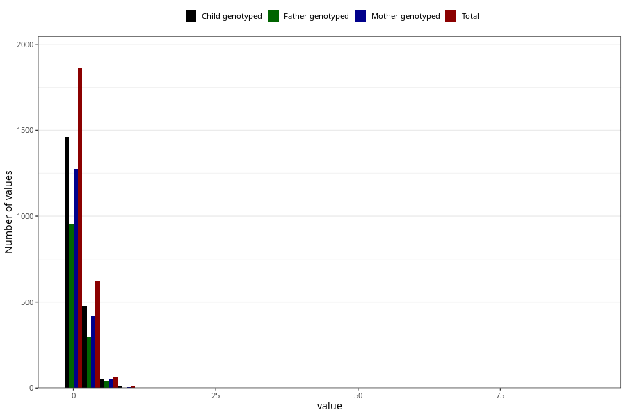

# urinary_tract_infection_freq_3y
Variable mapping to questionnaire: q6, question GG153.
.
- Number of values:

| Value | Total | Child genotyped | Mother genotyped | Father genotyped |
| ----- | ----- | --------------- | ---------------- | ---------------- |
| Missing | 111064 | 81356 | 70019 | 48918 |
| 0 | 53 | 46 | 41 |29 |
| 1 | 1808 | 1416 | 1234 |926 |
| 2 | 411 | 313 | 275 |196 |
| 3 | 127 | 99 | 86 |64 |
| 4 | 82 | 64 | 55 |38 |
| 5 | 40 | 33 | 33 |29 |
| 6 | 14 | 10 | 9 |9 |
| 7 | 9 | 6 | 6 |3 |
| 8 | 5 | 4 | 4 |1 |
| 9 | 1 | 0 | 0 |0 |
| 10 | 4 | 4 | 3 |2 |
| 12 | 2 | 1 | 1 |0 |
| 15 | 2 | 2 | 2 |2 |
| 90 | 1 | 1 | 1 |1 |

