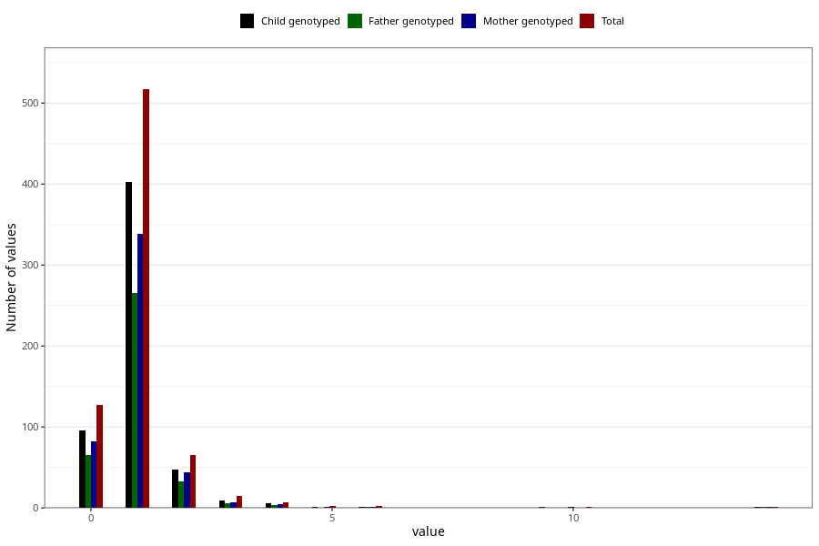

# urinary_tract_infection_freq_6m
Variable mapping to questionnaire: q4, question DD288.
.
- Number of values:

| Value | Total | Child genotyped | Mother genotyped | Father genotyped |
| ----- | ----- | --------------- | ---------------- | ---------------- |
| Missing | 112885 | 82789 | 71289 | 49842 |
| 0 | 127 | 96 | 82 |65 |
| 1 | 517 | 403 | 339 |266 |
| 2 | 65 | 48 | 44 |33 |
| 3 | 15 | 9 | 7 |6 |
| 4 | 7 | 6 | 5 |4 |
| 5 | 2 | 1 | 1 |0 |
| 6 | 2 | 1 | 1 |1 |
| 9 | 1 | 0 | 0 |0 |
| 10 | 1 | 1 | 0 |0 |
| 14 | 1 | 1 | 1 |1 |

