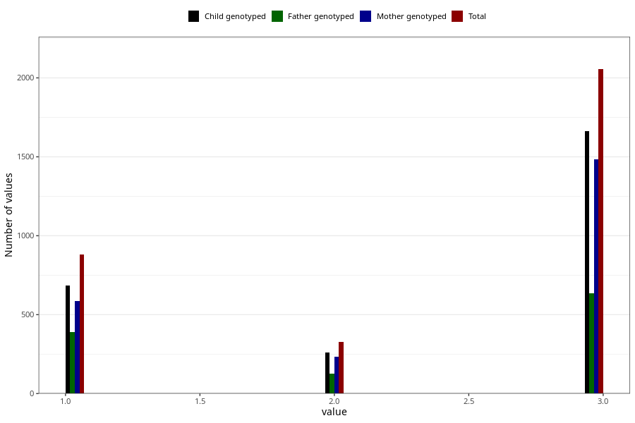

# vaccine_dt_freq_18m
Variable mapping to questionnaire: q5, question EE154.
.
- Number of values:

| Value | Total | Child genotyped | Mother genotyped | Father genotyped |
| ----- | ----- | --------------- | ---------------- | ---------------- |
| Missing | 110362 | 80747 | 69466 | 49065 |
| 1 | 880 | 684 | 586 |391 |
| 2 | 326 | 260 | 235 |126 |
| 3 | 2055 | 1664 | 1482 |636 |

