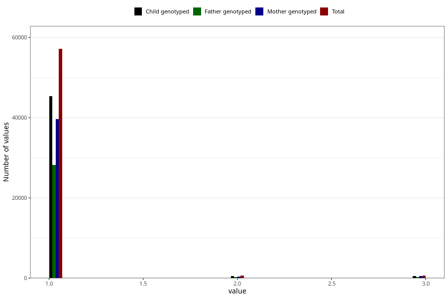

# vaccine_mmr_freq_18m
Variable mapping to questionnaire: q5, question EE160.
.
- Number of values:

| Value | Total | Child genotyped | Mother genotyped | Father genotyped |
| ----- | ----- | --------------- | ---------------- | ---------------- |
| Missing | 55109 | 36875 | 31193 | 21350 |
| 1 | 57136 | 45413 | 39663 |28247 |
| 2 | 693 | 531 | 444 |304 |
| 3 | 685 | 536 | 469 |317 |

