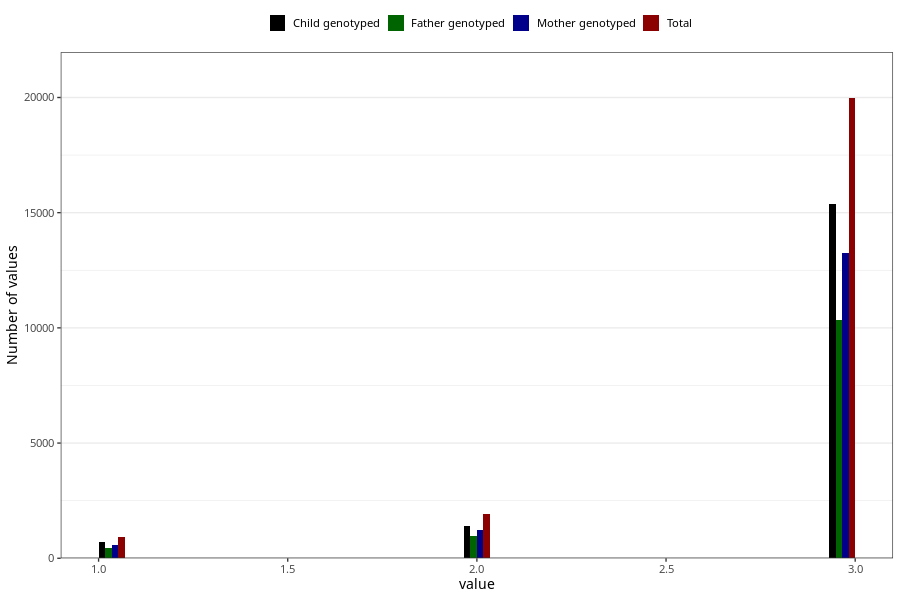

# vaccine_pneumococcus_freq_18m
Variable mapping to questionnaire: q5, question EE1009.
.
- Number of values:

| Value | Total | Child genotyped | Mother genotyped | Father genotyped |
| ----- | ----- | --------------- | ---------------- | ---------------- |
| Missing | 90843 | 65872 | 56691 | 38462 |
| 1 | 908 | 688 | 594 |457 |
| 2 | 1901 | 1420 | 1227 |947 |
| 3 | 19971 | 15375 | 13257 |10352 |

