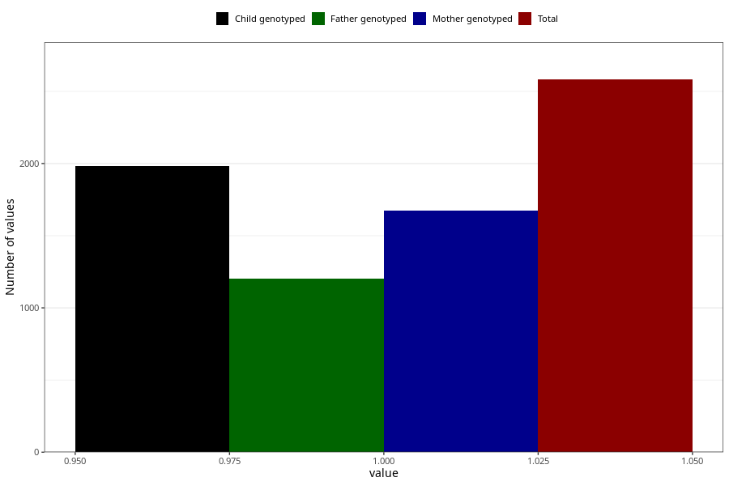

# formula_colett_0m
Variable mapping to questionnaire: q4, question DD56.
.
- Number of values:

| Value | Total | Child genotyped | Mother genotyped | Father genotyped |
| ----- | ----- | --------------- | ---------------- | ---------------- |
| Missing | 111041 | 81371 | 70094 | 49014 |
| 1 | 2582 | 1984 | 1675 |1204 |

