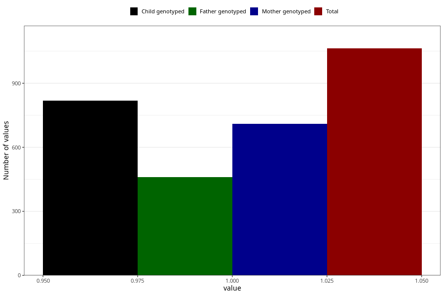

# formula_colett_4m
Variable mapping to questionnaire: q4, question DD60.
.
- Number of values:

| Value | Total | Child genotyped | Mother genotyped | Father genotyped |
| ----- | ----- | --------------- | ---------------- | ---------------- |
| Missing | 112560 | 82537 | 71060 | 49757 |
| 1 | 1063 | 818 | 709 |461 |

