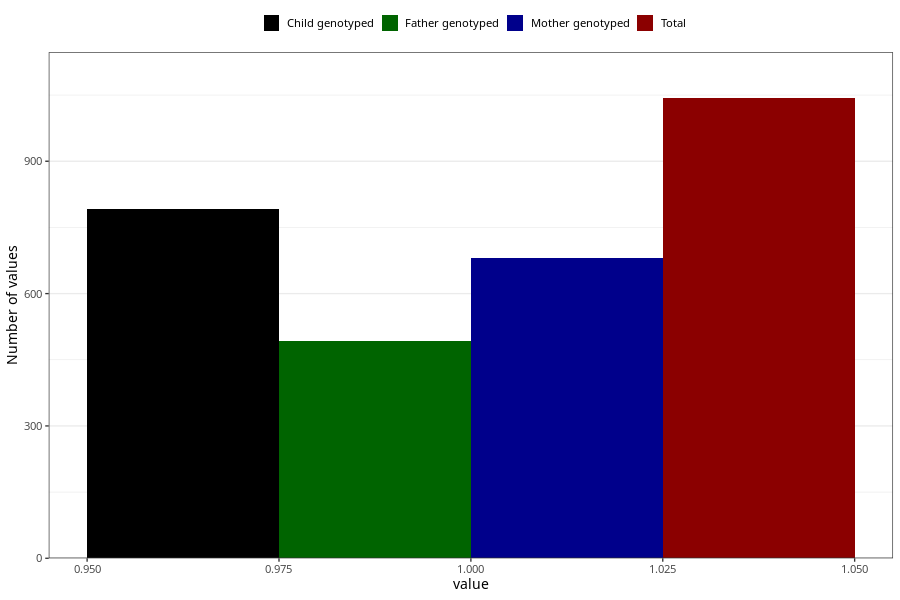

# formula_colett_6m
Variable mapping to questionnaire: q4, question DD62.
.
- Number of values:

| Value | Total | Child genotyped | Mother genotyped | Father genotyped |
| ----- | ----- | --------------- | ---------------- | ---------------- |
| Missing | 112580 | 82564 | 71088 | 49726 |
| 1 | 1043 | 791 | 681 |492 |

