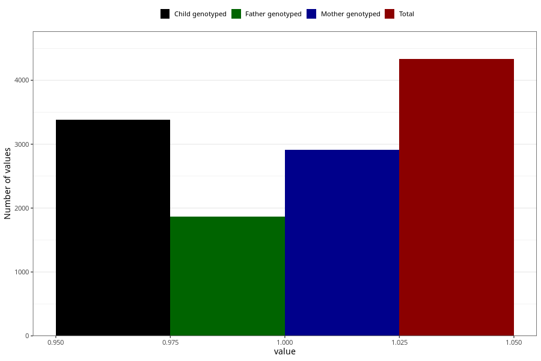

# formula_colett_omega3_4m
Variable mapping to questionnaire: q4, question DD67.
.
- Number of values:

| Value | Total | Child genotyped | Mother genotyped | Father genotyped |
| ----- | ----- | --------------- | ---------------- | ---------------- |
| Missing | 109291 | 79977 | 68856 | 48349 |
| 1 | 4332 | 3378 | 2913 |1869 |

