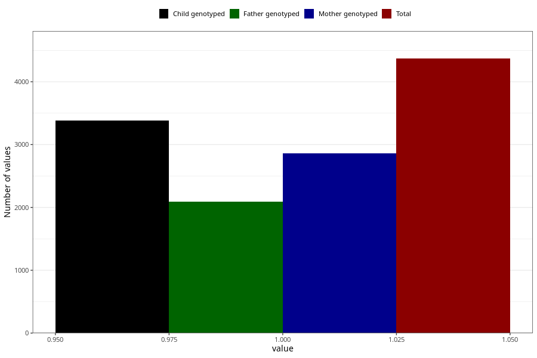

# formula_colett_omega3_6m
Variable mapping to questionnaire: q4, question DD69.
.
- Number of values:

| Value | Total | Child genotyped | Mother genotyped | Father genotyped |
| ----- | ----- | --------------- | ---------------- | ---------------- |
| Missing | 109254 | 79972 | 68906 | 48130 |
| 1 | 4369 | 3383 | 2863 |2088 |

