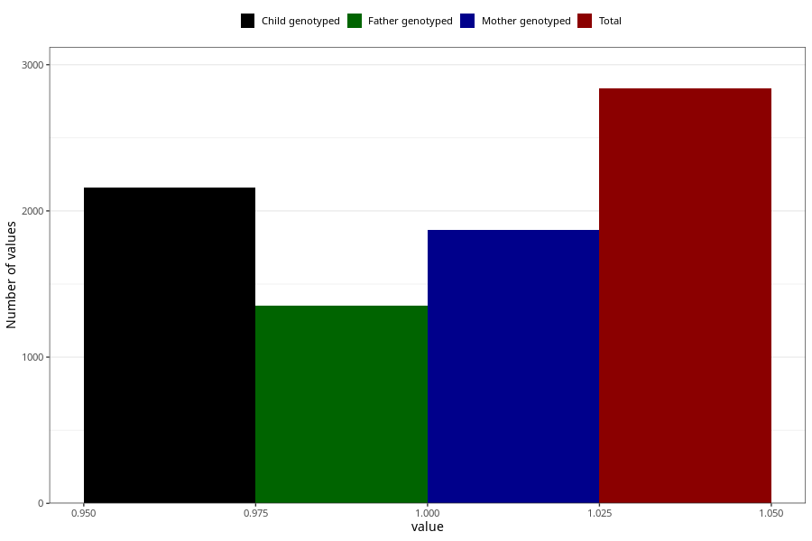

# formula_nan_ha1_2m
Variable mapping to questionnaire: q4, question DD79.
.
- Number of values:

| Value | Total | Child genotyped | Mother genotyped | Father genotyped |
| ----- | ----- | --------------- | ---------------- | ---------------- |
| Missing | 110786 | 81195 | 69899 | 48869 |
| 1 | 2837 | 2160 | 1870 |1349 |

