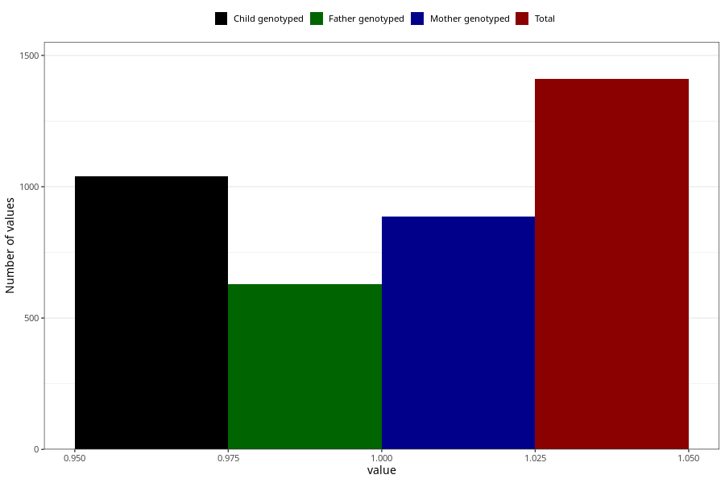

# other_milk_2m
Variable mapping to questionnaire: q4, question DD86.
.
- Number of values:

| Value | Total | Child genotyped | Mother genotyped | Father genotyped |
| ----- | ----- | --------------- | ---------------- | ---------------- |
| Missing | 112213 | 82316 | 70884 | 49589 |
| 1 | 1410 | 1039 | 885 |629 |

