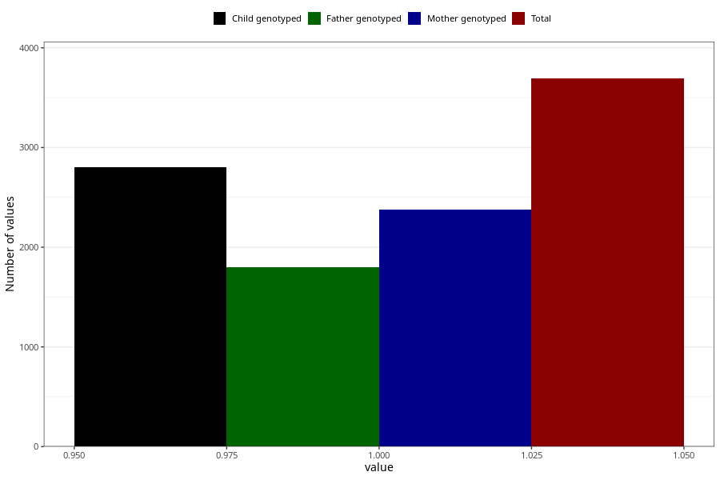

# other_milk_6m
Variable mapping to questionnaire: q4, question DD90.
.
- Number of values:

| Value | Total | Child genotyped | Mother genotyped | Father genotyped |
| ----- | ----- | --------------- | ---------------- | ---------------- |
| Missing | 109931 | 80552 | 69394 | 48416 |
| 1 | 3692 | 2803 | 2375 |1802 |

