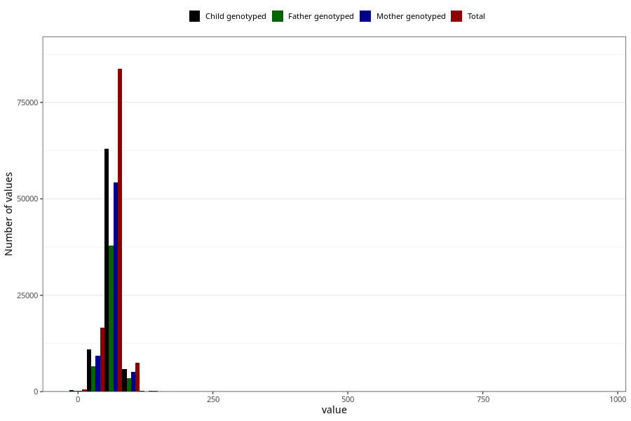

# umbilical_cord_length
Variable mapping to questionnaire: mfr, question NAVLESNORLENGDE.
.
- Number of values:

| Value | Total | Child genotyped | Mother genotyped | Father genotyped |
| ----- | ----- | --------------- | ---------------- | ---------------- |
| Missing | 4754 | 3002 | 2539 | 1825 |
| 0 | 483 | 284 | 243 |178 |
| 1 | 1 | 1 | 1 |1 |
| 2 | 4 | 1 | 1 |1 |
| 3 | 3 | 1 | 0 |0 |
| 4 | 7 | 2 | 1 |1 |
| 5 | 16 | 11 | 10 |7 |
| 6 | 8 | 5 | 4 |2 |
| 7 | 4 | 4 | 4 |3 |
| 8 | 3 | 1 | 1 |1 |
| 9 | 2 | 2 | 2 |2 |
| 10 | 16 | 10 | 10 |8 |
| 11 | 2 | 2 | 2 |1 |
| 12 | 2 | 0 | 0 |0 |
| 13 | 1 | 0 | 0 |0 |
| 14 | 2 | 0 | 0 |0 |
| 15 | 13 | 1 | 1 |1 |
| 16 | 1 | 0 | 0 |0 |
| 17 | 3 | 1 | 1 |0 |
| 18 | 5 | 1 | 1 |0 |
| 19 | 3 | 1 | 1 |1 |
| 20 | 45 | 9 | 8 |7 |
| 21 | 4 | 0 | 0 |0 |
| 22 | 16 | 4 | 4 |3 |
| 23 | 15 | 5 | 3 |1 |
| 24 | 13 | 2 | 1 |2 |
| 25 | 69 | 22 | 17 |8 |
| 26 | 21 | 7 | 5 |5 |
| 27 | 35 | 12 | 10 |10 |
| 28 | 51 | 14 | 13 |8 |
| 29 | 43 | 18 | 16 |12 |
| 30 | 447 | 226 | 187 |144 |
| 31 | 50 | 28 | 22 |14 |
| 32 | 157 | 87 | 75 |51 |
| 33 | 157 | 101 | 86 |64 |
| 34 | 153 | 84 | 69 |45 |
| 35 | 727 | 448 | 362 |261 |
| 36 | 223 | 130 | 115 |79 |
| 37 | 286 | 185 | 155 |100 |
| 38 | 389 | 247 | 219 |162 |
| 39 | 221 | 150 | 134 |105 |
| 40 | 2711 | 1746 | 1486 |1081 |
| 41 | 316 | 220 | 187 |122 |
| 42 | 844 | 555 | 482 |335 |
| 43 | 824 | 540 | 464 |324 |
| 44 | 580 | 394 | 325 |226 |
| 45 | 3607 | 2448 | 2075 |1458 |
| 46 | 837 | 607 | 512 |350 |
| 47 | 1195 | 850 | 727 |499 |
| 48 | 1730 | 1227 | 1050 |756 |
| 49 | 770 | 536 | 456 |329 |
| 50 | 9747 | 6938 | 5867 |4221 |
| 51 | 989 | 737 | 638 |462 |
| 52 | 2386 | 1747 | 1523 |1041 |
| 53 | 2020 | 1507 | 1271 |868 |
| 54 | 1655 | 1247 | 1084 |733 |
| 55 | 5853 | 4318 | 3686 |2646 |
| 56 | 1678 | 1248 | 1074 |757 |
| 57 | 1551 | 1194 | 1045 |702 |
| 58 | 2205 | 1703 | 1469 |1028 |
| 59 | 944 | 740 | 644 |436 |
| 60 | 13207 | 9834 | 8455 |6036 |
| 61 | 928 | 729 | 630 |409 |
| 62 | 2547 | 1903 | 1650 |1115 |
| 63 | 2227 | 1722 | 1498 |1022 |
| 64 | 1639 | 1256 | 1091 |731 |
| 65 | 6434 | 4846 | 4187 |2968 |
| 66 | 1163 | 891 | 768 |520 |
| 67 | 1374 | 1042 | 908 |607 |
| 68 | 1896 | 1493 | 1294 |854 |
| 69 | 737 | 578 | 510 |335 |
| 70 | 8358 | 6270 | 5457 |3873 |
| 71 | 605 | 479 | 427 |285 |
| 72 | 1451 | 1132 | 984 |678 |
| 73 | 1160 | 922 | 806 |540 |
| 74 | 804 | 638 | 553 |364 |
| 75 | 3327 | 2559 | 2249 |1557 |
| 76 | 819 | 655 | 566 |380 |
| 77 | 534 | 415 | 365 |223 |
| 78 | 932 | 716 | 618 |417 |
| 79 | 346 | 276 | 238 |154 |
| 80 | 3946 | 3009 | 2570 |1786 |
| 81 | 234 | 179 | 163 |99 |
| 82 | 533 | 418 | 367 |225 |
| 83 | 474 | 368 | 320 |230 |
| 84 | 346 | 270 | 242 |165 |
| 85 | 1263 | 982 | 834 |596 |
| 86 | 277 | 221 | 198 |133 |
| 87 | 229 | 175 | 152 |105 |
| 88 | 203 | 161 | 137 |98 |
| 89 | 117 | 101 | 85 |62 |
| 90 | 1385 | 1028 | 903 |652 |
| 91 | 72 | 54 | 46 |38 |
| 92 | 215 | 170 | 145 |92 |
| 93 | 174 | 136 | 117 |84 |
| 94 | 95 | 72 | 67 |47 |
| 95 | 436 | 338 | 298 |215 |
| 96 | 115 | 85 | 78 |38 |
| 97 | 103 | 79 | 66 |45 |
| 98 | 144 | 111 | 98 |68 |
| 99 | 52 | 39 | 36 |23 |
| 100 | 729 | 553 | 481 |340 |
| 101 | 25 | 22 | 21 |16 |
| 102 | 64 | 49 | 42 |33 |
| 103 | 44 | 34 | 33 |24 |
| 104 | 29 | 23 | 19 |12 |
| 105 | 142 | 114 | 100 |66 |
| 106 | 35 | 26 | 22 |13 |
| 107 | 22 | 14 | 13 |9 |
| 108 | 23 | 19 | 15 |12 |
| 109 | 7 | 6 | 5 |3 |
| 110 | 181 | 134 | 114 |91 |
| 111 | 4 | 3 | 3 |3 |
| 112 | 22 | 20 | 19 |14 |
| 113 | 13 | 11 | 10 |7 |
| 114 | 9 | 8 | 8 |6 |
| 115 | 59 | 42 | 39 |26 |
| 116 | 11 | 9 | 9 |5 |
| 117 | 5 | 4 | 4 |2 |
| 118 | 9 | 8 | 8 |7 |
| 119 | 5 | 5 | 3 |3 |
| 120 | 69 | 52 | 46 |33 |
| 121 | 4 | 3 | 2 |1 |
| 122 | 4 | 1 | 1 |0 |
| 123 | 2 | 2 | 2 |2 |
| 124 | 3 | 3 | 3 |1 |
| 125 | 24 | 18 | 17 |9 |
| 126 | 2 | 0 | 0 |0 |
| 128 | 4 | 2 | 2 |0 |
| 130 | 11 | 8 | 7 |4 |
| 131 | 2 | 2 | 2 |2 |
| 132 | 2 | 2 | 2 |1 |
| 133 | 3 | 3 | 3 |2 |
| 134 | 1 | 1 | 1 |0 |
| 135 | 4 | 2 | 2 |2 |
| 136 | 3 | 3 | 2 |0 |
| 137 | 3 | 2 | 2 |1 |
| 138 | 2 | 1 | 1 |1 |
| 139 | 1 | 0 | 0 |0 |
| 140 | 9 | 7 | 7 |5 |
| 143 | 1 | 1 | 1 |1 |
| 144 | 1 | 0 | 0 |0 |
| 145 | 3 | 2 | 1 |2 |
| 146 | 1 | 1 | 1 |0 |
| 150 | 7 | 5 | 5 |4 |
| 152 | 1 | 1 | 0 |0 |
| 153 | 2 | 2 | 2 |1 |
| 180 | 1 | 1 | 1 |0 |
| 250 | 1 | 1 | 1 |1 |
| 260 | 1 | 0 | 0 |0 |
| 300 | 2 | 1 | 1 |1 |
| 350 | 2 | 0 | 0 |0 |
| 385 | 1 | 1 | 1 |1 |
| 390 | 1 | 1 | 1 |1 |
| 400 | 1 | 1 | 1 |0 |
| 410 | 2 | 2 | 1 |1 |
| 420 | 3 | 2 | 1 |0 |
| 421 | 1 | 1 | 1 |1 |
| 430 | 1 | 1 | 1 |1 |
| 440 | 1 | 1 | 0 |0 |
| 450 | 8 | 5 | 4 |3 |
| 451 | 1 | 1 | 1 |1 |
| 460 | 1 | 0 | 0 |0 |
| 470 | 4 | 1 | 1 |1 |
| 480 | 3 | 3 | 3 |2 |
| 490 | 2 | 1 | 0 |0 |
| 500 | 24 | 17 | 8 |7 |
| 510 | 2 | 2 | 2 |1 |
| 520 | 5 | 4 | 3 |4 |
| 523 | 1 | 1 | 1 |0 |
| 530 | 3 | 2 | 2 |1 |
| 540 | 3 | 3 | 2 |1 |
| 542 | 1 | 1 | 1 |1 |
| 550 | 11 | 7 | 6 |4 |
| 560 | 3 | 3 | 2 |0 |
| 570 | 3 | 2 | 1 |1 |
| 580 | 3 | 3 | 3 |2 |
| 590 | 3 | 3 | 3 |3 |
| 600 | 27 | 20 | 15 |13 |
| 610 | 1 | 1 | 0 |1 |
| 620 | 2 | 1 | 1 |0 |
| 621 | 1 | 0 | 0 |0 |
| 630 | 3 | 3 | 2 |1 |
| 640 | 2 | 1 | 1 |1 |
| 641 | 1 | 0 | 0 |0 |
| 650 | 10 | 8 | 5 |4 |
| 660 | 2 | 2 | 2 |1 |
| 670 | 4 | 2 | 2 |0 |
| 687 | 1 | 0 | 0 |0 |
| 700 | 18 | 15 | 14 |13 |
| 703 | 1 | 1 | 1 |1 |
| 710 | 1 | 0 | 0 |0 |
| 720 | 2 | 2 | 1 |1 |
| 730 | 3 | 2 | 2 |2 |
| 740 | 2 | 2 | 2 |1 |
| 750 | 9 | 8 | 8 |6 |
| 760 | 4 | 3 | 0 |0 |
| 770 | 1 | 1 | 1 |1 |
| 780 | 2 | 2 | 2 |2 |
| 790 | 1 | 1 | 0 |0 |
| 800 | 6 | 5 | 5 |4 |
| 810 | 1 | 1 | 1 |1 |
| 820 | 1 | 1 | 1 |1 |
| 830 | 1 | 1 | 1 |1 |
| 850 | 3 | 1 | 0 |0 |
| 851 | 1 | 1 | 0 |0 |
| 870 | 3 | 2 | 2 |1 |
| 880 | 1 | 1 | 1 |1 |
| 930 | 1 | 1 | 0 |1 |
| 932 | 1 | 1 | 1 |0 |
| 940 | 1 | 1 | 1 |1 |
| 950 | 1 | 1 | 0 |0 |

