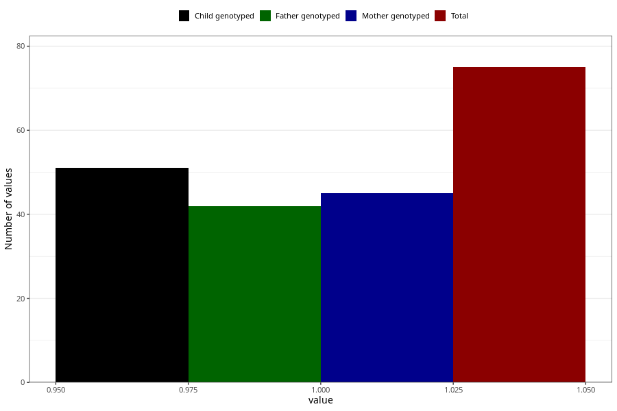

# father_eating_disorders
Variable mapping to questionnaire: q1f, question FF389.
.
- Number of values:

| Value | Total | Child genotyped | Mother genotyped | Father genotyped |
| ----- | ----- | --------------- | ---------------- | ---------------- |
| Missing | 113548 | 83304 | 71724 | 50176 |
| 1 | 75 | 51 | 45 |42 |

