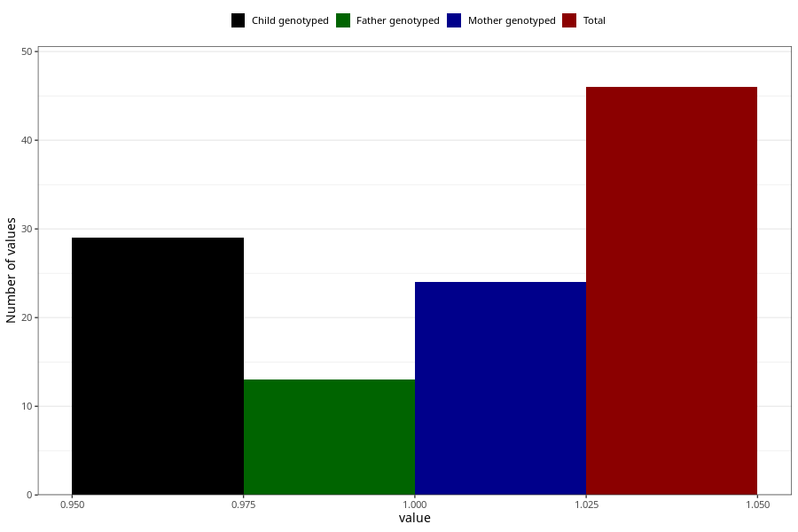

# amphetamine_during
Variable mapping to questionnaire: q1m, question AA1439.
.
- Number of values:

| Value | Total | Child genotyped | Mother genotyped | Father genotyped |
| ----- | ----- | --------------- | ---------------- | ---------------- |
| Missing | 113577 | 83326 | 71745 | 50205 |
| 1 | 46 | 29 | 24 |13 |

