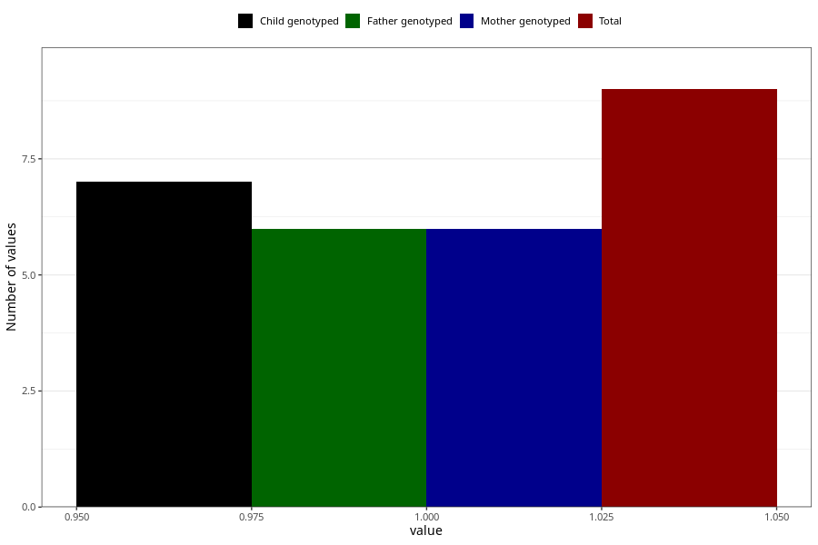

# heroin_during
Variable mapping to questionnaire: q1m, question AA1451.
.
- Number of values:

| Value | Total | Child genotyped | Mother genotyped | Father genotyped |
| ----- | ----- | --------------- | ---------------- | ---------------- |
| Missing | 113614 | 83348 | 71763 | 50212 |
| 1 | 9 | 7 | 6 |6 |

