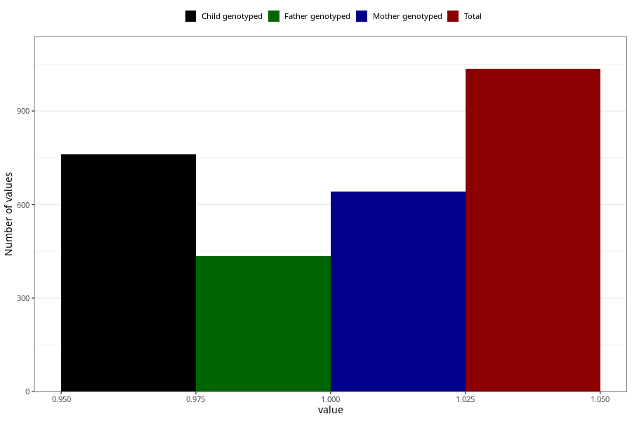

# high_blood_pressure_after
Variable mapping to questionnaire: q1m, question AA555.
.
- Number of values:

| Value | Total | Child genotyped | Mother genotyped | Father genotyped |
| ----- | ----- | --------------- | ---------------- | ---------------- |
| Missing | 112588 | 82594 | 71127 | 49783 |
| 1 | 1035 | 761 | 642 |435 |

