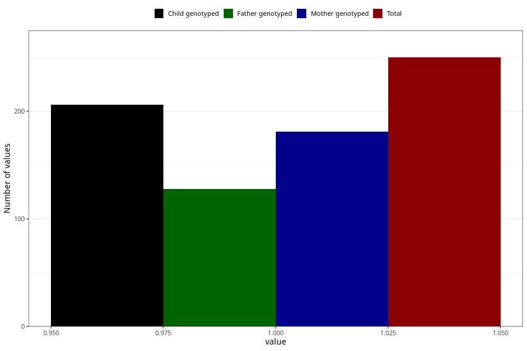

# high_cholesterol_during
Variable mapping to questionnaire: q1m, question AA546.
.
- Number of values:

| Value | Total | Child genotyped | Mother genotyped | Father genotyped |
| ----- | ----- | --------------- | ---------------- | ---------------- |
| Missing | 113373 | 83149 | 71588 | 50090 |
| 1 | 250 | 206 | 181 |128 |

