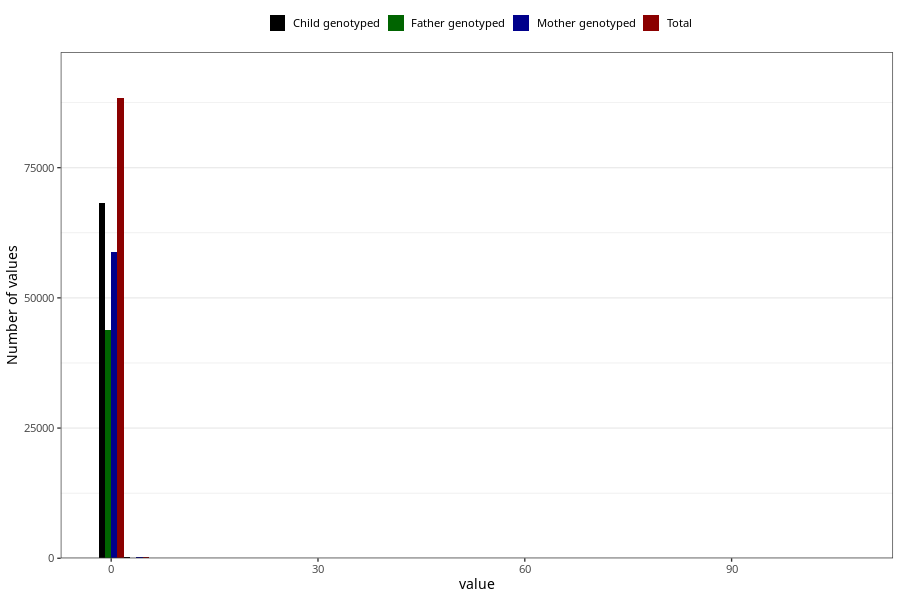

# alcohol
Variable mapping to questionnaire: q2, question ALKOHOL.
.
- Number of values:

| Value | Total | Child genotyped | Mother genotyped | Father genotyped |
| ----- | ----- | --------------- | ---------------- | ---------------- |
| Missing | 24927 | 14790 | 12674 | 6238 |
| 0 | 79482 | 61568 | 53014 |39536 |
| 0.29 | 501 | 368 | 313 |210 |
| 0.39 | 4647 | 3585 | 3107 |2312 |
| 0.44 | 96 | 72 | 61 |44 |
| 0.58 | 109 | 79 | 69 |47 |
| 0.68 | 931 | 695 | 614 |469 |
| 0.73 | 25 | 18 | 16 |7 |
| 0.78 | 1309 | 992 | 857 |635 |
| 0.83 | 103 | 77 | 71 |44 |
| 0.88 | 13 | 9 | 6 |6 |
| 0.96 | 127 | 99 | 86 |62 |
| 1.02 | 8 | 6 | 4 |2 |
| 1.07 | 263 | 195 | 171 |128 |
| 1.12 | 75 | 55 | 48 |34 |
| 1.17 | 1 | 1 | 1 |1 |
| 1.22 | 55 | 40 | 34 |20 |
| 1.25 | 15 | 8 | 5 |4 |
| 1.27 | 4 | 4 | 3 |2 |
| 1.35 | 246 | 179 | 165 |113 |
| 1.41 | 14 | 9 | 9 |7 |
| 1.46 | 6 | 4 | 4 |2 |
| 1.51 | 21 | 13 | 13 |8 |
| 1.64 | 18 | 11 | 10 |9 |
| 1.66 | 16 | 12 | 10 |5 |
| 1.69 | 225 | 175 | 160 |104 |
| 1.8 | 35 | 27 | 24 |15 |
| 1.85 | 3 | 2 | 2 |2 |
| 1.91 | 1 | 0 | 0 |0 |
| 1.95 | 1 | 1 | 1 |1 |
| 1.98 | 50 | 36 | 32 |20 |
| 2.03 | 32 | 27 | 22 |15 |
| 2.08 | 2 | 1 | 1 |1 |
| 2.13 | 8 | 7 | 7 |4 |
| 2.2 | 1 | 1 | 1 |1 |
| 2.24 | 17 | 12 | 11 |8 |
| 2.26 | 41 | 37 | 33 |23 |
| 2.42 | 9 | 8 | 7 |3 |
| 2.47 | 8 | 5 | 5 |2 |
| 2.57 | 5 | 5 | 5 |5 |
| 2.71 | 4 | 3 | 2 |2 |
| 2.86 | 2 | 1 | 1 |1 |
| 2.93 | 49 | 39 | 31 |26 |
| 3.15 | 2 | 1 | 1 |1 |
| 3.38 | 10 | 6 | 5 |5 |
| 3.6 | 3 | 2 | 1 |1 |
| 3.74 | 1 | 0 | 0 |0 |
| 3.82 | 4 | 3 | 1 |0 |
| 4.13 | 1 | 0 | 0 |0 |
| 4.52 | 2 | 2 | 2 |2 |
| 4.57 | 1 | 1 | 1 |0 |
| 4.85 | 3 | 1 | 0 |0 |
| 5.06 | 16 | 11 | 10 |6 |
| 5.35 | 6 | 6 | 5 |3 |
| 5.4 | 1 | 1 | 1 |0 |
| 5.43 | 3 | 3 | 3 |2 |
| 5.64 | 5 | 1 | 0 |1 |
| 5.79 | 4 | 3 | 2 |2 |
| 6.08 | 2 | 2 | 2 |2 |
| 6.23 | 2 | 0 | 0 |0 |
| 6.31 | 5 | 4 | 3 |2 |
| 6.52 | 1 | 0 | 0 |0 |
| 6.62 | 1 | 0 | 0 |0 |
| 6.75 | 1 | 1 | 1 |1 |
| 7.01 | 1 | 0 | 0 |0 |
| 7.2 | 1 | 1 | 1 |0 |
| 7.43 | 2 | 2 | 2 |2 |
| 7.92 | 1 | 1 | 1 |1 |
| 8.75 | 2 | 2 | 2 |2 |
| 8.8 | 1 | 1 | 1 |0 |
| 8.88 | 1 | 0 | 0 |0 |
| 9.02 | 1 | 1 | 0 |0 |
| 9.14 | 2 | 2 | 1 |2 |
| 9.69 | 1 | 1 | 1 |0 |
| 11.74 | 1 | 0 | 0 |0 |
| 11.85 | 5 | 5 | 1 |1 |
| 12.43 | 1 | 1 | 0 |0 |
| 12.87 | 1 | 1 | 1 |1 |
| 13.76 | 1 | 0 | 0 |0 |
| 13.81 | 1 | 0 | 0 |0 |
| 14.55 | 1 | 1 | 1 |0 |
| 14.67 | 1 | 1 | 1 |0 |
| 17.5 | 1 | 1 | 1 |0 |
| 24.14 | 1 | 1 | 0 |0 |
| 24.25 | 1 | 1 | 1 |0 |
| 24.95 | 1 | 0 | 0 |0 |
| 34.04 | 7 | 4 | 3 |0 |
| 41.2 | 1 | 1 | 1 |1 |
| 45.89 | 1 | 0 | 0 |0 |
| 47.4 | 2 | 1 | 1 |1 |
| 54.64 | 1 | 1 | 1 |1 |
| 80.64 | 1 | 0 | 0 |0 |
| 95.68 | 1 | 1 | 0 |0 |
| 106.1 | 1 | 0 | 0 |0 |

