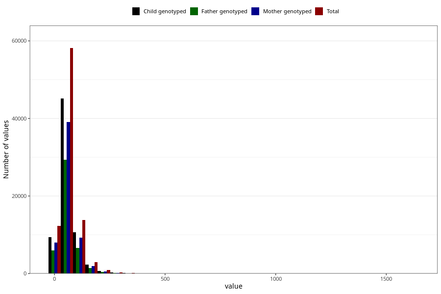

# sugar
Variable mapping to questionnaire: q2, question SUKKER.
.
- Number of values:

| Value | Total | Child genotyped | Mother genotyped | Father genotyped |
| ----- | ----- | --------------- | ---------------- | ---------------- |
| Missing | 24927 | 14790 | 12674 | 6238 |
| 0 | 14 | 10 | 6 |5 |
| 0.15 | 3 | 2 | 1 |0 |
| 0.38 | 1 | 1 | 1 |1 |
| 0.44 | 1 | 1 | 0 |0 |
| 0.54 | 1 | 1 | 1 |1 |
| 0.57 | 1 | 1 | 1 |1 |
| 0.61 | 1 | 1 | 0 |1 |
| 0.74 | 1 | 0 | 0 |0 |
| 0.76 | 3 | 2 | 2 |1 |
| 0.86 | 1 | 0 | 0 |0 |
| 0.91 | 1 | 1 | 1 |1 |
| 0.94 | 1 | 1 | 0 |0 |
| 1.18 | 1 | 0 | 0 |0 |
| 1.24 | 1 | 0 | 0 |0 |
| 1.25 | 2 | 0 | 0 |0 |
| 1.27 | 1 | 1 | 1 |0 |
| 1.3 | 1 | 0 | 0 |0 |
| 1.49 | 1 | 1 | 1 |0 |
| 1.5 | 1 | 1 | 1 |1 |
| 1.69 | 1 | 0 | 0 |0 |
| 1.76 | 1 | 1 | 1 |0 |
| 1.8 | 1 | 0 | 0 |0 |
| 1.84 | 1 | 1 | 1 |1 |
| 1.87 | 2 | 1 | 1 |0 |
| 1.89 | 1 | 0 | 0 |0 |
| 1.9 | 1 | 0 | 0 |0 |
| 1.92 | 1 | 1 | 1 |0 |
| 2.03 | 1 | 1 | 1 |1 |
| 2.05 | 1 | 1 | 1 |0 |
| 2.06 | 2 | 1 | 1 |1 |
| 2.14 | 1 | 1 | 1 |1 |
| 2.17 | 1 | 1 | 1 |0 |
| 2.33 | 1 | 0 | 0 |0 |
| 2.34 | 2 | 2 | 1 |1 |
| 2.35 | 1 | 1 | 1 |0 |
| 2.37 | 1 | 1 | 1 |1 |
| 2.44 | 1 | 1 | 1 |0 |
| 2.48 | 1 | 0 | 0 |0 |
| 2.51 | 1 | 1 | 1 |1 |
| 2.52 | 1 | 1 | 0 |1 |
| 2.53 | 1 | 1 | 1 |1 |
| 2.55 | 1 | 1 | 0 |0 |
| 2.64 | 1 | 0 | 0 |0 |
| 2.67 | 1 | 0 | 0 |0 |
| 2.72 | 1 | 1 | 1 |0 |
| 2.75 | 2 | 2 | 2 |1 |
| 2.76 | 1 | 1 | 1 |1 |
| 2.78 | 1 | 1 | 1 |1 |
| 2.8 | 1 | 0 | 0 |0 |
| 2.97 | 1 | 1 | 1 |0 |
| 3.01 | 1 | 1 | 0 |0 |
| 3.03 | 1 | 1 | 1 |1 |
| 3.04 | 1 | 1 | 1 |0 |
| 3.13 | 1 | 1 | 1 |0 |
| 3.16 | 1 | 1 | 1 |1 |
| 3.2 | 1 | 1 | 1 |1 |
| 3.25 | 1 | 0 | 0 |0 |
| 3.29 | 1 | 1 | 1 |1 |
| 3.3 | 2 | 1 | 1 |1 |
| 3.31 | 1 | 1 | 0 |0 |
| 3.42 | 1 | 1 | 1 |0 |
| 3.44 | 1 | 1 | 1 |1 |
| 3.49 | 1 | 0 | 0 |0 |
| 3.51 | 1 | 1 | 1 |1 |
| 3.54 | 1 | 0 | 0 |0 |
| 3.55 | 2 | 2 | 1 |2 |
| 3.6 | 1 | 0 | 0 |0 |
| 3.61 | 1 | 1 | 1 |0 |
| 3.77 | 1 | 0 | 0 |0 |
| 3.8 | 1 | 0 | 0 |0 |
| 3.81 | 1 | 0 | 0 |0 |
| 3.89 | 2 | 1 | 1 |0 |
| 3.9 | 1 | 1 | 0 |0 |
| 3.95 | 1 | 1 | 0 |0 |
| 4.01 | 1 | 0 | 0 |0 |
| 4.04 | 1 | 0 | 0 |0 |
| 4.05 | 1 | 1 | 1 |1 |
| 4.06 | 1 | 1 | 0 |1 |
| 4.1 | 1 | 0 | 0 |0 |
| 4.12 | 1 | 1 | 1 |1 |
| 4.16 | 1 | 0 | 0 |0 |
| 4.18 | 1 | 1 | 1 |1 |
| 4.2 | 1 | 1 | 1 |1 |
| 4.23 | 2 | 1 | 1 |1 |
| 4.24 | 1 | 0 | 0 |0 |
| 4.25 | 1 | 1 | 1 |0 |
| 4.29 | 3 | 2 | 2 |1 |
| 4.3 | 1 | 0 | 0 |0 |
| 4.34 | 1 | 1 | 1 |1 |
| 4.36 | 1 | 1 | 1 |1 |
| 4.38 | 1 | 1 | 1 |1 |
| 4.39 | 1 | 0 | 0 |0 |
| 4.4 | 1 | 0 | 0 |0 |
| 4.43 | 1 | 1 | 1 |0 |
| 4.44 | 2 | 2 | 2 |2 |
| 4.45 | 1 | 1 | 1 |1 |
| 4.48 | 1 | 0 | 0 |0 |
| 4.52 | 1 | 1 | 1 |1 |
| 4.53 | 2 | 1 | 0 |0 |
| 4.57 | 1 | 0 | 0 |0 |
| 4.59 | 1 | 0 | 0 |0 |
| 4.61 | 2 | 1 | 1 |1 |
| 4.64 | 2 | 2 | 1 |1 |
| 4.65 | 1 | 1 | 1 |1 |
| 4.79 | 2 | 2 | 2 |2 |
| 4.8 | 1 | 1 | 1 |1 |
| 4.81 | 1 | 1 | 0 |0 |
| 4.82 | 2 | 1 | 1 |1 |
| 4.83 | 1 | 1 | 1 |1 |
| 4.86 | 2 | 2 | 1 |1 |
| 4.88 | 1 | 1 | 1 |1 |
| 4.89 | 1 | 0 | 0 |0 |
| 4.91 | 2 | 2 | 2 |0 |
| 4.94 | 1 | 1 | 1 |1 |
| 4.95 | 2 | 2 | 1 |1 |
| 4.98 | 1 | 0 | 0 |0 |
| 5.01 | 1 | 1 | 1 |1 |
| 5.03 | 1 | 1 | 1 |1 |
| 5.05 | 1 | 1 | 1 |0 |
| 5.07 | 1 | 1 | 0 |0 |
| 5.09 | 1 | 1 | 0 |0 |
| 5.15 | 2 | 2 | 2 |1 |
| 5.16 | 1 | 0 | 0 |0 |
| 5.17 | 2 | 2 | 2 |2 |
| 5.19 | 1 | 0 | 0 |0 |
| 5.2 | 1 | 0 | 0 |0 |
| 5.21 | 2 | 2 | 2 |2 |
| 5.25 | 1 | 1 | 1 |1 |
| 5.27 | 1 | 1 | 1 |0 |
| 5.28 | 1 | 0 | 0 |0 |
| 5.29 | 2 | 1 | 1 |1 |
| 5.32 | 1 | 1 | 1 |1 |
| 5.35 | 1 | 1 | 1 |0 |
| 5.37 | 1 | 1 | 1 |1 |
| 5.4 | 1 | 0 | 0 |0 |
| 5.41 | 1 | 0 | 0 |0 |
| 5.43 | 1 | 0 | 0 |0 |
| 5.44 | 1 | 1 | 1 |1 |
| 5.45 | 1 | 0 | 0 |0 |
| 5.46 | 2 | 2 | 2 |2 |
| 5.49 | 2 | 2 | 1 |1 |
| 5.51 | 3 | 2 | 2 |2 |
| 5.52 | 3 | 1 | 0 |0 |
| 5.53 | 1 | 1 | 0 |0 |
| 5.6 | 1 | 1 | 1 |1 |
| 5.61 | 1 | 1 | 0 |1 |
| 5.62 | 2 | 2 | 1 |1 |
| 5.63 | 2 | 1 | 1 |0 |
| 5.66 | 1 | 1 | 1 |1 |
| 5.67 | 1 | 1 | 1 |1 |
| 5.7 | 1 | 1 | 1 |1 |
| 5.72 | 1 | 1 | 1 |0 |
| 5.73 | 1 | 0 | 0 |0 |
| 5.74 | 1 | 0 | 0 |0 |
| 5.76 | 1 | 1 | 1 |1 |
| 5.78 | 1 | 1 | 1 |0 |
| 5.8 | 1 | 0 | 0 |0 |
| 5.81 | 1 | 1 | 1 |1 |
| 5.83 | 3 | 1 | 1 |1 |
| 5.88 | 2 | 0 | 0 |0 |
| 5.9 | 2 | 0 | 0 |0 |
| 5.91 | 1 | 1 | 1 |0 |
| 5.92 | 1 | 1 | 1 |0 |
| 5.95 | 1 | 0 | 0 |0 |
| 5.97 | 2 | 2 | 1 |1 |
| 5.99 | 2 | 2 | 2 |1 |
| 6.02 | 1 | 1 | 0 |0 |
| 6.05 | 1 | 0 | 0 |0 |
| 6.06 | 1 | 0 | 0 |0 |
| 6.07 | 3 | 1 | 1 |1 |
| 6.08 | 1 | 1 | 1 |1 |
| 6.1 | 1 | 1 | 1 |0 |
| 6.11 | 3 | 2 | 1 |1 |
| 6.12 | 2 | 2 | 1 |0 |
| 6.14 | 1 | 1 | 1 |1 |
| 6.15 | 1 | 0 | 0 |0 |
| 6.16 | 1 | 0 | 0 |0 |
| 6.17 | 1 | 1 | 1 |1 |
| 6.19 | 1 | 1 | 1 |1 |
| 6.21 | 1 | 1 | 1 |1 |
| 6.22 | 1 | 1 | 1 |1 |
| 6.27 | 1 | 1 | 1 |0 |
| 6.28 | 3 | 3 | 2 |1 |
| 6.29 | 1 | 1 | 1 |1 |
| 6.3 | 1 | 1 | 1 |0 |
| 6.31 | 1 | 1 | 1 |1 |
| 6.32 | 2 | 1 | 1 |1 |
| 6.33 | 3 | 3 | 3 |2 |
| 6.34 | 1 | 1 | 1 |1 |
| 6.35 | 2 | 2 | 2 |2 |
| 6.37 | 1 | 1 | 1 |1 |
| 6.38 | 1 | 1 | 1 |1 |
| 6.39 | 1 | 1 | 0 |0 |
| 6.4 | 1 | 1 | 1 |0 |
| 6.41 | 1 | 1 | 1 |1 |
| 6.42 | 1 | 0 | 0 |0 |
| 6.43 | 2 | 2 | 2 |2 |
| 6.45 | 1 | 1 | 1 |0 |
| 6.46 | 4 | 4 | 3 |1 |
| 6.47 | 1 | 1 | 1 |1 |
| 6.49 | 2 | 1 | 0 |0 |
| 6.51 | 2 | 2 | 1 |1 |
| 6.52 | 3 | 2 | 2 |2 |
| 6.53 | 1 | 1 | 1 |1 |
| 6.57 | 3 | 2 | 2 |2 |
| 6.59 | 1 | 1 | 1 |1 |
| 6.6 | 2 | 0 | 0 |0 |
| 6.63 | 1 | 1 | 0 |0 |
| 6.64 | 1 | 1 | 1 |1 |
| 6.66 | 1 | 1 | 1 |1 |
| 6.69 | 1 | 1 | 1 |1 |
| 6.7 | 1 | 1 | 1 |1 |
| 6.71 | 1 | 1 | 0 |0 |
| 6.72 | 1 | 1 | 1 |1 |
| 6.73 | 2 | 2 | 2 |2 |
| 6.74 | 1 | 1 | 1 |0 |
| 6.76 | 2 | 2 | 2 |2 |
| 6.77 | 1 | 1 | 1 |1 |
| 6.78 | 3 | 3 | 3 |3 |
| 6.79 | 2 | 2 | 2 |2 |
| 6.82 | 1 | 1 | 1 |1 |
| 6.83 | 2 | 2 | 1 |0 |
| 6.84 | 1 | 0 | 0 |0 |
| 6.85 | 1 | 1 | 1 |1 |
| 6.86 | 1 | 1 | 1 |1 |
| 6.89 | 4 | 2 | 2 |2 |
| 6.91 | 1 | 1 | 1 |0 |
| 6.92 | 1 | 1 | 1 |1 |
| 6.94 | 4 | 4 | 4 |4 |
| 6.98 | 1 | 1 | 1 |1 |
| 6.99 | 1 | 1 | 1 |0 |
| 7 | 2 | 2 | 2 |2 |
| 7.02 | 4 | 3 | 3 |1 |
| 7.03 | 1 | 1 | 1 |0 |
| 7.04 | 1 | 0 | 0 |0 |
| 7.08 | 1 | 1 | 0 |0 |
| 7.09 | 2 | 2 | 2 |2 |
| 7.1 | 1 | 0 | 0 |0 |
| 7.13 | 2 | 1 | 1 |1 |
| 7.14 | 1 | 0 | 0 |0 |
| 7.15 | 2 | 2 | 2 |2 |
| 7.16 | 1 | 1 | 0 |0 |
| 7.17 | 2 | 1 | 1 |1 |
| 7.18 | 1 | 1 | 1 |1 |
| 7.19 | 1 | 1 | 0 |0 |
| 7.2 | 1 | 1 | 1 |1 |
| 7.21 | 1 | 1 | 1 |1 |
| 7.22 | 2 | 1 | 1 |1 |
| 7.23 | 3 | 2 | 2 |0 |
| 7.24 | 1 | 0 | 0 |0 |
| 7.25 | 2 | 0 | 0 |0 |
| 7.26 | 1 | 0 | 0 |0 |
| 7.27 | 2 | 2 | 1 |1 |
| 7.28 | 1 | 1 | 1 |1 |
| 7.3 | 1 | 1 | 1 |0 |
| 7.31 | 1 | 0 | 0 |0 |
| 7.34 | 1 | 1 | 1 |1 |
| 7.35 | 1 | 0 | 0 |0 |
| 7.36 | 1 | 0 | 0 |0 |
| 7.38 | 1 | 1 | 0 |0 |
| 7.4 | 1 | 1 | 1 |1 |
| 7.42 | 4 | 3 | 2 |1 |
| 7.44 | 1 | 1 | 1 |1 |
| 7.45 | 2 | 2 | 1 |0 |
| 7.46 | 1 | 0 | 0 |0 |
| 7.47 | 4 | 4 | 3 |2 |
| 7.48 | 1 | 1 | 1 |0 |
| 7.49 | 4 | 3 | 3 |1 |
| 7.51 | 1 | 0 | 0 |0 |
| 7.52 | 2 | 1 | 1 |1 |
| 7.53 | 1 | 0 | 0 |0 |
| 7.54 | 4 | 2 | 2 |2 |
| 7.55 | 1 | 1 | 1 |0 |
| 7.56 | 3 | 2 | 1 |0 |
| 7.58 | 2 | 1 | 1 |0 |
| 7.59 | 2 | 0 | 0 |0 |
| 7.61 | 2 | 0 | 0 |0 |
| 7.62 | 3 | 2 | 2 |2 |
| 7.63 | 2 | 1 | 0 |0 |
| 7.64 | 1 | 0 | 0 |0 |
| 7.65 | 1 | 1 | 1 |0 |
| 7.68 | 1 | 1 | 0 |0 |
| 7.69 | 1 | 1 | 1 |1 |
| 7.7 | 1 | 1 | 0 |0 |
| 7.71 | 4 | 3 | 3 |3 |
| 7.72 | 1 | 1 | 0 |0 |
| 7.73 | 1 | 1 | 1 |1 |
| 7.74 | 2 | 2 | 1 |1 |
| 7.75 | 2 | 2 | 2 |1 |
| 7.76 | 2 | 1 | 1 |1 |
| 7.77 | 1 | 0 | 0 |0 |
| 7.78 | 1 | 1 | 0 |0 |
| 7.79 | 1 | 1 | 0 |0 |
| 7.81 | 2 | 2 | 2 |2 |
| 7.83 | 2 | 2 | 1 |1 |
| 7.84 | 3 | 2 | 1 |1 |
| 7.85 | 2 | 2 | 2 |2 |
| 7.87 | 1 | 0 | 0 |0 |
| 7.91 | 2 | 2 | 2 |2 |
| 7.92 | 2 | 2 | 2 |2 |
| 7.93 | 1 | 0 | 0 |0 |
| 7.94 | 1 | 1 | 0 |1 |
| 7.96 | 5 | 3 | 2 |0 |
| 7.98 | 1 | 1 | 0 |0 |
| 7.99 | 1 | 0 | 0 |0 |
| 8 | 1 | 1 | 1 |1 |
| 8.01 | 2 | 2 | 1 |0 |
| 8.02 | 2 | 2 | 2 |1 |
| 8.03 | 1 | 1 | 1 |1 |
| 8.04 | 2 | 1 | 0 |0 |
| 8.05 | 1 | 1 | 1 |0 |
| 8.06 | 3 | 3 | 3 |2 |
| 8.07 | 2 | 0 | 0 |0 |
| 8.09 | 2 | 1 | 1 |0 |
| 8.1 | 2 | 2 | 2 |2 |
| 8.12 | 2 | 1 | 0 |0 |
| 8.13 | 1 | 0 | 0 |0 |
| 8.14 | 1 | 0 | 0 |0 |
| 8.16 | 2 | 2 | 0 |0 |
| 8.18 | 3 | 2 | 1 |1 |
| 8.19 | 1 | 1 | 1 |0 |
| 8.2 | 1 | 1 | 1 |1 |
| 8.21 | 4 | 4 | 3 |1 |
| 8.23 | 1 | 1 | 1 |1 |
| 8.24 | 4 | 2 | 2 |1 |
| 8.25 | 1 | 0 | 0 |0 |
| 8.26 | 1 | 0 | 0 |0 |
| 8.28 | 3 | 3 | 3 |2 |
| 8.31 | 3 | 3 | 2 |2 |
| 8.32 | 4 | 3 | 2 |3 |
| 8.33 | 3 | 2 | 2 |1 |
| 8.34 | 2 | 2 | 1 |1 |
| 8.36 | 1 | 1 | 1 |0 |
| 8.37 | 1 | 0 | 0 |0 |
| 8.38 | 1 | 1 | 1 |0 |
| 8.4 | 1 | 1 | 1 |0 |
| 8.41 | 3 | 3 | 3 |2 |
| 8.42 | 2 | 2 | 0 |0 |
| 8.43 | 1 | 1 | 1 |0 |
| 8.44 | 2 | 2 | 2 |2 |
| 8.45 | 4 | 4 | 4 |4 |
| 8.48 | 2 | 0 | 0 |0 |
| 8.49 | 1 | 1 | 1 |1 |
| 8.5 | 2 | 2 | 1 |0 |
| 8.51 | 1 | 1 | 1 |1 |
| 8.53 | 2 | 2 | 0 |0 |
| 8.54 | 2 | 1 | 1 |1 |
| 8.55 | 4 | 1 | 1 |1 |
| 8.56 | 2 | 1 | 1 |1 |
| 8.59 | 1 | 1 | 1 |1 |
| 8.6 | 1 | 0 | 0 |0 |
| 8.61 | 1 | 0 | 0 |0 |
| 8.63 | 1 | 1 | 1 |0 |
| 8.64 | 3 | 2 | 1 |0 |
| 8.66 | 2 | 2 | 2 |2 |
| 8.67 | 3 | 2 | 2 |1 |
| 8.68 | 1 | 1 | 1 |1 |
| 8.7 | 1 | 0 | 0 |0 |
| 8.73 | 2 | 2 | 2 |1 |
| 8.74 | 5 | 3 | 2 |2 |
| 8.76 | 1 | 1 | 1 |0 |
| 8.77 | 2 | 2 | 0 |0 |
| 8.79 | 2 | 2 | 2 |2 |
| 8.8 | 2 | 2 | 2 |2 |
| 8.81 | 2 | 2 | 2 |2 |
| 8.82 | 1 | 1 | 1 |1 |
| 8.83 | 1 | 1 | 1 |1 |
| 8.84 | 1 | 1 | 0 |0 |
| 8.85 | 1 | 1 | 1 |1 |
| 8.86 | 2 | 0 | 0 |0 |
| 8.87 | 3 | 3 | 2 |1 |
| 8.88 | 1 | 1 | 1 |1 |
| 8.9 | 1 | 0 | 0 |0 |
| 8.91 | 2 | 2 | 2 |2 |
| 8.92 | 1 | 1 | 1 |0 |
| 8.94 | 2 | 2 | 2 |1 |
| 8.95 | 1 | 1 | 1 |1 |
| 8.96 | 2 | 2 | 2 |2 |
| 8.97 | 2 | 2 | 2 |2 |
| 8.98 | 1 | 0 | 0 |0 |
| 8.99 | 1 | 1 | 1 |0 |
| 9 | 2 | 1 | 0 |0 |
| 9.02 | 1 | 1 | 1 |1 |
| 9.03 | 1 | 1 | 1 |1 |
| 9.05 | 1 | 1 | 1 |1 |
| 9.06 | 4 | 3 | 3 |3 |
| 9.07 | 1 | 1 | 1 |1 |
| 9.1 | 3 | 0 | 0 |0 |
| 9.11 | 1 | 1 | 1 |1 |
| 9.12 | 3 | 3 | 3 |2 |
| 9.15 | 2 | 2 | 2 |1 |
| 9.16 | 1 | 0 | 0 |0 |
| 9.17 | 1 | 1 | 1 |1 |
| 9.18 | 1 | 1 | 0 |0 |
| 9.19 | 1 | 1 | 0 |0 |
| 9.2 | 2 | 1 | 1 |1 |
| 9.21 | 1 | 1 | 0 |0 |
| 9.22 | 2 | 1 | 1 |1 |
| 9.23 | 4 | 4 | 3 |1 |
| 9.25 | 2 | 1 | 1 |1 |
| 9.27 | 2 | 1 | 0 |0 |
| 9.28 | 1 | 1 | 1 |0 |
| 9.29 | 2 | 2 | 2 |1 |
| 9.3 | 2 | 1 | 1 |0 |
| 9.31 | 5 | 4 | 4 |1 |
| 9.32 | 5 | 0 | 0 |0 |
| 9.33 | 1 | 1 | 1 |1 |
| 9.34 | 1 | 1 | 1 |1 |
| 9.35 | 2 | 1 | 1 |1 |
| 9.36 | 1 | 1 | 0 |0 |
| 9.37 | 1 | 1 | 1 |0 |
| 9.38 | 2 | 1 | 1 |1 |
| 9.39 | 1 | 1 | 1 |1 |
| 9.4 | 2 | 2 | 2 |1 |
| 9.41 | 2 | 1 | 0 |0 |
| 9.42 | 1 | 1 | 0 |0 |
| 9.43 | 2 | 2 | 2 |2 |
| 9.44 | 1 | 1 | 0 |1 |
| 9.45 | 3 | 2 | 2 |2 |
| 9.46 | 2 | 1 | 1 |1 |
| 9.47 | 1 | 1 | 1 |1 |
| 9.48 | 2 | 1 | 0 |0 |
| 9.49 | 4 | 2 | 2 |2 |
| 9.5 | 1 | 0 | 0 |0 |
| 9.51 | 3 | 2 | 2 |1 |
| 9.53 | 3 | 3 | 2 |1 |
| 9.54 | 2 | 1 | 1 |1 |
| 9.55 | 2 | 0 | 0 |0 |
| 9.56 | 2 | 1 | 0 |0 |
| 9.57 | 1 | 1 | 1 |0 |
| 9.58 | 4 | 2 | 1 |1 |
| 9.59 | 3 | 2 | 2 |0 |
| 9.6 | 2 | 2 | 2 |2 |
| 9.61 | 1 | 1 | 1 |1 |
| 9.62 | 1 | 0 | 0 |0 |
| 9.63 | 2 | 1 | 1 |1 |
| 9.64 | 1 | 1 | 1 |1 |
| 9.65 | 2 | 1 | 1 |0 |
| 9.66 | 1 | 1 | 1 |1 |
| 9.67 | 3 | 2 | 2 |2 |
| 9.68 | 1 | 1 | 1 |1 |
| 9.69 | 5 | 4 | 4 |3 |
| 9.7 | 3 | 2 | 2 |2 |
| 9.72 | 2 | 1 | 1 |1 |
| 9.73 | 1 | 1 | 1 |0 |
| 9.74 | 2 | 1 | 1 |0 |
| 9.75 | 2 | 2 | 1 |2 |
| 9.76 | 3 | 1 | 1 |0 |
| 9.77 | 3 | 2 | 1 |0 |
| 9.79 | 2 | 0 | 0 |0 |
| 9.8 | 1 | 1 | 1 |1 |
| 9.81 | 2 | 2 | 2 |2 |
| 9.82 | 2 | 1 | 1 |1 |
| 9.84 | 3 | 0 | 0 |0 |
| 9.88 | 1 | 1 | 1 |1 |
| 9.89 | 5 | 5 | 4 |2 |
| 9.9 | 1 | 1 | 1 |0 |
| 9.91 | 2 | 2 | 2 |2 |
| 9.92 | 3 | 3 | 3 |3 |
| 9.93 | 1 | 1 | 1 |1 |
| 9.94 | 3 | 3 | 3 |3 |
| 9.95 | 2 | 2 | 2 |2 |
| 9.97 | 5 | 2 | 2 |2 |
| 9.98 | 4 | 3 | 2 |1 |
| 10 | 4 | 4 | 4 |4 |
| 10.01 | 1 | 1 | 1 |1 |
| 10.02 | 1 | 0 | 0 |0 |
| 10.03 | 1 | 1 | 1 |1 |
| 10.04 | 3 | 2 | 1 |1 |
| 10.06 | 2 | 2 | 1 |1 |
| 10.07 | 2 | 2 | 2 |2 |
| 10.09 | 3 | 2 | 1 |0 |
| 10.1 | 3 | 1 | 1 |1 |
| 10.11 | 2 | 1 | 1 |1 |
| 10.12 | 1 | 0 | 0 |0 |
| 10.14 | 3 | 1 | 1 |1 |
| 10.16 | 2 | 2 | 1 |1 |
| 10.17 | 3 | 3 | 3 |2 |
| 10.19 | 5 | 4 | 4 |4 |
| 10.2 | 5 | 4 | 2 |2 |
| 10.21 | 1 | 0 | 0 |0 |
| 10.22 | 3 | 3 | 3 |2 |
| 10.23 | 3 | 2 | 2 |1 |
| 10.24 | 2 | 2 | 2 |2 |
| 10.25 | 3 | 3 | 3 |3 |
| 10.26 | 5 | 3 | 3 |2 |
| 10.27 | 1 | 1 | 1 |0 |
| 10.28 | 2 | 2 | 2 |1 |
| 10.29 | 6 | 3 | 2 |2 |
| 10.3 | 1 | 0 | 0 |0 |
| 10.31 | 3 | 2 | 2 |1 |
| 10.32 | 1 | 1 | 1 |1 |
| 10.34 | 1 | 1 | 1 |1 |
| 10.36 | 2 | 2 | 1 |1 |
| 10.38 | 2 | 0 | 0 |0 |
| 10.39 | 1 | 1 | 1 |0 |
| 10.4 | 2 | 2 | 2 |2 |
| 10.41 | 2 | 2 | 2 |2 |
| 10.42 | 2 | 2 | 0 |1 |
| 10.43 | 1 | 0 | 0 |0 |
| 10.44 | 2 | 2 | 2 |2 |
| 10.45 | 3 | 2 | 2 |2 |
| 10.46 | 5 | 5 | 4 |4 |
| 10.47 | 1 | 1 | 1 |1 |
| 10.48 | 3 | 3 | 3 |2 |
| 10.49 | 4 | 4 | 3 |3 |
| 10.5 | 1 | 1 | 1 |1 |
| 10.51 | 3 | 3 | 3 |2 |
| 10.52 | 1 | 1 | 1 |1 |
| 10.53 | 3 | 2 | 2 |2 |
| 10.54 | 3 | 2 | 2 |0 |
| 10.55 | 2 | 1 | 0 |0 |
| 10.56 | 3 | 3 | 2 |2 |
| 10.57 | 4 | 2 | 1 |2 |
| 10.58 | 2 | 1 | 0 |0 |
| 10.59 | 1 | 1 | 1 |0 |
| 10.6 | 3 | 3 | 2 |1 |
| 10.61 | 2 | 1 | 1 |1 |
| 10.62 | 1 | 1 | 1 |1 |
| 10.63 | 1 | 1 | 1 |1 |
| 10.65 | 2 | 2 | 2 |1 |
| 10.66 | 3 | 2 | 2 |2 |
| 10.67 | 2 | 2 | 1 |2 |
| 10.68 | 7 | 6 | 5 |5 |
| 10.69 | 2 | 2 | 1 |1 |
| 10.7 | 2 | 2 | 2 |2 |
| 10.71 | 1 | 1 | 1 |0 |
| 10.73 | 3 | 3 | 2 |2 |
| 10.74 | 2 | 2 | 2 |2 |
| 10.75 | 3 | 2 | 1 |1 |
| 10.76 | 3 | 3 | 2 |2 |
| 10.77 | 1 | 1 | 1 |1 |
| 10.78 | 1 | 1 | 1 |0 |
| 10.79 | 6 | 4 | 4 |2 |
| 10.8 | 1 | 0 | 0 |0 |
| 10.81 | 4 | 3 | 3 |3 |
| 10.82 | 1 | 1 | 1 |0 |
| 10.83 | 3 | 1 | 1 |1 |
| 10.84 | 5 | 3 | 2 |3 |
| 10.85 | 6 | 5 | 2 |1 |
| 10.86 | 2 | 1 | 1 |0 |
| 10.87 | 2 | 1 | 1 |1 |
| 10.88 | 2 | 2 | 2 |2 |
| 10.89 | 2 | 2 | 2 |1 |
| 10.9 | 1 | 1 | 0 |0 |
| 10.92 | 2 | 2 | 2 |2 |
| 10.93 | 3 | 2 | 2 |2 |
| 10.94 | 1 | 1 | 0 |0 |
| 10.95 | 1 | 0 | 0 |0 |
| 10.96 | 3 | 2 | 2 |0 |
| 10.98 | 1 | 1 | 1 |1 |
| 10.99 | 1 | 1 | 1 |0 |
| 11.01 | 4 | 4 | 3 |3 |
| 11.02 | 4 | 1 | 1 |1 |
| 11.03 | 4 | 3 | 3 |3 |
| 11.04 | 1 | 1 | 1 |0 |
| 11.06 | 4 | 3 | 3 |3 |
| 11.07 | 2 | 2 | 2 |2 |
| 11.08 | 2 | 1 | 1 |1 |
| 11.1 | 3 | 2 | 2 |2 |
| 11.11 | 4 | 3 | 3 |3 |
| 11.12 | 2 | 2 | 2 |0 |
| 11.13 | 1 | 0 | 0 |0 |
| 11.14 | 6 | 3 | 3 |2 |
| 11.15 | 3 | 3 | 2 |3 |
| 11.16 | 3 | 3 | 2 |2 |
| 11.18 | 2 | 1 | 1 |1 |
| 11.19 | 3 | 2 | 1 |1 |
| 11.2 | 2 | 2 | 1 |0 |
| 11.21 | 4 | 3 | 3 |3 |
| 11.22 | 3 | 3 | 0 |0 |
| 11.23 | 2 | 2 | 1 |0 |
| 11.24 | 3 | 3 | 3 |2 |
| 11.25 | 5 | 3 | 3 |3 |
| 11.26 | 2 | 2 | 2 |2 |
| 11.27 | 2 | 1 | 1 |1 |
| 11.28 | 1 | 1 | 1 |1 |
| 11.29 | 6 | 3 | 2 |2 |
| 11.3 | 4 | 2 | 2 |0 |
| 11.31 | 3 | 2 | 2 |2 |
| 11.32 | 5 | 5 | 4 |4 |
| 11.33 | 3 | 2 | 1 |1 |
| 11.34 | 2 | 1 | 0 |0 |
| 11.35 | 4 | 3 | 3 |3 |
| 11.36 | 2 | 2 | 1 |1 |
| 11.37 | 3 | 2 | 1 |2 |
| 11.38 | 3 | 2 | 1 |1 |
| 11.39 | 2 | 1 | 1 |1 |
| 11.4 | 3 | 1 | 0 |0 |
| 11.41 | 5 | 4 | 3 |2 |
| 11.42 | 3 | 2 | 2 |1 |
| 11.43 | 4 | 3 | 3 |0 |
| 11.44 | 2 | 2 | 2 |1 |
| 11.45 | 2 | 1 | 1 |1 |
| 11.46 | 3 | 2 | 2 |2 |
| 11.47 | 2 | 2 | 2 |1 |
| 11.49 | 2 | 1 | 1 |1 |
| 11.5 | 2 | 1 | 1 |0 |
| 11.51 | 3 | 2 | 1 |0 |
| 11.52 | 1 | 1 | 1 |1 |
| 11.53 | 3 | 3 | 3 |2 |
| 11.54 | 2 | 2 | 2 |1 |
| 11.55 | 2 | 2 | 2 |1 |
| 11.56 | 3 | 3 | 3 |2 |
| 11.57 | 6 | 3 | 3 |2 |
| 11.59 | 5 | 1 | 0 |0 |
| 11.6 | 2 | 2 | 2 |2 |
| 11.61 | 5 | 4 | 4 |3 |
| 11.62 | 4 | 4 | 2 |3 |
| 11.63 | 2 | 1 | 1 |1 |
| 11.64 | 1 | 1 | 1 |0 |
| 11.65 | 5 | 4 | 3 |2 |
| 11.66 | 4 | 3 | 3 |3 |
| 11.68 | 2 | 2 | 1 |1 |
| 11.69 | 2 | 2 | 2 |1 |
| 11.7 | 1 | 1 | 1 |0 |
| 11.71 | 2 | 2 | 2 |0 |
| 11.72 | 2 | 2 | 1 |1 |
| 11.73 | 3 | 1 | 1 |1 |
| 11.74 | 3 | 3 | 3 |3 |
| 11.75 | 1 | 1 | 0 |0 |
| 11.76 | 1 | 1 | 1 |0 |
| 11.77 | 3 | 3 | 3 |2 |
| 11.78 | 1 | 1 | 0 |0 |
| 11.79 | 3 | 2 | 1 |1 |
| 11.8 | 3 | 2 | 2 |1 |
| 11.82 | 3 | 3 | 3 |3 |
| 11.83 | 3 | 3 | 3 |1 |
| 11.84 | 4 | 3 | 3 |2 |
| 11.85 | 2 | 2 | 0 |2 |
| 11.86 | 1 | 0 | 0 |0 |
| 11.87 | 4 | 4 | 0 |1 |
| 11.88 | 1 | 0 | 0 |0 |
| 11.89 | 3 | 3 | 3 |3 |
| 11.9 | 3 | 3 | 2 |2 |
| 11.91 | 3 | 3 | 3 |3 |
| 11.92 | 2 | 2 | 1 |2 |
| 11.93 | 2 | 2 | 2 |0 |
| 11.94 | 2 | 1 | 1 |1 |
| 11.95 | 4 | 4 | 2 |3 |
| 11.96 | 3 | 2 | 2 |2 |
| 11.98 | 3 | 1 | 1 |1 |
| 11.99 | 2 | 2 | 2 |2 |
| 12 | 1 | 1 | 1 |1 |
| 12.01 | 4 | 4 | 4 |2 |
| 12.02 | 2 | 2 | 1 |1 |
| 12.03 | 2 | 1 | 1 |0 |
| 12.04 | 3 | 3 | 2 |3 |
| 12.05 | 2 | 2 | 2 |1 |
| 12.06 | 2 | 2 | 2 |2 |
| 12.08 | 1 | 0 | 0 |0 |
| 12.09 | 5 | 4 | 4 |2 |
| 12.1 | 1 | 1 | 1 |1 |
| 12.11 | 3 | 2 | 2 |1 |
| 12.12 | 6 | 4 | 4 |2 |
| 12.13 | 3 | 3 | 3 |2 |
| 12.14 | 6 | 5 | 5 |3 |
| 12.15 | 3 | 3 | 3 |1 |
| 12.16 | 3 | 2 | 2 |2 |
| 12.18 | 7 | 5 | 5 |3 |
| 12.2 | 6 | 4 | 3 |2 |
| 12.21 | 2 | 2 | 1 |2 |
| 12.22 | 5 | 3 | 3 |3 |
| 12.23 | 5 | 5 | 4 |4 |
| 12.24 | 1 | 0 | 0 |0 |
| 12.25 | 4 | 3 | 2 |2 |
| 12.26 | 1 | 0 | 0 |0 |
| 12.27 | 1 | 0 | 0 |0 |
| 12.28 | 3 | 2 | 2 |2 |
| 12.29 | 3 | 3 | 3 |2 |
| 12.3 | 3 | 2 | 2 |1 |
| 12.31 | 3 | 3 | 3 |3 |
| 12.32 | 7 | 4 | 4 |3 |
| 12.33 | 3 | 2 | 1 |2 |
| 12.34 | 2 | 1 | 1 |1 |
| 12.35 | 5 | 3 | 2 |2 |
| 12.36 | 3 | 3 | 3 |2 |
| 12.37 | 1 | 1 | 1 |1 |
| 12.38 | 1 | 1 | 1 |1 |
| 12.39 | 1 | 1 | 1 |1 |
| 12.4 | 5 | 4 | 3 |3 |
| 12.41 | 3 | 3 | 3 |3 |
| 12.42 | 3 | 3 | 3 |1 |
| 12.43 | 4 | 3 | 3 |3 |
| 12.44 | 4 | 4 | 3 |4 |
| 12.45 | 3 | 3 | 3 |3 |
| 12.46 | 6 | 5 | 2 |2 |
| 12.47 | 1 | 1 | 1 |1 |
| 12.48 | 3 | 3 | 3 |3 |
| 12.49 | 2 | 1 | 1 |1 |
| 12.5 | 2 | 2 | 2 |2 |
| 12.51 | 4 | 4 | 3 |3 |
| 12.52 | 3 | 3 | 3 |2 |
| 12.53 | 2 | 2 | 2 |1 |
| 12.55 | 5 | 3 | 2 |2 |
| 12.56 | 4 | 2 | 2 |2 |
| 12.57 | 4 | 3 | 2 |2 |
| 12.58 | 3 | 2 | 1 |1 |
| 12.59 | 2 | 1 | 1 |0 |
| 12.61 | 1 | 1 | 1 |1 |
| 12.62 | 3 | 2 | 2 |1 |
| 12.63 | 5 | 5 | 5 |5 |
| 12.64 | 4 | 3 | 3 |3 |
| 12.65 | 5 | 3 | 2 |1 |
| 12.66 | 3 | 3 | 2 |3 |
| 12.67 | 4 | 3 | 2 |2 |
| 12.68 | 1 | 1 | 1 |1 |
| 12.69 | 2 | 2 | 1 |2 |
| 12.7 | 2 | 1 | 1 |1 |
| 12.71 | 3 | 1 | 0 |0 |
| 12.72 | 2 | 2 | 1 |1 |
| 12.73 | 3 | 2 | 2 |2 |
| 12.74 | 2 | 1 | 1 |0 |
| 12.75 | 2 | 2 | 2 |2 |
| 12.76 | 3 | 3 | 3 |2 |
| 12.77 | 6 | 4 | 2 |1 |
| 12.78 | 1 | 0 | 0 |0 |
| 12.79 | 2 | 1 | 1 |1 |
| 12.8 | 3 | 2 | 2 |2 |
| 12.81 | 3 | 2 | 1 |1 |
| 12.82 | 1 | 1 | 1 |1 |
| 12.83 | 3 | 3 | 3 |3 |
| 12.84 | 3 | 2 | 1 |1 |
| 12.85 | 6 | 3 | 2 |1 |
| 12.86 | 3 | 0 | 0 |0 |
| 12.87 | 4 | 3 | 1 |1 |
| 12.88 | 3 | 3 | 3 |2 |
| 12.89 | 3 | 3 | 2 |2 |
| 12.9 | 4 | 4 | 4 |3 |
| 12.91 | 1 | 0 | 0 |0 |
| 12.92 | 1 | 1 | 1 |1 |
| 12.93 | 4 | 4 | 4 |3 |
| 12.94 | 4 | 4 | 3 |2 |
| 12.95 | 1 | 0 | 0 |0 |
| 12.96 | 3 | 1 | 1 |1 |
| 12.97 | 3 | 3 | 3 |2 |
| 12.98 | 11 | 11 | 10 |6 |
| 12.99 | 1 | 1 | 1 |1 |
| 13 | 3 | 3 | 3 |3 |
| 13.01 | 2 | 2 | 2 |1 |
| 13.02 | 3 | 3 | 3 |2 |
| 13.04 | 1 | 1 | 1 |0 |
| 13.05 | 3 | 3 | 3 |2 |
| 13.06 | 3 | 2 | 2 |1 |
| 13.07 | 3 | 2 | 1 |1 |
| 13.08 | 3 | 3 | 3 |2 |
| 13.09 | 3 | 2 | 1 |1 |
| 13.1 | 3 | 3 | 3 |3 |
| 13.12 | 3 | 3 | 2 |2 |
| 13.13 | 2 | 1 | 1 |1 |
| 13.14 | 4 | 4 | 3 |2 |
| 13.15 | 8 | 4 | 4 |2 |
| 13.16 | 1 | 1 | 0 |0 |
| 13.17 | 2 | 2 | 2 |1 |
| 13.18 | 7 | 4 | 2 |1 |
| 13.19 | 2 | 2 | 2 |1 |
| 13.2 | 5 | 4 | 3 |0 |
| 13.21 | 2 | 1 | 1 |1 |
| 13.23 | 1 | 1 | 0 |0 |
| 13.24 | 1 | 1 | 1 |1 |
| 13.25 | 4 | 4 | 2 |1 |
| 13.26 | 6 | 5 | 5 |5 |
| 13.27 | 3 | 1 | 1 |1 |
| 13.28 | 6 | 3 | 1 |2 |
| 13.29 | 5 | 4 | 4 |4 |
| 13.3 | 2 | 1 | 0 |0 |
| 13.31 | 3 | 2 | 2 |2 |
| 13.32 | 1 | 1 | 1 |1 |
| 13.33 | 5 | 3 | 3 |3 |
| 13.34 | 8 | 7 | 7 |6 |
| 13.35 | 6 | 3 | 2 |1 |
| 13.36 | 6 | 4 | 3 |1 |
| 13.37 | 4 | 4 | 3 |1 |
| 13.38 | 1 | 1 | 1 |0 |
| 13.39 | 6 | 4 | 4 |3 |
| 13.41 | 1 | 1 | 1 |0 |
| 13.42 | 4 | 3 | 3 |1 |
| 13.43 | 2 | 2 | 2 |1 |
| 13.45 | 3 | 3 | 3 |2 |
| 13.46 | 3 | 1 | 1 |1 |
| 13.47 | 5 | 4 | 4 |4 |
| 13.48 | 1 | 1 | 1 |1 |
| 13.49 | 2 | 2 | 1 |0 |
| 13.5 | 4 | 4 | 2 |2 |
| 13.51 | 3 | 2 | 2 |2 |
| 13.52 | 6 | 6 | 4 |4 |
| 13.53 | 2 | 2 | 2 |2 |
| 13.54 | 2 | 2 | 2 |1 |
| 13.55 | 3 | 3 | 1 |1 |
| 13.56 | 3 | 2 | 2 |2 |
| 13.57 | 1 | 0 | 0 |0 |
| 13.58 | 6 | 6 | 6 |2 |
| 13.59 | 4 | 3 | 1 |0 |
| 13.6 | 4 | 3 | 3 |3 |
| 13.61 | 2 | 1 | 1 |1 |
| 13.62 | 4 | 3 | 3 |3 |
| 13.63 | 2 | 2 | 1 |1 |
| 13.64 | 2 | 1 | 1 |1 |
| 13.65 | 8 | 2 | 2 |1 |
| 13.66 | 2 | 1 | 0 |0 |
| 13.67 | 4 | 4 | 3 |2 |
| 13.68 | 1 | 1 | 1 |1 |
| 13.69 | 5 | 4 | 4 |3 |
| 13.7 | 1 | 1 | 0 |0 |
| 13.71 | 6 | 5 | 3 |2 |
| 13.72 | 2 | 2 | 2 |2 |
| 13.73 | 4 | 3 | 3 |1 |
| 13.74 | 6 | 6 | 5 |3 |
| 13.75 | 7 | 5 | 2 |2 |
| 13.76 | 2 | 2 | 2 |1 |
| 13.77 | 4 | 3 | 2 |0 |
| 13.78 | 2 | 2 | 2 |2 |
| 13.8 | 3 | 0 | 0 |0 |
| 13.81 | 4 | 4 | 4 |2 |
| 13.82 | 3 | 3 | 2 |2 |
| 13.83 | 4 | 2 | 2 |1 |
| 13.84 | 1 | 1 | 1 |0 |
| 13.85 | 5 | 4 | 3 |2 |
| 13.86 | 5 | 4 | 4 |2 |
| 13.87 | 5 | 5 | 5 |3 |
| 13.88 | 4 | 3 | 3 |3 |
| 13.89 | 1 | 1 | 0 |0 |
| 13.9 | 2 | 2 | 2 |2 |
| 13.91 | 2 | 2 | 2 |1 |
| 13.92 | 2 | 2 | 2 |0 |
| 13.93 | 1 | 1 | 1 |1 |
| 13.94 | 4 | 2 | 1 |0 |
| 13.95 | 7 | 5 | 5 |5 |
| 13.96 | 6 | 5 | 5 |4 |
| 13.97 | 6 | 4 | 4 |4 |
| 13.98 | 3 | 3 | 3 |3 |
| 13.99 | 5 | 3 | 3 |2 |
| 14 | 6 | 6 | 6 |4 |
| 14.01 | 3 | 3 | 2 |3 |
| 14.02 | 2 | 2 | 1 |1 |
| 14.03 | 3 | 3 | 3 |3 |
| 14.04 | 2 | 2 | 2 |0 |
| 14.05 | 3 | 3 | 3 |1 |
| 14.06 | 3 | 3 | 3 |3 |
| 14.07 | 2 | 2 | 2 |2 |
| 14.08 | 1 | 1 | 1 |1 |
| 14.09 | 2 | 0 | 0 |0 |
| 14.1 | 6 | 3 | 2 |2 |
| 14.11 | 3 | 3 | 2 |2 |
| 14.12 | 3 | 3 | 3 |2 |
| 14.13 | 3 | 3 | 2 |1 |
| 14.14 | 5 | 3 | 3 |3 |
| 14.15 | 5 | 4 | 2 |3 |
| 14.16 | 2 | 1 | 1 |1 |
| 14.17 | 5 | 4 | 4 |3 |
| 14.18 | 2 | 2 | 2 |2 |
| 14.19 | 3 | 2 | 0 |0 |
| 14.2 | 6 | 5 | 5 |4 |
| 14.21 | 4 | 2 | 1 |0 |
| 14.22 | 4 | 4 | 3 |2 |
| 14.23 | 4 | 4 | 3 |3 |
| 14.24 | 7 | 6 | 6 |5 |
| 14.25 | 3 | 2 | 1 |1 |
| 14.26 | 5 | 4 | 2 |3 |
| 14.27 | 3 | 3 | 2 |1 |
| 14.28 | 5 | 1 | 1 |1 |
| 14.29 | 5 | 5 | 5 |5 |
| 14.3 | 5 | 3 | 2 |2 |
| 14.31 | 2 | 2 | 2 |2 |
| 14.32 | 2 | 0 | 0 |0 |
| 14.33 | 2 | 1 | 0 |0 |
| 14.34 | 4 | 4 | 4 |1 |
| 14.35 | 4 | 4 | 2 |0 |
| 14.36 | 5 | 5 | 5 |5 |
| 14.37 | 2 | 2 | 1 |1 |
| 14.38 | 5 | 2 | 1 |1 |
| 14.39 | 3 | 2 | 1 |1 |
| 14.4 | 2 | 2 | 0 |0 |
| 14.41 | 7 | 4 | 4 |2 |
| 14.42 | 2 | 1 | 1 |0 |
| 14.43 | 2 | 2 | 1 |1 |
| 14.44 | 3 | 1 | 1 |1 |
| 14.45 | 6 | 5 | 2 |1 |
| 14.46 | 1 | 1 | 1 |1 |
| 14.47 | 3 | 0 | 0 |0 |
| 14.48 | 4 | 3 | 3 |2 |
| 14.49 | 2 | 2 | 2 |1 |
| 14.5 | 3 | 3 | 3 |2 |
| 14.51 | 4 | 2 | 1 |1 |
| 14.52 | 1 | 0 | 0 |0 |
| 14.53 | 6 | 5 | 5 |4 |
| 14.54 | 5 | 3 | 3 |3 |
| 14.55 | 4 | 4 | 4 |2 |
| 14.56 | 6 | 4 | 4 |3 |
| 14.57 | 5 | 5 | 5 |5 |
| 14.58 | 5 | 3 | 3 |3 |
| 14.59 | 5 | 2 | 2 |2 |
| 14.6 | 2 | 1 | 1 |1 |
| 14.61 | 1 | 1 | 1 |1 |
| 14.62 | 6 | 6 | 4 |4 |
| 14.63 | 1 | 0 | 0 |0 |
| 14.64 | 3 | 2 | 1 |1 |
| 14.65 | 7 | 6 | 4 |3 |
| 14.66 | 3 | 1 | 1 |1 |
| 14.67 | 3 | 3 | 1 |2 |
| 14.68 | 2 | 1 | 1 |1 |
| 14.69 | 4 | 4 | 4 |2 |
| 14.7 | 2 | 1 | 1 |0 |
| 14.71 | 1 | 1 | 1 |1 |
| 14.72 | 1 | 1 | 1 |1 |
| 14.73 | 4 | 4 | 4 |3 |
| 14.74 | 4 | 4 | 3 |2 |
| 14.75 | 2 | 2 | 2 |2 |
| 14.76 | 3 | 1 | 1 |1 |
| 14.77 | 8 | 7 | 6 |5 |
| 14.78 | 4 | 2 | 2 |1 |
| 14.79 | 5 | 4 | 4 |2 |
| 14.8 | 5 | 3 | 1 |1 |
| 14.81 | 3 | 2 | 2 |1 |
| 14.82 | 3 | 3 | 3 |2 |
| 14.83 | 4 | 4 | 1 |0 |
| 14.84 | 4 | 3 | 2 |2 |
| 14.85 | 3 | 3 | 2 |2 |
| 14.86 | 6 | 6 | 3 |2 |
| 14.87 | 2 | 0 | 0 |0 |
| 14.88 | 1 | 0 | 0 |0 |
| 14.89 | 4 | 4 | 4 |1 |
| 14.9 | 7 | 5 | 3 |1 |
| 14.91 | 6 | 6 | 3 |2 |
| 14.92 | 3 | 2 | 2 |2 |
| 14.93 | 5 | 4 | 3 |2 |
| 14.94 | 3 | 2 | 2 |2 |
| 14.95 | 6 | 5 | 4 |4 |
| 14.96 | 3 | 3 | 3 |0 |
| 14.97 | 1 | 1 | 1 |0 |
| 14.98 | 6 | 5 | 5 |3 |
| 14.99 | 5 | 4 | 2 |2 |
| 15 | 3 | 3 | 2 |3 |
| 15.01 | 2 | 1 | 1 |1 |
| 15.02 | 2 | 1 | 1 |0 |
| 15.03 | 6 | 1 | 1 |0 |
| 15.04 | 2 | 1 | 1 |0 |
| 15.05 | 7 | 5 | 3 |4 |
| 15.06 | 5 | 5 | 3 |3 |
| 15.07 | 4 | 3 | 3 |1 |
| 15.08 | 7 | 6 | 6 |2 |
| 15.09 | 6 | 4 | 3 |3 |
| 15.1 | 3 | 3 | 3 |3 |
| 15.11 | 5 | 5 | 4 |4 |
| 15.12 | 4 | 2 | 2 |1 |
| 15.13 | 3 | 2 | 1 |1 |
| 15.14 | 4 | 3 | 3 |2 |
| 15.15 | 6 | 4 | 4 |3 |
| 15.16 | 1 | 1 | 0 |0 |
| 15.17 | 4 | 4 | 3 |3 |
| 15.18 | 8 | 7 | 6 |4 |
| 15.19 | 2 | 1 | 1 |0 |
| 15.2 | 5 | 3 | 3 |3 |
| 15.21 | 5 | 2 | 2 |2 |
| 15.22 | 3 | 1 | 1 |0 |
| 15.23 | 4 | 2 | 2 |2 |
| 15.24 | 5 | 3 | 2 |1 |
| 15.25 | 3 | 3 | 3 |3 |
| 15.26 | 8 | 6 | 5 |4 |
| 15.27 | 5 | 5 | 4 |4 |
| 15.28 | 1 | 1 | 1 |1 |
| 15.29 | 8 | 7 | 6 |4 |
| 15.3 | 6 | 6 | 5 |5 |
| 15.31 | 4 | 4 | 3 |3 |
| 15.32 | 5 | 3 | 3 |3 |
| 15.33 | 4 | 3 | 3 |2 |
| 15.34 | 2 | 2 | 2 |2 |
| 15.35 | 5 | 3 | 3 |1 |
| 15.36 | 7 | 7 | 5 |4 |
| 15.37 | 5 | 5 | 4 |3 |
| 15.38 | 5 | 4 | 4 |1 |
| 15.39 | 6 | 6 | 4 |3 |
| 15.4 | 7 | 7 | 5 |5 |
| 15.41 | 3 | 2 | 1 |0 |
| 15.42 | 4 | 4 | 3 |4 |
| 15.43 | 6 | 6 | 5 |3 |
| 15.44 | 3 | 3 | 2 |2 |
| 15.45 | 3 | 2 | 2 |1 |
| 15.46 | 2 | 2 | 2 |2 |
| 15.47 | 3 | 2 | 2 |1 |
| 15.48 | 4 | 2 | 1 |1 |
| 15.49 | 4 | 4 | 4 |2 |
| 15.5 | 10 | 6 | 6 |4 |
| 15.51 | 4 | 4 | 2 |2 |
| 15.52 | 8 | 7 | 4 |4 |
| 15.53 | 4 | 2 | 1 |1 |
| 15.54 | 8 | 8 | 8 |8 |
| 15.55 | 5 | 4 | 3 |2 |
| 15.56 | 6 | 4 | 4 |4 |
| 15.57 | 3 | 2 | 1 |1 |
| 15.58 | 5 | 4 | 3 |3 |
| 15.59 | 11 | 9 | 7 |3 |
| 15.6 | 5 | 5 | 3 |3 |
| 15.61 | 8 | 6 | 4 |4 |
| 15.62 | 4 | 3 | 2 |2 |
| 15.63 | 2 | 1 | 1 |1 |
| 15.64 | 6 | 6 | 6 |5 |
| 15.65 | 5 | 2 | 1 |1 |
| 15.66 | 6 | 4 | 4 |3 |
| 15.67 | 5 | 2 | 2 |2 |
| 15.68 | 6 | 4 | 4 |4 |
| 15.69 | 5 | 5 | 2 |2 |
| 15.7 | 5 | 5 | 4 |4 |
| 15.71 | 1 | 1 | 1 |1 |
| 15.72 | 3 | 1 | 1 |1 |
| 15.73 | 2 | 2 | 2 |1 |
| 15.74 | 4 | 1 | 1 |1 |
| 15.75 | 4 | 3 | 2 |0 |
| 15.76 | 3 | 3 | 2 |2 |
| 15.77 | 8 | 7 | 7 |5 |
| 15.78 | 4 | 3 | 2 |2 |
| 15.79 | 2 | 2 | 1 |1 |
| 15.8 | 4 | 2 | 2 |2 |
| 15.81 | 5 | 5 | 5 |4 |
| 15.82 | 4 | 3 | 2 |2 |
| 15.83 | 1 | 1 | 1 |1 |
| 15.84 | 3 | 3 | 2 |2 |
| 15.85 | 4 | 2 | 2 |2 |
| 15.86 | 7 | 5 | 5 |4 |
| 15.87 | 9 | 7 | 5 |3 |
| 15.88 | 5 | 4 | 4 |2 |
| 15.89 | 2 | 1 | 1 |1 |
| 15.9 | 6 | 4 | 4 |4 |
| 15.91 | 7 | 6 | 5 |3 |
| 15.92 | 3 | 2 | 2 |0 |
| 15.93 | 4 | 3 | 2 |0 |
| 15.94 | 2 | 2 | 2 |1 |
| 15.95 | 3 | 3 | 3 |2 |
| 15.96 | 8 | 3 | 2 |1 |
| 15.97 | 7 | 6 | 5 |3 |
| 15.98 | 2 | 2 | 1 |1 |
| 15.99 | 7 | 6 | 6 |4 |
| 16 | 5 | 4 | 2 |1 |
| 16.01 | 3 | 2 | 1 |1 |
| 16.02 | 5 | 3 | 2 |3 |
| 16.03 | 3 | 3 | 2 |2 |
| 16.04 | 5 | 5 | 5 |5 |
| 16.05 | 1 | 1 | 1 |1 |
| 16.06 | 5 | 3 | 3 |1 |
| 16.07 | 8 | 4 | 3 |3 |
| 16.08 | 9 | 4 | 4 |4 |
| 16.09 | 6 | 4 | 3 |2 |
| 16.1 | 4 | 4 | 4 |2 |
| 16.11 | 6 | 5 | 4 |1 |
| 16.12 | 4 | 3 | 2 |3 |
| 16.13 | 5 | 4 | 3 |3 |
| 16.14 | 2 | 2 | 1 |1 |
| 16.15 | 8 | 7 | 6 |1 |
| 16.16 | 5 | 4 | 3 |0 |
| 16.17 | 3 | 2 | 1 |1 |
| 16.18 | 9 | 8 | 7 |4 |
| 16.19 | 3 | 3 | 3 |2 |
| 16.2 | 11 | 6 | 6 |4 |
| 16.21 | 6 | 5 | 5 |3 |
| 16.22 | 5 | 3 | 3 |2 |
| 16.23 | 4 | 3 | 2 |1 |
| 16.24 | 6 | 5 | 5 |4 |
| 16.25 | 7 | 6 | 5 |3 |
| 16.26 | 6 | 5 | 5 |2 |
| 16.27 | 1 | 1 | 1 |0 |
| 16.28 | 4 | 2 | 2 |2 |
| 16.29 | 4 | 3 | 2 |2 |
| 16.3 | 5 | 3 | 3 |1 |
| 16.31 | 6 | 5 | 3 |2 |
| 16.32 | 4 | 4 | 2 |1 |
| 16.33 | 4 | 3 | 3 |3 |
| 16.34 | 2 | 1 | 0 |0 |
| 16.35 | 4 | 3 | 2 |2 |
| 16.36 | 8 | 8 | 8 |6 |
| 16.37 | 9 | 5 | 5 |2 |
| 16.38 | 5 | 2 | 2 |1 |
| 16.39 | 4 | 4 | 4 |3 |
| 16.41 | 3 | 2 | 2 |2 |
| 16.42 | 6 | 6 | 6 |6 |
| 16.43 | 8 | 7 | 5 |4 |
| 16.44 | 5 | 5 | 2 |2 |
| 16.45 | 2 | 2 | 2 |2 |
| 16.46 | 2 | 2 | 2 |1 |
| 16.47 | 4 | 3 | 3 |2 |
| 16.48 | 6 | 4 | 3 |4 |
| 16.49 | 5 | 4 | 3 |3 |
| 16.5 | 6 | 5 | 3 |3 |
| 16.51 | 6 | 3 | 3 |1 |
| 16.52 | 4 | 2 | 1 |2 |
| 16.53 | 6 | 6 | 5 |4 |
| 16.54 | 7 | 5 | 2 |1 |
| 16.55 | 9 | 7 | 4 |3 |
| 16.56 | 10 | 9 | 8 |8 |
| 16.57 | 6 | 4 | 2 |1 |
| 16.58 | 5 | 5 | 5 |4 |
| 16.59 | 5 | 4 | 3 |2 |
| 16.6 | 5 | 4 | 4 |2 |
| 16.61 | 4 | 3 | 3 |2 |
| 16.62 | 9 | 5 | 4 |4 |
| 16.63 | 5 | 4 | 4 |3 |
| 16.64 | 3 | 1 | 1 |1 |
| 16.65 | 4 | 3 | 3 |3 |
| 16.66 | 7 | 6 | 4 |2 |
| 16.67 | 5 | 4 | 4 |3 |
| 16.68 | 5 | 5 | 4 |4 |
| 16.69 | 3 | 2 | 2 |2 |
| 16.7 | 5 | 5 | 5 |5 |
| 16.71 | 4 | 3 | 2 |2 |
| 16.72 | 6 | 4 | 1 |2 |
| 16.73 | 5 | 4 | 3 |3 |
| 16.74 | 2 | 1 | 1 |1 |
| 16.76 | 4 | 4 | 4 |3 |
| 16.77 | 4 | 4 | 3 |1 |
| 16.78 | 2 | 2 | 2 |1 |
| 16.79 | 8 | 8 | 7 |6 |
| 16.8 | 5 | 3 | 2 |2 |
| 16.81 | 5 | 3 | 2 |2 |
| 16.82 | 4 | 4 | 3 |2 |
| 16.83 | 2 | 2 | 1 |1 |
| 16.84 | 6 | 6 | 5 |2 |
| 16.85 | 9 | 9 | 9 |4 |
| 16.86 | 9 | 7 | 5 |2 |
| 16.87 | 3 | 2 | 1 |1 |
| 16.88 | 2 | 2 | 2 |1 |
| 16.89 | 4 | 3 | 3 |1 |
| 16.9 | 4 | 3 | 3 |2 |
| 16.91 | 6 | 6 | 5 |3 |
| 16.92 | 6 | 6 | 5 |2 |
| 16.93 | 5 | 4 | 4 |3 |
| 16.94 | 6 | 5 | 5 |3 |
| 16.95 | 5 | 3 | 2 |2 |
| 16.96 | 6 | 4 | 3 |2 |
| 16.97 | 2 | 1 | 1 |1 |
| 16.98 | 7 | 7 | 5 |4 |
| 16.99 | 4 | 3 | 3 |2 |
| 17 | 8 | 6 | 6 |4 |
| 17.01 | 4 | 4 | 2 |1 |
| 17.02 | 4 | 2 | 1 |0 |
| 17.03 | 2 | 2 | 2 |2 |
| 17.04 | 3 | 3 | 2 |1 |
| 17.05 | 4 | 3 | 3 |3 |
| 17.06 | 6 | 4 | 4 |2 |
| 17.07 | 7 | 7 | 6 |3 |
| 17.08 | 3 | 2 | 1 |1 |
| 17.09 | 4 | 3 | 3 |2 |
| 17.1 | 3 | 1 | 1 |1 |
| 17.11 | 5 | 4 | 4 |4 |
| 17.12 | 7 | 6 | 5 |5 |
| 17.13 | 4 | 4 | 3 |2 |
| 17.14 | 8 | 6 | 4 |3 |
| 17.15 | 2 | 2 | 2 |0 |
| 17.16 | 6 | 5 | 3 |3 |
| 17.17 | 7 | 6 | 5 |4 |
| 17.18 | 6 | 5 | 3 |4 |
| 17.19 | 5 | 5 | 4 |3 |
| 17.2 | 11 | 8 | 8 |7 |
| 17.21 | 3 | 3 | 3 |2 |
| 17.22 | 6 | 4 | 4 |2 |
| 17.23 | 12 | 8 | 8 |4 |
| 17.24 | 7 | 6 | 5 |1 |
| 17.25 | 6 | 5 | 5 |5 |
| 17.26 | 9 | 5 | 5 |4 |
| 17.27 | 7 | 5 | 5 |4 |
| 17.28 | 6 | 5 | 3 |1 |
| 17.29 | 6 | 5 | 4 |3 |
| 17.3 | 5 | 4 | 2 |3 |
| 17.31 | 5 | 4 | 4 |4 |
| 17.32 | 7 | 7 | 5 |4 |
| 17.33 | 11 | 6 | 4 |2 |
| 17.34 | 13 | 12 | 12 |9 |
| 17.35 | 9 | 7 | 5 |2 |
| 17.36 | 7 | 5 | 5 |4 |
| 17.37 | 7 | 6 | 6 |4 |
| 17.38 | 6 | 6 | 6 |3 |
| 17.39 | 9 | 7 | 7 |4 |
| 17.4 | 7 | 5 | 5 |3 |
| 17.41 | 7 | 5 | 3 |3 |
| 17.42 | 2 | 2 | 2 |0 |
| 17.43 | 8 | 7 | 7 |3 |
| 17.44 | 7 | 4 | 3 |2 |
| 17.45 | 9 | 6 | 6 |5 |
| 17.46 | 3 | 2 | 2 |2 |
| 17.47 | 6 | 5 | 3 |2 |
| 17.48 | 5 | 2 | 1 |1 |
| 17.49 | 6 | 6 | 4 |2 |
| 17.5 | 7 | 4 | 4 |1 |
| 17.51 | 2 | 2 | 1 |0 |
| 17.52 | 4 | 4 | 3 |3 |
| 17.53 | 4 | 3 | 3 |1 |
| 17.54 | 1 | 0 | 0 |0 |
| 17.55 | 3 | 3 | 3 |1 |
| 17.56 | 2 | 2 | 1 |1 |
| 17.57 | 3 | 1 | 1 |1 |
| 17.58 | 2 | 2 | 0 |1 |
| 17.59 | 8 | 8 | 7 |5 |
| 17.6 | 4 | 3 | 2 |2 |
| 17.61 | 8 | 6 | 4 |4 |
| 17.62 | 7 | 7 | 6 |5 |
| 17.63 | 6 | 6 | 5 |5 |
| 17.64 | 3 | 3 | 3 |2 |
| 17.65 | 7 | 4 | 4 |4 |
| 17.66 | 6 | 6 | 5 |3 |
| 17.67 | 2 | 0 | 0 |0 |
| 17.68 | 4 | 3 | 2 |1 |
| 17.69 | 7 | 3 | 3 |1 |
| 17.7 | 9 | 5 | 4 |1 |
| 17.71 | 3 | 3 | 2 |1 |
| 17.72 | 6 | 3 | 2 |2 |
| 17.73 | 7 | 6 | 5 |4 |
| 17.74 | 6 | 6 | 5 |4 |
| 17.75 | 5 | 5 | 4 |3 |
| 17.76 | 3 | 3 | 2 |1 |
| 17.77 | 7 | 6 | 6 |4 |
| 17.78 | 11 | 7 | 7 |7 |
| 17.79 | 3 | 3 | 2 |1 |
| 17.8 | 10 | 8 | 6 |4 |
| 17.81 | 9 | 8 | 7 |6 |
| 17.82 | 9 | 7 | 7 |6 |
| 17.83 | 3 | 3 | 3 |2 |
| 17.84 | 10 | 8 | 8 |7 |
| 17.86 | 4 | 1 | 1 |0 |
| 17.87 | 7 | 6 | 6 |3 |
| 17.88 | 7 | 5 | 4 |3 |
| 17.89 | 9 | 6 | 4 |3 |
| 17.9 | 4 | 2 | 2 |0 |
| 17.91 | 3 | 3 | 2 |2 |
| 17.92 | 6 | 6 | 6 |5 |
| 17.93 | 7 | 6 | 5 |4 |
| 17.94 | 5 | 4 | 2 |2 |
| 17.95 | 6 | 4 | 3 |3 |
| 17.96 | 6 | 4 | 3 |1 |
| 17.97 | 7 | 4 | 4 |4 |
| 17.98 | 14 | 10 | 9 |8 |
| 17.99 | 3 | 1 | 1 |1 |
| 18 | 13 | 10 | 10 |8 |
| 18.01 | 2 | 2 | 2 |1 |
| 18.02 | 8 | 6 | 5 |3 |
| 18.03 | 3 | 3 | 2 |1 |
| 18.04 | 4 | 3 | 2 |2 |
| 18.05 | 8 | 6 | 6 |5 |
| 18.06 | 7 | 5 | 5 |5 |
| 18.07 | 4 | 2 | 2 |2 |
| 18.08 | 3 | 3 | 1 |1 |
| 18.09 | 7 | 6 | 4 |4 |
| 18.1 | 5 | 4 | 4 |4 |
| 18.11 | 4 | 4 | 4 |3 |
| 18.12 | 7 | 6 | 6 |4 |
| 18.13 | 9 | 8 | 8 |5 |
| 18.14 | 8 | 6 | 6 |6 |
| 18.15 | 9 | 8 | 6 |4 |
| 18.16 | 8 | 7 | 6 |6 |
| 18.17 | 5 | 5 | 5 |4 |
| 18.18 | 6 | 5 | 4 |2 |
| 18.19 | 6 | 4 | 1 |1 |
| 18.2 | 6 | 6 | 4 |2 |
| 18.21 | 7 | 6 | 3 |2 |
| 18.22 | 6 | 5 | 5 |5 |
| 18.23 | 4 | 3 | 3 |1 |
| 18.24 | 6 | 3 | 3 |2 |
| 18.25 | 5 | 2 | 2 |1 |
| 18.26 | 9 | 9 | 8 |4 |
| 18.27 | 9 | 6 | 4 |3 |
| 18.28 | 6 | 4 | 2 |1 |
| 18.29 | 6 | 6 | 6 |4 |
| 18.3 | 3 | 3 | 2 |2 |
| 18.31 | 7 | 5 | 5 |5 |
| 18.32 | 10 | 7 | 7 |6 |
| 18.33 | 8 | 4 | 3 |3 |
| 18.34 | 9 | 8 | 6 |5 |
| 18.35 | 4 | 3 | 2 |2 |
| 18.36 | 3 | 2 | 1 |1 |
| 18.37 | 10 | 8 | 8 |3 |
| 18.38 | 7 | 6 | 4 |4 |
| 18.39 | 6 | 4 | 4 |4 |
| 18.4 | 5 | 3 | 3 |2 |
| 18.41 | 3 | 2 | 2 |2 |
| 18.42 | 4 | 2 | 2 |1 |
| 18.43 | 5 | 5 | 4 |3 |
| 18.44 | 11 | 9 | 6 |4 |
| 18.45 | 6 | 6 | 6 |4 |
| 18.46 | 5 | 4 | 3 |3 |
| 18.47 | 4 | 4 | 4 |2 |
| 18.48 | 9 | 7 | 6 |6 |
| 18.49 | 7 | 6 | 4 |3 |
| 18.5 | 4 | 3 | 1 |0 |
| 18.51 | 6 | 3 | 2 |2 |
| 18.52 | 8 | 6 | 4 |2 |
| 18.53 | 6 | 6 | 5 |5 |
| 18.54 | 12 | 10 | 9 |7 |
| 18.55 | 6 | 4 | 4 |3 |
| 18.56 | 5 | 5 | 5 |3 |
| 18.57 | 5 | 3 | 3 |3 |
| 18.58 | 4 | 3 | 3 |2 |
| 18.59 | 9 | 5 | 5 |3 |
| 18.6 | 4 | 4 | 3 |1 |
| 18.61 | 7 | 6 | 4 |1 |
| 18.62 | 9 | 7 | 6 |5 |
| 18.63 | 6 | 2 | 2 |2 |
| 18.64 | 6 | 5 | 4 |3 |
| 18.65 | 6 | 6 | 5 |4 |
| 18.66 | 6 | 6 | 6 |2 |
| 18.67 | 6 | 4 | 4 |4 |
| 18.68 | 10 | 8 | 8 |7 |
| 18.69 | 9 | 5 | 3 |2 |
| 18.7 | 9 | 7 | 7 |5 |
| 18.71 | 5 | 4 | 4 |1 |
| 18.72 | 6 | 3 | 3 |1 |
| 18.73 | 10 | 8 | 7 |2 |
| 18.74 | 10 | 10 | 10 |9 |
| 18.75 | 4 | 4 | 3 |2 |
| 18.76 | 2 | 1 | 1 |1 |
| 18.77 | 2 | 2 | 2 |1 |
| 18.78 | 4 | 4 | 4 |2 |
| 18.79 | 5 | 3 | 3 |3 |
| 18.8 | 7 | 6 | 4 |4 |
| 18.81 | 8 | 7 | 4 |2 |
| 18.82 | 6 | 3 | 3 |3 |
| 18.83 | 7 | 6 | 5 |4 |
| 18.84 | 5 | 3 | 3 |2 |
| 18.85 | 7 | 5 | 5 |3 |
| 18.86 | 3 | 3 | 2 |2 |
| 18.87 | 8 | 6 | 5 |5 |
| 18.88 | 7 | 6 | 5 |3 |
| 18.89 | 5 | 5 | 4 |3 |
| 18.9 | 5 | 5 | 5 |4 |
| 18.91 | 9 | 4 | 3 |2 |
| 18.92 | 6 | 5 | 5 |4 |
| 18.93 | 2 | 2 | 2 |2 |
| 18.94 | 7 | 6 | 4 |3 |
| 18.95 | 7 | 5 | 5 |4 |
| 18.96 | 10 | 9 | 8 |8 |
| 18.97 | 8 | 5 | 5 |3 |
| 18.98 | 5 | 4 | 3 |1 |
| 18.99 | 4 | 2 | 1 |1 |
| 19 | 7 | 7 | 7 |6 |
| 19.01 | 8 | 7 | 7 |4 |
| 19.02 | 6 | 4 | 4 |2 |
| 19.03 | 13 | 10 | 10 |5 |
| 19.04 | 4 | 4 | 2 |1 |
| 19.05 | 5 | 2 | 2 |1 |
| 19.06 | 4 | 4 | 4 |4 |
| 19.07 | 5 | 4 | 4 |2 |
| 19.08 | 4 | 4 | 3 |3 |
| 19.09 | 8 | 7 | 7 |5 |
| 19.1 | 13 | 11 | 7 |5 |
| 19.11 | 3 | 2 | 2 |2 |
| 19.12 | 5 | 5 | 4 |3 |
| 19.13 | 4 | 3 | 1 |2 |
| 19.14 | 4 | 3 | 3 |3 |
| 19.15 | 9 | 6 | 6 |4 |
| 19.16 | 6 | 6 | 3 |3 |
| 19.17 | 9 | 8 | 8 |7 |
| 19.18 | 10 | 6 | 4 |2 |
| 19.19 | 5 | 4 | 2 |2 |
| 19.2 | 4 | 3 | 3 |3 |
| 19.21 | 7 | 6 | 6 |5 |
| 19.22 | 2 | 2 | 2 |2 |
| 19.23 | 2 | 2 | 2 |2 |
| 19.24 | 5 | 4 | 3 |2 |
| 19.25 | 9 | 8 | 7 |4 |
| 19.26 | 8 | 7 | 7 |7 |
| 19.27 | 3 | 2 | 1 |2 |
| 19.28 | 8 | 6 | 6 |5 |
| 19.29 | 8 | 4 | 3 |1 |
| 19.3 | 9 | 5 | 4 |2 |
| 19.31 | 6 | 4 | 4 |2 |
| 19.32 | 10 | 6 | 5 |5 |
| 19.33 | 11 | 8 | 8 |5 |
| 19.34 | 3 | 2 | 2 |2 |
| 19.35 | 9 | 9 | 9 |7 |
| 19.36 | 5 | 5 | 4 |3 |
| 19.37 | 5 | 5 | 5 |4 |
| 19.38 | 3 | 3 | 2 |1 |
| 19.39 | 7 | 6 | 4 |2 |
| 19.4 | 9 | 7 | 6 |4 |
| 19.41 | 8 | 7 | 7 |6 |
| 19.42 | 8 | 8 | 7 |4 |
| 19.43 | 8 | 7 | 7 |6 |
| 19.44 | 12 | 9 | 7 |7 |
| 19.45 | 6 | 2 | 1 |1 |
| 19.46 | 8 | 5 | 3 |2 |
| 19.47 | 14 | 13 | 9 |6 |
| 19.48 | 7 | 7 | 7 |3 |
| 19.49 | 10 | 9 | 5 |3 |
| 19.5 | 8 | 8 | 7 |4 |
| 19.51 | 5 | 3 | 3 |2 |
| 19.52 | 3 | 3 | 3 |3 |
| 19.53 | 7 | 6 | 4 |2 |
| 19.54 | 8 | 8 | 7 |7 |
| 19.55 | 11 | 9 | 7 |6 |
| 19.56 | 6 | 5 | 5 |4 |
| 19.57 | 4 | 3 | 3 |2 |
| 19.58 | 13 | 9 | 7 |5 |
| 19.59 | 9 | 6 | 4 |4 |
| 19.6 | 5 | 4 | 3 |3 |
| 19.61 | 3 | 3 | 3 |3 |
| 19.62 | 5 | 4 | 4 |3 |
| 19.63 | 5 | 4 | 3 |2 |
| 19.64 | 8 | 6 | 6 |3 |
| 19.65 | 10 | 8 | 5 |4 |
| 19.66 | 4 | 4 | 3 |3 |
| 19.67 | 7 | 5 | 4 |4 |
| 19.68 | 6 | 6 | 4 |3 |
| 19.69 | 8 | 5 | 5 |2 |
| 19.7 | 7 | 5 | 4 |2 |
| 19.71 | 7 | 4 | 4 |2 |
| 19.72 | 5 | 1 | 1 |1 |
| 19.73 | 9 | 6 | 5 |3 |
| 19.74 | 11 | 6 | 5 |4 |
| 19.75 | 7 | 6 | 5 |3 |
| 19.76 | 10 | 9 | 8 |5 |
| 19.77 | 7 | 4 | 2 |2 |
| 19.78 | 2 | 1 | 1 |1 |
| 19.79 | 5 | 4 | 4 |3 |
| 19.8 | 10 | 8 | 6 |5 |
| 19.81 | 15 | 12 | 10 |8 |
| 19.82 | 10 | 9 | 9 |7 |
| 19.83 | 8 | 8 | 7 |7 |
| 19.84 | 7 | 6 | 4 |4 |
| 19.85 | 16 | 10 | 8 |6 |
| 19.86 | 15 | 11 | 10 |8 |
| 19.87 | 4 | 1 | 0 |0 |
| 19.88 | 10 | 6 | 5 |3 |
| 19.89 | 11 | 6 | 6 |4 |
| 19.9 | 6 | 4 | 3 |2 |
| 19.91 | 6 | 5 | 5 |3 |
| 19.92 | 11 | 7 | 6 |3 |
| 19.93 | 6 | 5 | 3 |2 |
| 19.94 | 8 | 6 | 5 |3 |
| 19.95 | 7 | 6 | 6 |6 |
| 19.96 | 8 | 6 | 5 |3 |
| 19.97 | 6 | 6 | 5 |4 |
| 19.98 | 6 | 6 | 6 |3 |
| 19.99 | 6 | 5 | 5 |4 |
| 20 | 5 | 4 | 3 |2 |
| 20.01 | 9 | 8 | 7 |6 |
| 20.02 | 7 | 5 | 5 |3 |
| 20.03 | 5 | 4 | 3 |2 |
| 20.04 | 3 | 1 | 0 |0 |
| 20.05 | 11 | 10 | 7 |6 |
| 20.06 | 6 | 6 | 6 |3 |
| 20.07 | 7 | 4 | 2 |1 |
| 20.08 | 7 | 4 | 3 |2 |
| 20.09 | 6 | 5 | 4 |3 |
| 20.1 | 11 | 10 | 9 |5 |
| 20.11 | 6 | 5 | 4 |4 |
| 20.12 | 5 | 4 | 4 |3 |
| 20.13 | 14 | 10 | 10 |7 |
| 20.14 | 8 | 6 | 5 |3 |
| 20.15 | 11 | 9 | 7 |6 |
| 20.16 | 7 | 4 | 4 |4 |
| 20.17 | 4 | 3 | 2 |1 |
| 20.18 | 7 | 7 | 5 |5 |
| 20.19 | 9 | 7 | 5 |5 |
| 20.2 | 4 | 4 | 4 |3 |
| 20.21 | 2 | 2 | 2 |2 |
| 20.22 | 5 | 3 | 3 |0 |
| 20.23 | 11 | 7 | 7 |5 |
| 20.24 | 6 | 4 | 3 |3 |
| 20.25 | 9 | 8 | 6 |4 |
| 20.26 | 5 | 2 | 1 |1 |
| 20.27 | 5 | 3 | 2 |2 |
| 20.28 | 7 | 4 | 1 |1 |
| 20.29 | 4 | 4 | 4 |3 |
| 20.3 | 6 | 4 | 4 |4 |
| 20.31 | 12 | 8 | 7 |4 |
| 20.32 | 5 | 4 | 3 |3 |
| 20.33 | 11 | 8 | 5 |3 |
| 20.34 | 5 | 3 | 3 |1 |
| 20.35 | 13 | 11 | 10 |7 |
| 20.36 | 8 | 7 | 6 |4 |
| 20.37 | 8 | 4 | 4 |2 |
| 20.38 | 11 | 7 | 6 |4 |
| 20.39 | 10 | 10 | 10 |7 |
| 20.4 | 3 | 3 | 3 |3 |
| 20.41 | 10 | 10 | 9 |8 |
| 20.42 | 9 | 6 | 4 |3 |
| 20.43 | 10 | 9 | 7 |5 |
| 20.44 | 7 | 4 | 4 |2 |
| 20.45 | 10 | 6 | 5 |5 |
| 20.46 | 2 | 1 | 1 |1 |
| 20.47 | 3 | 3 | 3 |3 |
| 20.48 | 6 | 4 | 4 |4 |
| 20.49 | 8 | 7 | 7 |7 |
| 20.5 | 10 | 6 | 5 |5 |
| 20.51 | 6 | 5 | 5 |3 |
| 20.52 | 10 | 7 | 6 |5 |
| 20.53 | 10 | 7 | 6 |6 |
| 20.54 | 9 | 6 | 6 |5 |
| 20.55 | 5 | 5 | 5 |4 |
| 20.56 | 9 | 6 | 4 |2 |
| 20.57 | 8 | 8 | 7 |7 |
| 20.58 | 12 | 11 | 11 |7 |
| 20.59 | 4 | 4 | 3 |2 |
| 20.6 | 5 | 5 | 5 |5 |
| 20.61 | 7 | 7 | 7 |7 |
| 20.62 | 8 | 6 | 3 |2 |
| 20.63 | 7 | 5 | 4 |4 |
| 20.64 | 8 | 7 | 6 |5 |
| 20.65 | 3 | 1 | 1 |1 |
| 20.66 | 6 | 6 | 6 |4 |
| 20.67 | 13 | 8 | 7 |4 |
| 20.68 | 4 | 3 | 3 |2 |
| 20.69 | 7 | 6 | 4 |4 |
| 20.7 | 10 | 8 | 6 |5 |
| 20.71 | 7 | 5 | 3 |3 |
| 20.72 | 6 | 4 | 4 |4 |
| 20.73 | 6 | 3 | 3 |3 |
| 20.74 | 7 | 6 | 5 |5 |
| 20.75 | 9 | 7 | 7 |6 |
| 20.76 | 9 | 5 | 5 |4 |
| 20.77 | 3 | 2 | 2 |2 |
| 20.78 | 18 | 16 | 14 |11 |
| 20.79 | 5 | 4 | 3 |3 |
| 20.8 | 7 | 5 | 2 |3 |
| 20.81 | 7 | 6 | 5 |3 |
| 20.82 | 7 | 7 | 5 |3 |
| 20.83 | 9 | 8 | 7 |5 |
| 20.84 | 8 | 8 | 7 |6 |
| 20.85 | 6 | 6 | 6 |3 |
| 20.86 | 7 | 3 | 2 |1 |
| 20.87 | 10 | 6 | 4 |5 |
| 20.88 | 8 | 4 | 4 |4 |
| 20.89 | 13 | 10 | 9 |7 |
| 20.9 | 8 | 7 | 7 |4 |
| 20.91 | 14 | 9 | 8 |7 |
| 20.92 | 5 | 3 | 2 |3 |
| 20.93 | 7 | 6 | 4 |3 |
| 20.94 | 5 | 3 | 3 |2 |
| 20.95 | 9 | 5 | 5 |4 |
| 20.96 | 8 | 7 | 6 |5 |
| 20.97 | 10 | 5 | 5 |5 |
| 20.98 | 8 | 8 | 5 |3 |
| 20.99 | 7 | 3 | 2 |3 |
| 21 | 10 | 8 | 6 |4 |
| 21.01 | 7 | 6 | 6 |4 |
| 21.02 | 4 | 4 | 4 |3 |
| 21.03 | 11 | 8 | 6 |5 |
| 21.04 | 4 | 3 | 3 |1 |
| 21.05 | 11 | 6 | 5 |4 |
| 21.06 | 8 | 6 | 6 |4 |
| 21.07 | 11 | 10 | 9 |7 |
| 21.08 | 3 | 2 | 1 |1 |
| 21.09 | 10 | 9 | 8 |6 |
| 21.1 | 7 | 3 | 3 |3 |
| 21.11 | 13 | 11 | 11 |9 |
| 21.12 | 6 | 6 | 4 |2 |
| 21.13 | 11 | 10 | 9 |5 |
| 21.14 | 8 | 4 | 4 |2 |
| 21.15 | 13 | 11 | 9 |8 |
| 21.16 | 4 | 2 | 1 |0 |
| 21.17 | 7 | 6 | 4 |3 |
| 21.18 | 5 | 5 | 5 |1 |
| 21.19 | 5 | 4 | 4 |3 |
| 21.2 | 6 | 5 | 4 |4 |
| 21.21 | 7 | 6 | 6 |6 |
| 21.22 | 9 | 7 | 5 |3 |
| 21.23 | 12 | 8 | 6 |2 |
| 21.24 | 9 | 8 | 6 |3 |
| 21.25 | 7 | 3 | 3 |2 |
| 21.26 | 8 | 8 | 6 |3 |
| 21.27 | 8 | 6 | 4 |2 |
| 21.28 | 12 | 7 | 7 |5 |
| 21.29 | 7 | 3 | 2 |2 |
| 21.3 | 2 | 1 | 1 |1 |
| 21.31 | 7 | 7 | 6 |6 |
| 21.32 | 4 | 3 | 3 |3 |
| 21.33 | 4 | 2 | 2 |1 |
| 21.34 | 8 | 8 | 8 |6 |
| 21.35 | 15 | 10 | 8 |7 |
| 21.36 | 4 | 4 | 2 |2 |
| 21.37 | 6 | 4 | 2 |2 |
| 21.38 | 9 | 7 | 6 |6 |
| 21.39 | 11 | 5 | 4 |3 |
| 21.4 | 4 | 3 | 3 |3 |
| 21.41 | 4 | 2 | 2 |2 |
| 21.42 | 8 | 7 | 6 |2 |
| 21.43 | 10 | 9 | 8 |5 |
| 21.44 | 7 | 6 | 6 |6 |
| 21.45 | 7 | 5 | 4 |3 |
| 21.46 | 14 | 11 | 11 |8 |
| 21.47 | 5 | 2 | 2 |2 |
| 21.48 | 8 | 6 | 5 |5 |
| 21.49 | 3 | 0 | 0 |0 |
| 21.5 | 5 | 3 | 3 |2 |
| 21.51 | 9 | 9 | 8 |4 |
| 21.52 | 6 | 4 | 4 |2 |
| 21.53 | 3 | 3 | 2 |2 |
| 21.54 | 5 | 3 | 3 |2 |
| 21.55 | 6 | 4 | 4 |2 |
| 21.56 | 9 | 7 | 7 |6 |
| 21.57 | 8 | 6 | 4 |3 |
| 21.58 | 7 | 5 | 4 |2 |
| 21.59 | 12 | 10 | 10 |5 |
| 21.6 | 9 | 4 | 4 |3 |
| 21.61 | 5 | 4 | 2 |1 |
| 21.62 | 10 | 9 | 9 |8 |
| 21.63 | 13 | 12 | 10 |8 |
| 21.64 | 3 | 2 | 2 |1 |
| 21.65 | 9 | 7 | 5 |2 |
| 21.66 | 10 | 10 | 8 |6 |
| 21.67 | 9 | 5 | 4 |4 |
| 21.68 | 10 | 9 | 9 |8 |
| 21.69 | 9 | 5 | 3 |2 |
| 21.7 | 11 | 8 | 7 |5 |
| 21.71 | 6 | 5 | 4 |5 |
| 21.72 | 8 | 6 | 2 |2 |
| 21.73 | 5 | 4 | 4 |2 |
| 21.74 | 11 | 6 | 5 |2 |
| 21.75 | 4 | 1 | 1 |0 |
| 21.76 | 8 | 8 | 5 |6 |
| 21.77 | 5 | 1 | 1 |0 |
| 21.78 | 11 | 8 | 7 |5 |
| 21.79 | 12 | 9 | 8 |4 |
| 21.8 | 10 | 6 | 6 |4 |
| 21.81 | 9 | 9 | 8 |5 |
| 21.82 | 7 | 5 | 5 |5 |
| 21.83 | 8 | 8 | 6 |5 |
| 21.84 | 6 | 6 | 3 |2 |
| 21.85 | 3 | 3 | 1 |0 |
| 21.86 | 7 | 5 | 5 |5 |
| 21.87 | 8 | 6 | 6 |5 |
| 21.88 | 8 | 8 | 7 |6 |
| 21.89 | 8 | 5 | 4 |3 |
| 21.9 | 6 | 3 | 2 |2 |
| 21.91 | 5 | 5 | 4 |5 |
| 21.92 | 9 | 7 | 7 |4 |
| 21.93 | 7 | 4 | 3 |1 |
| 21.94 | 8 | 6 | 5 |3 |
| 21.95 | 7 | 6 | 4 |4 |
| 21.96 | 8 | 6 | 3 |3 |
| 21.97 | 8 | 5 | 5 |4 |
| 21.98 | 5 | 3 | 3 |2 |
| 21.99 | 5 | 5 | 5 |1 |
| 22 | 8 | 5 | 5 |5 |
| 22.01 | 5 | 2 | 1 |1 |
| 22.02 | 8 | 6 | 4 |2 |
| 22.03 | 5 | 4 | 4 |4 |
| 22.04 | 8 | 6 | 6 |5 |
| 22.05 | 9 | 7 | 6 |4 |
| 22.06 | 6 | 4 | 4 |4 |
| 22.07 | 8 | 8 | 8 |4 |
| 22.08 | 8 | 6 | 6 |3 |
| 22.09 | 5 | 3 | 1 |0 |
| 22.1 | 8 | 7 | 6 |2 |
| 22.11 | 2 | 2 | 2 |2 |
| 22.12 | 10 | 6 | 6 |4 |
| 22.13 | 9 | 8 | 8 |5 |
| 22.14 | 13 | 10 | 10 |7 |
| 22.15 | 6 | 5 | 2 |2 |
| 22.16 | 10 | 6 | 5 |6 |
| 22.17 | 4 | 4 | 3 |3 |
| 22.18 | 11 | 11 | 9 |6 |
| 22.19 | 8 | 7 | 5 |4 |
| 22.2 | 9 | 8 | 7 |6 |
| 22.21 | 5 | 5 | 5 |3 |
| 22.22 | 9 | 5 | 4 |3 |
| 22.23 | 10 | 8 | 6 |5 |
| 22.24 | 8 | 7 | 5 |4 |
| 22.25 | 7 | 5 | 4 |3 |
| 22.26 | 6 | 2 | 1 |1 |
| 22.27 | 13 | 11 | 11 |7 |
| 22.28 | 9 | 9 | 8 |5 |
| 22.29 | 7 | 5 | 5 |4 |
| 22.3 | 3 | 3 | 2 |2 |
| 22.31 | 5 | 3 | 3 |3 |
| 22.32 | 8 | 6 | 4 |4 |
| 22.33 | 5 | 3 | 3 |3 |
| 22.34 | 11 | 9 | 8 |6 |
| 22.35 | 4 | 2 | 2 |2 |
| 22.36 | 6 | 5 | 4 |4 |
| 22.37 | 3 | 1 | 1 |1 |
| 22.38 | 8 | 2 | 2 |1 |
| 22.39 | 7 | 6 | 4 |3 |
| 22.4 | 10 | 8 | 8 |5 |
| 22.41 | 12 | 10 | 10 |9 |
| 22.42 | 10 | 7 | 4 |5 |
| 22.43 | 9 | 5 | 5 |4 |
| 22.44 | 3 | 2 | 2 |1 |
| 22.45 | 6 | 3 | 3 |2 |
| 22.46 | 6 | 4 | 2 |2 |
| 22.47 | 11 | 8 | 8 |3 |
| 22.48 | 9 | 7 | 6 |6 |
| 22.49 | 5 | 5 | 5 |5 |
| 22.5 | 15 | 11 | 9 |5 |
| 22.51 | 14 | 13 | 13 |10 |
| 22.52 | 16 | 13 | 11 |9 |
| 22.53 | 6 | 6 | 6 |5 |
| 22.54 | 8 | 4 | 4 |4 |
| 22.55 | 9 | 5 | 5 |3 |
| 22.56 | 10 | 8 | 5 |5 |
| 22.57 | 5 | 3 | 2 |2 |
| 22.58 | 7 | 4 | 4 |1 |
| 22.59 | 8 | 5 | 5 |2 |
| 22.61 | 9 | 6 | 5 |6 |
| 22.62 | 6 | 4 | 4 |4 |
| 22.63 | 6 | 4 | 4 |4 |
| 22.64 | 12 | 10 | 9 |9 |
| 22.65 | 11 | 9 | 6 |6 |
| 22.66 | 7 | 5 | 5 |4 |
| 22.67 | 5 | 4 | 4 |2 |
| 22.68 | 9 | 7 | 6 |4 |
| 22.69 | 12 | 11 | 9 |9 |
| 22.7 | 5 | 4 | 4 |1 |
| 22.71 | 16 | 10 | 10 |6 |
| 22.72 | 7 | 5 | 3 |1 |
| 22.73 | 11 | 8 | 8 |3 |
| 22.74 | 9 | 7 | 7 |6 |
| 22.75 | 6 | 5 | 5 |3 |
| 22.76 | 8 | 5 | 4 |3 |
| 22.77 | 7 | 7 | 7 |4 |
| 22.78 | 5 | 3 | 3 |3 |
| 22.79 | 8 | 7 | 6 |6 |
| 22.8 | 14 | 10 | 9 |8 |
| 22.81 | 13 | 12 | 9 |5 |
| 22.82 | 7 | 6 | 5 |2 |
| 22.83 | 15 | 9 | 7 |4 |
| 22.84 | 6 | 5 | 4 |2 |
| 22.85 | 9 | 7 | 6 |2 |
| 22.86 | 13 | 10 | 9 |5 |
| 22.87 | 10 | 9 | 8 |6 |
| 22.88 | 10 | 9 | 7 |6 |
| 22.89 | 8 | 6 | 4 |5 |
| 22.9 | 6 | 4 | 3 |3 |
| 22.91 | 10 | 10 | 10 |6 |
| 22.92 | 7 | 6 | 5 |3 |
| 22.93 | 14 | 11 | 9 |6 |
| 22.94 | 8 | 5 | 3 |2 |
| 22.95 | 10 | 8 | 7 |4 |
| 22.96 | 13 | 13 | 12 |11 |
| 22.97 | 7 | 4 | 4 |2 |
| 22.98 | 10 | 8 | 7 |5 |
| 22.99 | 6 | 6 | 5 |4 |
| 23 | 8 | 7 | 6 |5 |
| 23.01 | 8 | 6 | 5 |2 |
| 23.02 | 13 | 9 | 9 |6 |
| 23.03 | 8 | 6 | 6 |5 |
| 23.04 | 12 | 8 | 5 |5 |
| 23.05 | 6 | 5 | 3 |3 |
| 23.06 | 8 | 5 | 5 |5 |
| 23.07 | 8 | 6 | 5 |4 |
| 23.08 | 10 | 7 | 5 |5 |
| 23.09 | 4 | 3 | 2 |1 |
| 23.1 | 11 | 10 | 8 |5 |
| 23.11 | 6 | 5 | 5 |4 |
| 23.12 | 7 | 6 | 5 |3 |
| 23.13 | 8 | 6 | 6 |5 |
| 23.14 | 13 | 10 | 10 |9 |
| 23.15 | 6 | 3 | 3 |2 |
| 23.16 | 11 | 11 | 9 |10 |
| 23.17 | 8 | 5 | 5 |2 |
| 23.18 | 10 | 6 | 6 |4 |
| 23.19 | 8 | 7 | 7 |5 |
| 23.2 | 6 | 5 | 3 |2 |
| 23.21 | 14 | 13 | 12 |8 |
| 23.22 | 12 | 10 | 8 |7 |
| 23.23 | 7 | 6 | 6 |4 |
| 23.24 | 8 | 7 | 6 |4 |
| 23.25 | 6 | 4 | 3 |3 |
| 23.26 | 6 | 5 | 4 |4 |
| 23.27 | 15 | 14 | 14 |13 |
| 23.28 | 8 | 6 | 6 |5 |
| 23.29 | 12 | 7 | 5 |4 |
| 23.3 | 5 | 4 | 4 |2 |
| 23.31 | 12 | 9 | 8 |6 |
| 23.32 | 20 | 14 | 12 |8 |
| 23.33 | 8 | 8 | 5 |5 |
| 23.34 | 7 | 7 | 3 |3 |
| 23.35 | 7 | 6 | 4 |3 |
| 23.36 | 16 | 12 | 11 |7 |
| 23.37 | 8 | 5 | 4 |3 |
| 23.38 | 9 | 7 | 7 |5 |
| 23.39 | 10 | 9 | 8 |7 |
| 23.4 | 11 | 11 | 9 |7 |
| 23.41 | 3 | 1 | 1 |0 |
| 23.42 | 13 | 8 | 7 |5 |
| 23.43 | 7 | 4 | 4 |2 |
| 23.44 | 8 | 6 | 4 |4 |
| 23.45 | 5 | 4 | 4 |3 |
| 23.46 | 5 | 4 | 3 |2 |
| 23.47 | 8 | 5 | 5 |3 |
| 23.48 | 7 | 5 | 4 |3 |
| 23.49 | 8 | 8 | 7 |5 |
| 23.5 | 13 | 11 | 9 |4 |
| 23.51 | 6 | 5 | 4 |3 |
| 23.52 | 15 | 13 | 13 |12 |
| 23.53 | 5 | 4 | 3 |2 |
| 23.54 | 7 | 6 | 6 |3 |
| 23.55 | 7 | 5 | 4 |3 |
| 23.56 | 11 | 9 | 7 |8 |
| 23.57 | 13 | 9 | 8 |8 |
| 23.58 | 13 | 10 | 8 |6 |
| 23.59 | 7 | 6 | 5 |5 |
| 23.6 | 7 | 5 | 5 |3 |
| 23.61 | 9 | 6 | 6 |5 |
| 23.62 | 7 | 4 | 4 |4 |
| 23.63 | 8 | 5 | 5 |4 |
| 23.64 | 11 | 7 | 4 |4 |
| 23.65 | 8 | 5 | 5 |2 |
| 23.66 | 8 | 5 | 5 |4 |
| 23.67 | 8 | 8 | 7 |4 |
| 23.68 | 15 | 12 | 11 |8 |
| 23.69 | 11 | 9 | 8 |4 |
| 23.7 | 5 | 4 | 4 |3 |
| 23.71 | 6 | 5 | 5 |4 |
| 23.72 | 14 | 9 | 6 |4 |
| 23.73 | 13 | 10 | 8 |5 |
| 23.74 | 4 | 2 | 2 |1 |
| 23.75 | 5 | 4 | 4 |1 |
| 23.76 | 9 | 7 | 6 |6 |
| 23.77 | 9 | 5 | 3 |3 |
| 23.78 | 16 | 11 | 10 |7 |
| 23.79 | 13 | 8 | 7 |6 |
| 23.8 | 7 | 6 | 5 |4 |
| 23.81 | 11 | 8 | 5 |4 |
| 23.82 | 9 | 7 | 7 |7 |
| 23.83 | 8 | 5 | 3 |3 |
| 23.84 | 8 | 6 | 5 |3 |
| 23.85 | 10 | 8 | 6 |6 |
| 23.86 | 11 | 7 | 7 |4 |
| 23.87 | 8 | 4 | 3 |3 |
| 23.88 | 14 | 11 | 10 |9 |
| 23.89 | 7 | 7 | 7 |4 |
| 23.9 | 9 | 8 | 8 |6 |
| 23.91 | 7 | 6 | 6 |4 |
| 23.92 | 10 | 8 | 8 |5 |
| 23.93 | 6 | 5 | 3 |3 |
| 23.94 | 9 | 8 | 7 |6 |
| 23.95 | 7 | 6 | 5 |1 |
| 23.96 | 15 | 13 | 13 |10 |
| 23.97 | 7 | 6 | 4 |4 |
| 23.98 | 8 | 8 | 8 |7 |
| 23.99 | 6 | 4 | 4 |4 |
| 24 | 10 | 10 | 9 |5 |
| 24.01 | 10 | 6 | 6 |6 |
| 24.02 | 5 | 3 | 3 |3 |
| 24.03 | 12 | 11 | 8 |5 |
| 24.04 | 7 | 6 | 4 |4 |
| 24.05 | 6 | 4 | 4 |3 |
| 24.06 | 8 | 7 | 7 |5 |
| 24.07 | 8 | 5 | 4 |3 |
| 24.08 | 9 | 8 | 7 |5 |
| 24.09 | 12 | 8 | 5 |1 |
| 24.1 | 5 | 2 | 1 |1 |
| 24.11 | 13 | 10 | 8 |8 |
| 24.12 | 10 | 6 | 4 |4 |
| 24.13 | 8 | 5 | 5 |4 |
| 24.14 | 11 | 8 | 6 |6 |
| 24.15 | 11 | 7 | 7 |5 |
| 24.16 | 11 | 10 | 8 |8 |
| 24.17 | 15 | 10 | 10 |10 |
| 24.18 | 8 | 6 | 3 |3 |
| 24.19 | 11 | 7 | 4 |3 |
| 24.2 | 7 | 7 | 7 |4 |
| 24.21 | 14 | 12 | 9 |8 |
| 24.22 | 10 | 5 | 3 |2 |
| 24.23 | 7 | 6 | 4 |4 |
| 24.24 | 10 | 8 | 6 |3 |
| 24.25 | 15 | 10 | 9 |8 |
| 24.26 | 9 | 9 | 9 |7 |
| 24.27 | 12 | 9 | 6 |4 |
| 24.28 | 10 | 6 | 6 |4 |
| 24.29 | 8 | 7 | 6 |5 |
| 24.3 | 8 | 8 | 7 |7 |
| 24.31 | 7 | 7 | 6 |3 |
| 24.32 | 7 | 5 | 5 |4 |
| 24.33 | 8 | 8 | 7 |4 |
| 24.34 | 10 | 7 | 7 |4 |
| 24.35 | 8 | 6 | 6 |4 |
| 24.36 | 10 | 9 | 7 |2 |
| 24.37 | 10 | 7 | 6 |5 |
| 24.38 | 9 | 7 | 6 |5 |
| 24.39 | 11 | 4 | 3 |1 |
| 24.4 | 11 | 7 | 6 |5 |
| 24.41 | 12 | 10 | 10 |8 |
| 24.42 | 6 | 4 | 4 |3 |
| 24.43 | 8 | 7 | 6 |3 |
| 24.44 | 7 | 5 | 5 |3 |
| 24.45 | 12 | 12 | 11 |9 |
| 24.46 | 7 | 3 | 3 |3 |
| 24.47 | 6 | 5 | 5 |5 |
| 24.48 | 9 | 4 | 3 |2 |
| 24.49 | 2 | 1 | 1 |1 |
| 24.5 | 6 | 5 | 3 |2 |
| 24.51 | 8 | 5 | 5 |2 |
| 24.52 | 9 | 7 | 5 |3 |
| 24.53 | 10 | 8 | 7 |6 |
| 24.54 | 8 | 8 | 5 |3 |
| 24.55 | 5 | 5 | 4 |4 |
| 24.56 | 9 | 6 | 4 |3 |
| 24.57 | 3 | 2 | 1 |2 |
| 24.58 | 7 | 6 | 4 |2 |
| 24.59 | 10 | 9 | 8 |7 |
| 24.6 | 11 | 10 | 9 |6 |
| 24.61 | 7 | 4 | 4 |3 |
| 24.62 | 9 | 7 | 6 |3 |
| 24.63 | 12 | 9 | 8 |7 |
| 24.64 | 8 | 5 | 3 |3 |
| 24.65 | 8 | 7 | 6 |6 |
| 24.66 | 8 | 4 | 3 |2 |
| 24.67 | 13 | 12 | 10 |9 |
| 24.68 | 13 | 11 | 9 |8 |
| 24.69 | 3 | 3 | 3 |2 |
| 24.7 | 9 | 6 | 6 |2 |
| 24.71 | 12 | 8 | 5 |6 |
| 24.72 | 8 | 5 | 5 |3 |
| 24.73 | 12 | 8 | 6 |3 |
| 24.74 | 4 | 2 | 2 |2 |
| 24.75 | 10 | 8 | 8 |5 |
| 24.76 | 12 | 10 | 8 |4 |
| 24.77 | 10 | 9 | 7 |4 |
| 24.78 | 16 | 7 | 6 |6 |
| 24.79 | 13 | 8 | 7 |4 |
| 24.8 | 9 | 8 | 8 |7 |
| 24.81 | 10 | 9 | 6 |5 |
| 24.82 | 10 | 9 | 6 |5 |
| 24.83 | 13 | 8 | 7 |4 |
| 24.84 | 10 | 7 | 6 |5 |
| 24.85 | 11 | 8 | 7 |5 |
| 24.86 | 9 | 8 | 8 |5 |
| 24.87 | 6 | 6 | 6 |5 |
| 24.88 | 7 | 5 | 4 |2 |
| 24.89 | 13 | 12 | 9 |7 |
| 24.9 | 12 | 8 | 6 |5 |
| 24.91 | 9 | 9 | 8 |5 |
| 24.92 | 8 | 8 | 6 |4 |
| 24.93 | 9 | 7 | 6 |5 |
| 24.94 | 14 | 12 | 9 |8 |
| 24.95 | 17 | 13 | 11 |10 |
| 24.96 | 8 | 7 | 6 |5 |
| 24.97 | 12 | 7 | 7 |7 |
| 24.98 | 7 | 3 | 3 |1 |
| 24.99 | 12 | 9 | 6 |6 |
| 25 | 14 | 12 | 10 |8 |
| 25.01 | 8 | 7 | 6 |5 |
| 25.02 | 6 | 5 | 5 |2 |
| 25.03 | 8 | 7 | 6 |4 |
| 25.04 | 4 | 2 | 2 |2 |
| 25.05 | 9 | 7 | 7 |7 |
| 25.06 | 9 | 5 | 3 |2 |
| 25.07 | 11 | 8 | 8 |5 |
| 25.08 | 9 | 8 | 8 |7 |
| 25.09 | 15 | 14 | 14 |9 |
| 25.1 | 14 | 7 | 5 |3 |
| 25.11 | 12 | 10 | 9 |6 |
| 25.12 | 6 | 6 | 5 |4 |
| 25.13 | 12 | 9 | 8 |7 |
| 25.14 | 5 | 5 | 4 |2 |
| 25.15 | 8 | 5 | 5 |4 |
| 25.16 | 10 | 9 | 7 |7 |
| 25.17 | 9 | 6 | 5 |3 |
| 25.18 | 11 | 7 | 6 |4 |
| 25.19 | 10 | 8 | 7 |6 |
| 25.2 | 7 | 4 | 4 |1 |
| 25.21 | 7 | 5 | 5 |4 |
| 25.22 | 8 | 6 | 6 |4 |
| 25.23 | 11 | 8 | 7 |7 |
| 25.24 | 7 | 3 | 2 |1 |
| 25.25 | 5 | 3 | 2 |2 |
| 25.26 | 5 | 2 | 2 |1 |
| 25.27 | 13 | 12 | 12 |11 |
| 25.28 | 6 | 5 | 4 |3 |
| 25.29 | 8 | 5 | 4 |3 |
| 25.3 | 8 | 8 | 7 |4 |
| 25.31 | 11 | 10 | 8 |6 |
| 25.32 | 9 | 7 | 4 |2 |
| 25.33 | 12 | 10 | 10 |8 |
| 25.34 | 12 | 11 | 10 |10 |
| 25.35 | 14 | 11 | 10 |8 |
| 25.36 | 4 | 2 | 2 |2 |
| 25.37 | 8 | 5 | 4 |1 |
| 25.38 | 8 | 7 | 6 |4 |
| 25.39 | 15 | 15 | 12 |8 |
| 25.4 | 9 | 6 | 5 |5 |
| 25.41 | 5 | 4 | 2 |2 |
| 25.42 | 8 | 7 | 6 |6 |
| 25.43 | 12 | 10 | 10 |9 |
| 25.44 | 11 | 9 | 8 |5 |
| 25.45 | 11 | 8 | 6 |5 |
| 25.46 | 10 | 7 | 6 |4 |
| 25.47 | 5 | 5 | 4 |4 |
| 25.48 | 4 | 2 | 1 |1 |
| 25.49 | 9 | 6 | 5 |4 |
| 25.5 | 13 | 10 | 8 |9 |
| 25.51 | 5 | 4 | 4 |3 |
| 25.52 | 10 | 7 | 6 |5 |
| 25.53 | 5 | 3 | 3 |3 |
| 25.54 | 6 | 3 | 3 |2 |
| 25.55 | 6 | 6 | 5 |3 |
| 25.56 | 10 | 8 | 5 |4 |
| 25.57 | 9 | 7 | 7 |3 |
| 25.58 | 16 | 12 | 11 |9 |
| 25.59 | 5 | 4 | 4 |3 |
| 25.6 | 9 | 8 | 8 |8 |
| 25.61 | 8 | 6 | 5 |2 |
| 25.62 | 12 | 10 | 10 |8 |
| 25.63 | 7 | 6 | 5 |4 |
| 25.64 | 10 | 8 | 7 |5 |
| 25.65 | 7 | 5 | 5 |4 |
| 25.66 | 9 | 6 | 5 |6 |
| 25.67 | 6 | 4 | 4 |3 |
| 25.68 | 7 | 7 | 6 |6 |
| 25.69 | 9 | 6 | 5 |4 |
| 25.7 | 3 | 1 | 1 |1 |
| 25.71 | 10 | 9 | 5 |6 |
| 25.72 | 7 | 5 | 5 |2 |
| 25.73 | 8 | 5 | 5 |4 |
| 25.74 | 10 | 7 | 5 |3 |
| 25.75 | 12 | 10 | 9 |8 |
| 25.76 | 14 | 9 | 8 |5 |
| 25.77 | 10 | 9 | 7 |7 |
| 25.78 | 12 | 10 | 8 |6 |
| 25.79 | 16 | 12 | 7 |6 |
| 25.8 | 16 | 13 | 11 |5 |
| 25.81 | 11 | 6 | 5 |5 |
| 25.82 | 8 | 5 | 4 |4 |
| 25.83 | 7 | 4 | 3 |3 |
| 25.84 | 10 | 10 | 7 |4 |
| 25.85 | 12 | 10 | 10 |8 |
| 25.86 | 13 | 10 | 9 |7 |
| 25.87 | 2 | 2 | 2 |2 |
| 25.88 | 4 | 4 | 3 |3 |
| 25.89 | 12 | 6 | 3 |1 |
| 25.9 | 7 | 5 | 5 |4 |
| 25.91 | 8 | 8 | 7 |2 |
| 25.92 | 10 | 7 | 6 |4 |
| 25.93 | 6 | 6 | 6 |6 |
| 25.94 | 7 | 6 | 6 |5 |
| 25.95 | 14 | 10 | 9 |7 |
| 25.96 | 6 | 5 | 5 |4 |
| 25.97 | 9 | 6 | 4 |4 |
| 25.98 | 20 | 16 | 16 |13 |
| 25.99 | 10 | 10 | 10 |6 |
| 26 | 9 | 6 | 6 |5 |
| 26.01 | 13 | 10 | 9 |6 |
| 26.02 | 7 | 7 | 6 |4 |
| 26.03 | 5 | 3 | 3 |3 |
| 26.04 | 11 | 5 | 4 |3 |
| 26.05 | 8 | 7 | 7 |5 |
| 26.06 | 13 | 10 | 9 |7 |
| 26.07 | 14 | 8 | 7 |5 |
| 26.08 | 14 | 11 | 10 |5 |
| 26.09 | 11 | 8 | 6 |5 |
| 26.1 | 12 | 11 | 10 |7 |
| 26.11 | 10 | 7 | 6 |5 |
| 26.12 | 6 | 3 | 2 |1 |
| 26.13 | 8 | 5 | 5 |4 |
| 26.14 | 10 | 9 | 7 |5 |
| 26.15 | 12 | 9 | 9 |5 |
| 26.16 | 8 | 5 | 5 |2 |
| 26.17 | 12 | 10 | 7 |5 |
| 26.18 | 9 | 9 | 9 |9 |
| 26.19 | 12 | 12 | 9 |8 |
| 26.2 | 13 | 11 | 10 |7 |
| 26.21 | 15 | 9 | 7 |4 |
| 26.22 | 9 | 8 | 8 |4 |
| 26.23 | 7 | 7 | 6 |3 |
| 26.24 | 15 | 13 | 9 |3 |
| 26.25 | 8 | 5 | 5 |1 |
| 26.26 | 11 | 10 | 10 |7 |
| 26.27 | 5 | 4 | 2 |1 |
| 26.28 | 11 | 8 | 8 |6 |
| 26.29 | 13 | 9 | 8 |6 |
| 26.3 | 11 | 7 | 6 |3 |
| 26.31 | 5 | 0 | 0 |0 |
| 26.32 | 11 | 9 | 9 |7 |
| 26.33 | 11 | 8 | 6 |8 |
| 26.34 | 14 | 9 | 8 |6 |
| 26.35 | 12 | 8 | 8 |5 |
| 26.36 | 9 | 5 | 5 |3 |
| 26.37 | 12 | 10 | 9 |5 |
| 26.38 | 18 | 15 | 13 |13 |
| 26.39 | 14 | 12 | 11 |10 |
| 26.4 | 8 | 7 | 6 |4 |
| 26.41 | 11 | 8 | 7 |5 |
| 26.42 | 8 | 6 | 6 |6 |
| 26.43 | 7 | 6 | 6 |4 |
| 26.44 | 14 | 8 | 7 |7 |
| 26.45 | 8 | 7 | 7 |3 |
| 26.46 | 10 | 7 | 7 |6 |
| 26.47 | 6 | 5 | 4 |3 |
| 26.48 | 8 | 8 | 8 |5 |
| 26.49 | 7 | 7 | 5 |3 |
| 26.5 | 13 | 10 | 10 |6 |
| 26.51 | 17 | 12 | 10 |10 |
| 26.52 | 12 | 8 | 7 |4 |
| 26.53 | 12 | 10 | 10 |6 |
| 26.54 | 9 | 9 | 9 |9 |
| 26.55 | 12 | 10 | 10 |8 |
| 26.56 | 12 | 9 | 8 |4 |
| 26.57 | 11 | 6 | 4 |5 |
| 26.58 | 8 | 6 | 4 |3 |
| 26.59 | 8 | 8 | 7 |3 |
| 26.6 | 9 | 8 | 8 |5 |
| 26.61 | 12 | 10 | 9 |6 |
| 26.62 | 7 | 5 | 5 |5 |
| 26.63 | 10 | 8 | 6 |4 |
| 26.64 | 12 | 8 | 8 |4 |
| 26.65 | 8 | 6 | 6 |5 |
| 26.66 | 10 | 7 | 7 |4 |
| 26.67 | 12 | 7 | 6 |5 |
| 26.68 | 5 | 4 | 4 |3 |
| 26.69 | 9 | 9 | 7 |6 |
| 26.7 | 15 | 13 | 12 |8 |
| 26.71 | 12 | 9 | 8 |6 |
| 26.72 | 7 | 7 | 5 |4 |
| 26.73 | 15 | 12 | 10 |10 |
| 26.74 | 9 | 7 | 7 |4 |
| 26.75 | 7 | 6 | 5 |3 |
| 26.76 | 11 | 10 | 10 |9 |
| 26.77 | 8 | 6 | 5 |2 |
| 26.78 | 11 | 8 | 6 |4 |
| 26.79 | 7 | 7 | 6 |6 |
| 26.8 | 13 | 9 | 8 |7 |
| 26.81 | 16 | 14 | 13 |10 |
| 26.82 | 10 | 9 | 8 |8 |
| 26.83 | 9 | 7 | 5 |3 |
| 26.84 | 7 | 5 | 5 |3 |
| 26.85 | 9 | 7 | 7 |6 |
| 26.86 | 14 | 12 | 10 |10 |
| 26.87 | 11 | 10 | 9 |4 |
| 26.88 | 12 | 9 | 8 |7 |
| 26.89 | 10 | 10 | 6 |4 |
| 26.9 | 7 | 5 | 5 |2 |
| 26.91 | 9 | 7 | 6 |5 |
| 26.92 | 12 | 9 | 8 |5 |
| 26.93 | 5 | 4 | 4 |3 |
| 26.94 | 6 | 5 | 4 |3 |
| 26.95 | 10 | 6 | 5 |5 |
| 26.96 | 12 | 8 | 8 |6 |
| 26.97 | 11 | 9 | 6 |5 |
| 26.98 | 11 | 9 | 9 |7 |
| 26.99 | 9 | 7 | 4 |2 |
| 27 | 10 | 7 | 7 |6 |
| 27.01 | 11 | 7 | 7 |6 |
| 27.02 | 8 | 5 | 4 |3 |
| 27.03 | 15 | 10 | 5 |4 |
| 27.04 | 16 | 14 | 14 |9 |
| 27.05 | 11 | 8 | 7 |7 |
| 27.06 | 11 | 8 | 6 |3 |
| 27.07 | 15 | 10 | 9 |7 |
| 27.08 | 15 | 13 | 13 |9 |
| 27.09 | 11 | 9 | 7 |7 |
| 27.1 | 11 | 10 | 9 |7 |
| 27.11 | 13 | 7 | 4 |4 |
| 27.12 | 15 | 9 | 9 |7 |
| 27.13 | 14 | 10 | 8 |6 |
| 27.14 | 13 | 9 | 8 |5 |
| 27.15 | 20 | 14 | 10 |8 |
| 27.16 | 7 | 6 | 5 |5 |
| 27.17 | 9 | 7 | 5 |3 |
| 27.18 | 7 | 6 | 5 |5 |
| 27.19 | 15 | 10 | 9 |8 |
| 27.2 | 6 | 6 | 6 |4 |
| 27.21 | 8 | 6 | 4 |3 |
| 27.22 | 10 | 10 | 9 |4 |
| 27.23 | 12 | 9 | 8 |7 |
| 27.24 | 13 | 10 | 10 |7 |
| 27.25 | 11 | 8 | 7 |4 |
| 27.26 | 12 | 9 | 8 |5 |
| 27.27 | 11 | 10 | 9 |5 |
| 27.28 | 9 | 4 | 4 |3 |
| 27.29 | 9 | 8 | 8 |7 |
| 27.3 | 12 | 10 | 9 |6 |
| 27.31 | 7 | 7 | 7 |6 |
| 27.32 | 11 | 9 | 8 |3 |
| 27.33 | 7 | 6 | 4 |4 |
| 27.34 | 8 | 5 | 5 |3 |
| 27.35 | 8 | 5 | 5 |4 |
| 27.36 | 10 | 8 | 7 |6 |
| 27.37 | 11 | 8 | 6 |3 |
| 27.38 | 18 | 14 | 12 |10 |
| 27.39 | 14 | 12 | 9 |5 |
| 27.4 | 14 | 13 | 12 |9 |
| 27.41 | 10 | 7 | 6 |5 |
| 27.42 | 5 | 3 | 3 |2 |
| 27.43 | 11 | 11 | 9 |6 |
| 27.44 | 10 | 8 | 7 |3 |
| 27.45 | 8 | 8 | 8 |5 |
| 27.46 | 9 | 8 | 7 |5 |
| 27.47 | 6 | 5 | 5 |5 |
| 27.48 | 6 | 4 | 3 |3 |
| 27.49 | 13 | 12 | 10 |6 |
| 27.5 | 9 | 7 | 5 |3 |
| 27.51 | 14 | 13 | 11 |9 |
| 27.52 | 16 | 11 | 11 |10 |
| 27.53 | 9 | 8 | 8 |5 |
| 27.54 | 5 | 3 | 3 |2 |
| 27.55 | 12 | 8 | 6 |4 |
| 27.56 | 7 | 6 | 6 |5 |
| 27.57 | 13 | 11 | 10 |7 |
| 27.58 | 13 | 7 | 6 |7 |
| 27.59 | 13 | 13 | 9 |6 |
| 27.6 | 7 | 6 | 6 |3 |
| 27.61 | 17 | 15 | 15 |9 |
| 27.62 | 8 | 6 | 5 |4 |
| 27.63 | 10 | 6 | 5 |3 |
| 27.64 | 14 | 12 | 11 |10 |
| 27.65 | 14 | 7 | 4 |2 |
| 27.66 | 13 | 8 | 7 |5 |
| 27.67 | 15 | 10 | 9 |6 |
| 27.68 | 16 | 13 | 11 |8 |
| 27.69 | 14 | 10 | 7 |4 |
| 27.7 | 5 | 4 | 4 |3 |
| 27.71 | 15 | 14 | 12 |8 |
| 27.72 | 15 | 12 | 9 |7 |
| 27.73 | 9 | 9 | 8 |4 |
| 27.74 | 10 | 9 | 8 |7 |
| 27.75 | 14 | 11 | 11 |7 |
| 27.76 | 15 | 9 | 9 |7 |
| 27.77 | 5 | 3 | 3 |2 |
| 27.78 | 11 | 7 | 7 |5 |
| 27.79 | 4 | 4 | 4 |3 |
| 27.8 | 5 | 4 | 3 |2 |
| 27.81 | 14 | 8 | 8 |5 |
| 27.82 | 14 | 10 | 8 |5 |
| 27.83 | 9 | 9 | 5 |1 |
| 27.84 | 11 | 8 | 8 |6 |
| 27.85 | 10 | 7 | 6 |6 |
| 27.86 | 15 | 10 | 9 |9 |
| 27.87 | 12 | 9 | 8 |5 |
| 27.88 | 19 | 10 | 10 |10 |
| 27.89 | 8 | 5 | 4 |2 |
| 27.9 | 10 | 9 | 5 |5 |
| 27.91 | 11 | 8 | 7 |5 |
| 27.92 | 13 | 9 | 8 |5 |
| 27.93 | 9 | 6 | 6 |5 |
| 27.94 | 13 | 8 | 8 |5 |
| 27.95 | 11 | 9 | 9 |8 |
| 27.96 | 11 | 10 | 7 |7 |
| 27.97 | 11 | 7 | 7 |6 |
| 27.98 | 6 | 5 | 5 |3 |
| 27.99 | 9 | 7 | 7 |6 |
| 28 | 4 | 3 | 3 |2 |
| 28.01 | 13 | 8 | 7 |7 |
| 28.02 | 9 | 8 | 8 |8 |
| 28.03 | 12 | 11 | 7 |5 |
| 28.04 | 10 | 10 | 9 |7 |
| 28.05 | 12 | 9 | 8 |6 |
| 28.06 | 17 | 9 | 7 |8 |
| 28.07 | 13 | 10 | 6 |5 |
| 28.08 | 12 | 10 | 9 |6 |
| 28.09 | 15 | 11 | 10 |8 |
| 28.1 | 11 | 8 | 8 |6 |
| 28.11 | 9 | 8 | 6 |6 |
| 28.12 | 12 | 10 | 10 |7 |
| 28.13 | 16 | 13 | 13 |11 |
| 28.14 | 10 | 8 | 6 |6 |
| 28.15 | 12 | 10 | 8 |8 |
| 28.16 | 15 | 14 | 9 |5 |
| 28.17 | 9 | 7 | 7 |6 |
| 28.18 | 12 | 9 | 8 |5 |
| 28.19 | 14 | 11 | 9 |8 |
| 28.2 | 12 | 7 | 7 |6 |
| 28.21 | 14 | 12 | 11 |8 |
| 28.22 | 12 | 12 | 9 |8 |
| 28.23 | 15 | 9 | 8 |6 |
| 28.24 | 10 | 9 | 8 |7 |
| 28.25 | 18 | 13 | 12 |10 |
| 28.26 | 11 | 9 | 7 |7 |
| 28.27 | 8 | 4 | 4 |4 |
| 28.28 | 11 | 8 | 6 |5 |
| 28.29 | 16 | 11 | 8 |7 |
| 28.3 | 10 | 9 | 9 |5 |
| 28.31 | 10 | 8 | 7 |5 |
| 28.32 | 10 | 9 | 9 |6 |
| 28.33 | 14 | 12 | 11 |8 |
| 28.34 | 17 | 13 | 10 |6 |
| 28.35 | 7 | 4 | 3 |2 |
| 28.36 | 9 | 8 | 7 |6 |
| 28.37 | 12 | 8 | 6 |6 |
| 28.38 | 9 | 5 | 5 |4 |
| 28.39 | 9 | 7 | 7 |6 |
| 28.4 | 10 | 7 | 6 |4 |
| 28.41 | 16 | 13 | 11 |9 |
| 28.42 | 8 | 6 | 6 |6 |
| 28.43 | 8 | 5 | 4 |4 |
| 28.44 | 16 | 13 | 13 |10 |
| 28.45 | 14 | 12 | 11 |9 |
| 28.46 | 13 | 7 | 6 |5 |
| 28.47 | 13 | 9 | 7 |4 |
| 28.48 | 8 | 6 | 6 |5 |
| 28.49 | 9 | 5 | 5 |5 |
| 28.5 | 8 | 7 | 6 |6 |
| 28.51 | 14 | 12 | 10 |5 |
| 28.52 | 16 | 13 | 12 |11 |
| 28.53 | 6 | 4 | 4 |2 |
| 28.54 | 5 | 4 | 2 |1 |
| 28.55 | 11 | 9 | 8 |6 |
| 28.56 | 17 | 14 | 14 |7 |
| 28.57 | 13 | 10 | 8 |6 |
| 28.58 | 12 | 11 | 9 |8 |
| 28.59 | 8 | 5 | 5 |5 |
| 28.6 | 11 | 9 | 9 |9 |
| 28.61 | 12 | 10 | 8 |7 |
| 28.62 | 10 | 9 | 8 |6 |
| 28.63 | 11 | 7 | 6 |7 |
| 28.64 | 17 | 13 | 13 |8 |
| 28.65 | 10 | 8 | 8 |6 |
| 28.66 | 7 | 5 | 5 |4 |
| 28.67 | 11 | 8 | 8 |7 |
| 28.68 | 16 | 14 | 11 |10 |
| 28.69 | 10 | 5 | 3 |2 |
| 28.7 | 12 | 11 | 9 |6 |
| 28.71 | 10 | 10 | 9 |6 |
| 28.72 | 9 | 9 | 7 |6 |
| 28.73 | 16 | 13 | 12 |10 |
| 28.74 | 7 | 5 | 3 |2 |
| 28.75 | 8 | 7 | 6 |5 |
| 28.76 | 12 | 11 | 6 |3 |
| 28.77 | 8 | 6 | 6 |4 |
| 28.78 | 9 | 8 | 5 |4 |
| 28.79 | 14 | 13 | 11 |7 |
| 28.8 | 11 | 9 | 5 |5 |
| 28.81 | 8 | 7 | 4 |5 |
| 28.82 | 12 | 6 | 4 |3 |
| 28.83 | 9 | 4 | 4 |3 |
| 28.84 | 14 | 8 | 8 |3 |
| 28.85 | 8 | 7 | 7 |5 |
| 28.86 | 15 | 13 | 11 |9 |
| 28.87 | 12 | 9 | 9 |7 |
| 28.88 | 10 | 9 | 9 |9 |
| 28.89 | 12 | 11 | 8 |5 |
| 28.9 | 9 | 6 | 5 |4 |
| 28.91 | 12 | 9 | 8 |8 |
| 28.92 | 8 | 6 | 5 |5 |
| 28.93 | 9 | 7 | 6 |5 |
| 28.94 | 16 | 11 | 10 |8 |
| 28.95 | 13 | 9 | 7 |4 |
| 28.96 | 12 | 11 | 9 |8 |
| 28.97 | 14 | 10 | 8 |6 |
| 28.98 | 7 | 6 | 5 |5 |
| 28.99 | 20 | 17 | 17 |12 |
| 29 | 10 | 7 | 5 |5 |
| 29.01 | 15 | 13 | 10 |7 |
| 29.02 | 17 | 15 | 14 |13 |
| 29.03 | 15 | 12 | 10 |7 |
| 29.04 | 3 | 3 | 3 |2 |
| 29.05 | 16 | 8 | 7 |3 |
| 29.06 | 12 | 8 | 5 |4 |
| 29.07 | 9 | 9 | 9 |7 |
| 29.08 | 10 | 8 | 8 |5 |
| 29.09 | 7 | 6 | 6 |5 |
| 29.1 | 12 | 6 | 4 |4 |
| 29.11 | 10 | 6 | 6 |4 |
| 29.12 | 8 | 8 | 7 |5 |
| 29.13 | 16 | 12 | 9 |4 |
| 29.14 | 15 | 12 | 11 |4 |
| 29.15 | 12 | 8 | 6 |3 |
| 29.16 | 13 | 11 | 10 |7 |
| 29.17 | 11 | 10 | 9 |9 |
| 29.18 | 13 | 9 | 9 |7 |
| 29.19 | 17 | 12 | 9 |7 |
| 29.2 | 15 | 11 | 8 |6 |
| 29.21 | 9 | 8 | 7 |3 |
| 29.22 | 13 | 8 | 4 |5 |
| 29.23 | 10 | 6 | 4 |2 |
| 29.24 | 11 | 8 | 8 |7 |
| 29.25 | 9 | 6 | 5 |3 |
| 29.26 | 14 | 12 | 10 |10 |
| 29.27 | 13 | 11 | 11 |9 |
| 29.28 | 16 | 13 | 12 |7 |
| 29.29 | 9 | 5 | 4 |3 |
| 29.3 | 5 | 5 | 4 |3 |
| 29.31 | 10 | 8 | 7 |5 |
| 29.32 | 18 | 12 | 11 |10 |
| 29.33 | 7 | 4 | 4 |4 |
| 29.34 | 12 | 9 | 9 |8 |
| 29.35 | 19 | 14 | 12 |8 |
| 29.36 | 13 | 11 | 11 |10 |
| 29.37 | 11 | 7 | 6 |5 |
| 29.38 | 12 | 9 | 7 |9 |
| 29.39 | 9 | 9 | 7 |7 |
| 29.4 | 17 | 12 | 12 |7 |
| 29.41 | 10 | 9 | 8 |7 |
| 29.42 | 16 | 11 | 8 |5 |
| 29.43 | 10 | 6 | 5 |4 |
| 29.44 | 10 | 6 | 6 |5 |
| 29.45 | 9 | 7 | 6 |6 |
| 29.46 | 14 | 9 | 9 |7 |
| 29.47 | 10 | 10 | 8 |6 |
| 29.48 | 11 | 9 | 7 |6 |
| 29.49 | 4 | 2 | 2 |0 |
| 29.5 | 16 | 9 | 9 |6 |
| 29.51 | 8 | 6 | 5 |4 |
| 29.52 | 10 | 6 | 5 |5 |
| 29.53 | 12 | 5 | 5 |4 |
| 29.54 | 6 | 6 | 6 |5 |
| 29.55 | 7 | 7 | 6 |4 |
| 29.56 | 10 | 9 | 9 |5 |
| 29.57 | 6 | 5 | 5 |5 |
| 29.58 | 18 | 16 | 13 |10 |
| 29.59 | 14 | 12 | 11 |6 |
| 29.6 | 11 | 9 | 7 |7 |
| 29.61 | 9 | 9 | 7 |7 |
| 29.62 | 11 | 7 | 5 |2 |
| 29.63 | 6 | 4 | 4 |2 |
| 29.64 | 7 | 4 | 3 |3 |
| 29.65 | 12 | 12 | 7 |4 |
| 29.66 | 8 | 7 | 5 |3 |
| 29.67 | 12 | 8 | 5 |5 |
| 29.68 | 10 | 10 | 9 |7 |
| 29.69 | 6 | 5 | 5 |4 |
| 29.7 | 10 | 9 | 8 |4 |
| 29.71 | 14 | 9 | 9 |5 |
| 29.72 | 10 | 9 | 9 |8 |
| 29.73 | 13 | 9 | 8 |4 |
| 29.74 | 7 | 6 | 5 |4 |
| 29.75 | 12 | 8 | 6 |3 |
| 29.76 | 7 | 5 | 4 |3 |
| 29.77 | 12 | 10 | 8 |8 |
| 29.78 | 11 | 11 | 10 |9 |
| 29.79 | 5 | 5 | 3 |3 |
| 29.8 | 13 | 9 | 9 |4 |
| 29.81 | 11 | 8 | 6 |5 |
| 29.82 | 16 | 12 | 11 |9 |
| 29.83 | 9 | 4 | 3 |3 |
| 29.84 | 12 | 9 | 7 |7 |
| 29.85 | 13 | 8 | 6 |5 |
| 29.86 | 20 | 13 | 8 |6 |
| 29.87 | 11 | 10 | 8 |4 |
| 29.88 | 10 | 8 | 6 |5 |
| 29.89 | 19 | 16 | 13 |12 |
| 29.9 | 12 | 9 | 8 |5 |
| 29.91 | 16 | 13 | 12 |8 |
| 29.92 | 13 | 11 | 9 |6 |
| 29.93 | 11 | 11 | 10 |8 |
| 29.94 | 10 | 8 | 6 |6 |
| 29.95 | 9 | 7 | 4 |3 |
| 29.96 | 12 | 10 | 9 |6 |
| 29.97 | 13 | 11 | 10 |9 |
| 29.98 | 10 | 9 | 8 |4 |
| 29.99 | 10 | 8 | 7 |8 |
| 30 | 20 | 16 | 14 |10 |
| 30.01 | 15 | 12 | 12 |10 |
| 30.02 | 15 | 12 | 10 |8 |
| 30.03 | 18 | 14 | 14 |11 |
| 30.04 | 11 | 9 | 9 |7 |
| 30.05 | 9 | 6 | 4 |3 |
| 30.06 | 8 | 8 | 8 |4 |
| 30.07 | 15 | 11 | 10 |7 |
| 30.08 | 11 | 6 | 6 |5 |
| 30.09 | 16 | 12 | 8 |8 |
| 30.1 | 9 | 7 | 6 |2 |
| 30.11 | 14 | 10 | 9 |7 |
| 30.12 | 9 | 8 | 7 |5 |
| 30.13 | 8 | 5 | 4 |3 |
| 30.14 | 14 | 12 | 10 |8 |
| 30.15 | 12 | 6 | 5 |3 |
| 30.16 | 18 | 14 | 13 |10 |
| 30.17 | 9 | 7 | 7 |6 |
| 30.18 | 11 | 10 | 10 |8 |
| 30.19 | 12 | 8 | 8 |6 |
| 30.2 | 17 | 17 | 15 |11 |
| 30.21 | 10 | 7 | 4 |3 |
| 30.22 | 20 | 14 | 11 |9 |
| 30.23 | 7 | 6 | 6 |6 |
| 30.24 | 10 | 10 | 9 |6 |
| 30.25 | 8 | 7 | 7 |6 |
| 30.26 | 10 | 8 | 7 |4 |
| 30.27 | 14 | 9 | 8 |4 |
| 30.28 | 10 | 9 | 7 |6 |
| 30.29 | 22 | 15 | 11 |8 |
| 30.3 | 10 | 8 | 8 |4 |
| 30.31 | 5 | 5 | 5 |4 |
| 30.32 | 12 | 7 | 7 |6 |
| 30.33 | 12 | 7 | 7 |5 |
| 30.34 | 16 | 13 | 10 |7 |
| 30.35 | 9 | 8 | 7 |7 |
| 30.36 | 11 | 11 | 9 |4 |
| 30.37 | 10 | 10 | 8 |7 |
| 30.38 | 13 | 10 | 8 |7 |
| 30.39 | 15 | 11 | 10 |5 |
| 30.4 | 10 | 8 | 8 |5 |
| 30.41 | 12 | 11 | 11 |7 |
| 30.42 | 10 | 9 | 7 |6 |
| 30.43 | 11 | 10 | 9 |9 |
| 30.44 | 13 | 10 | 7 |6 |
| 30.45 | 5 | 5 | 3 |4 |
| 30.46 | 13 | 8 | 6 |7 |
| 30.47 | 18 | 11 | 10 |8 |
| 30.48 | 18 | 16 | 12 |10 |
| 30.49 | 12 | 9 | 9 |7 |
| 30.5 | 12 | 12 | 11 |7 |
| 30.51 | 18 | 16 | 15 |11 |
| 30.52 | 10 | 7 | 5 |5 |
| 30.53 | 13 | 11 | 10 |10 |
| 30.54 | 12 | 8 | 5 |5 |
| 30.55 | 11 | 7 | 6 |6 |
| 30.56 | 12 | 12 | 12 |10 |
| 30.57 | 12 | 9 | 9 |6 |
| 30.58 | 10 | 9 | 7 |6 |
| 30.59 | 19 | 15 | 14 |12 |
| 30.6 | 8 | 4 | 4 |3 |
| 30.61 | 13 | 8 | 8 |4 |
| 30.62 | 10 | 9 | 6 |3 |
| 30.63 | 6 | 5 | 3 |3 |
| 30.64 | 16 | 12 | 10 |8 |
| 30.65 | 8 | 5 | 5 |2 |
| 30.66 | 8 | 5 | 3 |4 |
| 30.67 | 8 | 7 | 5 |4 |
| 30.68 | 6 | 3 | 3 |0 |
| 30.69 | 9 | 6 | 5 |3 |
| 30.7 | 7 | 5 | 3 |2 |
| 30.71 | 13 | 11 | 11 |10 |
| 30.72 | 10 | 9 | 7 |5 |
| 30.73 | 11 | 10 | 10 |7 |
| 30.74 | 13 | 13 | 11 |6 |
| 30.75 | 7 | 7 | 4 |4 |
| 30.76 | 15 | 10 | 9 |7 |
| 30.77 | 15 | 11 | 10 |11 |
| 30.78 | 12 | 10 | 10 |8 |
| 30.79 | 15 | 9 | 8 |8 |
| 30.8 | 14 | 9 | 9 |8 |
| 30.81 | 4 | 3 | 3 |2 |
| 30.82 | 6 | 4 | 4 |2 |
| 30.83 | 8 | 8 | 7 |4 |
| 30.84 | 16 | 15 | 9 |8 |
| 30.85 | 6 | 3 | 3 |3 |
| 30.86 | 12 | 10 | 9 |6 |
| 30.87 | 10 | 7 | 6 |4 |
| 30.88 | 11 | 9 | 7 |4 |
| 30.89 | 11 | 7 | 6 |5 |
| 30.9 | 9 | 9 | 8 |6 |
| 30.91 | 9 | 9 | 7 |6 |
| 30.92 | 7 | 6 | 5 |5 |
| 30.93 | 15 | 11 | 7 |5 |
| 30.94 | 13 | 7 | 5 |4 |
| 30.95 | 13 | 11 | 10 |8 |
| 30.96 | 13 | 10 | 7 |6 |
| 30.97 | 15 | 11 | 11 |10 |
| 30.98 | 13 | 11 | 9 |5 |
| 30.99 | 14 | 11 | 10 |6 |
| 31 | 12 | 12 | 11 |6 |
| 31.01 | 15 | 12 | 9 |7 |
| 31.02 | 14 | 11 | 8 |5 |
| 31.03 | 10 | 5 | 4 |2 |
| 31.04 | 8 | 6 | 4 |3 |
| 31.05 | 14 | 10 | 7 |5 |
| 31.06 | 11 | 9 | 9 |8 |
| 31.07 | 14 | 11 | 9 |6 |
| 31.08 | 8 | 7 | 4 |4 |
| 31.09 | 18 | 13 | 12 |6 |
| 31.1 | 15 | 13 | 12 |8 |
| 31.11 | 12 | 10 | 9 |8 |
| 31.12 | 20 | 14 | 12 |7 |
| 31.13 | 7 | 7 | 5 |5 |
| 31.14 | 14 | 9 | 9 |7 |
| 31.15 | 19 | 13 | 12 |7 |
| 31.16 | 9 | 8 | 7 |5 |
| 31.17 | 12 | 9 | 6 |6 |
| 31.18 | 16 | 15 | 14 |11 |
| 31.19 | 11 | 7 | 6 |4 |
| 31.2 | 7 | 5 | 5 |2 |
| 31.21 | 13 | 12 | 12 |10 |
| 31.22 | 7 | 6 | 4 |2 |
| 31.23 | 12 | 9 | 8 |4 |
| 31.24 | 6 | 5 | 5 |1 |
| 31.25 | 13 | 13 | 12 |10 |
| 31.26 | 15 | 11 | 10 |9 |
| 31.27 | 7 | 5 | 4 |3 |
| 31.28 | 13 | 9 | 5 |2 |
| 31.29 | 9 | 9 | 6 |5 |
| 31.3 | 14 | 12 | 11 |10 |
| 31.31 | 14 | 12 | 7 |7 |
| 31.32 | 15 | 10 | 8 |6 |
| 31.33 | 12 | 10 | 9 |10 |
| 31.34 | 9 | 7 | 7 |5 |
| 31.35 | 13 | 11 | 7 |8 |
| 31.36 | 12 | 9 | 8 |4 |
| 31.37 | 10 | 8 | 8 |8 |
| 31.38 | 19 | 14 | 12 |12 |
| 31.39 | 14 | 12 | 11 |10 |
| 31.4 | 8 | 8 | 8 |7 |
| 31.41 | 7 | 3 | 2 |0 |
| 31.42 | 15 | 14 | 12 |11 |
| 31.43 | 13 | 12 | 10 |6 |
| 31.44 | 14 | 11 | 9 |7 |
| 31.45 | 12 | 10 | 9 |7 |
| 31.46 | 6 | 5 | 4 |3 |
| 31.47 | 8 | 7 | 7 |7 |
| 31.48 | 16 | 13 | 12 |9 |
| 31.49 | 17 | 13 | 13 |12 |
| 31.5 | 9 | 8 | 8 |5 |
| 31.51 | 18 | 16 | 12 |10 |
| 31.52 | 11 | 8 | 8 |6 |
| 31.53 | 7 | 3 | 3 |2 |
| 31.54 | 14 | 10 | 10 |6 |
| 31.55 | 10 | 8 | 6 |6 |
| 31.56 | 20 | 16 | 16 |12 |
| 31.57 | 14 | 10 | 8 |7 |
| 31.58 | 16 | 10 | 8 |5 |
| 31.59 | 10 | 6 | 6 |3 |
| 31.6 | 10 | 7 | 7 |6 |
| 31.61 | 13 | 12 | 11 |6 |
| 31.62 | 11 | 9 | 8 |8 |
| 31.63 | 9 | 8 | 7 |5 |
| 31.64 | 10 | 7 | 5 |3 |
| 31.65 | 13 | 8 | 7 |7 |
| 31.66 | 9 | 8 | 6 |4 |
| 31.67 | 13 | 7 | 7 |5 |
| 31.68 | 13 | 9 | 7 |4 |
| 31.69 | 11 | 9 | 8 |6 |
| 31.7 | 12 | 9 | 9 |6 |
| 31.71 | 6 | 5 | 5 |4 |
| 31.72 | 7 | 6 | 6 |3 |
| 31.73 | 10 | 9 | 7 |6 |
| 31.74 | 9 | 5 | 4 |4 |
| 31.75 | 14 | 9 | 9 |7 |
| 31.76 | 19 | 15 | 13 |11 |
| 31.77 | 11 | 7 | 6 |5 |
| 31.78 | 17 | 12 | 12 |12 |
| 31.79 | 16 | 12 | 11 |9 |
| 31.8 | 18 | 14 | 11 |5 |
| 31.81 | 12 | 10 | 9 |8 |
| 31.82 | 15 | 10 | 8 |7 |
| 31.83 | 16 | 14 | 12 |10 |
| 31.84 | 11 | 10 | 9 |6 |
| 31.85 | 11 | 6 | 6 |6 |
| 31.86 | 13 | 11 | 9 |4 |
| 31.87 | 19 | 14 | 12 |10 |
| 31.88 | 22 | 14 | 13 |10 |
| 31.89 | 16 | 13 | 10 |6 |
| 31.9 | 12 | 8 | 7 |5 |
| 31.91 | 17 | 14 | 11 |9 |
| 31.92 | 12 | 8 | 8 |7 |
| 31.93 | 8 | 6 | 5 |3 |
| 31.94 | 11 | 9 | 7 |7 |
| 31.95 | 16 | 12 | 12 |9 |
| 31.96 | 15 | 13 | 12 |11 |
| 31.97 | 9 | 7 | 7 |5 |
| 31.98 | 11 | 7 | 7 |5 |
| 31.99 | 8 | 5 | 4 |3 |
| 32 | 12 | 10 | 10 |8 |
| 32.01 | 18 | 15 | 12 |9 |
| 32.02 | 18 | 10 | 9 |8 |
| 32.03 | 15 | 14 | 13 |10 |
| 32.04 | 10 | 10 | 8 |8 |
| 32.05 | 10 | 10 | 7 |5 |
| 32.06 | 12 | 11 | 10 |9 |
| 32.07 | 10 | 8 | 7 |6 |
| 32.08 | 11 | 11 | 9 |4 |
| 32.09 | 12 | 10 | 8 |5 |
| 32.1 | 16 | 13 | 11 |8 |
| 32.11 | 18 | 14 | 13 |9 |
| 32.12 | 13 | 11 | 11 |8 |
| 32.13 | 11 | 9 | 7 |6 |
| 32.14 | 15 | 12 | 12 |11 |
| 32.15 | 19 | 12 | 10 |8 |
| 32.16 | 14 | 12 | 11 |6 |
| 32.17 | 17 | 12 | 10 |11 |
| 32.18 | 15 | 13 | 9 |7 |
| 32.19 | 13 | 7 | 7 |5 |
| 32.2 | 10 | 9 | 7 |5 |
| 32.21 | 10 | 7 | 4 |4 |
| 32.22 | 9 | 6 | 4 |4 |
| 32.23 | 6 | 4 | 4 |4 |
| 32.24 | 15 | 10 | 10 |7 |
| 32.25 | 13 | 10 | 8 |4 |
| 32.26 | 14 | 10 | 10 |7 |
| 32.27 | 11 | 9 | 7 |5 |
| 32.28 | 16 | 14 | 11 |6 |
| 32.29 | 6 | 6 | 6 |4 |
| 32.3 | 7 | 6 | 6 |5 |
| 32.31 | 8 | 4 | 3 |3 |
| 32.32 | 6 | 5 | 4 |3 |
| 32.33 | 12 | 9 | 9 |7 |
| 32.34 | 8 | 8 | 6 |6 |
| 32.35 | 11 | 8 | 8 |5 |
| 32.36 | 12 | 10 | 9 |7 |
| 32.37 | 12 | 11 | 8 |6 |
| 32.38 | 12 | 10 | 10 |7 |
| 32.39 | 19 | 19 | 17 |13 |
| 32.4 | 13 | 12 | 12 |7 |
| 32.41 | 11 | 9 | 7 |4 |
| 32.42 | 14 | 6 | 6 |5 |
| 32.43 | 14 | 9 | 9 |8 |
| 32.44 | 9 | 7 | 6 |3 |
| 32.45 | 13 | 13 | 11 |6 |
| 32.46 | 19 | 15 | 13 |10 |
| 32.47 | 10 | 7 | 7 |6 |
| 32.48 | 15 | 11 | 11 |9 |
| 32.49 | 10 | 9 | 8 |7 |
| 32.5 | 10 | 9 | 8 |5 |
| 32.51 | 8 | 7 | 5 |5 |
| 32.52 | 9 | 8 | 6 |4 |
| 32.53 | 12 | 10 | 8 |8 |
| 32.54 | 11 | 5 | 4 |2 |
| 32.55 | 19 | 15 | 13 |9 |
| 32.56 | 14 | 12 | 11 |4 |
| 32.57 | 17 | 13 | 11 |9 |
| 32.58 | 14 | 10 | 10 |7 |
| 32.59 | 11 | 7 | 5 |6 |
| 32.6 | 14 | 13 | 11 |8 |
| 32.61 | 18 | 10 | 8 |6 |
| 32.62 | 12 | 10 | 8 |8 |
| 32.63 | 15 | 13 | 11 |9 |
| 32.64 | 15 | 14 | 14 |8 |
| 32.65 | 10 | 7 | 6 |5 |
| 32.66 | 15 | 11 | 6 |5 |
| 32.67 | 15 | 10 | 7 |6 |
| 32.68 | 12 | 7 | 6 |5 |
| 32.69 | 10 | 9 | 9 |6 |
| 32.7 | 16 | 13 | 13 |11 |
| 32.71 | 7 | 7 | 4 |4 |
| 32.72 | 11 | 11 | 10 |9 |
| 32.73 | 15 | 11 | 10 |9 |
| 32.74 | 17 | 12 | 11 |6 |
| 32.75 | 13 | 8 | 7 |3 |
| 32.76 | 11 | 8 | 4 |2 |
| 32.77 | 13 | 10 | 6 |6 |
| 32.78 | 12 | 8 | 7 |5 |
| 32.79 | 8 | 5 | 4 |2 |
| 32.8 | 12 | 10 | 10 |8 |
| 32.81 | 6 | 6 | 5 |3 |
| 32.82 | 12 | 10 | 6 |5 |
| 32.83 | 12 | 10 | 9 |7 |
| 32.84 | 8 | 6 | 6 |5 |
| 32.85 | 11 | 9 | 9 |4 |
| 32.86 | 6 | 5 | 5 |3 |
| 32.87 | 9 | 6 | 5 |5 |
| 32.88 | 8 | 6 | 5 |5 |
| 32.89 | 8 | 8 | 6 |5 |
| 32.9 | 13 | 10 | 9 |4 |
| 32.91 | 6 | 6 | 6 |4 |
| 32.92 | 12 | 8 | 6 |4 |
| 32.93 | 20 | 14 | 13 |9 |
| 32.94 | 16 | 13 | 11 |8 |
| 32.95 | 14 | 12 | 8 |5 |
| 32.96 | 11 | 7 | 7 |5 |
| 32.97 | 12 | 10 | 6 |4 |
| 32.98 | 9 | 6 | 6 |5 |
| 32.99 | 11 | 7 | 7 |6 |
| 33 | 13 | 10 | 6 |5 |
| 33.01 | 11 | 10 | 10 |4 |
| 33.02 | 12 | 9 | 7 |6 |
| 33.03 | 7 | 6 | 4 |4 |
| 33.04 | 14 | 12 | 9 |8 |
| 33.05 | 11 | 7 | 5 |4 |
| 33.06 | 13 | 7 | 7 |5 |
| 33.07 | 18 | 10 | 9 |8 |
| 33.08 | 15 | 13 | 11 |9 |
| 33.09 | 10 | 6 | 5 |5 |
| 33.1 | 10 | 8 | 7 |6 |
| 33.11 | 9 | 7 | 6 |4 |
| 33.12 | 13 | 9 | 8 |7 |
| 33.13 | 6 | 4 | 4 |2 |
| 33.14 | 13 | 9 | 8 |5 |
| 33.15 | 11 | 8 | 5 |6 |
| 33.16 | 13 | 11 | 11 |8 |
| 33.17 | 16 | 13 | 10 |8 |
| 33.18 | 7 | 4 | 4 |3 |
| 33.19 | 12 | 7 | 5 |3 |
| 33.2 | 12 | 6 | 5 |3 |
| 33.21 | 17 | 13 | 13 |9 |
| 33.22 | 17 | 14 | 14 |9 |
| 33.23 | 15 | 10 | 9 |9 |
| 33.24 | 10 | 5 | 5 |5 |
| 33.25 | 15 | 8 | 8 |6 |
| 33.26 | 16 | 13 | 12 |8 |
| 33.27 | 7 | 7 | 5 |6 |
| 33.28 | 6 | 4 | 4 |4 |
| 33.29 | 13 | 7 | 6 |4 |
| 33.3 | 18 | 13 | 10 |6 |
| 33.31 | 18 | 13 | 11 |8 |
| 33.32 | 15 | 13 | 12 |9 |
| 33.33 | 12 | 7 | 6 |4 |
| 33.34 | 12 | 8 | 7 |3 |
| 33.35 | 21 | 15 | 14 |9 |
| 33.36 | 8 | 5 | 5 |3 |
| 33.37 | 10 | 5 | 5 |4 |
| 33.38 | 8 | 7 | 7 |4 |
| 33.39 | 17 | 12 | 9 |7 |
| 33.4 | 11 | 8 | 7 |6 |
| 33.41 | 6 | 3 | 3 |2 |
| 33.42 | 8 | 8 | 8 |7 |
| 33.43 | 16 | 13 | 12 |6 |
| 33.44 | 9 | 8 | 7 |5 |
| 33.45 | 12 | 5 | 5 |4 |
| 33.46 | 14 | 10 | 9 |6 |
| 33.47 | 20 | 16 | 11 |10 |
| 33.48 | 12 | 12 | 12 |11 |
| 33.49 | 13 | 10 | 8 |7 |
| 33.5 | 16 | 12 | 11 |7 |
| 33.51 | 14 | 13 | 12 |7 |
| 33.52 | 15 | 8 | 5 |4 |
| 33.53 | 11 | 8 | 7 |4 |
| 33.54 | 12 | 12 | 12 |8 |
| 33.55 | 13 | 11 | 11 |9 |
| 33.56 | 11 | 7 | 7 |6 |
| 33.57 | 10 | 8 | 7 |6 |
| 33.58 | 14 | 8 | 6 |6 |
| 33.59 | 23 | 16 | 14 |13 |
| 33.6 | 14 | 7 | 5 |2 |
| 33.61 | 2 | 1 | 1 |1 |
| 33.62 | 16 | 15 | 14 |10 |
| 33.63 | 12 | 10 | 9 |7 |
| 33.64 | 15 | 8 | 8 |7 |
| 33.65 | 19 | 14 | 14 |10 |
| 33.66 | 18 | 15 | 14 |10 |
| 33.67 | 19 | 11 | 9 |7 |
| 33.68 | 16 | 10 | 10 |8 |
| 33.69 | 9 | 5 | 4 |2 |
| 33.7 | 8 | 4 | 3 |3 |
| 33.71 | 11 | 7 | 7 |7 |
| 33.72 | 11 | 7 | 7 |5 |
| 33.73 | 12 | 6 | 6 |5 |
| 33.74 | 15 | 12 | 10 |2 |
| 33.75 | 19 | 13 | 13 |12 |
| 33.76 | 9 | 5 | 4 |4 |
| 33.77 | 14 | 11 | 7 |4 |
| 33.78 | 10 | 5 | 5 |4 |
| 33.79 | 11 | 9 | 9 |6 |
| 33.8 | 11 | 10 | 8 |5 |
| 33.81 | 5 | 3 | 3 |1 |
| 33.82 | 10 | 9 | 9 |7 |
| 33.83 | 19 | 15 | 14 |13 |
| 33.84 | 6 | 6 | 5 |3 |
| 33.85 | 16 | 9 | 6 |7 |
| 33.86 | 11 | 11 | 9 |6 |
| 33.87 | 12 | 10 | 9 |5 |
| 33.88 | 12 | 12 | 11 |10 |
| 33.89 | 9 | 9 | 9 |9 |
| 33.9 | 9 | 7 | 7 |5 |
| 33.91 | 30 | 20 | 16 |9 |
| 33.92 | 5 | 2 | 1 |2 |
| 33.93 | 12 | 8 | 6 |5 |
| 33.94 | 13 | 10 | 8 |6 |
| 33.95 | 8 | 5 | 3 |3 |
| 33.96 | 10 | 8 | 7 |6 |
| 33.97 | 15 | 10 | 9 |6 |
| 33.98 | 12 | 7 | 7 |6 |
| 33.99 | 10 | 10 | 9 |9 |
| 34 | 14 | 11 | 10 |7 |
| 34.01 | 17 | 15 | 13 |9 |
| 34.02 | 18 | 14 | 12 |11 |
| 34.03 | 14 | 14 | 11 |7 |
| 34.04 | 19 | 13 | 13 |7 |
| 34.05 | 22 | 17 | 16 |14 |
| 34.06 | 11 | 9 | 8 |5 |
| 34.07 | 12 | 10 | 9 |8 |
| 34.08 | 7 | 6 | 6 |4 |
| 34.09 | 17 | 14 | 11 |7 |
| 34.1 | 10 | 9 | 9 |7 |
| 34.11 | 12 | 9 | 8 |6 |
| 34.12 | 11 | 8 | 5 |5 |
| 34.13 | 15 | 13 | 10 |8 |
| 34.14 | 14 | 10 | 8 |3 |
| 34.15 | 21 | 17 | 14 |11 |
| 34.16 | 20 | 15 | 12 |6 |
| 34.17 | 15 | 14 | 12 |8 |
| 34.18 | 11 | 6 | 4 |3 |
| 34.19 | 15 | 9 | 7 |7 |
| 34.2 | 7 | 4 | 4 |2 |
| 34.21 | 11 | 11 | 9 |5 |
| 34.22 | 12 | 7 | 7 |2 |
| 34.23 | 13 | 11 | 11 |8 |
| 34.24 | 19 | 14 | 12 |7 |
| 34.25 | 10 | 7 | 5 |3 |
| 34.26 | 10 | 7 | 6 |6 |
| 34.27 | 17 | 10 | 9 |7 |
| 34.28 | 17 | 15 | 13 |9 |
| 34.29 | 18 | 13 | 10 |6 |
| 34.3 | 13 | 12 | 11 |8 |
| 34.31 | 16 | 12 | 9 |6 |
| 34.32 | 13 | 10 | 9 |9 |
| 34.33 | 11 | 9 | 7 |7 |
| 34.34 | 10 | 9 | 8 |7 |
| 34.35 | 6 | 3 | 2 |2 |
| 34.36 | 13 | 13 | 11 |10 |
| 34.37 | 12 | 11 | 9 |6 |
| 34.38 | 9 | 7 | 6 |4 |
| 34.39 | 10 | 7 | 6 |6 |
| 34.4 | 18 | 14 | 12 |5 |
| 34.41 | 13 | 9 | 7 |4 |
| 34.42 | 16 | 12 | 11 |9 |
| 34.43 | 13 | 10 | 8 |5 |
| 34.44 | 11 | 10 | 8 |6 |
| 34.45 | 16 | 11 | 10 |6 |
| 34.46 | 9 | 5 | 3 |2 |
| 34.47 | 11 | 9 | 9 |7 |
| 34.48 | 15 | 14 | 8 |6 |
| 34.49 | 15 | 8 | 8 |6 |
| 34.5 | 8 | 6 | 5 |5 |
| 34.51 | 12 | 12 | 12 |8 |
| 34.52 | 11 | 10 | 9 |8 |
| 34.53 | 9 | 8 | 7 |4 |
| 34.54 | 11 | 10 | 10 |8 |
| 34.55 | 11 | 7 | 6 |6 |
| 34.56 | 13 | 10 | 8 |6 |
| 34.57 | 8 | 6 | 5 |4 |
| 34.58 | 12 | 8 | 8 |7 |
| 34.59 | 22 | 18 | 13 |8 |
| 34.6 | 15 | 14 | 13 |11 |
| 34.61 | 14 | 11 | 8 |6 |
| 34.62 | 13 | 11 | 10 |10 |
| 34.63 | 12 | 10 | 8 |6 |
| 34.64 | 17 | 12 | 11 |7 |
| 34.65 | 11 | 6 | 5 |2 |
| 34.66 | 21 | 15 | 14 |9 |
| 34.67 | 15 | 11 | 10 |8 |
| 34.68 | 14 | 8 | 5 |6 |
| 34.69 | 10 | 8 | 7 |5 |
| 34.7 | 18 | 11 | 10 |8 |
| 34.71 | 9 | 8 | 6 |6 |
| 34.72 | 6 | 5 | 3 |3 |
| 34.73 | 15 | 14 | 13 |10 |
| 34.74 | 19 | 13 | 11 |8 |
| 34.75 | 20 | 19 | 17 |11 |
| 34.76 | 14 | 11 | 10 |8 |
| 34.77 | 8 | 2 | 2 |0 |
| 34.78 | 11 | 9 | 6 |4 |
| 34.79 | 21 | 19 | 16 |9 |
| 34.8 | 11 | 9 | 7 |6 |
| 34.81 | 12 | 10 | 10 |8 |
| 34.82 | 7 | 6 | 6 |6 |
| 34.83 | 16 | 12 | 9 |8 |
| 34.84 | 15 | 12 | 10 |9 |
| 34.85 | 6 | 6 | 4 |3 |
| 34.86 | 17 | 12 | 8 |7 |
| 34.87 | 14 | 12 | 11 |5 |
| 34.88 | 11 | 8 | 5 |3 |
| 34.89 | 10 | 7 | 6 |4 |
| 34.9 | 12 | 8 | 5 |5 |
| 34.91 | 12 | 10 | 9 |7 |
| 34.92 | 11 | 6 | 6 |5 |
| 34.93 | 9 | 5 | 4 |4 |
| 34.94 | 14 | 12 | 11 |9 |
| 34.95 | 16 | 13 | 12 |9 |
| 34.96 | 11 | 9 | 6 |2 |
| 34.97 | 11 | 11 | 11 |8 |
| 34.98 | 12 | 8 | 8 |5 |
| 34.99 | 7 | 5 | 5 |5 |
| 35 | 11 | 8 | 6 |3 |
| 35.01 | 16 | 13 | 10 |7 |
| 35.02 | 10 | 9 | 9 |7 |
| 35.03 | 11 | 8 | 7 |4 |
| 35.04 | 15 | 8 | 8 |3 |
| 35.05 | 18 | 15 | 14 |10 |
| 35.06 | 12 | 11 | 11 |10 |
| 35.07 | 10 | 8 | 8 |5 |
| 35.08 | 18 | 15 | 14 |8 |
| 35.09 | 24 | 14 | 12 |10 |
| 35.1 | 15 | 13 | 12 |9 |
| 35.11 | 11 | 9 | 8 |5 |
| 35.12 | 18 | 15 | 13 |10 |
| 35.13 | 5 | 4 | 3 |3 |
| 35.14 | 12 | 6 | 5 |5 |
| 35.15 | 12 | 8 | 8 |5 |
| 35.16 | 9 | 9 | 8 |7 |
| 35.17 | 13 | 11 | 9 |6 |
| 35.18 | 15 | 9 | 7 |6 |
| 35.19 | 19 | 17 | 17 |11 |
| 35.2 | 12 | 9 | 6 |5 |
| 35.21 | 9 | 8 | 6 |6 |
| 35.22 | 8 | 7 | 5 |5 |
| 35.23 | 9 | 5 | 4 |3 |
| 35.24 | 13 | 8 | 6 |6 |
| 35.25 | 13 | 13 | 12 |7 |
| 35.26 | 9 | 5 | 3 |2 |
| 35.27 | 9 | 7 | 5 |1 |
| 35.28 | 11 | 8 | 7 |4 |
| 35.29 | 11 | 9 | 8 |7 |
| 35.3 | 7 | 5 | 5 |4 |
| 35.31 | 14 | 11 | 10 |10 |
| 35.32 | 9 | 7 | 6 |6 |
| 35.33 | 13 | 12 | 10 |7 |
| 35.34 | 14 | 12 | 10 |9 |
| 35.35 | 21 | 15 | 14 |8 |
| 35.36 | 12 | 10 | 7 |8 |
| 35.37 | 3 | 3 | 3 |3 |
| 35.38 | 16 | 10 | 9 |5 |
| 35.39 | 9 | 4 | 3 |3 |
| 35.4 | 18 | 12 | 10 |5 |
| 35.41 | 4 | 3 | 3 |3 |
| 35.42 | 15 | 9 | 4 |3 |
| 35.43 | 13 | 8 | 7 |7 |
| 35.44 | 13 | 8 | 7 |6 |
| 35.45 | 20 | 18 | 15 |12 |
| 35.46 | 17 | 13 | 13 |10 |
| 35.47 | 15 | 12 | 10 |7 |
| 35.48 | 13 | 11 | 9 |4 |
| 35.49 | 13 | 12 | 11 |7 |
| 35.5 | 11 | 8 | 8 |6 |
| 35.51 | 20 | 16 | 15 |11 |
| 35.52 | 14 | 13 | 10 |9 |
| 35.53 | 20 | 17 | 15 |12 |
| 35.54 | 9 | 8 | 7 |5 |
| 35.55 | 9 | 6 | 6 |5 |
| 35.56 | 8 | 8 | 7 |4 |
| 35.57 | 16 | 8 | 7 |4 |
| 35.58 | 17 | 13 | 10 |7 |
| 35.59 | 14 | 11 | 9 |8 |
| 35.6 | 10 | 8 | 7 |3 |
| 35.61 | 14 | 12 | 12 |12 |
| 35.62 | 14 | 10 | 10 |7 |
| 35.63 | 15 | 12 | 10 |8 |
| 35.64 | 19 | 12 | 11 |8 |
| 35.65 | 7 | 4 | 4 |4 |
| 35.66 | 19 | 12 | 11 |8 |
| 35.67 | 11 | 7 | 5 |6 |
| 35.68 | 14 | 10 | 7 |5 |
| 35.69 | 16 | 13 | 11 |11 |
| 35.7 | 16 | 13 | 11 |8 |
| 35.71 | 15 | 14 | 11 |8 |
| 35.72 | 17 | 11 | 9 |4 |
| 35.73 | 12 | 10 | 10 |5 |
| 35.74 | 16 | 13 | 12 |11 |
| 35.75 | 15 | 11 | 7 |8 |
| 35.76 | 18 | 12 | 9 |5 |
| 35.77 | 8 | 6 | 5 |2 |
| 35.78 | 15 | 10 | 7 |7 |
| 35.79 | 14 | 9 | 8 |7 |
| 35.8 | 11 | 9 | 8 |4 |
| 35.81 | 7 | 6 | 5 |3 |
| 35.82 | 11 | 9 | 8 |7 |
| 35.83 | 8 | 5 | 4 |0 |
| 35.84 | 12 | 11 | 11 |9 |
| 35.85 | 19 | 16 | 14 |12 |
| 35.86 | 12 | 9 | 9 |7 |
| 35.87 | 13 | 11 | 11 |5 |
| 35.88 | 18 | 16 | 12 |8 |
| 35.89 | 16 | 12 | 11 |9 |
| 35.9 | 13 | 9 | 9 |6 |
| 35.91 | 10 | 8 | 7 |5 |
| 35.92 | 12 | 10 | 9 |5 |
| 35.93 | 10 | 8 | 8 |8 |
| 35.94 | 13 | 11 | 10 |6 |
| 35.95 | 12 | 6 | 5 |4 |
| 35.96 | 18 | 12 | 8 |3 |
| 35.97 | 21 | 14 | 12 |9 |
| 35.98 | 12 | 9 | 9 |7 |
| 35.99 | 9 | 8 | 7 |5 |
| 36 | 11 | 9 | 7 |5 |
| 36.01 | 15 | 13 | 11 |8 |
| 36.02 | 16 | 15 | 10 |9 |
| 36.03 | 15 | 12 | 10 |11 |
| 36.04 | 12 | 8 | 6 |4 |
| 36.05 | 7 | 6 | 6 |6 |
| 36.06 | 9 | 8 | 8 |7 |
| 36.07 | 22 | 17 | 16 |14 |
| 36.08 | 16 | 11 | 11 |10 |
| 36.09 | 15 | 15 | 14 |10 |
| 36.1 | 7 | 5 | 4 |3 |
| 36.11 | 14 | 8 | 7 |5 |
| 36.12 | 10 | 8 | 6 |4 |
| 36.13 | 14 | 14 | 14 |11 |
| 36.14 | 14 | 9 | 8 |5 |
| 36.15 | 4 | 3 | 2 |2 |
| 36.16 | 17 | 12 | 11 |10 |
| 36.17 | 14 | 8 | 6 |4 |
| 36.18 | 8 | 7 | 6 |3 |
| 36.19 | 9 | 8 | 8 |6 |
| 36.2 | 7 | 4 | 4 |4 |
| 36.21 | 15 | 11 | 10 |7 |
| 36.22 | 17 | 14 | 11 |9 |
| 36.23 | 13 | 10 | 10 |7 |
| 36.24 | 14 | 11 | 8 |8 |
| 36.25 | 12 | 11 | 11 |11 |
| 36.26 | 15 | 10 | 10 |6 |
| 36.27 | 9 | 8 | 7 |7 |
| 36.28 | 12 | 10 | 7 |3 |
| 36.29 | 11 | 10 | 10 |3 |
| 36.3 | 15 | 11 | 9 |7 |
| 36.31 | 12 | 10 | 10 |9 |
| 36.32 | 12 | 9 | 8 |6 |
| 36.33 | 12 | 8 | 5 |4 |
| 36.34 | 17 | 14 | 12 |11 |
| 36.35 | 9 | 8 | 8 |7 |
| 36.36 | 12 | 9 | 8 |9 |
| 36.37 | 18 | 15 | 14 |10 |
| 36.38 | 11 | 8 | 8 |7 |
| 36.39 | 22 | 18 | 16 |16 |
| 36.4 | 9 | 8 | 7 |5 |
| 36.41 | 15 | 14 | 14 |11 |
| 36.42 | 11 | 8 | 8 |7 |
| 36.43 | 11 | 9 | 7 |6 |
| 36.44 | 13 | 10 | 9 |7 |
| 36.45 | 12 | 9 | 8 |9 |
| 36.46 | 11 | 10 | 8 |6 |
| 36.47 | 18 | 8 | 6 |5 |
| 36.48 | 11 | 10 | 9 |8 |
| 36.49 | 18 | 12 | 8 |7 |
| 36.5 | 9 | 7 | 7 |6 |
| 36.51 | 11 | 10 | 9 |9 |
| 36.52 | 18 | 12 | 12 |8 |
| 36.53 | 9 | 7 | 7 |6 |
| 36.54 | 17 | 14 | 12 |8 |
| 36.55 | 13 | 10 | 9 |6 |
| 36.56 | 14 | 8 | 7 |6 |
| 36.57 | 12 | 9 | 5 |2 |
| 36.58 | 10 | 8 | 7 |6 |
| 36.59 | 13 | 11 | 6 |4 |
| 36.6 | 7 | 6 | 5 |5 |
| 36.61 | 16 | 14 | 11 |8 |
| 36.62 | 9 | 8 | 6 |6 |
| 36.63 | 12 | 8 | 5 |1 |
| 36.64 | 12 | 9 | 8 |6 |
| 36.65 | 11 | 6 | 5 |4 |
| 36.66 | 13 | 11 | 8 |6 |
| 36.67 | 16 | 10 | 9 |5 |
| 36.68 | 22 | 18 | 18 |13 |
| 36.69 | 10 | 6 | 6 |5 |
| 36.7 | 19 | 15 | 15 |6 |
| 36.71 | 14 | 13 | 12 |11 |
| 36.72 | 5 | 4 | 4 |2 |
| 36.73 | 13 | 8 | 8 |3 |
| 36.74 | 14 | 11 | 8 |9 |
| 36.75 | 24 | 20 | 19 |13 |
| 36.76 | 9 | 7 | 6 |4 |
| 36.77 | 11 | 5 | 5 |2 |
| 36.78 | 13 | 10 | 9 |6 |
| 36.79 | 12 | 10 | 9 |10 |
| 36.8 | 15 | 12 | 10 |9 |
| 36.81 | 15 | 13 | 9 |7 |
| 36.82 | 16 | 14 | 13 |10 |
| 36.83 | 15 | 12 | 8 |6 |
| 36.84 | 15 | 12 | 9 |7 |
| 36.85 | 16 | 13 | 10 |10 |
| 36.86 | 8 | 8 | 7 |5 |
| 36.87 | 17 | 10 | 9 |6 |
| 36.88 | 11 | 10 | 6 |3 |
| 36.89 | 14 | 8 | 8 |8 |
| 36.9 | 19 | 15 | 12 |9 |
| 36.91 | 18 | 12 | 11 |10 |
| 36.92 | 17 | 14 | 10 |8 |
| 36.93 | 12 | 8 | 8 |6 |
| 36.94 | 19 | 19 | 19 |8 |
| 36.95 | 12 | 9 | 9 |6 |
| 36.96 | 12 | 5 | 5 |4 |
| 36.97 | 11 | 6 | 5 |3 |
| 36.98 | 6 | 4 | 4 |3 |
| 36.99 | 15 | 10 | 10 |8 |
| 37 | 14 | 10 | 8 |8 |
| 37.01 | 17 | 11 | 7 |5 |
| 37.02 | 14 | 7 | 7 |5 |
| 37.03 | 19 | 17 | 14 |10 |
| 37.04 | 14 | 12 | 11 |6 |
| 37.05 | 18 | 11 | 11 |9 |
| 37.06 | 13 | 9 | 8 |6 |
| 37.07 | 19 | 13 | 12 |10 |
| 37.08 | 9 | 9 | 9 |4 |
| 37.09 | 9 | 6 | 4 |4 |
| 37.1 | 12 | 11 | 7 |4 |
| 37.11 | 10 | 10 | 9 |5 |
| 37.12 | 11 | 9 | 8 |7 |
| 37.13 | 13 | 12 | 11 |9 |
| 37.14 | 11 | 7 | 7 |5 |
| 37.15 | 12 | 9 | 6 |5 |
| 37.16 | 10 | 7 | 7 |3 |
| 37.17 | 21 | 17 | 15 |13 |
| 37.18 | 13 | 9 | 9 |8 |
| 37.19 | 13 | 10 | 9 |6 |
| 37.2 | 14 | 11 | 10 |9 |
| 37.21 | 16 | 13 | 11 |7 |
| 37.22 | 5 | 4 | 4 |4 |
| 37.23 | 17 | 13 | 10 |11 |
| 37.24 | 12 | 7 | 7 |3 |
| 37.25 | 10 | 8 | 8 |7 |
| 37.26 | 17 | 13 | 12 |10 |
| 37.27 | 15 | 15 | 14 |12 |
| 37.28 | 11 | 8 | 8 |6 |
| 37.29 | 19 | 12 | 11 |5 |
| 37.3 | 13 | 11 | 7 |6 |
| 37.31 | 9 | 8 | 7 |6 |
| 37.32 | 9 | 7 | 7 |4 |
| 37.33 | 15 | 13 | 13 |10 |
| 37.34 | 15 | 11 | 10 |7 |
| 37.35 | 17 | 11 | 9 |5 |
| 37.36 | 11 | 6 | 6 |5 |
| 37.37 | 17 | 14 | 11 |6 |
| 37.38 | 11 | 9 | 7 |6 |
| 37.39 | 24 | 20 | 19 |14 |
| 37.4 | 10 | 9 | 8 |6 |
| 37.41 | 14 | 12 | 12 |9 |
| 37.42 | 17 | 12 | 11 |8 |
| 37.43 | 14 | 13 | 10 |7 |
| 37.44 | 17 | 13 | 10 |7 |
| 37.45 | 12 | 9 | 5 |5 |
| 37.46 | 25 | 19 | 14 |10 |
| 37.47 | 12 | 8 | 7 |4 |
| 37.48 | 20 | 15 | 15 |9 |
| 37.49 | 10 | 7 | 6 |3 |
| 37.5 | 16 | 10 | 10 |9 |
| 37.51 | 12 | 9 | 9 |7 |
| 37.52 | 10 | 7 | 6 |5 |
| 37.53 | 6 | 4 | 4 |2 |
| 37.54 | 15 | 8 | 6 |4 |
| 37.55 | 14 | 12 | 10 |6 |
| 37.56 | 12 | 8 | 8 |7 |
| 37.57 | 11 | 8 | 5 |3 |
| 37.58 | 10 | 10 | 8 |5 |
| 37.59 | 25 | 20 | 17 |11 |
| 37.6 | 16 | 13 | 10 |9 |
| 37.61 | 16 | 13 | 11 |8 |
| 37.62 | 13 | 9 | 7 |5 |
| 37.63 | 12 | 10 | 9 |7 |
| 37.64 | 17 | 11 | 10 |8 |
| 37.65 | 13 | 12 | 10 |8 |
| 37.66 | 10 | 7 | 6 |3 |
| 37.67 | 12 | 10 | 8 |6 |
| 37.68 | 9 | 8 | 8 |5 |
| 37.69 | 10 | 10 | 8 |4 |
| 37.7 | 10 | 7 | 6 |5 |
| 37.71 | 10 | 7 | 5 |5 |
| 37.72 | 11 | 10 | 7 |3 |
| 37.73 | 10 | 8 | 7 |7 |
| 37.74 | 19 | 12 | 11 |9 |
| 37.75 | 10 | 10 | 8 |5 |
| 37.76 | 9 | 8 | 7 |6 |
| 37.77 | 14 | 11 | 9 |6 |
| 37.78 | 16 | 15 | 14 |10 |
| 37.79 | 14 | 12 | 11 |10 |
| 37.8 | 6 | 6 | 5 |3 |
| 37.81 | 18 | 15 | 12 |8 |
| 37.82 | 12 | 7 | 5 |4 |
| 37.83 | 15 | 13 | 11 |8 |
| 37.84 | 10 | 7 | 7 |7 |
| 37.85 | 11 | 8 | 7 |7 |
| 37.86 | 19 | 13 | 11 |8 |
| 37.87 | 21 | 15 | 13 |11 |
| 37.88 | 17 | 9 | 7 |6 |
| 37.89 | 15 | 15 | 13 |10 |
| 37.9 | 7 | 6 | 5 |5 |
| 37.91 | 8 | 7 | 6 |5 |
| 37.92 | 12 | 10 | 9 |7 |
| 37.93 | 13 | 10 | 8 |9 |
| 37.94 | 17 | 15 | 15 |10 |
| 37.95 | 9 | 9 | 7 |6 |
| 37.96 | 12 | 10 | 9 |6 |
| 37.97 | 20 | 18 | 15 |11 |
| 37.98 | 13 | 10 | 8 |5 |
| 37.99 | 25 | 21 | 18 |11 |
| 38 | 16 | 14 | 10 |6 |
| 38.01 | 6 | 4 | 4 |2 |
| 38.02 | 11 | 9 | 6 |2 |
| 38.03 | 18 | 13 | 12 |8 |
| 38.04 | 14 | 12 | 11 |5 |
| 38.05 | 13 | 10 | 9 |7 |
| 38.06 | 12 | 11 | 10 |5 |
| 38.07 | 11 | 8 | 8 |7 |
| 38.08 | 21 | 13 | 13 |10 |
| 38.09 | 17 | 12 | 12 |9 |
| 38.1 | 15 | 13 | 11 |6 |
| 38.11 | 16 | 12 | 10 |7 |
| 38.12 | 15 | 13 | 12 |9 |
| 38.13 | 15 | 11 | 10 |7 |
| 38.14 | 20 | 16 | 14 |12 |
| 38.15 | 4 | 3 | 2 |0 |
| 38.16 | 14 | 7 | 6 |6 |
| 38.17 | 16 | 13 | 9 |6 |
| 38.18 | 16 | 15 | 13 |9 |
| 38.19 | 11 | 8 | 8 |6 |
| 38.2 | 12 | 9 | 9 |6 |
| 38.21 | 17 | 11 | 10 |9 |
| 38.22 | 16 | 14 | 13 |12 |
| 38.23 | 12 | 10 | 8 |7 |
| 38.24 | 7 | 6 | 5 |5 |
| 38.25 | 13 | 8 | 8 |5 |
| 38.26 | 9 | 8 | 6 |5 |
| 38.27 | 17 | 15 | 13 |10 |
| 38.28 | 13 | 10 | 9 |7 |
| 38.29 | 10 | 9 | 9 |5 |
| 38.3 | 11 | 7 | 6 |3 |
| 38.31 | 22 | 17 | 16 |11 |
| 38.32 | 16 | 8 | 6 |6 |
| 38.33 | 15 | 14 | 13 |9 |
| 38.34 | 25 | 13 | 11 |10 |
| 38.35 | 18 | 16 | 12 |11 |
| 38.36 | 12 | 10 | 9 |6 |
| 38.37 | 12 | 10 | 8 |4 |
| 38.38 | 20 | 15 | 14 |9 |
| 38.39 | 11 | 8 | 7 |7 |
| 38.4 | 17 | 14 | 13 |8 |
| 38.41 | 10 | 9 | 7 |6 |
| 38.42 | 11 | 9 | 8 |6 |
| 38.43 | 11 | 9 | 9 |8 |
| 38.44 | 16 | 13 | 11 |10 |
| 38.45 | 14 | 8 | 7 |6 |
| 38.46 | 13 | 11 | 9 |6 |
| 38.47 | 11 | 9 | 7 |6 |
| 38.48 | 8 | 7 | 6 |5 |
| 38.49 | 11 | 9 | 7 |6 |
| 38.5 | 17 | 11 | 9 |8 |
| 38.51 | 17 | 14 | 12 |10 |
| 38.52 | 7 | 6 | 6 |5 |
| 38.53 | 9 | 8 | 8 |7 |
| 38.54 | 11 | 9 | 8 |7 |
| 38.55 | 21 | 17 | 14 |11 |
| 38.56 | 13 | 10 | 7 |6 |
| 38.57 | 12 | 12 | 10 |9 |
| 38.58 | 13 | 12 | 11 |10 |
| 38.59 | 13 | 8 | 8 |5 |
| 38.6 | 13 | 11 | 9 |8 |
| 38.61 | 17 | 14 | 10 |7 |
| 38.62 | 14 | 10 | 7 |6 |
| 38.63 | 12 | 10 | 9 |4 |
| 38.64 | 13 | 9 | 8 |4 |
| 38.65 | 17 | 14 | 13 |9 |
| 38.66 | 12 | 8 | 6 |5 |
| 38.67 | 12 | 7 | 6 |4 |
| 38.68 | 15 | 13 | 11 |10 |
| 38.69 | 14 | 13 | 12 |8 |
| 38.7 | 17 | 16 | 12 |10 |
| 38.71 | 11 | 9 | 8 |5 |
| 38.72 | 15 | 8 | 8 |4 |
| 38.73 | 17 | 13 | 12 |9 |
| 38.74 | 14 | 11 | 10 |11 |
| 38.75 | 9 | 9 | 7 |9 |
| 38.76 | 19 | 15 | 14 |13 |
| 38.77 | 13 | 11 | 8 |6 |
| 38.78 | 18 | 16 | 16 |14 |
| 38.79 | 12 | 7 | 6 |6 |
| 38.8 | 14 | 10 | 7 |5 |
| 38.81 | 15 | 15 | 13 |13 |
| 38.82 | 16 | 16 | 13 |11 |
| 38.83 | 14 | 11 | 9 |7 |
| 38.84 | 10 | 10 | 8 |4 |
| 38.85 | 17 | 10 | 10 |7 |
| 38.86 | 15 | 11 | 11 |9 |
| 38.87 | 17 | 13 | 12 |10 |
| 38.88 | 14 | 12 | 12 |8 |
| 38.89 | 18 | 12 | 12 |7 |
| 38.9 | 14 | 11 | 9 |6 |
| 38.91 | 8 | 8 | 7 |7 |
| 38.92 | 17 | 11 | 10 |8 |
| 38.93 | 14 | 10 | 9 |4 |
| 38.94 | 19 | 14 | 10 |8 |
| 38.95 | 15 | 14 | 13 |9 |
| 38.96 | 11 | 9 | 9 |9 |
| 38.97 | 15 | 11 | 11 |10 |
| 38.98 | 10 | 5 | 4 |4 |
| 38.99 | 15 | 12 | 11 |8 |
| 39 | 16 | 11 | 9 |6 |
| 39.01 | 4 | 2 | 2 |1 |
| 39.02 | 14 | 10 | 8 |5 |
| 39.03 | 10 | 8 | 8 |7 |
| 39.04 | 14 | 9 | 6 |6 |
| 39.05 | 12 | 8 | 8 |6 |
| 39.06 | 11 | 9 | 8 |6 |
| 39.07 | 19 | 18 | 15 |13 |
| 39.08 | 14 | 9 | 6 |3 |
| 39.09 | 11 | 10 | 9 |6 |
| 39.1 | 15 | 10 | 10 |4 |
| 39.11 | 18 | 12 | 12 |9 |
| 39.12 | 18 | 15 | 13 |11 |
| 39.13 | 14 | 11 | 9 |8 |
| 39.14 | 17 | 14 | 14 |11 |
| 39.15 | 15 | 11 | 11 |7 |
| 39.16 | 15 | 12 | 12 |8 |
| 39.17 | 15 | 12 | 10 |8 |
| 39.18 | 14 | 10 | 9 |8 |
| 39.19 | 14 | 11 | 11 |10 |
| 39.2 | 14 | 14 | 12 |11 |
| 39.21 | 19 | 16 | 12 |8 |
| 39.22 | 12 | 10 | 8 |6 |
| 39.23 | 11 | 7 | 6 |5 |
| 39.24 | 15 | 10 | 8 |5 |
| 39.25 | 11 | 8 | 8 |8 |
| 39.26 | 22 | 16 | 13 |6 |
| 39.27 | 10 | 6 | 5 |4 |
| 39.28 | 10 | 7 | 6 |5 |
| 39.29 | 11 | 10 | 10 |9 |
| 39.3 | 12 | 11 | 9 |8 |
| 39.31 | 14 | 13 | 13 |10 |
| 39.32 | 10 | 8 | 7 |5 |
| 39.33 | 13 | 10 | 8 |7 |
| 39.34 | 17 | 14 | 14 |10 |
| 39.35 | 18 | 16 | 12 |9 |
| 39.36 | 17 | 15 | 13 |10 |
| 39.37 | 11 | 9 | 6 |5 |
| 39.38 | 6 | 4 | 2 |2 |
| 39.39 | 10 | 7 | 6 |6 |
| 39.4 | 9 | 7 | 6 |5 |
| 39.41 | 12 | 10 | 9 |4 |
| 39.42 | 16 | 11 | 9 |9 |
| 39.43 | 17 | 12 | 10 |7 |
| 39.44 | 10 | 8 | 8 |4 |
| 39.45 | 9 | 6 | 6 |4 |
| 39.46 | 16 | 13 | 10 |10 |
| 39.47 | 16 | 12 | 9 |9 |
| 39.48 | 13 | 8 | 7 |5 |
| 39.49 | 17 | 12 | 11 |7 |
| 39.5 | 7 | 7 | 6 |6 |
| 39.51 | 7 | 5 | 5 |3 |
| 39.52 | 18 | 13 | 11 |9 |
| 39.53 | 13 | 12 | 9 |5 |
| 39.54 | 13 | 9 | 8 |6 |
| 39.55 | 15 | 12 | 11 |8 |
| 39.56 | 16 | 13 | 10 |7 |
| 39.57 | 14 | 14 | 10 |6 |
| 39.58 | 15 | 14 | 10 |11 |
| 39.59 | 17 | 15 | 12 |7 |
| 39.6 | 17 | 12 | 11 |11 |
| 39.61 | 11 | 7 | 4 |2 |
| 39.62 | 14 | 11 | 8 |5 |
| 39.63 | 19 | 17 | 16 |12 |
| 39.64 | 8 | 7 | 7 |6 |
| 39.65 | 6 | 4 | 3 |2 |
| 39.66 | 14 | 11 | 9 |8 |
| 39.67 | 18 | 14 | 14 |13 |
| 39.68 | 20 | 15 | 14 |11 |
| 39.69 | 13 | 10 | 10 |8 |
| 39.7 | 15 | 13 | 11 |7 |
| 39.71 | 12 | 9 | 9 |7 |
| 39.72 | 15 | 9 | 7 |4 |
| 39.73 | 13 | 12 | 12 |8 |
| 39.74 | 8 | 7 | 7 |5 |
| 39.75 | 12 | 8 | 8 |6 |
| 39.76 | 15 | 10 | 9 |6 |
| 39.77 | 12 | 11 | 10 |9 |
| 39.78 | 13 | 10 | 7 |5 |
| 39.79 | 10 | 7 | 6 |4 |
| 39.8 | 11 | 9 | 9 |7 |
| 39.81 | 23 | 16 | 14 |14 |
| 39.82 | 15 | 9 | 8 |6 |
| 39.83 | 19 | 17 | 15 |11 |
| 39.84 | 16 | 13 | 11 |11 |
| 39.85 | 11 | 11 | 9 |7 |
| 39.86 | 11 | 9 | 8 |6 |
| 39.87 | 16 | 14 | 14 |11 |
| 39.88 | 10 | 5 | 5 |2 |
| 39.89 | 16 | 12 | 9 |7 |
| 39.9 | 16 | 14 | 9 |8 |
| 39.91 | 11 | 9 | 8 |3 |
| 39.92 | 10 | 8 | 6 |7 |
| 39.93 | 12 | 9 | 9 |8 |
| 39.94 | 9 | 8 | 7 |5 |
| 39.95 | 11 | 9 | 6 |6 |
| 39.96 | 17 | 16 | 13 |11 |
| 39.97 | 17 | 10 | 9 |4 |
| 39.98 | 10 | 8 | 7 |5 |
| 39.99 | 15 | 12 | 12 |10 |
| 40 | 12 | 8 | 8 |5 |
| 40.01 | 10 | 6 | 6 |4 |
| 40.02 | 13 | 9 | 9 |8 |
| 40.03 | 14 | 11 | 10 |9 |
| 40.04 | 15 | 14 | 11 |10 |
| 40.05 | 10 | 8 | 6 |4 |
| 40.06 | 20 | 15 | 13 |9 |
| 40.07 | 10 | 8 | 8 |5 |
| 40.08 | 14 | 11 | 9 |8 |
| 40.09 | 12 | 10 | 8 |7 |
| 40.1 | 17 | 13 | 11 |5 |
| 40.11 | 12 | 12 | 12 |8 |
| 40.12 | 15 | 15 | 12 |11 |
| 40.13 | 10 | 7 | 6 |6 |
| 40.14 | 12 | 9 | 8 |5 |
| 40.15 | 13 | 9 | 7 |5 |
| 40.16 | 10 | 9 | 7 |4 |
| 40.17 | 14 | 11 | 10 |7 |
| 40.18 | 9 | 7 | 7 |6 |
| 40.19 | 16 | 13 | 12 |8 |
| 40.2 | 17 | 12 | 10 |8 |
| 40.21 | 13 | 10 | 7 |6 |
| 40.22 | 16 | 9 | 7 |5 |
| 40.23 | 14 | 11 | 10 |9 |
| 40.24 | 7 | 3 | 3 |3 |
| 40.25 | 12 | 9 | 8 |5 |
| 40.26 | 14 | 11 | 9 |5 |
| 40.27 | 13 | 12 | 9 |9 |
| 40.28 | 22 | 17 | 15 |14 |
| 40.29 | 12 | 9 | 7 |5 |
| 40.3 | 13 | 8 | 8 |5 |
| 40.31 | 12 | 9 | 7 |5 |
| 40.32 | 11 | 9 | 8 |7 |
| 40.33 | 10 | 6 | 6 |4 |
| 40.34 | 16 | 12 | 10 |7 |
| 40.35 | 12 | 11 | 8 |6 |
| 40.36 | 14 | 14 | 12 |9 |
| 40.37 | 11 | 9 | 8 |6 |
| 40.38 | 19 | 17 | 15 |11 |
| 40.39 | 14 | 11 | 11 |9 |
| 40.4 | 11 | 11 | 10 |8 |
| 40.41 | 10 | 8 | 8 |7 |
| 40.42 | 8 | 5 | 5 |4 |
| 40.43 | 14 | 10 | 7 |8 |
| 40.44 | 11 | 8 | 7 |6 |
| 40.45 | 17 | 16 | 14 |10 |
| 40.46 | 15 | 13 | 11 |7 |
| 40.47 | 9 | 7 | 6 |4 |
| 40.48 | 16 | 11 | 9 |7 |
| 40.49 | 19 | 12 | 10 |6 |
| 40.5 | 13 | 13 | 12 |7 |
| 40.51 | 13 | 10 | 9 |7 |
| 40.52 | 11 | 7 | 7 |5 |
| 40.53 | 13 | 11 | 10 |9 |
| 40.54 | 13 | 11 | 8 |6 |
| 40.55 | 12 | 10 | 9 |7 |
| 40.56 | 12 | 10 | 8 |9 |
| 40.57 | 23 | 21 | 19 |11 |
| 40.58 | 10 | 9 | 9 |6 |
| 40.59 | 6 | 5 | 5 |3 |
| 40.6 | 23 | 19 | 14 |14 |
| 40.61 | 14 | 11 | 10 |7 |
| 40.62 | 18 | 12 | 10 |6 |
| 40.63 | 11 | 7 | 7 |5 |
| 40.64 | 14 | 11 | 7 |6 |
| 40.65 | 16 | 13 | 13 |11 |
| 40.66 | 7 | 6 | 6 |4 |
| 40.67 | 14 | 9 | 8 |5 |
| 40.68 | 15 | 13 | 13 |6 |
| 40.69 | 13 | 10 | 9 |5 |
| 40.7 | 19 | 14 | 12 |11 |
| 40.71 | 14 | 11 | 9 |6 |
| 40.72 | 10 | 8 | 5 |6 |
| 40.73 | 17 | 15 | 11 |8 |
| 40.74 | 16 | 13 | 10 |12 |
| 40.75 | 16 | 12 | 12 |9 |
| 40.76 | 16 | 14 | 13 |8 |
| 40.77 | 6 | 5 | 5 |3 |
| 40.78 | 16 | 13 | 11 |9 |
| 40.79 | 9 | 3 | 3 |2 |
| 40.8 | 14 | 10 | 8 |4 |
| 40.81 | 9 | 7 | 6 |3 |
| 40.82 | 15 | 11 | 8 |8 |
| 40.83 | 15 | 13 | 12 |10 |
| 40.84 | 21 | 16 | 14 |12 |
| 40.85 | 16 | 14 | 13 |6 |
| 40.86 | 14 | 12 | 10 |6 |
| 40.87 | 8 | 5 | 5 |3 |
| 40.88 | 14 | 11 | 10 |7 |
| 40.89 | 19 | 16 | 13 |9 |
| 40.9 | 13 | 10 | 9 |8 |
| 40.91 | 14 | 12 | 11 |7 |
| 40.92 | 14 | 10 | 9 |5 |
| 40.93 | 13 | 11 | 11 |9 |
| 40.94 | 13 | 12 | 8 |9 |
| 40.95 | 13 | 9 | 7 |4 |
| 40.96 | 13 | 11 | 11 |7 |
| 40.97 | 19 | 14 | 10 |7 |
| 40.98 | 12 | 11 | 11 |9 |
| 40.99 | 14 | 12 | 12 |10 |
| 41 | 15 | 12 | 11 |9 |
| 41.01 | 8 | 6 | 4 |3 |
| 41.02 | 16 | 13 | 13 |9 |
| 41.03 | 21 | 16 | 16 |13 |
| 41.04 | 12 | 9 | 7 |5 |
| 41.05 | 10 | 7 | 7 |3 |
| 41.06 | 8 | 4 | 3 |3 |
| 41.07 | 7 | 7 | 5 |6 |
| 41.08 | 11 | 10 | 10 |7 |
| 41.09 | 17 | 16 | 14 |13 |
| 41.1 | 11 | 9 | 8 |6 |
| 41.11 | 15 | 12 | 10 |7 |
| 41.12 | 14 | 13 | 13 |7 |
| 41.13 | 11 | 11 | 11 |8 |
| 41.14 | 15 | 11 | 10 |6 |
| 41.15 | 11 | 10 | 7 |6 |
| 41.16 | 20 | 17 | 15 |12 |
| 41.17 | 10 | 5 | 5 |2 |
| 41.18 | 12 | 8 | 5 |5 |
| 41.19 | 15 | 12 | 9 |10 |
| 41.2 | 11 | 6 | 5 |2 |
| 41.21 | 15 | 14 | 12 |13 |
| 41.22 | 16 | 12 | 12 |9 |
| 41.23 | 15 | 11 | 10 |6 |
| 41.24 | 15 | 10 | 8 |6 |
| 41.25 | 12 | 11 | 8 |6 |
| 41.26 | 14 | 13 | 10 |5 |
| 41.27 | 18 | 13 | 13 |11 |
| 41.28 | 15 | 12 | 11 |7 |
| 41.29 | 17 | 14 | 10 |8 |
| 41.3 | 18 | 15 | 14 |10 |
| 41.31 | 15 | 11 | 10 |10 |
| 41.32 | 15 | 10 | 10 |7 |
| 41.33 | 12 | 12 | 10 |8 |
| 41.34 | 19 | 15 | 15 |9 |
| 41.35 | 9 | 7 | 7 |4 |
| 41.36 | 15 | 12 | 12 |10 |
| 41.37 | 16 | 9 | 7 |8 |
| 41.38 | 18 | 17 | 11 |9 |
| 41.39 | 18 | 13 | 11 |11 |
| 41.4 | 10 | 8 | 8 |5 |
| 41.41 | 17 | 14 | 11 |10 |
| 41.42 | 16 | 11 | 10 |10 |
| 41.43 | 16 | 14 | 13 |11 |
| 41.44 | 13 | 10 | 10 |9 |
| 41.45 | 13 | 11 | 8 |6 |
| 41.46 | 13 | 8 | 7 |4 |
| 41.47 | 15 | 11 | 9 |7 |
| 41.48 | 13 | 10 | 9 |8 |
| 41.49 | 11 | 10 | 9 |9 |
| 41.5 | 9 | 8 | 6 |4 |
| 41.51 | 10 | 8 | 6 |5 |
| 41.52 | 15 | 12 | 8 |9 |
| 41.53 | 12 | 7 | 7 |6 |
| 41.54 | 16 | 11 | 9 |7 |
| 41.55 | 11 | 7 | 6 |6 |
| 41.56 | 8 | 7 | 7 |6 |
| 41.57 | 18 | 14 | 13 |10 |
| 41.58 | 9 | 5 | 4 |4 |
| 41.59 | 23 | 18 | 17 |11 |
| 41.6 | 12 | 8 | 4 |1 |
| 41.61 | 8 | 7 | 6 |7 |
| 41.62 | 11 | 9 | 8 |7 |
| 41.63 | 12 | 8 | 8 |4 |
| 41.64 | 16 | 9 | 9 |6 |
| 41.65 | 10 | 7 | 7 |3 |
| 41.66 | 14 | 11 | 9 |6 |
| 41.67 | 22 | 16 | 14 |13 |
| 41.68 | 22 | 16 | 14 |10 |
| 41.69 | 9 | 8 | 7 |5 |
| 41.7 | 8 | 6 | 5 |4 |
| 41.71 | 13 | 13 | 11 |6 |
| 41.72 | 18 | 15 | 12 |12 |
| 41.73 | 11 | 8 | 7 |4 |
| 41.74 | 11 | 8 | 6 |4 |
| 41.75 | 10 | 7 | 6 |6 |
| 41.76 | 19 | 18 | 14 |10 |
| 41.77 | 12 | 8 | 7 |6 |
| 41.78 | 8 | 5 | 4 |4 |
| 41.79 | 14 | 12 | 10 |8 |
| 41.8 | 11 | 9 | 8 |8 |
| 41.81 | 11 | 11 | 9 |6 |
| 41.82 | 12 | 11 | 11 |8 |
| 41.83 | 14 | 9 | 6 |4 |
| 41.84 | 13 | 11 | 9 |6 |
| 41.85 | 12 | 9 | 9 |8 |
| 41.86 | 15 | 8 | 6 |4 |
| 41.87 | 16 | 13 | 13 |9 |
| 41.88 | 14 | 12 | 11 |7 |
| 41.89 | 17 | 15 | 14 |10 |
| 41.9 | 13 | 10 | 8 |5 |
| 41.91 | 13 | 9 | 9 |5 |
| 41.92 | 20 | 17 | 14 |11 |
| 41.93 | 18 | 14 | 10 |8 |
| 41.94 | 6 | 4 | 4 |2 |
| 41.95 | 9 | 6 | 5 |3 |
| 41.96 | 16 | 11 | 9 |9 |
| 41.97 | 11 | 10 | 9 |5 |
| 41.98 | 15 | 10 | 8 |7 |
| 41.99 | 10 | 9 | 8 |5 |
| 42 | 16 | 13 | 12 |11 |
| 42.01 | 12 | 10 | 8 |5 |
| 42.02 | 12 | 8 | 6 |7 |
| 42.03 | 18 | 13 | 11 |11 |
| 42.04 | 15 | 10 | 7 |6 |
| 42.05 | 17 | 13 | 11 |10 |
| 42.06 | 18 | 15 | 12 |8 |
| 42.07 | 19 | 17 | 14 |11 |
| 42.08 | 15 | 10 | 9 |6 |
| 42.09 | 17 | 15 | 11 |9 |
| 42.1 | 11 | 10 | 9 |6 |
| 42.11 | 10 | 10 | 9 |9 |
| 42.12 | 13 | 11 | 10 |4 |
| 42.13 | 8 | 8 | 7 |3 |
| 42.14 | 10 | 10 | 7 |6 |
| 42.15 | 21 | 17 | 16 |16 |
| 42.16 | 15 | 12 | 10 |8 |
| 42.17 | 6 | 3 | 3 |3 |
| 42.18 | 19 | 16 | 13 |7 |
| 42.19 | 9 | 8 | 8 |4 |
| 42.2 | 13 | 10 | 8 |8 |
| 42.21 | 13 | 12 | 12 |7 |
| 42.22 | 16 | 13 | 13 |7 |
| 42.23 | 13 | 10 | 9 |7 |
| 42.24 | 11 | 10 | 10 |8 |
| 42.25 | 16 | 13 | 13 |11 |
| 42.26 | 14 | 10 | 10 |9 |
| 42.27 | 17 | 12 | 11 |9 |
| 42.28 | 20 | 15 | 13 |12 |
| 42.29 | 10 | 7 | 6 |4 |
| 42.3 | 21 | 15 | 10 |10 |
| 42.31 | 16 | 11 | 11 |7 |
| 42.32 | 12 | 7 | 5 |3 |
| 42.33 | 16 | 9 | 9 |7 |
| 42.34 | 10 | 7 | 3 |3 |
| 42.35 | 10 | 8 | 7 |7 |
| 42.36 | 25 | 18 | 15 |8 |
| 42.37 | 15 | 12 | 11 |6 |
| 42.38 | 20 | 15 | 14 |14 |
| 42.39 | 16 | 14 | 13 |12 |
| 42.4 | 17 | 15 | 14 |13 |
| 42.41 | 9 | 6 | 6 |4 |
| 42.42 | 16 | 13 | 10 |7 |
| 42.43 | 7 | 5 | 5 |5 |
| 42.44 | 16 | 12 | 11 |8 |
| 42.45 | 11 | 9 | 8 |6 |
| 42.46 | 11 | 9 | 9 |6 |
| 42.47 | 8 | 7 | 5 |5 |
| 42.48 | 12 | 8 | 6 |4 |
| 42.49 | 15 | 10 | 6 |3 |
| 42.5 | 14 | 9 | 9 |7 |
| 42.51 | 14 | 9 | 9 |6 |
| 42.52 | 10 | 9 | 9 |9 |
| 42.53 | 13 | 10 | 10 |5 |
| 42.54 | 13 | 8 | 8 |5 |
| 42.55 | 10 | 10 | 7 |7 |
| 42.56 | 17 | 12 | 10 |10 |
| 42.57 | 11 | 6 | 5 |4 |
| 42.58 | 8 | 8 | 6 |6 |
| 42.59 | 16 | 11 | 10 |6 |
| 42.6 | 10 | 7 | 5 |4 |
| 42.61 | 17 | 15 | 12 |11 |
| 42.62 | 15 | 11 | 10 |8 |
| 42.63 | 12 | 10 | 8 |7 |
| 42.64 | 18 | 12 | 10 |9 |
| 42.65 | 11 | 8 | 7 |5 |
| 42.66 | 11 | 9 | 9 |6 |
| 42.67 | 7 | 4 | 4 |2 |
| 42.68 | 16 | 12 | 12 |9 |
| 42.69 | 12 | 4 | 4 |3 |
| 42.7 | 16 | 10 | 10 |9 |
| 42.71 | 14 | 10 | 9 |7 |
| 42.72 | 9 | 9 | 7 |6 |
| 42.73 | 13 | 10 | 9 |4 |
| 42.74 | 12 | 6 | 5 |5 |
| 42.75 | 11 | 6 | 5 |4 |
| 42.76 | 15 | 10 | 9 |6 |
| 42.77 | 19 | 18 | 16 |12 |
| 42.78 | 15 | 8 | 5 |5 |
| 42.79 | 14 | 13 | 13 |8 |
| 42.8 | 13 | 8 | 8 |5 |
| 42.81 | 10 | 9 | 7 |5 |
| 42.82 | 15 | 12 | 10 |7 |
| 42.83 | 20 | 10 | 8 |6 |
| 42.84 | 10 | 8 | 8 |7 |
| 42.85 | 12 | 11 | 10 |8 |
| 42.86 | 10 | 8 | 4 |2 |
| 42.87 | 11 | 9 | 8 |8 |
| 42.88 | 13 | 11 | 7 |6 |
| 42.89 | 12 | 10 | 7 |5 |
| 42.9 | 11 | 8 | 8 |6 |
| 42.91 | 22 | 15 | 12 |10 |
| 42.92 | 13 | 10 | 9 |9 |
| 42.93 | 13 | 12 | 11 |7 |
| 42.94 | 15 | 12 | 11 |9 |
| 42.95 | 10 | 7 | 7 |6 |
| 42.96 | 10 | 9 | 9 |4 |
| 42.97 | 20 | 16 | 14 |10 |
| 42.98 | 10 | 9 | 9 |7 |
| 42.99 | 15 | 10 | 10 |8 |
| 43 | 17 | 13 | 8 |6 |
| 43.01 | 15 | 13 | 11 |7 |
| 43.02 | 13 | 12 | 11 |9 |
| 43.03 | 12 | 12 | 10 |9 |
| 43.04 | 10 | 9 | 6 |4 |
| 43.05 | 13 | 10 | 10 |7 |
| 43.06 | 13 | 10 | 9 |4 |
| 43.07 | 20 | 14 | 12 |7 |
| 43.08 | 15 | 11 | 8 |5 |
| 43.09 | 10 | 9 | 7 |3 |
| 43.1 | 13 | 11 | 10 |7 |
| 43.11 | 12 | 8 | 4 |3 |
| 43.12 | 10 | 8 | 6 |5 |
| 43.13 | 12 | 11 | 11 |11 |
| 43.14 | 11 | 7 | 7 |3 |
| 43.15 | 15 | 11 | 10 |6 |
| 43.16 | 13 | 10 | 10 |9 |
| 43.17 | 18 | 13 | 12 |11 |
| 43.18 | 9 | 5 | 5 |4 |
| 43.19 | 12 | 7 | 6 |5 |
| 43.2 | 16 | 13 | 10 |7 |
| 43.21 | 14 | 12 | 11 |7 |
| 43.22 | 12 | 10 | 9 |8 |
| 43.23 | 13 | 10 | 7 |6 |
| 43.24 | 13 | 10 | 9 |8 |
| 43.25 | 16 | 8 | 5 |6 |
| 43.26 | 15 | 13 | 11 |11 |
| 43.27 | 19 | 18 | 17 |13 |
| 43.28 | 8 | 8 | 5 |2 |
| 43.29 | 12 | 10 | 9 |8 |
| 43.3 | 18 | 17 | 16 |12 |
| 43.31 | 16 | 14 | 13 |10 |
| 43.32 | 20 | 14 | 13 |8 |
| 43.33 | 7 | 5 | 5 |3 |
| 43.34 | 12 | 9 | 8 |3 |
| 43.35 | 18 | 16 | 15 |12 |
| 43.36 | 11 | 8 | 5 |6 |
| 43.37 | 17 | 11 | 10 |10 |
| 43.38 | 12 | 12 | 10 |6 |
| 43.39 | 10 | 5 | 5 |3 |
| 43.4 | 12 | 11 | 10 |7 |
| 43.41 | 15 | 10 | 8 |5 |
| 43.42 | 17 | 14 | 14 |12 |
| 43.43 | 16 | 15 | 11 |7 |
| 43.44 | 12 | 10 | 9 |4 |
| 43.45 | 9 | 6 | 6 |4 |
| 43.46 | 16 | 14 | 12 |8 |
| 43.47 | 8 | 5 | 3 |3 |
| 43.48 | 18 | 12 | 8 |5 |
| 43.49 | 15 | 10 | 9 |8 |
| 43.5 | 17 | 13 | 12 |10 |
| 43.51 | 11 | 7 | 7 |4 |
| 43.52 | 11 | 10 | 6 |7 |
| 43.53 | 12 | 11 | 11 |10 |
| 43.54 | 15 | 11 | 11 |7 |
| 43.55 | 12 | 8 | 7 |6 |
| 43.56 | 9 | 5 | 5 |2 |
| 43.57 | 22 | 19 | 14 |11 |
| 43.58 | 18 | 14 | 12 |9 |
| 43.59 | 12 | 8 | 6 |4 |
| 43.6 | 20 | 15 | 14 |11 |
| 43.61 | 9 | 7 | 7 |7 |
| 43.62 | 15 | 12 | 9 |6 |
| 43.63 | 10 | 10 | 9 |7 |
| 43.64 | 15 | 14 | 11 |10 |
| 43.65 | 9 | 8 | 7 |7 |
| 43.66 | 12 | 10 | 8 |3 |
| 43.67 | 12 | 2 | 2 |1 |
| 43.68 | 15 | 13 | 11 |9 |
| 43.69 | 8 | 8 | 7 |4 |
| 43.7 | 11 | 8 | 7 |6 |
| 43.71 | 14 | 10 | 9 |5 |
| 43.72 | 16 | 14 | 12 |8 |
| 43.73 | 15 | 15 | 12 |11 |
| 43.74 | 12 | 10 | 10 |9 |
| 43.75 | 19 | 16 | 15 |11 |
| 43.76 | 16 | 12 | 12 |11 |
| 43.77 | 15 | 12 | 12 |9 |
| 43.78 | 10 | 6 | 5 |5 |
| 43.79 | 16 | 14 | 13 |9 |
| 43.8 | 10 | 9 | 8 |7 |
| 43.81 | 10 | 6 | 5 |3 |
| 43.82 | 24 | 19 | 18 |11 |
| 43.83 | 13 | 6 | 4 |2 |
| 43.84 | 12 | 10 | 7 |6 |
| 43.85 | 13 | 10 | 8 |9 |
| 43.86 | 11 | 9 | 9 |6 |
| 43.87 | 22 | 18 | 16 |11 |
| 43.88 | 16 | 12 | 11 |7 |
| 43.89 | 10 | 7 | 5 |3 |
| 43.9 | 13 | 9 | 7 |6 |
| 43.91 | 13 | 9 | 8 |6 |
| 43.92 | 14 | 13 | 11 |9 |
| 43.93 | 14 | 11 | 10 |8 |
| 43.94 | 9 | 7 | 5 |4 |
| 43.95 | 14 | 11 | 10 |7 |
| 43.96 | 12 | 9 | 9 |6 |
| 43.97 | 18 | 12 | 9 |7 |
| 43.98 | 14 | 12 | 12 |9 |
| 43.99 | 16 | 10 | 9 |6 |
| 44 | 11 | 10 | 8 |4 |
| 44.01 | 11 | 10 | 9 |6 |
| 44.02 | 18 | 14 | 13 |13 |
| 44.03 | 12 | 10 | 9 |5 |
| 44.04 | 9 | 4 | 4 |4 |
| 44.05 | 13 | 8 | 7 |6 |
| 44.06 | 18 | 13 | 12 |9 |
| 44.07 | 13 | 9 | 7 |7 |
| 44.08 | 8 | 8 | 8 |8 |
| 44.09 | 12 | 9 | 6 |4 |
| 44.1 | 15 | 12 | 9 |3 |
| 44.11 | 19 | 10 | 8 |7 |
| 44.12 | 13 | 10 | 7 |9 |
| 44.13 | 12 | 8 | 8 |5 |
| 44.14 | 14 | 10 | 9 |7 |
| 44.15 | 17 | 12 | 12 |8 |
| 44.16 | 12 | 10 | 9 |5 |
| 44.17 | 13 | 11 | 9 |5 |
| 44.18 | 16 | 10 | 9 |8 |
| 44.19 | 12 | 9 | 7 |7 |
| 44.2 | 11 | 7 | 6 |5 |
| 44.21 | 15 | 12 | 8 |2 |
| 44.22 | 11 | 10 | 7 |7 |
| 44.23 | 13 | 10 | 10 |3 |
| 44.24 | 10 | 10 | 10 |7 |
| 44.25 | 14 | 12 | 10 |7 |
| 44.26 | 11 | 7 | 4 |4 |
| 44.27 | 9 | 7 | 6 |6 |
| 44.28 | 17 | 17 | 16 |11 |
| 44.29 | 7 | 3 | 2 |2 |
| 44.3 | 13 | 9 | 6 |2 |
| 44.31 | 21 | 16 | 15 |12 |
| 44.32 | 11 | 9 | 8 |5 |
| 44.33 | 20 | 12 | 10 |7 |
| 44.34 | 13 | 11 | 11 |8 |
| 44.35 | 12 | 8 | 6 |6 |
| 44.36 | 15 | 13 | 12 |12 |
| 44.37 | 12 | 9 | 6 |5 |
| 44.38 | 12 | 11 | 10 |6 |
| 44.39 | 12 | 10 | 10 |6 |
| 44.4 | 10 | 7 | 7 |3 |
| 44.41 | 13 | 11 | 10 |6 |
| 44.42 | 18 | 14 | 14 |8 |
| 44.43 | 23 | 21 | 19 |15 |
| 44.44 | 11 | 6 | 5 |6 |
| 44.45 | 12 | 9 | 9 |6 |
| 44.46 | 11 | 10 | 10 |9 |
| 44.47 | 11 | 8 | 8 |6 |
| 44.48 | 10 | 7 | 6 |5 |
| 44.49 | 13 | 7 | 5 |3 |
| 44.5 | 10 | 9 | 7 |6 |
| 44.51 | 11 | 9 | 7 |4 |
| 44.52 | 11 | 6 | 5 |3 |
| 44.53 | 12 | 9 | 7 |4 |
| 44.54 | 19 | 17 | 16 |13 |
| 44.55 | 15 | 14 | 12 |10 |
| 44.56 | 20 | 16 | 13 |11 |
| 44.57 | 11 | 5 | 4 |3 |
| 44.58 | 12 | 8 | 7 |5 |
| 44.59 | 11 | 8 | 5 |5 |
| 44.6 | 17 | 13 | 11 |11 |
| 44.61 | 13 | 13 | 11 |11 |
| 44.62 | 17 | 12 | 9 |9 |
| 44.63 | 7 | 5 | 2 |2 |
| 44.64 | 10 | 7 | 7 |6 |
| 44.65 | 10 | 9 | 8 |4 |
| 44.66 | 11 | 10 | 9 |7 |
| 44.67 | 13 | 8 | 8 |6 |
| 44.68 | 7 | 4 | 4 |3 |
| 44.69 | 17 | 13 | 11 |8 |
| 44.7 | 12 | 8 | 8 |4 |
| 44.71 | 11 | 9 | 8 |5 |
| 44.72 | 7 | 4 | 3 |2 |
| 44.73 | 17 | 11 | 8 |5 |
| 44.74 | 20 | 15 | 14 |11 |
| 44.75 | 19 | 15 | 12 |8 |
| 44.76 | 20 | 17 | 14 |9 |
| 44.77 | 8 | 8 | 8 |3 |
| 44.78 | 16 | 13 | 12 |9 |
| 44.79 | 17 | 15 | 13 |10 |
| 44.8 | 17 | 15 | 12 |12 |
| 44.81 | 18 | 9 | 8 |7 |
| 44.82 | 9 | 7 | 6 |5 |
| 44.83 | 15 | 11 | 9 |6 |
| 44.84 | 12 | 9 | 9 |7 |
| 44.85 | 11 | 9 | 8 |5 |
| 44.86 | 9 | 6 | 4 |2 |
| 44.87 | 17 | 11 | 9 |8 |
| 44.88 | 19 | 14 | 12 |6 |
| 44.89 | 16 | 14 | 13 |10 |
| 44.9 | 15 | 12 | 10 |8 |
| 44.91 | 13 | 9 | 8 |7 |
| 44.92 | 17 | 16 | 16 |13 |
| 44.93 | 11 | 7 | 7 |4 |
| 44.94 | 11 | 7 | 6 |5 |
| 44.95 | 8 | 5 | 5 |3 |
| 44.96 | 18 | 16 | 16 |9 |
| 44.97 | 18 | 12 | 11 |9 |
| 44.98 | 11 | 9 | 8 |6 |
| 44.99 | 7 | 3 | 3 |2 |
| 45 | 13 | 7 | 6 |6 |
| 45.01 | 15 | 12 | 12 |9 |
| 45.02 | 11 | 9 | 9 |3 |
| 45.03 | 20 | 15 | 14 |10 |
| 45.04 | 21 | 17 | 16 |10 |
| 45.05 | 15 | 11 | 10 |10 |
| 45.06 | 9 | 8 | 7 |6 |
| 45.07 | 18 | 15 | 13 |12 |
| 45.08 | 7 | 6 | 4 |4 |
| 45.09 | 16 | 13 | 12 |10 |
| 45.1 | 10 | 9 | 8 |5 |
| 45.11 | 15 | 10 | 10 |7 |
| 45.12 | 11 | 9 | 7 |5 |
| 45.13 | 11 | 7 | 5 |2 |
| 45.14 | 13 | 8 | 5 |5 |
| 45.15 | 22 | 20 | 19 |15 |
| 45.16 | 9 | 8 | 8 |6 |
| 45.17 | 11 | 7 | 7 |4 |
| 45.18 | 8 | 7 | 7 |5 |
| 45.19 | 14 | 8 | 7 |3 |
| 45.2 | 10 | 10 | 9 |7 |
| 45.21 | 18 | 11 | 10 |5 |
| 45.22 | 19 | 14 | 12 |6 |
| 45.23 | 12 | 10 | 9 |8 |
| 45.24 | 13 | 8 | 6 |5 |
| 45.25 | 20 | 19 | 17 |16 |
| 45.26 | 16 | 12 | 11 |9 |
| 45.27 | 8 | 7 | 3 |2 |
| 45.28 | 11 | 10 | 6 |7 |
| 45.29 | 8 | 7 | 7 |5 |
| 45.3 | 13 | 12 | 11 |6 |
| 45.31 | 10 | 7 | 7 |5 |
| 45.32 | 17 | 13 | 10 |11 |
| 45.33 | 12 | 10 | 10 |8 |
| 45.34 | 11 | 8 | 7 |5 |
| 45.35 | 9 | 8 | 7 |5 |
| 45.36 | 13 | 8 | 8 |6 |
| 45.37 | 11 | 9 | 8 |6 |
| 45.38 | 6 | 5 | 4 |3 |
| 45.39 | 8 | 7 | 6 |3 |
| 45.4 | 17 | 13 | 12 |10 |
| 45.41 | 14 | 12 | 10 |8 |
| 45.42 | 13 | 12 | 10 |6 |
| 45.43 | 9 | 8 | 7 |7 |
| 45.44 | 18 | 12 | 8 |7 |
| 45.45 | 14 | 12 | 10 |6 |
| 45.46 | 16 | 13 | 11 |9 |
| 45.47 | 18 | 13 | 12 |8 |
| 45.48 | 6 | 3 | 3 |3 |
| 45.49 | 11 | 11 | 10 |10 |
| 45.5 | 17 | 14 | 12 |10 |
| 45.51 | 9 | 3 | 3 |2 |
| 45.52 | 16 | 14 | 13 |7 |
| 45.53 | 20 | 18 | 16 |11 |
| 45.54 | 7 | 6 | 6 |5 |
| 45.55 | 12 | 10 | 10 |8 |
| 45.56 | 13 | 9 | 7 |8 |
| 45.57 | 8 | 5 | 4 |4 |
| 45.58 | 9 | 9 | 7 |6 |
| 45.59 | 17 | 11 | 10 |8 |
| 45.6 | 17 | 17 | 14 |11 |
| 45.61 | 11 | 10 | 6 |4 |
| 45.62 | 12 | 11 | 9 |5 |
| 45.63 | 13 | 12 | 11 |10 |
| 45.64 | 7 | 6 | 5 |4 |
| 45.65 | 8 | 6 | 6 |5 |
| 45.66 | 8 | 7 | 5 |3 |
| 45.67 | 10 | 8 | 8 |6 |
| 45.68 | 18 | 11 | 8 |6 |
| 45.69 | 14 | 11 | 10 |10 |
| 45.7 | 14 | 10 | 9 |8 |
| 45.71 | 14 | 11 | 9 |7 |
| 45.72 | 9 | 7 | 6 |7 |
| 45.73 | 15 | 11 | 8 |7 |
| 45.74 | 11 | 10 | 9 |6 |
| 45.75 | 10 | 8 | 6 |4 |
| 45.76 | 15 | 11 | 9 |8 |
| 45.77 | 13 | 10 | 9 |6 |
| 45.78 | 10 | 10 | 9 |7 |
| 45.79 | 16 | 11 | 11 |11 |
| 45.8 | 15 | 12 | 9 |8 |
| 45.81 | 13 | 10 | 10 |6 |
| 45.82 | 11 | 10 | 9 |7 |
| 45.83 | 18 | 15 | 14 |7 |
| 45.84 | 18 | 14 | 12 |8 |
| 45.85 | 7 | 4 | 4 |2 |
| 45.86 | 14 | 11 | 10 |9 |
| 45.87 | 11 | 11 | 11 |9 |
| 45.88 | 6 | 4 | 3 |2 |
| 45.89 | 12 | 12 | 9 |7 |
| 45.9 | 14 | 13 | 10 |7 |
| 45.91 | 13 | 10 | 9 |7 |
| 45.92 | 22 | 17 | 16 |13 |
| 45.93 | 9 | 5 | 4 |1 |
| 45.94 | 8 | 6 | 6 |6 |
| 45.95 | 4 | 3 | 3 |3 |
| 45.96 | 13 | 13 | 12 |12 |
| 45.97 | 9 | 7 | 7 |5 |
| 45.98 | 13 | 11 | 9 |5 |
| 45.99 | 13 | 11 | 10 |7 |
| 46 | 16 | 15 | 13 |9 |
| 46.01 | 12 | 7 | 7 |6 |
| 46.02 | 11 | 10 | 8 |9 |
| 46.03 | 12 | 9 | 9 |8 |
| 46.04 | 8 | 6 | 5 |4 |
| 46.05 | 12 | 10 | 6 |5 |
| 46.06 | 9 | 7 | 7 |6 |
| 46.07 | 6 | 6 | 4 |3 |
| 46.08 | 20 | 14 | 13 |9 |
| 46.09 | 10 | 6 | 6 |3 |
| 46.1 | 12 | 7 | 6 |6 |
| 46.11 | 11 | 7 | 7 |5 |
| 46.12 | 15 | 9 | 6 |7 |
| 46.13 | 22 | 16 | 14 |14 |
| 46.14 | 9 | 7 | 7 |5 |
| 46.15 | 15 | 10 | 9 |6 |
| 46.16 | 7 | 6 | 5 |3 |
| 46.17 | 14 | 10 | 8 |5 |
| 46.18 | 13 | 9 | 7 |7 |
| 46.19 | 13 | 13 | 13 |11 |
| 46.2 | 16 | 12 | 9 |8 |
| 46.21 | 11 | 7 | 6 |4 |
| 46.22 | 10 | 8 | 7 |5 |
| 46.23 | 10 | 7 | 7 |7 |
| 46.24 | 12 | 10 | 10 |6 |
| 46.25 | 17 | 13 | 11 |9 |
| 46.26 | 13 | 11 | 10 |10 |
| 46.27 | 14 | 10 | 10 |5 |
| 46.28 | 24 | 19 | 19 |13 |
| 46.29 | 11 | 8 | 7 |5 |
| 46.3 | 13 | 8 | 8 |7 |
| 46.31 | 14 | 11 | 7 |6 |
| 46.32 | 15 | 10 | 8 |4 |
| 46.33 | 13 | 9 | 8 |6 |
| 46.34 | 13 | 13 | 13 |10 |
| 46.35 | 21 | 17 | 16 |12 |
| 46.36 | 13 | 10 | 7 |6 |
| 46.37 | 15 | 14 | 12 |7 |
| 46.38 | 12 | 10 | 6 |4 |
| 46.39 | 7 | 6 | 5 |4 |
| 46.4 | 14 | 12 | 11 |6 |
| 46.41 | 16 | 14 | 11 |9 |
| 46.42 | 22 | 20 | 19 |14 |
| 46.43 | 12 | 11 | 9 |5 |
| 46.44 | 17 | 13 | 11 |8 |
| 46.45 | 14 | 10 | 8 |6 |
| 46.46 | 9 | 5 | 3 |3 |
| 46.47 | 11 | 8 | 5 |5 |
| 46.48 | 11 | 9 | 7 |6 |
| 46.49 | 9 | 6 | 5 |3 |
| 46.5 | 15 | 14 | 12 |10 |
| 46.51 | 14 | 14 | 13 |11 |
| 46.52 | 10 | 8 | 7 |5 |
| 46.53 | 9 | 8 | 6 |2 |
| 46.54 | 15 | 11 | 10 |8 |
| 46.55 | 14 | 11 | 11 |8 |
| 46.56 | 8 | 6 | 6 |5 |
| 46.57 | 11 | 9 | 8 |7 |
| 46.58 | 14 | 7 | 6 |4 |
| 46.59 | 16 | 9 | 8 |3 |
| 46.6 | 14 | 11 | 7 |5 |
| 46.61 | 10 | 8 | 8 |7 |
| 46.62 | 16 | 11 | 10 |6 |
| 46.63 | 15 | 12 | 9 |6 |
| 46.64 | 16 | 14 | 13 |5 |
| 46.65 | 18 | 12 | 11 |7 |
| 46.66 | 8 | 5 | 4 |2 |
| 46.67 | 15 | 10 | 9 |7 |
| 46.68 | 9 | 8 | 6 |4 |
| 46.69 | 15 | 10 | 9 |9 |
| 46.7 | 14 | 9 | 6 |6 |
| 46.71 | 19 | 12 | 9 |6 |
| 46.72 | 9 | 7 | 6 |4 |
| 46.73 | 7 | 7 | 4 |3 |
| 46.74 | 12 | 8 | 7 |6 |
| 46.75 | 9 | 4 | 4 |3 |
| 46.76 | 25 | 18 | 14 |9 |
| 46.77 | 13 | 9 | 9 |8 |
| 46.78 | 13 | 7 | 4 |3 |
| 46.79 | 18 | 14 | 11 |5 |
| 46.8 | 15 | 12 | 10 |6 |
| 46.81 | 11 | 10 | 10 |8 |
| 46.82 | 10 | 6 | 6 |5 |
| 46.83 | 16 | 13 | 10 |7 |
| 46.84 | 15 | 12 | 10 |7 |
| 46.85 | 7 | 4 | 4 |1 |
| 46.86 | 11 | 7 | 6 |4 |
| 46.87 | 10 | 9 | 8 |8 |
| 46.88 | 9 | 4 | 4 |3 |
| 46.89 | 16 | 13 | 12 |9 |
| 46.9 | 19 | 11 | 9 |8 |
| 46.91 | 11 | 8 | 7 |7 |
| 46.92 | 16 | 9 | 8 |7 |
| 46.93 | 18 | 13 | 11 |6 |
| 46.94 | 19 | 12 | 9 |9 |
| 46.95 | 11 | 11 | 10 |8 |
| 46.96 | 6 | 3 | 3 |2 |
| 46.97 | 16 | 15 | 13 |10 |
| 46.98 | 10 | 8 | 8 |4 |
| 46.99 | 9 | 7 | 7 |4 |
| 47 | 17 | 12 | 12 |9 |
| 47.01 | 10 | 7 | 6 |4 |
| 47.02 | 14 | 11 | 9 |9 |
| 47.03 | 20 | 19 | 15 |11 |
| 47.04 | 26 | 16 | 12 |9 |
| 47.05 | 23 | 14 | 12 |11 |
| 47.06 | 7 | 7 | 7 |6 |
| 47.07 | 13 | 9 | 6 |3 |
| 47.08 | 14 | 13 | 10 |9 |
| 47.09 | 16 | 13 | 12 |10 |
| 47.1 | 15 | 12 | 10 |5 |
| 47.11 | 10 | 9 | 9 |7 |
| 47.12 | 13 | 9 | 7 |6 |
| 47.13 | 8 | 6 | 6 |3 |
| 47.14 | 17 | 14 | 13 |8 |
| 47.15 | 16 | 14 | 8 |6 |
| 47.16 | 24 | 18 | 16 |10 |
| 47.17 | 7 | 5 | 5 |3 |
| 47.18 | 7 | 6 | 6 |6 |
| 47.19 | 11 | 10 | 8 |7 |
| 47.2 | 18 | 15 | 12 |9 |
| 47.21 | 14 | 10 | 9 |7 |
| 47.22 | 9 | 7 | 7 |3 |
| 47.23 | 8 | 7 | 5 |4 |
| 47.24 | 8 | 6 | 6 |6 |
| 47.25 | 15 | 9 | 8 |4 |
| 47.26 | 22 | 17 | 16 |11 |
| 47.27 | 12 | 8 | 6 |4 |
| 47.28 | 13 | 9 | 8 |6 |
| 47.29 | 5 | 4 | 3 |3 |
| 47.3 | 10 | 8 | 8 |4 |
| 47.31 | 14 | 13 | 13 |13 |
| 47.32 | 16 | 14 | 9 |8 |
| 47.33 | 16 | 13 | 12 |7 |
| 47.34 | 10 | 7 | 4 |3 |
| 47.35 | 11 | 8 | 7 |7 |
| 47.36 | 21 | 17 | 15 |10 |
| 47.37 | 17 | 14 | 8 |6 |
| 47.38 | 11 | 9 | 8 |5 |
| 47.39 | 14 | 7 | 5 |4 |
| 47.4 | 16 | 15 | 12 |8 |
| 47.41 | 14 | 13 | 9 |8 |
| 47.42 | 19 | 17 | 16 |17 |
| 47.43 | 16 | 13 | 13 |11 |
| 47.44 | 8 | 6 | 5 |6 |
| 47.45 | 15 | 12 | 12 |11 |
| 47.46 | 11 | 9 | 4 |5 |
| 47.47 | 10 | 9 | 6 |5 |
| 47.48 | 12 | 6 | 5 |4 |
| 47.49 | 14 | 13 | 10 |7 |
| 47.5 | 13 | 10 | 9 |8 |
| 47.51 | 11 | 8 | 8 |6 |
| 47.52 | 14 | 12 | 10 |5 |
| 47.53 | 18 | 13 | 8 |6 |
| 47.54 | 8 | 5 | 4 |3 |
| 47.55 | 8 | 5 | 4 |3 |
| 47.56 | 10 | 9 | 8 |6 |
| 47.57 | 16 | 14 | 12 |11 |
| 47.58 | 19 | 19 | 15 |13 |
| 47.59 | 16 | 14 | 14 |9 |
| 47.6 | 18 | 17 | 16 |10 |
| 47.61 | 9 | 8 | 7 |5 |
| 47.62 | 12 | 12 | 12 |9 |
| 47.63 | 8 | 7 | 6 |4 |
| 47.64 | 14 | 10 | 8 |5 |
| 47.65 | 17 | 12 | 11 |8 |
| 47.66 | 11 | 10 | 9 |6 |
| 47.67 | 11 | 6 | 5 |3 |
| 47.68 | 14 | 11 | 10 |7 |
| 47.69 | 11 | 9 | 9 |7 |
| 47.7 | 16 | 13 | 11 |6 |
| 47.71 | 9 | 9 | 6 |7 |
| 47.72 | 9 | 8 | 7 |7 |
| 47.73 | 19 | 15 | 13 |10 |
| 47.74 | 15 | 14 | 11 |7 |
| 47.75 | 8 | 7 | 7 |3 |
| 47.76 | 9 | 9 | 7 |5 |
| 47.77 | 13 | 9 | 7 |6 |
| 47.78 | 7 | 6 | 6 |4 |
| 47.79 | 15 | 15 | 15 |9 |
| 47.8 | 15 | 11 | 8 |5 |
| 47.81 | 21 | 17 | 14 |11 |
| 47.82 | 12 | 10 | 10 |9 |
| 47.83 | 10 | 8 | 6 |6 |
| 47.84 | 11 | 9 | 9 |7 |
| 47.85 | 15 | 10 | 9 |7 |
| 47.86 | 10 | 7 | 6 |5 |
| 47.87 | 8 | 8 | 7 |5 |
| 47.88 | 20 | 17 | 15 |8 |
| 47.89 | 13 | 10 | 10 |7 |
| 47.9 | 14 | 11 | 10 |7 |
| 47.91 | 12 | 11 | 10 |7 |
| 47.92 | 14 | 12 | 9 |8 |
| 47.93 | 12 | 9 | 8 |5 |
| 47.94 | 11 | 9 | 8 |5 |
| 47.95 | 7 | 4 | 3 |2 |
| 47.96 | 20 | 10 | 8 |5 |
| 47.97 | 11 | 8 | 8 |4 |
| 47.98 | 14 | 7 | 6 |5 |
| 47.99 | 14 | 10 | 10 |7 |
| 48 | 18 | 12 | 10 |6 |
| 48.01 | 9 | 6 | 6 |6 |
| 48.02 | 12 | 11 | 9 |8 |
| 48.03 | 16 | 14 | 11 |6 |
| 48.04 | 10 | 7 | 6 |4 |
| 48.05 | 12 | 7 | 7 |5 |
| 48.06 | 13 | 9 | 6 |4 |
| 48.07 | 13 | 8 | 7 |6 |
| 48.08 | 16 | 10 | 8 |5 |
| 48.09 | 11 | 11 | 10 |7 |
| 48.1 | 14 | 10 | 9 |6 |
| 48.11 | 11 | 8 | 6 |5 |
| 48.12 | 6 | 6 | 5 |3 |
| 48.13 | 13 | 9 | 9 |7 |
| 48.14 | 15 | 10 | 10 |8 |
| 48.15 | 21 | 20 | 14 |9 |
| 48.16 | 12 | 9 | 8 |5 |
| 48.17 | 8 | 5 | 3 |3 |
| 48.18 | 10 | 7 | 6 |6 |
| 48.19 | 15 | 12 | 9 |9 |
| 48.2 | 16 | 15 | 12 |9 |
| 48.21 | 13 | 10 | 9 |8 |
| 48.22 | 17 | 13 | 13 |9 |
| 48.23 | 16 | 12 | 12 |9 |
| 48.24 | 13 | 9 | 7 |6 |
| 48.25 | 12 | 10 | 9 |8 |
| 48.26 | 15 | 12 | 9 |9 |
| 48.27 | 11 | 10 | 8 |5 |
| 48.28 | 9 | 6 | 6 |4 |
| 48.29 | 18 | 13 | 13 |11 |
| 48.3 | 9 | 8 | 6 |6 |
| 48.31 | 15 | 7 | 6 |4 |
| 48.32 | 7 | 6 | 5 |5 |
| 48.33 | 10 | 7 | 6 |4 |
| 48.34 | 9 | 6 | 5 |4 |
| 48.35 | 13 | 12 | 11 |8 |
| 48.36 | 13 | 11 | 10 |8 |
| 48.37 | 11 | 8 | 6 |3 |
| 48.38 | 10 | 9 | 8 |5 |
| 48.39 | 12 | 10 | 6 |5 |
| 48.4 | 16 | 12 | 8 |5 |
| 48.41 | 13 | 9 | 8 |6 |
| 48.42 | 15 | 10 | 9 |6 |
| 48.43 | 11 | 8 | 8 |5 |
| 48.44 | 13 | 8 | 8 |6 |
| 48.45 | 12 | 11 | 11 |8 |
| 48.46 | 9 | 7 | 7 |6 |
| 48.47 | 9 | 8 | 6 |6 |
| 48.48 | 8 | 4 | 4 |4 |
| 48.49 | 18 | 9 | 8 |6 |
| 48.5 | 8 | 5 | 4 |4 |
| 48.51 | 13 | 10 | 6 |4 |
| 48.52 | 9 | 5 | 5 |4 |
| 48.53 | 10 | 7 | 6 |7 |
| 48.54 | 18 | 18 | 14 |13 |
| 48.55 | 20 | 19 | 19 |15 |
| 48.56 | 9 | 9 | 8 |7 |
| 48.57 | 13 | 6 | 6 |3 |
| 48.58 | 12 | 10 | 9 |8 |
| 48.59 | 8 | 5 | 5 |3 |
| 48.6 | 13 | 7 | 7 |5 |
| 48.61 | 20 | 14 | 13 |10 |
| 48.62 | 13 | 9 | 7 |6 |
| 48.63 | 7 | 6 | 6 |4 |
| 48.64 | 11 | 10 | 9 |7 |
| 48.65 | 10 | 10 | 9 |7 |
| 48.66 | 13 | 10 | 10 |8 |
| 48.67 | 11 | 10 | 9 |8 |
| 48.68 | 11 | 8 | 7 |5 |
| 48.69 | 8 | 7 | 7 |6 |
| 48.7 | 9 | 7 | 7 |4 |
| 48.71 | 13 | 10 | 9 |8 |
| 48.72 | 13 | 11 | 9 |6 |
| 48.73 | 10 | 9 | 9 |6 |
| 48.74 | 14 | 12 | 11 |9 |
| 48.75 | 17 | 15 | 12 |12 |
| 48.76 | 14 | 11 | 11 |9 |
| 48.77 | 17 | 12 | 12 |12 |
| 48.78 | 18 | 16 | 12 |10 |
| 48.79 | 12 | 9 | 9 |8 |
| 48.8 | 13 | 7 | 6 |6 |
| 48.81 | 7 | 5 | 5 |2 |
| 48.82 | 14 | 13 | 9 |6 |
| 48.83 | 13 | 10 | 10 |7 |
| 48.84 | 20 | 16 | 16 |11 |
| 48.85 | 12 | 9 | 7 |7 |
| 48.86 | 19 | 13 | 12 |6 |
| 48.87 | 14 | 10 | 10 |7 |
| 48.88 | 16 | 13 | 11 |10 |
| 48.89 | 9 | 8 | 6 |6 |
| 48.9 | 14 | 11 | 10 |6 |
| 48.91 | 10 | 7 | 7 |7 |
| 48.92 | 15 | 11 | 9 |5 |
| 48.93 | 19 | 15 | 14 |10 |
| 48.94 | 11 | 9 | 8 |7 |
| 48.95 | 13 | 9 | 9 |7 |
| 48.96 | 18 | 14 | 12 |8 |
| 48.97 | 11 | 9 | 7 |6 |
| 48.98 | 12 | 8 | 8 |7 |
| 48.99 | 12 | 9 | 7 |3 |
| 49 | 7 | 7 | 7 |5 |
| 49.01 | 12 | 8 | 7 |6 |
| 49.02 | 15 | 12 | 11 |7 |
| 49.03 | 8 | 7 | 6 |4 |
| 49.04 | 15 | 13 | 12 |11 |
| 49.05 | 10 | 9 | 9 |8 |
| 49.06 | 20 | 17 | 15 |10 |
| 49.07 | 15 | 10 | 9 |6 |
| 49.08 | 14 | 12 | 11 |9 |
| 49.09 | 12 | 9 | 8 |5 |
| 49.1 | 13 | 10 | 9 |9 |
| 49.11 | 8 | 7 | 5 |5 |
| 49.12 | 16 | 12 | 10 |7 |
| 49.13 | 10 | 6 | 5 |3 |
| 49.14 | 14 | 13 | 13 |11 |
| 49.15 | 14 | 12 | 9 |9 |
| 49.16 | 7 | 6 | 6 |6 |
| 49.17 | 17 | 12 | 10 |8 |
| 49.18 | 16 | 13 | 12 |6 |
| 49.19 | 21 | 18 | 16 |10 |
| 49.2 | 12 | 7 | 7 |6 |
| 49.21 | 12 | 10 | 9 |8 |
| 49.22 | 20 | 17 | 16 |11 |
| 49.23 | 16 | 12 | 12 |10 |
| 49.24 | 14 | 11 | 9 |7 |
| 49.25 | 10 | 10 | 10 |7 |
| 49.26 | 13 | 9 | 8 |6 |
| 49.27 | 7 | 4 | 3 |3 |
| 49.28 | 13 | 9 | 9 |8 |
| 49.29 | 14 | 12 | 9 |7 |
| 49.3 | 14 | 10 | 10 |4 |
| 49.31 | 11 | 11 | 8 |6 |
| 49.32 | 14 | 12 | 12 |10 |
| 49.33 | 9 | 6 | 4 |4 |
| 49.34 | 15 | 13 | 11 |8 |
| 49.35 | 6 | 4 | 4 |3 |
| 49.36 | 9 | 8 | 8 |7 |
| 49.37 | 19 | 14 | 10 |8 |
| 49.38 | 15 | 12 | 10 |7 |
| 49.39 | 11 | 6 | 6 |5 |
| 49.4 | 15 | 11 | 9 |9 |
| 49.41 | 16 | 11 | 11 |10 |
| 49.42 | 13 | 10 | 9 |8 |
| 49.43 | 12 | 6 | 6 |2 |
| 49.44 | 10 | 8 | 8 |5 |
| 49.45 | 12 | 11 | 10 |9 |
| 49.46 | 15 | 8 | 6 |6 |
| 49.47 | 15 | 10 | 9 |6 |
| 49.48 | 14 | 12 | 12 |8 |
| 49.49 | 15 | 10 | 9 |7 |
| 49.5 | 6 | 5 | 5 |2 |
| 49.51 | 16 | 12 | 9 |10 |
| 49.52 | 22 | 16 | 13 |11 |
| 49.53 | 7 | 7 | 7 |6 |
| 49.54 | 15 | 13 | 9 |6 |
| 49.55 | 10 | 7 | 6 |4 |
| 49.56 | 9 | 7 | 5 |5 |
| 49.57 | 13 | 11 | 8 |5 |
| 49.58 | 16 | 13 | 12 |9 |
| 49.59 | 18 | 14 | 12 |12 |
| 49.6 | 16 | 12 | 10 |7 |
| 49.61 | 11 | 9 | 8 |5 |
| 49.62 | 12 | 10 | 8 |5 |
| 49.63 | 17 | 12 | 11 |9 |
| 49.64 | 9 | 8 | 8 |7 |
| 49.65 | 9 | 8 | 7 |4 |
| 49.66 | 15 | 14 | 12 |9 |
| 49.67 | 13 | 10 | 7 |6 |
| 49.68 | 8 | 6 | 6 |4 |
| 49.69 | 8 | 4 | 3 |3 |
| 49.7 | 11 | 10 | 10 |8 |
| 49.71 | 7 | 5 | 5 |3 |
| 49.72 | 9 | 7 | 7 |6 |
| 49.73 | 12 | 10 | 9 |4 |
| 49.74 | 14 | 11 | 8 |7 |
| 49.75 | 9 | 8 | 8 |6 |
| 49.76 | 17 | 12 | 10 |9 |
| 49.77 | 7 | 6 | 6 |6 |
| 49.78 | 10 | 5 | 5 |4 |
| 49.79 | 16 | 14 | 12 |7 |
| 49.8 | 9 | 8 | 8 |5 |
| 49.81 | 19 | 15 | 12 |10 |
| 49.82 | 13 | 12 | 11 |8 |
| 49.83 | 12 | 11 | 10 |7 |
| 49.84 | 9 | 7 | 6 |5 |
| 49.85 | 12 | 10 | 9 |7 |
| 49.86 | 16 | 13 | 10 |8 |
| 49.87 | 18 | 12 | 11 |9 |
| 49.88 | 21 | 19 | 16 |12 |
| 49.89 | 15 | 11 | 9 |7 |
| 49.9 | 13 | 11 | 9 |8 |
| 49.91 | 13 | 9 | 8 |5 |
| 49.92 | 13 | 11 | 10 |7 |
| 49.93 | 17 | 12 | 10 |8 |
| 49.94 | 17 | 12 | 12 |8 |
| 49.95 | 12 | 9 | 8 |7 |
| 49.96 | 19 | 13 | 10 |9 |
| 49.97 | 10 | 9 | 8 |5 |
| 49.98 | 10 | 8 | 8 |5 |
| 49.99 | 8 | 5 | 5 |4 |
| 50 | 13 | 13 | 11 |9 |
| 50.01 | 16 | 11 | 10 |9 |
| 50.02 | 12 | 10 | 7 |2 |
| 50.03 | 7 | 5 | 5 |2 |
| 50.04 | 11 | 10 | 9 |8 |
| 50.05 | 17 | 11 | 10 |6 |
| 50.06 | 15 | 7 | 5 |5 |
| 50.07 | 13 | 10 | 7 |6 |
| 50.08 | 13 | 10 | 9 |5 |
| 50.09 | 11 | 9 | 6 |4 |
| 50.1 | 14 | 14 | 14 |9 |
| 50.11 | 13 | 10 | 8 |6 |
| 50.12 | 15 | 14 | 11 |8 |
| 50.13 | 14 | 10 | 8 |4 |
| 50.14 | 10 | 9 | 9 |7 |
| 50.15 | 13 | 10 | 8 |8 |
| 50.16 | 12 | 9 | 7 |8 |
| 50.17 | 18 | 11 | 9 |8 |
| 50.18 | 9 | 7 | 7 |6 |
| 50.19 | 16 | 12 | 12 |6 |
| 50.2 | 14 | 12 | 11 |11 |
| 50.21 | 9 | 6 | 5 |3 |
| 50.22 | 14 | 10 | 8 |7 |
| 50.23 | 11 | 10 | 7 |4 |
| 50.24 | 21 | 11 | 10 |9 |
| 50.25 | 20 | 16 | 13 |10 |
| 50.26 | 13 | 9 | 7 |6 |
| 50.27 | 12 | 11 | 10 |9 |
| 50.28 | 17 | 10 | 8 |7 |
| 50.29 | 21 | 15 | 14 |10 |
| 50.3 | 8 | 7 | 6 |2 |
| 50.31 | 16 | 11 | 11 |8 |
| 50.32 | 17 | 10 | 9 |5 |
| 50.33 | 11 | 10 | 9 |7 |
| 50.34 | 13 | 10 | 7 |6 |
| 50.35 | 12 | 7 | 7 |4 |
| 50.36 | 12 | 12 | 12 |10 |
| 50.37 | 14 | 10 | 9 |6 |
| 50.38 | 8 | 7 | 7 |5 |
| 50.39 | 13 | 12 | 11 |6 |
| 50.4 | 11 | 10 | 9 |10 |
| 50.41 | 11 | 6 | 6 |4 |
| 50.42 | 14 | 9 | 9 |7 |
| 50.43 | 17 | 13 | 13 |8 |
| 50.44 | 12 | 9 | 9 |4 |
| 50.45 | 18 | 17 | 15 |12 |
| 50.46 | 14 | 8 | 7 |5 |
| 50.47 | 15 | 13 | 12 |9 |
| 50.48 | 14 | 12 | 10 |8 |
| 50.49 | 11 | 9 | 7 |6 |
| 50.5 | 17 | 14 | 14 |13 |
| 50.51 | 15 | 9 | 7 |6 |
| 50.52 | 16 | 12 | 10 |9 |
| 50.53 | 12 | 7 | 5 |4 |
| 50.54 | 10 | 10 | 8 |7 |
| 50.55 | 19 | 15 | 12 |10 |
| 50.56 | 19 | 14 | 14 |12 |
| 50.57 | 8 | 5 | 5 |3 |
| 50.58 | 12 | 10 | 8 |9 |
| 50.59 | 15 | 14 | 10 |9 |
| 50.6 | 14 | 8 | 6 |3 |
| 50.61 | 7 | 7 | 6 |6 |
| 50.62 | 14 | 12 | 10 |9 |
| 50.63 | 14 | 10 | 9 |7 |
| 50.64 | 13 | 7 | 6 |6 |
| 50.65 | 13 | 13 | 11 |9 |
| 50.66 | 14 | 12 | 11 |8 |
| 50.67 | 2 | 2 | 1 |1 |
| 50.68 | 15 | 12 | 11 |8 |
| 50.69 | 12 | 9 | 7 |5 |
| 50.7 | 13 | 10 | 10 |8 |
| 50.71 | 13 | 8 | 6 |5 |
| 50.72 | 13 | 10 | 10 |9 |
| 50.73 | 12 | 9 | 9 |6 |
| 50.74 | 14 | 11 | 11 |6 |
| 50.75 | 15 | 10 | 9 |8 |
| 50.76 | 11 | 8 | 7 |5 |
| 50.77 | 14 | 12 | 9 |7 |
| 50.78 | 10 | 9 | 7 |7 |
| 50.79 | 12 | 7 | 7 |5 |
| 50.8 | 14 | 12 | 8 |6 |
| 50.81 | 11 | 9 | 8 |5 |
| 50.82 | 20 | 14 | 13 |9 |
| 50.83 | 10 | 8 | 7 |5 |
| 50.84 | 11 | 8 | 8 |7 |
| 50.85 | 8 | 7 | 5 |6 |
| 50.86 | 14 | 10 | 10 |6 |
| 50.87 | 15 | 11 | 10 |8 |
| 50.88 | 13 | 8 | 7 |4 |
| 50.89 | 12 | 8 | 8 |5 |
| 50.9 | 13 | 11 | 10 |5 |
| 50.91 | 11 | 8 | 7 |7 |
| 50.92 | 12 | 9 | 7 |5 |
| 50.93 | 13 | 10 | 10 |8 |
| 50.94 | 11 | 8 | 7 |5 |
| 50.95 | 10 | 5 | 5 |3 |
| 50.96 | 15 | 10 | 9 |5 |
| 50.97 | 15 | 12 | 12 |7 |
| 50.98 | 16 | 12 | 9 |11 |
| 50.99 | 10 | 9 | 8 |6 |
| 51 | 17 | 16 | 11 |9 |
| 51.01 | 18 | 12 | 11 |9 |
| 51.02 | 11 | 8 | 7 |5 |
| 51.03 | 13 | 9 | 9 |7 |
| 51.04 | 14 | 13 | 12 |8 |
| 51.05 | 12 | 12 | 10 |6 |
| 51.06 | 19 | 14 | 13 |9 |
| 51.07 | 8 | 5 | 3 |1 |
| 51.08 | 13 | 8 | 8 |6 |
| 51.09 | 7 | 5 | 5 |3 |
| 51.1 | 25 | 20 | 16 |9 |
| 51.11 | 9 | 7 | 6 |5 |
| 51.12 | 9 | 6 | 5 |3 |
| 51.13 | 18 | 15 | 13 |7 |
| 51.14 | 13 | 11 | 9 |7 |
| 51.15 | 13 | 8 | 5 |4 |
| 51.16 | 9 | 6 | 5 |3 |
| 51.17 | 11 | 6 | 4 |1 |
| 51.18 | 6 | 5 | 4 |4 |
| 51.19 | 14 | 12 | 9 |8 |
| 51.2 | 11 | 9 | 9 |8 |
| 51.21 | 12 | 8 | 7 |5 |
| 51.22 | 11 | 11 | 8 |6 |
| 51.23 | 9 | 7 | 6 |4 |
| 51.24 | 13 | 12 | 11 |7 |
| 51.25 | 6 | 4 | 2 |1 |
| 51.26 | 12 | 12 | 12 |7 |
| 51.27 | 15 | 14 | 12 |9 |
| 51.28 | 17 | 11 | 8 |6 |
| 51.29 | 8 | 5 | 4 |3 |
| 51.3 | 16 | 15 | 13 |10 |
| 51.31 | 17 | 11 | 8 |8 |
| 51.32 | 19 | 18 | 17 |12 |
| 51.33 | 15 | 15 | 14 |11 |
| 51.34 | 7 | 6 | 5 |4 |
| 51.35 | 11 | 9 | 8 |6 |
| 51.36 | 11 | 8 | 7 |8 |
| 51.37 | 7 | 5 | 5 |5 |
| 51.38 | 12 | 8 | 7 |6 |
| 51.39 | 9 | 9 | 7 |7 |
| 51.4 | 12 | 10 | 7 |3 |
| 51.41 | 13 | 9 | 8 |6 |
| 51.42 | 11 | 11 | 10 |6 |
| 51.43 | 6 | 4 | 4 |1 |
| 51.44 | 12 | 8 | 7 |5 |
| 51.45 | 18 | 13 | 10 |5 |
| 51.46 | 17 | 13 | 10 |6 |
| 51.47 | 10 | 8 | 8 |7 |
| 51.48 | 11 | 8 | 4 |5 |
| 51.49 | 12 | 9 | 7 |5 |
| 51.5 | 10 | 10 | 10 |5 |
| 51.51 | 15 | 14 | 12 |9 |
| 51.52 | 10 | 5 | 3 |3 |
| 51.53 | 13 | 10 | 10 |8 |
| 51.54 | 15 | 9 | 9 |6 |
| 51.55 | 16 | 11 | 8 |8 |
| 51.56 | 14 | 11 | 11 |9 |
| 51.57 | 10 | 9 | 7 |7 |
| 51.58 | 20 | 15 | 12 |10 |
| 51.59 | 16 | 13 | 11 |10 |
| 51.6 | 12 | 7 | 4 |3 |
| 51.61 | 13 | 11 | 11 |8 |
| 51.62 | 6 | 5 | 4 |3 |
| 51.63 | 15 | 13 | 11 |9 |
| 51.64 | 11 | 10 | 8 |5 |
| 51.65 | 17 | 11 | 9 |6 |
| 51.66 | 12 | 11 | 10 |9 |
| 51.67 | 11 | 10 | 10 |7 |
| 51.68 | 10 | 8 | 7 |7 |
| 51.69 | 11 | 8 | 8 |5 |
| 51.7 | 12 | 10 | 9 |7 |
| 51.71 | 13 | 9 | 7 |6 |
| 51.72 | 10 | 9 | 7 |5 |
| 51.73 | 10 | 9 | 9 |7 |
| 51.74 | 10 | 10 | 8 |9 |
| 51.75 | 14 | 9 | 8 |7 |
| 51.76 | 9 | 7 | 4 |2 |
| 51.77 | 8 | 7 | 5 |4 |
| 51.78 | 15 | 14 | 13 |10 |
| 51.79 | 15 | 10 | 9 |5 |
| 51.8 | 14 | 8 | 5 |5 |
| 51.81 | 11 | 7 | 7 |5 |
| 51.82 | 9 | 8 | 6 |5 |
| 51.83 | 8 | 6 | 5 |4 |
| 51.84 | 14 | 9 | 8 |7 |
| 51.85 | 9 | 5 | 5 |5 |
| 51.86 | 12 | 8 | 7 |6 |
| 51.87 | 8 | 7 | 6 |3 |
| 51.88 | 9 | 8 | 8 |8 |
| 51.89 | 5 | 4 | 4 |3 |
| 51.9 | 8 | 6 | 5 |2 |
| 51.91 | 13 | 11 | 10 |8 |
| 51.92 | 10 | 5 | 5 |3 |
| 51.93 | 11 | 10 | 9 |7 |
| 51.94 | 15 | 11 | 8 |7 |
| 51.95 | 15 | 10 | 10 |9 |
| 51.96 | 9 | 6 | 5 |3 |
| 51.97 | 14 | 10 | 8 |7 |
| 51.98 | 9 | 6 | 5 |3 |
| 51.99 | 9 | 7 | 5 |4 |
| 52 | 13 | 10 | 8 |7 |
| 52.01 | 6 | 5 | 4 |3 |
| 52.02 | 16 | 13 | 11 |6 |
| 52.03 | 12 | 9 | 7 |6 |
| 52.04 | 11 | 6 | 6 |6 |
| 52.05 | 12 | 9 | 9 |8 |
| 52.06 | 20 | 17 | 14 |10 |
| 52.07 | 13 | 10 | 9 |7 |
| 52.08 | 15 | 12 | 12 |7 |
| 52.09 | 8 | 5 | 4 |3 |
| 52.1 | 9 | 9 | 8 |8 |
| 52.11 | 10 | 9 | 9 |6 |
| 52.12 | 10 | 9 | 7 |6 |
| 52.13 | 10 | 9 | 7 |3 |
| 52.14 | 7 | 6 | 5 |5 |
| 52.15 | 16 | 15 | 13 |9 |
| 52.16 | 11 | 10 | 10 |6 |
| 52.17 | 9 | 7 | 7 |4 |
| 52.18 | 10 | 7 | 6 |4 |
| 52.19 | 11 | 5 | 5 |3 |
| 52.2 | 16 | 10 | 8 |5 |
| 52.21 | 9 | 9 | 8 |5 |
| 52.22 | 9 | 5 | 4 |4 |
| 52.23 | 15 | 10 | 9 |6 |
| 52.24 | 12 | 8 | 7 |7 |
| 52.25 | 13 | 11 | 9 |6 |
| 52.26 | 11 | 9 | 9 |7 |
| 52.27 | 18 | 10 | 8 |6 |
| 52.28 | 12 | 10 | 9 |2 |
| 52.29 | 7 | 7 | 7 |6 |
| 52.3 | 7 | 5 | 4 |4 |
| 52.31 | 9 | 8 | 6 |6 |
| 52.32 | 14 | 12 | 11 |8 |
| 52.33 | 14 | 4 | 3 |3 |
| 52.34 | 6 | 4 | 4 |2 |
| 52.35 | 7 | 7 | 7 |4 |
| 52.36 | 9 | 5 | 5 |5 |
| 52.37 | 13 | 7 | 7 |5 |
| 52.38 | 15 | 8 | 7 |5 |
| 52.39 | 10 | 8 | 7 |7 |
| 52.4 | 14 | 11 | 9 |8 |
| 52.41 | 13 | 10 | 9 |7 |
| 52.42 | 13 | 13 | 10 |9 |
| 52.43 | 14 | 7 | 6 |4 |
| 52.44 | 10 | 9 | 7 |4 |
| 52.45 | 14 | 9 | 8 |6 |
| 52.46 | 7 | 7 | 5 |4 |
| 52.47 | 9 | 9 | 6 |5 |
| 52.48 | 15 | 12 | 11 |9 |
| 52.49 | 12 | 6 | 4 |4 |
| 52.5 | 12 | 9 | 7 |8 |
| 52.51 | 17 | 15 | 13 |10 |
| 52.52 | 15 | 10 | 9 |5 |
| 52.53 | 9 | 4 | 4 |4 |
| 52.54 | 22 | 21 | 18 |14 |
| 52.55 | 4 | 4 | 2 |2 |
| 52.56 | 10 | 7 | 6 |6 |
| 52.57 | 15 | 11 | 10 |10 |
| 52.58 | 12 | 8 | 6 |5 |
| 52.59 | 15 | 11 | 8 |6 |
| 52.6 | 17 | 15 | 13 |11 |
| 52.61 | 17 | 15 | 12 |12 |
| 52.62 | 18 | 14 | 11 |6 |
| 52.63 | 14 | 11 | 11 |7 |
| 52.64 | 16 | 16 | 14 |11 |
| 52.65 | 13 | 10 | 9 |5 |
| 52.66 | 12 | 10 | 8 |6 |
| 52.67 | 11 | 8 | 8 |6 |
| 52.68 | 11 | 8 | 7 |7 |
| 52.69 | 17 | 12 | 10 |6 |
| 52.7 | 10 | 5 | 3 |3 |
| 52.71 | 9 | 7 | 7 |2 |
| 52.72 | 15 | 12 | 11 |8 |
| 52.73 | 10 | 8 | 8 |6 |
| 52.74 | 21 | 18 | 14 |8 |
| 52.75 | 10 | 8 | 7 |6 |
| 52.76 | 11 | 9 | 8 |3 |
| 52.77 | 9 | 7 | 6 |5 |
| 52.78 | 14 | 10 | 9 |6 |
| 52.79 | 15 | 12 | 9 |5 |
| 52.8 | 16 | 11 | 11 |8 |
| 52.81 | 10 | 8 | 8 |5 |
| 52.82 | 9 | 6 | 6 |2 |
| 52.83 | 14 | 12 | 11 |7 |
| 52.84 | 16 | 13 | 10 |7 |
| 52.85 | 13 | 11 | 8 |8 |
| 52.86 | 13 | 9 | 8 |4 |
| 52.87 | 12 | 12 | 10 |7 |
| 52.88 | 9 | 9 | 7 |5 |
| 52.89 | 14 | 13 | 8 |8 |
| 52.9 | 11 | 7 | 6 |6 |
| 52.91 | 12 | 9 | 6 |6 |
| 52.92 | 8 | 7 | 6 |4 |
| 52.93 | 9 | 8 | 8 |8 |
| 52.94 | 18 | 10 | 7 |5 |
| 52.95 | 7 | 5 | 4 |2 |
| 52.96 | 14 | 10 | 8 |6 |
| 52.97 | 12 | 6 | 6 |3 |
| 52.98 | 16 | 12 | 10 |8 |
| 52.99 | 19 | 14 | 9 |6 |
| 53 | 11 | 9 | 8 |7 |
| 53.01 | 14 | 12 | 10 |8 |
| 53.02 | 17 | 10 | 8 |7 |
| 53.03 | 12 | 10 | 9 |5 |
| 53.04 | 14 | 10 | 10 |7 |
| 53.05 | 6 | 3 | 3 |2 |
| 53.06 | 19 | 17 | 16 |16 |
| 53.07 | 11 | 8 | 7 |6 |
| 53.08 | 15 | 14 | 12 |8 |
| 53.09 | 13 | 10 | 10 |6 |
| 53.1 | 9 | 6 | 6 |2 |
| 53.11 | 8 | 5 | 3 |3 |
| 53.12 | 7 | 5 | 5 |2 |
| 53.13 | 19 | 12 | 10 |7 |
| 53.14 | 16 | 12 | 11 |10 |
| 53.15 | 15 | 12 | 11 |10 |
| 53.16 | 10 | 9 | 9 |7 |
| 53.17 | 10 | 6 | 3 |4 |
| 53.18 | 8 | 7 | 7 |5 |
| 53.19 | 13 | 7 | 7 |5 |
| 53.2 | 11 | 11 | 11 |7 |
| 53.21 | 14 | 11 | 10 |6 |
| 53.22 | 12 | 11 | 9 |5 |
| 53.23 | 14 | 12 | 10 |5 |
| 53.24 | 13 | 6 | 6 |4 |
| 53.25 | 10 | 8 | 5 |5 |
| 53.26 | 14 | 12 | 10 |9 |
| 53.27 | 8 | 6 | 6 |6 |
| 53.28 | 9 | 7 | 7 |5 |
| 53.29 | 10 | 8 | 8 |4 |
| 53.3 | 7 | 5 | 3 |2 |
| 53.31 | 15 | 13 | 10 |7 |
| 53.32 | 11 | 10 | 9 |7 |
| 53.33 | 12 | 10 | 9 |8 |
| 53.34 | 12 | 8 | 8 |6 |
| 53.35 | 18 | 16 | 12 |10 |
| 53.36 | 18 | 13 | 12 |10 |
| 53.37 | 10 | 6 | 5 |1 |
| 53.38 | 14 | 13 | 9 |9 |
| 53.39 | 13 | 8 | 7 |6 |
| 53.4 | 17 | 14 | 11 |9 |
| 53.41 | 13 | 10 | 8 |7 |
| 53.42 | 12 | 11 | 9 |8 |
| 53.43 | 10 | 7 | 6 |3 |
| 53.44 | 16 | 11 | 8 |4 |
| 53.45 | 13 | 11 | 9 |5 |
| 53.46 | 13 | 10 | 10 |9 |
| 53.47 | 11 | 10 | 8 |7 |
| 53.48 | 17 | 15 | 11 |10 |
| 53.49 | 12 | 10 | 10 |6 |
| 53.5 | 11 | 10 | 10 |6 |
| 53.51 | 6 | 4 | 4 |1 |
| 53.52 | 15 | 13 | 13 |8 |
| 53.53 | 12 | 11 | 7 |8 |
| 53.54 | 8 | 7 | 5 |2 |
| 53.55 | 14 | 8 | 8 |7 |
| 53.56 | 13 | 11 | 9 |8 |
| 53.57 | 14 | 14 | 13 |11 |
| 53.58 | 11 | 8 | 6 |5 |
| 53.59 | 11 | 9 | 6 |2 |
| 53.6 | 12 | 7 | 6 |3 |
| 53.61 | 10 | 9 | 7 |4 |
| 53.62 | 15 | 13 | 12 |6 |
| 53.63 | 12 | 9 | 7 |5 |
| 53.64 | 14 | 10 | 10 |6 |
| 53.65 | 8 | 6 | 6 |5 |
| 53.66 | 10 | 8 | 7 |3 |
| 53.67 | 15 | 10 | 10 |7 |
| 53.68 | 7 | 5 | 5 |1 |
| 53.69 | 12 | 8 | 8 |6 |
| 53.7 | 13 | 11 | 10 |6 |
| 53.71 | 16 | 10 | 10 |4 |
| 53.72 | 7 | 4 | 4 |1 |
| 53.73 | 10 | 8 | 8 |6 |
| 53.74 | 12 | 12 | 12 |10 |
| 53.75 | 17 | 16 | 13 |11 |
| 53.76 | 8 | 8 | 8 |8 |
| 53.77 | 14 | 12 | 11 |8 |
| 53.78 | 9 | 6 | 4 |2 |
| 53.79 | 15 | 14 | 11 |11 |
| 53.8 | 11 | 9 | 9 |7 |
| 53.81 | 7 | 6 | 5 |4 |
| 53.82 | 10 | 5 | 4 |3 |
| 53.83 | 15 | 14 | 13 |10 |
| 53.84 | 9 | 5 | 4 |2 |
| 53.85 | 15 | 14 | 13 |10 |
| 53.86 | 19 | 15 | 13 |9 |
| 53.87 | 10 | 10 | 7 |5 |
| 53.88 | 13 | 8 | 8 |5 |
| 53.89 | 13 | 10 | 9 |7 |
| 53.9 | 9 | 7 | 7 |5 |
| 53.91 | 12 | 9 | 9 |7 |
| 53.92 | 16 | 12 | 11 |7 |
| 53.93 | 10 | 7 | 6 |5 |
| 53.94 | 14 | 13 | 9 |7 |
| 53.95 | 8 | 8 | 7 |7 |
| 53.96 | 13 | 10 | 9 |5 |
| 53.97 | 23 | 16 | 14 |10 |
| 53.98 | 11 | 8 | 7 |4 |
| 53.99 | 12 | 11 | 9 |4 |
| 54 | 10 | 7 | 6 |4 |
| 54.01 | 9 | 8 | 8 |7 |
| 54.02 | 6 | 5 | 2 |3 |
| 54.03 | 19 | 14 | 13 |8 |
| 54.04 | 12 | 7 | 7 |4 |
| 54.05 | 12 | 9 | 7 |7 |
| 54.06 | 11 | 11 | 10 |7 |
| 54.07 | 12 | 6 | 3 |3 |
| 54.08 | 15 | 12 | 11 |9 |
| 54.09 | 12 | 12 | 9 |6 |
| 54.1 | 7 | 7 | 6 |2 |
| 54.11 | 10 | 10 | 9 |6 |
| 54.12 | 16 | 11 | 10 |9 |
| 54.13 | 22 | 18 | 14 |10 |
| 54.14 | 12 | 10 | 10 |7 |
| 54.15 | 3 | 3 | 2 |2 |
| 54.16 | 23 | 18 | 12 |10 |
| 54.17 | 7 | 6 | 5 |4 |
| 54.18 | 3 | 3 | 3 |1 |
| 54.19 | 12 | 10 | 10 |9 |
| 54.2 | 17 | 12 | 8 |6 |
| 54.21 | 12 | 8 | 5 |5 |
| 54.22 | 12 | 8 | 7 |5 |
| 54.23 | 19 | 16 | 14 |6 |
| 54.24 | 10 | 9 | 8 |5 |
| 54.25 | 15 | 12 | 10 |8 |
| 54.26 | 12 | 10 | 9 |8 |
| 54.27 | 12 | 10 | 7 |5 |
| 54.28 | 12 | 7 | 7 |4 |
| 54.29 | 11 | 7 | 7 |4 |
| 54.3 | 9 | 8 | 4 |3 |
| 54.31 | 9 | 6 | 3 |2 |
| 54.32 | 9 | 5 | 5 |4 |
| 54.33 | 8 | 7 | 7 |4 |
| 54.34 | 11 | 10 | 8 |5 |
| 54.35 | 9 | 9 | 7 |5 |
| 54.36 | 13 | 9 | 8 |9 |
| 54.37 | 10 | 8 | 7 |6 |
| 54.38 | 15 | 14 | 12 |11 |
| 54.39 | 19 | 16 | 13 |8 |
| 54.4 | 15 | 11 | 10 |10 |
| 54.41 | 12 | 9 | 5 |4 |
| 54.42 | 10 | 9 | 9 |7 |
| 54.43 | 20 | 19 | 18 |16 |
| 54.44 | 17 | 13 | 10 |9 |
| 54.45 | 18 | 14 | 12 |10 |
| 54.46 | 17 | 15 | 14 |10 |
| 54.47 | 18 | 15 | 14 |11 |
| 54.48 | 11 | 8 | 7 |5 |
| 54.49 | 18 | 16 | 15 |9 |
| 54.5 | 6 | 4 | 4 |3 |
| 54.51 | 13 | 7 | 7 |7 |
| 54.52 | 14 | 10 | 9 |9 |
| 54.53 | 12 | 11 | 9 |7 |
| 54.54 | 8 | 8 | 8 |7 |
| 54.55 | 17 | 15 | 12 |8 |
| 54.56 | 10 | 5 | 3 |2 |
| 54.57 | 8 | 6 | 6 |4 |
| 54.58 | 16 | 13 | 13 |11 |
| 54.59 | 17 | 15 | 13 |11 |
| 54.6 | 6 | 5 | 4 |3 |
| 54.61 | 14 | 11 | 10 |6 |
| 54.62 | 9 | 8 | 6 |4 |
| 54.63 | 15 | 10 | 9 |5 |
| 54.64 | 10 | 10 | 8 |7 |
| 54.65 | 10 | 10 | 7 |3 |
| 54.66 | 14 | 11 | 10 |8 |
| 54.67 | 8 | 6 | 6 |3 |
| 54.68 | 10 | 8 | 7 |3 |
| 54.69 | 6 | 6 | 5 |4 |
| 54.7 | 8 | 7 | 3 |1 |
| 54.71 | 16 | 11 | 10 |8 |
| 54.72 | 11 | 7 | 6 |4 |
| 54.73 | 9 | 7 | 6 |4 |
| 54.74 | 12 | 9 | 8 |7 |
| 54.75 | 3 | 3 | 1 |1 |
| 54.76 | 16 | 13 | 12 |12 |
| 54.77 | 13 | 13 | 11 |7 |
| 54.78 | 7 | 6 | 4 |2 |
| 54.79 | 9 | 8 | 7 |4 |
| 54.8 | 5 | 4 | 3 |2 |
| 54.81 | 5 | 3 | 3 |2 |
| 54.82 | 14 | 11 | 10 |7 |
| 54.83 | 10 | 9 | 8 |5 |
| 54.84 | 20 | 14 | 13 |12 |
| 54.85 | 20 | 16 | 15 |14 |
| 54.86 | 14 | 10 | 10 |9 |
| 54.87 | 17 | 15 | 14 |8 |
| 54.88 | 11 | 8 | 8 |7 |
| 54.89 | 16 | 14 | 12 |10 |
| 54.9 | 8 | 6 | 6 |4 |
| 54.91 | 15 | 12 | 11 |8 |
| 54.92 | 9 | 7 | 7 |5 |
| 54.93 | 14 | 12 | 11 |9 |
| 54.94 | 6 | 5 | 4 |4 |
| 54.95 | 12 | 10 | 9 |8 |
| 54.96 | 8 | 5 | 5 |4 |
| 54.97 | 9 | 8 | 8 |6 |
| 54.98 | 15 | 12 | 12 |9 |
| 54.99 | 9 | 8 | 7 |3 |
| 55 | 8 | 7 | 7 |5 |
| 55.01 | 9 | 6 | 6 |3 |
| 55.02 | 9 | 7 | 5 |5 |
| 55.03 | 12 | 7 | 6 |3 |
| 55.04 | 18 | 11 | 10 |9 |
| 55.05 | 11 | 11 | 8 |5 |
| 55.06 | 10 | 8 | 8 |6 |
| 55.07 | 11 | 8 | 7 |6 |
| 55.08 | 12 | 8 | 7 |7 |
| 55.09 | 15 | 11 | 10 |8 |
| 55.1 | 12 | 10 | 9 |7 |
| 55.11 | 15 | 10 | 10 |8 |
| 55.12 | 11 | 8 | 8 |6 |
| 55.13 | 16 | 13 | 12 |11 |
| 55.14 | 10 | 9 | 8 |7 |
| 55.15 | 17 | 14 | 14 |13 |
| 55.16 | 8 | 8 | 7 |5 |
| 55.17 | 15 | 14 | 12 |11 |
| 55.18 | 11 | 9 | 8 |4 |
| 55.19 | 11 | 10 | 10 |7 |
| 55.2 | 7 | 7 | 7 |5 |
| 55.21 | 13 | 12 | 10 |9 |
| 55.22 | 10 | 7 | 7 |7 |
| 55.23 | 9 | 7 | 6 |3 |
| 55.24 | 9 | 6 | 4 |4 |
| 55.25 | 18 | 16 | 13 |13 |
| 55.26 | 10 | 8 | 7 |5 |
| 55.27 | 12 | 10 | 8 |9 |
| 55.28 | 8 | 7 | 4 |4 |
| 55.29 | 5 | 4 | 4 |3 |
| 55.3 | 12 | 9 | 8 |4 |
| 55.31 | 4 | 3 | 2 |2 |
| 55.32 | 11 | 9 | 8 |7 |
| 55.33 | 16 | 13 | 11 |10 |
| 55.34 | 10 | 7 | 6 |6 |
| 55.35 | 12 | 11 | 11 |6 |
| 55.36 | 3 | 3 | 3 |3 |
| 55.37 | 11 | 5 | 4 |4 |
| 55.38 | 10 | 9 | 8 |6 |
| 55.39 | 12 | 6 | 6 |5 |
| 55.4 | 14 | 11 | 9 |4 |
| 55.41 | 8 | 6 | 6 |4 |
| 55.42 | 12 | 8 | 7 |4 |
| 55.43 | 9 | 9 | 6 |5 |
| 55.44 | 12 | 10 | 10 |6 |
| 55.45 | 8 | 5 | 5 |4 |
| 55.46 | 8 | 6 | 5 |4 |
| 55.47 | 17 | 14 | 8 |9 |
| 55.48 | 16 | 11 | 11 |6 |
| 55.49 | 19 | 17 | 14 |11 |
| 55.5 | 13 | 10 | 8 |4 |
| 55.51 | 11 | 11 | 10 |10 |
| 55.52 | 9 | 7 | 7 |2 |
| 55.53 | 9 | 5 | 5 |4 |
| 55.54 | 9 | 7 | 6 |5 |
| 55.55 | 15 | 11 | 10 |6 |
| 55.56 | 13 | 8 | 7 |4 |
| 55.57 | 10 | 6 | 5 |4 |
| 55.58 | 21 | 16 | 11 |8 |
| 55.59 | 13 | 10 | 9 |6 |
| 55.6 | 9 | 8 | 7 |6 |
| 55.61 | 6 | 2 | 2 |2 |
| 55.62 | 11 | 7 | 7 |6 |
| 55.63 | 18 | 15 | 14 |9 |
| 55.64 | 19 | 16 | 15 |12 |
| 55.65 | 7 | 6 | 5 |5 |
| 55.66 | 11 | 7 | 7 |5 |
| 55.67 | 13 | 11 | 9 |5 |
| 55.68 | 13 | 9 | 7 |6 |
| 55.69 | 13 | 11 | 10 |8 |
| 55.7 | 7 | 6 | 3 |2 |
| 55.71 | 9 | 8 | 6 |5 |
| 55.72 | 8 | 5 | 3 |3 |
| 55.73 | 8 | 5 | 4 |3 |
| 55.74 | 10 | 8 | 5 |3 |
| 55.75 | 5 | 5 | 5 |4 |
| 55.76 | 12 | 8 | 8 |6 |
| 55.77 | 12 | 10 | 8 |6 |
| 55.78 | 16 | 12 | 12 |11 |
| 55.79 | 5 | 4 | 3 |3 |
| 55.8 | 9 | 8 | 8 |8 |
| 55.81 | 15 | 12 | 12 |9 |
| 55.82 | 8 | 5 | 4 |4 |
| 55.83 | 8 | 6 | 6 |6 |
| 55.84 | 10 | 7 | 6 |5 |
| 55.85 | 11 | 11 | 11 |9 |
| 55.86 | 12 | 6 | 6 |5 |
| 55.87 | 8 | 6 | 4 |2 |
| 55.88 | 18 | 12 | 10 |9 |
| 55.89 | 9 | 7 | 7 |6 |
| 55.9 | 10 | 7 | 6 |6 |
| 55.91 | 13 | 10 | 8 |8 |
| 55.92 | 7 | 6 | 5 |5 |
| 55.93 | 9 | 9 | 9 |7 |
| 55.94 | 8 | 6 | 5 |4 |
| 55.95 | 5 | 5 | 4 |3 |
| 55.96 | 14 | 14 | 13 |11 |
| 55.97 | 7 | 5 | 4 |1 |
| 55.98 | 15 | 14 | 12 |11 |
| 55.99 | 16 | 14 | 11 |5 |
| 56 | 16 | 12 | 11 |7 |
| 56.01 | 9 | 6 | 5 |4 |
| 56.02 | 9 | 5 | 4 |3 |
| 56.03 | 10 | 3 | 2 |2 |
| 56.04 | 12 | 10 | 9 |7 |
| 56.05 | 9 | 8 | 7 |5 |
| 56.06 | 7 | 5 | 5 |4 |
| 56.07 | 8 | 6 | 6 |3 |
| 56.08 | 10 | 6 | 4 |3 |
| 56.09 | 6 | 5 | 5 |4 |
| 56.1 | 13 | 8 | 8 |8 |
| 56.11 | 5 | 4 | 4 |2 |
| 56.12 | 10 | 6 | 5 |4 |
| 56.13 | 9 | 6 | 4 |2 |
| 56.14 | 18 | 16 | 14 |12 |
| 56.15 | 9 | 9 | 9 |8 |
| 56.16 | 10 | 7 | 7 |4 |
| 56.17 | 18 | 14 | 13 |8 |
| 56.18 | 13 | 11 | 8 |9 |
| 56.19 | 9 | 7 | 6 |4 |
| 56.2 | 14 | 11 | 11 |7 |
| 56.21 | 7 | 6 | 4 |4 |
| 56.22 | 11 | 10 | 8 |7 |
| 56.23 | 18 | 14 | 14 |12 |
| 56.24 | 12 | 6 | 5 |2 |
| 56.25 | 12 | 9 | 9 |4 |
| 56.26 | 8 | 6 | 5 |4 |
| 56.27 | 11 | 10 | 10 |4 |
| 56.28 | 10 | 7 | 7 |4 |
| 56.29 | 6 | 5 | 5 |4 |
| 56.3 | 16 | 14 | 12 |8 |
| 56.31 | 14 | 12 | 9 |7 |
| 56.32 | 4 | 3 | 3 |1 |
| 56.33 | 11 | 9 | 7 |5 |
| 56.34 | 9 | 5 | 5 |3 |
| 56.35 | 16 | 14 | 13 |9 |
| 56.36 | 13 | 11 | 9 |7 |
| 56.37 | 11 | 6 | 5 |5 |
| 56.38 | 15 | 13 | 13 |9 |
| 56.39 | 10 | 4 | 4 |3 |
| 56.4 | 12 | 10 | 8 |7 |
| 56.41 | 21 | 17 | 16 |14 |
| 56.42 | 10 | 8 | 8 |6 |
| 56.43 | 8 | 6 | 6 |5 |
| 56.44 | 12 | 12 | 11 |8 |
| 56.45 | 5 | 4 | 3 |3 |
| 56.46 | 9 | 8 | 7 |6 |
| 56.47 | 6 | 5 | 5 |2 |
| 56.48 | 8 | 7 | 6 |5 |
| 56.49 | 12 | 8 | 7 |4 |
| 56.5 | 15 | 11 | 9 |5 |
| 56.51 | 12 | 11 | 10 |9 |
| 56.52 | 9 | 9 | 7 |7 |
| 56.53 | 6 | 5 | 5 |4 |
| 56.54 | 17 | 12 | 11 |8 |
| 56.55 | 10 | 8 | 8 |5 |
| 56.56 | 11 | 9 | 8 |9 |
| 56.57 | 9 | 7 | 5 |4 |
| 56.58 | 14 | 9 | 8 |5 |
| 56.59 | 14 | 11 | 10 |6 |
| 56.6 | 13 | 9 | 9 |7 |
| 56.61 | 12 | 11 | 9 |6 |
| 56.62 | 11 | 9 | 7 |6 |
| 56.63 | 18 | 13 | 13 |9 |
| 56.64 | 19 | 12 | 11 |10 |
| 56.65 | 10 | 8 | 7 |1 |
| 56.66 | 13 | 10 | 10 |8 |
| 56.67 | 10 | 7 | 6 |5 |
| 56.68 | 9 | 7 | 6 |5 |
| 56.69 | 12 | 8 | 8 |5 |
| 56.7 | 11 | 8 | 7 |6 |
| 56.71 | 12 | 6 | 6 |5 |
| 56.72 | 9 | 7 | 6 |5 |
| 56.73 | 7 | 6 | 4 |3 |
| 56.74 | 11 | 11 | 11 |11 |
| 56.75 | 10 | 7 | 6 |4 |
| 56.76 | 12 | 11 | 10 |6 |
| 56.77 | 7 | 7 | 6 |4 |
| 56.78 | 11 | 8 | 7 |6 |
| 56.79 | 7 | 6 | 6 |5 |
| 56.8 | 17 | 10 | 9 |8 |
| 56.81 | 14 | 12 | 11 |9 |
| 56.82 | 15 | 11 | 10 |8 |
| 56.83 | 12 | 10 | 9 |8 |
| 56.84 | 12 | 12 | 12 |8 |
| 56.85 | 10 | 9 | 8 |4 |
| 56.86 | 10 | 10 | 10 |7 |
| 56.87 | 8 | 7 | 7 |4 |
| 56.88 | 8 | 6 | 5 |5 |
| 56.89 | 9 | 6 | 4 |3 |
| 56.9 | 10 | 9 | 8 |7 |
| 56.91 | 5 | 4 | 3 |3 |
| 56.92 | 13 | 9 | 8 |7 |
| 56.93 | 15 | 11 | 10 |6 |
| 56.94 | 11 | 8 | 7 |6 |
| 56.95 | 4 | 3 | 3 |3 |
| 56.96 | 11 | 10 | 7 |6 |
| 56.97 | 5 | 5 | 5 |3 |
| 56.98 | 8 | 6 | 6 |6 |
| 56.99 | 13 | 9 | 9 |6 |
| 57 | 17 | 12 | 10 |9 |
| 57.01 | 7 | 6 | 5 |1 |
| 57.02 | 12 | 9 | 8 |6 |
| 57.03 | 15 | 14 | 14 |10 |
| 57.04 | 8 | 6 | 6 |4 |
| 57.05 | 7 | 6 | 5 |5 |
| 57.06 | 6 | 4 | 3 |3 |
| 57.07 | 7 | 6 | 6 |2 |
| 57.08 | 12 | 9 | 8 |3 |
| 57.09 | 11 | 7 | 5 |3 |
| 57.1 | 14 | 11 | 10 |7 |
| 57.11 | 14 | 11 | 9 |6 |
| 57.12 | 16 | 12 | 11 |10 |
| 57.13 | 6 | 6 | 5 |3 |
| 57.14 | 6 | 5 | 5 |5 |
| 57.15 | 11 | 9 | 8 |5 |
| 57.16 | 7 | 6 | 5 |2 |
| 57.17 | 18 | 15 | 12 |10 |
| 57.18 | 9 | 6 | 6 |3 |
| 57.19 | 12 | 9 | 7 |5 |
| 57.2 | 17 | 11 | 8 |7 |
| 57.21 | 6 | 6 | 4 |3 |
| 57.22 | 9 | 5 | 4 |3 |
| 57.23 | 10 | 8 | 7 |7 |
| 57.24 | 12 | 9 | 8 |6 |
| 57.25 | 12 | 9 | 8 |5 |
| 57.26 | 13 | 11 | 10 |8 |
| 57.27 | 12 | 9 | 6 |3 |
| 57.28 | 16 | 13 | 12 |8 |
| 57.29 | 14 | 10 | 8 |7 |
| 57.3 | 20 | 14 | 14 |9 |
| 57.31 | 16 | 11 | 9 |7 |
| 57.32 | 12 | 11 | 9 |8 |
| 57.33 | 11 | 8 | 8 |7 |
| 57.34 | 16 | 13 | 11 |4 |
| 57.35 | 11 | 9 | 8 |4 |
| 57.36 | 10 | 8 | 4 |4 |
| 57.37 | 16 | 12 | 11 |9 |
| 57.38 | 9 | 5 | 5 |4 |
| 57.39 | 11 | 8 | 7 |4 |
| 57.4 | 12 | 11 | 8 |8 |
| 57.41 | 9 | 8 | 8 |8 |
| 57.42 | 16 | 15 | 12 |6 |
| 57.43 | 8 | 6 | 5 |3 |
| 57.44 | 12 | 11 | 11 |6 |
| 57.45 | 8 | 6 | 5 |4 |
| 57.46 | 15 | 9 | 9 |6 |
| 57.47 | 10 | 5 | 5 |4 |
| 57.48 | 13 | 11 | 10 |6 |
| 57.49 | 12 | 7 | 5 |2 |
| 57.5 | 8 | 6 | 6 |4 |
| 57.51 | 12 | 7 | 6 |5 |
| 57.52 | 17 | 13 | 10 |8 |
| 57.53 | 11 | 8 | 8 |6 |
| 57.54 | 15 | 10 | 8 |3 |
| 57.55 | 10 | 9 | 6 |5 |
| 57.56 | 13 | 9 | 8 |5 |
| 57.57 | 7 | 5 | 5 |5 |
| 57.58 | 15 | 11 | 8 |7 |
| 57.59 | 13 | 11 | 10 |8 |
| 57.6 | 10 | 9 | 4 |0 |
| 57.61 | 11 | 7 | 6 |1 |
| 57.62 | 15 | 10 | 10 |8 |
| 57.63 | 16 | 13 | 12 |9 |
| 57.64 | 11 | 9 | 8 |6 |
| 57.65 | 13 | 13 | 11 |9 |
| 57.66 | 10 | 8 | 5 |3 |
| 57.67 | 14 | 12 | 11 |7 |
| 57.68 | 6 | 4 | 4 |2 |
| 57.69 | 12 | 6 | 6 |5 |
| 57.7 | 8 | 5 | 4 |3 |
| 57.71 | 14 | 7 | 6 |3 |
| 57.72 | 14 | 10 | 9 |7 |
| 57.73 | 16 | 13 | 13 |12 |
| 57.74 | 11 | 9 | 8 |7 |
| 57.75 | 5 | 5 | 5 |3 |
| 57.76 | 10 | 9 | 7 |4 |
| 57.77 | 14 | 9 | 8 |5 |
| 57.78 | 11 | 9 | 6 |4 |
| 57.79 | 11 | 6 | 4 |4 |
| 57.8 | 7 | 6 | 5 |4 |
| 57.81 | 10 | 6 | 2 |2 |
| 57.82 | 9 | 7 | 6 |5 |
| 57.83 | 11 | 9 | 8 |6 |
| 57.84 | 24 | 19 | 16 |9 |
| 57.85 | 10 | 9 | 6 |4 |
| 57.86 | 14 | 10 | 7 |8 |
| 57.87 | 8 | 5 | 4 |3 |
| 57.88 | 5 | 3 | 2 |2 |
| 57.89 | 15 | 11 | 9 |6 |
| 57.9 | 13 | 10 | 7 |6 |
| 57.91 | 12 | 9 | 9 |6 |
| 57.92 | 16 | 13 | 10 |9 |
| 57.93 | 12 | 9 | 8 |6 |
| 57.94 | 8 | 6 | 5 |1 |
| 57.95 | 7 | 6 | 6 |4 |
| 57.96 | 15 | 11 | 10 |8 |
| 57.97 | 8 | 6 | 6 |5 |
| 57.98 | 15 | 11 | 11 |5 |
| 57.99 | 7 | 6 | 5 |4 |
| 58 | 11 | 7 | 6 |4 |
| 58.01 | 10 | 9 | 8 |7 |
| 58.02 | 11 | 9 | 8 |4 |
| 58.03 | 8 | 6 | 6 |3 |
| 58.04 | 12 | 10 | 8 |7 |
| 58.05 | 13 | 10 | 9 |7 |
| 58.06 | 13 | 7 | 5 |5 |
| 58.07 | 6 | 3 | 3 |1 |
| 58.08 | 7 | 6 | 5 |5 |
| 58.09 | 11 | 8 | 8 |5 |
| 58.1 | 9 | 6 | 6 |4 |
| 58.11 | 9 | 6 | 5 |4 |
| 58.12 | 9 | 7 | 7 |6 |
| 58.13 | 12 | 10 | 7 |6 |
| 58.14 | 11 | 8 | 7 |5 |
| 58.15 | 12 | 11 | 10 |6 |
| 58.16 | 12 | 11 | 9 |6 |
| 58.17 | 17 | 14 | 13 |8 |
| 58.18 | 16 | 11 | 9 |8 |
| 58.19 | 9 | 4 | 4 |2 |
| 58.2 | 7 | 3 | 2 |1 |
| 58.21 | 8 | 5 | 4 |2 |
| 58.22 | 10 | 8 | 6 |4 |
| 58.23 | 12 | 11 | 8 |5 |
| 58.24 | 14 | 11 | 11 |8 |
| 58.25 | 8 | 5 | 5 |4 |
| 58.26 | 8 | 5 | 5 |4 |
| 58.27 | 7 | 6 | 6 |4 |
| 58.28 | 6 | 6 | 5 |4 |
| 58.29 | 14 | 9 | 7 |4 |
| 58.3 | 12 | 8 | 6 |4 |
| 58.31 | 12 | 10 | 9 |5 |
| 58.32 | 11 | 10 | 10 |7 |
| 58.33 | 11 | 9 | 8 |5 |
| 58.34 | 13 | 9 | 8 |4 |
| 58.35 | 8 | 8 | 7 |4 |
| 58.36 | 9 | 9 | 9 |8 |
| 58.37 | 8 | 5 | 5 |4 |
| 58.38 | 5 | 5 | 5 |3 |
| 58.39 | 8 | 6 | 5 |3 |
| 58.4 | 6 | 4 | 3 |3 |
| 58.41 | 12 | 8 | 7 |6 |
| 58.42 | 10 | 8 | 5 |4 |
| 58.43 | 6 | 5 | 5 |4 |
| 58.44 | 17 | 11 | 11 |9 |
| 58.45 | 10 | 7 | 6 |3 |
| 58.46 | 14 | 11 | 9 |6 |
| 58.47 | 17 | 14 | 14 |11 |
| 58.48 | 15 | 12 | 12 |9 |
| 58.49 | 8 | 4 | 3 |2 |
| 58.5 | 4 | 3 | 2 |2 |
| 58.51 | 11 | 7 | 6 |3 |
| 58.52 | 8 | 7 | 5 |3 |
| 58.53 | 15 | 11 | 9 |9 |
| 58.54 | 9 | 6 | 6 |6 |
| 58.55 | 13 | 11 | 11 |10 |
| 58.56 | 12 | 10 | 10 |5 |
| 58.57 | 9 | 8 | 7 |6 |
| 58.58 | 10 | 9 | 9 |8 |
| 58.59 | 14 | 11 | 9 |6 |
| 58.6 | 12 | 10 | 10 |6 |
| 58.61 | 13 | 11 | 11 |8 |
| 58.62 | 9 | 6 | 6 |5 |
| 58.63 | 7 | 5 | 4 |4 |
| 58.64 | 10 | 9 | 7 |5 |
| 58.65 | 16 | 13 | 11 |7 |
| 58.66 | 8 | 5 | 5 |4 |
| 58.67 | 11 | 10 | 9 |9 |
| 58.68 | 14 | 11 | 10 |5 |
| 58.69 | 9 | 9 | 8 |7 |
| 58.7 | 10 | 8 | 6 |4 |
| 58.71 | 3 | 2 | 2 |2 |
| 58.72 | 10 | 8 | 7 |4 |
| 58.73 | 13 | 12 | 9 |8 |
| 58.74 | 14 | 10 | 8 |6 |
| 58.75 | 11 | 7 | 7 |4 |
| 58.76 | 4 | 3 | 2 |1 |
| 58.77 | 11 | 9 | 6 |3 |
| 58.78 | 10 | 9 | 5 |2 |
| 58.79 | 11 | 8 | 8 |5 |
| 58.8 | 17 | 13 | 11 |8 |
| 58.81 | 9 | 9 | 8 |5 |
| 58.82 | 12 | 8 | 8 |6 |
| 58.83 | 10 | 7 | 5 |5 |
| 58.84 | 11 | 8 | 5 |5 |
| 58.85 | 9 | 4 | 4 |4 |
| 58.86 | 13 | 12 | 11 |8 |
| 58.87 | 10 | 6 | 5 |3 |
| 58.88 | 12 | 6 | 6 |4 |
| 58.89 | 8 | 7 | 7 |4 |
| 58.9 | 8 | 7 | 6 |4 |
| 58.91 | 9 | 9 | 6 |4 |
| 58.92 | 14 | 10 | 8 |8 |
| 58.93 | 14 | 10 | 8 |7 |
| 58.94 | 9 | 8 | 6 |4 |
| 58.95 | 12 | 9 | 8 |3 |
| 58.96 | 8 | 7 | 6 |4 |
| 58.97 | 10 | 8 | 7 |4 |
| 58.98 | 9 | 7 | 6 |3 |
| 58.99 | 11 | 8 | 7 |5 |
| 59 | 12 | 10 | 10 |8 |
| 59.01 | 8 | 7 | 7 |5 |
| 59.02 | 11 | 8 | 8 |6 |
| 59.03 | 11 | 10 | 8 |6 |
| 59.04 | 11 | 9 | 7 |7 |
| 59.05 | 19 | 14 | 13 |11 |
| 59.06 | 10 | 6 | 6 |6 |
| 59.07 | 9 | 8 | 7 |6 |
| 59.08 | 8 | 8 | 8 |7 |
| 59.09 | 11 | 9 | 7 |6 |
| 59.1 | 11 | 10 | 9 |6 |
| 59.11 | 18 | 15 | 15 |11 |
| 59.12 | 12 | 10 | 9 |5 |
| 59.13 | 6 | 5 | 5 |2 |
| 59.14 | 11 | 10 | 10 |9 |
| 59.15 | 6 | 5 | 4 |4 |
| 59.16 | 8 | 7 | 6 |6 |
| 59.17 | 12 | 10 | 7 |4 |
| 59.18 | 15 | 13 | 12 |9 |
| 59.19 | 13 | 10 | 9 |6 |
| 59.2 | 10 | 9 | 9 |3 |
| 59.21 | 9 | 6 | 5 |2 |
| 59.22 | 16 | 12 | 11 |6 |
| 59.23 | 10 | 8 | 6 |5 |
| 59.24 | 15 | 12 | 12 |7 |
| 59.25 | 12 | 10 | 9 |8 |
| 59.26 | 6 | 5 | 3 |3 |
| 59.27 | 16 | 13 | 13 |11 |
| 59.28 | 11 | 11 | 11 |7 |
| 59.29 | 11 | 8 | 7 |4 |
| 59.3 | 13 | 12 | 11 |9 |
| 59.31 | 5 | 4 | 1 |1 |
| 59.32 | 6 | 4 | 4 |3 |
| 59.33 | 11 | 8 | 8 |6 |
| 59.34 | 6 | 5 | 4 |4 |
| 59.35 | 9 | 7 | 7 |7 |
| 59.36 | 10 | 8 | 7 |5 |
| 59.37 | 7 | 6 | 6 |3 |
| 59.38 | 8 | 4 | 4 |4 |
| 59.39 | 17 | 15 | 12 |11 |
| 59.4 | 7 | 6 | 5 |4 |
| 59.41 | 8 | 7 | 7 |6 |
| 59.42 | 15 | 13 | 10 |5 |
| 59.43 | 9 | 7 | 6 |5 |
| 59.44 | 13 | 12 | 8 |7 |
| 59.45 | 7 | 6 | 5 |4 |
| 59.46 | 9 | 8 | 7 |2 |
| 59.47 | 8 | 6 | 5 |1 |
| 59.48 | 8 | 6 | 6 |4 |
| 59.49 | 13 | 11 | 9 |8 |
| 59.5 | 12 | 10 | 9 |7 |
| 59.51 | 10 | 9 | 9 |8 |
| 59.52 | 17 | 10 | 8 |6 |
| 59.53 | 10 | 7 | 5 |4 |
| 59.54 | 12 | 10 | 10 |5 |
| 59.55 | 11 | 7 | 6 |5 |
| 59.56 | 12 | 12 | 10 |9 |
| 59.57 | 11 | 11 | 9 |10 |
| 59.58 | 10 | 9 | 6 |5 |
| 59.59 | 10 | 5 | 5 |4 |
| 59.6 | 6 | 6 | 5 |2 |
| 59.61 | 7 | 5 | 4 |1 |
| 59.62 | 8 | 4 | 3 |3 |
| 59.63 | 10 | 8 | 7 |5 |
| 59.64 | 11 | 5 | 5 |4 |
| 59.65 | 9 | 8 | 5 |6 |
| 59.66 | 8 | 8 | 8 |6 |
| 59.67 | 10 | 5 | 5 |3 |
| 59.68 | 9 | 8 | 8 |7 |
| 59.69 | 7 | 4 | 3 |3 |
| 59.7 | 9 | 6 | 4 |3 |
| 59.71 | 10 | 8 | 8 |5 |
| 59.72 | 10 | 10 | 8 |5 |
| 59.73 | 7 | 7 | 6 |5 |
| 59.74 | 7 | 5 | 5 |4 |
| 59.75 | 10 | 8 | 4 |4 |
| 59.76 | 12 | 11 | 9 |8 |
| 59.77 | 9 | 7 | 5 |3 |
| 59.78 | 12 | 8 | 8 |3 |
| 59.79 | 4 | 4 | 3 |2 |
| 59.8 | 6 | 3 | 3 |3 |
| 59.81 | 8 | 7 | 7 |5 |
| 59.82 | 10 | 9 | 7 |5 |
| 59.83 | 15 | 14 | 10 |9 |
| 59.84 | 7 | 4 | 3 |2 |
| 59.85 | 13 | 10 | 9 |8 |
| 59.86 | 8 | 6 | 5 |5 |
| 59.87 | 18 | 13 | 11 |8 |
| 59.88 | 13 | 4 | 2 |2 |
| 59.89 | 12 | 8 | 6 |6 |
| 59.9 | 13 | 7 | 5 |2 |
| 59.91 | 6 | 5 | 4 |4 |
| 59.92 | 11 | 8 | 5 |6 |
| 59.93 | 11 | 8 | 8 |6 |
| 59.94 | 11 | 7 | 6 |5 |
| 59.95 | 8 | 7 | 6 |6 |
| 59.96 | 12 | 9 | 9 |7 |
| 59.97 | 6 | 6 | 6 |5 |
| 59.98 | 4 | 4 | 4 |3 |
| 59.99 | 11 | 10 | 8 |6 |
| 60 | 14 | 10 | 10 |7 |
| 60.01 | 3 | 1 | 1 |1 |
| 60.02 | 11 | 9 | 8 |7 |
| 60.03 | 7 | 5 | 4 |2 |
| 60.04 | 11 | 7 | 6 |6 |
| 60.05 | 13 | 8 | 8 |7 |
| 60.06 | 13 | 10 | 9 |7 |
| 60.07 | 5 | 3 | 2 |1 |
| 60.08 | 7 | 7 | 7 |5 |
| 60.09 | 11 | 9 | 8 |5 |
| 60.1 | 8 | 7 | 7 |7 |
| 60.11 | 13 | 10 | 8 |6 |
| 60.12 | 8 | 7 | 6 |4 |
| 60.13 | 12 | 8 | 7 |8 |
| 60.14 | 9 | 8 | 7 |5 |
| 60.15 | 8 | 6 | 5 |2 |
| 60.16 | 4 | 4 | 4 |3 |
| 60.17 | 12 | 9 | 7 |5 |
| 60.18 | 9 | 8 | 5 |4 |
| 60.19 | 6 | 5 | 4 |4 |
| 60.2 | 6 | 4 | 3 |2 |
| 60.21 | 12 | 7 | 7 |7 |
| 60.22 | 7 | 4 | 3 |2 |
| 60.23 | 6 | 5 | 4 |3 |
| 60.24 | 11 | 7 | 6 |5 |
| 60.25 | 9 | 7 | 7 |7 |
| 60.26 | 7 | 7 | 5 |4 |
| 60.27 | 11 | 7 | 7 |7 |
| 60.28 | 7 | 6 | 5 |6 |
| 60.29 | 16 | 12 | 11 |7 |
| 60.3 | 14 | 11 | 10 |7 |
| 60.31 | 10 | 8 | 7 |5 |
| 60.32 | 12 | 12 | 10 |6 |
| 60.33 | 6 | 4 | 4 |1 |
| 60.34 | 15 | 11 | 11 |9 |
| 60.35 | 13 | 11 | 11 |8 |
| 60.36 | 10 | 6 | 5 |5 |
| 60.37 | 9 | 7 | 7 |6 |
| 60.38 | 13 | 11 | 11 |7 |
| 60.39 | 7 | 6 | 5 |3 |
| 60.4 | 9 | 6 | 6 |6 |
| 60.41 | 7 | 7 | 4 |4 |
| 60.42 | 11 | 10 | 9 |8 |
| 60.43 | 10 | 5 | 4 |4 |
| 60.44 | 13 | 10 | 8 |7 |
| 60.45 | 7 | 5 | 5 |3 |
| 60.46 | 8 | 6 | 5 |3 |
| 60.47 | 8 | 7 | 5 |4 |
| 60.48 | 6 | 5 | 5 |4 |
| 60.49 | 12 | 9 | 9 |7 |
| 60.5 | 6 | 5 | 5 |2 |
| 60.51 | 8 | 7 | 6 |5 |
| 60.52 | 5 | 3 | 3 |2 |
| 60.53 | 10 | 8 | 5 |2 |
| 60.54 | 8 | 7 | 5 |5 |
| 60.55 | 7 | 7 | 6 |6 |
| 60.56 | 12 | 12 | 10 |7 |
| 60.57 | 12 | 10 | 10 |6 |
| 60.58 | 6 | 4 | 4 |3 |
| 60.59 | 9 | 5 | 3 |2 |
| 60.6 | 10 | 5 | 3 |2 |
| 60.61 | 5 | 5 | 5 |4 |
| 60.62 | 11 | 7 | 5 |5 |
| 60.63 | 16 | 15 | 12 |12 |
| 60.64 | 6 | 6 | 5 |5 |
| 60.65 | 12 | 11 | 11 |8 |
| 60.66 | 14 | 11 | 10 |9 |
| 60.67 | 18 | 14 | 14 |9 |
| 60.68 | 8 | 7 | 5 |2 |
| 60.69 | 11 | 9 | 9 |6 |
| 60.7 | 5 | 2 | 2 |2 |
| 60.71 | 7 | 7 | 5 |4 |
| 60.72 | 9 | 6 | 5 |5 |
| 60.73 | 8 | 6 | 6 |4 |
| 60.74 | 9 | 8 | 8 |2 |
| 60.75 | 6 | 4 | 3 |1 |
| 60.76 | 17 | 13 | 12 |10 |
| 60.77 | 5 | 5 | 5 |4 |
| 60.78 | 9 | 6 | 5 |4 |
| 60.79 | 11 | 7 | 5 |4 |
| 60.8 | 12 | 11 | 9 |8 |
| 60.81 | 11 | 9 | 8 |6 |
| 60.82 | 10 | 9 | 8 |7 |
| 60.83 | 12 | 10 | 8 |7 |
| 60.84 | 12 | 10 | 9 |7 |
| 60.85 | 10 | 9 | 8 |8 |
| 60.86 | 12 | 8 | 4 |3 |
| 60.87 | 5 | 3 | 3 |2 |
| 60.88 | 11 | 9 | 8 |7 |
| 60.89 | 13 | 7 | 5 |3 |
| 60.9 | 12 | 10 | 8 |6 |
| 60.91 | 5 | 4 | 4 |3 |
| 60.92 | 15 | 8 | 6 |5 |
| 60.93 | 8 | 8 | 8 |7 |
| 60.94 | 8 | 7 | 5 |2 |
| 60.95 | 7 | 6 | 4 |4 |
| 60.96 | 11 | 10 | 10 |6 |
| 60.97 | 9 | 5 | 2 |1 |
| 60.98 | 9 | 5 | 3 |2 |
| 60.99 | 17 | 14 | 12 |9 |
| 61 | 7 | 6 | 6 |6 |
| 61.01 | 9 | 8 | 7 |6 |
| 61.02 | 12 | 8 | 8 |5 |
| 61.03 | 10 | 9 | 8 |5 |
| 61.04 | 13 | 12 | 12 |11 |
| 61.05 | 7 | 3 | 3 |2 |
| 61.06 | 8 | 7 | 6 |5 |
| 61.07 | 11 | 10 | 8 |4 |
| 61.08 | 16 | 15 | 14 |9 |
| 61.09 | 7 | 6 | 5 |3 |
| 61.1 | 7 | 7 | 6 |3 |
| 61.11 | 11 | 9 | 8 |7 |
| 61.12 | 20 | 17 | 16 |14 |
| 61.13 | 12 | 7 | 6 |1 |
| 61.14 | 13 | 10 | 8 |5 |
| 61.15 | 10 | 10 | 10 |6 |
| 61.16 | 10 | 7 | 7 |6 |
| 61.17 | 6 | 4 | 3 |2 |
| 61.18 | 8 | 6 | 6 |6 |
| 61.19 | 6 | 5 | 5 |3 |
| 61.2 | 9 | 6 | 5 |4 |
| 61.21 | 10 | 10 | 9 |9 |
| 61.22 | 15 | 14 | 14 |10 |
| 61.23 | 13 | 11 | 11 |6 |
| 61.24 | 6 | 5 | 3 |2 |
| 61.25 | 8 | 6 | 2 |3 |
| 61.26 | 11 | 10 | 10 |9 |
| 61.27 | 7 | 7 | 5 |4 |
| 61.28 | 11 | 9 | 8 |4 |
| 61.29 | 11 | 7 | 5 |4 |
| 61.3 | 14 | 6 | 6 |5 |
| 61.31 | 7 | 6 | 6 |5 |
| 61.32 | 13 | 10 | 9 |7 |
| 61.33 | 6 | 6 | 6 |5 |
| 61.34 | 11 | 8 | 6 |7 |
| 61.35 | 9 | 8 | 7 |7 |
| 61.36 | 11 | 9 | 8 |6 |
| 61.37 | 4 | 2 | 2 |2 |
| 61.38 | 10 | 7 | 6 |4 |
| 61.39 | 9 | 5 | 5 |4 |
| 61.4 | 3 | 2 | 2 |2 |
| 61.41 | 8 | 5 | 4 |4 |
| 61.42 | 5 | 3 | 2 |3 |
| 61.43 | 15 | 11 | 8 |6 |
| 61.44 | 7 | 5 | 5 |3 |
| 61.45 | 7 | 5 | 3 |3 |
| 61.46 | 11 | 8 | 8 |7 |
| 61.47 | 10 | 9 | 7 |6 |
| 61.48 | 6 | 6 | 6 |3 |
| 61.49 | 7 | 5 | 2 |4 |
| 61.5 | 10 | 7 | 6 |6 |
| 61.51 | 12 | 4 | 2 |2 |
| 61.52 | 6 | 5 | 5 |2 |
| 61.53 | 11 | 9 | 9 |4 |
| 61.54 | 6 | 4 | 3 |3 |
| 61.55 | 12 | 9 | 9 |5 |
| 61.56 | 9 | 8 | 7 |6 |
| 61.57 | 12 | 8 | 8 |5 |
| 61.58 | 8 | 3 | 3 |3 |
| 61.59 | 10 | 8 | 7 |4 |
| 61.6 | 13 | 11 | 10 |6 |
| 61.61 | 7 | 6 | 5 |3 |
| 61.62 | 9 | 6 | 4 |4 |
| 61.63 | 12 | 11 | 8 |5 |
| 61.64 | 10 | 9 | 7 |5 |
| 61.65 | 5 | 2 | 1 |1 |
| 61.66 | 9 | 7 | 5 |4 |
| 61.67 | 10 | 9 | 9 |9 |
| 61.68 | 9 | 7 | 4 |5 |
| 61.69 | 3 | 3 | 3 |2 |
| 61.7 | 9 | 6 | 6 |5 |
| 61.71 | 12 | 9 | 8 |6 |
| 61.72 | 12 | 10 | 8 |7 |
| 61.73 | 13 | 9 | 8 |7 |
| 61.74 | 12 | 11 | 10 |9 |
| 61.75 | 11 | 8 | 7 |6 |
| 61.76 | 8 | 4 | 3 |2 |
| 61.77 | 18 | 15 | 13 |10 |
| 61.78 | 10 | 7 | 7 |6 |
| 61.79 | 10 | 9 | 5 |5 |
| 61.8 | 9 | 8 | 5 |4 |
| 61.81 | 9 | 8 | 6 |5 |
| 61.82 | 14 | 10 | 8 |7 |
| 61.83 | 15 | 13 | 12 |9 |
| 61.84 | 12 | 9 | 9 |6 |
| 61.85 | 13 | 8 | 8 |6 |
| 61.86 | 7 | 5 | 4 |4 |
| 61.87 | 11 | 8 | 5 |3 |
| 61.88 | 8 | 6 | 4 |5 |
| 61.89 | 6 | 6 | 6 |5 |
| 61.9 | 7 | 6 | 6 |5 |
| 61.91 | 6 | 3 | 3 |1 |
| 61.92 | 11 | 7 | 5 |1 |
| 61.93 | 11 | 7 | 6 |5 |
| 61.94 | 10 | 8 | 7 |5 |
| 61.95 | 7 | 4 | 4 |3 |
| 61.96 | 5 | 4 | 4 |3 |
| 61.97 | 10 | 9 | 8 |6 |
| 61.98 | 7 | 6 | 5 |1 |
| 61.99 | 9 | 7 | 6 |4 |
| 62 | 15 | 9 | 7 |4 |
| 62.01 | 7 | 7 | 7 |5 |
| 62.02 | 9 | 7 | 7 |5 |
| 62.03 | 10 | 8 | 7 |5 |
| 62.04 | 12 | 9 | 6 |6 |
| 62.05 | 6 | 4 | 3 |4 |
| 62.06 | 13 | 11 | 10 |10 |
| 62.07 | 10 | 9 | 7 |5 |
| 62.08 | 13 | 12 | 11 |9 |
| 62.09 | 9 | 8 | 7 |4 |
| 62.1 | 6 | 3 | 3 |2 |
| 62.11 | 5 | 4 | 4 |2 |
| 62.12 | 12 | 9 | 7 |6 |
| 62.13 | 9 | 8 | 6 |3 |
| 62.14 | 11 | 10 | 9 |7 |
| 62.15 | 7 | 5 | 4 |3 |
| 62.16 | 11 | 10 | 8 |6 |
| 62.17 | 13 | 9 | 9 |8 |
| 62.18 | 9 | 7 | 7 |5 |
| 62.19 | 11 | 9 | 9 |5 |
| 62.2 | 6 | 4 | 4 |3 |
| 62.21 | 10 | 9 | 9 |5 |
| 62.22 | 8 | 7 | 6 |5 |
| 62.23 | 8 | 4 | 3 |2 |
| 62.24 | 10 | 9 | 9 |6 |
| 62.25 | 8 | 7 | 5 |3 |
| 62.26 | 10 | 7 | 6 |6 |
| 62.27 | 15 | 11 | 7 |6 |
| 62.28 | 9 | 8 | 8 |7 |
| 62.29 | 10 | 8 | 7 |6 |
| 62.3 | 12 | 8 | 6 |6 |
| 62.31 | 9 | 7 | 6 |6 |
| 62.32 | 12 | 9 | 9 |8 |
| 62.33 | 6 | 3 | 2 |2 |
| 62.34 | 12 | 6 | 5 |4 |
| 62.35 | 11 | 10 | 9 |6 |
| 62.36 | 9 | 7 | 7 |7 |
| 62.37 | 15 | 9 | 8 |6 |
| 62.38 | 15 | 13 | 11 |8 |
| 62.39 | 10 | 8 | 7 |6 |
| 62.4 | 10 | 9 | 8 |6 |
| 62.41 | 13 | 10 | 8 |7 |
| 62.42 | 7 | 6 | 5 |4 |
| 62.43 | 10 | 9 | 8 |6 |
| 62.44 | 15 | 12 | 11 |7 |
| 62.45 | 12 | 7 | 6 |6 |
| 62.46 | 11 | 8 | 8 |6 |
| 62.47 | 11 | 8 | 8 |5 |
| 62.48 | 7 | 6 | 4 |2 |
| 62.49 | 8 | 5 | 5 |4 |
| 62.5 | 9 | 7 | 7 |6 |
| 62.51 | 11 | 8 | 7 |6 |
| 62.52 | 15 | 13 | 13 |12 |
| 62.53 | 8 | 3 | 3 |2 |
| 62.54 | 8 | 8 | 7 |3 |
| 62.55 | 12 | 10 | 9 |5 |
| 62.56 | 12 | 11 | 9 |9 |
| 62.57 | 6 | 5 | 4 |3 |
| 62.58 | 11 | 9 | 9 |4 |
| 62.59 | 10 | 8 | 8 |6 |
| 62.6 | 9 | 6 | 6 |3 |
| 62.61 | 11 | 10 | 8 |6 |
| 62.62 | 9 | 8 | 8 |6 |
| 62.63 | 9 | 6 | 5 |5 |
| 62.64 | 9 | 9 | 8 |3 |
| 62.65 | 13 | 10 | 8 |4 |
| 62.66 | 10 | 9 | 8 |6 |
| 62.67 | 7 | 5 | 4 |3 |
| 62.68 | 4 | 4 | 3 |3 |
| 62.69 | 12 | 9 | 9 |7 |
| 62.7 | 10 | 6 | 5 |3 |
| 62.71 | 7 | 6 | 6 |6 |
| 62.72 | 7 | 7 | 7 |6 |
| 62.73 | 5 | 3 | 3 |1 |
| 62.74 | 10 | 10 | 8 |7 |
| 62.75 | 16 | 14 | 14 |9 |
| 62.76 | 7 | 6 | 3 |3 |
| 62.77 | 7 | 5 | 5 |5 |
| 62.78 | 10 | 6 | 5 |3 |
| 62.79 | 9 | 6 | 6 |5 |
| 62.8 | 8 | 6 | 6 |3 |
| 62.81 | 10 | 9 | 6 |6 |
| 62.82 | 10 | 9 | 8 |6 |
| 62.83 | 8 | 7 | 7 |7 |
| 62.84 | 13 | 7 | 5 |5 |
| 62.85 | 9 | 8 | 6 |3 |
| 62.86 | 14 | 11 | 10 |6 |
| 62.87 | 12 | 9 | 9 |7 |
| 62.88 | 10 | 6 | 5 |5 |
| 62.89 | 14 | 8 | 7 |5 |
| 62.9 | 12 | 7 | 7 |4 |
| 62.91 | 3 | 2 | 2 |0 |
| 62.92 | 7 | 6 | 5 |3 |
| 62.93 | 9 | 8 | 7 |7 |
| 62.94 | 7 | 6 | 6 |4 |
| 62.95 | 9 | 6 | 5 |4 |
| 62.96 | 2 | 1 | 1 |0 |
| 62.97 | 7 | 5 | 4 |3 |
| 62.98 | 6 | 5 | 5 |5 |
| 62.99 | 10 | 8 | 8 |7 |
| 63 | 10 | 8 | 8 |6 |
| 63.01 | 3 | 1 | 1 |1 |
| 63.02 | 10 | 10 | 10 |6 |
| 63.03 | 11 | 11 | 9 |6 |
| 63.04 | 12 | 12 | 9 |10 |
| 63.05 | 10 | 8 | 6 |6 |
| 63.06 | 10 | 7 | 5 |3 |
| 63.07 | 5 | 4 | 3 |1 |
| 63.08 | 6 | 5 | 5 |4 |
| 63.09 | 7 | 5 | 5 |4 |
| 63.1 | 4 | 3 | 3 |3 |
| 63.11 | 9 | 8 | 8 |5 |
| 63.12 | 16 | 13 | 10 |8 |
| 63.13 | 8 | 6 | 4 |5 |
| 63.14 | 5 | 4 | 3 |2 |
| 63.15 | 13 | 10 | 7 |7 |
| 63.16 | 8 | 8 | 5 |8 |
| 63.17 | 4 | 2 | 0 |2 |
| 63.18 | 9 | 7 | 6 |6 |
| 63.19 | 9 | 9 | 9 |7 |
| 63.2 | 14 | 12 | 10 |5 |
| 63.21 | 7 | 5 | 3 |3 |
| 63.22 | 12 | 12 | 11 |9 |
| 63.23 | 12 | 8 | 7 |6 |
| 63.24 | 10 | 8 | 8 |6 |
| 63.25 | 5 | 4 | 3 |2 |
| 63.26 | 14 | 13 | 13 |12 |
| 63.27 | 9 | 6 | 4 |4 |
| 63.28 | 14 | 11 | 10 |6 |
| 63.29 | 11 | 8 | 5 |5 |
| 63.3 | 15 | 14 | 12 |10 |
| 63.31 | 7 | 7 | 6 |5 |
| 63.32 | 6 | 4 | 4 |2 |
| 63.33 | 10 | 9 | 8 |6 |
| 63.34 | 14 | 10 | 10 |6 |
| 63.35 | 11 | 7 | 6 |4 |
| 63.36 | 9 | 8 | 7 |6 |
| 63.37 | 9 | 8 | 7 |6 |
| 63.38 | 11 | 11 | 10 |7 |
| 63.39 | 14 | 13 | 11 |10 |
| 63.4 | 8 | 6 | 6 |5 |
| 63.41 | 11 | 9 | 9 |8 |
| 63.42 | 8 | 7 | 7 |3 |
| 63.43 | 11 | 8 | 8 |5 |
| 63.44 | 10 | 10 | 10 |6 |
| 63.45 | 7 | 4 | 4 |2 |
| 63.46 | 8 | 6 | 5 |4 |
| 63.47 | 8 | 7 | 4 |2 |
| 63.48 | 13 | 11 | 7 |6 |
| 63.49 | 12 | 9 | 7 |4 |
| 63.5 | 9 | 6 | 6 |3 |
| 63.51 | 12 | 10 | 9 |6 |
| 63.52 | 4 | 4 | 4 |3 |
| 63.53 | 10 | 7 | 6 |4 |
| 63.54 | 13 | 8 | 6 |4 |
| 63.55 | 10 | 6 | 6 |5 |
| 63.56 | 5 | 4 | 3 |3 |
| 63.57 | 7 | 7 | 6 |5 |
| 63.58 | 9 | 7 | 7 |3 |
| 63.59 | 8 | 5 | 5 |3 |
| 63.6 | 9 | 5 | 4 |4 |
| 63.61 | 8 | 6 | 4 |4 |
| 63.62 | 6 | 4 | 4 |3 |
| 63.63 | 8 | 6 | 6 |5 |
| 63.64 | 13 | 12 | 9 |6 |
| 63.65 | 14 | 8 | 6 |7 |
| 63.66 | 4 | 4 | 3 |0 |
| 63.67 | 8 | 6 | 6 |5 |
| 63.68 | 4 | 3 | 3 |1 |
| 63.69 | 7 | 6 | 4 |4 |
| 63.7 | 12 | 9 | 8 |3 |
| 63.71 | 11 | 9 | 5 |6 |
| 63.72 | 7 | 5 | 4 |2 |
| 63.73 | 14 | 12 | 10 |5 |
| 63.74 | 8 | 4 | 3 |3 |
| 63.75 | 8 | 6 | 5 |4 |
| 63.76 | 12 | 6 | 6 |4 |
| 63.77 | 3 | 3 | 3 |1 |
| 63.78 | 17 | 15 | 13 |9 |
| 63.79 | 12 | 10 | 9 |9 |
| 63.8 | 9 | 5 | 3 |4 |
| 63.81 | 4 | 3 | 3 |2 |
| 63.82 | 8 | 7 | 5 |4 |
| 63.83 | 10 | 10 | 8 |7 |
| 63.84 | 10 | 6 | 6 |5 |
| 63.85 | 7 | 5 | 4 |4 |
| 63.86 | 2 | 2 | 2 |2 |
| 63.87 | 10 | 7 | 6 |4 |
| 63.88 | 12 | 10 | 5 |6 |
| 63.89 | 13 | 12 | 10 |8 |
| 63.9 | 8 | 7 | 5 |5 |
| 63.91 | 12 | 8 | 7 |4 |
| 63.92 | 12 | 9 | 9 |4 |
| 63.93 | 16 | 14 | 12 |9 |
| 63.94 | 10 | 8 | 4 |3 |
| 63.95 | 9 | 8 | 6 |4 |
| 63.96 | 6 | 6 | 6 |4 |
| 63.97 | 5 | 5 | 5 |5 |
| 63.98 | 8 | 5 | 5 |4 |
| 63.99 | 9 | 9 | 6 |4 |
| 64 | 7 | 6 | 5 |5 |
| 64.01 | 12 | 10 | 9 |7 |
| 64.02 | 9 | 7 | 7 |7 |
| 64.03 | 11 | 9 | 6 |4 |
| 64.04 | 7 | 4 | 3 |3 |
| 64.05 | 9 | 7 | 7 |5 |
| 64.06 | 6 | 6 | 6 |3 |
| 64.07 | 10 | 7 | 6 |4 |
| 64.08 | 7 | 5 | 4 |4 |
| 64.09 | 12 | 10 | 9 |8 |
| 64.1 | 9 | 6 | 5 |5 |
| 64.11 | 8 | 7 | 7 |2 |
| 64.12 | 8 | 6 | 6 |4 |
| 64.13 | 15 | 11 | 11 |8 |
| 64.14 | 16 | 13 | 12 |8 |
| 64.15 | 13 | 12 | 9 |7 |
| 64.16 | 7 | 7 | 6 |3 |
| 64.17 | 12 | 11 | 10 |7 |
| 64.18 | 8 | 7 | 6 |2 |
| 64.19 | 5 | 4 | 4 |3 |
| 64.2 | 12 | 11 | 10 |8 |
| 64.21 | 9 | 8 | 7 |6 |
| 64.22 | 10 | 8 | 6 |3 |
| 64.23 | 7 | 5 | 4 |3 |
| 64.24 | 15 | 13 | 11 |11 |
| 64.25 | 11 | 10 | 10 |4 |
| 64.26 | 6 | 3 | 3 |3 |
| 64.27 | 7 | 5 | 4 |3 |
| 64.28 | 6 | 4 | 4 |3 |
| 64.29 | 7 | 2 | 1 |1 |
| 64.3 | 9 | 5 | 4 |2 |
| 64.31 | 6 | 6 | 6 |5 |
| 64.32 | 12 | 9 | 9 |4 |
| 64.33 | 7 | 6 | 6 |4 |
| 64.34 | 7 | 5 | 5 |2 |
| 64.35 | 12 | 10 | 9 |9 |
| 64.36 | 9 | 6 | 5 |4 |
| 64.37 | 8 | 6 | 5 |4 |
| 64.38 | 6 | 6 | 4 |2 |
| 64.39 | 14 | 14 | 13 |9 |
| 64.4 | 7 | 7 | 7 |5 |
| 64.41 | 8 | 5 | 5 |1 |
| 64.42 | 12 | 11 | 9 |9 |
| 64.43 | 5 | 4 | 3 |2 |
| 64.44 | 11 | 9 | 6 |2 |
| 64.45 | 10 | 8 | 8 |6 |
| 64.46 | 8 | 6 | 5 |6 |
| 64.47 | 7 | 7 | 7 |4 |
| 64.48 | 14 | 12 | 10 |8 |
| 64.49 | 6 | 3 | 3 |3 |
| 64.5 | 8 | 4 | 3 |3 |
| 64.51 | 5 | 3 | 3 |3 |
| 64.52 | 4 | 3 | 2 |2 |
| 64.53 | 7 | 6 | 5 |3 |
| 64.54 | 9 | 7 | 7 |7 |
| 64.55 | 11 | 7 | 7 |6 |
| 64.56 | 6 | 4 | 3 |3 |
| 64.57 | 9 | 4 | 3 |3 |
| 64.58 | 18 | 12 | 11 |9 |
| 64.59 | 11 | 8 | 7 |5 |
| 64.6 | 12 | 7 | 5 |4 |
| 64.61 | 7 | 5 | 5 |4 |
| 64.62 | 9 | 7 | 6 |6 |
| 64.63 | 5 | 3 | 3 |3 |
| 64.64 | 8 | 7 | 6 |5 |
| 64.65 | 6 | 5 | 5 |3 |
| 64.66 | 3 | 2 | 2 |0 |
| 64.67 | 13 | 12 | 12 |9 |
| 64.68 | 12 | 10 | 9 |5 |
| 64.69 | 9 | 7 | 6 |3 |
| 64.7 | 11 | 7 | 5 |5 |
| 64.71 | 7 | 7 | 7 |3 |
| 64.72 | 7 | 6 | 5 |4 |
| 64.73 | 3 | 2 | 1 |2 |
| 64.74 | 8 | 7 | 6 |6 |
| 64.75 | 10 | 10 | 8 |7 |
| 64.76 | 9 | 6 | 5 |4 |
| 64.77 | 6 | 2 | 2 |2 |
| 64.78 | 8 | 4 | 4 |4 |
| 64.79 | 10 | 8 | 6 |4 |
| 64.8 | 4 | 3 | 3 |2 |
| 64.81 | 11 | 8 | 7 |6 |
| 64.82 | 8 | 7 | 6 |5 |
| 64.83 | 11 | 8 | 6 |5 |
| 64.84 | 6 | 4 | 3 |3 |
| 64.85 | 10 | 7 | 7 |4 |
| 64.86 | 7 | 5 | 5 |4 |
| 64.87 | 4 | 3 | 3 |3 |
| 64.88 | 10 | 7 | 6 |4 |
| 64.89 | 8 | 4 | 4 |3 |
| 64.9 | 5 | 3 | 3 |2 |
| 64.91 | 9 | 8 | 7 |5 |
| 64.92 | 8 | 7 | 6 |5 |
| 64.93 | 9 | 7 | 6 |5 |
| 64.94 | 8 | 5 | 5 |4 |
| 64.95 | 7 | 6 | 6 |6 |
| 64.96 | 8 | 3 | 3 |2 |
| 64.97 | 8 | 5 | 5 |3 |
| 64.98 | 11 | 11 | 8 |6 |
| 64.99 | 14 | 12 | 11 |9 |
| 65 | 13 | 11 | 10 |7 |
| 65.01 | 19 | 8 | 7 |8 |
| 65.02 | 13 | 10 | 6 |4 |
| 65.03 | 13 | 10 | 10 |8 |
| 65.04 | 11 | 10 | 7 |7 |
| 65.05 | 8 | 3 | 1 |1 |
| 65.06 | 9 | 7 | 6 |4 |
| 65.07 | 3 | 3 | 3 |1 |
| 65.08 | 7 | 4 | 3 |1 |
| 65.09 | 9 | 6 | 5 |5 |
| 65.1 | 4 | 2 | 1 |1 |
| 65.11 | 7 | 4 | 4 |3 |
| 65.12 | 11 | 7 | 5 |5 |
| 65.13 | 6 | 4 | 3 |2 |
| 65.14 | 11 | 7 | 5 |3 |
| 65.15 | 7 | 6 | 5 |5 |
| 65.16 | 5 | 5 | 5 |4 |
| 65.17 | 8 | 4 | 3 |2 |
| 65.18 | 10 | 7 | 5 |5 |
| 65.19 | 13 | 10 | 10 |5 |
| 65.2 | 18 | 14 | 11 |10 |
| 65.21 | 12 | 10 | 10 |8 |
| 65.22 | 13 | 12 | 10 |8 |
| 65.23 | 18 | 15 | 15 |12 |
| 65.24 | 10 | 9 | 8 |6 |
| 65.25 | 9 | 8 | 6 |5 |
| 65.26 | 11 | 7 | 6 |4 |
| 65.27 | 14 | 9 | 9 |7 |
| 65.28 | 6 | 5 | 5 |3 |
| 65.29 | 6 | 5 | 3 |3 |
| 65.3 | 8 | 4 | 3 |2 |
| 65.31 | 9 | 7 | 7 |6 |
| 65.32 | 6 | 5 | 4 |3 |
| 65.33 | 11 | 7 | 7 |4 |
| 65.34 | 10 | 8 | 8 |5 |
| 65.35 | 5 | 4 | 4 |4 |
| 65.36 | 14 | 12 | 11 |9 |
| 65.37 | 5 | 4 | 4 |2 |
| 65.38 | 10 | 10 | 8 |5 |
| 65.39 | 11 | 9 | 6 |5 |
| 65.4 | 6 | 5 | 5 |3 |
| 65.41 | 13 | 11 | 9 |6 |
| 65.42 | 13 | 11 | 10 |5 |
| 65.43 | 6 | 5 | 4 |4 |
| 65.44 | 3 | 1 | 1 |1 |
| 65.45 | 4 | 3 | 3 |2 |
| 65.46 | 9 | 7 | 7 |5 |
| 65.47 | 11 | 6 | 6 |5 |
| 65.48 | 6 | 5 | 5 |5 |
| 65.49 | 12 | 10 | 7 |4 |
| 65.5 | 9 | 7 | 5 |6 |
| 65.51 | 9 | 6 | 6 |5 |
| 65.52 | 9 | 9 | 8 |4 |
| 65.53 | 10 | 8 | 7 |4 |
| 65.54 | 9 | 8 | 8 |5 |
| 65.55 | 8 | 7 | 6 |4 |
| 65.56 | 13 | 10 | 10 |7 |
| 65.57 | 8 | 6 | 5 |4 |
| 65.58 | 9 | 7 | 7 |5 |
| 65.59 | 6 | 5 | 4 |4 |
| 65.6 | 6 | 5 | 5 |2 |
| 65.61 | 8 | 5 | 5 |5 |
| 65.62 | 7 | 6 | 5 |4 |
| 65.63 | 6 | 5 | 3 |2 |
| 65.64 | 15 | 13 | 9 |5 |
| 65.65 | 7 | 7 | 7 |7 |
| 65.66 | 10 | 5 | 4 |4 |
| 65.67 | 10 | 6 | 6 |4 |
| 65.68 | 7 | 6 | 5 |4 |
| 65.69 | 9 | 5 | 5 |2 |
| 65.7 | 3 | 2 | 1 |1 |
| 65.71 | 10 | 10 | 9 |7 |
| 65.72 | 10 | 8 | 8 |5 |
| 65.73 | 7 | 6 | 4 |3 |
| 65.74 | 6 | 4 | 4 |2 |
| 65.75 | 9 | 8 | 8 |8 |
| 65.76 | 7 | 6 | 5 |2 |
| 65.77 | 6 | 6 | 5 |2 |
| 65.78 | 15 | 9 | 8 |7 |
| 65.79 | 5 | 4 | 4 |3 |
| 65.8 | 8 | 6 | 4 |4 |
| 65.81 | 6 | 5 | 4 |4 |
| 65.82 | 7 | 6 | 6 |5 |
| 65.83 | 15 | 12 | 9 |7 |
| 65.84 | 13 | 10 | 8 |5 |
| 65.85 | 8 | 7 | 6 |4 |
| 65.86 | 13 | 8 | 8 |4 |
| 65.87 | 8 | 6 | 5 |4 |
| 65.88 | 8 | 7 | 5 |4 |
| 65.89 | 9 | 9 | 8 |7 |
| 65.9 | 13 | 12 | 9 |7 |
| 65.91 | 13 | 11 | 10 |7 |
| 65.92 | 7 | 5 | 4 |3 |
| 65.93 | 13 | 10 | 8 |4 |
| 65.94 | 8 | 8 | 7 |5 |
| 65.95 | 11 | 8 | 8 |7 |
| 65.96 | 7 | 6 | 5 |6 |
| 65.97 | 6 | 4 | 3 |3 |
| 65.98 | 8 | 5 | 4 |3 |
| 65.99 | 13 | 11 | 10 |7 |
| 66 | 8 | 6 | 4 |4 |
| 66.01 | 8 | 7 | 6 |5 |
| 66.02 | 7 | 5 | 5 |4 |
| 66.03 | 4 | 3 | 2 |0 |
| 66.04 | 10 | 9 | 8 |6 |
| 66.05 | 15 | 11 | 9 |7 |
| 66.06 | 6 | 4 | 2 |0 |
| 66.07 | 8 | 6 | 6 |3 |
| 66.08 | 11 | 9 | 9 |8 |
| 66.09 | 14 | 10 | 9 |6 |
| 66.1 | 9 | 8 | 7 |4 |
| 66.11 | 7 | 4 | 3 |3 |
| 66.12 | 11 | 8 | 8 |4 |
| 66.13 | 9 | 7 | 7 |5 |
| 66.14 | 4 | 3 | 2 |3 |
| 66.15 | 12 | 12 | 11 |9 |
| 66.16 | 13 | 10 | 10 |8 |
| 66.17 | 9 | 8 | 7 |4 |
| 66.18 | 14 | 11 | 8 |8 |
| 66.19 | 14 | 11 | 9 |4 |
| 66.2 | 8 | 7 | 6 |3 |
| 66.21 | 8 | 3 | 3 |2 |
| 66.22 | 8 | 4 | 4 |3 |
| 66.23 | 7 | 5 | 5 |3 |
| 66.24 | 7 | 5 | 5 |2 |
| 66.25 | 7 | 7 | 6 |6 |
| 66.26 | 14 | 11 | 10 |6 |
| 66.27 | 6 | 5 | 5 |4 |
| 66.28 | 10 | 8 | 7 |5 |
| 66.29 | 9 | 8 | 7 |7 |
| 66.3 | 9 | 8 | 8 |6 |
| 66.31 | 11 | 8 | 5 |2 |
| 66.32 | 12 | 9 | 9 |8 |
| 66.33 | 12 | 10 | 10 |6 |
| 66.34 | 7 | 5 | 4 |3 |
| 66.35 | 11 | 10 | 7 |6 |
| 66.36 | 8 | 7 | 6 |3 |
| 66.37 | 7 | 7 | 6 |4 |
| 66.38 | 9 | 7 | 6 |5 |
| 66.39 | 14 | 12 | 10 |6 |
| 66.4 | 5 | 5 | 5 |4 |
| 66.41 | 8 | 8 | 6 |6 |
| 66.42 | 8 | 4 | 3 |3 |
| 66.43 | 9 | 6 | 5 |4 |
| 66.44 | 13 | 10 | 9 |6 |
| 66.45 | 4 | 3 | 3 |3 |
| 66.46 | 9 | 9 | 9 |5 |
| 66.47 | 3 | 1 | 1 |1 |
| 66.48 | 9 | 8 | 8 |7 |
| 66.49 | 10 | 7 | 7 |4 |
| 66.5 | 7 | 6 | 6 |5 |
| 66.51 | 5 | 5 | 5 |4 |
| 66.52 | 7 | 7 | 7 |6 |
| 66.53 | 9 | 7 | 2 |3 |
| 66.54 | 5 | 4 | 3 |2 |
| 66.55 | 14 | 11 | 10 |8 |
| 66.56 | 11 | 7 | 6 |6 |
| 66.57 | 10 | 10 | 8 |7 |
| 66.58 | 10 | 8 | 6 |6 |
| 66.59 | 9 | 7 | 6 |6 |
| 66.6 | 16 | 14 | 9 |9 |
| 66.61 | 6 | 4 | 4 |2 |
| 66.62 | 11 | 10 | 9 |7 |
| 66.63 | 7 | 6 | 6 |5 |
| 66.64 | 14 | 8 | 5 |2 |
| 66.65 | 6 | 6 | 5 |3 |
| 66.66 | 9 | 8 | 8 |4 |
| 66.67 | 6 | 5 | 4 |4 |
| 66.68 | 11 | 10 | 4 |4 |
| 66.69 | 11 | 10 | 9 |4 |
| 66.7 | 7 | 7 | 7 |4 |
| 66.71 | 10 | 9 | 8 |7 |
| 66.72 | 10 | 9 | 8 |5 |
| 66.73 | 9 | 7 | 6 |2 |
| 66.74 | 17 | 13 | 10 |9 |
| 66.75 | 8 | 7 | 6 |3 |
| 66.76 | 7 | 7 | 7 |4 |
| 66.77 | 8 | 7 | 7 |6 |
| 66.78 | 13 | 11 | 8 |7 |
| 66.79 | 8 | 2 | 1 |0 |
| 66.8 | 8 | 7 | 6 |5 |
| 66.81 | 15 | 13 | 11 |7 |
| 66.82 | 10 | 10 | 10 |7 |
| 66.83 | 11 | 9 | 7 |4 |
| 66.84 | 8 | 7 | 6 |5 |
| 66.85 | 8 | 5 | 4 |4 |
| 66.86 | 7 | 6 | 6 |4 |
| 66.87 | 5 | 5 | 4 |4 |
| 66.88 | 11 | 9 | 8 |7 |
| 66.89 | 7 | 5 | 5 |3 |
| 66.9 | 7 | 5 | 3 |3 |
| 66.91 | 15 | 10 | 8 |8 |
| 66.92 | 4 | 3 | 3 |1 |
| 66.93 | 9 | 7 | 6 |6 |
| 66.94 | 12 | 7 | 6 |4 |
| 66.95 | 6 | 3 | 3 |2 |
| 66.96 | 12 | 9 | 8 |7 |
| 66.97 | 21 | 15 | 10 |9 |
| 66.98 | 6 | 5 | 4 |3 |
| 66.99 | 7 | 7 | 5 |4 |
| 67 | 14 | 11 | 7 |5 |
| 67.01 | 6 | 3 | 3 |2 |
| 67.02 | 5 | 3 | 1 |3 |
| 67.03 | 11 | 7 | 6 |4 |
| 67.04 | 7 | 5 | 5 |3 |
| 67.05 | 8 | 6 | 6 |6 |
| 67.06 | 9 | 8 | 6 |6 |
| 67.07 | 8 | 8 | 6 |5 |
| 67.08 | 9 | 9 | 7 |7 |
| 67.09 | 7 | 4 | 3 |2 |
| 67.1 | 7 | 3 | 3 |3 |
| 67.11 | 12 | 11 | 9 |8 |
| 67.12 | 6 | 3 | 3 |0 |
| 67.13 | 7 | 6 | 5 |4 |
| 67.14 | 10 | 9 | 6 |6 |
| 67.15 | 10 | 5 | 4 |3 |
| 67.16 | 7 | 4 | 3 |3 |
| 67.17 | 7 | 5 | 5 |2 |
| 67.18 | 13 | 11 | 10 |8 |
| 67.19 | 7 | 6 | 5 |3 |
| 67.2 | 9 | 6 | 4 |3 |
| 67.21 | 7 | 3 | 3 |2 |
| 67.22 | 11 | 8 | 8 |6 |
| 67.23 | 7 | 7 | 7 |3 |
| 67.24 | 8 | 3 | 3 |3 |
| 67.25 | 5 | 4 | 3 |2 |
| 67.26 | 11 | 11 | 10 |8 |
| 67.27 | 6 | 4 | 3 |3 |
| 67.28 | 12 | 6 | 6 |5 |
| 67.29 | 12 | 11 | 10 |8 |
| 67.3 | 7 | 6 | 5 |3 |
| 67.31 | 16 | 12 | 11 |8 |
| 67.32 | 9 | 8 | 6 |5 |
| 67.33 | 11 | 5 | 4 |3 |
| 67.34 | 22 | 18 | 16 |11 |
| 67.35 | 7 | 6 | 4 |2 |
| 67.36 | 10 | 6 | 4 |3 |
| 67.37 | 9 | 7 | 7 |5 |
| 67.38 | 12 | 10 | 9 |6 |
| 67.39 | 9 | 6 | 5 |4 |
| 67.4 | 8 | 7 | 6 |5 |
| 67.41 | 8 | 6 | 5 |3 |
| 67.42 | 8 | 7 | 5 |5 |
| 67.43 | 10 | 8 | 6 |4 |
| 67.44 | 11 | 11 | 9 |8 |
| 67.45 | 6 | 3 | 3 |3 |
| 67.46 | 13 | 9 | 7 |4 |
| 67.47 | 9 | 5 | 4 |3 |
| 67.48 | 8 | 7 | 6 |5 |
| 67.49 | 11 | 10 | 8 |7 |
| 67.5 | 7 | 4 | 4 |2 |
| 67.51 | 5 | 5 | 2 |3 |
| 67.52 | 7 | 5 | 5 |4 |
| 67.53 | 7 | 6 | 6 |5 |
| 67.54 | 7 | 5 | 5 |5 |
| 67.55 | 9 | 8 | 6 |4 |
| 67.56 | 10 | 9 | 8 |7 |
| 67.57 | 7 | 3 | 3 |2 |
| 67.58 | 4 | 1 | 1 |1 |
| 67.59 | 7 | 4 | 4 |2 |
| 67.6 | 8 | 6 | 5 |5 |
| 67.61 | 6 | 4 | 4 |3 |
| 67.62 | 10 | 10 | 10 |6 |
| 67.63 | 6 | 4 | 4 |4 |
| 67.64 | 11 | 9 | 8 |5 |
| 67.65 | 11 | 10 | 9 |6 |
| 67.66 | 6 | 6 | 6 |5 |
| 67.67 | 5 | 3 | 3 |2 |
| 67.68 | 15 | 14 | 13 |6 |
| 67.69 | 5 | 5 | 5 |2 |
| 67.7 | 6 | 4 | 4 |3 |
| 67.71 | 7 | 4 | 4 |3 |
| 67.72 | 8 | 7 | 7 |7 |
| 67.73 | 10 | 7 | 6 |3 |
| 67.74 | 8 | 6 | 4 |2 |
| 67.75 | 4 | 3 | 3 |3 |
| 67.76 | 16 | 12 | 9 |8 |
| 67.77 | 3 | 2 | 2 |2 |
| 67.78 | 8 | 5 | 4 |2 |
| 67.79 | 8 | 7 | 7 |5 |
| 67.8 | 7 | 4 | 3 |2 |
| 67.81 | 7 | 2 | 2 |2 |
| 67.82 | 6 | 3 | 2 |2 |
| 67.83 | 11 | 10 | 10 |7 |
| 67.84 | 7 | 7 | 7 |6 |
| 67.85 | 4 | 3 | 2 |2 |
| 67.86 | 8 | 8 | 7 |7 |
| 67.87 | 10 | 8 | 5 |5 |
| 67.88 | 14 | 12 | 9 |6 |
| 67.89 | 7 | 3 | 2 |1 |
| 67.9 | 3 | 3 | 3 |2 |
| 67.91 | 6 | 2 | 2 |1 |
| 67.92 | 14 | 11 | 9 |5 |
| 67.93 | 12 | 10 | 8 |6 |
| 67.94 | 10 | 8 | 8 |6 |
| 67.95 | 7 | 5 | 4 |2 |
| 67.96 | 9 | 7 | 7 |7 |
| 67.97 | 6 | 5 | 5 |4 |
| 67.98 | 10 | 8 | 7 |5 |
| 67.99 | 2 | 2 | 2 |2 |
| 68 | 7 | 5 | 4 |4 |
| 68.01 | 8 | 7 | 7 |5 |
| 68.02 | 10 | 7 | 7 |2 |
| 68.03 | 13 | 12 | 11 |7 |
| 68.04 | 7 | 7 | 6 |4 |
| 68.05 | 6 | 5 | 4 |4 |
| 68.06 | 11 | 9 | 7 |5 |
| 68.07 | 15 | 14 | 11 |7 |
| 68.08 | 7 | 6 | 4 |4 |
| 68.09 | 9 | 7 | 6 |3 |
| 68.1 | 7 | 6 | 6 |4 |
| 68.11 | 9 | 8 | 6 |4 |
| 68.12 | 7 | 4 | 4 |4 |
| 68.13 | 9 | 7 | 7 |5 |
| 68.14 | 10 | 10 | 9 |8 |
| 68.15 | 6 | 3 | 2 |1 |
| 68.16 | 7 | 5 | 3 |3 |
| 68.17 | 7 | 6 | 6 |6 |
| 68.18 | 15 | 10 | 7 |6 |
| 68.19 | 11 | 8 | 7 |4 |
| 68.2 | 7 | 5 | 5 |4 |
| 68.21 | 7 | 5 | 4 |3 |
| 68.22 | 15 | 11 | 9 |5 |
| 68.23 | 8 | 7 | 6 |5 |
| 68.24 | 9 | 8 | 8 |7 |
| 68.25 | 15 | 12 | 11 |8 |
| 68.26 | 9 | 5 | 5 |4 |
| 68.27 | 12 | 8 | 8 |4 |
| 68.28 | 9 | 7 | 7 |4 |
| 68.29 | 10 | 7 | 7 |5 |
| 68.3 | 9 | 6 | 6 |5 |
| 68.31 | 8 | 5 | 3 |2 |
| 68.32 | 8 | 5 | 4 |2 |
| 68.33 | 10 | 6 | 5 |4 |
| 68.34 | 6 | 5 | 3 |2 |
| 68.35 | 9 | 7 | 7 |6 |
| 68.36 | 13 | 11 | 9 |6 |
| 68.37 | 8 | 8 | 7 |3 |
| 68.38 | 6 | 6 | 5 |4 |
| 68.39 | 7 | 5 | 5 |4 |
| 68.4 | 10 | 9 | 8 |6 |
| 68.41 | 15 | 12 | 10 |5 |
| 68.42 | 9 | 7 | 6 |5 |
| 68.43 | 5 | 3 | 2 |1 |
| 68.44 | 5 | 4 | 3 |2 |
| 68.45 | 7 | 5 | 5 |5 |
| 68.46 | 11 | 9 | 9 |4 |
| 68.47 | 6 | 5 | 5 |5 |
| 68.48 | 9 | 7 | 6 |4 |
| 68.49 | 8 | 5 | 4 |4 |
| 68.5 | 11 | 7 | 5 |4 |
| 68.51 | 8 | 8 | 5 |6 |
| 68.52 | 6 | 3 | 3 |2 |
| 68.53 | 8 | 3 | 3 |2 |
| 68.54 | 7 | 7 | 6 |6 |
| 68.55 | 9 | 6 | 6 |5 |
| 68.56 | 6 | 5 | 5 |4 |
| 68.57 | 1 | 1 | 1 |1 |
| 68.58 | 4 | 3 | 2 |2 |
| 68.59 | 14 | 12 | 9 |7 |
| 68.6 | 11 | 9 | 8 |5 |
| 68.61 | 9 | 8 | 8 |7 |
| 68.62 | 8 | 6 | 5 |4 |
| 68.63 | 7 | 6 | 5 |3 |
| 68.64 | 5 | 4 | 3 |2 |
| 68.65 | 10 | 10 | 8 |6 |
| 68.66 | 8 | 5 | 4 |3 |
| 68.67 | 13 | 10 | 10 |5 |
| 68.68 | 8 | 5 | 5 |5 |
| 68.69 | 6 | 3 | 3 |0 |
| 68.7 | 10 | 10 | 8 |7 |
| 68.71 | 9 | 9 | 8 |5 |
| 68.72 | 4 | 3 | 2 |2 |
| 68.73 | 5 | 5 | 5 |4 |
| 68.74 | 3 | 3 | 3 |1 |
| 68.75 | 6 | 6 | 6 |3 |
| 68.76 | 10 | 5 | 5 |4 |
| 68.77 | 7 | 6 | 6 |5 |
| 68.78 | 6 | 4 | 3 |3 |
| 68.79 | 10 | 5 | 4 |3 |
| 68.8 | 5 | 4 | 4 |4 |
| 68.81 | 12 | 9 | 8 |4 |
| 68.82 | 6 | 6 | 3 |2 |
| 68.83 | 8 | 8 | 5 |5 |
| 68.84 | 14 | 10 | 8 |4 |
| 68.85 | 8 | 6 | 6 |5 |
| 68.86 | 8 | 8 | 6 |5 |
| 68.87 | 9 | 9 | 9 |6 |
| 68.88 | 7 | 4 | 3 |0 |
| 68.89 | 6 | 6 | 6 |5 |
| 68.9 | 10 | 7 | 7 |4 |
| 68.91 | 10 | 9 | 8 |5 |
| 68.92 | 10 | 8 | 7 |4 |
| 68.93 | 6 | 4 | 4 |4 |
| 68.94 | 6 | 5 | 5 |2 |
| 68.95 | 4 | 3 | 3 |1 |
| 68.96 | 9 | 7 | 7 |5 |
| 68.97 | 5 | 4 | 4 |3 |
| 68.98 | 16 | 13 | 13 |7 |
| 68.99 | 4 | 3 | 1 |1 |
| 69 | 9 | 3 | 2 |1 |
| 69.01 | 5 | 3 | 2 |2 |
| 69.02 | 10 | 7 | 7 |6 |
| 69.03 | 7 | 4 | 4 |4 |
| 69.04 | 6 | 5 | 3 |2 |
| 69.05 | 6 | 5 | 5 |4 |
| 69.06 | 9 | 5 | 4 |4 |
| 69.07 | 6 | 5 | 4 |4 |
| 69.08 | 9 | 8 | 7 |5 |
| 69.09 | 11 | 10 | 9 |7 |
| 69.1 | 5 | 3 | 2 |2 |
| 69.11 | 10 | 6 | 6 |5 |
| 69.12 | 7 | 5 | 5 |4 |
| 69.13 | 6 | 6 | 3 |1 |
| 69.14 | 12 | 12 | 9 |7 |
| 69.15 | 8 | 6 | 6 |6 |
| 69.16 | 9 | 6 | 5 |4 |
| 69.17 | 6 | 6 | 6 |4 |
| 69.18 | 3 | 2 | 1 |1 |
| 69.19 | 7 | 6 | 4 |2 |
| 69.2 | 7 | 5 | 3 |2 |
| 69.21 | 6 | 4 | 3 |2 |
| 69.22 | 9 | 7 | 7 |5 |
| 69.23 | 4 | 3 | 1 |1 |
| 69.24 | 8 | 6 | 5 |6 |
| 69.25 | 5 | 3 | 3 |3 |
| 69.26 | 11 | 7 | 5 |5 |
| 69.27 | 6 | 6 | 6 |6 |
| 69.28 | 6 | 6 | 6 |3 |
| 69.29 | 7 | 5 | 5 |5 |
| 69.3 | 9 | 8 | 8 |7 |
| 69.31 | 10 | 6 | 5 |4 |
| 69.32 | 9 | 9 | 9 |7 |
| 69.33 | 11 | 9 | 9 |7 |
| 69.34 | 10 | 8 | 8 |5 |
| 69.35 | 11 | 10 | 8 |5 |
| 69.36 | 6 | 4 | 4 |4 |
| 69.37 | 12 | 7 | 6 |3 |
| 69.38 | 7 | 5 | 3 |3 |
| 69.39 | 9 | 8 | 6 |3 |
| 69.4 | 6 | 5 | 5 |3 |
| 69.41 | 6 | 5 | 4 |3 |
| 69.42 | 7 | 6 | 5 |3 |
| 69.43 | 9 | 6 | 6 |4 |
| 69.44 | 8 | 6 | 6 |3 |
| 69.45 | 6 | 5 | 5 |3 |
| 69.46 | 12 | 9 | 6 |4 |
| 69.47 | 6 | 5 | 5 |3 |
| 69.48 | 10 | 8 | 7 |7 |
| 69.49 | 9 | 5 | 4 |2 |
| 69.5 | 8 | 7 | 6 |4 |
| 69.51 | 10 | 6 | 5 |5 |
| 69.52 | 9 | 7 | 5 |3 |
| 69.53 | 12 | 10 | 9 |4 |
| 69.54 | 6 | 6 | 5 |4 |
| 69.55 | 9 | 8 | 8 |2 |
| 69.56 | 3 | 2 | 2 |2 |
| 69.57 | 10 | 7 | 7 |5 |
| 69.58 | 4 | 3 | 3 |2 |
| 69.59 | 11 | 10 | 8 |9 |
| 69.6 | 7 | 5 | 4 |1 |
| 69.61 | 6 | 6 | 6 |3 |
| 69.62 | 6 | 4 | 4 |3 |
| 69.63 | 9 | 9 | 8 |5 |
| 69.64 | 7 | 5 | 4 |3 |
| 69.65 | 11 | 8 | 6 |7 |
| 69.66 | 10 | 6 | 6 |5 |
| 69.67 | 5 | 4 | 3 |2 |
| 69.68 | 9 | 9 | 8 |8 |
| 69.69 | 8 | 5 | 5 |5 |
| 69.7 | 11 | 6 | 6 |5 |
| 69.71 | 6 | 5 | 4 |3 |
| 69.72 | 12 | 11 | 10 |8 |
| 69.73 | 14 | 13 | 11 |11 |
| 69.74 | 8 | 8 | 7 |6 |
| 69.75 | 3 | 3 | 3 |3 |
| 69.76 | 10 | 9 | 9 |6 |
| 69.77 | 6 | 3 | 2 |2 |
| 69.78 | 6 | 5 | 4 |3 |
| 69.79 | 9 | 8 | 8 |6 |
| 69.8 | 12 | 10 | 9 |7 |
| 69.81 | 13 | 12 | 11 |9 |
| 69.82 | 9 | 7 | 5 |2 |
| 69.83 | 17 | 14 | 13 |11 |
| 69.84 | 7 | 7 | 4 |4 |
| 69.85 | 7 | 5 | 4 |2 |
| 69.86 | 7 | 5 | 4 |2 |
| 69.87 | 10 | 8 | 5 |3 |
| 69.88 | 6 | 6 | 5 |2 |
| 69.89 | 10 | 7 | 7 |5 |
| 69.9 | 9 | 7 | 6 |4 |
| 69.91 | 9 | 6 | 5 |2 |
| 69.92 | 16 | 13 | 13 |11 |
| 69.93 | 8 | 6 | 5 |2 |
| 69.94 | 8 | 7 | 7 |6 |
| 69.95 | 11 | 7 | 5 |5 |
| 69.96 | 4 | 4 | 3 |2 |
| 69.97 | 10 | 8 | 8 |6 |
| 69.98 | 9 | 9 | 9 |8 |
| 69.99 | 5 | 2 | 1 |1 |
| 70 | 6 | 5 | 3 |3 |
| 70.01 | 11 | 10 | 10 |7 |
| 70.02 | 7 | 5 | 4 |2 |
| 70.03 | 6 | 5 | 5 |4 |
| 70.04 | 8 | 7 | 7 |4 |
| 70.05 | 5 | 4 | 4 |3 |
| 70.06 | 6 | 6 | 5 |4 |
| 70.07 | 9 | 8 | 7 |6 |
| 70.08 | 6 | 6 | 6 |4 |
| 70.09 | 9 | 7 | 4 |2 |
| 70.1 | 8 | 7 | 7 |6 |
| 70.11 | 11 | 10 | 8 |5 |
| 70.12 | 10 | 9 | 8 |7 |
| 70.13 | 7 | 6 | 6 |6 |
| 70.14 | 7 | 6 | 5 |3 |
| 70.15 | 8 | 7 | 7 |7 |
| 70.16 | 14 | 9 | 7 |2 |
| 70.17 | 10 | 9 | 8 |4 |
| 70.18 | 8 | 5 | 5 |4 |
| 70.19 | 11 | 4 | 4 |3 |
| 70.2 | 7 | 6 | 4 |2 |
| 70.21 | 8 | 7 | 7 |5 |
| 70.22 | 9 | 6 | 6 |3 |
| 70.23 | 8 | 7 | 7 |3 |
| 70.24 | 5 | 5 | 5 |4 |
| 70.25 | 7 | 6 | 6 |3 |
| 70.26 | 8 | 5 | 5 |3 |
| 70.27 | 6 | 4 | 4 |2 |
| 70.28 | 9 | 6 | 5 |3 |
| 70.29 | 12 | 9 | 8 |7 |
| 70.3 | 5 | 5 | 5 |4 |
| 70.31 | 8 | 6 | 4 |1 |
| 70.32 | 11 | 5 | 5 |3 |
| 70.33 | 7 | 2 | 2 |0 |
| 70.34 | 10 | 7 | 7 |7 |
| 70.35 | 7 | 5 | 4 |3 |
| 70.36 | 7 | 7 | 6 |6 |
| 70.37 | 9 | 7 | 6 |6 |
| 70.38 | 9 | 8 | 8 |7 |
| 70.39 | 5 | 3 | 3 |2 |
| 70.4 | 9 | 7 | 6 |4 |
| 70.41 | 8 | 7 | 6 |6 |
| 70.42 | 9 | 8 | 7 |4 |
| 70.43 | 5 | 3 | 3 |2 |
| 70.44 | 5 | 4 | 3 |2 |
| 70.45 | 11 | 11 | 8 |5 |
| 70.46 | 13 | 10 | 9 |8 |
| 70.47 | 8 | 7 | 4 |4 |
| 70.48 | 7 | 4 | 4 |4 |
| 70.49 | 11 | 8 | 7 |5 |
| 70.5 | 8 | 7 | 4 |3 |
| 70.51 | 6 | 6 | 5 |3 |
| 70.52 | 9 | 7 | 6 |6 |
| 70.53 | 6 | 6 | 4 |3 |
| 70.54 | 10 | 6 | 4 |5 |
| 70.55 | 5 | 3 | 3 |3 |
| 70.56 | 13 | 10 | 8 |6 |
| 70.57 | 6 | 6 | 3 |3 |
| 70.58 | 11 | 8 | 7 |7 |
| 70.59 | 6 | 4 | 4 |3 |
| 70.6 | 7 | 5 | 4 |3 |
| 70.61 | 4 | 4 | 2 |2 |
| 70.62 | 7 | 4 | 4 |3 |
| 70.63 | 3 | 2 | 2 |2 |
| 70.64 | 9 | 7 | 4 |3 |
| 70.65 | 4 | 3 | 2 |1 |
| 70.66 | 7 | 7 | 5 |4 |
| 70.67 | 8 | 4 | 4 |2 |
| 70.68 | 7 | 7 | 7 |5 |
| 70.69 | 6 | 5 | 4 |4 |
| 70.7 | 13 | 10 | 9 |8 |
| 70.71 | 4 | 4 | 4 |4 |
| 70.72 | 4 | 3 | 3 |2 |
| 70.73 | 11 | 11 | 10 |8 |
| 70.74 | 9 | 8 | 4 |5 |
| 70.75 | 8 | 5 | 5 |5 |
| 70.76 | 4 | 4 | 3 |2 |
| 70.77 | 6 | 5 | 4 |1 |
| 70.78 | 5 | 5 | 4 |3 |
| 70.79 | 10 | 7 | 6 |4 |
| 70.8 | 7 | 6 | 6 |4 |
| 70.81 | 3 | 3 | 2 |0 |
| 70.82 | 6 | 5 | 5 |3 |
| 70.83 | 7 | 5 | 3 |4 |
| 70.84 | 8 | 7 | 5 |4 |
| 70.85 | 7 | 5 | 5 |2 |
| 70.86 | 6 | 6 | 6 |3 |
| 70.87 | 10 | 9 | 9 |8 |
| 70.88 | 7 | 7 | 6 |6 |
| 70.89 | 3 | 2 | 1 |0 |
| 70.9 | 6 | 6 | 6 |6 |
| 70.91 | 5 | 4 | 4 |2 |
| 70.92 | 8 | 5 | 5 |3 |
| 70.93 | 5 | 4 | 3 |2 |
| 70.94 | 13 | 12 | 12 |6 |
| 70.95 | 11 | 9 | 4 |2 |
| 70.96 | 6 | 5 | 4 |4 |
| 70.97 | 8 | 7 | 6 |4 |
| 70.98 | 3 | 2 | 1 |0 |
| 70.99 | 11 | 8 | 7 |6 |
| 71 | 6 | 4 | 4 |2 |
| 71.01 | 10 | 9 | 8 |4 |
| 71.02 | 7 | 4 | 4 |4 |
| 71.03 | 9 | 8 | 8 |6 |
| 71.04 | 8 | 5 | 3 |3 |
| 71.05 | 5 | 4 | 3 |2 |
| 71.06 | 9 | 8 | 7 |6 |
| 71.07 | 2 | 2 | 2 |0 |
| 71.08 | 10 | 8 | 7 |6 |
| 71.09 | 9 | 5 | 3 |1 |
| 71.1 | 9 | 3 | 1 |2 |
| 71.11 | 10 | 9 | 8 |6 |
| 71.12 | 7 | 5 | 5 |3 |
| 71.13 | 4 | 3 | 2 |2 |
| 71.14 | 6 | 6 | 6 |2 |
| 71.15 | 10 | 6 | 6 |6 |
| 71.16 | 10 | 9 | 9 |6 |
| 71.17 | 8 | 7 | 5 |4 |
| 71.18 | 5 | 4 | 3 |3 |
| 71.19 | 3 | 3 | 3 |2 |
| 71.2 | 7 | 6 | 6 |4 |
| 71.21 | 12 | 11 | 9 |8 |
| 71.22 | 5 | 4 | 4 |2 |
| 71.23 | 8 | 8 | 7 |4 |
| 71.24 | 13 | 11 | 9 |4 |
| 71.25 | 8 | 7 | 5 |5 |
| 71.26 | 7 | 4 | 3 |3 |
| 71.27 | 11 | 8 | 7 |5 |
| 71.28 | 8 | 8 | 8 |5 |
| 71.29 | 6 | 4 | 4 |3 |
| 71.3 | 8 | 6 | 5 |4 |
| 71.31 | 6 | 5 | 4 |2 |
| 71.32 | 10 | 8 | 4 |4 |
| 71.33 | 9 | 8 | 7 |5 |
| 71.34 | 9 | 8 | 6 |4 |
| 71.35 | 7 | 6 | 6 |4 |
| 71.36 | 8 | 8 | 6 |6 |
| 71.37 | 4 | 3 | 3 |2 |
| 71.38 | 6 | 3 | 2 |2 |
| 71.39 | 9 | 6 | 6 |5 |
| 71.4 | 9 | 9 | 8 |5 |
| 71.41 | 8 | 7 | 5 |4 |
| 71.42 | 8 | 5 | 5 |4 |
| 71.43 | 11 | 10 | 8 |5 |
| 71.44 | 10 | 7 | 5 |5 |
| 71.45 | 8 | 8 | 8 |4 |
| 71.46 | 9 | 6 | 6 |2 |
| 71.47 | 13 | 12 | 10 |3 |
| 71.48 | 7 | 7 | 7 |6 |
| 71.49 | 9 | 8 | 7 |7 |
| 71.5 | 9 | 4 | 3 |3 |
| 71.51 | 2 | 2 | 2 |2 |
| 71.53 | 2 | 0 | 0 |0 |
| 71.54 | 10 | 10 | 9 |7 |
| 71.55 | 6 | 6 | 6 |4 |
| 71.56 | 4 | 3 | 3 |3 |
| 71.57 | 10 | 7 | 6 |6 |
| 71.58 | 3 | 3 | 3 |2 |
| 71.59 | 6 | 3 | 3 |1 |
| 71.6 | 9 | 7 | 7 |6 |
| 71.61 | 10 | 7 | 7 |6 |
| 71.62 | 11 | 7 | 7 |4 |
| 71.63 | 5 | 5 | 5 |3 |
| 71.64 | 6 | 6 | 4 |3 |
| 71.65 | 7 | 5 | 3 |3 |
| 71.66 | 2 | 1 | 0 |1 |
| 71.67 | 7 | 4 | 4 |2 |
| 71.68 | 7 | 7 | 7 |6 |
| 71.69 | 7 | 5 | 5 |4 |
| 71.7 | 8 | 7 | 5 |3 |
| 71.71 | 4 | 3 | 2 |2 |
| 71.72 | 6 | 6 | 5 |2 |
| 71.73 | 7 | 6 | 4 |3 |
| 71.74 | 7 | 7 | 7 |4 |
| 71.75 | 11 | 5 | 5 |4 |
| 71.76 | 11 | 6 | 5 |5 |
| 71.77 | 9 | 8 | 5 |5 |
| 71.78 | 4 | 4 | 3 |3 |
| 71.79 | 11 | 10 | 8 |5 |
| 71.8 | 8 | 8 | 7 |6 |
| 71.81 | 13 | 10 | 10 |7 |
| 71.82 | 7 | 7 | 7 |6 |
| 71.83 | 9 | 8 | 7 |7 |
| 71.84 | 7 | 5 | 5 |5 |
| 71.85 | 8 | 7 | 6 |5 |
| 71.86 | 7 | 6 | 6 |6 |
| 71.87 | 10 | 7 | 7 |5 |
| 71.88 | 9 | 8 | 7 |7 |
| 71.89 | 8 | 8 | 7 |4 |
| 71.9 | 7 | 6 | 6 |6 |
| 71.91 | 7 | 6 | 5 |4 |
| 71.92 | 12 | 9 | 9 |4 |
| 71.93 | 5 | 5 | 4 |1 |
| 71.94 | 11 | 10 | 7 |6 |
| 71.95 | 5 | 4 | 4 |1 |
| 71.96 | 8 | 7 | 7 |6 |
| 71.97 | 6 | 6 | 5 |4 |
| 71.98 | 9 | 7 | 5 |3 |
| 71.99 | 9 | 8 | 8 |6 |
| 72 | 5 | 4 | 3 |1 |
| 72.01 | 7 | 6 | 6 |5 |
| 72.02 | 6 | 3 | 2 |0 |
| 72.03 | 6 | 3 | 3 |3 |
| 72.04 | 4 | 4 | 4 |4 |
| 72.05 | 7 | 5 | 5 |5 |
| 72.06 | 6 | 3 | 3 |3 |
| 72.07 | 10 | 8 | 6 |3 |
| 72.08 | 6 | 6 | 6 |5 |
| 72.09 | 10 | 6 | 4 |3 |
| 72.1 | 7 | 5 | 4 |2 |
| 72.11 | 9 | 7 | 6 |4 |
| 72.12 | 6 | 2 | 1 |0 |
| 72.13 | 12 | 10 | 10 |8 |
| 72.14 | 9 | 7 | 6 |6 |
| 72.15 | 6 | 5 | 5 |4 |
| 72.16 | 8 | 6 | 5 |2 |
| 72.17 | 9 | 6 | 5 |2 |
| 72.18 | 5 | 4 | 4 |3 |
| 72.19 | 3 | 3 | 3 |2 |
| 72.2 | 5 | 4 | 3 |2 |
| 72.21 | 8 | 5 | 5 |4 |
| 72.22 | 6 | 4 | 4 |2 |
| 72.23 | 3 | 2 | 2 |0 |
| 72.24 | 8 | 7 | 5 |4 |
| 72.25 | 7 | 5 | 4 |4 |
| 72.26 | 5 | 5 | 4 |5 |
| 72.27 | 5 | 4 | 3 |2 |
| 72.28 | 9 | 7 | 7 |4 |
| 72.29 | 5 | 4 | 4 |3 |
| 72.3 | 8 | 7 | 6 |5 |
| 72.31 | 8 | 5 | 5 |2 |
| 72.32 | 4 | 3 | 3 |0 |
| 72.33 | 7 | 3 | 2 |2 |
| 72.34 | 6 | 6 | 5 |3 |
| 72.35 | 6 | 5 | 5 |3 |
| 72.36 | 8 | 8 | 6 |5 |
| 72.37 | 7 | 6 | 4 |4 |
| 72.38 | 5 | 3 | 3 |3 |
| 72.39 | 5 | 5 | 4 |3 |
| 72.4 | 10 | 9 | 8 |5 |
| 72.41 | 7 | 6 | 6 |4 |
| 72.42 | 3 | 1 | 1 |1 |
| 72.43 | 10 | 8 | 7 |6 |
| 72.44 | 5 | 5 | 5 |4 |
| 72.45 | 7 | 5 | 4 |3 |
| 72.46 | 9 | 9 | 7 |7 |
| 72.47 | 6 | 5 | 5 |4 |
| 72.48 | 5 | 3 | 2 |1 |
| 72.49 | 6 | 5 | 4 |3 |
| 72.5 | 4 | 3 | 3 |2 |
| 72.51 | 7 | 7 | 7 |7 |
| 72.52 | 8 | 8 | 6 |5 |
| 72.53 | 9 | 7 | 5 |2 |
| 72.54 | 10 | 7 | 6 |2 |
| 72.55 | 10 | 6 | 6 |4 |
| 72.56 | 10 | 8 | 7 |7 |
| 72.57 | 4 | 4 | 4 |3 |
| 72.58 | 8 | 5 | 5 |4 |
| 72.59 | 8 | 5 | 4 |4 |
| 72.6 | 8 | 5 | 4 |2 |
| 72.61 | 5 | 4 | 4 |2 |
| 72.62 | 8 | 7 | 6 |5 |
| 72.63 | 8 | 4 | 4 |2 |
| 72.64 | 8 | 6 | 4 |2 |
| 72.65 | 4 | 3 | 3 |2 |
| 72.66 | 7 | 3 | 2 |2 |
| 72.67 | 9 | 8 | 7 |4 |
| 72.68 | 6 | 5 | 1 |2 |
| 72.69 | 8 | 7 | 6 |4 |
| 72.7 | 9 | 7 | 5 |3 |
| 72.71 | 6 | 5 | 4 |2 |
| 72.72 | 4 | 4 | 2 |1 |
| 72.73 | 8 | 7 | 5 |2 |
| 72.74 | 5 | 4 | 3 |3 |
| 72.75 | 10 | 9 | 7 |5 |
| 72.76 | 6 | 5 | 5 |3 |
| 72.77 | 6 | 4 | 3 |2 |
| 72.78 | 7 | 5 | 5 |3 |
| 72.79 | 11 | 8 | 7 |5 |
| 72.8 | 12 | 12 | 10 |6 |
| 72.81 | 8 | 7 | 7 |5 |
| 72.82 | 11 | 6 | 5 |2 |
| 72.83 | 6 | 3 | 2 |2 |
| 72.84 | 4 | 2 | 2 |2 |
| 72.85 | 7 | 7 | 6 |5 |
| 72.86 | 7 | 4 | 2 |2 |
| 72.87 | 14 | 11 | 10 |8 |
| 72.88 | 6 | 4 | 3 |3 |
| 72.89 | 9 | 7 | 7 |6 |
| 72.9 | 7 | 6 | 6 |4 |
| 72.91 | 8 | 5 | 4 |1 |
| 72.92 | 6 | 4 | 4 |3 |
| 72.93 | 9 | 7 | 7 |4 |
| 72.94 | 5 | 4 | 4 |3 |
| 72.95 | 3 | 1 | 1 |1 |
| 72.96 | 11 | 9 | 8 |6 |
| 72.97 | 4 | 4 | 3 |2 |
| 72.98 | 5 | 4 | 3 |3 |
| 72.99 | 11 | 8 | 8 |6 |
| 73 | 7 | 5 | 5 |4 |
| 73.01 | 9 | 7 | 7 |6 |
| 73.02 | 9 | 8 | 8 |3 |
| 73.03 | 4 | 3 | 3 |2 |
| 73.04 | 9 | 4 | 4 |4 |
| 73.05 | 11 | 9 | 7 |5 |
| 73.06 | 6 | 4 | 4 |3 |
| 73.07 | 10 | 6 | 6 |4 |
| 73.08 | 5 | 5 | 5 |5 |
| 73.09 | 9 | 7 | 7 |6 |
| 73.1 | 7 | 6 | 6 |3 |
| 73.11 | 9 | 7 | 7 |5 |
| 73.12 | 13 | 8 | 8 |7 |
| 73.13 | 5 | 5 | 4 |3 |
| 73.14 | 6 | 4 | 4 |4 |
| 73.15 | 10 | 6 | 5 |5 |
| 73.16 | 5 | 2 | 2 |2 |
| 73.17 | 8 | 7 | 6 |5 |
| 73.18 | 7 | 4 | 4 |4 |
| 73.19 | 4 | 4 | 3 |2 |
| 73.2 | 8 | 5 | 3 |1 |
| 73.21 | 8 | 7 | 7 |6 |
| 73.22 | 7 | 5 | 5 |3 |
| 73.23 | 10 | 7 | 7 |5 |
| 73.24 | 8 | 6 | 6 |4 |
| 73.25 | 11 | 8 | 8 |6 |
| 73.26 | 5 | 3 | 3 |1 |
| 73.27 | 5 | 3 | 3 |1 |
| 73.28 | 10 | 8 | 7 |5 |
| 73.29 | 7 | 5 | 4 |4 |
| 73.3 | 3 | 3 | 1 |2 |
| 73.31 | 9 | 5 | 4 |2 |
| 73.32 | 10 | 8 | 6 |5 |
| 73.33 | 7 | 5 | 5 |4 |
| 73.34 | 10 | 8 | 8 |6 |
| 73.35 | 6 | 5 | 5 |3 |
| 73.36 | 8 | 5 | 3 |4 |
| 73.37 | 7 | 4 | 3 |3 |
| 73.38 | 9 | 7 | 7 |3 |
| 73.39 | 7 | 5 | 5 |3 |
| 73.4 | 5 | 5 | 5 |4 |
| 73.41 | 11 | 6 | 6 |4 |
| 73.42 | 10 | 6 | 5 |3 |
| 73.43 | 5 | 3 | 2 |3 |
| 73.44 | 11 | 10 | 9 |9 |
| 73.45 | 3 | 3 | 3 |3 |
| 73.46 | 4 | 4 | 4 |1 |
| 73.47 | 3 | 3 | 3 |1 |
| 73.48 | 7 | 5 | 4 |2 |
| 73.49 | 10 | 5 | 3 |3 |
| 73.5 | 4 | 4 | 3 |3 |
| 73.51 | 11 | 6 | 5 |5 |
| 73.52 | 7 | 7 | 7 |5 |
| 73.53 | 7 | 6 | 6 |4 |
| 73.54 | 8 | 6 | 5 |5 |
| 73.55 | 5 | 5 | 4 |3 |
| 73.56 | 9 | 7 | 5 |5 |
| 73.57 | 8 | 8 | 5 |4 |
| 73.58 | 9 | 6 | 4 |4 |
| 73.59 | 13 | 12 | 11 |5 |
| 73.6 | 9 | 5 | 5 |3 |
| 73.61 | 3 | 2 | 2 |0 |
| 73.62 | 3 | 3 | 3 |2 |
| 73.63 | 6 | 3 | 3 |2 |
| 73.64 | 5 | 5 | 4 |4 |
| 73.65 | 7 | 4 | 4 |4 |
| 73.66 | 7 | 6 | 5 |4 |
| 73.67 | 5 | 5 | 4 |2 |
| 73.68 | 8 | 8 | 6 |5 |
| 73.69 | 7 | 4 | 2 |3 |
| 73.7 | 3 | 2 | 1 |0 |
| 73.71 | 8 | 8 | 8 |4 |
| 73.72 | 11 | 10 | 8 |6 |
| 73.73 | 8 | 7 | 5 |4 |
| 73.74 | 7 | 5 | 3 |3 |
| 73.75 | 6 | 5 | 4 |2 |
| 73.76 | 7 | 6 | 6 |3 |
| 73.77 | 9 | 7 | 7 |6 |
| 73.78 | 6 | 4 | 4 |4 |
| 73.79 | 13 | 13 | 9 |6 |
| 73.8 | 8 | 7 | 6 |6 |
| 73.81 | 5 | 2 | 2 |2 |
| 73.82 | 11 | 11 | 11 |9 |
| 73.83 | 5 | 4 | 3 |1 |
| 73.84 | 4 | 3 | 3 |3 |
| 73.85 | 4 | 2 | 2 |2 |
| 73.86 | 10 | 8 | 5 |4 |
| 73.87 | 7 | 5 | 5 |5 |
| 73.88 | 10 | 9 | 8 |4 |
| 73.89 | 11 | 7 | 6 |6 |
| 73.9 | 8 | 8 | 7 |5 |
| 73.91 | 4 | 3 | 2 |2 |
| 73.92 | 3 | 3 | 3 |1 |
| 73.93 | 9 | 6 | 4 |3 |
| 73.94 | 6 | 5 | 4 |2 |
| 73.95 | 2 | 2 | 2 |1 |
| 73.96 | 7 | 3 | 3 |3 |
| 73.97 | 5 | 3 | 2 |3 |
| 73.98 | 7 | 6 | 5 |2 |
| 73.99 | 3 | 2 | 2 |0 |
| 74 | 2 | 2 | 2 |1 |
| 74.01 | 8 | 6 | 5 |2 |
| 74.02 | 13 | 9 | 9 |3 |
| 74.03 | 4 | 3 | 2 |1 |
| 74.04 | 5 | 3 | 3 |3 |
| 74.05 | 8 | 6 | 5 |5 |
| 74.06 | 9 | 8 | 8 |7 |
| 74.07 | 12 | 12 | 12 |8 |
| 74.08 | 7 | 7 | 5 |2 |
| 74.09 | 3 | 3 | 2 |2 |
| 74.1 | 8 | 8 | 7 |5 |
| 74.11 | 4 | 3 | 2 |2 |
| 74.12 | 4 | 4 | 4 |4 |
| 74.13 | 12 | 10 | 8 |6 |
| 74.14 | 5 | 3 | 3 |3 |
| 74.15 | 10 | 8 | 7 |7 |
| 74.16 | 8 | 4 | 4 |3 |
| 74.17 | 5 | 5 | 4 |4 |
| 74.18 | 3 | 2 | 2 |2 |
| 74.19 | 13 | 11 | 10 |9 |
| 74.2 | 5 | 2 | 0 |1 |
| 74.21 | 7 | 6 | 3 |3 |
| 74.22 | 5 | 5 | 3 |1 |
| 74.23 | 8 | 6 | 4 |3 |
| 74.24 | 6 | 5 | 4 |3 |
| 74.25 | 9 | 7 | 4 |4 |
| 74.26 | 5 | 3 | 2 |0 |
| 74.27 | 8 | 7 | 5 |4 |
| 74.28 | 6 | 2 | 2 |2 |
| 74.29 | 9 | 6 | 6 |6 |
| 74.3 | 7 | 7 | 6 |3 |
| 74.31 | 4 | 1 | 1 |1 |
| 74.32 | 4 | 4 | 3 |2 |
| 74.33 | 9 | 6 | 6 |4 |
| 74.34 | 5 | 4 | 2 |2 |
| 74.35 | 5 | 4 | 3 |2 |
| 74.36 | 3 | 2 | 2 |2 |
| 74.37 | 8 | 6 | 5 |4 |
| 74.38 | 7 | 3 | 3 |3 |
| 74.39 | 8 | 6 | 5 |5 |
| 74.4 | 3 | 2 | 1 |1 |
| 74.41 | 7 | 4 | 4 |1 |
| 74.42 | 11 | 10 | 8 |5 |
| 74.43 | 2 | 2 | 2 |2 |
| 74.44 | 5 | 4 | 4 |4 |
| 74.45 | 16 | 14 | 11 |7 |
| 74.46 | 7 | 6 | 5 |3 |
| 74.47 | 4 | 2 | 2 |2 |
| 74.48 | 5 | 4 | 3 |4 |
| 74.49 | 4 | 4 | 4 |2 |
| 74.5 | 6 | 5 | 5 |4 |
| 74.51 | 6 | 4 | 4 |2 |
| 74.52 | 4 | 4 | 3 |2 |
| 74.53 | 11 | 8 | 5 |4 |
| 74.54 | 5 | 5 | 4 |4 |
| 74.55 | 6 | 5 | 5 |3 |
| 74.56 | 7 | 7 | 7 |5 |
| 74.57 | 7 | 7 | 6 |5 |
| 74.58 | 7 | 7 | 7 |6 |
| 74.59 | 7 | 5 | 3 |1 |
| 74.6 | 6 | 5 | 5 |3 |
| 74.61 | 9 | 5 | 5 |3 |
| 74.62 | 9 | 9 | 6 |3 |
| 74.63 | 6 | 6 | 5 |2 |
| 74.64 | 5 | 4 | 4 |3 |
| 74.65 | 7 | 6 | 5 |4 |
| 74.66 | 5 | 5 | 5 |4 |
| 74.67 | 7 | 6 | 5 |5 |
| 74.68 | 9 | 8 | 7 |7 |
| 74.69 | 7 | 3 | 1 |1 |
| 74.7 | 10 | 6 | 6 |5 |
| 74.71 | 8 | 7 | 7 |6 |
| 74.72 | 12 | 6 | 6 |4 |
| 74.73 | 8 | 5 | 4 |5 |
| 74.74 | 4 | 3 | 2 |1 |
| 74.75 | 7 | 7 | 6 |6 |
| 74.76 | 7 | 4 | 3 |3 |
| 74.77 | 5 | 5 | 5 |5 |
| 74.78 | 8 | 3 | 2 |2 |
| 74.79 | 6 | 5 | 3 |3 |
| 74.8 | 7 | 6 | 4 |3 |
| 74.81 | 9 | 7 | 6 |3 |
| 74.82 | 10 | 7 | 6 |3 |
| 74.83 | 5 | 3 | 3 |2 |
| 74.84 | 5 | 3 | 3 |2 |
| 74.85 | 7 | 5 | 5 |5 |
| 74.86 | 7 | 6 | 5 |3 |
| 74.87 | 10 | 8 | 6 |3 |
| 74.88 | 10 | 6 | 6 |3 |
| 74.89 | 10 | 7 | 5 |4 |
| 74.9 | 6 | 5 | 4 |2 |
| 74.91 | 3 | 3 | 2 |1 |
| 74.92 | 10 | 9 | 9 |7 |
| 74.93 | 3 | 2 | 2 |2 |
| 74.94 | 11 | 9 | 8 |8 |
| 74.95 | 2 | 2 | 2 |1 |
| 74.96 | 5 | 4 | 3 |3 |
| 74.97 | 6 | 6 | 5 |5 |
| 74.98 | 2 | 1 | 1 |1 |
| 74.99 | 9 | 8 | 8 |5 |
| 75 | 8 | 8 | 6 |6 |
| 75.01 | 9 | 5 | 5 |4 |
| 75.02 | 3 | 2 | 2 |2 |
| 75.03 | 8 | 3 | 1 |1 |
| 75.04 | 4 | 4 | 4 |3 |
| 75.05 | 10 | 7 | 6 |6 |
| 75.06 | 8 | 7 | 6 |3 |
| 75.07 | 3 | 1 | 1 |0 |
| 75.08 | 11 | 9 | 8 |5 |
| 75.09 | 4 | 4 | 4 |3 |
| 75.1 | 6 | 6 | 5 |5 |
| 75.11 | 6 | 5 | 5 |4 |
| 75.12 | 5 | 5 | 4 |3 |
| 75.13 | 5 | 2 | 2 |1 |
| 75.14 | 3 | 3 | 3 |2 |
| 75.15 | 9 | 6 | 4 |5 |
| 75.16 | 7 | 7 | 7 |7 |
| 75.17 | 9 | 8 | 7 |5 |
| 75.18 | 9 | 7 | 7 |6 |
| 75.19 | 5 | 4 | 4 |3 |
| 75.2 | 8 | 7 | 7 |6 |
| 75.21 | 4 | 3 | 3 |3 |
| 75.22 | 8 | 6 | 4 |4 |
| 75.23 | 6 | 4 | 3 |3 |
| 75.24 | 5 | 5 | 5 |3 |
| 75.25 | 10 | 7 | 6 |4 |
| 75.26 | 8 | 7 | 7 |5 |
| 75.27 | 8 | 6 | 5 |4 |
| 75.28 | 7 | 5 | 5 |5 |
| 75.29 | 5 | 4 | 3 |3 |
| 75.3 | 6 | 5 | 5 |3 |
| 75.31 | 6 | 3 | 3 |1 |
| 75.32 | 5 | 5 | 4 |4 |
| 75.33 | 5 | 2 | 2 |2 |
| 75.34 | 7 | 4 | 4 |2 |
| 75.35 | 4 | 3 | 2 |1 |
| 75.36 | 7 | 5 | 4 |5 |
| 75.37 | 14 | 10 | 8 |3 |
| 75.38 | 6 | 2 | 2 |2 |
| 75.39 | 11 | 8 | 8 |6 |
| 75.4 | 7 | 6 | 6 |5 |
| 75.41 | 1 | 1 | 0 |0 |
| 75.42 | 6 | 4 | 4 |3 |
| 75.43 | 8 | 5 | 3 |2 |
| 75.44 | 5 | 3 | 3 |1 |
| 75.45 | 8 | 7 | 7 |6 |
| 75.46 | 4 | 2 | 2 |2 |
| 75.47 | 5 | 4 | 2 |2 |
| 75.48 | 1 | 1 | 1 |1 |
| 75.49 | 3 | 2 | 1 |1 |
| 75.5 | 6 | 5 | 5 |5 |
| 75.51 | 9 | 8 | 8 |4 |
| 75.52 | 9 | 7 | 7 |6 |
| 75.53 | 5 | 4 | 3 |1 |
| 75.54 | 11 | 10 | 10 |8 |
| 75.55 | 13 | 13 | 12 |10 |
| 75.56 | 4 | 2 | 1 |0 |
| 75.57 | 8 | 7 | 7 |3 |
| 75.58 | 10 | 7 | 6 |4 |
| 75.59 | 5 | 4 | 4 |3 |
| 75.6 | 4 | 3 | 3 |3 |
| 75.61 | 8 | 4 | 4 |3 |
| 75.62 | 7 | 3 | 3 |3 |
| 75.63 | 8 | 8 | 7 |5 |
| 75.64 | 9 | 5 | 5 |4 |
| 75.65 | 7 | 7 | 6 |5 |
| 75.66 | 6 | 5 | 5 |4 |
| 75.67 | 4 | 4 | 4 |4 |
| 75.68 | 7 | 6 | 5 |4 |
| 75.69 | 6 | 5 | 5 |3 |
| 75.7 | 12 | 7 | 6 |6 |
| 75.71 | 10 | 8 | 6 |6 |
| 75.72 | 6 | 6 | 5 |5 |
| 75.73 | 7 | 6 | 5 |4 |
| 75.74 | 8 | 6 | 6 |4 |
| 75.75 | 7 | 4 | 3 |3 |
| 75.76 | 9 | 7 | 7 |3 |
| 75.77 | 8 | 6 | 6 |4 |
| 75.78 | 7 | 5 | 4 |3 |
| 75.79 | 4 | 1 | 1 |1 |
| 75.8 | 5 | 5 | 5 |4 |
| 75.81 | 9 | 9 | 8 |6 |
| 75.82 | 8 | 6 | 5 |4 |
| 75.83 | 2 | 2 | 2 |2 |
| 75.84 | 9 | 8 | 5 |3 |
| 75.85 | 8 | 7 | 7 |6 |
| 75.86 | 8 | 7 | 6 |5 |
| 75.87 | 4 | 3 | 3 |3 |
| 75.88 | 3 | 2 | 1 |1 |
| 75.89 | 5 | 3 | 3 |3 |
| 75.9 | 5 | 2 | 2 |2 |
| 75.91 | 9 | 8 | 7 |7 |
| 75.92 | 3 | 3 | 1 |1 |
| 75.93 | 7 | 6 | 4 |1 |
| 75.94 | 9 | 7 | 6 |5 |
| 75.95 | 12 | 9 | 9 |4 |
| 75.96 | 6 | 5 | 4 |3 |
| 75.97 | 3 | 3 | 3 |0 |
| 75.98 | 10 | 8 | 7 |6 |
| 75.99 | 3 | 3 | 2 |1 |
| 76 | 6 | 5 | 4 |4 |
| 76.01 | 10 | 6 | 6 |4 |
| 76.02 | 7 | 5 | 4 |3 |
| 76.03 | 5 | 4 | 3 |2 |
| 76.04 | 5 | 5 | 5 |4 |
| 76.05 | 8 | 5 | 3 |3 |
| 76.06 | 8 | 6 | 4 |2 |
| 76.07 | 7 | 6 | 5 |4 |
| 76.08 | 6 | 5 | 4 |3 |
| 76.09 | 5 | 4 | 3 |3 |
| 76.1 | 5 | 5 | 3 |3 |
| 76.11 | 8 | 7 | 6 |4 |
| 76.12 | 8 | 6 | 5 |5 |
| 76.13 | 4 | 4 | 4 |3 |
| 76.14 | 9 | 6 | 5 |5 |
| 76.15 | 6 | 4 | 4 |4 |
| 76.16 | 12 | 10 | 9 |6 |
| 76.17 | 2 | 1 | 1 |1 |
| 76.18 | 7 | 6 | 4 |2 |
| 76.19 | 12 | 10 | 9 |7 |
| 76.2 | 8 | 4 | 4 |4 |
| 76.21 | 4 | 3 | 2 |2 |
| 76.22 | 14 | 8 | 5 |3 |
| 76.23 | 6 | 6 | 6 |4 |
| 76.24 | 11 | 8 | 8 |8 |
| 76.25 | 6 | 3 | 1 |0 |
| 76.26 | 6 | 6 | 5 |4 |
| 76.27 | 7 | 6 | 6 |4 |
| 76.28 | 2 | 0 | 0 |0 |
| 76.29 | 2 | 1 | 1 |0 |
| 76.3 | 9 | 6 | 6 |5 |
| 76.31 | 5 | 4 | 3 |3 |
| 76.32 | 9 | 5 | 4 |2 |
| 76.33 | 7 | 6 | 5 |3 |
| 76.34 | 9 | 7 | 6 |3 |
| 76.35 | 5 | 5 | 5 |5 |
| 76.36 | 4 | 3 | 3 |2 |
| 76.37 | 8 | 7 | 6 |3 |
| 76.38 | 11 | 8 | 7 |3 |
| 76.39 | 9 | 8 | 6 |5 |
| 76.4 | 10 | 9 | 9 |4 |
| 76.41 | 6 | 3 | 3 |3 |
| 76.42 | 7 | 5 | 4 |3 |
| 76.43 | 6 | 4 | 4 |3 |
| 76.44 | 3 | 3 | 3 |2 |
| 76.45 | 6 | 6 | 3 |3 |
| 76.46 | 5 | 3 | 2 |2 |
| 76.47 | 5 | 3 | 3 |2 |
| 76.48 | 6 | 3 | 2 |2 |
| 76.49 | 10 | 8 | 7 |6 |
| 76.5 | 9 | 8 | 8 |4 |
| 76.51 | 10 | 8 | 7 |6 |
| 76.52 | 4 | 3 | 2 |1 |
| 76.53 | 2 | 2 | 2 |2 |
| 76.54 | 8 | 6 | 6 |6 |
| 76.55 | 10 | 9 | 8 |6 |
| 76.56 | 6 | 6 | 5 |5 |
| 76.57 | 6 | 5 | 4 |2 |
| 76.58 | 5 | 2 | 2 |0 |
| 76.59 | 7 | 6 | 3 |3 |
| 76.6 | 7 | 5 | 3 |3 |
| 76.61 | 3 | 2 | 2 |1 |
| 76.62 | 7 | 4 | 4 |3 |
| 76.63 | 6 | 4 | 4 |3 |
| 76.64 | 8 | 7 | 6 |5 |
| 76.65 | 8 | 5 | 5 |2 |
| 76.66 | 5 | 3 | 3 |3 |
| 76.67 | 10 | 6 | 5 |3 |
| 76.68 | 6 | 5 | 4 |5 |
| 76.69 | 5 | 5 | 5 |4 |
| 76.7 | 9 | 6 | 5 |3 |
| 76.71 | 4 | 4 | 4 |4 |
| 76.72 | 5 | 5 | 4 |1 |
| 76.73 | 11 | 9 | 7 |4 |
| 76.74 | 13 | 11 | 8 |4 |
| 76.75 | 6 | 4 | 4 |4 |
| 76.76 | 6 | 5 | 4 |2 |
| 76.77 | 10 | 8 | 7 |6 |
| 76.78 | 8 | 6 | 5 |5 |
| 76.79 | 8 | 7 | 7 |4 |
| 76.8 | 9 | 8 | 6 |4 |
| 76.81 | 5 | 4 | 3 |2 |
| 76.82 | 6 | 4 | 4 |3 |
| 76.83 | 10 | 9 | 8 |8 |
| 76.84 | 9 | 7 | 7 |6 |
| 76.85 | 6 | 5 | 4 |2 |
| 76.86 | 7 | 5 | 3 |1 |
| 76.87 | 4 | 3 | 1 |1 |
| 76.88 | 5 | 5 | 5 |4 |
| 76.89 | 8 | 7 | 6 |4 |
| 76.9 | 8 | 7 | 6 |5 |
| 76.91 | 7 | 5 | 5 |2 |
| 76.92 | 5 | 5 | 4 |3 |
| 76.93 | 5 | 4 | 4 |3 |
| 76.94 | 7 | 5 | 3 |3 |
| 76.95 | 4 | 2 | 2 |1 |
| 76.96 | 10 | 9 | 9 |4 |
| 76.97 | 7 | 6 | 5 |4 |
| 76.98 | 3 | 1 | 0 |0 |
| 76.99 | 6 | 6 | 1 |3 |
| 77 | 6 | 4 | 4 |4 |
| 77.01 | 3 | 3 | 3 |3 |
| 77.02 | 6 | 4 | 3 |1 |
| 77.04 | 4 | 3 | 3 |1 |
| 77.05 | 4 | 3 | 3 |2 |
| 77.06 | 5 | 5 | 3 |3 |
| 77.07 | 1 | 1 | 1 |1 |
| 77.08 | 4 | 3 | 3 |2 |
| 77.09 | 9 | 9 | 7 |4 |
| 77.1 | 7 | 7 | 6 |6 |
| 77.11 | 6 | 5 | 5 |5 |
| 77.12 | 8 | 5 | 4 |2 |
| 77.13 | 4 | 4 | 4 |3 |
| 77.14 | 5 | 4 | 4 |3 |
| 77.15 | 6 | 5 | 5 |2 |
| 77.16 | 3 | 1 | 1 |0 |
| 77.17 | 8 | 5 | 5 |5 |
| 77.18 | 5 | 5 | 5 |1 |
| 77.19 | 7 | 6 | 5 |5 |
| 77.2 | 5 | 5 | 3 |2 |
| 77.21 | 3 | 2 | 2 |2 |
| 77.22 | 3 | 2 | 2 |0 |
| 77.23 | 8 | 6 | 4 |2 |
| 77.24 | 4 | 4 | 4 |2 |
| 77.25 | 5 | 4 | 3 |2 |
| 77.26 | 4 | 2 | 2 |1 |
| 77.27 | 6 | 6 | 6 |3 |
| 77.28 | 10 | 8 | 8 |4 |
| 77.29 | 4 | 3 | 3 |2 |
| 77.3 | 4 | 3 | 3 |3 |
| 77.31 | 7 | 6 | 5 |2 |
| 77.32 | 5 | 5 | 4 |3 |
| 77.33 | 7 | 7 | 6 |4 |
| 77.34 | 9 | 7 | 4 |1 |
| 77.35 | 2 | 2 | 2 |0 |
| 77.36 | 2 | 2 | 2 |1 |
| 77.37 | 6 | 6 | 6 |6 |
| 77.38 | 5 | 2 | 2 |1 |
| 77.39 | 7 | 5 | 5 |2 |
| 77.4 | 7 | 5 | 4 |3 |
| 77.41 | 2 | 2 | 2 |2 |
| 77.42 | 10 | 9 | 9 |5 |
| 77.43 | 4 | 3 | 3 |2 |
| 77.44 | 8 | 6 | 4 |3 |
| 77.45 | 8 | 6 | 6 |2 |
| 77.46 | 9 | 8 | 7 |5 |
| 77.47 | 10 | 8 | 8 |5 |
| 77.48 | 9 | 8 | 7 |5 |
| 77.49 | 13 | 12 | 10 |7 |
| 77.5 | 10 | 8 | 7 |5 |
| 77.51 | 6 | 6 | 5 |2 |
| 77.52 | 7 | 4 | 4 |3 |
| 77.53 | 3 | 3 | 2 |1 |
| 77.54 | 9 | 5 | 5 |2 |
| 77.55 | 10 | 10 | 10 |8 |
| 77.56 | 5 | 4 | 4 |2 |
| 77.57 | 5 | 4 | 4 |3 |
| 77.58 | 4 | 3 | 2 |2 |
| 77.59 | 8 | 7 | 7 |3 |
| 77.6 | 8 | 7 | 6 |3 |
| 77.61 | 5 | 3 | 2 |2 |
| 77.62 | 8 | 8 | 6 |5 |
| 77.63 | 2 | 2 | 1 |0 |
| 77.64 | 5 | 5 | 4 |4 |
| 77.65 | 6 | 5 | 4 |4 |
| 77.66 | 6 | 6 | 6 |4 |
| 77.67 | 9 | 7 | 4 |4 |
| 77.68 | 5 | 4 | 4 |4 |
| 77.69 | 6 | 5 | 4 |3 |
| 77.7 | 2 | 2 | 2 |2 |
| 77.71 | 5 | 3 | 3 |1 |
| 77.72 | 3 | 3 | 3 |2 |
| 77.73 | 4 | 3 | 3 |3 |
| 77.74 | 6 | 3 | 3 |1 |
| 77.75 | 8 | 3 | 1 |2 |
| 77.76 | 7 | 5 | 3 |3 |
| 77.77 | 6 | 4 | 3 |1 |
| 77.78 | 8 | 6 | 5 |4 |
| 77.79 | 6 | 5 | 5 |5 |
| 77.8 | 6 | 6 | 6 |3 |
| 77.81 | 9 | 7 | 6 |1 |
| 77.82 | 3 | 3 | 3 |3 |
| 77.83 | 8 | 7 | 7 |4 |
| 77.84 | 6 | 6 | 6 |5 |
| 77.85 | 10 | 9 | 7 |6 |
| 77.86 | 8 | 7 | 7 |6 |
| 77.87 | 9 | 9 | 9 |7 |
| 77.88 | 4 | 4 | 4 |3 |
| 77.89 | 6 | 6 | 6 |3 |
| 77.9 | 4 | 3 | 3 |2 |
| 77.91 | 7 | 3 | 3 |3 |
| 77.92 | 5 | 3 | 3 |2 |
| 77.93 | 8 | 7 | 7 |7 |
| 77.94 | 5 | 4 | 4 |2 |
| 77.95 | 7 | 4 | 4 |4 |
| 77.96 | 6 | 5 | 4 |3 |
| 77.97 | 5 | 5 | 5 |4 |
| 77.98 | 2 | 2 | 2 |2 |
| 77.99 | 4 | 3 | 3 |2 |
| 78 | 6 | 3 | 3 |2 |
| 78.01 | 9 | 8 | 8 |7 |
| 78.02 | 9 | 8 | 7 |5 |
| 78.03 | 2 | 2 | 2 |1 |
| 78.04 | 6 | 3 | 3 |2 |
| 78.05 | 6 | 5 | 5 |4 |
| 78.06 | 9 | 4 | 4 |3 |
| 78.07 | 12 | 12 | 11 |5 |
| 78.08 | 5 | 5 | 4 |2 |
| 78.09 | 4 | 3 | 2 |1 |
| 78.1 | 4 | 3 | 2 |2 |
| 78.11 | 4 | 3 | 2 |2 |
| 78.12 | 8 | 6 | 6 |2 |
| 78.13 | 12 | 8 | 8 |6 |
| 78.14 | 6 | 6 | 5 |4 |
| 78.15 | 2 | 2 | 2 |2 |
| 78.16 | 6 | 5 | 5 |2 |
| 78.17 | 6 | 4 | 4 |3 |
| 78.18 | 1 | 1 | 1 |0 |
| 78.19 | 7 | 6 | 5 |3 |
| 78.2 | 4 | 3 | 3 |2 |
| 78.21 | 3 | 3 | 3 |3 |
| 78.22 | 2 | 2 | 2 |1 |
| 78.23 | 10 | 9 | 5 |5 |
| 78.24 | 13 | 12 | 10 |7 |
| 78.25 | 4 | 4 | 3 |4 |
| 78.26 | 12 | 5 | 5 |4 |
| 78.27 | 5 | 4 | 4 |3 |
| 78.28 | 5 | 4 | 4 |4 |
| 78.29 | 5 | 4 | 4 |4 |
| 78.3 | 8 | 7 | 7 |5 |
| 78.31 | 6 | 4 | 3 |3 |
| 78.32 | 5 | 2 | 1 |0 |
| 78.33 | 4 | 3 | 3 |1 |
| 78.34 | 6 | 6 | 6 |4 |
| 78.35 | 5 | 2 | 2 |1 |
| 78.36 | 6 | 6 | 6 |3 |
| 78.37 | 4 | 3 | 3 |2 |
| 78.38 | 6 | 4 | 2 |2 |
| 78.39 | 8 | 7 | 6 |3 |
| 78.4 | 6 | 4 | 4 |4 |
| 78.41 | 4 | 3 | 3 |2 |
| 78.42 | 6 | 6 | 5 |5 |
| 78.43 | 5 | 3 | 3 |3 |
| 78.44 | 5 | 4 | 4 |3 |
| 78.45 | 9 | 7 | 5 |3 |
| 78.46 | 7 | 7 | 6 |5 |
| 78.47 | 5 | 2 | 2 |2 |
| 78.48 | 7 | 6 | 3 |3 |
| 78.49 | 7 | 6 | 6 |5 |
| 78.5 | 6 | 6 | 6 |6 |
| 78.51 | 3 | 3 | 3 |3 |
| 78.52 | 5 | 4 | 4 |3 |
| 78.53 | 5 | 5 | 4 |3 |
| 78.54 | 10 | 7 | 6 |5 |
| 78.55 | 4 | 2 | 1 |2 |
| 78.56 | 3 | 3 | 3 |2 |
| 78.57 | 6 | 4 | 4 |3 |
| 78.58 | 3 | 2 | 2 |2 |
| 78.59 | 4 | 3 | 3 |3 |
| 78.6 | 8 | 8 | 7 |6 |
| 78.61 | 5 | 4 | 2 |3 |
| 78.62 | 8 | 8 | 8 |7 |
| 78.63 | 11 | 7 | 6 |5 |
| 78.64 | 6 | 3 | 3 |3 |
| 78.65 | 3 | 2 | 2 |1 |
| 78.66 | 4 | 3 | 3 |0 |
| 78.67 | 4 | 4 | 3 |2 |
| 78.68 | 6 | 6 | 6 |4 |
| 78.69 | 9 | 6 | 5 |4 |
| 78.7 | 7 | 7 | 6 |4 |
| 78.71 | 5 | 5 | 5 |4 |
| 78.72 | 5 | 5 | 5 |3 |
| 78.73 | 5 | 3 | 2 |1 |
| 78.74 | 7 | 6 | 4 |3 |
| 78.75 | 7 | 6 | 5 |2 |
| 78.76 | 4 | 3 | 3 |3 |
| 78.77 | 8 | 7 | 6 |3 |
| 78.78 | 8 | 8 | 7 |6 |
| 78.79 | 8 | 6 | 6 |6 |
| 78.8 | 5 | 4 | 4 |3 |
| 78.81 | 5 | 4 | 4 |4 |
| 78.82 | 7 | 6 | 6 |4 |
| 78.83 | 10 | 8 | 7 |5 |
| 78.84 | 7 | 4 | 4 |3 |
| 78.85 | 8 | 6 | 5 |4 |
| 78.86 | 6 | 6 | 5 |4 |
| 78.87 | 8 | 6 | 6 |5 |
| 78.88 | 4 | 4 | 4 |4 |
| 78.89 | 6 | 5 | 3 |3 |
| 78.9 | 8 | 3 | 2 |3 |
| 78.91 | 7 | 5 | 4 |4 |
| 78.93 | 6 | 6 | 6 |3 |
| 78.94 | 4 | 3 | 2 |2 |
| 78.95 | 3 | 3 | 2 |1 |
| 78.96 | 7 | 4 | 3 |4 |
| 78.97 | 1 | 1 | 1 |1 |
| 78.98 | 4 | 4 | 3 |2 |
| 78.99 | 7 | 7 | 5 |6 |
| 79 | 6 | 4 | 4 |3 |
| 79.01 | 8 | 8 | 7 |5 |
| 79.02 | 5 | 4 | 3 |2 |
| 79.03 | 9 | 7 | 7 |4 |
| 79.04 | 10 | 9 | 8 |6 |
| 79.05 | 4 | 3 | 3 |3 |
| 79.06 | 7 | 6 | 6 |4 |
| 79.07 | 5 | 5 | 5 |2 |
| 79.08 | 4 | 3 | 2 |1 |
| 79.09 | 3 | 3 | 2 |2 |
| 79.1 | 4 | 4 | 4 |3 |
| 79.11 | 5 | 2 | 2 |2 |
| 79.12 | 8 | 6 | 4 |3 |
| 79.13 | 6 | 4 | 3 |2 |
| 79.14 | 10 | 9 | 8 |5 |
| 79.15 | 7 | 6 | 5 |3 |
| 79.16 | 6 | 6 | 6 |5 |
| 79.17 | 3 | 2 | 2 |2 |
| 79.18 | 5 | 4 | 4 |3 |
| 79.19 | 7 | 6 | 5 |4 |
| 79.2 | 6 | 4 | 4 |4 |
| 79.21 | 5 | 4 | 3 |2 |
| 79.22 | 6 | 4 | 3 |3 |
| 79.23 | 4 | 2 | 2 |1 |
| 79.24 | 5 | 4 | 3 |1 |
| 79.25 | 6 | 6 | 5 |5 |
| 79.26 | 8 | 6 | 5 |3 |
| 79.27 | 11 | 8 | 7 |7 |
| 79.28 | 2 | 0 | 0 |0 |
| 79.29 | 3 | 1 | 1 |1 |
| 79.3 | 5 | 3 | 3 |2 |
| 79.31 | 9 | 7 | 6 |4 |
| 79.32 | 1 | 1 | 1 |1 |
| 79.33 | 13 | 11 | 8 |5 |
| 79.34 | 2 | 2 | 2 |1 |
| 79.35 | 7 | 6 | 5 |4 |
| 79.36 | 4 | 2 | 2 |2 |
| 79.37 | 3 | 2 | 2 |2 |
| 79.38 | 7 | 6 | 5 |4 |
| 79.39 | 8 | 7 | 6 |2 |
| 79.4 | 4 | 3 | 3 |2 |
| 79.41 | 7 | 4 | 3 |1 |
| 79.42 | 3 | 3 | 3 |2 |
| 79.43 | 8 | 5 | 3 |3 |
| 79.44 | 3 | 2 | 1 |1 |
| 79.45 | 7 | 7 | 7 |4 |
| 79.46 | 5 | 4 | 4 |2 |
| 79.47 | 3 | 1 | 1 |1 |
| 79.48 | 3 | 2 | 2 |1 |
| 79.49 | 8 | 7 | 5 |4 |
| 79.5 | 12 | 11 | 8 |5 |
| 79.51 | 6 | 5 | 5 |5 |
| 79.52 | 9 | 9 | 9 |8 |
| 79.53 | 4 | 4 | 4 |2 |
| 79.54 | 4 | 4 | 4 |4 |
| 79.55 | 7 | 4 | 3 |3 |
| 79.56 | 5 | 4 | 3 |3 |
| 79.57 | 8 | 6 | 4 |3 |
| 79.58 | 7 | 6 | 6 |4 |
| 79.59 | 4 | 3 | 3 |2 |
| 79.6 | 8 | 7 | 6 |4 |
| 79.61 | 7 | 4 | 4 |3 |
| 79.62 | 4 | 1 | 1 |0 |
| 79.63 | 6 | 6 | 3 |2 |
| 79.64 | 4 | 3 | 2 |1 |
| 79.65 | 2 | 1 | 1 |1 |
| 79.66 | 6 | 6 | 6 |4 |
| 79.67 | 10 | 8 | 4 |3 |
| 79.68 | 4 | 3 | 2 |2 |
| 79.69 | 5 | 3 | 3 |2 |
| 79.7 | 4 | 4 | 4 |2 |
| 79.71 | 12 | 9 | 8 |8 |
| 79.72 | 4 | 4 | 4 |4 |
| 79.73 | 5 | 2 | 2 |1 |
| 79.74 | 6 | 5 | 5 |4 |
| 79.75 | 8 | 7 | 5 |4 |
| 79.76 | 10 | 9 | 8 |7 |
| 79.77 | 5 | 4 | 4 |3 |
| 79.78 | 6 | 6 | 4 |2 |
| 79.79 | 4 | 3 | 2 |2 |
| 79.8 | 6 | 5 | 5 |3 |
| 79.81 | 10 | 9 | 8 |5 |
| 79.82 | 4 | 4 | 4 |3 |
| 79.83 | 5 | 4 | 4 |2 |
| 79.84 | 4 | 2 | 2 |2 |
| 79.85 | 7 | 6 | 6 |4 |
| 79.86 | 5 | 4 | 4 |3 |
| 79.87 | 9 | 5 | 5 |3 |
| 79.88 | 4 | 2 | 2 |2 |
| 79.89 | 5 | 4 | 4 |2 |
| 79.9 | 6 | 6 | 5 |4 |
| 79.91 | 3 | 2 | 1 |1 |
| 79.92 | 7 | 5 | 5 |2 |
| 79.93 | 6 | 4 | 4 |4 |
| 79.94 | 5 | 3 | 3 |2 |
| 79.95 | 4 | 2 | 2 |1 |
| 79.96 | 2 | 2 | 2 |2 |
| 79.97 | 4 | 3 | 2 |3 |
| 79.98 | 3 | 1 | 1 |0 |
| 79.99 | 9 | 5 | 3 |3 |
| 80 | 2 | 2 | 2 |2 |
| 80.01 | 3 | 3 | 3 |3 |
| 80.02 | 4 | 3 | 3 |3 |
| 80.03 | 7 | 3 | 1 |2 |
| 80.04 | 5 | 3 | 3 |1 |
| 80.05 | 11 | 10 | 8 |5 |
| 80.06 | 5 | 4 | 3 |2 |
| 80.07 | 8 | 7 | 6 |5 |
| 80.08 | 8 | 7 | 6 |4 |
| 80.09 | 10 | 8 | 6 |5 |
| 80.1 | 6 | 3 | 3 |3 |
| 80.11 | 6 | 6 | 5 |3 |
| 80.12 | 4 | 4 | 4 |1 |
| 80.13 | 9 | 8 | 8 |6 |
| 80.14 | 7 | 5 | 5 |5 |
| 80.15 | 5 | 5 | 3 |2 |
| 80.16 | 3 | 3 | 3 |1 |
| 80.17 | 2 | 2 | 2 |1 |
| 80.18 | 5 | 3 | 1 |1 |
| 80.19 | 8 | 6 | 6 |3 |
| 80.2 | 3 | 3 | 3 |3 |
| 80.21 | 7 | 5 | 4 |2 |
| 80.22 | 5 | 1 | 0 |0 |
| 80.23 | 4 | 2 | 2 |1 |
| 80.24 | 10 | 7 | 4 |4 |
| 80.25 | 5 | 4 | 4 |3 |
| 80.26 | 5 | 5 | 3 |2 |
| 80.27 | 14 | 11 | 8 |7 |
| 80.28 | 6 | 3 | 3 |1 |
| 80.29 | 3 | 3 | 3 |1 |
| 80.3 | 5 | 4 | 3 |2 |
| 80.32 | 5 | 4 | 3 |3 |
| 80.33 | 6 | 5 | 4 |2 |
| 80.34 | 8 | 8 | 8 |7 |
| 80.35 | 5 | 5 | 5 |3 |
| 80.36 | 4 | 4 | 3 |4 |
| 80.37 | 10 | 8 | 8 |7 |
| 80.38 | 11 | 9 | 7 |6 |
| 80.39 | 5 | 4 | 2 |3 |
| 80.4 | 9 | 8 | 6 |4 |
| 80.41 | 11 | 7 | 7 |4 |
| 80.42 | 7 | 6 | 6 |5 |
| 80.43 | 4 | 3 | 1 |1 |
| 80.44 | 9 | 8 | 6 |5 |
| 80.45 | 8 | 4 | 4 |2 |
| 80.46 | 10 | 7 | 6 |6 |
| 80.47 | 7 | 4 | 4 |4 |
| 80.48 | 6 | 2 | 1 |1 |
| 80.49 | 11 | 8 | 7 |5 |
| 80.5 | 9 | 7 | 6 |4 |
| 80.51 | 2 | 2 | 2 |2 |
| 80.52 | 4 | 4 | 3 |2 |
| 80.53 | 7 | 6 | 4 |4 |
| 80.54 | 7 | 5 | 5 |4 |
| 80.55 | 4 | 3 | 3 |2 |
| 80.56 | 8 | 7 | 5 |5 |
| 80.57 | 3 | 2 | 1 |0 |
| 80.58 | 4 | 4 | 4 |4 |
| 80.59 | 9 | 7 | 7 |6 |
| 80.6 | 5 | 5 | 5 |4 |
| 80.61 | 4 | 2 | 2 |2 |
| 80.62 | 7 | 7 | 5 |2 |
| 80.63 | 7 | 6 | 5 |5 |
| 80.64 | 6 | 4 | 3 |3 |
| 80.65 | 3 | 3 | 3 |0 |
| 80.66 | 8 | 8 | 6 |5 |
| 80.67 | 6 | 2 | 1 |0 |
| 80.68 | 6 | 5 | 4 |4 |
| 80.69 | 6 | 5 | 5 |5 |
| 80.7 | 5 | 3 | 3 |2 |
| 80.71 | 3 | 3 | 1 |1 |
| 80.72 | 6 | 6 | 5 |4 |
| 80.73 | 5 | 4 | 3 |3 |
| 80.74 | 5 | 3 | 2 |2 |
| 80.75 | 4 | 3 | 3 |2 |
| 80.76 | 11 | 8 | 7 |5 |
| 80.77 | 5 | 4 | 4 |2 |
| 80.78 | 6 | 5 | 5 |2 |
| 80.79 | 3 | 2 | 2 |1 |
| 80.8 | 5 | 5 | 5 |3 |
| 80.81 | 6 | 3 | 3 |3 |
| 80.82 | 7 | 6 | 6 |4 |
| 80.83 | 7 | 4 | 3 |2 |
| 80.84 | 10 | 8 | 6 |6 |
| 80.85 | 2 | 1 | 1 |1 |
| 80.86 | 3 | 2 | 2 |2 |
| 80.87 | 10 | 10 | 8 |7 |
| 80.88 | 5 | 3 | 3 |3 |
| 80.89 | 7 | 4 | 2 |2 |
| 80.9 | 9 | 6 | 6 |4 |
| 80.91 | 3 | 0 | 0 |0 |
| 80.92 | 1 | 0 | 0 |0 |
| 80.93 | 5 | 4 | 3 |2 |
| 80.94 | 8 | 7 | 5 |6 |
| 80.95 | 5 | 4 | 2 |2 |
| 80.96 | 7 | 5 | 4 |3 |
| 80.97 | 2 | 1 | 1 |1 |
| 80.98 | 10 | 8 | 8 |7 |
| 80.99 | 2 | 0 | 0 |0 |
| 81 | 1 | 1 | 1 |0 |
| 81.01 | 3 | 2 | 2 |0 |
| 81.02 | 4 | 4 | 3 |1 |
| 81.03 | 6 | 4 | 4 |1 |
| 81.04 | 11 | 8 | 6 |3 |
| 81.05 | 5 | 4 | 3 |2 |
| 81.06 | 8 | 8 | 8 |7 |
| 81.07 | 3 | 3 | 3 |2 |
| 81.08 | 7 | 6 | 5 |2 |
| 81.09 | 5 | 3 | 2 |2 |
| 81.1 | 5 | 5 | 4 |3 |
| 81.11 | 6 | 5 | 4 |4 |
| 81.12 | 7 | 6 | 5 |3 |
| 81.13 | 7 | 7 | 6 |5 |
| 81.14 | 4 | 4 | 4 |2 |
| 81.15 | 5 | 5 | 4 |4 |
| 81.16 | 7 | 2 | 1 |2 |
| 81.17 | 3 | 2 | 2 |1 |
| 81.18 | 6 | 3 | 3 |3 |
| 81.19 | 6 | 4 | 4 |2 |
| 81.2 | 9 | 8 | 7 |7 |
| 81.21 | 12 | 10 | 5 |4 |
| 81.22 | 2 | 1 | 1 |1 |
| 81.23 | 2 | 2 | 1 |1 |
| 81.24 | 6 | 4 | 4 |3 |
| 81.25 | 4 | 3 | 3 |3 |
| 81.26 | 7 | 7 | 5 |5 |
| 81.27 | 10 | 8 | 7 |6 |
| 81.28 | 3 | 3 | 3 |2 |
| 81.29 | 2 | 2 | 2 |0 |
| 81.3 | 6 | 5 | 3 |2 |
| 81.31 | 5 | 4 | 4 |4 |
| 81.32 | 4 | 2 | 1 |1 |
| 81.33 | 5 | 2 | 2 |2 |
| 81.34 | 7 | 5 | 5 |5 |
| 81.35 | 2 | 2 | 2 |2 |
| 81.36 | 4 | 4 | 3 |3 |
| 81.37 | 9 | 7 | 6 |4 |
| 81.38 | 9 | 8 | 8 |7 |
| 81.39 | 1 | 1 | 1 |0 |
| 81.4 | 6 | 4 | 4 |3 |
| 81.41 | 13 | 10 | 8 |7 |
| 81.42 | 3 | 3 | 2 |2 |
| 81.43 | 5 | 4 | 4 |1 |
| 81.44 | 6 | 4 | 4 |3 |
| 81.45 | 7 | 5 | 5 |2 |
| 81.46 | 4 | 2 | 2 |1 |
| 81.47 | 6 | 4 | 2 |2 |
| 81.48 | 10 | 7 | 5 |4 |
| 81.49 | 6 | 6 | 6 |3 |
| 81.5 | 7 | 6 | 5 |3 |
| 81.51 | 6 | 3 | 3 |2 |
| 81.52 | 6 | 5 | 3 |2 |
| 81.53 | 9 | 6 | 6 |6 |
| 81.54 | 7 | 6 | 5 |5 |
| 81.55 | 1 | 0 | 0 |0 |
| 81.56 | 7 | 7 | 7 |5 |
| 81.57 | 4 | 1 | 1 |1 |
| 81.58 | 5 | 5 | 5 |3 |
| 81.59 | 6 | 5 | 5 |4 |
| 81.6 | 6 | 5 | 4 |1 |
| 81.61 | 3 | 2 | 1 |0 |
| 81.62 | 9 | 7 | 7 |6 |
| 81.63 | 6 | 4 | 3 |4 |
| 81.64 | 5 | 4 | 3 |3 |
| 81.65 | 4 | 1 | 1 |1 |
| 81.66 | 8 | 5 | 4 |3 |
| 81.67 | 4 | 3 | 3 |1 |
| 81.68 | 5 | 5 | 4 |3 |
| 81.69 | 4 | 4 | 4 |2 |
| 81.7 | 2 | 2 | 2 |1 |
| 81.71 | 10 | 7 | 7 |4 |
| 81.72 | 9 | 8 | 8 |5 |
| 81.73 | 10 | 8 | 8 |4 |
| 81.74 | 2 | 2 | 2 |1 |
| 81.75 | 3 | 2 | 2 |1 |
| 81.76 | 6 | 6 | 5 |4 |
| 81.77 | 10 | 8 | 7 |6 |
| 81.78 | 3 | 3 | 3 |2 |
| 81.79 | 7 | 7 | 6 |6 |
| 81.8 | 7 | 5 | 5 |5 |
| 81.81 | 4 | 3 | 3 |3 |
| 81.82 | 7 | 6 | 6 |6 |
| 81.83 | 4 | 3 | 3 |3 |
| 81.84 | 4 | 4 | 3 |4 |
| 81.85 | 2 | 2 | 2 |1 |
| 81.86 | 8 | 5 | 4 |3 |
| 81.87 | 8 | 8 | 7 |6 |
| 81.88 | 6 | 6 | 6 |4 |
| 81.89 | 4 | 4 | 4 |3 |
| 81.9 | 7 | 6 | 5 |3 |
| 81.91 | 8 | 6 | 4 |1 |
| 81.92 | 6 | 3 | 3 |2 |
| 81.93 | 4 | 4 | 4 |2 |
| 81.94 | 5 | 3 | 3 |1 |
| 81.95 | 7 | 4 | 4 |2 |
| 81.96 | 9 | 8 | 7 |5 |
| 81.97 | 3 | 2 | 1 |1 |
| 81.98 | 7 | 5 | 5 |4 |
| 81.99 | 2 | 1 | 1 |1 |
| 82 | 1 | 1 | 1 |0 |
| 82.01 | 3 | 3 | 3 |2 |
| 82.02 | 9 | 8 | 7 |5 |
| 82.03 | 5 | 5 | 5 |4 |
| 82.04 | 8 | 6 | 4 |3 |
| 82.05 | 4 | 3 | 1 |1 |
| 82.06 | 4 | 3 | 3 |1 |
| 82.07 | 3 | 2 | 2 |0 |
| 82.08 | 3 | 3 | 2 |2 |
| 82.09 | 2 | 1 | 1 |1 |
| 82.1 | 3 | 2 | 2 |1 |
| 82.11 | 8 | 6 | 6 |5 |
| 82.12 | 8 | 5 | 4 |4 |
| 82.13 | 7 | 6 | 6 |4 |
| 82.14 | 2 | 1 | 1 |1 |
| 82.15 | 6 | 4 | 2 |3 |
| 82.16 | 8 | 6 | 5 |5 |
| 82.17 | 7 | 4 | 3 |3 |
| 82.18 | 3 | 3 | 1 |1 |
| 82.19 | 8 | 8 | 8 |7 |
| 82.2 | 4 | 4 | 3 |0 |
| 82.21 | 9 | 6 | 6 |5 |
| 82.22 | 4 | 2 | 1 |0 |
| 82.23 | 1 | 1 | 1 |0 |
| 82.24 | 4 | 3 | 2 |1 |
| 82.25 | 6 | 6 | 5 |5 |
| 82.26 | 4 | 3 | 2 |0 |
| 82.27 | 5 | 4 | 4 |2 |
| 82.28 | 8 | 6 | 5 |5 |
| 82.29 | 1 | 1 | 0 |0 |
| 82.3 | 3 | 2 | 2 |2 |
| 82.31 | 5 | 4 | 3 |3 |
| 82.32 | 9 | 8 | 6 |4 |
| 82.33 | 5 | 5 | 5 |4 |
| 82.34 | 4 | 3 | 2 |2 |
| 82.35 | 3 | 1 | 0 |0 |
| 82.36 | 4 | 4 | 3 |3 |
| 82.37 | 11 | 8 | 7 |4 |
| 82.38 | 8 | 4 | 1 |1 |
| 82.39 | 5 | 3 | 3 |2 |
| 82.4 | 7 | 6 | 2 |3 |
| 82.41 | 7 | 5 | 4 |3 |
| 82.42 | 7 | 5 | 3 |3 |
| 82.43 | 3 | 3 | 3 |2 |
| 82.44 | 4 | 4 | 4 |3 |
| 82.46 | 5 | 4 | 3 |2 |
| 82.47 | 3 | 2 | 1 |1 |
| 82.48 | 5 | 3 | 3 |2 |
| 82.49 | 4 | 2 | 2 |2 |
| 82.5 | 6 | 6 | 4 |0 |
| 82.51 | 5 | 4 | 4 |3 |
| 82.52 | 8 | 6 | 5 |5 |
| 82.53 | 5 | 3 | 3 |2 |
| 82.54 | 6 | 5 | 4 |5 |
| 82.55 | 7 | 7 | 7 |5 |
| 82.56 | 6 | 6 | 5 |4 |
| 82.57 | 1 | 1 | 1 |1 |
| 82.58 | 7 | 2 | 2 |1 |
| 82.59 | 5 | 3 | 3 |1 |
| 82.6 | 8 | 6 | 5 |3 |
| 82.61 | 5 | 4 | 4 |4 |
| 82.62 | 5 | 5 | 5 |4 |
| 82.63 | 6 | 5 | 4 |5 |
| 82.64 | 1 | 1 | 1 |1 |
| 82.65 | 5 | 4 | 4 |2 |
| 82.67 | 3 | 3 | 3 |2 |
| 82.68 | 7 | 3 | 3 |2 |
| 82.69 | 4 | 3 | 2 |2 |
| 82.7 | 1 | 1 | 1 |1 |
| 82.71 | 5 | 3 | 2 |2 |
| 82.72 | 5 | 5 | 5 |4 |
| 82.73 | 2 | 1 | 1 |1 |
| 82.74 | 10 | 8 | 7 |4 |
| 82.75 | 9 | 6 | 5 |3 |
| 82.76 | 11 | 9 | 9 |8 |
| 82.77 | 6 | 2 | 2 |2 |
| 82.78 | 5 | 4 | 3 |3 |
| 82.79 | 3 | 2 | 1 |1 |
| 82.8 | 5 | 3 | 2 |1 |
| 82.81 | 4 | 3 | 2 |2 |
| 82.82 | 6 | 5 | 3 |2 |
| 82.83 | 13 | 7 | 7 |6 |
| 82.84 | 5 | 4 | 3 |3 |
| 82.85 | 3 | 2 | 2 |2 |
| 82.86 | 7 | 5 | 3 |1 |
| 82.87 | 6 | 4 | 4 |3 |
| 82.88 | 7 | 6 | 3 |2 |
| 82.89 | 6 | 6 | 6 |5 |
| 82.9 | 7 | 5 | 5 |3 |
| 82.91 | 2 | 1 | 1 |1 |
| 82.92 | 9 | 7 | 6 |5 |
| 82.93 | 7 | 4 | 4 |2 |
| 82.94 | 10 | 7 | 7 |6 |
| 82.95 | 3 | 3 | 3 |1 |
| 82.96 | 3 | 2 | 2 |1 |
| 82.97 | 5 | 5 | 5 |5 |
| 82.98 | 3 | 2 | 2 |1 |
| 82.99 | 2 | 1 | 1 |0 |
| 83 | 6 | 5 | 4 |3 |
| 83.01 | 6 | 6 | 5 |4 |
| 83.02 | 4 | 3 | 3 |3 |
| 83.03 | 7 | 4 | 4 |3 |
| 83.04 | 9 | 6 | 6 |4 |
| 83.05 | 3 | 2 | 2 |2 |
| 83.06 | 8 | 7 | 5 |6 |
| 83.07 | 9 | 7 | 5 |4 |
| 83.08 | 7 | 5 | 4 |3 |
| 83.09 | 10 | 9 | 9 |3 |
| 83.1 | 7 | 3 | 2 |2 |
| 83.11 | 9 | 5 | 4 |3 |
| 83.12 | 11 | 8 | 7 |7 |
| 83.13 | 4 | 1 | 1 |1 |
| 83.14 | 8 | 6 | 6 |3 |
| 83.15 | 2 | 2 | 1 |1 |
| 83.16 | 5 | 5 | 4 |3 |
| 83.17 | 3 | 3 | 3 |2 |
| 83.18 | 8 | 7 | 7 |5 |
| 83.19 | 6 | 4 | 2 |2 |
| 83.2 | 3 | 3 | 3 |1 |
| 83.21 | 2 | 1 | 1 |0 |
| 83.22 | 4 | 3 | 2 |2 |
| 83.23 | 6 | 6 | 3 |3 |
| 83.24 | 8 | 4 | 4 |3 |
| 83.25 | 4 | 3 | 2 |1 |
| 83.26 | 3 | 2 | 1 |0 |
| 83.27 | 4 | 4 | 4 |4 |
| 83.28 | 8 | 7 | 4 |3 |
| 83.29 | 3 | 3 | 3 |1 |
| 83.3 | 6 | 4 | 4 |4 |
| 83.31 | 2 | 1 | 1 |1 |
| 83.32 | 1 | 0 | 0 |0 |
| 83.33 | 10 | 8 | 6 |2 |
| 83.34 | 4 | 4 | 3 |1 |
| 83.35 | 5 | 4 | 4 |3 |
| 83.36 | 8 | 6 | 5 |5 |
| 83.37 | 6 | 4 | 4 |4 |
| 83.38 | 6 | 5 | 2 |3 |
| 83.39 | 2 | 2 | 1 |1 |
| 83.4 | 6 | 4 | 4 |4 |
| 83.41 | 7 | 6 | 5 |5 |
| 83.42 | 5 | 4 | 3 |2 |
| 83.43 | 2 | 1 | 1 |1 |
| 83.44 | 7 | 5 | 5 |3 |
| 83.45 | 11 | 7 | 6 |4 |
| 83.46 | 4 | 2 | 2 |1 |
| 83.47 | 7 | 5 | 5 |3 |
| 83.48 | 8 | 7 | 5 |2 |
| 83.49 | 5 | 5 | 3 |1 |
| 83.5 | 6 | 4 | 4 |3 |
| 83.51 | 3 | 3 | 3 |2 |
| 83.52 | 4 | 4 | 4 |3 |
| 83.53 | 6 | 6 | 6 |5 |
| 83.54 | 1 | 1 | 1 |0 |
| 83.55 | 2 | 2 | 1 |1 |
| 83.56 | 8 | 5 | 4 |3 |
| 83.57 | 6 | 3 | 2 |1 |
| 83.58 | 5 | 4 | 3 |1 |
| 83.59 | 1 | 1 | 1 |1 |
| 83.6 | 6 | 5 | 5 |4 |
| 83.61 | 3 | 3 | 1 |0 |
| 83.62 | 8 | 8 | 7 |3 |
| 83.63 | 4 | 4 | 4 |2 |
| 83.64 | 10 | 6 | 4 |3 |
| 83.65 | 4 | 3 | 3 |3 |
| 83.66 | 11 | 6 | 5 |2 |
| 83.67 | 6 | 5 | 5 |5 |
| 83.68 | 6 | 4 | 4 |3 |
| 83.69 | 3 | 2 | 1 |2 |
| 83.7 | 5 | 3 | 3 |1 |
| 83.71 | 3 | 2 | 1 |0 |
| 83.72 | 1 | 1 | 1 |1 |
| 83.73 | 4 | 3 | 3 |0 |
| 83.74 | 1 | 1 | 0 |0 |
| 83.75 | 6 | 5 | 5 |4 |
| 83.76 | 2 | 2 | 1 |1 |
| 83.77 | 7 | 6 | 5 |4 |
| 83.78 | 5 | 5 | 5 |2 |
| 83.79 | 9 | 6 | 6 |2 |
| 83.8 | 6 | 6 | 6 |5 |
| 83.81 | 6 | 5 | 4 |3 |
| 83.82 | 5 | 4 | 3 |2 |
| 83.84 | 5 | 4 | 4 |4 |
| 83.85 | 5 | 4 | 4 |2 |
| 83.86 | 1 | 0 | 0 |0 |
| 83.87 | 6 | 5 | 4 |3 |
| 83.88 | 4 | 4 | 4 |3 |
| 83.89 | 4 | 4 | 4 |3 |
| 83.9 | 5 | 4 | 4 |2 |
| 83.91 | 6 | 5 | 5 |4 |
| 83.92 | 6 | 4 | 3 |3 |
| 83.93 | 3 | 3 | 2 |3 |
| 83.94 | 5 | 4 | 3 |2 |
| 83.95 | 3 | 2 | 2 |2 |
| 83.96 | 5 | 4 | 4 |4 |
| 83.97 | 6 | 6 | 5 |5 |
| 83.98 | 4 | 4 | 4 |2 |
| 83.99 | 4 | 4 | 3 |2 |
| 84 | 4 | 3 | 3 |3 |
| 84.01 | 2 | 2 | 2 |1 |
| 84.02 | 5 | 3 | 1 |0 |
| 84.03 | 8 | 7 | 6 |6 |
| 84.04 | 4 | 4 | 4 |3 |
| 84.05 | 9 | 8 | 8 |8 |
| 84.06 | 2 | 1 | 1 |1 |
| 84.07 | 3 | 3 | 1 |1 |
| 84.08 | 4 | 2 | 1 |0 |
| 84.09 | 8 | 6 | 6 |5 |
| 84.1 | 2 | 2 | 2 |2 |
| 84.11 | 6 | 6 | 6 |5 |
| 84.12 | 4 | 3 | 3 |2 |
| 84.13 | 5 | 5 | 5 |4 |
| 84.14 | 5 | 5 | 5 |4 |
| 84.15 | 4 | 4 | 4 |3 |
| 84.16 | 3 | 3 | 3 |1 |
| 84.17 | 3 | 3 | 3 |1 |
| 84.18 | 6 | 4 | 3 |2 |
| 84.19 | 4 | 2 | 2 |1 |
| 84.2 | 4 | 2 | 2 |2 |
| 84.21 | 8 | 6 | 5 |4 |
| 84.22 | 4 | 4 | 4 |4 |
| 84.23 | 5 | 3 | 2 |1 |
| 84.24 | 6 | 5 | 3 |3 |
| 84.25 | 3 | 1 | 0 |0 |
| 84.26 | 5 | 4 | 3 |1 |
| 84.27 | 7 | 6 | 4 |2 |
| 84.28 | 6 | 6 | 4 |1 |
| 84.29 | 7 | 4 | 3 |2 |
| 84.3 | 4 | 2 | 2 |1 |
| 84.31 | 2 | 2 | 1 |1 |
| 84.32 | 6 | 5 | 5 |3 |
| 84.33 | 2 | 2 | 0 |0 |
| 84.34 | 3 | 3 | 1 |0 |
| 84.35 | 5 | 4 | 4 |3 |
| 84.36 | 7 | 5 | 4 |4 |
| 84.37 | 8 | 6 | 4 |4 |
| 84.38 | 3 | 3 | 3 |2 |
| 84.39 | 7 | 5 | 5 |3 |
| 84.4 | 4 | 2 | 2 |1 |
| 84.41 | 5 | 3 | 3 |1 |
| 84.42 | 6 | 5 | 4 |4 |
| 84.43 | 7 | 6 | 4 |3 |
| 84.44 | 6 | 5 | 5 |4 |
| 84.45 | 4 | 3 | 3 |0 |
| 84.46 | 8 | 7 | 5 |5 |
| 84.47 | 3 | 1 | 1 |1 |
| 84.48 | 1 | 0 | 0 |0 |
| 84.49 | 6 | 6 | 5 |3 |
| 84.5 | 5 | 4 | 2 |1 |
| 84.51 | 1 | 1 | 1 |1 |
| 84.52 | 5 | 5 | 5 |4 |
| 84.53 | 6 | 4 | 3 |2 |
| 84.54 | 8 | 5 | 5 |3 |
| 84.55 | 4 | 3 | 3 |3 |
| 84.56 | 7 | 5 | 4 |5 |
| 84.57 | 6 | 4 | 3 |2 |
| 84.58 | 3 | 3 | 2 |0 |
| 84.59 | 7 | 3 | 2 |2 |
| 84.6 | 9 | 5 | 3 |3 |
| 84.61 | 5 | 3 | 3 |1 |
| 84.62 | 6 | 4 | 3 |2 |
| 84.63 | 3 | 2 | 2 |1 |
| 84.64 | 7 | 4 | 3 |2 |
| 84.65 | 5 | 4 | 4 |2 |
| 84.66 | 7 | 3 | 3 |3 |
| 84.67 | 7 | 7 | 5 |4 |
| 84.68 | 6 | 4 | 4 |2 |
| 84.69 | 2 | 2 | 1 |1 |
| 84.7 | 3 | 3 | 3 |2 |
| 84.71 | 8 | 6 | 5 |4 |
| 84.72 | 3 | 2 | 1 |1 |
| 84.73 | 7 | 5 | 3 |1 |
| 84.74 | 4 | 4 | 4 |4 |
| 84.75 | 3 | 3 | 3 |0 |
| 84.76 | 1 | 1 | 0 |0 |
| 84.77 | 5 | 5 | 5 |2 |
| 84.78 | 9 | 7 | 6 |5 |
| 84.79 | 9 | 7 | 5 |4 |
| 84.8 | 6 | 5 | 3 |2 |
| 84.81 | 4 | 3 | 3 |3 |
| 84.82 | 4 | 2 | 2 |2 |
| 84.83 | 3 | 3 | 3 |1 |
| 84.84 | 5 | 4 | 4 |3 |
| 84.85 | 9 | 7 | 7 |3 |
| 84.86 | 7 | 6 | 5 |5 |
| 84.87 | 4 | 3 | 3 |3 |
| 84.88 | 7 | 6 | 4 |2 |
| 84.89 | 3 | 0 | 0 |0 |
| 84.9 | 7 | 6 | 5 |4 |
| 84.91 | 11 | 9 | 8 |7 |
| 84.92 | 7 | 4 | 3 |2 |
| 84.93 | 3 | 3 | 2 |2 |
| 84.94 | 7 | 6 | 6 |5 |
| 84.95 | 4 | 1 | 1 |1 |
| 84.96 | 4 | 4 | 4 |4 |
| 84.97 | 5 | 4 | 3 |3 |
| 84.98 | 3 | 3 | 3 |2 |
| 84.99 | 4 | 4 | 4 |2 |
| 85 | 6 | 4 | 3 |3 |
| 85.01 | 4 | 3 | 3 |2 |
| 85.02 | 5 | 5 | 3 |3 |
| 85.03 | 4 | 2 | 2 |1 |
| 85.04 | 6 | 6 | 6 |4 |
| 85.05 | 4 | 4 | 4 |3 |
| 85.06 | 5 | 3 | 1 |0 |
| 85.07 | 2 | 2 | 1 |1 |
| 85.08 | 8 | 6 | 5 |2 |
| 85.09 | 4 | 4 | 4 |2 |
| 85.1 | 6 | 4 | 4 |3 |
| 85.11 | 7 | 4 | 4 |3 |
| 85.12 | 5 | 4 | 3 |0 |
| 85.13 | 3 | 2 | 1 |1 |
| 85.14 | 2 | 2 | 2 |2 |
| 85.15 | 3 | 2 | 2 |2 |
| 85.16 | 5 | 4 | 4 |4 |
| 85.17 | 2 | 2 | 1 |0 |
| 85.18 | 5 | 4 | 4 |2 |
| 85.19 | 2 | 1 | 1 |0 |
| 85.2 | 4 | 2 | 2 |2 |
| 85.21 | 8 | 6 | 5 |4 |
| 85.22 | 8 | 6 | 6 |4 |
| 85.23 | 6 | 5 | 4 |1 |
| 85.24 | 1 | 1 | 1 |0 |
| 85.25 | 4 | 2 | 2 |1 |
| 85.26 | 2 | 2 | 2 |2 |
| 85.27 | 3 | 3 | 3 |3 |
| 85.28 | 5 | 3 | 3 |2 |
| 85.29 | 4 | 4 | 3 |3 |
| 85.3 | 8 | 7 | 7 |7 |
| 85.31 | 4 | 3 | 2 |1 |
| 85.32 | 5 | 4 | 3 |2 |
| 85.33 | 3 | 3 | 3 |2 |
| 85.34 | 6 | 5 | 5 |4 |
| 85.35 | 7 | 6 | 5 |4 |
| 85.36 | 3 | 3 | 2 |2 |
| 85.37 | 3 | 3 | 2 |1 |
| 85.38 | 5 | 3 | 2 |1 |
| 85.39 | 4 | 3 | 3 |1 |
| 85.4 | 5 | 3 | 3 |1 |
| 85.41 | 6 | 4 | 4 |3 |
| 85.42 | 4 | 2 | 2 |2 |
| 85.43 | 7 | 6 | 5 |4 |
| 85.44 | 5 | 3 | 1 |1 |
| 85.45 | 3 | 2 | 2 |2 |
| 85.46 | 8 | 5 | 3 |4 |
| 85.47 | 7 | 7 | 6 |4 |
| 85.48 | 5 | 5 | 5 |3 |
| 85.49 | 5 | 2 | 2 |1 |
| 85.5 | 5 | 5 | 5 |3 |
| 85.51 | 4 | 3 | 3 |3 |
| 85.52 | 5 | 5 | 4 |4 |
| 85.53 | 6 | 6 | 5 |4 |
| 85.54 | 6 | 6 | 4 |2 |
| 85.55 | 5 | 4 | 3 |2 |
| 85.56 | 6 | 6 | 5 |4 |
| 85.57 | 3 | 2 | 2 |2 |
| 85.58 | 9 | 4 | 4 |3 |
| 85.59 | 5 | 4 | 4 |4 |
| 85.6 | 2 | 2 | 2 |2 |
| 85.61 | 7 | 5 | 4 |4 |
| 85.62 | 4 | 3 | 3 |2 |
| 85.63 | 6 | 5 | 5 |4 |
| 85.64 | 6 | 4 | 4 |3 |
| 85.65 | 3 | 2 | 1 |1 |
| 85.66 | 6 | 5 | 4 |4 |
| 85.67 | 7 | 6 | 6 |5 |
| 85.68 | 1 | 1 | 1 |1 |
| 85.69 | 2 | 1 | 1 |1 |
| 85.7 | 5 | 4 | 4 |2 |
| 85.71 | 2 | 1 | 1 |1 |
| 85.72 | 4 | 2 | 1 |1 |
| 85.73 | 5 | 4 | 4 |4 |
| 85.74 | 5 | 2 | 2 |0 |
| 85.75 | 3 | 1 | 1 |1 |
| 85.76 | 2 | 2 | 1 |0 |
| 85.77 | 1 | 0 | 0 |0 |
| 85.78 | 5 | 3 | 3 |2 |
| 85.79 | 6 | 4 | 4 |3 |
| 85.8 | 6 | 6 | 6 |4 |
| 85.81 | 6 | 3 | 3 |2 |
| 85.82 | 4 | 3 | 2 |1 |
| 85.83 | 2 | 2 | 1 |0 |
| 85.84 | 6 | 5 | 5 |3 |
| 85.85 | 11 | 9 | 7 |5 |
| 85.86 | 3 | 3 | 3 |2 |
| 85.87 | 5 | 3 | 3 |1 |
| 85.88 | 4 | 3 | 2 |1 |
| 85.89 | 6 | 5 | 4 |4 |
| 85.9 | 6 | 5 | 4 |3 |
| 85.91 | 7 | 5 | 4 |2 |
| 85.92 | 5 | 3 | 2 |2 |
| 85.93 | 5 | 4 | 4 |2 |
| 85.94 | 4 | 4 | 4 |2 |
| 85.95 | 1 | 0 | 0 |0 |
| 85.96 | 7 | 4 | 3 |3 |
| 85.97 | 3 | 3 | 2 |2 |
| 85.98 | 6 | 5 | 4 |2 |
| 85.99 | 6 | 5 | 5 |2 |
| 86 | 7 | 5 | 4 |3 |
| 86.01 | 3 | 2 | 1 |1 |
| 86.02 | 4 | 4 | 4 |2 |
| 86.03 | 2 | 0 | 0 |0 |
| 86.04 | 3 | 3 | 3 |2 |
| 86.05 | 2 | 1 | 1 |1 |
| 86.06 | 4 | 4 | 2 |1 |
| 86.07 | 6 | 5 | 5 |2 |
| 86.08 | 5 | 5 | 5 |3 |
| 86.09 | 7 | 7 | 6 |5 |
| 86.1 | 5 | 3 | 3 |2 |
| 86.11 | 3 | 3 | 3 |1 |
| 86.12 | 5 | 5 | 4 |4 |
| 86.13 | 7 | 7 | 7 |6 |
| 86.14 | 5 | 4 | 3 |2 |
| 86.15 | 7 | 6 | 6 |5 |
| 86.16 | 6 | 5 | 4 |2 |
| 86.17 | 5 | 2 | 2 |1 |
| 86.18 | 6 | 6 | 5 |6 |
| 86.19 | 5 | 4 | 4 |3 |
| 86.2 | 5 | 3 | 3 |2 |
| 86.21 | 5 | 4 | 3 |1 |
| 86.22 | 7 | 5 | 4 |3 |
| 86.23 | 4 | 3 | 3 |3 |
| 86.24 | 4 | 2 | 1 |2 |
| 86.25 | 3 | 3 | 1 |0 |
| 86.26 | 9 | 8 | 7 |5 |
| 86.27 | 5 | 5 | 4 |2 |
| 86.28 | 4 | 2 | 2 |1 |
| 86.29 | 4 | 4 | 4 |2 |
| 86.3 | 2 | 1 | 0 |0 |
| 86.31 | 1 | 1 | 1 |1 |
| 86.32 | 8 | 6 | 6 |6 |
| 86.33 | 7 | 6 | 5 |4 |
| 86.34 | 4 | 2 | 2 |1 |
| 86.35 | 4 | 3 | 3 |2 |
| 86.36 | 8 | 5 | 4 |4 |
| 86.37 | 3 | 2 | 2 |2 |
| 86.38 | 3 | 3 | 3 |3 |
| 86.39 | 6 | 5 | 5 |4 |
| 86.4 | 3 | 3 | 3 |2 |
| 86.41 | 5 | 4 | 4 |2 |
| 86.42 | 3 | 3 | 3 |2 |
| 86.43 | 7 | 5 | 4 |2 |
| 86.44 | 6 | 4 | 3 |2 |
| 86.46 | 2 | 2 | 2 |1 |
| 86.47 | 6 | 6 | 5 |4 |
| 86.48 | 5 | 4 | 4 |4 |
| 86.49 | 4 | 2 | 2 |1 |
| 86.5 | 3 | 2 | 2 |1 |
| 86.51 | 7 | 2 | 2 |2 |
| 86.52 | 2 | 2 | 2 |1 |
| 86.53 | 3 | 2 | 2 |2 |
| 86.54 | 3 | 3 | 2 |2 |
| 86.55 | 3 | 2 | 2 |1 |
| 86.56 | 4 | 2 | 2 |2 |
| 86.57 | 2 | 2 | 2 |1 |
| 86.58 | 5 | 3 | 3 |2 |
| 86.59 | 6 | 6 | 5 |4 |
| 86.6 | 5 | 5 | 5 |5 |
| 86.61 | 7 | 5 | 5 |3 |
| 86.62 | 5 | 5 | 5 |3 |
| 86.63 | 6 | 6 | 5 |3 |
| 86.64 | 5 | 5 | 4 |3 |
| 86.65 | 7 | 7 | 6 |4 |
| 86.66 | 6 | 6 | 4 |3 |
| 86.67 | 5 | 5 | 5 |5 |
| 86.68 | 2 | 1 | 0 |0 |
| 86.69 | 8 | 6 | 5 |4 |
| 86.7 | 5 | 4 | 4 |4 |
| 86.71 | 8 | 7 | 6 |2 |
| 86.72 | 2 | 1 | 1 |0 |
| 86.73 | 6 | 3 | 2 |2 |
| 86.74 | 12 | 8 | 8 |5 |
| 86.75 | 7 | 4 | 2 |1 |
| 86.76 | 10 | 8 | 8 |7 |
| 86.77 | 5 | 3 | 3 |1 |
| 86.78 | 7 | 5 | 4 |2 |
| 86.79 | 3 | 1 | 1 |1 |
| 86.8 | 4 | 4 | 4 |3 |
| 86.81 | 3 | 1 | 1 |1 |
| 86.82 | 4 | 3 | 2 |1 |
| 86.83 | 7 | 3 | 3 |1 |
| 86.84 | 7 | 5 | 4 |3 |
| 86.85 | 3 | 3 | 3 |1 |
| 86.86 | 4 | 2 | 2 |1 |
| 86.87 | 6 | 3 | 3 |1 |
| 86.88 | 4 | 3 | 3 |3 |
| 86.89 | 4 | 4 | 4 |4 |
| 86.9 | 3 | 3 | 2 |2 |
| 86.91 | 3 | 3 | 1 |3 |
| 86.92 | 3 | 2 | 2 |1 |
| 86.93 | 7 | 7 | 7 |3 |
| 86.94 | 9 | 9 | 5 |5 |
| 86.95 | 7 | 6 | 5 |4 |
| 86.96 | 4 | 3 | 2 |2 |
| 86.97 | 8 | 7 | 7 |5 |
| 86.98 | 2 | 2 | 2 |0 |
| 86.99 | 9 | 7 | 5 |3 |
| 87 | 5 | 3 | 3 |2 |
| 87.01 | 6 | 3 | 2 |2 |
| 87.02 | 5 | 3 | 2 |2 |
| 87.03 | 4 | 3 | 2 |3 |
| 87.04 | 5 | 5 | 5 |4 |
| 87.05 | 6 | 5 | 4 |3 |
| 87.06 | 3 | 3 | 3 |2 |
| 87.07 | 9 | 7 | 7 |7 |
| 87.08 | 3 | 3 | 2 |2 |
| 87.09 | 6 | 4 | 4 |0 |
| 87.1 | 5 | 3 | 3 |2 |
| 87.11 | 4 | 3 | 2 |1 |
| 87.12 | 4 | 3 | 3 |3 |
| 87.13 | 5 | 4 | 4 |3 |
| 87.14 | 3 | 3 | 3 |2 |
| 87.15 | 5 | 3 | 3 |1 |
| 87.16 | 8 | 7 | 7 |2 |
| 87.17 | 3 | 1 | 1 |1 |
| 87.18 | 9 | 4 | 3 |2 |
| 87.19 | 4 | 2 | 2 |0 |
| 87.2 | 3 | 1 | 1 |0 |
| 87.21 | 7 | 6 | 5 |3 |
| 87.22 | 9 | 7 | 7 |7 |
| 87.23 | 10 | 6 | 5 |3 |
| 87.24 | 3 | 3 | 3 |2 |
| 87.25 | 1 | 1 | 1 |0 |
| 87.26 | 8 | 5 | 5 |3 |
| 87.27 | 3 | 2 | 2 |2 |
| 87.28 | 2 | 0 | 0 |0 |
| 87.29 | 10 | 8 | 7 |5 |
| 87.3 | 6 | 5 | 4 |3 |
| 87.31 | 5 | 2 | 2 |0 |
| 87.32 | 5 | 4 | 2 |1 |
| 87.33 | 3 | 1 | 1 |0 |
| 87.34 | 6 | 4 | 4 |3 |
| 87.35 | 4 | 2 | 2 |2 |
| 87.36 | 6 | 5 | 5 |4 |
| 87.37 | 6 | 5 | 5 |3 |
| 87.38 | 5 | 2 | 2 |1 |
| 87.39 | 3 | 2 | 2 |2 |
| 87.4 | 5 | 4 | 3 |3 |
| 87.41 | 6 | 3 | 3 |2 |
| 87.42 | 3 | 3 | 2 |1 |
| 87.43 | 2 | 2 | 2 |2 |
| 87.44 | 5 | 4 | 4 |3 |
| 87.45 | 2 | 1 | 1 |1 |
| 87.46 | 3 | 1 | 1 |1 |
| 87.47 | 6 | 6 | 6 |6 |
| 87.48 | 6 | 3 | 3 |2 |
| 87.49 | 4 | 4 | 3 |1 |
| 87.5 | 10 | 8 | 7 |2 |
| 87.51 | 7 | 5 | 5 |4 |
| 87.52 | 7 | 3 | 3 |2 |
| 87.53 | 6 | 5 | 3 |3 |
| 87.54 | 4 | 4 | 4 |4 |
| 87.55 | 11 | 9 | 8 |7 |
| 87.56 | 4 | 3 | 3 |2 |
| 87.57 | 4 | 4 | 3 |3 |
| 87.58 | 4 | 3 | 3 |2 |
| 87.59 | 8 | 8 | 6 |7 |
| 87.6 | 3 | 3 | 3 |2 |
| 87.61 | 4 | 4 | 4 |4 |
| 87.62 | 2 | 2 | 2 |2 |
| 87.63 | 5 | 4 | 3 |3 |
| 87.64 | 6 | 6 | 6 |5 |
| 87.65 | 7 | 5 | 5 |4 |
| 87.66 | 4 | 3 | 3 |1 |
| 87.67 | 4 | 3 | 2 |3 |
| 87.68 | 5 | 4 | 3 |2 |
| 87.69 | 3 | 3 | 2 |0 |
| 87.7 | 1 | 1 | 1 |0 |
| 87.71 | 8 | 6 | 6 |5 |
| 87.72 | 6 | 4 | 2 |2 |
| 87.73 | 7 | 5 | 4 |2 |
| 87.74 | 10 | 9 | 8 |6 |
| 87.75 | 4 | 3 | 3 |1 |
| 87.76 | 4 | 3 | 2 |2 |
| 87.77 | 2 | 2 | 1 |0 |
| 87.78 | 3 | 3 | 2 |1 |
| 87.79 | 6 | 6 | 5 |5 |
| 87.8 | 5 | 4 | 3 |1 |
| 87.81 | 5 | 5 | 4 |4 |
| 87.82 | 1 | 1 | 0 |0 |
| 87.83 | 3 | 3 | 3 |2 |
| 87.84 | 5 | 5 | 3 |2 |
| 87.85 | 3 | 2 | 2 |1 |
| 87.86 | 4 | 3 | 2 |1 |
| 87.87 | 7 | 5 | 5 |2 |
| 87.88 | 3 | 3 | 3 |2 |
| 87.89 | 4 | 3 | 3 |3 |
| 87.9 | 2 | 2 | 1 |1 |
| 87.91 | 6 | 4 | 3 |2 |
| 87.92 | 3 | 3 | 3 |3 |
| 87.93 | 2 | 2 | 2 |1 |
| 87.94 | 5 | 5 | 5 |4 |
| 87.95 | 3 | 2 | 2 |2 |
| 87.96 | 5 | 3 | 3 |2 |
| 87.97 | 5 | 4 | 3 |3 |
| 87.98 | 5 | 4 | 2 |0 |
| 87.99 | 10 | 9 | 9 |5 |
| 88 | 3 | 2 | 1 |1 |
| 88.01 | 3 | 2 | 2 |2 |
| 88.02 | 5 | 2 | 2 |2 |
| 88.03 | 8 | 7 | 7 |4 |
| 88.04 | 5 | 4 | 2 |1 |
| 88.05 | 5 | 4 | 4 |3 |
| 88.06 | 1 | 1 | 1 |1 |
| 88.07 | 7 | 7 | 7 |5 |
| 88.08 | 5 | 5 | 5 |3 |
| 88.09 | 4 | 2 | 2 |2 |
| 88.1 | 3 | 2 | 2 |2 |
| 88.11 | 6 | 6 | 5 |2 |
| 88.12 | 4 | 3 | 2 |1 |
| 88.13 | 6 | 5 | 5 |4 |
| 88.14 | 9 | 3 | 3 |0 |
| 88.15 | 6 | 6 | 3 |3 |
| 88.16 | 4 | 4 | 4 |2 |
| 88.17 | 11 | 10 | 8 |7 |
| 88.18 | 6 | 4 | 4 |2 |
| 88.19 | 4 | 3 | 3 |2 |
| 88.2 | 5 | 4 | 4 |2 |
| 88.21 | 7 | 5 | 4 |3 |
| 88.22 | 1 | 0 | 0 |0 |
| 88.23 | 2 | 1 | 1 |1 |
| 88.24 | 3 | 3 | 3 |1 |
| 88.25 | 7 | 5 | 5 |4 |
| 88.26 | 7 | 6 | 6 |4 |
| 88.27 | 6 | 4 | 4 |4 |
| 88.28 | 5 | 4 | 3 |1 |
| 88.29 | 4 | 4 | 4 |4 |
| 88.3 | 7 | 6 | 6 |5 |
| 88.31 | 3 | 3 | 3 |3 |
| 88.32 | 4 | 3 | 2 |1 |
| 88.33 | 4 | 4 | 3 |3 |
| 88.34 | 5 | 5 | 5 |3 |
| 88.35 | 5 | 4 | 4 |3 |
| 88.36 | 2 | 2 | 2 |2 |
| 88.37 | 11 | 9 | 8 |7 |
| 88.38 | 6 | 4 | 3 |3 |
| 88.39 | 10 | 6 | 5 |4 |
| 88.4 | 2 | 2 | 2 |1 |
| 88.41 | 3 | 2 | 2 |2 |
| 88.42 | 4 | 3 | 3 |3 |
| 88.43 | 2 | 1 | 1 |1 |
| 88.44 | 2 | 2 | 2 |1 |
| 88.45 | 5 | 5 | 4 |2 |
| 88.46 | 4 | 3 | 3 |3 |
| 88.47 | 6 | 4 | 4 |4 |
| 88.48 | 5 | 4 | 3 |4 |
| 88.49 | 4 | 3 | 3 |3 |
| 88.5 | 2 | 2 | 2 |0 |
| 88.51 | 2 | 2 | 2 |2 |
| 88.52 | 5 | 3 | 3 |2 |
| 88.53 | 3 | 3 | 3 |3 |
| 88.54 | 6 | 4 | 4 |4 |
| 88.55 | 2 | 2 | 2 |2 |
| 88.56 | 9 | 7 | 4 |5 |
| 88.57 | 4 | 1 | 0 |0 |
| 88.58 | 2 | 2 | 2 |0 |
| 88.59 | 8 | 8 | 8 |7 |
| 88.6 | 4 | 3 | 2 |2 |
| 88.61 | 3 | 1 | 1 |0 |
| 88.62 | 6 | 3 | 2 |2 |
| 88.63 | 3 | 3 | 1 |1 |
| 88.64 | 2 | 1 | 1 |1 |
| 88.65 | 2 | 2 | 1 |1 |
| 88.66 | 5 | 5 | 4 |4 |
| 88.67 | 10 | 8 | 8 |5 |
| 88.68 | 4 | 4 | 4 |2 |
| 88.69 | 3 | 2 | 2 |2 |
| 88.7 | 4 | 3 | 3 |2 |
| 88.71 | 5 | 3 | 2 |2 |
| 88.72 | 7 | 6 | 5 |4 |
| 88.73 | 5 | 5 | 5 |3 |
| 88.74 | 1 | 1 | 1 |1 |
| 88.75 | 3 | 2 | 2 |0 |
| 88.76 | 7 | 7 | 6 |2 |
| 88.77 | 2 | 1 | 1 |0 |
| 88.78 | 5 | 5 | 4 |2 |
| 88.79 | 8 | 8 | 7 |5 |
| 88.8 | 6 | 4 | 4 |3 |
| 88.81 | 4 | 3 | 3 |2 |
| 88.82 | 6 | 5 | 4 |2 |
| 88.83 | 5 | 5 | 5 |4 |
| 88.84 | 9 | 7 | 5 |3 |
| 88.85 | 7 | 5 | 4 |3 |
| 88.86 | 4 | 3 | 3 |1 |
| 88.87 | 9 | 6 | 5 |5 |
| 88.88 | 3 | 3 | 3 |1 |
| 88.89 | 5 | 3 | 3 |3 |
| 88.9 | 3 | 2 | 1 |1 |
| 88.91 | 6 | 4 | 4 |1 |
| 88.92 | 11 | 9 | 7 |4 |
| 88.93 | 4 | 3 | 3 |3 |
| 88.94 | 10 | 9 | 8 |3 |
| 88.95 | 7 | 4 | 4 |3 |
| 88.96 | 2 | 2 | 1 |0 |
| 88.97 | 3 | 2 | 2 |1 |
| 88.98 | 2 | 1 | 1 |0 |
| 88.99 | 4 | 3 | 3 |2 |
| 89 | 6 | 2 | 1 |0 |
| 89.01 | 6 | 4 | 3 |3 |
| 89.02 | 3 | 1 | 1 |1 |
| 89.03 | 3 | 2 | 2 |2 |
| 89.04 | 6 | 4 | 4 |4 |
| 89.05 | 2 | 1 | 1 |1 |
| 89.06 | 2 | 2 | 2 |2 |
| 89.07 | 5 | 5 | 4 |3 |
| 89.08 | 3 | 3 | 2 |1 |
| 89.09 | 3 | 1 | 1 |1 |
| 89.1 | 6 | 4 | 4 |3 |
| 89.11 | 6 | 3 | 3 |2 |
| 89.12 | 9 | 8 | 7 |6 |
| 89.13 | 7 | 5 | 4 |3 |
| 89.14 | 3 | 2 | 1 |1 |
| 89.15 | 4 | 3 | 3 |2 |
| 89.16 | 3 | 3 | 2 |2 |
| 89.17 | 7 | 5 | 5 |5 |
| 89.18 | 8 | 7 | 5 |3 |
| 89.19 | 2 | 2 | 2 |2 |
| 89.2 | 5 | 3 | 3 |3 |
| 89.22 | 10 | 10 | 9 |6 |
| 89.23 | 1 | 1 | 1 |1 |
| 89.24 | 5 | 3 | 3 |2 |
| 89.25 | 4 | 4 | 3 |3 |
| 89.27 | 5 | 4 | 2 |0 |
| 89.28 | 4 | 4 | 3 |1 |
| 89.29 | 6 | 3 | 3 |1 |
| 89.3 | 7 | 6 | 5 |3 |
| 89.31 | 5 | 4 | 3 |2 |
| 89.32 | 7 | 5 | 5 |3 |
| 89.33 | 2 | 2 | 1 |1 |
| 89.34 | 2 | 2 | 2 |2 |
| 89.35 | 7 | 7 | 7 |4 |
| 89.36 | 2 | 1 | 1 |1 |
| 89.37 | 4 | 4 | 4 |2 |
| 89.38 | 1 | 1 | 1 |1 |
| 89.39 | 3 | 3 | 2 |2 |
| 89.4 | 9 | 7 | 6 |5 |
| 89.41 | 4 | 3 | 3 |1 |
| 89.42 | 10 | 7 | 7 |2 |
| 89.43 | 2 | 1 | 1 |1 |
| 89.44 | 4 | 4 | 4 |1 |
| 89.45 | 3 | 2 | 2 |1 |
| 89.46 | 2 | 1 | 1 |1 |
| 89.47 | 2 | 0 | 0 |0 |
| 89.48 | 8 | 6 | 4 |4 |
| 89.49 | 3 | 3 | 1 |1 |
| 89.5 | 3 | 1 | 1 |1 |
| 89.51 | 4 | 4 | 4 |4 |
| 89.52 | 5 | 4 | 4 |2 |
| 89.53 | 4 | 1 | 1 |1 |
| 89.54 | 4 | 4 | 4 |1 |
| 89.55 | 3 | 2 | 2 |2 |
| 89.56 | 3 | 2 | 2 |2 |
| 89.57 | 3 | 1 | 1 |0 |
| 89.58 | 11 | 8 | 7 |4 |
| 89.59 | 4 | 3 | 3 |3 |
| 89.6 | 4 | 3 | 3 |2 |
| 89.61 | 5 | 5 | 4 |3 |
| 89.62 | 1 | 1 | 1 |1 |
| 89.63 | 6 | 6 | 5 |2 |
| 89.64 | 2 | 2 | 2 |2 |
| 89.65 | 3 | 2 | 1 |1 |
| 89.66 | 5 | 2 | 2 |2 |
| 89.67 | 3 | 3 | 2 |2 |
| 89.68 | 3 | 2 | 2 |0 |
| 89.69 | 6 | 4 | 3 |2 |
| 89.7 | 2 | 2 | 2 |1 |
| 89.71 | 3 | 2 | 2 |0 |
| 89.72 | 5 | 4 | 4 |2 |
| 89.73 | 4 | 4 | 3 |2 |
| 89.74 | 1 | 0 | 0 |0 |
| 89.75 | 8 | 5 | 5 |5 |
| 89.76 | 5 | 3 | 3 |2 |
| 89.77 | 3 | 2 | 2 |2 |
| 89.78 | 2 | 1 | 1 |1 |
| 89.79 | 7 | 6 | 6 |4 |
| 89.8 | 3 | 2 | 2 |2 |
| 89.81 | 1 | 1 | 1 |1 |
| 89.82 | 6 | 3 | 3 |1 |
| 89.83 | 5 | 5 | 3 |4 |
| 89.84 | 4 | 3 | 2 |1 |
| 89.85 | 2 | 1 | 1 |1 |
| 89.86 | 2 | 2 | 2 |1 |
| 89.87 | 7 | 3 | 3 |2 |
| 89.88 | 3 | 3 | 3 |2 |
| 89.89 | 3 | 2 | 1 |1 |
| 89.9 | 10 | 7 | 6 |3 |
| 89.91 | 7 | 4 | 4 |3 |
| 89.92 | 2 | 2 | 2 |2 |
| 89.93 | 7 | 5 | 4 |3 |
| 89.94 | 2 | 1 | 1 |1 |
| 89.95 | 4 | 4 | 4 |3 |
| 89.96 | 4 | 4 | 4 |1 |
| 89.97 | 4 | 4 | 3 |1 |
| 89.98 | 2 | 1 | 1 |0 |
| 89.99 | 6 | 6 | 5 |2 |
| 90 | 7 | 7 | 6 |2 |
| 90.01 | 2 | 1 | 1 |1 |
| 90.02 | 3 | 2 | 1 |1 |
| 90.03 | 4 | 2 | 1 |1 |
| 90.04 | 3 | 3 | 2 |2 |
| 90.05 | 7 | 6 | 6 |4 |
| 90.06 | 4 | 3 | 3 |2 |
| 90.07 | 5 | 4 | 4 |4 |
| 90.08 | 8 | 6 | 6 |5 |
| 90.09 | 5 | 4 | 4 |2 |
| 90.1 | 6 | 6 | 6 |3 |
| 90.11 | 4 | 3 | 3 |3 |
| 90.12 | 3 | 2 | 1 |2 |
| 90.13 | 3 | 2 | 1 |0 |
| 90.14 | 5 | 4 | 4 |3 |
| 90.15 | 5 | 5 | 5 |5 |
| 90.16 | 6 | 2 | 2 |2 |
| 90.17 | 7 | 4 | 4 |3 |
| 90.18 | 6 | 2 | 2 |1 |
| 90.19 | 4 | 4 | 3 |3 |
| 90.2 | 5 | 4 | 4 |3 |
| 90.21 | 7 | 6 | 6 |4 |
| 90.22 | 6 | 4 | 3 |3 |
| 90.23 | 4 | 2 | 2 |2 |
| 90.24 | 6 | 6 | 5 |4 |
| 90.25 | 5 | 5 | 5 |3 |
| 90.26 | 8 | 6 | 3 |2 |
| 90.27 | 7 | 5 | 4 |3 |
| 90.28 | 3 | 2 | 2 |2 |
| 90.29 | 4 | 3 | 3 |2 |
| 90.3 | 2 | 2 | 1 |1 |
| 90.32 | 3 | 2 | 2 |2 |
| 90.33 | 5 | 3 | 2 |2 |
| 90.34 | 6 | 3 | 2 |2 |
| 90.35 | 6 | 6 | 6 |3 |
| 90.36 | 5 | 1 | 1 |1 |
| 90.37 | 6 | 4 | 4 |3 |
| 90.38 | 2 | 2 | 2 |1 |
| 90.39 | 2 | 2 | 1 |0 |
| 90.4 | 8 | 6 | 4 |3 |
| 90.41 | 4 | 1 | 1 |0 |
| 90.42 | 8 | 5 | 5 |3 |
| 90.43 | 7 | 7 | 7 |4 |
| 90.44 | 2 | 2 | 2 |1 |
| 90.45 | 6 | 5 | 5 |2 |
| 90.46 | 2 | 2 | 2 |0 |
| 90.47 | 3 | 1 | 1 |1 |
| 90.48 | 6 | 1 | 1 |1 |
| 90.49 | 4 | 3 | 2 |2 |
| 90.5 | 5 | 3 | 2 |2 |
| 90.51 | 3 | 3 | 2 |1 |
| 90.52 | 4 | 2 | 2 |1 |
| 90.53 | 6 | 5 | 4 |3 |
| 90.54 | 4 | 4 | 4 |3 |
| 90.55 | 3 | 2 | 2 |1 |
| 90.56 | 6 | 4 | 4 |4 |
| 90.57 | 5 | 1 | 1 |1 |
| 90.58 | 8 | 7 | 5 |3 |
| 90.6 | 4 | 4 | 3 |3 |
| 90.61 | 5 | 2 | 2 |1 |
| 90.62 | 3 | 1 | 1 |1 |
| 90.63 | 7 | 7 | 6 |5 |
| 90.64 | 9 | 7 | 7 |2 |
| 90.65 | 4 | 4 | 4 |2 |
| 90.66 | 5 | 4 | 3 |3 |
| 90.67 | 4 | 4 | 4 |3 |
| 90.68 | 2 | 2 | 2 |1 |
| 90.7 | 6 | 3 | 3 |0 |
| 90.71 | 2 | 1 | 0 |0 |
| 90.72 | 1 | 1 | 1 |1 |
| 90.73 | 4 | 2 | 2 |1 |
| 90.74 | 6 | 3 | 3 |2 |
| 90.75 | 4 | 3 | 3 |3 |
| 90.76 | 3 | 1 | 1 |1 |
| 90.77 | 1 | 0 | 0 |0 |
| 90.78 | 3 | 1 | 1 |1 |
| 90.79 | 2 | 2 | 2 |1 |
| 90.8 | 6 | 4 | 4 |4 |
| 90.81 | 4 | 4 | 4 |3 |
| 90.82 | 3 | 2 | 2 |2 |
| 90.83 | 7 | 7 | 7 |4 |
| 90.84 | 5 | 3 | 3 |2 |
| 90.86 | 4 | 3 | 3 |2 |
| 90.87 | 2 | 2 | 2 |1 |
| 90.88 | 4 | 2 | 2 |2 |
| 90.89 | 2 | 1 | 1 |0 |
| 90.9 | 5 | 5 | 5 |4 |
| 90.91 | 2 | 1 | 1 |0 |
| 90.92 | 6 | 5 | 5 |3 |
| 90.93 | 4 | 3 | 2 |1 |
| 90.94 | 5 | 4 | 3 |3 |
| 90.95 | 2 | 2 | 2 |1 |
| 90.96 | 7 | 5 | 5 |4 |
| 90.97 | 7 | 5 | 4 |3 |
| 90.98 | 10 | 8 | 6 |4 |
| 90.99 | 6 | 5 | 4 |3 |
| 91 | 1 | 1 | 1 |1 |
| 91.01 | 3 | 3 | 3 |2 |
| 91.02 | 7 | 7 | 5 |5 |
| 91.03 | 3 | 2 | 2 |2 |
| 91.04 | 6 | 3 | 3 |2 |
| 91.05 | 4 | 4 | 3 |1 |
| 91.06 | 4 | 3 | 3 |3 |
| 91.07 | 3 | 2 | 1 |0 |
| 91.08 | 4 | 2 | 1 |2 |
| 91.09 | 3 | 3 | 3 |3 |
| 91.1 | 4 | 2 | 2 |2 |
| 91.11 | 7 | 2 | 2 |2 |
| 91.12 | 5 | 3 | 3 |2 |
| 91.13 | 4 | 4 | 3 |3 |
| 91.14 | 3 | 3 | 3 |2 |
| 91.15 | 4 | 2 | 1 |0 |
| 91.16 | 3 | 1 | 1 |1 |
| 91.17 | 2 | 0 | 0 |0 |
| 91.18 | 7 | 6 | 6 |5 |
| 91.19 | 2 | 2 | 2 |2 |
| 91.2 | 5 | 4 | 4 |4 |
| 91.21 | 1 | 0 | 0 |0 |
| 91.22 | 3 | 2 | 2 |1 |
| 91.23 | 3 | 3 | 3 |3 |
| 91.24 | 2 | 1 | 1 |1 |
| 91.25 | 2 | 1 | 1 |1 |
| 91.26 | 3 | 3 | 3 |3 |
| 91.27 | 4 | 2 | 2 |1 |
| 91.28 | 2 | 1 | 1 |1 |
| 91.29 | 2 | 1 | 0 |0 |
| 91.3 | 2 | 2 | 2 |1 |
| 91.31 | 3 | 3 | 3 |3 |
| 91.32 | 6 | 5 | 5 |3 |
| 91.33 | 7 | 6 | 5 |4 |
| 91.34 | 2 | 2 | 2 |2 |
| 91.35 | 3 | 2 | 2 |2 |
| 91.36 | 4 | 2 | 1 |0 |
| 91.37 | 4 | 1 | 0 |0 |
| 91.38 | 3 | 1 | 1 |1 |
| 91.39 | 2 | 1 | 1 |1 |
| 91.41 | 2 | 2 | 2 |2 |
| 91.42 | 6 | 4 | 4 |3 |
| 91.43 | 2 | 1 | 1 |1 |
| 91.44 | 1 | 1 | 1 |1 |
| 91.45 | 3 | 2 | 2 |2 |
| 91.46 | 1 | 1 | 1 |0 |
| 91.47 | 2 | 2 | 2 |2 |
| 91.48 | 6 | 1 | 1 |1 |
| 91.49 | 2 | 2 | 2 |0 |
| 91.5 | 4 | 4 | 3 |2 |
| 91.51 | 4 | 2 | 2 |1 |
| 91.52 | 3 | 2 | 2 |1 |
| 91.53 | 5 | 4 | 2 |1 |
| 91.54 | 5 | 4 | 4 |3 |
| 91.55 | 9 | 8 | 7 |4 |
| 91.56 | 5 | 3 | 2 |1 |
| 91.57 | 2 | 1 | 1 |0 |
| 91.58 | 6 | 4 | 4 |2 |
| 91.59 | 6 | 4 | 3 |1 |
| 91.6 | 6 | 5 | 4 |2 |
| 91.61 | 2 | 2 | 2 |2 |
| 91.62 | 4 | 4 | 3 |2 |
| 91.63 | 5 | 2 | 2 |2 |
| 91.64 | 10 | 9 | 7 |5 |
| 91.65 | 4 | 3 | 3 |2 |
| 91.66 | 6 | 6 | 4 |4 |
| 91.67 | 6 | 4 | 3 |3 |
| 91.68 | 10 | 6 | 5 |3 |
| 91.69 | 4 | 4 | 3 |2 |
| 91.7 | 1 | 1 | 1 |1 |
| 91.71 | 4 | 3 | 3 |2 |
| 91.72 | 7 | 3 | 3 |3 |
| 91.73 | 6 | 2 | 2 |2 |
| 91.74 | 4 | 3 | 2 |1 |
| 91.75 | 5 | 5 | 4 |3 |
| 91.76 | 1 | 1 | 1 |1 |
| 91.77 | 5 | 4 | 3 |2 |
| 91.78 | 6 | 5 | 5 |2 |
| 91.79 | 3 | 2 | 1 |2 |
| 91.8 | 5 | 3 | 3 |3 |
| 91.81 | 3 | 3 | 3 |2 |
| 91.82 | 3 | 3 | 2 |2 |
| 91.83 | 3 | 3 | 3 |1 |
| 91.84 | 2 | 2 | 2 |2 |
| 91.85 | 6 | 6 | 5 |2 |
| 91.86 | 3 | 2 | 2 |2 |
| 91.87 | 4 | 4 | 4 |4 |
| 91.88 | 2 | 2 | 1 |1 |
| 91.89 | 2 | 1 | 1 |1 |
| 91.9 | 3 | 3 | 3 |2 |
| 91.91 | 4 | 3 | 3 |0 |
| 91.92 | 2 | 2 | 1 |1 |
| 91.93 | 7 | 3 | 2 |1 |
| 91.94 | 6 | 5 | 4 |2 |
| 91.95 | 6 | 4 | 3 |3 |
| 91.96 | 7 | 6 | 4 |3 |
| 91.97 | 4 | 4 | 3 |3 |
| 91.98 | 3 | 3 | 3 |3 |
| 91.99 | 7 | 7 | 6 |3 |
| 92 | 9 | 6 | 6 |4 |
| 92.01 | 5 | 3 | 3 |1 |
| 92.02 | 3 | 2 | 1 |1 |
| 92.03 | 3 | 1 | 1 |1 |
| 92.04 | 3 | 3 | 2 |0 |
| 92.05 | 6 | 6 | 6 |6 |
| 92.06 | 3 | 2 | 1 |0 |
| 92.07 | 6 | 4 | 3 |3 |
| 92.08 | 1 | 1 | 1 |1 |
| 92.09 | 6 | 4 | 4 |3 |
| 92.1 | 3 | 2 | 2 |1 |
| 92.11 | 4 | 3 | 3 |3 |
| 92.12 | 4 | 2 | 2 |1 |
| 92.13 | 2 | 0 | 0 |0 |
| 92.15 | 3 | 2 | 2 |0 |
| 92.16 | 5 | 3 | 2 |2 |
| 92.17 | 1 | 1 | 0 |1 |
| 92.19 | 1 | 1 | 1 |0 |
| 92.2 | 5 | 1 | 1 |0 |
| 92.21 | 7 | 4 | 4 |3 |
| 92.22 | 3 | 3 | 3 |2 |
| 92.23 | 8 | 7 | 6 |3 |
| 92.24 | 2 | 2 | 1 |1 |
| 92.25 | 5 | 5 | 5 |4 |
| 92.26 | 4 | 3 | 3 |3 |
| 92.27 | 6 | 4 | 3 |2 |
| 92.28 | 9 | 5 | 4 |3 |
| 92.29 | 4 | 4 | 4 |3 |
| 92.3 | 3 | 3 | 3 |3 |
| 92.31 | 5 | 3 | 2 |2 |
| 92.32 | 8 | 7 | 4 |2 |
| 92.33 | 8 | 6 | 6 |5 |
| 92.34 | 4 | 4 | 4 |3 |
| 92.35 | 4 | 4 | 4 |3 |
| 92.36 | 8 | 6 | 5 |4 |
| 92.37 | 2 | 1 | 1 |1 |
| 92.38 | 2 | 2 | 2 |2 |
| 92.39 | 2 | 2 | 2 |1 |
| 92.4 | 2 | 2 | 1 |0 |
| 92.41 | 1 | 1 | 1 |1 |
| 92.42 | 7 | 7 | 6 |7 |
| 92.43 | 1 | 1 | 1 |1 |
| 92.44 | 5 | 4 | 3 |2 |
| 92.45 | 4 | 4 | 3 |2 |
| 92.46 | 1 | 1 | 1 |0 |
| 92.47 | 4 | 4 | 3 |2 |
| 92.48 | 6 | 2 | 1 |0 |
| 92.49 | 4 | 4 | 4 |3 |
| 92.5 | 5 | 3 | 3 |1 |
| 92.51 | 2 | 2 | 2 |1 |
| 92.52 | 1 | 0 | 0 |0 |
| 92.53 | 2 | 2 | 2 |2 |
| 92.54 | 6 | 6 | 6 |4 |
| 92.55 | 5 | 4 | 4 |3 |
| 92.56 | 4 | 3 | 3 |1 |
| 92.57 | 6 | 4 | 4 |3 |
| 92.58 | 3 | 3 | 2 |2 |
| 92.59 | 7 | 5 | 5 |4 |
| 92.6 | 7 | 5 | 5 |4 |
| 92.61 | 4 | 4 | 4 |3 |
| 92.62 | 1 | 0 | 0 |0 |
| 92.63 | 3 | 2 | 2 |1 |
| 92.64 | 2 | 2 | 2 |2 |
| 92.65 | 2 | 2 | 1 |1 |
| 92.66 | 4 | 3 | 3 |3 |
| 92.67 | 1 | 0 | 0 |0 |
| 92.68 | 8 | 6 | 5 |4 |
| 92.69 | 3 | 2 | 2 |2 |
| 92.7 | 4 | 3 | 3 |2 |
| 92.71 | 5 | 5 | 5 |4 |
| 92.72 | 1 | 1 | 1 |1 |
| 92.73 | 1 | 1 | 1 |1 |
| 92.74 | 4 | 2 | 2 |2 |
| 92.75 | 3 | 3 | 2 |1 |
| 92.76 | 6 | 4 | 3 |3 |
| 92.77 | 2 | 2 | 1 |1 |
| 92.78 | 2 | 2 | 2 |0 |
| 92.79 | 8 | 7 | 5 |3 |
| 92.8 | 5 | 5 | 4 |4 |
| 92.81 | 6 | 5 | 4 |5 |
| 92.82 | 5 | 4 | 4 |3 |
| 92.83 | 4 | 3 | 3 |3 |
| 92.84 | 3 | 3 | 3 |3 |
| 92.85 | 3 | 1 | 1 |1 |
| 92.86 | 4 | 4 | 3 |3 |
| 92.87 | 4 | 2 | 1 |0 |
| 92.88 | 5 | 5 | 4 |3 |
| 92.89 | 2 | 2 | 2 |2 |
| 92.9 | 4 | 3 | 3 |2 |
| 92.91 | 2 | 1 | 1 |1 |
| 92.92 | 5 | 5 | 5 |4 |
| 92.93 | 2 | 2 | 2 |1 |
| 92.94 | 2 | 2 | 2 |2 |
| 92.95 | 3 | 1 | 1 |1 |
| 92.96 | 3 | 3 | 3 |3 |
| 92.97 | 3 | 3 | 2 |1 |
| 92.98 | 3 | 2 | 2 |1 |
| 92.99 | 5 | 4 | 3 |3 |
| 93 | 3 | 1 | 0 |0 |
| 93.01 | 4 | 4 | 4 |2 |
| 93.02 | 4 | 3 | 2 |2 |
| 93.03 | 6 | 6 | 5 |3 |
| 93.04 | 3 | 1 | 1 |1 |
| 93.05 | 5 | 3 | 3 |1 |
| 93.06 | 3 | 3 | 3 |2 |
| 93.07 | 1 | 0 | 0 |0 |
| 93.08 | 5 | 5 | 5 |3 |
| 93.09 | 3 | 3 | 2 |2 |
| 93.1 | 5 | 4 | 2 |1 |
| 93.11 | 5 | 5 | 5 |3 |
| 93.12 | 6 | 5 | 5 |3 |
| 93.13 | 6 | 6 | 6 |6 |
| 93.14 | 4 | 4 | 4 |3 |
| 93.15 | 5 | 5 | 5 |4 |
| 93.16 | 3 | 3 | 3 |2 |
| 93.17 | 4 | 3 | 3 |1 |
| 93.18 | 7 | 4 | 4 |3 |
| 93.19 | 1 | 1 | 1 |1 |
| 93.2 | 3 | 3 | 3 |3 |
| 93.21 | 7 | 6 | 6 |4 |
| 93.22 | 4 | 4 | 3 |3 |
| 93.23 | 3 | 3 | 2 |0 |
| 93.24 | 4 | 4 | 4 |2 |
| 93.25 | 7 | 5 | 5 |2 |
| 93.26 | 5 | 4 | 4 |4 |
| 93.27 | 4 | 3 | 3 |2 |
| 93.28 | 3 | 3 | 3 |2 |
| 93.29 | 6 | 6 | 6 |4 |
| 93.3 | 6 | 4 | 4 |3 |
| 93.31 | 5 | 3 | 2 |3 |
| 93.32 | 9 | 6 | 4 |1 |
| 93.34 | 3 | 2 | 2 |2 |
| 93.35 | 3 | 1 | 0 |1 |
| 93.36 | 5 | 4 | 3 |2 |
| 93.37 | 8 | 5 | 4 |2 |
| 93.38 | 1 | 0 | 0 |0 |
| 93.39 | 4 | 4 | 3 |4 |
| 93.4 | 4 | 4 | 4 |4 |
| 93.41 | 2 | 1 | 0 |1 |
| 93.42 | 2 | 2 | 2 |1 |
| 93.43 | 2 | 2 | 2 |0 |
| 93.44 | 5 | 3 | 2 |1 |
| 93.45 | 2 | 2 | 2 |2 |
| 93.46 | 5 | 3 | 3 |3 |
| 93.47 | 5 | 4 | 4 |3 |
| 93.48 | 7 | 7 | 5 |5 |
| 93.49 | 2 | 2 | 2 |2 |
| 93.5 | 3 | 2 | 1 |1 |
| 93.51 | 4 | 4 | 4 |2 |
| 93.52 | 5 | 5 | 3 |3 |
| 93.53 | 5 | 4 | 3 |3 |
| 93.54 | 2 | 2 | 2 |0 |
| 93.55 | 4 | 4 | 4 |3 |
| 93.56 | 3 | 3 | 3 |1 |
| 93.57 | 2 | 1 | 1 |1 |
| 93.58 | 4 | 3 | 3 |3 |
| 93.59 | 6 | 6 | 6 |6 |
| 93.6 | 2 | 2 | 2 |2 |
| 93.61 | 4 | 4 | 2 |0 |
| 93.62 | 3 | 1 | 1 |0 |
| 93.63 | 4 | 4 | 4 |2 |
| 93.64 | 4 | 4 | 4 |3 |
| 93.65 | 2 | 2 | 2 |2 |
| 93.66 | 2 | 1 | 1 |1 |
| 93.67 | 3 | 1 | 0 |0 |
| 93.68 | 3 | 3 | 3 |3 |
| 93.69 | 4 | 2 | 2 |1 |
| 93.7 | 3 | 2 | 2 |2 |
| 93.71 | 4 | 3 | 2 |3 |
| 93.72 | 3 | 1 | 1 |1 |
| 93.73 | 2 | 1 | 1 |1 |
| 93.74 | 5 | 4 | 4 |2 |
| 93.75 | 3 | 2 | 2 |1 |
| 93.76 | 6 | 5 | 5 |5 |
| 93.77 | 4 | 2 | 2 |1 |
| 93.78 | 2 | 1 | 1 |1 |
| 93.79 | 1 | 1 | 1 |0 |
| 93.8 | 3 | 2 | 2 |1 |
| 93.81 | 1 | 1 | 1 |0 |
| 93.82 | 4 | 3 | 3 |1 |
| 93.83 | 10 | 6 | 6 |5 |
| 93.84 | 3 | 2 | 1 |0 |
| 93.85 | 4 | 3 | 2 |3 |
| 93.86 | 2 | 2 | 2 |1 |
| 93.87 | 4 | 3 | 2 |2 |
| 93.88 | 5 | 5 | 5 |4 |
| 93.89 | 3 | 2 | 2 |2 |
| 93.91 | 4 | 2 | 2 |2 |
| 93.92 | 3 | 2 | 1 |0 |
| 93.93 | 4 | 4 | 4 |4 |
| 93.94 | 5 | 4 | 4 |2 |
| 93.95 | 3 | 2 | 2 |2 |
| 93.96 | 3 | 2 | 2 |1 |
| 93.97 | 2 | 2 | 2 |1 |
| 93.98 | 7 | 7 | 6 |6 |
| 93.99 | 3 | 3 | 1 |0 |
| 94.01 | 4 | 3 | 3 |2 |
| 94.03 | 1 | 0 | 0 |0 |
| 94.04 | 7 | 7 | 7 |4 |
| 94.05 | 7 | 4 | 3 |2 |
| 94.06 | 8 | 6 | 4 |4 |
| 94.07 | 4 | 2 | 2 |1 |
| 94.08 | 7 | 6 | 4 |3 |
| 94.09 | 2 | 2 | 2 |2 |
| 94.1 | 2 | 2 | 1 |1 |
| 94.11 | 4 | 4 | 3 |2 |
| 94.12 | 3 | 2 | 1 |0 |
| 94.13 | 5 | 4 | 4 |2 |
| 94.14 | 6 | 2 | 2 |1 |
| 94.15 | 3 | 3 | 3 |3 |
| 94.16 | 4 | 4 | 4 |1 |
| 94.17 | 1 | 1 | 1 |0 |
| 94.18 | 2 | 2 | 1 |2 |
| 94.19 | 5 | 4 | 4 |4 |
| 94.2 | 4 | 4 | 4 |2 |
| 94.21 | 4 | 4 | 3 |2 |
| 94.22 | 2 | 2 | 2 |2 |
| 94.23 | 4 | 4 | 4 |3 |
| 94.24 | 3 | 2 | 2 |1 |
| 94.25 | 2 | 2 | 2 |1 |
| 94.26 | 3 | 2 | 1 |1 |
| 94.27 | 7 | 7 | 7 |6 |
| 94.28 | 3 | 2 | 2 |1 |
| 94.29 | 4 | 2 | 2 |2 |
| 94.3 | 4 | 2 | 2 |2 |
| 94.31 | 5 | 2 | 2 |2 |
| 94.32 | 4 | 4 | 4 |2 |
| 94.33 | 1 | 1 | 0 |0 |
| 94.34 | 4 | 2 | 2 |1 |
| 94.35 | 4 | 4 | 4 |3 |
| 94.36 | 4 | 4 | 3 |3 |
| 94.37 | 2 | 2 | 2 |0 |
| 94.38 | 6 | 4 | 4 |2 |
| 94.39 | 3 | 3 | 2 |1 |
| 94.4 | 3 | 0 | 0 |0 |
| 94.41 | 2 | 1 | 1 |1 |
| 94.42 | 3 | 3 | 3 |3 |
| 94.43 | 3 | 2 | 2 |2 |
| 94.44 | 3 | 2 | 2 |1 |
| 94.45 | 6 | 4 | 4 |2 |
| 94.46 | 6 | 6 | 6 |5 |
| 94.47 | 6 | 5 | 5 |5 |
| 94.48 | 7 | 5 | 3 |3 |
| 94.49 | 5 | 3 | 2 |1 |
| 94.51 | 4 | 1 | 0 |0 |
| 94.52 | 2 | 2 | 2 |2 |
| 94.53 | 4 | 4 | 4 |3 |
| 94.54 | 4 | 3 | 3 |2 |
| 94.55 | 4 | 3 | 3 |2 |
| 94.56 | 2 | 0 | 0 |0 |
| 94.57 | 5 | 5 | 5 |2 |
| 94.58 | 4 | 4 | 4 |2 |
| 94.59 | 5 | 3 | 3 |1 |
| 94.6 | 4 | 4 | 4 |4 |
| 94.61 | 3 | 3 | 2 |0 |
| 94.63 | 3 | 3 | 2 |1 |
| 94.64 | 6 | 3 | 2 |3 |
| 94.65 | 7 | 6 | 5 |4 |
| 94.66 | 5 | 5 | 5 |4 |
| 94.67 | 1 | 1 | 1 |0 |
| 94.68 | 4 | 4 | 3 |2 |
| 94.69 | 4 | 3 | 2 |0 |
| 94.7 | 2 | 2 | 2 |2 |
| 94.71 | 4 | 2 | 2 |1 |
| 94.72 | 2 | 0 | 0 |0 |
| 94.73 | 3 | 3 | 3 |3 |
| 94.74 | 4 | 3 | 3 |2 |
| 94.75 | 2 | 1 | 1 |1 |
| 94.76 | 1 | 1 | 1 |1 |
| 94.77 | 3 | 1 | 1 |1 |
| 94.78 | 6 | 5 | 4 |3 |
| 94.79 | 1 | 0 | 0 |0 |
| 94.8 | 3 | 3 | 3 |2 |
| 94.81 | 4 | 4 | 4 |1 |
| 94.82 | 2 | 2 | 2 |1 |
| 94.83 | 2 | 2 | 2 |1 |
| 94.84 | 5 | 4 | 3 |3 |
| 94.85 | 3 | 2 | 2 |1 |
| 94.86 | 2 | 2 | 2 |2 |
| 94.87 | 5 | 4 | 2 |0 |
| 94.88 | 2 | 1 | 0 |0 |
| 94.89 | 4 | 4 | 3 |2 |
| 94.9 | 6 | 6 | 5 |3 |
| 94.91 | 5 | 2 | 2 |2 |
| 94.92 | 1 | 1 | 1 |0 |
| 94.93 | 1 | 1 | 1 |0 |
| 94.94 | 2 | 1 | 1 |1 |
| 94.95 | 3 | 3 | 3 |2 |
| 94.96 | 4 | 3 | 3 |3 |
| 94.97 | 3 | 2 | 2 |1 |
| 94.98 | 3 | 2 | 2 |1 |
| 94.99 | 5 | 5 | 5 |5 |
| 95 | 2 | 2 | 2 |2 |
| 95.01 | 3 | 3 | 2 |1 |
| 95.02 | 5 | 4 | 4 |4 |
| 95.03 | 5 | 4 | 4 |1 |
| 95.04 | 5 | 5 | 5 |4 |
| 95.05 | 3 | 3 | 3 |2 |
| 95.06 | 5 | 5 | 4 |2 |
| 95.07 | 5 | 5 | 5 |3 |
| 95.08 | 5 | 3 | 3 |3 |
| 95.09 | 2 | 1 | 1 |0 |
| 95.1 | 6 | 4 | 3 |2 |
| 95.11 | 3 | 3 | 3 |3 |
| 95.12 | 3 | 3 | 2 |2 |
| 95.13 | 3 | 2 | 2 |1 |
| 95.14 | 3 | 3 | 3 |2 |
| 95.15 | 1 | 1 | 1 |1 |
| 95.16 | 8 | 7 | 6 |3 |
| 95.17 | 5 | 3 | 3 |2 |
| 95.18 | 6 | 4 | 2 |2 |
| 95.19 | 3 | 2 | 1 |1 |
| 95.2 | 4 | 3 | 2 |2 |
| 95.21 | 6 | 3 | 2 |0 |
| 95.22 | 1 | 0 | 0 |0 |
| 95.23 | 6 | 4 | 4 |3 |
| 95.24 | 2 | 2 | 1 |1 |
| 95.25 | 1 | 1 | 1 |1 |
| 95.26 | 3 | 2 | 1 |0 |
| 95.27 | 2 | 1 | 0 |0 |
| 95.28 | 7 | 5 | 4 |2 |
| 95.29 | 6 | 4 | 3 |4 |
| 95.3 | 3 | 3 | 3 |3 |
| 95.31 | 2 | 2 | 1 |1 |
| 95.32 | 2 | 2 | 1 |1 |
| 95.33 | 3 | 1 | 1 |0 |
| 95.34 | 3 | 2 | 2 |0 |
| 95.35 | 4 | 2 | 2 |2 |
| 95.36 | 1 | 1 | 1 |1 |
| 95.37 | 1 | 1 | 1 |0 |
| 95.38 | 3 | 2 | 2 |1 |
| 95.39 | 3 | 2 | 2 |1 |
| 95.4 | 9 | 8 | 8 |5 |
| 95.41 | 2 | 2 | 2 |0 |
| 95.42 | 5 | 5 | 5 |3 |
| 95.43 | 5 | 5 | 3 |3 |
| 95.44 | 3 | 3 | 3 |0 |
| 95.46 | 7 | 5 | 5 |2 |
| 95.47 | 2 | 2 | 2 |2 |
| 95.48 | 5 | 3 | 2 |3 |
| 95.49 | 3 | 1 | 1 |1 |
| 95.5 | 4 | 4 | 4 |2 |
| 95.51 | 5 | 2 | 2 |1 |
| 95.52 | 6 | 4 | 3 |3 |
| 95.53 | 6 | 5 | 4 |4 |
| 95.54 | 1 | 1 | 1 |1 |
| 95.55 | 5 | 5 | 4 |3 |
| 95.56 | 5 | 4 | 4 |2 |
| 95.57 | 2 | 2 | 2 |1 |
| 95.58 | 2 | 2 | 2 |2 |
| 95.59 | 2 | 2 | 2 |2 |
| 95.61 | 2 | 1 | 1 |1 |
| 95.62 | 6 | 6 | 5 |5 |
| 95.63 | 2 | 2 | 2 |1 |
| 95.64 | 4 | 4 | 4 |3 |
| 95.65 | 1 | 1 | 1 |0 |
| 95.66 | 5 | 4 | 4 |2 |
| 95.67 | 3 | 1 | 1 |1 |
| 95.68 | 3 | 2 | 2 |2 |
| 95.69 | 5 | 3 | 2 |2 |
| 95.7 | 3 | 3 | 3 |1 |
| 95.71 | 4 | 2 | 2 |1 |
| 95.72 | 1 | 1 | 1 |1 |
| 95.73 | 5 | 3 | 3 |3 |
| 95.74 | 2 | 1 | 1 |0 |
| 95.75 | 4 | 2 | 1 |1 |
| 95.76 | 4 | 3 | 3 |1 |
| 95.77 | 4 | 4 | 4 |4 |
| 95.78 | 2 | 2 | 2 |2 |
| 95.79 | 3 | 2 | 2 |1 |
| 95.8 | 3 | 3 | 3 |2 |
| 95.81 | 2 | 2 | 2 |1 |
| 95.82 | 4 | 4 | 3 |2 |
| 95.83 | 2 | 2 | 2 |2 |
| 95.84 | 8 | 7 | 4 |2 |
| 95.86 | 5 | 3 | 3 |1 |
| 95.87 | 1 | 1 | 1 |1 |
| 95.88 | 1 | 0 | 0 |0 |
| 95.89 | 1 | 1 | 1 |1 |
| 95.9 | 3 | 3 | 2 |1 |
| 95.91 | 4 | 1 | 0 |1 |
| 95.92 | 4 | 4 | 4 |3 |
| 95.93 | 2 | 1 | 0 |0 |
| 95.94 | 5 | 3 | 2 |2 |
| 95.95 | 1 | 1 | 1 |1 |
| 95.96 | 1 | 1 | 1 |1 |
| 95.97 | 5 | 5 | 4 |2 |
| 95.98 | 3 | 3 | 2 |1 |
| 96 | 1 | 0 | 0 |0 |
| 96.01 | 5 | 5 | 5 |3 |
| 96.02 | 4 | 3 | 2 |2 |
| 96.03 | 2 | 1 | 1 |1 |
| 96.04 | 4 | 2 | 2 |2 |
| 96.05 | 4 | 4 | 3 |3 |
| 96.06 | 2 | 2 | 2 |1 |
| 96.07 | 6 | 5 | 4 |4 |
| 96.08 | 2 | 2 | 2 |2 |
| 96.09 | 7 | 7 | 6 |5 |
| 96.1 | 2 | 1 | 1 |1 |
| 96.11 | 6 | 6 | 4 |3 |
| 96.12 | 5 | 3 | 3 |1 |
| 96.13 | 8 | 5 | 5 |4 |
| 96.14 | 5 | 2 | 1 |0 |
| 96.15 | 8 | 7 | 5 |5 |
| 96.16 | 2 | 2 | 2 |2 |
| 96.17 | 4 | 3 | 3 |0 |
| 96.18 | 4 | 4 | 2 |4 |
| 96.19 | 4 | 4 | 3 |3 |
| 96.2 | 3 | 3 | 3 |1 |
| 96.21 | 5 | 5 | 4 |2 |
| 96.22 | 2 | 2 | 2 |2 |
| 96.23 | 2 | 2 | 2 |2 |
| 96.24 | 4 | 4 | 4 |3 |
| 96.25 | 1 | 1 | 1 |0 |
| 96.29 | 2 | 2 | 1 |1 |
| 96.3 | 3 | 3 | 3 |2 |
| 96.31 | 4 | 4 | 4 |4 |
| 96.32 | 4 | 4 | 4 |2 |
| 96.33 | 4 | 2 | 1 |2 |
| 96.34 | 6 | 5 | 3 |2 |
| 96.35 | 4 | 3 | 1 |2 |
| 96.36 | 4 | 3 | 2 |2 |
| 96.37 | 1 | 1 | 1 |1 |
| 96.38 | 3 | 3 | 3 |1 |
| 96.39 | 1 | 1 | 1 |0 |
| 96.4 | 5 | 5 | 5 |5 |
| 96.41 | 3 | 3 | 3 |2 |
| 96.42 | 3 | 2 | 1 |2 |
| 96.43 | 4 | 4 | 3 |1 |
| 96.44 | 5 | 2 | 2 |2 |
| 96.45 | 4 | 4 | 4 |4 |
| 96.46 | 2 | 2 | 2 |1 |
| 96.47 | 4 | 3 | 3 |3 |
| 96.48 | 2 | 0 | 0 |0 |
| 96.49 | 7 | 4 | 3 |3 |
| 96.5 | 9 | 7 | 7 |7 |
| 96.51 | 1 | 1 | 1 |1 |
| 96.52 | 8 | 4 | 3 |3 |
| 96.53 | 7 | 4 | 4 |3 |
| 96.54 | 3 | 0 | 0 |0 |
| 96.55 | 8 | 6 | 6 |5 |
| 96.56 | 3 | 3 | 2 |2 |
| 96.57 | 2 | 2 | 2 |1 |
| 96.58 | 4 | 4 | 4 |3 |
| 96.59 | 4 | 4 | 2 |3 |
| 96.6 | 2 | 0 | 0 |0 |
| 96.61 | 1 | 1 | 1 |1 |
| 96.62 | 1 | 1 | 1 |1 |
| 96.63 | 7 | 7 | 5 |3 |
| 96.64 | 1 | 1 | 1 |1 |
| 96.65 | 3 | 3 | 3 |3 |
| 96.66 | 6 | 5 | 4 |2 |
| 96.67 | 6 | 6 | 6 |3 |
| 96.68 | 3 | 2 | 2 |2 |
| 96.69 | 3 | 3 | 3 |1 |
| 96.7 | 1 | 1 | 1 |0 |
| 96.72 | 3 | 2 | 2 |2 |
| 96.73 | 2 | 2 | 1 |0 |
| 96.74 | 5 | 5 | 4 |2 |
| 96.75 | 6 | 4 | 3 |2 |
| 96.76 | 2 | 2 | 2 |2 |
| 96.77 | 5 | 3 | 3 |3 |
| 96.78 | 2 | 2 | 2 |1 |
| 96.79 | 3 | 2 | 2 |2 |
| 96.8 | 3 | 3 | 3 |3 |
| 96.81 | 1 | 1 | 1 |1 |
| 96.82 | 1 | 1 | 1 |0 |
| 96.83 | 2 | 1 | 1 |1 |
| 96.84 | 1 | 0 | 0 |0 |
| 96.85 | 3 | 3 | 2 |2 |
| 96.86 | 5 | 5 | 4 |2 |
| 96.87 | 3 | 3 | 3 |3 |
| 96.88 | 1 | 0 | 0 |0 |
| 96.89 | 2 | 1 | 1 |1 |
| 96.9 | 2 | 2 | 2 |2 |
| 96.92 | 1 | 1 | 1 |0 |
| 96.93 | 4 | 2 | 1 |0 |
| 96.94 | 5 | 4 | 3 |3 |
| 96.95 | 1 | 1 | 1 |0 |
| 96.96 | 2 | 2 | 1 |1 |
| 96.97 | 4 | 4 | 3 |1 |
| 96.98 | 2 | 2 | 2 |1 |
| 96.99 | 2 | 1 | 1 |1 |
| 97 | 6 | 4 | 2 |1 |
| 97.01 | 2 | 2 | 2 |1 |
| 97.02 | 1 | 1 | 0 |0 |
| 97.03 | 3 | 1 | 1 |1 |
| 97.04 | 3 | 2 | 2 |1 |
| 97.05 | 1 | 1 | 1 |1 |
| 97.06 | 5 | 3 | 3 |3 |
| 97.07 | 4 | 4 | 4 |3 |
| 97.08 | 4 | 3 | 2 |1 |
| 97.09 | 4 | 4 | 2 |0 |
| 97.1 | 6 | 6 | 4 |4 |
| 97.11 | 3 | 3 | 2 |1 |
| 97.12 | 4 | 4 | 4 |3 |
| 97.13 | 3 | 2 | 0 |1 |
| 97.14 | 2 | 2 | 2 |1 |
| 97.15 | 1 | 0 | 0 |0 |
| 97.16 | 3 | 2 | 2 |2 |
| 97.17 | 5 | 4 | 4 |3 |
| 97.18 | 2 | 2 | 0 |0 |
| 97.19 | 4 | 3 | 3 |1 |
| 97.2 | 3 | 3 | 2 |1 |
| 97.21 | 4 | 4 | 3 |3 |
| 97.22 | 3 | 3 | 3 |2 |
| 97.23 | 4 | 3 | 3 |3 |
| 97.24 | 2 | 2 | 1 |1 |
| 97.25 | 3 | 3 | 2 |3 |
| 97.26 | 2 | 0 | 0 |0 |
| 97.27 | 5 | 3 | 3 |3 |
| 97.28 | 3 | 2 | 2 |2 |
| 97.29 | 4 | 3 | 2 |0 |
| 97.3 | 4 | 3 | 2 |2 |
| 97.31 | 5 | 4 | 4 |3 |
| 97.32 | 3 | 3 | 2 |2 |
| 97.34 | 2 | 2 | 2 |1 |
| 97.35 | 7 | 5 | 4 |3 |
| 97.36 | 9 | 5 | 3 |3 |
| 97.37 | 7 | 6 | 5 |2 |
| 97.38 | 1 | 1 | 0 |0 |
| 97.39 | 2 | 2 | 2 |2 |
| 97.4 | 4 | 2 | 1 |1 |
| 97.41 | 3 | 3 | 2 |2 |
| 97.42 | 4 | 4 | 3 |2 |
| 97.43 | 3 | 3 | 3 |1 |
| 97.44 | 3 | 2 | 2 |1 |
| 97.45 | 2 | 2 | 2 |0 |
| 97.46 | 6 | 4 | 2 |2 |
| 97.47 | 4 | 3 | 2 |2 |
| 97.48 | 2 | 2 | 2 |2 |
| 97.49 | 4 | 4 | 3 |2 |
| 97.5 | 5 | 5 | 4 |3 |
| 97.51 | 4 | 3 | 2 |2 |
| 97.52 | 1 | 0 | 0 |0 |
| 97.53 | 6 | 3 | 3 |1 |
| 97.54 | 6 | 3 | 3 |2 |
| 97.55 | 3 | 2 | 2 |2 |
| 97.56 | 4 | 4 | 3 |2 |
| 97.57 | 3 | 3 | 2 |2 |
| 97.58 | 4 | 4 | 3 |0 |
| 97.59 | 4 | 4 | 3 |3 |
| 97.6 | 2 | 2 | 2 |1 |
| 97.61 | 3 | 3 | 2 |1 |
| 97.62 | 3 | 3 | 3 |2 |
| 97.63 | 6 | 4 | 4 |3 |
| 97.64 | 5 | 4 | 4 |2 |
| 97.65 | 4 | 2 | 2 |2 |
| 97.66 | 3 | 3 | 3 |1 |
| 97.67 | 4 | 4 | 4 |1 |
| 97.68 | 2 | 1 | 0 |0 |
| 97.69 | 3 | 3 | 3 |1 |
| 97.7 | 5 | 5 | 5 |4 |
| 97.71 | 5 | 5 | 5 |3 |
| 97.72 | 3 | 2 | 1 |0 |
| 97.73 | 5 | 3 | 2 |1 |
| 97.74 | 5 | 5 | 5 |3 |
| 97.75 | 2 | 2 | 2 |1 |
| 97.76 | 3 | 3 | 1 |2 |
| 97.77 | 4 | 4 | 3 |3 |
| 97.78 | 1 | 1 | 1 |1 |
| 97.79 | 4 | 4 | 4 |3 |
| 97.8 | 4 | 4 | 4 |0 |
| 97.81 | 9 | 5 | 3 |2 |
| 97.82 | 3 | 2 | 2 |0 |
| 97.83 | 2 | 2 | 2 |2 |
| 97.84 | 4 | 3 | 3 |2 |
| 97.85 | 4 | 3 | 3 |3 |
| 97.86 | 3 | 3 | 3 |3 |
| 97.87 | 4 | 3 | 3 |3 |
| 97.88 | 2 | 2 | 1 |2 |
| 97.89 | 2 | 2 | 2 |1 |
| 97.9 | 1 | 0 | 0 |0 |
| 97.91 | 3 | 2 | 0 |1 |
| 97.92 | 3 | 3 | 1 |1 |
| 97.93 | 3 | 2 | 2 |0 |
| 97.94 | 3 | 3 | 1 |0 |
| 97.95 | 6 | 4 | 3 |2 |
| 97.96 | 6 | 6 | 5 |5 |
| 97.97 | 1 | 1 | 1 |1 |
| 97.98 | 5 | 4 | 3 |2 |
| 97.99 | 3 | 3 | 3 |1 |
| 98 | 3 | 1 | 1 |1 |
| 98.01 | 6 | 5 | 5 |4 |
| 98.02 | 2 | 2 | 2 |0 |
| 98.03 | 3 | 2 | 2 |2 |
| 98.04 | 6 | 5 | 3 |2 |
| 98.05 | 3 | 1 | 1 |0 |
| 98.06 | 2 | 2 | 2 |2 |
| 98.07 | 3 | 0 | 0 |0 |
| 98.08 | 2 | 2 | 1 |1 |
| 98.09 | 3 | 3 | 3 |1 |
| 98.1 | 4 | 4 | 4 |2 |
| 98.11 | 2 | 2 | 1 |1 |
| 98.12 | 4 | 2 | 2 |1 |
| 98.13 | 1 | 1 | 1 |1 |
| 98.14 | 5 | 4 | 4 |2 |
| 98.15 | 2 | 2 | 2 |1 |
| 98.16 | 2 | 2 | 1 |0 |
| 98.17 | 2 | 2 | 2 |0 |
| 98.18 | 5 | 5 | 5 |5 |
| 98.19 | 6 | 2 | 1 |0 |
| 98.2 | 2 | 2 | 2 |2 |
| 98.21 | 4 | 3 | 3 |3 |
| 98.22 | 2 | 2 | 2 |2 |
| 98.23 | 7 | 3 | 3 |2 |
| 98.24 | 3 | 1 | 0 |0 |
| 98.25 | 4 | 3 | 3 |1 |
| 98.26 | 4 | 4 | 4 |0 |
| 98.27 | 7 | 6 | 5 |4 |
| 98.28 | 4 | 3 | 1 |1 |
| 98.29 | 1 | 1 | 1 |0 |
| 98.3 | 2 | 2 | 1 |0 |
| 98.31 | 7 | 2 | 2 |2 |
| 98.32 | 6 | 5 | 4 |4 |
| 98.33 | 4 | 3 | 3 |3 |
| 98.34 | 4 | 4 | 4 |2 |
| 98.35 | 3 | 2 | 1 |1 |
| 98.36 | 2 | 2 | 2 |1 |
| 98.38 | 2 | 2 | 1 |1 |
| 98.39 | 2 | 2 | 2 |1 |
| 98.4 | 2 | 2 | 2 |2 |
| 98.41 | 3 | 0 | 0 |0 |
| 98.42 | 3 | 2 | 2 |2 |
| 98.43 | 3 | 3 | 3 |2 |
| 98.44 | 2 | 2 | 2 |1 |
| 98.45 | 3 | 3 | 2 |1 |
| 98.46 | 3 | 1 | 1 |0 |
| 98.47 | 3 | 2 | 2 |2 |
| 98.48 | 6 | 4 | 4 |3 |
| 98.49 | 3 | 2 | 1 |1 |
| 98.5 | 3 | 3 | 1 |0 |
| 98.51 | 1 | 1 | 1 |1 |
| 98.52 | 4 | 3 | 3 |3 |
| 98.53 | 5 | 4 | 3 |2 |
| 98.55 | 2 | 2 | 2 |2 |
| 98.56 | 3 | 3 | 3 |1 |
| 98.57 | 5 | 3 | 2 |2 |
| 98.58 | 3 | 3 | 2 |2 |
| 98.59 | 6 | 3 | 2 |2 |
| 98.6 | 2 | 1 | 1 |1 |
| 98.61 | 3 | 2 | 0 |0 |
| 98.63 | 1 | 1 | 1 |1 |
| 98.64 | 3 | 2 | 2 |1 |
| 98.65 | 4 | 3 | 3 |1 |
| 98.66 | 2 | 2 | 2 |1 |
| 98.67 | 2 | 1 | 1 |1 |
| 98.68 | 6 | 5 | 5 |4 |
| 98.69 | 2 | 2 | 2 |1 |
| 98.7 | 5 | 5 | 5 |1 |
| 98.71 | 6 | 6 | 6 |4 |
| 98.72 | 2 | 2 | 2 |1 |
| 98.73 | 6 | 5 | 5 |5 |
| 98.74 | 2 | 2 | 2 |1 |
| 98.75 | 6 | 6 | 4 |2 |
| 98.76 | 2 | 0 | 0 |0 |
| 98.77 | 2 | 2 | 2 |1 |
| 98.78 | 1 | 1 | 1 |1 |
| 98.79 | 9 | 8 | 7 |4 |
| 98.8 | 1 | 1 | 1 |1 |
| 98.81 | 4 | 4 | 3 |3 |
| 98.82 | 3 | 3 | 3 |1 |
| 98.83 | 5 | 3 | 3 |2 |
| 98.84 | 2 | 1 | 1 |1 |
| 98.85 | 4 | 3 | 3 |1 |
| 98.86 | 1 | 1 | 0 |0 |
| 98.87 | 3 | 3 | 3 |3 |
| 98.88 | 4 | 4 | 4 |2 |
| 98.89 | 2 | 2 | 2 |2 |
| 98.9 | 6 | 4 | 4 |3 |
| 98.91 | 2 | 1 | 1 |1 |
| 98.92 | 6 | 4 | 3 |4 |
| 98.93 | 7 | 6 | 5 |4 |
| 98.94 | 5 | 4 | 2 |1 |
| 98.95 | 2 | 2 | 2 |1 |
| 98.96 | 4 | 4 | 3 |1 |
| 98.97 | 3 | 1 | 1 |1 |
| 98.99 | 1 | 1 | 1 |1 |
| 99 | 2 | 2 | 2 |1 |
| 99.01 | 3 | 3 | 3 |2 |
| 99.02 | 1 | 0 | 0 |0 |
| 99.03 | 5 | 4 | 3 |4 |
| 99.04 | 6 | 6 | 5 |5 |
| 99.05 | 2 | 2 | 2 |1 |
| 99.06 | 3 | 2 | 2 |2 |
| 99.07 | 2 | 1 | 1 |0 |
| 99.08 | 3 | 2 | 2 |2 |
| 99.09 | 3 | 1 | 1 |1 |
| 99.1 | 7 | 5 | 4 |4 |
| 99.11 | 6 | 6 | 5 |3 |
| 99.12 | 5 | 3 | 3 |3 |
| 99.13 | 3 | 3 | 2 |1 |
| 99.14 | 5 | 5 | 5 |3 |
| 99.15 | 2 | 2 | 1 |0 |
| 99.16 | 4 | 4 | 4 |2 |
| 99.17 | 2 | 1 | 1 |1 |
| 99.18 | 3 | 2 | 2 |1 |
| 99.19 | 3 | 2 | 1 |1 |
| 99.2 | 6 | 6 | 6 |4 |
| 99.21 | 1 | 0 | 0 |0 |
| 99.22 | 3 | 3 | 3 |3 |
| 99.23 | 3 | 3 | 3 |2 |
| 99.24 | 6 | 5 | 4 |5 |
| 99.25 | 2 | 2 | 1 |1 |
| 99.26 | 3 | 3 | 3 |3 |
| 99.27 | 3 | 3 | 3 |3 |
| 99.28 | 3 | 3 | 3 |3 |
| 99.29 | 5 | 4 | 4 |3 |
| 99.3 | 1 | 0 | 0 |0 |
| 99.31 | 5 | 4 | 3 |3 |
| 99.32 | 6 | 6 | 5 |4 |
| 99.33 | 1 | 1 | 1 |1 |
| 99.34 | 1 | 1 | 1 |1 |
| 99.35 | 3 | 3 | 3 |3 |
| 99.36 | 4 | 4 | 3 |2 |
| 99.37 | 1 | 1 | 1 |0 |
| 99.38 | 4 | 2 | 2 |0 |
| 99.39 | 3 | 3 | 3 |3 |
| 99.4 | 4 | 2 | 2 |1 |
| 99.41 | 6 | 6 | 6 |2 |
| 99.42 | 2 | 2 | 2 |1 |
| 99.43 | 5 | 3 | 3 |0 |
| 99.44 | 8 | 4 | 4 |3 |
| 99.45 | 2 | 1 | 1 |0 |
| 99.46 | 3 | 2 | 2 |0 |
| 99.47 | 3 | 2 | 1 |2 |
| 99.48 | 5 | 4 | 3 |2 |
| 99.49 | 3 | 2 | 2 |2 |
| 99.5 | 1 | 1 | 1 |1 |
| 99.51 | 3 | 2 | 2 |1 |
| 99.52 | 2 | 2 | 2 |1 |
| 99.53 | 4 | 3 | 3 |3 |
| 99.54 | 3 | 3 | 3 |3 |
| 99.55 | 3 | 3 | 2 |2 |
| 99.56 | 6 | 6 | 6 |5 |
| 99.57 | 2 | 2 | 2 |2 |
| 99.59 | 3 | 2 | 1 |1 |
| 99.6 | 2 | 2 | 1 |0 |
| 99.61 | 1 | 1 | 0 |0 |
| 99.62 | 2 | 2 | 2 |1 |
| 99.63 | 3 | 3 | 3 |3 |
| 99.64 | 6 | 2 | 2 |2 |
| 99.65 | 2 | 2 | 1 |1 |
| 99.66 | 3 | 3 | 3 |1 |
| 99.67 | 2 | 2 | 2 |2 |
| 99.68 | 6 | 4 | 2 |2 |
| 99.69 | 6 | 4 | 4 |2 |
| 99.7 | 4 | 4 | 4 |2 |
| 99.71 | 3 | 2 | 2 |1 |
| 99.73 | 1 | 1 | 1 |0 |
| 99.74 | 3 | 2 | 2 |2 |
| 99.75 | 3 | 2 | 2 |1 |
| 99.76 | 2 | 1 | 1 |1 |
| 99.77 | 8 | 6 | 5 |4 |
| 99.78 | 2 | 1 | 1 |0 |
| 99.79 | 1 | 1 | 1 |1 |
| 99.8 | 2 | 2 | 1 |1 |
| 99.81 | 1 | 0 | 0 |0 |
| 99.83 | 5 | 3 | 3 |3 |
| 99.84 | 5 | 4 | 4 |4 |
| 99.85 | 6 | 6 | 6 |4 |
| 99.86 | 3 | 3 | 2 |1 |
| 99.87 | 2 | 2 | 1 |1 |
| 99.88 | 6 | 6 | 5 |3 |
| 99.89 | 1 | 1 | 1 |1 |
| 99.9 | 3 | 3 | 3 |3 |
| 99.91 | 1 | 1 | 1 |1 |
| 99.92 | 3 | 1 | 1 |1 |
| 99.93 | 1 | 1 | 1 |1 |
| 99.94 | 2 | 2 | 2 |0 |
| 99.95 | 5 | 5 | 4 |4 |
| 99.96 | 6 | 5 | 4 |4 |
| 99.97 | 2 | 1 | 1 |0 |
| 99.98 | 8 | 7 | 7 |5 |
| 99.99 | 6 | 4 | 4 |3 |
| 100 | 2 | 1 | 1 |1 |
| 100.01 | 6 | 4 | 3 |3 |
| 100.02 | 3 | 3 | 1 |1 |
| 100.03 | 5 | 3 | 3 |2 |
| 100.04 | 4 | 2 | 1 |1 |
| 100.05 | 2 | 2 | 1 |1 |
| 100.06 | 3 | 3 | 2 |1 |
| 100.07 | 2 | 2 | 2 |1 |
| 100.08 | 2 | 1 | 1 |0 |
| 100.09 | 2 | 2 | 2 |1 |
| 100.1 | 2 | 1 | 1 |1 |
| 100.11 | 4 | 3 | 2 |2 |
| 100.12 | 1 | 1 | 1 |1 |
| 100.13 | 2 | 2 | 2 |0 |
| 100.14 | 2 | 1 | 1 |1 |
| 100.15 | 4 | 2 | 2 |2 |
| 100.16 | 5 | 5 | 3 |0 |
| 100.17 | 3 | 2 | 2 |0 |
| 100.18 | 4 | 2 | 2 |2 |
| 100.19 | 4 | 2 | 1 |1 |
| 100.2 | 1 | 1 | 1 |0 |
| 100.22 | 1 | 1 | 1 |1 |
| 100.23 | 4 | 1 | 1 |1 |
| 100.24 | 1 | 1 | 1 |0 |
| 100.25 | 3 | 2 | 2 |2 |
| 100.26 | 4 | 2 | 2 |2 |
| 100.27 | 2 | 1 | 1 |0 |
| 100.28 | 3 | 3 | 3 |2 |
| 100.29 | 5 | 4 | 4 |2 |
| 100.3 | 2 | 1 | 1 |1 |
| 100.31 | 3 | 2 | 2 |2 |
| 100.32 | 6 | 6 | 6 |5 |
| 100.33 | 3 | 2 | 2 |0 |
| 100.34 | 2 | 1 | 1 |1 |
| 100.35 | 1 | 1 | 1 |0 |
| 100.36 | 2 | 1 | 1 |1 |
| 100.37 | 3 | 3 | 2 |2 |
| 100.38 | 1 | 0 | 0 |0 |
| 100.39 | 4 | 2 | 1 |1 |
| 100.4 | 2 | 0 | 0 |0 |
| 100.41 | 2 | 0 | 0 |0 |
| 100.42 | 4 | 3 | 3 |3 |
| 100.44 | 1 | 0 | 0 |0 |
| 100.45 | 4 | 4 | 3 |3 |
| 100.46 | 2 | 2 | 1 |0 |
| 100.47 | 3 | 2 | 2 |1 |
| 100.48 | 3 | 2 | 2 |0 |
| 100.49 | 6 | 4 | 4 |4 |
| 100.5 | 3 | 2 | 2 |0 |
| 100.51 | 2 | 2 | 2 |1 |
| 100.52 | 4 | 2 | 2 |1 |
| 100.53 | 2 | 1 | 0 |0 |
| 100.54 | 2 | 2 | 2 |1 |
| 100.55 | 4 | 3 | 2 |2 |
| 100.56 | 2 | 1 | 1 |1 |
| 100.57 | 4 | 3 | 3 |2 |
| 100.58 | 3 | 1 | 1 |1 |
| 100.59 | 4 | 3 | 3 |2 |
| 100.6 | 2 | 2 | 1 |1 |
| 100.61 | 3 | 1 | 1 |1 |
| 100.62 | 4 | 4 | 4 |3 |
| 100.63 | 1 | 1 | 1 |0 |
| 100.64 | 5 | 3 | 1 |1 |
| 100.65 | 5 | 3 | 2 |1 |
| 100.66 | 4 | 3 | 2 |3 |
| 100.67 | 2 | 2 | 1 |0 |
| 100.68 | 3 | 3 | 3 |1 |
| 100.69 | 2 | 1 | 1 |1 |
| 100.7 | 1 | 1 | 1 |1 |
| 100.71 | 2 | 2 | 2 |1 |
| 100.72 | 4 | 4 | 4 |4 |
| 100.73 | 2 | 2 | 1 |1 |
| 100.74 | 4 | 3 | 3 |2 |
| 100.75 | 5 | 3 | 3 |3 |
| 100.76 | 4 | 2 | 2 |2 |
| 100.77 | 2 | 1 | 1 |1 |
| 100.78 | 3 | 2 | 2 |2 |
| 100.8 | 4 | 4 | 4 |4 |
| 100.81 | 4 | 1 | 1 |1 |
| 100.82 | 2 | 0 | 0 |0 |
| 100.83 | 2 | 2 | 2 |1 |
| 100.84 | 2 | 1 | 1 |1 |
| 100.85 | 4 | 4 | 4 |4 |
| 100.86 | 1 | 1 | 1 |0 |
| 100.87 | 2 | 2 | 1 |1 |
| 100.88 | 2 | 2 | 2 |2 |
| 100.89 | 3 | 3 | 2 |1 |
| 100.9 | 4 | 4 | 4 |3 |
| 100.91 | 5 | 2 | 2 |2 |
| 100.92 | 3 | 2 | 1 |1 |
| 100.93 | 3 | 3 | 1 |1 |
| 100.94 | 3 | 2 | 2 |2 |
| 100.96 | 2 | 1 | 0 |0 |
| 100.97 | 5 | 3 | 2 |2 |
| 100.98 | 4 | 2 | 2 |1 |
| 101 | 3 | 3 | 3 |2 |
| 101.01 | 4 | 4 | 3 |3 |
| 101.02 | 2 | 2 | 1 |1 |
| 101.03 | 2 | 0 | 0 |0 |
| 101.05 | 3 | 2 | 2 |1 |
| 101.06 | 2 | 2 | 2 |1 |
| 101.07 | 3 | 1 | 1 |1 |
| 101.08 | 4 | 3 | 2 |2 |
| 101.09 | 3 | 2 | 2 |1 |
| 101.1 | 1 | 1 | 1 |1 |
| 101.11 | 1 | 1 | 1 |0 |
| 101.12 | 6 | 6 | 5 |3 |
| 101.13 | 1 | 0 | 0 |0 |
| 101.14 | 3 | 3 | 2 |1 |
| 101.15 | 5 | 4 | 4 |2 |
| 101.16 | 6 | 5 | 4 |1 |
| 101.17 | 4 | 3 | 2 |1 |
| 101.18 | 1 | 1 | 1 |1 |
| 101.19 | 1 | 1 | 1 |1 |
| 101.2 | 4 | 4 | 4 |2 |
| 101.21 | 5 | 4 | 4 |3 |
| 101.22 | 4 | 3 | 3 |3 |
| 101.24 | 2 | 2 | 1 |0 |
| 101.25 | 4 | 3 | 2 |2 |
| 101.26 | 3 | 3 | 2 |1 |
| 101.27 | 3 | 2 | 2 |2 |
| 101.28 | 2 | 2 | 2 |2 |
| 101.29 | 6 | 6 | 4 |4 |
| 101.3 | 1 | 0 | 0 |0 |
| 101.31 | 5 | 3 | 3 |2 |
| 101.32 | 2 | 2 | 2 |2 |
| 101.33 | 4 | 4 | 4 |3 |
| 101.34 | 2 | 0 | 0 |0 |
| 101.35 | 4 | 1 | 1 |1 |
| 101.36 | 3 | 2 | 1 |1 |
| 101.37 | 1 | 1 | 1 |0 |
| 101.38 | 3 | 2 | 2 |1 |
| 101.39 | 4 | 4 | 4 |2 |
| 101.4 | 5 | 4 | 4 |2 |
| 101.41 | 1 | 1 | 1 |1 |
| 101.42 | 6 | 5 | 5 |3 |
| 101.43 | 5 | 3 | 2 |1 |
| 101.44 | 2 | 1 | 1 |0 |
| 101.45 | 1 | 1 | 1 |1 |
| 101.46 | 7 | 7 | 7 |5 |
| 101.47 | 1 | 1 | 0 |0 |
| 101.48 | 1 | 0 | 0 |0 |
| 101.49 | 3 | 2 | 1 |1 |
| 101.5 | 3 | 3 | 3 |1 |
| 101.51 | 6 | 4 | 4 |2 |
| 101.52 | 2 | 1 | 1 |0 |
| 101.53 | 4 | 3 | 3 |2 |
| 101.54 | 1 | 1 | 1 |1 |
| 101.55 | 2 | 1 | 1 |1 |
| 101.56 | 6 | 6 | 5 |5 |
| 101.57 | 2 | 1 | 1 |1 |
| 101.58 | 4 | 4 | 4 |2 |
| 101.59 | 1 | 1 | 1 |0 |
| 101.6 | 1 | 1 | 1 |0 |
| 101.61 | 5 | 5 | 3 |3 |
| 101.62 | 5 | 4 | 3 |1 |
| 101.63 | 2 | 2 | 1 |2 |
| 101.64 | 6 | 4 | 4 |2 |
| 101.65 | 3 | 2 | 2 |1 |
| 101.66 | 1 | 1 | 1 |1 |
| 101.67 | 4 | 4 | 3 |4 |
| 101.68 | 4 | 4 | 4 |3 |
| 101.69 | 7 | 5 | 4 |4 |
| 101.7 | 4 | 2 | 2 |1 |
| 101.71 | 3 | 3 | 3 |2 |
| 101.72 | 3 | 3 | 3 |3 |
| 101.73 | 1 | 1 | 1 |1 |
| 101.74 | 3 | 2 | 1 |2 |
| 101.75 | 3 | 2 | 1 |0 |
| 101.76 | 3 | 3 | 2 |1 |
| 101.77 | 5 | 3 | 3 |3 |
| 101.78 | 2 | 1 | 1 |0 |
| 101.79 | 3 | 1 | 1 |1 |
| 101.8 | 3 | 2 | 2 |2 |
| 101.81 | 2 | 1 | 1 |1 |
| 101.82 | 3 | 2 | 2 |1 |
| 101.83 | 2 | 2 | 1 |1 |
| 101.84 | 2 | 2 | 2 |0 |
| 101.85 | 7 | 6 | 5 |4 |
| 101.86 | 2 | 2 | 2 |2 |
| 101.87 | 1 | 1 | 0 |0 |
| 101.88 | 3 | 1 | 0 |0 |
| 101.89 | 3 | 2 | 2 |2 |
| 101.9 | 3 | 2 | 2 |2 |
| 101.91 | 1 | 1 | 1 |1 |
| 101.92 | 3 | 3 | 2 |1 |
| 101.93 | 5 | 5 | 4 |3 |
| 101.94 | 5 | 2 | 2 |1 |
| 101.95 | 4 | 3 | 1 |3 |
| 101.96 | 1 | 1 | 1 |0 |
| 101.97 | 2 | 1 | 1 |1 |
| 101.98 | 2 | 2 | 1 |1 |
| 101.99 | 4 | 4 | 4 |2 |
| 102 | 2 | 1 | 1 |1 |
| 102.01 | 3 | 3 | 2 |2 |
| 102.02 | 6 | 5 | 4 |1 |
| 102.03 | 4 | 3 | 3 |3 |
| 102.04 | 4 | 1 | 1 |0 |
| 102.05 | 5 | 3 | 3 |1 |
| 102.06 | 2 | 2 | 1 |1 |
| 102.07 | 2 | 2 | 2 |2 |
| 102.08 | 3 | 2 | 2 |1 |
| 102.09 | 3 | 3 | 2 |1 |
| 102.1 | 3 | 2 | 2 |1 |
| 102.11 | 1 | 1 | 1 |1 |
| 102.12 | 4 | 4 | 4 |1 |
| 102.13 | 1 | 1 | 1 |0 |
| 102.14 | 4 | 2 | 2 |0 |
| 102.15 | 1 | 1 | 1 |0 |
| 102.16 | 2 | 2 | 1 |1 |
| 102.17 | 3 | 2 | 2 |2 |
| 102.18 | 3 | 2 | 2 |2 |
| 102.19 | 3 | 3 | 2 |1 |
| 102.2 | 1 | 1 | 1 |1 |
| 102.22 | 4 | 3 | 3 |1 |
| 102.23 | 3 | 2 | 2 |2 |
| 102.24 | 5 | 4 | 4 |3 |
| 102.25 | 1 | 1 | 0 |0 |
| 102.26 | 3 | 2 | 1 |1 |
| 102.27 | 4 | 4 | 4 |2 |
| 102.29 | 5 | 2 | 2 |1 |
| 102.3 | 4 | 3 | 3 |1 |
| 102.31 | 3 | 3 | 3 |3 |
| 102.32 | 1 | 1 | 0 |0 |
| 102.33 | 9 | 8 | 6 |4 |
| 102.34 | 4 | 3 | 2 |2 |
| 102.35 | 3 | 2 | 2 |2 |
| 102.36 | 3 | 3 | 3 |0 |
| 102.37 | 3 | 2 | 2 |2 |
| 102.38 | 1 | 1 | 1 |0 |
| 102.39 | 1 | 1 | 0 |0 |
| 102.4 | 1 | 0 | 0 |0 |
| 102.41 | 2 | 2 | 0 |1 |
| 102.42 | 3 | 3 | 2 |2 |
| 102.43 | 3 | 1 | 1 |1 |
| 102.44 | 2 | 1 | 1 |1 |
| 102.45 | 2 | 2 | 2 |1 |
| 102.46 | 2 | 1 | 1 |1 |
| 102.48 | 4 | 4 | 4 |3 |
| 102.49 | 2 | 2 | 1 |0 |
| 102.5 | 2 | 2 | 2 |2 |
| 102.51 | 2 | 1 | 0 |0 |
| 102.52 | 1 | 1 | 0 |0 |
| 102.53 | 1 | 1 | 1 |1 |
| 102.54 | 4 | 4 | 4 |1 |
| 102.55 | 3 | 2 | 2 |1 |
| 102.56 | 3 | 3 | 2 |1 |
| 102.57 | 5 | 4 | 3 |3 |
| 102.58 | 2 | 2 | 2 |2 |
| 102.59 | 6 | 6 | 5 |4 |
| 102.62 | 3 | 3 | 2 |2 |
| 102.63 | 6 | 6 | 6 |6 |
| 102.64 | 2 | 1 | 1 |1 |
| 102.65 | 2 | 2 | 2 |1 |
| 102.66 | 2 | 2 | 1 |1 |
| 102.67 | 2 | 1 | 1 |0 |
| 102.68 | 5 | 4 | 4 |2 |
| 102.69 | 1 | 1 | 1 |1 |
| 102.7 | 2 | 1 | 1 |1 |
| 102.71 | 2 | 1 | 1 |1 |
| 102.72 | 1 | 1 | 1 |1 |
| 102.73 | 1 | 0 | 0 |0 |
| 102.74 | 6 | 6 | 5 |3 |
| 102.75 | 3 | 3 | 3 |2 |
| 102.76 | 1 | 1 | 1 |1 |
| 102.78 | 4 | 3 | 2 |2 |
| 102.79 | 1 | 1 | 1 |1 |
| 102.81 | 2 | 2 | 2 |1 |
| 102.82 | 2 | 1 | 1 |1 |
| 102.83 | 1 | 1 | 1 |1 |
| 102.84 | 1 | 1 | 1 |0 |
| 102.85 | 6 | 6 | 5 |3 |
| 102.86 | 5 | 4 | 2 |2 |
| 102.87 | 8 | 7 | 5 |5 |
| 102.88 | 6 | 5 | 4 |4 |
| 102.9 | 7 | 4 | 4 |3 |
| 102.91 | 3 | 3 | 3 |2 |
| 102.92 | 3 | 2 | 2 |2 |
| 102.94 | 3 | 3 | 3 |2 |
| 102.95 | 2 | 2 | 2 |1 |
| 102.96 | 1 | 1 | 1 |1 |
| 102.97 | 2 | 1 | 1 |1 |
| 102.98 | 2 | 2 | 2 |2 |
| 102.99 | 2 | 2 | 1 |1 |
| 103 | 3 | 2 | 1 |1 |
| 103.01 | 3 | 3 | 3 |2 |
| 103.02 | 3 | 3 | 3 |3 |
| 103.03 | 3 | 2 | 2 |1 |
| 103.04 | 2 | 2 | 2 |1 |
| 103.06 | 1 | 1 | 1 |1 |
| 103.07 | 3 | 3 | 3 |1 |
| 103.08 | 1 | 1 | 1 |1 |
| 103.09 | 3 | 2 | 2 |2 |
| 103.1 | 5 | 1 | 1 |1 |
| 103.11 | 2 | 2 | 0 |0 |
| 103.12 | 2 | 2 | 2 |1 |
| 103.13 | 2 | 2 | 2 |1 |
| 103.14 | 3 | 2 | 2 |2 |
| 103.15 | 2 | 2 | 2 |0 |
| 103.16 | 3 | 2 | 2 |1 |
| 103.17 | 1 | 1 | 1 |0 |
| 103.18 | 5 | 4 | 4 |1 |
| 103.19 | 4 | 4 | 3 |1 |
| 103.2 | 8 | 6 | 6 |4 |
| 103.21 | 4 | 3 | 3 |3 |
| 103.22 | 3 | 2 | 2 |1 |
| 103.23 | 3 | 3 | 3 |2 |
| 103.24 | 1 | 1 | 1 |0 |
| 103.25 | 4 | 3 | 3 |2 |
| 103.26 | 1 | 1 | 1 |1 |
| 103.27 | 3 | 3 | 3 |2 |
| 103.28 | 3 | 2 | 2 |2 |
| 103.29 | 1 | 1 | 0 |0 |
| 103.3 | 5 | 3 | 3 |2 |
| 103.31 | 1 | 1 | 1 |1 |
| 103.32 | 4 | 4 | 4 |2 |
| 103.33 | 4 | 3 | 3 |3 |
| 103.34 | 4 | 3 | 3 |3 |
| 103.35 | 2 | 1 | 0 |0 |
| 103.36 | 1 | 1 | 1 |1 |
| 103.37 | 4 | 2 | 2 |2 |
| 103.38 | 3 | 2 | 2 |1 |
| 103.39 | 3 | 3 | 2 |2 |
| 103.4 | 5 | 3 | 3 |3 |
| 103.41 | 3 | 3 | 2 |2 |
| 103.42 | 2 | 1 | 1 |1 |
| 103.43 | 1 | 1 | 1 |0 |
| 103.44 | 2 | 2 | 2 |2 |
| 103.45 | 1 | 0 | 0 |0 |
| 103.46 | 3 | 3 | 2 |1 |
| 103.47 | 4 | 2 | 2 |2 |
| 103.48 | 5 | 3 | 3 |3 |
| 103.49 | 3 | 3 | 1 |1 |
| 103.5 | 2 | 1 | 0 |1 |
| 103.51 | 1 | 1 | 1 |1 |
| 103.52 | 3 | 2 | 2 |1 |
| 103.53 | 2 | 1 | 1 |0 |
| 103.54 | 4 | 1 | 1 |1 |
| 103.55 | 3 | 2 | 2 |1 |
| 103.56 | 4 | 3 | 3 |2 |
| 103.57 | 2 | 2 | 2 |1 |
| 103.58 | 1 | 1 | 1 |1 |
| 103.59 | 2 | 1 | 1 |1 |
| 103.6 | 1 | 1 | 1 |1 |
| 103.61 | 2 | 1 | 1 |1 |
| 103.62 | 3 | 3 | 3 |2 |
| 103.63 | 4 | 4 | 3 |3 |
| 103.64 | 1 | 1 | 1 |1 |
| 103.65 | 2 | 2 | 1 |0 |
| 103.66 | 2 | 2 | 2 |1 |
| 103.67 | 7 | 5 | 4 |3 |
| 103.68 | 2 | 2 | 1 |1 |
| 103.7 | 3 | 1 | 0 |0 |
| 103.71 | 1 | 1 | 1 |1 |
| 103.72 | 5 | 5 | 4 |3 |
| 103.73 | 3 | 3 | 2 |1 |
| 103.74 | 6 | 6 | 6 |4 |
| 103.75 | 2 | 2 | 2 |2 |
| 103.76 | 4 | 4 | 4 |2 |
| 103.77 | 4 | 4 | 4 |3 |
| 103.78 | 2 | 1 | 1 |0 |
| 103.79 | 1 | 0 | 0 |0 |
| 103.8 | 1 | 0 | 0 |0 |
| 103.81 | 3 | 3 | 3 |0 |
| 103.82 | 5 | 4 | 3 |2 |
| 103.83 | 1 | 1 | 1 |1 |
| 103.84 | 3 | 1 | 0 |0 |
| 103.85 | 5 | 4 | 4 |3 |
| 103.86 | 5 | 5 | 4 |4 |
| 103.87 | 2 | 2 | 1 |1 |
| 103.88 | 8 | 6 | 6 |2 |
| 103.89 | 3 | 3 | 2 |1 |
| 103.9 | 4 | 4 | 4 |2 |
| 103.91 | 2 | 2 | 2 |1 |
| 103.92 | 3 | 2 | 1 |1 |
| 103.93 | 4 | 4 | 4 |4 |
| 103.94 | 1 | 1 | 1 |1 |
| 103.95 | 1 | 1 | 1 |1 |
| 103.96 | 4 | 4 | 4 |2 |
| 103.97 | 2 | 2 | 2 |2 |
| 103.98 | 4 | 3 | 3 |3 |
| 103.99 | 3 | 3 | 2 |2 |
| 104 | 2 | 2 | 1 |1 |
| 104.01 | 1 | 1 | 1 |1 |
| 104.02 | 4 | 4 | 3 |2 |
| 104.03 | 2 | 2 | 1 |0 |
| 104.04 | 2 | 1 | 1 |1 |
| 104.05 | 1 | 1 | 1 |1 |
| 104.06 | 2 | 1 | 1 |1 |
| 104.07 | 3 | 1 | 1 |1 |
| 104.08 | 5 | 5 | 3 |2 |
| 104.09 | 3 | 2 | 2 |2 |
| 104.1 | 3 | 3 | 3 |3 |
| 104.11 | 1 | 1 | 1 |1 |
| 104.12 | 5 | 3 | 3 |3 |
| 104.13 | 4 | 4 | 4 |3 |
| 104.14 | 3 | 0 | 0 |0 |
| 104.15 | 3 | 1 | 1 |0 |
| 104.16 | 1 | 1 | 1 |1 |
| 104.17 | 3 | 2 | 2 |2 |
| 104.18 | 1 | 1 | 1 |0 |
| 104.19 | 1 | 0 | 0 |0 |
| 104.2 | 4 | 3 | 3 |3 |
| 104.22 | 1 | 1 | 1 |1 |
| 104.23 | 4 | 4 | 4 |4 |
| 104.24 | 3 | 2 | 1 |0 |
| 104.25 | 6 | 5 | 5 |4 |
| 104.27 | 5 | 3 | 3 |3 |
| 104.28 | 1 | 0 | 0 |0 |
| 104.29 | 3 | 1 | 0 |1 |
| 104.3 | 2 | 2 | 2 |2 |
| 104.31 | 1 | 1 | 1 |1 |
| 104.32 | 2 | 2 | 2 |2 |
| 104.33 | 4 | 4 | 3 |1 |
| 104.34 | 3 | 0 | 0 |0 |
| 104.36 | 1 | 1 | 1 |1 |
| 104.37 | 2 | 2 | 2 |0 |
| 104.38 | 5 | 4 | 3 |3 |
| 104.39 | 3 | 3 | 3 |2 |
| 104.4 | 1 | 1 | 1 |1 |
| 104.41 | 1 | 1 | 0 |0 |
| 104.42 | 2 | 2 | 2 |1 |
| 104.43 | 2 | 2 | 1 |0 |
| 104.44 | 1 | 0 | 0 |0 |
| 104.46 | 1 | 1 | 1 |1 |
| 104.47 | 3 | 3 | 2 |2 |
| 104.48 | 6 | 5 | 4 |3 |
| 104.49 | 2 | 2 | 2 |1 |
| 104.5 | 3 | 0 | 0 |0 |
| 104.51 | 4 | 3 | 0 |0 |
| 104.52 | 5 | 3 | 3 |2 |
| 104.53 | 3 | 2 | 2 |1 |
| 104.54 | 2 | 2 | 1 |1 |
| 104.55 | 3 | 3 | 3 |2 |
| 104.56 | 5 | 4 | 4 |2 |
| 104.57 | 1 | 1 | 1 |0 |
| 104.58 | 1 | 0 | 0 |0 |
| 104.59 | 1 | 1 | 1 |0 |
| 104.6 | 4 | 4 | 4 |4 |
| 104.62 | 6 | 4 | 3 |2 |
| 104.63 | 3 | 3 | 3 |1 |
| 104.64 | 1 | 0 | 0 |0 |
| 104.65 | 3 | 2 | 2 |1 |
| 104.66 | 6 | 3 | 2 |1 |
| 104.67 | 1 | 1 | 1 |1 |
| 104.68 | 4 | 4 | 3 |2 |
| 104.69 | 5 | 4 | 3 |3 |
| 104.7 | 3 | 3 | 1 |1 |
| 104.71 | 5 | 5 | 5 |4 |
| 104.72 | 3 | 3 | 3 |2 |
| 104.73 | 3 | 3 | 2 |2 |
| 104.74 | 3 | 3 | 3 |1 |
| 104.76 | 3 | 1 | 1 |1 |
| 104.77 | 4 | 3 | 3 |2 |
| 104.78 | 5 | 4 | 4 |2 |
| 104.79 | 1 | 1 | 0 |0 |
| 104.8 | 1 | 1 | 0 |1 |
| 104.81 | 4 | 4 | 4 |2 |
| 104.82 | 1 | 0 | 0 |0 |
| 104.83 | 2 | 2 | 1 |1 |
| 104.84 | 4 | 3 | 3 |2 |
| 104.85 | 4 | 3 | 3 |2 |
| 104.86 | 3 | 1 | 1 |0 |
| 104.87 | 6 | 4 | 4 |4 |
| 104.88 | 3 | 2 | 1 |0 |
| 104.89 | 5 | 3 | 3 |2 |
| 104.9 | 9 | 6 | 5 |3 |
| 104.91 | 5 | 4 | 3 |2 |
| 104.92 | 2 | 1 | 1 |1 |
| 104.93 | 1 | 1 | 1 |1 |
| 104.94 | 1 | 1 | 0 |0 |
| 104.95 | 6 | 5 | 5 |5 |
| 104.96 | 3 | 3 | 1 |1 |
| 104.97 | 2 | 2 | 2 |1 |
| 104.98 | 1 | 1 | 1 |1 |
| 104.99 | 2 | 1 | 1 |1 |
| 105 | 3 | 2 | 1 |1 |
| 105.01 | 2 | 1 | 1 |0 |
| 105.02 | 2 | 2 | 2 |2 |
| 105.03 | 5 | 5 | 5 |2 |
| 105.04 | 5 | 5 | 5 |4 |
| 105.05 | 1 | 1 | 1 |1 |
| 105.07 | 2 | 2 | 2 |1 |
| 105.08 | 5 | 5 | 5 |5 |
| 105.09 | 4 | 3 | 2 |0 |
| 105.1 | 4 | 2 | 2 |2 |
| 105.11 | 3 | 2 | 2 |1 |
| 105.12 | 3 | 3 | 3 |2 |
| 105.13 | 4 | 2 | 2 |2 |
| 105.14 | 3 | 1 | 1 |1 |
| 105.15 | 5 | 4 | 4 |3 |
| 105.16 | 1 | 1 | 1 |1 |
| 105.19 | 4 | 3 | 2 |3 |
| 105.21 | 1 | 1 | 1 |1 |
| 105.22 | 3 | 3 | 1 |0 |
| 105.23 | 3 | 2 | 0 |2 |
| 105.24 | 2 | 2 | 2 |1 |
| 105.25 | 1 | 0 | 0 |0 |
| 105.26 | 2 | 1 | 1 |1 |
| 105.27 | 4 | 4 | 4 |4 |
| 105.28 | 2 | 2 | 1 |1 |
| 105.29 | 3 | 3 | 2 |1 |
| 105.3 | 1 | 1 | 0 |0 |
| 105.31 | 1 | 1 | 0 |0 |
| 105.32 | 4 | 4 | 3 |2 |
| 105.33 | 3 | 3 | 2 |2 |
| 105.34 | 4 | 3 | 3 |3 |
| 105.35 | 2 | 1 | 1 |1 |
| 105.36 | 1 | 1 | 1 |1 |
| 105.37 | 2 | 2 | 1 |2 |
| 105.38 | 3 | 0 | 0 |0 |
| 105.39 | 5 | 5 | 5 |4 |
| 105.41 | 2 | 0 | 0 |0 |
| 105.42 | 2 | 1 | 1 |1 |
| 105.43 | 4 | 3 | 3 |0 |
| 105.45 | 4 | 4 | 4 |4 |
| 105.46 | 4 | 4 | 4 |3 |
| 105.47 | 6 | 4 | 4 |2 |
| 105.48 | 1 | 0 | 0 |0 |
| 105.49 | 2 | 2 | 2 |1 |
| 105.5 | 2 | 2 | 2 |1 |
| 105.51 | 3 | 1 | 1 |1 |
| 105.52 | 6 | 6 | 3 |2 |
| 105.53 | 3 | 3 | 2 |2 |
| 105.54 | 4 | 4 | 4 |3 |
| 105.55 | 4 | 2 | 1 |0 |
| 105.57 | 4 | 2 | 2 |2 |
| 105.58 | 4 | 3 | 2 |2 |
| 105.59 | 2 | 2 | 2 |1 |
| 105.6 | 3 | 3 | 3 |2 |
| 105.61 | 1 | 1 | 1 |0 |
| 105.62 | 1 | 0 | 0 |0 |
| 105.63 | 2 | 2 | 2 |2 |
| 105.64 | 6 | 5 | 5 |5 |
| 105.65 | 2 | 2 | 2 |1 |
| 105.66 | 3 | 3 | 3 |2 |
| 105.67 | 4 | 3 | 2 |2 |
| 105.68 | 2 | 1 | 1 |1 |
| 105.7 | 1 | 1 | 1 |0 |
| 105.71 | 3 | 2 | 1 |1 |
| 105.72 | 2 | 2 | 2 |1 |
| 105.73 | 3 | 3 | 2 |1 |
| 105.74 | 3 | 3 | 3 |3 |
| 105.75 | 4 | 4 | 4 |2 |
| 105.76 | 2 | 1 | 1 |0 |
| 105.78 | 1 | 1 | 1 |1 |
| 105.79 | 2 | 2 | 1 |1 |
| 105.8 | 3 | 3 | 3 |3 |
| 105.81 | 2 | 0 | 0 |0 |
| 105.82 | 2 | 2 | 2 |2 |
| 105.83 | 6 | 6 | 4 |3 |
| 105.84 | 2 | 1 | 0 |1 |
| 105.85 | 2 | 2 | 2 |2 |
| 105.86 | 2 | 2 | 2 |1 |
| 105.87 | 1 | 1 | 1 |0 |
| 105.88 | 3 | 2 | 0 |0 |
| 105.89 | 3 | 2 | 2 |1 |
| 105.9 | 3 | 2 | 2 |2 |
| 105.91 | 7 | 5 | 5 |4 |
| 105.92 | 2 | 2 | 2 |2 |
| 105.93 | 5 | 4 | 3 |2 |
| 105.94 | 2 | 2 | 2 |2 |
| 105.95 | 3 | 3 | 3 |3 |
| 105.96 | 3 | 3 | 3 |1 |
| 105.97 | 2 | 2 | 1 |1 |
| 105.98 | 2 | 2 | 1 |1 |
| 105.99 | 2 | 2 | 2 |2 |
| 106 | 1 | 1 | 1 |1 |
| 106.01 | 1 | 1 | 1 |1 |
| 106.02 | 2 | 1 | 0 |0 |
| 106.03 | 4 | 2 | 2 |2 |
| 106.04 | 1 | 1 | 1 |1 |
| 106.05 | 1 | 1 | 1 |1 |
| 106.06 | 1 | 1 | 1 |1 |
| 106.07 | 3 | 3 | 2 |3 |
| 106.08 | 5 | 5 | 4 |3 |
| 106.09 | 5 | 4 | 3 |3 |
| 106.1 | 2 | 2 | 2 |1 |
| 106.11 | 1 | 1 | 1 |1 |
| 106.12 | 5 | 4 | 4 |2 |
| 106.13 | 6 | 4 | 4 |2 |
| 106.14 | 8 | 3 | 3 |3 |
| 106.15 | 2 | 1 | 1 |1 |
| 106.16 | 4 | 4 | 3 |2 |
| 106.17 | 1 | 1 | 1 |1 |
| 106.18 | 2 | 1 | 1 |0 |
| 106.19 | 4 | 3 | 3 |3 |
| 106.2 | 1 | 1 | 1 |1 |
| 106.21 | 3 | 2 | 2 |2 |
| 106.22 | 2 | 1 | 1 |1 |
| 106.24 | 1 | 1 | 1 |1 |
| 106.25 | 1 | 1 | 1 |0 |
| 106.26 | 2 | 2 | 2 |2 |
| 106.27 | 1 | 1 | 0 |0 |
| 106.28 | 1 | 1 | 0 |0 |
| 106.29 | 4 | 2 | 2 |2 |
| 106.3 | 2 | 2 | 2 |1 |
| 106.31 | 4 | 4 | 4 |2 |
| 106.32 | 1 | 0 | 0 |0 |
| 106.33 | 4 | 2 | 2 |2 |
| 106.34 | 1 | 0 | 0 |0 |
| 106.35 | 2 | 2 | 2 |2 |
| 106.36 | 1 | 1 | 1 |1 |
| 106.37 | 1 | 1 | 0 |0 |
| 106.38 | 4 | 2 | 2 |2 |
| 106.39 | 1 | 1 | 1 |1 |
| 106.4 | 3 | 3 | 3 |1 |
| 106.41 | 2 | 1 | 1 |0 |
| 106.42 | 1 | 1 | 1 |1 |
| 106.43 | 5 | 4 | 4 |2 |
| 106.44 | 1 | 1 | 1 |0 |
| 106.45 | 1 | 0 | 0 |0 |
| 106.46 | 1 | 1 | 1 |0 |
| 106.47 | 2 | 1 | 1 |0 |
| 106.48 | 1 | 1 | 1 |1 |
| 106.49 | 2 | 2 | 2 |2 |
| 106.5 | 3 | 1 | 0 |1 |
| 106.51 | 4 | 4 | 4 |3 |
| 106.52 | 3 | 2 | 2 |2 |
| 106.53 | 4 | 3 | 3 |2 |
| 106.54 | 1 | 1 | 1 |1 |
| 106.55 | 1 | 1 | 1 |0 |
| 106.56 | 3 | 3 | 2 |3 |
| 106.58 | 6 | 4 | 3 |2 |
| 106.59 | 2 | 2 | 1 |0 |
| 106.6 | 4 | 1 | 0 |0 |
| 106.61 | 3 | 2 | 1 |1 |
| 106.62 | 2 | 2 | 2 |1 |
| 106.63 | 4 | 1 | 1 |0 |
| 106.65 | 1 | 1 | 1 |1 |
| 106.66 | 3 | 1 | 1 |1 |
| 106.67 | 3 | 3 | 3 |2 |
| 106.68 | 2 | 1 | 1 |1 |
| 106.69 | 5 | 4 | 4 |3 |
| 106.7 | 4 | 1 | 0 |0 |
| 106.71 | 5 | 5 | 5 |3 |
| 106.72 | 2 | 2 | 2 |2 |
| 106.73 | 1 | 0 | 0 |0 |
| 106.74 | 3 | 2 | 0 |1 |
| 106.75 | 3 | 3 | 3 |3 |
| 106.76 | 5 | 4 | 4 |2 |
| 106.77 | 1 | 1 | 0 |0 |
| 106.78 | 3 | 2 | 2 |1 |
| 106.79 | 1 | 1 | 1 |1 |
| 106.8 | 2 | 2 | 2 |2 |
| 106.81 | 2 | 2 | 2 |0 |
| 106.82 | 5 | 4 | 4 |2 |
| 106.83 | 2 | 1 | 1 |1 |
| 106.84 | 1 | 1 | 1 |1 |
| 106.85 | 3 | 3 | 2 |2 |
| 106.86 | 1 | 1 | 1 |1 |
| 106.87 | 5 | 5 | 5 |3 |
| 106.88 | 1 | 1 | 1 |1 |
| 106.89 | 2 | 1 | 1 |1 |
| 106.9 | 1 | 1 | 1 |1 |
| 106.91 | 2 | 2 | 2 |1 |
| 106.92 | 1 | 0 | 0 |0 |
| 106.93 | 2 | 2 | 2 |1 |
| 106.94 | 1 | 0 | 0 |0 |
| 106.95 | 4 | 4 | 4 |2 |
| 106.96 | 2 | 1 | 1 |0 |
| 106.97 | 2 | 1 | 1 |0 |
| 106.98 | 2 | 1 | 1 |1 |
| 106.99 | 3 | 2 | 2 |2 |
| 107 | 2 | 2 | 1 |1 |
| 107.01 | 3 | 3 | 3 |2 |
| 107.02 | 3 | 3 | 2 |2 |
| 107.03 | 3 | 3 | 3 |3 |
| 107.04 | 1 | 1 | 1 |1 |
| 107.05 | 5 | 3 | 3 |2 |
| 107.06 | 4 | 3 | 3 |3 |
| 107.07 | 1 | 0 | 0 |0 |
| 107.08 | 4 | 3 | 3 |1 |
| 107.09 | 4 | 3 | 3 |1 |
| 107.1 | 2 | 1 | 0 |0 |
| 107.11 | 6 | 4 | 3 |3 |
| 107.12 | 1 | 1 | 1 |0 |
| 107.13 | 2 | 1 | 1 |1 |
| 107.14 | 3 | 3 | 2 |2 |
| 107.15 | 3 | 2 | 2 |2 |
| 107.16 | 3 | 3 | 3 |2 |
| 107.17 | 3 | 2 | 2 |0 |
| 107.18 | 3 | 3 | 3 |2 |
| 107.19 | 1 | 1 | 1 |0 |
| 107.2 | 1 | 0 | 0 |0 |
| 107.21 | 4 | 4 | 4 |2 |
| 107.22 | 2 | 1 | 1 |1 |
| 107.24 | 1 | 1 | 1 |1 |
| 107.25 | 4 | 2 | 2 |2 |
| 107.26 | 1 | 1 | 0 |0 |
| 107.27 | 1 | 0 | 0 |0 |
| 107.28 | 2 | 2 | 2 |2 |
| 107.29 | 2 | 1 | 1 |1 |
| 107.3 | 4 | 4 | 4 |1 |
| 107.31 | 2 | 2 | 2 |1 |
| 107.32 | 1 | 1 | 1 |1 |
| 107.33 | 5 | 4 | 3 |2 |
| 107.34 | 1 | 0 | 0 |0 |
| 107.35 | 2 | 1 | 0 |0 |
| 107.37 | 4 | 3 | 2 |2 |
| 107.38 | 2 | 2 | 1 |1 |
| 107.4 | 6 | 5 | 5 |3 |
| 107.41 | 1 | 1 | 1 |0 |
| 107.42 | 7 | 7 | 5 |4 |
| 107.43 | 2 | 2 | 2 |2 |
| 107.44 | 2 | 2 | 2 |2 |
| 107.45 | 4 | 2 | 2 |2 |
| 107.46 | 3 | 3 | 1 |0 |
| 107.48 | 3 | 2 | 1 |1 |
| 107.49 | 3 | 2 | 1 |1 |
| 107.5 | 2 | 1 | 1 |1 |
| 107.51 | 2 | 1 | 1 |1 |
| 107.52 | 4 | 4 | 2 |2 |
| 107.53 | 6 | 5 | 4 |2 |
| 107.54 | 3 | 3 | 2 |2 |
| 107.56 | 4 | 2 | 2 |2 |
| 107.57 | 1 | 1 | 1 |1 |
| 107.58 | 2 | 2 | 2 |2 |
| 107.59 | 1 | 1 | 1 |0 |
| 107.6 | 2 | 2 | 1 |2 |
| 107.61 | 4 | 3 | 3 |1 |
| 107.63 | 4 | 3 | 3 |3 |
| 107.64 | 1 | 1 | 1 |1 |
| 107.65 | 7 | 4 | 4 |4 |
| 107.66 | 4 | 3 | 3 |1 |
| 107.67 | 9 | 7 | 7 |5 |
| 107.7 | 2 | 2 | 2 |0 |
| 107.71 | 2 | 1 | 0 |0 |
| 107.73 | 3 | 2 | 2 |1 |
| 107.74 | 2 | 2 | 1 |1 |
| 107.76 | 5 | 5 | 5 |5 |
| 107.77 | 2 | 2 | 2 |0 |
| 107.78 | 2 | 2 | 2 |2 |
| 107.79 | 4 | 4 | 4 |3 |
| 107.8 | 1 | 1 | 1 |1 |
| 107.82 | 4 | 3 | 3 |1 |
| 107.83 | 3 | 3 | 3 |1 |
| 107.84 | 2 | 2 | 2 |2 |
| 107.85 | 2 | 2 | 2 |2 |
| 107.86 | 4 | 3 | 3 |2 |
| 107.87 | 2 | 2 | 2 |2 |
| 107.88 | 3 | 3 | 2 |1 |
| 107.91 | 2 | 2 | 2 |1 |
| 107.92 | 3 | 3 | 3 |3 |
| 107.93 | 5 | 5 | 3 |1 |
| 107.94 | 3 | 2 | 2 |2 |
| 107.95 | 1 | 1 | 1 |0 |
| 107.96 | 1 | 1 | 1 |0 |
| 107.97 | 4 | 1 | 1 |1 |
| 107.98 | 2 | 2 | 2 |0 |
| 107.99 | 4 | 3 | 3 |1 |
| 108 | 4 | 3 | 3 |2 |
| 108.01 | 3 | 3 | 2 |0 |
| 108.02 | 1 | 1 | 1 |0 |
| 108.03 | 2 | 2 | 2 |1 |
| 108.04 | 2 | 2 | 2 |2 |
| 108.05 | 4 | 4 | 4 |3 |
| 108.06 | 1 | 1 | 0 |0 |
| 108.07 | 3 | 3 | 2 |1 |
| 108.08 | 1 | 1 | 1 |1 |
| 108.09 | 3 | 2 | 1 |1 |
| 108.1 | 1 | 1 | 1 |1 |
| 108.11 | 3 | 1 | 1 |0 |
| 108.12 | 2 | 1 | 1 |1 |
| 108.13 | 3 | 3 | 3 |3 |
| 108.14 | 1 | 0 | 0 |0 |
| 108.15 | 4 | 3 | 3 |3 |
| 108.16 | 4 | 3 | 3 |3 |
| 108.17 | 1 | 1 | 1 |0 |
| 108.18 | 4 | 4 | 4 |2 |
| 108.19 | 2 | 2 | 1 |1 |
| 108.2 | 2 | 1 | 1 |1 |
| 108.21 | 3 | 3 | 3 |3 |
| 108.22 | 3 | 1 | 1 |1 |
| 108.23 | 5 | 5 | 5 |5 |
| 108.24 | 4 | 2 | 2 |1 |
| 108.26 | 2 | 2 | 2 |2 |
| 108.27 | 4 | 2 | 2 |2 |
| 108.28 | 1 | 1 | 1 |1 |
| 108.29 | 3 | 2 | 1 |1 |
| 108.3 | 4 | 4 | 3 |3 |
| 108.31 | 4 | 4 | 4 |2 |
| 108.32 | 3 | 2 | 2 |2 |
| 108.33 | 3 | 3 | 3 |1 |
| 108.34 | 2 | 0 | 0 |0 |
| 108.35 | 1 | 0 | 0 |0 |
| 108.37 | 3 | 2 | 2 |2 |
| 108.38 | 4 | 3 | 3 |1 |
| 108.39 | 3 | 1 | 1 |1 |
| 108.4 | 3 | 2 | 1 |1 |
| 108.41 | 2 | 2 | 2 |1 |
| 108.42 | 2 | 2 | 2 |1 |
| 108.43 | 1 | 1 | 1 |1 |
| 108.44 | 3 | 3 | 3 |1 |
| 108.45 | 3 | 2 | 2 |2 |
| 108.47 | 4 | 2 | 2 |1 |
| 108.48 | 1 | 0 | 0 |0 |
| 108.49 | 3 | 2 | 2 |1 |
| 108.5 | 2 | 1 | 0 |0 |
| 108.51 | 2 | 1 | 0 |0 |
| 108.52 | 2 | 1 | 1 |1 |
| 108.54 | 3 | 2 | 1 |2 |
| 108.55 | 3 | 2 | 2 |1 |
| 108.56 | 2 | 1 | 1 |0 |
| 108.57 | 1 | 1 | 1 |0 |
| 108.58 | 2 | 2 | 2 |2 |
| 108.59 | 3 | 3 | 3 |3 |
| 108.6 | 3 | 3 | 3 |2 |
| 108.61 | 2 | 2 | 2 |2 |
| 108.62 | 2 | 2 | 2 |0 |
| 108.63 | 4 | 3 | 3 |3 |
| 108.65 | 4 | 3 | 3 |3 |
| 108.67 | 1 | 1 | 0 |0 |
| 108.69 | 3 | 3 | 3 |3 |
| 108.7 | 4 | 4 | 2 |2 |
| 108.71 | 2 | 2 | 1 |1 |
| 108.72 | 3 | 2 | 1 |0 |
| 108.73 | 3 | 1 | 1 |1 |
| 108.74 | 4 | 3 | 3 |2 |
| 108.76 | 1 | 0 | 0 |0 |
| 108.77 | 2 | 2 | 1 |1 |
| 108.79 | 2 | 2 | 2 |1 |
| 108.8 | 2 | 0 | 0 |0 |
| 108.81 | 1 | 1 | 1 |1 |
| 108.82 | 2 | 1 | 1 |1 |
| 108.83 | 2 | 2 | 1 |0 |
| 108.84 | 3 | 3 | 2 |2 |
| 108.85 | 3 | 2 | 2 |2 |
| 108.86 | 7 | 6 | 4 |3 |
| 108.87 | 3 | 2 | 2 |2 |
| 108.88 | 4 | 4 | 3 |1 |
| 108.89 | 2 | 1 | 1 |1 |
| 108.9 | 2 | 2 | 2 |1 |
| 108.91 | 2 | 2 | 1 |1 |
| 108.92 | 1 | 0 | 0 |0 |
| 108.93 | 5 | 5 | 3 |2 |
| 108.94 | 4 | 3 | 2 |2 |
| 108.95 | 3 | 1 | 1 |1 |
| 108.96 | 2 | 1 | 1 |0 |
| 108.97 | 2 | 1 | 1 |0 |
| 108.98 | 2 | 2 | 2 |2 |
| 108.99 | 2 | 1 | 1 |1 |
| 109 | 3 | 2 | 2 |2 |
| 109.01 | 1 | 1 | 1 |0 |
| 109.02 | 3 | 3 | 2 |2 |
| 109.03 | 4 | 1 | 0 |0 |
| 109.04 | 2 | 1 | 1 |0 |
| 109.05 | 1 | 1 | 1 |1 |
| 109.06 | 5 | 4 | 3 |3 |
| 109.07 | 5 | 3 | 2 |0 |
| 109.08 | 3 | 3 | 3 |3 |
| 109.09 | 1 | 1 | 1 |1 |
| 109.1 | 1 | 1 | 1 |1 |
| 109.11 | 2 | 1 | 1 |1 |
| 109.12 | 1 | 1 | 1 |1 |
| 109.13 | 3 | 2 | 2 |1 |
| 109.14 | 1 | 1 | 1 |1 |
| 109.15 | 2 | 2 | 1 |1 |
| 109.16 | 4 | 3 | 3 |3 |
| 109.19 | 1 | 1 | 1 |1 |
| 109.2 | 1 | 0 | 0 |0 |
| 109.21 | 1 | 1 | 1 |1 |
| 109.23 | 2 | 1 | 1 |1 |
| 109.25 | 4 | 3 | 2 |3 |
| 109.26 | 6 | 4 | 3 |3 |
| 109.27 | 1 | 1 | 0 |0 |
| 109.28 | 1 | 0 | 0 |0 |
| 109.29 | 2 | 2 | 2 |2 |
| 109.3 | 8 | 5 | 4 |4 |
| 109.31 | 4 | 3 | 3 |1 |
| 109.32 | 1 | 1 | 0 |0 |
| 109.33 | 4 | 4 | 4 |3 |
| 109.34 | 3 | 2 | 1 |1 |
| 109.35 | 2 | 2 | 2 |1 |
| 109.36 | 3 | 2 | 1 |1 |
| 109.37 | 3 | 1 | 1 |0 |
| 109.38 | 2 | 1 | 1 |1 |
| 109.39 | 2 | 2 | 2 |2 |
| 109.41 | 2 | 2 | 2 |0 |
| 109.42 | 2 | 2 | 1 |1 |
| 109.43 | 2 | 1 | 1 |1 |
| 109.44 | 3 | 1 | 1 |1 |
| 109.45 | 2 | 2 | 2 |2 |
| 109.46 | 1 | 1 | 1 |1 |
| 109.47 | 1 | 1 | 0 |1 |
| 109.48 | 4 | 4 | 3 |2 |
| 109.49 | 2 | 2 | 2 |2 |
| 109.5 | 3 | 2 | 2 |2 |
| 109.51 | 3 | 2 | 2 |2 |
| 109.53 | 2 | 1 | 1 |1 |
| 109.54 | 3 | 2 | 2 |1 |
| 109.55 | 2 | 1 | 1 |1 |
| 109.56 | 1 | 0 | 0 |0 |
| 109.57 | 3 | 2 | 2 |2 |
| 109.58 | 1 | 1 | 1 |1 |
| 109.59 | 1 | 1 | 1 |1 |
| 109.6 | 6 | 4 | 3 |3 |
| 109.61 | 4 | 4 | 4 |4 |
| 109.62 | 6 | 5 | 3 |1 |
| 109.63 | 3 | 2 | 2 |1 |
| 109.64 | 1 | 1 | 1 |1 |
| 109.65 | 1 | 1 | 1 |1 |
| 109.66 | 3 | 2 | 2 |1 |
| 109.67 | 3 | 1 | 1 |1 |
| 109.68 | 1 | 1 | 0 |1 |
| 109.69 | 1 | 1 | 1 |0 |
| 109.7 | 3 | 3 | 3 |2 |
| 109.71 | 2 | 1 | 1 |0 |
| 109.72 | 2 | 2 | 2 |2 |
| 109.74 | 5 | 4 | 4 |1 |
| 109.75 | 1 | 1 | 1 |0 |
| 109.76 | 2 | 2 | 2 |1 |
| 109.77 | 3 | 2 | 2 |2 |
| 109.78 | 2 | 2 | 2 |2 |
| 109.79 | 5 | 4 | 4 |3 |
| 109.8 | 1 | 1 | 1 |0 |
| 109.81 | 4 | 3 | 2 |2 |
| 109.82 | 1 | 0 | 0 |0 |
| 109.83 | 1 | 1 | 1 |0 |
| 109.84 | 3 | 3 | 2 |2 |
| 109.85 | 1 | 1 | 1 |0 |
| 109.86 | 3 | 3 | 3 |0 |
| 109.87 | 1 | 1 | 1 |1 |
| 109.88 | 3 | 3 | 3 |3 |
| 109.89 | 4 | 1 | 1 |1 |
| 109.9 | 1 | 1 | 0 |0 |
| 109.92 | 2 | 1 | 1 |0 |
| 109.93 | 1 | 1 | 1 |1 |
| 109.94 | 6 | 4 | 2 |1 |
| 109.95 | 2 | 2 | 2 |2 |
| 109.98 | 7 | 5 | 4 |1 |
| 109.99 | 2 | 1 | 1 |1 |
| 110 | 3 | 3 | 3 |3 |
| 110.01 | 1 | 0 | 0 |0 |
| 110.02 | 2 | 2 | 1 |1 |
| 110.03 | 2 | 1 | 1 |1 |
| 110.04 | 2 | 2 | 2 |1 |
| 110.05 | 2 | 2 | 1 |1 |
| 110.06 | 4 | 2 | 2 |0 |
| 110.07 | 3 | 2 | 0 |0 |
| 110.08 | 2 | 2 | 2 |2 |
| 110.09 | 3 | 3 | 2 |2 |
| 110.1 | 6 | 6 | 6 |5 |
| 110.11 | 7 | 5 | 5 |5 |
| 110.12 | 2 | 2 | 1 |1 |
| 110.13 | 2 | 2 | 2 |2 |
| 110.14 | 4 | 3 | 3 |3 |
| 110.15 | 2 | 2 | 2 |1 |
| 110.16 | 1 | 1 | 1 |1 |
| 110.17 | 1 | 1 | 0 |0 |
| 110.19 | 1 | 1 | 1 |0 |
| 110.21 | 2 | 2 | 2 |1 |
| 110.22 | 4 | 4 | 4 |4 |
| 110.23 | 1 | 1 | 1 |1 |
| 110.24 | 1 | 0 | 0 |0 |
| 110.25 | 3 | 3 | 3 |2 |
| 110.27 | 2 | 2 | 2 |2 |
| 110.28 | 1 | 1 | 1 |1 |
| 110.29 | 1 | 1 | 1 |0 |
| 110.3 | 2 | 1 | 1 |0 |
| 110.31 | 1 | 0 | 0 |0 |
| 110.32 | 1 | 0 | 0 |0 |
| 110.33 | 2 | 2 | 2 |1 |
| 110.34 | 5 | 4 | 4 |2 |
| 110.35 | 5 | 2 | 2 |2 |
| 110.36 | 1 | 1 | 1 |0 |
| 110.37 | 1 | 1 | 1 |1 |
| 110.41 | 2 | 1 | 1 |1 |
| 110.42 | 1 | 1 | 1 |1 |
| 110.43 | 2 | 2 | 2 |2 |
| 110.44 | 2 | 2 | 1 |1 |
| 110.45 | 2 | 1 | 1 |1 |
| 110.46 | 2 | 2 | 1 |0 |
| 110.47 | 2 | 2 | 1 |0 |
| 110.48 | 2 | 2 | 1 |1 |
| 110.49 | 1 | 1 | 1 |1 |
| 110.5 | 1 | 1 | 1 |0 |
| 110.51 | 3 | 1 | 1 |1 |
| 110.52 | 3 | 3 | 3 |3 |
| 110.53 | 3 | 2 | 2 |1 |
| 110.54 | 2 | 2 | 1 |1 |
| 110.55 | 3 | 3 | 3 |1 |
| 110.56 | 4 | 3 | 3 |2 |
| 110.57 | 1 | 1 | 1 |0 |
| 110.58 | 1 | 0 | 0 |0 |
| 110.59 | 3 | 2 | 1 |1 |
| 110.6 | 1 | 1 | 1 |1 |
| 110.61 | 1 | 0 | 0 |0 |
| 110.62 | 2 | 1 | 1 |0 |
| 110.63 | 2 | 2 | 2 |0 |
| 110.64 | 5 | 4 | 4 |3 |
| 110.65 | 2 | 2 | 2 |2 |
| 110.66 | 2 | 2 | 1 |2 |
| 110.67 | 2 | 1 | 1 |0 |
| 110.68 | 4 | 3 | 3 |2 |
| 110.69 | 2 | 2 | 2 |2 |
| 110.7 | 1 | 1 | 1 |1 |
| 110.71 | 3 | 2 | 2 |1 |
| 110.72 | 3 | 3 | 3 |3 |
| 110.73 | 4 | 3 | 3 |2 |
| 110.74 | 4 | 4 | 4 |3 |
| 110.75 | 7 | 7 | 6 |6 |
| 110.77 | 1 | 1 | 1 |1 |
| 110.78 | 3 | 2 | 1 |1 |
| 110.79 | 3 | 1 | 1 |1 |
| 110.8 | 2 | 1 | 0 |0 |
| 110.81 | 4 | 4 | 2 |2 |
| 110.82 | 2 | 2 | 1 |0 |
| 110.83 | 2 | 2 | 2 |1 |
| 110.84 | 3 | 3 | 3 |1 |
| 110.85 | 4 | 3 | 3 |3 |
| 110.86 | 1 | 1 | 1 |1 |
| 110.88 | 7 | 5 | 4 |3 |
| 110.89 | 2 | 2 | 2 |1 |
| 110.9 | 1 | 1 | 1 |1 |
| 110.92 | 2 | 2 | 2 |0 |
| 110.93 | 1 | 1 | 1 |0 |
| 110.94 | 3 | 3 | 3 |2 |
| 110.95 | 3 | 3 | 2 |2 |
| 110.96 | 3 | 2 | 2 |0 |
| 110.97 | 2 | 2 | 2 |1 |
| 110.98 | 1 | 1 | 1 |0 |
| 110.99 | 3 | 2 | 2 |1 |
| 111 | 4 | 3 | 3 |3 |
| 111.02 | 4 | 2 | 2 |2 |
| 111.03 | 2 | 0 | 0 |0 |
| 111.05 | 3 | 1 | 1 |0 |
| 111.07 | 2 | 0 | 0 |0 |
| 111.08 | 1 | 1 | 1 |0 |
| 111.09 | 2 | 0 | 0 |0 |
| 111.11 | 2 | 2 | 2 |2 |
| 111.12 | 3 | 2 | 2 |2 |
| 111.13 | 3 | 2 | 2 |2 |
| 111.15 | 4 | 4 | 3 |1 |
| 111.16 | 4 | 2 | 2 |2 |
| 111.17 | 1 | 1 | 1 |1 |
| 111.18 | 2 | 1 | 1 |1 |
| 111.19 | 2 | 2 | 2 |0 |
| 111.2 | 2 | 2 | 2 |2 |
| 111.21 | 1 | 0 | 0 |0 |
| 111.22 | 6 | 6 | 6 |4 |
| 111.23 | 2 | 2 | 2 |2 |
| 111.24 | 2 | 2 | 2 |2 |
| 111.25 | 4 | 4 | 4 |2 |
| 111.26 | 3 | 2 | 2 |1 |
| 111.27 | 6 | 3 | 3 |3 |
| 111.28 | 1 | 1 | 1 |1 |
| 111.3 | 1 | 0 | 0 |0 |
| 111.31 | 2 | 1 | 1 |0 |
| 111.32 | 1 | 0 | 0 |0 |
| 111.33 | 4 | 2 | 2 |2 |
| 111.34 | 1 | 0 | 0 |0 |
| 111.36 | 1 | 1 | 1 |1 |
| 111.38 | 2 | 2 | 2 |0 |
| 111.39 | 5 | 3 | 3 |3 |
| 111.4 | 3 | 2 | 1 |1 |
| 111.42 | 4 | 2 | 1 |1 |
| 111.43 | 4 | 3 | 2 |1 |
| 111.44 | 1 | 1 | 1 |1 |
| 111.45 | 2 | 2 | 2 |2 |
| 111.46 | 2 | 1 | 1 |0 |
| 111.47 | 3 | 2 | 1 |1 |
| 111.48 | 1 | 0 | 0 |0 |
| 111.49 | 1 | 0 | 0 |0 |
| 111.5 | 1 | 1 | 1 |1 |
| 111.51 | 2 | 2 | 2 |1 |
| 111.52 | 4 | 3 | 3 |2 |
| 111.53 | 2 | 2 | 2 |1 |
| 111.55 | 1 | 0 | 0 |0 |
| 111.57 | 1 | 1 | 1 |1 |
| 111.58 | 3 | 3 | 3 |1 |
| 111.59 | 5 | 2 | 2 |1 |
| 111.6 | 4 | 2 | 2 |0 |
| 111.61 | 6 | 4 | 3 |3 |
| 111.62 | 1 | 1 | 1 |1 |
| 111.63 | 1 | 1 | 1 |1 |
| 111.64 | 3 | 2 | 2 |1 |
| 111.65 | 1 | 1 | 1 |1 |
| 111.66 | 5 | 5 | 4 |3 |
| 111.68 | 2 | 2 | 2 |1 |
| 111.69 | 4 | 2 | 2 |2 |
| 111.7 | 2 | 1 | 1 |1 |
| 111.71 | 2 | 2 | 2 |0 |
| 111.72 | 4 | 4 | 3 |3 |
| 111.73 | 2 | 1 | 1 |1 |
| 111.74 | 1 | 1 | 1 |0 |
| 111.75 | 2 | 1 | 0 |0 |
| 111.76 | 1 | 1 | 1 |1 |
| 111.77 | 3 | 2 | 2 |0 |
| 111.78 | 1 | 1 | 1 |1 |
| 111.79 | 3 | 1 | 1 |0 |
| 111.8 | 3 | 2 | 2 |1 |
| 111.81 | 1 | 1 | 1 |1 |
| 111.82 | 3 | 2 | 2 |1 |
| 111.83 | 3 | 2 | 2 |1 |
| 111.84 | 1 | 1 | 1 |0 |
| 111.85 | 4 | 4 | 3 |3 |
| 111.86 | 2 | 2 | 1 |1 |
| 111.87 | 2 | 1 | 1 |1 |
| 111.88 | 3 | 3 | 3 |3 |
| 111.89 | 3 | 3 | 2 |2 |
| 111.9 | 2 | 2 | 0 |1 |
| 111.91 | 1 | 1 | 1 |1 |
| 111.92 | 3 | 1 | 1 |1 |
| 111.93 | 2 | 2 | 2 |1 |
| 111.94 | 3 | 2 | 2 |0 |
| 111.95 | 2 | 1 | 0 |0 |
| 111.97 | 4 | 4 | 4 |3 |
| 111.98 | 3 | 3 | 3 |3 |
| 112 | 4 | 3 | 2 |2 |
| 112.01 | 2 | 1 | 0 |1 |
| 112.02 | 4 | 3 | 2 |1 |
| 112.03 | 1 | 1 | 1 |0 |
| 112.04 | 2 | 1 | 0 |0 |
| 112.05 | 1 | 1 | 1 |1 |
| 112.06 | 1 | 1 | 0 |0 |
| 112.07 | 1 | 1 | 1 |1 |
| 112.08 | 1 | 1 | 1 |1 |
| 112.09 | 2 | 1 | 1 |1 |
| 112.1 | 3 | 3 | 3 |3 |
| 112.11 | 6 | 5 | 5 |5 |
| 112.12 | 1 | 1 | 0 |0 |
| 112.14 | 3 | 3 | 3 |2 |
| 112.15 | 4 | 2 | 1 |0 |
| 112.16 | 3 | 3 | 2 |1 |
| 112.17 | 5 | 5 | 5 |4 |
| 112.18 | 1 | 1 | 1 |0 |
| 112.19 | 2 | 2 | 2 |1 |
| 112.2 | 2 | 2 | 2 |1 |
| 112.21 | 6 | 6 | 5 |4 |
| 112.22 | 2 | 1 | 1 |1 |
| 112.23 | 1 | 0 | 0 |0 |
| 112.24 | 2 | 2 | 2 |0 |
| 112.25 | 2 | 0 | 0 |0 |
| 112.26 | 2 | 1 | 1 |1 |
| 112.27 | 1 | 1 | 1 |1 |
| 112.28 | 2 | 2 | 2 |1 |
| 112.29 | 3 | 3 | 3 |2 |
| 112.3 | 2 | 2 | 2 |2 |
| 112.31 | 3 | 2 | 2 |2 |
| 112.32 | 4 | 4 | 2 |1 |
| 112.33 | 1 | 1 | 1 |0 |
| 112.34 | 2 | 2 | 2 |2 |
| 112.35 | 2 | 0 | 0 |0 |
| 112.36 | 2 | 1 | 1 |1 |
| 112.37 | 1 | 1 | 1 |1 |
| 112.38 | 1 | 1 | 1 |0 |
| 112.39 | 1 | 1 | 0 |0 |
| 112.4 | 3 | 3 | 3 |2 |
| 112.41 | 6 | 5 | 5 |3 |
| 112.42 | 1 | 1 | 1 |1 |
| 112.43 | 1 | 0 | 0 |0 |
| 112.44 | 2 | 2 | 2 |2 |
| 112.45 | 5 | 3 | 3 |1 |
| 112.46 | 1 | 1 | 0 |0 |
| 112.47 | 1 | 1 | 1 |1 |
| 112.49 | 5 | 5 | 4 |2 |
| 112.5 | 3 | 2 | 2 |2 |
| 112.52 | 1 | 1 | 0 |0 |
| 112.53 | 1 | 0 | 0 |0 |
| 112.54 | 2 | 2 | 2 |1 |
| 112.55 | 1 | 0 | 0 |0 |
| 112.56 | 2 | 2 | 2 |2 |
| 112.57 | 5 | 3 | 2 |0 |
| 112.58 | 3 | 3 | 3 |2 |
| 112.6 | 4 | 4 | 3 |2 |
| 112.61 | 3 | 2 | 2 |1 |
| 112.62 | 3 | 3 | 2 |1 |
| 112.63 | 2 | 2 | 2 |1 |
| 112.64 | 1 | 1 | 1 |1 |
| 112.65 | 1 | 1 | 1 |1 |
| 112.68 | 1 | 1 | 1 |1 |
| 112.69 | 2 | 1 | 1 |0 |
| 112.7 | 3 | 3 | 3 |2 |
| 112.71 | 1 | 0 | 0 |0 |
| 112.72 | 3 | 1 | 1 |1 |
| 112.73 | 3 | 3 | 3 |2 |
| 112.74 | 2 | 2 | 2 |2 |
| 112.75 | 2 | 2 | 1 |2 |
| 112.76 | 4 | 3 | 3 |3 |
| 112.77 | 1 | 1 | 1 |1 |
| 112.78 | 3 | 3 | 2 |3 |
| 112.79 | 1 | 1 | 1 |1 |
| 112.8 | 1 | 1 | 1 |0 |
| 112.81 | 2 | 1 | 1 |1 |
| 112.82 | 3 | 3 | 3 |3 |
| 112.83 | 3 | 3 | 3 |2 |
| 112.84 | 1 | 1 | 1 |0 |
| 112.85 | 2 | 2 | 1 |1 |
| 112.86 | 2 | 2 | 2 |2 |
| 112.87 | 3 | 1 | 1 |1 |
| 112.88 | 2 | 0 | 0 |0 |
| 112.89 | 1 | 1 | 1 |1 |
| 112.9 | 2 | 2 | 2 |2 |
| 112.91 | 1 | 1 | 1 |1 |
| 112.92 | 3 | 3 | 2 |2 |
| 112.93 | 3 | 3 | 3 |2 |
| 112.94 | 2 | 2 | 2 |1 |
| 112.95 | 2 | 2 | 2 |1 |
| 112.97 | 3 | 3 | 3 |2 |
| 112.98 | 1 | 1 | 0 |0 |
| 112.99 | 3 | 1 | 0 |0 |
| 113 | 2 | 2 | 2 |1 |
| 113.01 | 4 | 2 | 1 |0 |
| 113.02 | 3 | 2 | 2 |1 |
| 113.05 | 1 | 1 | 1 |0 |
| 113.06 | 1 | 0 | 0 |0 |
| 113.07 | 2 | 2 | 1 |2 |
| 113.08 | 3 | 0 | 0 |0 |
| 113.09 | 5 | 4 | 4 |4 |
| 113.1 | 1 | 1 | 1 |1 |
| 113.11 | 2 | 2 | 2 |2 |
| 113.12 | 4 | 4 | 4 |3 |
| 113.13 | 3 | 2 | 2 |1 |
| 113.14 | 2 | 1 | 1 |1 |
| 113.15 | 1 | 1 | 1 |1 |
| 113.16 | 3 | 2 | 2 |2 |
| 113.17 | 2 | 2 | 2 |1 |
| 113.18 | 3 | 3 | 3 |1 |
| 113.19 | 2 | 2 | 2 |2 |
| 113.21 | 2 | 2 | 2 |1 |
| 113.22 | 2 | 2 | 2 |1 |
| 113.23 | 2 | 2 | 2 |1 |
| 113.24 | 1 | 0 | 0 |0 |
| 113.27 | 6 | 5 | 5 |3 |
| 113.28 | 2 | 2 | 2 |2 |
| 113.29 | 4 | 4 | 3 |2 |
| 113.3 | 2 | 2 | 2 |2 |
| 113.31 | 3 | 1 | 1 |1 |
| 113.32 | 2 | 2 | 2 |2 |
| 113.33 | 3 | 3 | 2 |2 |
| 113.34 | 1 | 0 | 0 |0 |
| 113.35 | 1 | 1 | 1 |1 |
| 113.36 | 3 | 3 | 3 |2 |
| 113.37 | 3 | 2 | 2 |0 |
| 113.38 | 2 | 2 | 2 |0 |
| 113.39 | 1 | 1 | 1 |1 |
| 113.4 | 3 | 2 | 1 |1 |
| 113.42 | 4 | 3 | 3 |1 |
| 113.44 | 1 | 1 | 1 |1 |
| 113.45 | 6 | 5 | 5 |3 |
| 113.46 | 2 | 2 | 1 |0 |
| 113.47 | 1 | 1 | 1 |1 |
| 113.48 | 1 | 1 | 1 |0 |
| 113.49 | 4 | 3 | 2 |1 |
| 113.5 | 1 | 1 | 1 |1 |
| 113.51 | 1 | 1 | 1 |1 |
| 113.52 | 2 | 2 | 2 |1 |
| 113.55 | 2 | 1 | 1 |1 |
| 113.56 | 1 | 0 | 0 |0 |
| 113.57 | 5 | 4 | 3 |1 |
| 113.58 | 2 | 2 | 2 |1 |
| 113.6 | 3 | 2 | 2 |1 |
| 113.61 | 3 | 3 | 3 |1 |
| 113.62 | 2 | 2 | 2 |2 |
| 113.63 | 1 | 0 | 0 |0 |
| 113.64 | 1 | 1 | 1 |1 |
| 113.65 | 4 | 4 | 3 |1 |
| 113.66 | 2 | 2 | 1 |0 |
| 113.67 | 2 | 2 | 2 |0 |
| 113.68 | 3 | 2 | 2 |1 |
| 113.69 | 3 | 3 | 1 |1 |
| 113.7 | 1 | 1 | 1 |1 |
| 113.71 | 1 | 1 | 1 |0 |
| 113.72 | 3 | 2 | 1 |1 |
| 113.73 | 4 | 4 | 3 |2 |
| 113.74 | 2 | 1 | 1 |1 |
| 113.75 | 2 | 2 | 2 |2 |
| 113.76 | 3 | 2 | 2 |1 |
| 113.77 | 5 | 3 | 1 |2 |
| 113.78 | 4 | 3 | 3 |1 |
| 113.79 | 3 | 3 | 2 |2 |
| 113.8 | 6 | 5 | 4 |4 |
| 113.81 | 3 | 1 | 1 |1 |
| 113.82 | 2 | 2 | 1 |1 |
| 113.83 | 3 | 1 | 1 |1 |
| 113.85 | 2 | 2 | 2 |1 |
| 113.87 | 1 | 1 | 1 |1 |
| 113.88 | 1 | 0 | 0 |0 |
| 113.89 | 3 | 3 | 3 |3 |
| 113.9 | 1 | 1 | 0 |0 |
| 113.91 | 1 | 1 | 1 |1 |
| 113.92 | 1 | 1 | 1 |1 |
| 113.93 | 1 | 1 | 1 |1 |
| 113.95 | 5 | 5 | 5 |4 |
| 113.96 | 2 | 2 | 2 |2 |
| 113.97 | 3 | 3 | 3 |2 |
| 113.98 | 2 | 2 | 2 |2 |
| 113.99 | 2 | 2 | 2 |1 |
| 114 | 1 | 1 | 1 |1 |
| 114.01 | 1 | 1 | 1 |1 |
| 114.02 | 2 | 1 | 1 |1 |
| 114.03 | 3 | 2 | 2 |2 |
| 114.04 | 1 | 1 | 1 |1 |
| 114.05 | 3 | 3 | 3 |3 |
| 114.06 | 2 | 2 | 1 |1 |
| 114.07 | 3 | 2 | 2 |2 |
| 114.09 | 2 | 1 | 1 |0 |
| 114.11 | 1 | 1 | 1 |0 |
| 114.12 | 1 | 1 | 1 |0 |
| 114.14 | 2 | 1 | 1 |1 |
| 114.15 | 2 | 2 | 2 |2 |
| 114.16 | 1 | 1 | 1 |0 |
| 114.17 | 7 | 5 | 4 |2 |
| 114.18 | 2 | 2 | 2 |1 |
| 114.19 | 1 | 0 | 0 |0 |
| 114.2 | 1 | 1 | 1 |1 |
| 114.21 | 2 | 2 | 2 |1 |
| 114.22 | 2 | 2 | 2 |0 |
| 114.23 | 2 | 1 | 1 |1 |
| 114.24 | 3 | 2 | 1 |0 |
| 114.25 | 2 | 0 | 0 |0 |
| 114.27 | 3 | 0 | 0 |0 |
| 114.28 | 2 | 2 | 2 |2 |
| 114.29 | 1 | 0 | 0 |0 |
| 114.3 | 1 | 1 | 1 |1 |
| 114.31 | 2 | 1 | 1 |1 |
| 114.32 | 3 | 3 | 3 |2 |
| 114.33 | 4 | 4 | 4 |2 |
| 114.34 | 4 | 4 | 3 |4 |
| 114.36 | 5 | 4 | 3 |2 |
| 114.37 | 4 | 2 | 1 |0 |
| 114.39 | 2 | 1 | 1 |1 |
| 114.4 | 1 | 1 | 1 |1 |
| 114.41 | 2 | 1 | 1 |1 |
| 114.42 | 4 | 3 | 3 |2 |
| 114.43 | 2 | 2 | 1 |0 |
| 114.44 | 3 | 3 | 3 |2 |
| 114.45 | 5 | 5 | 5 |4 |
| 114.46 | 4 | 2 | 2 |2 |
| 114.47 | 1 | 1 | 1 |1 |
| 114.48 | 1 | 0 | 0 |0 |
| 114.5 | 4 | 4 | 4 |1 |
| 114.51 | 1 | 1 | 1 |1 |
| 114.52 | 3 | 2 | 2 |1 |
| 114.53 | 1 | 1 | 1 |0 |
| 114.57 | 4 | 0 | 0 |0 |
| 114.59 | 4 | 2 | 2 |2 |
| 114.61 | 4 | 3 | 3 |3 |
| 114.62 | 3 | 1 | 1 |0 |
| 114.63 | 2 | 2 | 2 |1 |
| 114.64 | 3 | 0 | 0 |0 |
| 114.66 | 2 | 2 | 2 |2 |
| 114.67 | 1 | 1 | 1 |0 |
| 114.68 | 1 | 1 | 1 |1 |
| 114.69 | 2 | 2 | 1 |0 |
| 114.7 | 2 | 1 | 1 |1 |
| 114.71 | 2 | 2 | 2 |2 |
| 114.73 | 4 | 1 | 1 |1 |
| 114.74 | 2 | 2 | 2 |2 |
| 114.75 | 2 | 2 | 2 |2 |
| 114.76 | 8 | 4 | 4 |4 |
| 114.77 | 1 | 1 | 1 |0 |
| 114.78 | 1 | 1 | 1 |1 |
| 114.8 | 1 | 1 | 1 |1 |
| 114.81 | 4 | 4 | 4 |4 |
| 114.82 | 4 | 3 | 3 |3 |
| 114.84 | 1 | 0 | 0 |0 |
| 114.85 | 1 | 1 | 1 |1 |
| 114.86 | 2 | 2 | 2 |2 |
| 114.87 | 3 | 0 | 0 |0 |
| 114.88 | 2 | 2 | 1 |1 |
| 114.89 | 4 | 0 | 0 |0 |
| 114.9 | 3 | 3 | 3 |1 |
| 114.91 | 3 | 3 | 3 |2 |
| 114.92 | 3 | 3 | 3 |3 |
| 114.93 | 2 | 1 | 1 |1 |
| 114.94 | 1 | 1 | 1 |1 |
| 114.95 | 1 | 1 | 1 |1 |
| 114.96 | 5 | 3 | 2 |2 |
| 114.97 | 3 | 3 | 3 |2 |
| 114.98 | 3 | 3 | 3 |3 |
| 114.99 | 2 | 2 | 1 |1 |
| 115 | 2 | 2 | 2 |2 |
| 115.01 | 1 | 1 | 0 |0 |
| 115.02 | 5 | 4 | 3 |3 |
| 115.05 | 4 | 3 | 3 |2 |
| 115.06 | 1 | 0 | 0 |0 |
| 115.07 | 1 | 0 | 0 |0 |
| 115.08 | 3 | 0 | 0 |0 |
| 115.09 | 3 | 3 | 3 |3 |
| 115.1 | 4 | 3 | 3 |1 |
| 115.11 | 1 | 1 | 1 |1 |
| 115.12 | 3 | 2 | 2 |2 |
| 115.13 | 1 | 1 | 1 |0 |
| 115.15 | 1 | 1 | 1 |1 |
| 115.16 | 3 | 2 | 2 |2 |
| 115.17 | 3 | 2 | 2 |1 |
| 115.18 | 3 | 2 | 1 |1 |
| 115.19 | 1 | 1 | 1 |1 |
| 115.2 | 1 | 0 | 0 |0 |
| 115.21 | 2 | 2 | 2 |2 |
| 115.22 | 1 | 0 | 0 |0 |
| 115.24 | 1 | 1 | 1 |1 |
| 115.25 | 1 | 1 | 1 |1 |
| 115.26 | 1 | 1 | 1 |1 |
| 115.27 | 4 | 4 | 4 |3 |
| 115.28 | 1 | 0 | 0 |0 |
| 115.29 | 1 | 0 | 0 |0 |
| 115.3 | 2 | 2 | 2 |0 |
| 115.31 | 6 | 5 | 5 |3 |
| 115.32 | 2 | 1 | 1 |0 |
| 115.33 | 1 | 1 | 1 |1 |
| 115.34 | 3 | 2 | 2 |2 |
| 115.35 | 2 | 2 | 2 |2 |
| 115.36 | 3 | 1 | 1 |1 |
| 115.37 | 1 | 0 | 0 |0 |
| 115.38 | 2 | 1 | 1 |1 |
| 115.39 | 3 | 1 | 1 |0 |
| 115.4 | 3 | 3 | 3 |1 |
| 115.42 | 6 | 5 | 5 |3 |
| 115.43 | 2 | 1 | 1 |0 |
| 115.44 | 3 | 3 | 1 |0 |
| 115.45 | 2 | 2 | 2 |0 |
| 115.46 | 5 | 3 | 2 |2 |
| 115.47 | 3 | 2 | 2 |1 |
| 115.48 | 1 | 1 | 1 |1 |
| 115.49 | 1 | 1 | 0 |0 |
| 115.51 | 4 | 2 | 1 |1 |
| 115.52 | 2 | 1 | 1 |1 |
| 115.53 | 1 | 1 | 1 |1 |
| 115.54 | 1 | 1 | 1 |1 |
| 115.55 | 3 | 2 | 2 |1 |
| 115.56 | 3 | 3 | 2 |1 |
| 115.57 | 5 | 5 | 5 |3 |
| 115.58 | 1 | 0 | 0 |0 |
| 115.59 | 2 | 2 | 1 |1 |
| 115.6 | 5 | 4 | 2 |1 |
| 115.61 | 2 | 1 | 1 |1 |
| 115.62 | 1 | 1 | 1 |1 |
| 115.63 | 1 | 1 | 0 |0 |
| 115.64 | 2 | 2 | 2 |1 |
| 115.65 | 2 | 2 | 2 |1 |
| 115.66 | 2 | 2 | 2 |1 |
| 115.67 | 2 | 2 | 2 |2 |
| 115.68 | 2 | 2 | 2 |1 |
| 115.69 | 1 | 0 | 0 |0 |
| 115.7 | 2 | 0 | 0 |0 |
| 115.71 | 3 | 3 | 2 |1 |
| 115.72 | 1 | 1 | 1 |1 |
| 115.73 | 1 | 1 | 1 |1 |
| 115.74 | 2 | 0 | 0 |0 |
| 115.75 | 1 | 1 | 1 |1 |
| 115.76 | 1 | 1 | 1 |1 |
| 115.77 | 1 | 1 | 1 |1 |
| 115.79 | 1 | 1 | 1 |1 |
| 115.8 | 1 | 1 | 1 |1 |
| 115.82 | 1 | 1 | 1 |1 |
| 115.83 | 5 | 3 | 3 |1 |
| 115.84 | 2 | 2 | 2 |2 |
| 115.85 | 3 | 2 | 2 |2 |
| 115.86 | 1 | 1 | 0 |0 |
| 115.87 | 1 | 0 | 0 |0 |
| 115.88 | 1 | 1 | 1 |1 |
| 115.89 | 1 | 0 | 0 |0 |
| 115.9 | 3 | 2 | 2 |0 |
| 115.91 | 1 | 1 | 1 |1 |
| 115.92 | 3 | 1 | 1 |1 |
| 115.93 | 5 | 4 | 4 |3 |
| 115.94 | 1 | 0 | 0 |0 |
| 115.95 | 2 | 2 | 2 |2 |
| 115.96 | 3 | 2 | 1 |2 |
| 115.97 | 3 | 3 | 3 |1 |
| 115.98 | 4 | 3 | 1 |1 |
| 115.99 | 3 | 1 | 1 |0 |
| 116 | 2 | 2 | 2 |1 |
| 116.01 | 3 | 1 | 1 |1 |
| 116.02 | 2 | 1 | 1 |1 |
| 116.03 | 1 | 1 | 1 |0 |
| 116.04 | 2 | 2 | 1 |1 |
| 116.05 | 4 | 4 | 4 |3 |
| 116.06 | 3 | 3 | 2 |1 |
| 116.07 | 1 | 1 | 1 |0 |
| 116.08 | 2 | 2 | 2 |1 |
| 116.09 | 1 | 1 | 1 |1 |
| 116.1 | 3 | 3 | 3 |1 |
| 116.11 | 3 | 2 | 2 |2 |
| 116.13 | 1 | 1 | 1 |1 |
| 116.14 | 3 | 3 | 3 |1 |
| 116.15 | 2 | 2 | 2 |2 |
| 116.18 | 1 | 0 | 0 |0 |
| 116.2 | 1 | 1 | 1 |1 |
| 116.21 | 1 | 0 | 0 |0 |
| 116.22 | 5 | 4 | 4 |4 |
| 116.24 | 2 | 2 | 2 |2 |
| 116.25 | 1 | 0 | 0 |0 |
| 116.26 | 1 | 1 | 1 |0 |
| 116.28 | 1 | 1 | 1 |1 |
| 116.29 | 1 | 0 | 0 |0 |
| 116.32 | 1 | 1 | 1 |1 |
| 116.33 | 2 | 2 | 2 |1 |
| 116.34 | 1 | 1 | 1 |0 |
| 116.35 | 2 | 2 | 2 |0 |
| 116.36 | 2 | 1 | 1 |1 |
| 116.37 | 1 | 1 | 1 |1 |
| 116.38 | 2 | 1 | 1 |0 |
| 116.39 | 2 | 1 | 0 |0 |
| 116.4 | 2 | 2 | 2 |2 |
| 116.41 | 4 | 4 | 4 |3 |
| 116.42 | 2 | 0 | 0 |0 |
| 116.43 | 2 | 2 | 1 |2 |
| 116.45 | 1 | 1 | 0 |0 |
| 116.46 | 1 | 0 | 0 |0 |
| 116.47 | 1 | 1 | 1 |1 |
| 116.48 | 1 | 1 | 1 |1 |
| 116.49 | 2 | 2 | 1 |0 |
| 116.5 | 3 | 2 | 0 |1 |
| 116.51 | 3 | 2 | 1 |1 |
| 116.52 | 1 | 1 | 0 |0 |
| 116.54 | 1 | 1 | 0 |1 |
| 116.56 | 3 | 3 | 3 |1 |
| 116.57 | 2 | 2 | 1 |0 |
| 116.58 | 2 | 2 | 2 |2 |
| 116.59 | 1 | 1 | 1 |0 |
| 116.6 | 2 | 2 | 2 |2 |
| 116.61 | 1 | 0 | 0 |0 |
| 116.62 | 4 | 4 | 2 |3 |
| 116.64 | 1 | 1 | 1 |1 |
| 116.65 | 2 | 2 | 2 |0 |
| 116.66 | 2 | 1 | 1 |1 |
| 116.68 | 1 | 1 | 1 |0 |
| 116.69 | 1 | 1 | 1 |0 |
| 116.7 | 4 | 4 | 4 |3 |
| 116.71 | 3 | 3 | 3 |2 |
| 116.72 | 2 | 1 | 1 |1 |
| 116.74 | 2 | 2 | 2 |2 |
| 116.75 | 7 | 7 | 5 |3 |
| 116.76 | 1 | 1 | 1 |1 |
| 116.77 | 2 | 1 | 1 |1 |
| 116.78 | 1 | 1 | 1 |1 |
| 116.81 | 2 | 2 | 2 |2 |
| 116.82 | 1 | 1 | 1 |0 |
| 116.83 | 5 | 2 | 2 |1 |
| 116.84 | 3 | 3 | 2 |2 |
| 116.85 | 7 | 4 | 4 |3 |
| 116.86 | 1 | 1 | 1 |1 |
| 116.87 | 1 | 0 | 0 |0 |
| 116.88 | 1 | 1 | 1 |1 |
| 116.89 | 1 | 1 | 1 |1 |
| 116.9 | 4 | 3 | 2 |2 |
| 116.91 | 1 | 0 | 0 |0 |
| 116.92 | 4 | 3 | 2 |1 |
| 116.93 | 2 | 2 | 2 |0 |
| 116.94 | 3 | 1 | 1 |1 |
| 116.95 | 2 | 1 | 1 |1 |
| 116.96 | 1 | 1 | 1 |1 |
| 116.97 | 3 | 3 | 3 |1 |
| 116.98 | 1 | 1 | 1 |1 |
| 116.99 | 2 | 1 | 1 |1 |
| 117.01 | 2 | 2 | 2 |2 |
| 117.02 | 1 | 1 | 0 |0 |
| 117.03 | 2 | 2 | 2 |2 |
| 117.04 | 2 | 2 | 1 |0 |
| 117.05 | 1 | 1 | 1 |1 |
| 117.06 | 1 | 1 | 1 |1 |
| 117.07 | 1 | 0 | 0 |0 |
| 117.08 | 1 | 1 | 1 |0 |
| 117.09 | 3 | 3 | 3 |2 |
| 117.1 | 1 | 1 | 0 |1 |
| 117.11 | 1 | 1 | 1 |1 |
| 117.12 | 2 | 2 | 2 |2 |
| 117.14 | 2 | 2 | 2 |1 |
| 117.15 | 1 | 1 | 1 |1 |
| 117.16 | 2 | 1 | 1 |0 |
| 117.17 | 1 | 1 | 1 |1 |
| 117.18 | 1 | 1 | 1 |1 |
| 117.19 | 1 | 1 | 1 |1 |
| 117.2 | 1 | 1 | 1 |1 |
| 117.21 | 1 | 1 | 1 |0 |
| 117.22 | 2 | 2 | 0 |0 |
| 117.23 | 1 | 1 | 0 |0 |
| 117.24 | 3 | 3 | 2 |2 |
| 117.25 | 3 | 3 | 2 |3 |
| 117.26 | 1 | 1 | 1 |1 |
| 117.27 | 2 | 1 | 1 |1 |
| 117.28 | 2 | 2 | 2 |2 |
| 117.31 | 1 | 1 | 0 |0 |
| 117.33 | 1 | 1 | 0 |0 |
| 117.34 | 2 | 2 | 2 |2 |
| 117.35 | 2 | 2 | 2 |2 |
| 117.36 | 3 | 3 | 2 |2 |
| 117.37 | 1 | 0 | 0 |0 |
| 117.39 | 1 | 1 | 1 |1 |
| 117.4 | 4 | 4 | 3 |1 |
| 117.41 | 3 | 2 | 1 |0 |
| 117.42 | 1 | 1 | 1 |1 |
| 117.43 | 1 | 1 | 1 |1 |
| 117.44 | 3 | 3 | 3 |2 |
| 117.45 | 1 | 1 | 1 |1 |
| 117.47 | 3 | 2 | 2 |1 |
| 117.48 | 1 | 1 | 1 |1 |
| 117.49 | 2 | 2 | 2 |1 |
| 117.51 | 1 | 1 | 1 |1 |
| 117.52 | 3 | 3 | 3 |2 |
| 117.53 | 2 | 2 | 1 |1 |
| 117.55 | 3 | 2 | 2 |2 |
| 117.56 | 1 | 1 | 1 |1 |
| 117.57 | 2 | 1 | 1 |0 |
| 117.58 | 3 | 3 | 3 |3 |
| 117.59 | 3 | 3 | 3 |2 |
| 117.6 | 3 | 3 | 3 |2 |
| 117.61 | 1 | 1 | 1 |0 |
| 117.62 | 2 | 2 | 2 |1 |
| 117.63 | 1 | 1 | 0 |0 |
| 117.64 | 1 | 1 | 0 |0 |
| 117.65 | 3 | 3 | 3 |3 |
| 117.66 | 2 | 2 | 2 |2 |
| 117.68 | 3 | 1 | 0 |0 |
| 117.69 | 1 | 1 | 1 |1 |
| 117.7 | 1 | 1 | 0 |1 |
| 117.71 | 1 | 0 | 0 |0 |
| 117.72 | 5 | 3 | 3 |3 |
| 117.73 | 1 | 0 | 0 |0 |
| 117.74 | 1 | 1 | 1 |1 |
| 117.75 | 3 | 3 | 3 |3 |
| 117.76 | 2 | 2 | 0 |0 |
| 117.77 | 4 | 2 | 2 |2 |
| 117.78 | 1 | 1 | 0 |1 |
| 117.8 | 1 | 1 | 0 |0 |
| 117.81 | 3 | 3 | 2 |2 |
| 117.82 | 3 | 3 | 3 |3 |
| 117.83 | 1 | 1 | 1 |1 |
| 117.84 | 3 | 2 | 2 |2 |
| 117.85 | 1 | 1 | 1 |1 |
| 117.86 | 1 | 1 | 1 |0 |
| 117.87 | 2 | 1 | 1 |1 |
| 117.88 | 1 | 1 | 1 |1 |
| 117.89 | 1 | 0 | 0 |0 |
| 117.9 | 4 | 4 | 3 |2 |
| 117.91 | 1 | 1 | 1 |1 |
| 117.92 | 2 | 2 | 1 |1 |
| 117.93 | 1 | 0 | 0 |0 |
| 117.94 | 1 | 1 | 1 |1 |
| 117.95 | 3 | 2 | 2 |0 |
| 117.96 | 2 | 1 | 0 |0 |
| 117.97 | 1 | 0 | 0 |0 |
| 117.98 | 4 | 4 | 3 |1 |
| 117.99 | 3 | 3 | 3 |1 |
| 118 | 3 | 3 | 2 |2 |
| 118.01 | 1 | 0 | 0 |0 |
| 118.02 | 1 | 1 | 1 |1 |
| 118.04 | 3 | 3 | 2 |1 |
| 118.05 | 2 | 2 | 2 |2 |
| 118.06 | 2 | 2 | 1 |1 |
| 118.07 | 2 | 2 | 2 |2 |
| 118.08 | 1 | 1 | 0 |0 |
| 118.09 | 3 | 2 | 2 |2 |
| 118.1 | 2 | 2 | 2 |1 |
| 118.11 | 2 | 2 | 2 |2 |
| 118.12 | 1 | 1 | 1 |1 |
| 118.13 | 2 | 2 | 2 |2 |
| 118.14 | 1 | 0 | 0 |0 |
| 118.15 | 3 | 2 | 2 |1 |
| 118.16 | 3 | 2 | 2 |2 |
| 118.17 | 1 | 1 | 1 |1 |
| 118.18 | 5 | 3 | 3 |3 |
| 118.19 | 1 | 1 | 1 |1 |
| 118.2 | 2 | 0 | 0 |0 |
| 118.22 | 2 | 2 | 2 |1 |
| 118.23 | 1 | 1 | 0 |0 |
| 118.24 | 1 | 1 | 1 |1 |
| 118.25 | 1 | 1 | 1 |1 |
| 118.26 | 3 | 2 | 2 |2 |
| 118.28 | 3 | 3 | 2 |0 |
| 118.3 | 1 | 0 | 0 |0 |
| 118.31 | 3 | 3 | 3 |1 |
| 118.32 | 8 | 8 | 6 |4 |
| 118.33 | 1 | 1 | 1 |1 |
| 118.34 | 2 | 2 | 2 |2 |
| 118.35 | 1 | 1 | 1 |1 |
| 118.36 | 2 | 1 | 1 |1 |
| 118.37 | 3 | 3 | 3 |3 |
| 118.39 | 1 | 1 | 0 |0 |
| 118.4 | 1 | 1 | 1 |0 |
| 118.41 | 1 | 0 | 0 |0 |
| 118.42 | 1 | 1 | 1 |1 |
| 118.43 | 1 | 0 | 0 |0 |
| 118.44 | 1 | 1 | 1 |0 |
| 118.46 | 3 | 3 | 2 |2 |
| 118.47 | 4 | 3 | 2 |3 |
| 118.49 | 1 | 0 | 0 |0 |
| 118.5 | 4 | 2 | 2 |2 |
| 118.51 | 4 | 3 | 3 |2 |
| 118.52 | 1 | 0 | 0 |0 |
| 118.53 | 1 | 0 | 0 |0 |
| 118.54 | 1 | 0 | 0 |0 |
| 118.55 | 1 | 1 | 1 |1 |
| 118.56 | 1 | 0 | 0 |0 |
| 118.57 | 2 | 2 | 1 |1 |
| 118.58 | 1 | 1 | 1 |1 |
| 118.59 | 3 | 3 | 3 |2 |
| 118.6 | 2 | 0 | 0 |0 |
| 118.61 | 1 | 0 | 0 |0 |
| 118.64 | 2 | 1 | 1 |0 |
| 118.65 | 1 | 1 | 1 |0 |
| 118.66 | 2 | 2 | 2 |2 |
| 118.67 | 2 | 1 | 1 |1 |
| 118.68 | 3 | 3 | 3 |3 |
| 118.69 | 4 | 3 | 1 |2 |
| 118.7 | 1 | 1 | 1 |1 |
| 118.71 | 1 | 1 | 0 |0 |
| 118.72 | 4 | 3 | 3 |3 |
| 118.73 | 1 | 1 | 1 |1 |
| 118.74 | 2 | 1 | 0 |0 |
| 118.75 | 4 | 3 | 3 |3 |
| 118.76 | 3 | 3 | 3 |3 |
| 118.77 | 4 | 4 | 3 |3 |
| 118.78 | 4 | 2 | 2 |1 |
| 118.8 | 1 | 1 | 1 |1 |
| 118.81 | 2 | 2 | 2 |1 |
| 118.82 | 1 | 1 | 1 |0 |
| 118.84 | 3 | 2 | 2 |1 |
| 118.85 | 4 | 3 | 3 |2 |
| 118.86 | 1 | 1 | 0 |0 |
| 118.87 | 1 | 1 | 1 |1 |
| 118.88 | 1 | 0 | 0 |0 |
| 118.91 | 3 | 2 | 1 |1 |
| 118.92 | 1 | 0 | 0 |0 |
| 118.93 | 3 | 2 | 2 |1 |
| 118.94 | 3 | 3 | 3 |1 |
| 118.96 | 1 | 0 | 0 |0 |
| 118.97 | 2 | 1 | 1 |0 |
| 118.99 | 2 | 1 | 1 |0 |
| 119 | 1 | 1 | 1 |1 |
| 119.01 | 6 | 5 | 5 |3 |
| 119.02 | 4 | 4 | 4 |4 |
| 119.03 | 3 | 2 | 2 |0 |
| 119.04 | 1 | 0 | 0 |0 |
| 119.05 | 1 | 0 | 0 |0 |
| 119.06 | 1 | 1 | 1 |1 |
| 119.07 | 1 | 1 | 1 |0 |
| 119.08 | 2 | 1 | 1 |1 |
| 119.1 | 1 | 1 | 1 |1 |
| 119.12 | 1 | 0 | 0 |0 |
| 119.13 | 2 | 2 | 2 |2 |
| 119.14 | 1 | 1 | 1 |1 |
| 119.15 | 4 | 3 | 2 |2 |
| 119.16 | 2 | 1 | 1 |1 |
| 119.17 | 2 | 1 | 1 |1 |
| 119.18 | 1 | 1 | 1 |1 |
| 119.2 | 2 | 1 | 0 |0 |
| 119.21 | 3 | 2 | 2 |1 |
| 119.23 | 4 | 3 | 3 |1 |
| 119.24 | 1 | 1 | 1 |1 |
| 119.25 | 2 | 2 | 1 |0 |
| 119.27 | 1 | 1 | 1 |1 |
| 119.29 | 4 | 3 | 2 |1 |
| 119.3 | 2 | 0 | 0 |0 |
| 119.31 | 2 | 1 | 1 |1 |
| 119.32 | 2 | 2 | 1 |1 |
| 119.33 | 2 | 1 | 1 |0 |
| 119.34 | 1 | 1 | 0 |0 |
| 119.36 | 1 | 1 | 1 |1 |
| 119.37 | 3 | 3 | 3 |3 |
| 119.4 | 2 | 2 | 2 |1 |
| 119.42 | 2 | 2 | 1 |1 |
| 119.44 | 3 | 2 | 2 |2 |
| 119.45 | 3 | 3 | 3 |1 |
| 119.46 | 3 | 3 | 2 |3 |
| 119.48 | 4 | 2 | 2 |2 |
| 119.49 | 1 | 1 | 1 |1 |
| 119.5 | 3 | 3 | 3 |2 |
| 119.51 | 1 | 1 | 1 |1 |
| 119.52 | 1 | 1 | 1 |1 |
| 119.54 | 1 | 1 | 1 |1 |
| 119.55 | 4 | 3 | 2 |1 |
| 119.57 | 1 | 1 | 1 |1 |
| 119.58 | 1 | 1 | 0 |0 |
| 119.59 | 3 | 2 | 2 |2 |
| 119.6 | 4 | 3 | 1 |2 |
| 119.61 | 3 | 3 | 2 |2 |
| 119.62 | 2 | 2 | 1 |1 |
| 119.64 | 3 | 3 | 3 |2 |
| 119.65 | 4 | 3 | 1 |2 |
| 119.66 | 1 | 1 | 1 |1 |
| 119.67 | 2 | 0 | 0 |0 |
| 119.68 | 2 | 1 | 1 |0 |
| 119.69 | 2 | 1 | 1 |0 |
| 119.7 | 3 | 3 | 3 |3 |
| 119.71 | 2 | 2 | 2 |2 |
| 119.72 | 1 | 1 | 1 |0 |
| 119.73 | 2 | 1 | 1 |1 |
| 119.74 | 1 | 1 | 1 |1 |
| 119.75 | 1 | 1 | 0 |0 |
| 119.76 | 4 | 4 | 3 |2 |
| 119.78 | 2 | 0 | 0 |0 |
| 119.79 | 1 | 1 | 1 |1 |
| 119.8 | 3 | 3 | 2 |1 |
| 119.81 | 2 | 2 | 2 |1 |
| 119.82 | 1 | 0 | 0 |0 |
| 119.83 | 3 | 2 | 2 |2 |
| 119.85 | 1 | 1 | 0 |0 |
| 119.86 | 3 | 3 | 3 |1 |
| 119.87 | 2 | 1 | 1 |0 |
| 119.88 | 2 | 2 | 1 |1 |
| 119.89 | 2 | 1 | 0 |0 |
| 119.92 | 1 | 0 | 0 |0 |
| 119.93 | 4 | 4 | 4 |3 |
| 119.94 | 1 | 0 | 0 |0 |
| 119.95 | 5 | 4 | 4 |3 |
| 119.97 | 1 | 0 | 0 |0 |
| 119.98 | 1 | 0 | 0 |0 |
| 119.99 | 1 | 1 | 1 |1 |
| 120.01 | 2 | 2 | 2 |2 |
| 120.03 | 2 | 2 | 2 |2 |
| 120.04 | 6 | 6 | 5 |3 |
| 120.05 | 1 | 0 | 0 |0 |
| 120.07 | 3 | 3 | 3 |1 |
| 120.08 | 4 | 3 | 3 |2 |
| 120.09 | 2 | 2 | 2 |1 |
| 120.11 | 1 | 1 | 1 |1 |
| 120.12 | 2 | 2 | 2 |2 |
| 120.13 | 4 | 4 | 3 |3 |
| 120.18 | 4 | 3 | 3 |2 |
| 120.19 | 3 | 1 | 1 |1 |
| 120.2 | 2 | 0 | 0 |0 |
| 120.21 | 3 | 2 | 1 |1 |
| 120.23 | 2 | 2 | 2 |1 |
| 120.24 | 2 | 2 | 2 |1 |
| 120.25 | 2 | 2 | 2 |1 |
| 120.26 | 3 | 2 | 2 |1 |
| 120.28 | 1 | 0 | 0 |0 |
| 120.3 | 1 | 1 | 1 |1 |
| 120.31 | 1 | 1 | 1 |1 |
| 120.32 | 1 | 0 | 0 |0 |
| 120.33 | 3 | 2 | 2 |2 |
| 120.36 | 1 | 0 | 0 |0 |
| 120.37 | 2 | 2 | 1 |0 |
| 120.39 | 3 | 3 | 0 |0 |
| 120.4 | 3 | 3 | 2 |2 |
| 120.41 | 4 | 4 | 4 |1 |
| 120.43 | 2 | 1 | 1 |1 |
| 120.44 | 1 | 1 | 1 |0 |
| 120.45 | 1 | 1 | 1 |1 |
| 120.47 | 2 | 1 | 1 |1 |
| 120.48 | 2 | 1 | 1 |0 |
| 120.49 | 1 | 0 | 0 |0 |
| 120.51 | 3 | 1 | 1 |0 |
| 120.52 | 2 | 1 | 1 |1 |
| 120.54 | 1 | 0 | 0 |0 |
| 120.56 | 3 | 3 | 3 |2 |
| 120.57 | 2 | 2 | 2 |1 |
| 120.58 | 2 | 2 | 2 |0 |
| 120.59 | 2 | 2 | 1 |1 |
| 120.6 | 2 | 1 | 1 |1 |
| 120.61 | 3 | 3 | 3 |2 |
| 120.62 | 1 | 0 | 0 |0 |
| 120.63 | 4 | 2 | 2 |2 |
| 120.65 | 8 | 7 | 4 |4 |
| 120.66 | 3 | 2 | 1 |1 |
| 120.67 | 3 | 2 | 2 |2 |
| 120.68 | 1 | 1 | 1 |1 |
| 120.69 | 1 | 0 | 0 |0 |
| 120.71 | 4 | 2 | 2 |2 |
| 120.73 | 3 | 2 | 2 |2 |
| 120.76 | 2 | 1 | 1 |0 |
| 120.77 | 2 | 0 | 0 |0 |
| 120.78 | 1 | 0 | 0 |0 |
| 120.8 | 2 | 2 | 2 |2 |
| 120.81 | 4 | 2 | 2 |1 |
| 120.82 | 2 | 2 | 2 |2 |
| 120.83 | 4 | 4 | 4 |4 |
| 120.84 | 2 | 2 | 2 |1 |
| 120.87 | 2 | 2 | 2 |1 |
| 120.88 | 2 | 2 | 2 |1 |
| 120.9 | 3 | 3 | 3 |2 |
| 120.91 | 3 | 2 | 1 |0 |
| 120.92 | 1 | 1 | 1 |1 |
| 120.93 | 6 | 4 | 4 |2 |
| 120.95 | 2 | 2 | 2 |2 |
| 120.96 | 5 | 5 | 3 |2 |
| 120.97 | 1 | 1 | 1 |0 |
| 120.99 | 2 | 1 | 1 |1 |
| 121 | 1 | 1 | 1 |0 |
| 121.01 | 1 | 1 | 1 |1 |
| 121.02 | 1 | 0 | 0 |0 |
| 121.03 | 1 | 1 | 1 |1 |
| 121.04 | 2 | 2 | 2 |2 |
| 121.05 | 1 | 0 | 0 |0 |
| 121.06 | 1 | 1 | 1 |1 |
| 121.07 | 1 | 0 | 0 |0 |
| 121.09 | 3 | 3 | 2 |1 |
| 121.1 | 2 | 2 | 2 |1 |
| 121.11 | 1 | 1 | 1 |1 |
| 121.12 | 1 | 1 | 1 |1 |
| 121.14 | 1 | 1 | 1 |1 |
| 121.15 | 1 | 0 | 0 |0 |
| 121.16 | 2 | 1 | 1 |1 |
| 121.18 | 2 | 1 | 1 |1 |
| 121.2 | 4 | 3 | 2 |2 |
| 121.22 | 4 | 3 | 3 |2 |
| 121.23 | 1 | 1 | 1 |1 |
| 121.24 | 3 | 2 | 2 |1 |
| 121.26 | 3 | 3 | 3 |1 |
| 121.27 | 2 | 2 | 2 |2 |
| 121.29 | 1 | 1 | 1 |1 |
| 121.3 | 3 | 3 | 2 |1 |
| 121.31 | 1 | 1 | 0 |1 |
| 121.33 | 2 | 2 | 2 |1 |
| 121.34 | 2 | 1 | 1 |1 |
| 121.35 | 1 | 1 | 1 |1 |
| 121.36 | 2 | 0 | 0 |0 |
| 121.37 | 2 | 2 | 2 |0 |
| 121.38 | 5 | 3 | 3 |1 |
| 121.39 | 3 | 2 | 1 |1 |
| 121.4 | 2 | 2 | 2 |1 |
| 121.41 | 4 | 4 | 3 |3 |
| 121.42 | 2 | 2 | 2 |0 |
| 121.44 | 2 | 1 | 1 |0 |
| 121.45 | 4 | 4 | 3 |4 |
| 121.48 | 3 | 2 | 1 |1 |
| 121.49 | 1 | 1 | 1 |1 |
| 121.5 | 1 | 1 | 1 |0 |
| 121.51 | 1 | 0 | 0 |0 |
| 121.52 | 2 | 1 | 1 |1 |
| 121.54 | 3 | 3 | 3 |2 |
| 121.55 | 3 | 0 | 0 |0 |
| 121.56 | 1 | 1 | 0 |0 |
| 121.57 | 1 | 1 | 1 |1 |
| 121.59 | 2 | 1 | 1 |1 |
| 121.6 | 6 | 6 | 5 |5 |
| 121.61 | 2 | 2 | 2 |2 |
| 121.62 | 4 | 3 | 2 |2 |
| 121.63 | 2 | 2 | 2 |2 |
| 121.64 | 1 | 1 | 1 |1 |
| 121.65 | 3 | 2 | 1 |0 |
| 121.66 | 1 | 1 | 0 |1 |
| 121.67 | 2 | 2 | 2 |1 |
| 121.69 | 1 | 1 | 1 |1 |
| 121.7 | 2 | 1 | 1 |0 |
| 121.71 | 4 | 4 | 2 |1 |
| 121.73 | 1 | 1 | 1 |1 |
| 121.74 | 3 | 2 | 2 |1 |
| 121.75 | 1 | 0 | 0 |0 |
| 121.76 | 3 | 2 | 1 |1 |
| 121.77 | 2 | 0 | 0 |0 |
| 121.78 | 1 | 1 | 0 |1 |
| 121.81 | 1 | 1 | 0 |0 |
| 121.82 | 3 | 0 | 0 |0 |
| 121.83 | 2 | 1 | 1 |1 |
| 121.84 | 1 | 1 | 1 |1 |
| 121.85 | 2 | 1 | 1 |0 |
| 121.86 | 3 | 3 | 2 |2 |
| 121.87 | 3 | 2 | 2 |0 |
| 121.88 | 2 | 2 | 1 |2 |
| 121.89 | 3 | 2 | 1 |0 |
| 121.9 | 1 | 1 | 1 |1 |
| 121.91 | 2 | 1 | 1 |0 |
| 121.94 | 1 | 1 | 1 |0 |
| 121.95 | 1 | 1 | 1 |1 |
| 121.96 | 1 | 1 | 1 |1 |
| 121.97 | 2 | 1 | 0 |0 |
| 121.98 | 3 | 3 | 3 |2 |
| 122 | 5 | 5 | 5 |4 |
| 122.01 | 3 | 2 | 2 |2 |
| 122.02 | 5 | 3 | 2 |3 |
| 122.03 | 2 | 2 | 2 |2 |
| 122.04 | 2 | 2 | 1 |0 |
| 122.06 | 4 | 4 | 4 |3 |
| 122.07 | 1 | 0 | 0 |0 |
| 122.08 | 2 | 2 | 1 |1 |
| 122.09 | 4 | 1 | 1 |0 |
| 122.1 | 1 | 1 | 1 |1 |
| 122.11 | 2 | 2 | 2 |2 |
| 122.12 | 2 | 2 | 2 |2 |
| 122.13 | 1 | 0 | 0 |0 |
| 122.14 | 3 | 2 | 2 |2 |
| 122.15 | 5 | 5 | 5 |4 |
| 122.16 | 1 | 1 | 1 |1 |
| 122.17 | 1 | 1 | 1 |1 |
| 122.18 | 1 | 1 | 1 |1 |
| 122.19 | 4 | 3 | 3 |3 |
| 122.2 | 4 | 1 | 1 |1 |
| 122.21 | 1 | 1 | 0 |0 |
| 122.22 | 2 | 0 | 0 |0 |
| 122.23 | 2 | 2 | 2 |1 |
| 122.24 | 1 | 1 | 1 |1 |
| 122.25 | 1 | 0 | 0 |0 |
| 122.26 | 1 | 1 | 0 |0 |
| 122.27 | 2 | 1 | 1 |1 |
| 122.28 | 4 | 3 | 3 |1 |
| 122.29 | 2 | 2 | 2 |2 |
| 122.31 | 3 | 3 | 3 |2 |
| 122.32 | 3 | 2 | 2 |1 |
| 122.34 | 5 | 4 | 3 |2 |
| 122.35 | 2 | 2 | 2 |2 |
| 122.36 | 2 | 2 | 2 |1 |
| 122.38 | 2 | 0 | 0 |0 |
| 122.39 | 3 | 1 | 1 |1 |
| 122.4 | 1 | 0 | 0 |0 |
| 122.41 | 1 | 0 | 0 |0 |
| 122.42 | 3 | 1 | 1 |0 |
| 122.44 | 2 | 1 | 1 |1 |
| 122.45 | 1 | 1 | 1 |1 |
| 122.46 | 2 | 2 | 2 |2 |
| 122.47 | 3 | 2 | 2 |2 |
| 122.48 | 2 | 2 | 2 |0 |
| 122.49 | 2 | 1 | 1 |0 |
| 122.5 | 1 | 1 | 1 |1 |
| 122.51 | 3 | 1 | 1 |1 |
| 122.53 | 1 | 1 | 1 |1 |
| 122.54 | 1 | 1 | 1 |1 |
| 122.55 | 1 | 1 | 1 |0 |
| 122.56 | 1 | 1 | 1 |0 |
| 122.57 | 1 | 1 | 1 |1 |
| 122.58 | 1 | 1 | 1 |0 |
| 122.59 | 1 | 0 | 0 |0 |
| 122.61 | 2 | 1 | 1 |1 |
| 122.62 | 2 | 1 | 1 |0 |
| 122.63 | 1 | 1 | 0 |0 |
| 122.64 | 1 | 1 | 0 |0 |
| 122.65 | 1 | 0 | 0 |0 |
| 122.67 | 1 | 0 | 0 |0 |
| 122.68 | 2 | 2 | 2 |1 |
| 122.69 | 1 | 1 | 1 |0 |
| 122.7 | 1 | 1 | 1 |1 |
| 122.71 | 2 | 1 | 0 |0 |
| 122.72 | 2 | 2 | 2 |0 |
| 122.73 | 2 | 2 | 2 |2 |
| 122.74 | 1 | 1 | 1 |1 |
| 122.75 | 3 | 2 | 2 |2 |
| 122.77 | 2 | 2 | 2 |1 |
| 122.8 | 1 | 1 | 1 |1 |
| 122.82 | 6 | 5 | 2 |3 |
| 122.84 | 1 | 1 | 1 |0 |
| 122.85 | 2 | 1 | 1 |1 |
| 122.87 | 1 | 1 | 1 |1 |
| 122.89 | 2 | 2 | 2 |1 |
| 122.9 | 1 | 1 | 1 |1 |
| 122.91 | 1 | 1 | 1 |1 |
| 122.92 | 1 | 0 | 0 |0 |
| 122.93 | 4 | 3 | 3 |3 |
| 122.94 | 3 | 3 | 2 |2 |
| 122.95 | 2 | 2 | 1 |0 |
| 122.99 | 1 | 1 | 0 |0 |
| 123.01 | 2 | 2 | 2 |2 |
| 123.02 | 3 | 2 | 1 |1 |
| 123.04 | 2 | 2 | 2 |1 |
| 123.05 | 1 | 0 | 0 |0 |
| 123.06 | 1 | 1 | 1 |0 |
| 123.08 | 1 | 1 | 1 |0 |
| 123.09 | 1 | 1 | 1 |0 |
| 123.11 | 6 | 5 | 4 |1 |
| 123.12 | 4 | 4 | 4 |3 |
| 123.13 | 2 | 1 | 1 |1 |
| 123.14 | 2 | 2 | 2 |2 |
| 123.15 | 3 | 3 | 3 |2 |
| 123.16 | 2 | 2 | 1 |0 |
| 123.17 | 2 | 2 | 2 |1 |
| 123.18 | 1 | 0 | 0 |0 |
| 123.19 | 1 | 0 | 0 |0 |
| 123.21 | 1 | 1 | 1 |0 |
| 123.23 | 1 | 1 | 1 |0 |
| 123.24 | 1 | 0 | 0 |0 |
| 123.25 | 3 | 3 | 3 |1 |
| 123.26 | 3 | 2 | 2 |0 |
| 123.27 | 1 | 1 | 1 |0 |
| 123.29 | 2 | 1 | 1 |0 |
| 123.3 | 2 | 2 | 2 |1 |
| 123.31 | 3 | 2 | 0 |0 |
| 123.32 | 3 | 3 | 3 |2 |
| 123.33 | 4 | 3 | 3 |3 |
| 123.34 | 1 | 1 | 1 |1 |
| 123.35 | 2 | 1 | 1 |1 |
| 123.36 | 3 | 2 | 1 |0 |
| 123.38 | 2 | 2 | 2 |1 |
| 123.39 | 1 | 0 | 0 |0 |
| 123.4 | 2 | 2 | 2 |2 |
| 123.41 | 1 | 0 | 0 |0 |
| 123.42 | 2 | 1 | 1 |0 |
| 123.43 | 1 | 1 | 1 |1 |
| 123.48 | 2 | 1 | 1 |1 |
| 123.49 | 2 | 1 | 1 |1 |
| 123.5 | 1 | 0 | 0 |0 |
| 123.51 | 2 | 2 | 2 |1 |
| 123.52 | 2 | 1 | 0 |0 |
| 123.53 | 2 | 2 | 2 |2 |
| 123.54 | 2 | 1 | 1 |0 |
| 123.56 | 2 | 2 | 2 |2 |
| 123.57 | 3 | 2 | 2 |1 |
| 123.58 | 5 | 3 | 2 |2 |
| 123.59 | 2 | 2 | 2 |2 |
| 123.61 | 1 | 1 | 1 |0 |
| 123.63 | 1 | 1 | 1 |0 |
| 123.64 | 2 | 2 | 2 |0 |
| 123.67 | 1 | 1 | 1 |1 |
| 123.68 | 2 | 2 | 1 |0 |
| 123.69 | 1 | 1 | 1 |1 |
| 123.7 | 1 | 1 | 1 |1 |
| 123.72 | 1 | 1 | 1 |0 |
| 123.73 | 3 | 3 | 3 |2 |
| 123.74 | 1 | 1 | 1 |1 |
| 123.75 | 3 | 2 | 2 |2 |
| 123.76 | 4 | 4 | 3 |2 |
| 123.77 | 2 | 1 | 1 |1 |
| 123.78 | 5 | 4 | 4 |3 |
| 123.79 | 1 | 1 | 1 |1 |
| 123.8 | 2 | 2 | 2 |2 |
| 123.81 | 2 | 1 | 1 |1 |
| 123.82 | 2 | 1 | 1 |1 |
| 123.83 | 3 | 3 | 3 |2 |
| 123.84 | 2 | 1 | 1 |1 |
| 123.85 | 2 | 2 | 2 |1 |
| 123.87 | 1 | 1 | 1 |1 |
| 123.89 | 1 | 1 | 1 |1 |
| 123.9 | 1 | 0 | 0 |0 |
| 123.91 | 5 | 5 | 4 |4 |
| 123.92 | 2 | 2 | 2 |2 |
| 123.94 | 2 | 0 | 0 |0 |
| 123.96 | 1 | 1 | 1 |1 |
| 123.97 | 2 | 1 | 1 |1 |
| 123.98 | 1 | 1 | 1 |0 |
| 123.99 | 2 | 1 | 0 |0 |
| 124 | 1 | 1 | 1 |1 |
| 124.02 | 1 | 1 | 1 |0 |
| 124.03 | 1 | 1 | 1 |1 |
| 124.04 | 2 | 2 | 2 |2 |
| 124.05 | 1 | 1 | 0 |1 |
| 124.06 | 2 | 0 | 0 |0 |
| 124.07 | 2 | 2 | 2 |1 |
| 124.08 | 1 | 1 | 1 |0 |
| 124.09 | 1 | 1 | 1 |1 |
| 124.1 | 1 | 0 | 0 |0 |
| 124.13 | 3 | 3 | 2 |2 |
| 124.14 | 1 | 1 | 1 |0 |
| 124.15 | 2 | 1 | 1 |1 |
| 124.16 | 1 | 0 | 0 |0 |
| 124.17 | 2 | 1 | 1 |0 |
| 124.21 | 4 | 3 | 3 |2 |
| 124.22 | 5 | 4 | 4 |3 |
| 124.23 | 1 | 1 | 1 |0 |
| 124.24 | 2 | 1 | 1 |1 |
| 124.25 | 1 | 1 | 1 |0 |
| 124.26 | 1 | 1 | 1 |1 |
| 124.27 | 2 | 2 | 2 |2 |
| 124.28 | 1 | 1 | 1 |1 |
| 124.3 | 1 | 1 | 1 |1 |
| 124.31 | 2 | 2 | 0 |0 |
| 124.32 | 1 | 1 | 1 |0 |
| 124.33 | 5 | 3 | 3 |1 |
| 124.36 | 2 | 1 | 1 |1 |
| 124.37 | 1 | 0 | 0 |0 |
| 124.38 | 2 | 1 | 1 |1 |
| 124.39 | 4 | 4 | 3 |2 |
| 124.42 | 2 | 2 | 2 |1 |
| 124.43 | 1 | 1 | 1 |1 |
| 124.45 | 3 | 3 | 3 |2 |
| 124.46 | 3 | 2 | 2 |1 |
| 124.48 | 2 | 2 | 2 |2 |
| 124.49 | 2 | 2 | 2 |2 |
| 124.51 | 3 | 3 | 3 |1 |
| 124.52 | 2 | 2 | 1 |0 |
| 124.53 | 3 | 2 | 1 |1 |
| 124.54 | 2 | 2 | 2 |1 |
| 124.55 | 2 | 2 | 2 |0 |
| 124.57 | 2 | 2 | 2 |2 |
| 124.58 | 2 | 1 | 1 |0 |
| 124.59 | 2 | 2 | 2 |1 |
| 124.6 | 1 | 1 | 1 |0 |
| 124.61 | 2 | 2 | 2 |2 |
| 124.62 | 5 | 2 | 2 |1 |
| 124.64 | 1 | 1 | 1 |0 |
| 124.65 | 1 | 1 | 1 |1 |
| 124.68 | 1 | 1 | 1 |1 |
| 124.69 | 1 | 1 | 1 |1 |
| 124.7 | 1 | 0 | 0 |0 |
| 124.71 | 2 | 2 | 1 |1 |
| 124.72 | 1 | 1 | 1 |0 |
| 124.73 | 2 | 1 | 1 |1 |
| 124.75 | 1 | 1 | 0 |0 |
| 124.76 | 3 | 2 | 2 |1 |
| 124.78 | 2 | 1 | 1 |0 |
| 124.79 | 1 | 1 | 1 |1 |
| 124.8 | 3 | 2 | 1 |1 |
| 124.81 | 1 | 1 | 0 |0 |
| 124.82 | 1 | 1 | 1 |0 |
| 124.83 | 1 | 1 | 1 |1 |
| 124.84 | 1 | 0 | 0 |0 |
| 124.85 | 2 | 2 | 2 |1 |
| 124.86 | 2 | 1 | 1 |1 |
| 124.87 | 1 | 1 | 1 |0 |
| 124.88 | 2 | 1 | 1 |1 |
| 124.91 | 3 | 2 | 2 |2 |
| 124.93 | 2 | 2 | 2 |0 |
| 124.94 | 1 | 0 | 0 |0 |
| 124.95 | 2 | 1 | 1 |1 |
| 124.96 | 1 | 1 | 0 |0 |
| 124.98 | 1 | 1 | 1 |1 |
| 125 | 3 | 2 | 2 |2 |
| 125.01 | 1 | 0 | 0 |0 |
| 125.04 | 4 | 3 | 3 |1 |
| 125.06 | 2 | 2 | 2 |1 |
| 125.08 | 1 | 1 | 1 |1 |
| 125.09 | 2 | 1 | 0 |0 |
| 125.11 | 1 | 1 | 1 |0 |
| 125.13 | 2 | 0 | 0 |0 |
| 125.17 | 1 | 1 | 1 |0 |
| 125.18 | 2 | 2 | 2 |0 |
| 125.19 | 1 | 1 | 1 |1 |
| 125.2 | 2 | 2 | 2 |2 |
| 125.21 | 3 | 3 | 3 |2 |
| 125.22 | 2 | 2 | 2 |2 |
| 125.24 | 2 | 2 | 2 |2 |
| 125.25 | 1 | 1 | 1 |1 |
| 125.26 | 2 | 1 | 1 |1 |
| 125.27 | 1 | 0 | 0 |0 |
| 125.28 | 1 | 1 | 1 |1 |
| 125.29 | 1 | 1 | 1 |1 |
| 125.3 | 1 | 1 | 1 |1 |
| 125.31 | 1 | 1 | 1 |1 |
| 125.32 | 1 | 0 | 0 |0 |
| 125.33 | 5 | 5 | 5 |3 |
| 125.34 | 2 | 2 | 2 |2 |
| 125.35 | 5 | 2 | 2 |2 |
| 125.36 | 1 | 1 | 1 |1 |
| 125.37 | 2 | 2 | 2 |0 |
| 125.38 | 2 | 1 | 0 |0 |
| 125.39 | 1 | 1 | 1 |1 |
| 125.4 | 1 | 1 | 1 |1 |
| 125.41 | 3 | 3 | 1 |2 |
| 125.42 | 1 | 1 | 1 |1 |
| 125.43 | 2 | 1 | 1 |1 |
| 125.44 | 1 | 1 | 1 |0 |
| 125.45 | 2 | 2 | 2 |1 |
| 125.46 | 2 | 2 | 1 |1 |
| 125.47 | 2 | 2 | 2 |2 |
| 125.51 | 1 | 1 | 1 |1 |
| 125.52 | 1 | 1 | 1 |1 |
| 125.53 | 2 | 0 | 0 |0 |
| 125.54 | 3 | 2 | 2 |2 |
| 125.55 | 2 | 2 | 2 |2 |
| 125.56 | 2 | 1 | 1 |1 |
| 125.57 | 2 | 2 | 2 |1 |
| 125.58 | 2 | 1 | 1 |1 |
| 125.59 | 1 | 0 | 0 |0 |
| 125.6 | 2 | 2 | 2 |0 |
| 125.61 | 2 | 2 | 2 |2 |
| 125.62 | 2 | 2 | 2 |1 |
| 125.63 | 1 | 1 | 0 |0 |
| 125.64 | 2 | 2 | 2 |1 |
| 125.65 | 1 | 0 | 0 |0 |
| 125.68 | 2 | 1 | 1 |0 |
| 125.7 | 1 | 0 | 0 |0 |
| 125.71 | 2 | 1 | 0 |0 |
| 125.73 | 1 | 0 | 0 |0 |
| 125.75 | 2 | 2 | 1 |1 |
| 125.76 | 2 | 1 | 1 |1 |
| 125.77 | 1 | 1 | 1 |1 |
| 125.78 | 1 | 1 | 0 |0 |
| 125.79 | 1 | 1 | 1 |1 |
| 125.8 | 1 | 0 | 0 |0 |
| 125.82 | 1 | 1 | 1 |1 |
| 125.83 | 3 | 2 | 2 |1 |
| 125.85 | 2 | 2 | 2 |1 |
| 125.86 | 1 | 1 | 1 |1 |
| 125.87 | 2 | 2 | 2 |2 |
| 125.88 | 2 | 2 | 2 |2 |
| 125.89 | 1 | 1 | 1 |0 |
| 125.9 | 5 | 5 | 4 |2 |
| 125.91 | 1 | 1 | 1 |1 |
| 125.92 | 1 | 1 | 1 |1 |
| 125.93 | 1 | 1 | 0 |0 |
| 125.95 | 3 | 2 | 2 |0 |
| 125.96 | 2 | 1 | 1 |1 |
| 125.99 | 2 | 2 | 2 |0 |
| 126 | 2 | 2 | 1 |2 |
| 126.02 | 2 | 2 | 2 |1 |
| 126.03 | 5 | 3 | 3 |2 |
| 126.04 | 1 | 0 | 0 |0 |
| 126.06 | 1 | 1 | 0 |0 |
| 126.07 | 2 | 2 | 1 |1 |
| 126.11 | 1 | 1 | 1 |0 |
| 126.12 | 1 | 1 | 1 |1 |
| 126.14 | 1 | 1 | 0 |0 |
| 126.15 | 2 | 2 | 1 |1 |
| 126.17 | 3 | 3 | 2 |1 |
| 126.18 | 2 | 2 | 1 |0 |
| 126.19 | 2 | 2 | 2 |1 |
| 126.2 | 1 | 1 | 1 |1 |
| 126.22 | 1 | 1 | 1 |0 |
| 126.23 | 3 | 3 | 2 |0 |
| 126.24 | 1 | 1 | 0 |1 |
| 126.25 | 1 | 1 | 0 |0 |
| 126.26 | 1 | 1 | 0 |0 |
| 126.27 | 2 | 2 | 2 |0 |
| 126.28 | 1 | 1 | 1 |1 |
| 126.29 | 2 | 2 | 1 |1 |
| 126.31 | 2 | 1 | 0 |0 |
| 126.32 | 3 | 2 | 1 |0 |
| 126.34 | 3 | 3 | 3 |3 |
| 126.35 | 1 | 1 | 1 |1 |
| 126.37 | 1 | 0 | 0 |0 |
| 126.38 | 1 | 1 | 1 |0 |
| 126.39 | 1 | 1 | 1 |1 |
| 126.4 | 2 | 1 | 1 |1 |
| 126.43 | 1 | 1 | 1 |0 |
| 126.44 | 3 | 2 | 1 |1 |
| 126.45 | 2 | 1 | 1 |0 |
| 126.46 | 1 | 1 | 1 |0 |
| 126.47 | 2 | 1 | 1 |1 |
| 126.48 | 1 | 1 | 1 |1 |
| 126.49 | 1 | 0 | 0 |0 |
| 126.5 | 3 | 2 | 1 |2 |
| 126.51 | 1 | 1 | 1 |1 |
| 126.52 | 3 | 2 | 2 |1 |
| 126.53 | 2 | 2 | 1 |1 |
| 126.54 | 3 | 1 | 1 |1 |
| 126.57 | 2 | 2 | 2 |2 |
| 126.58 | 1 | 0 | 0 |0 |
| 126.61 | 1 | 1 | 1 |1 |
| 126.62 | 2 | 1 | 1 |1 |
| 126.63 | 1 | 1 | 0 |0 |
| 126.64 | 3 | 3 | 2 |3 |
| 126.66 | 1 | 1 | 1 |0 |
| 126.67 | 1 | 1 | 1 |0 |
| 126.68 | 1 | 1 | 1 |0 |
| 126.69 | 1 | 1 | 1 |0 |
| 126.71 | 2 | 2 | 1 |1 |
| 126.73 | 1 | 1 | 1 |0 |
| 126.74 | 1 | 1 | 1 |1 |
| 126.75 | 1 | 1 | 1 |0 |
| 126.76 | 1 | 0 | 0 |0 |
| 126.77 | 4 | 4 | 4 |4 |
| 126.78 | 3 | 3 | 3 |3 |
| 126.79 | 1 | 1 | 1 |0 |
| 126.8 | 1 | 1 | 1 |1 |
| 126.81 | 6 | 4 | 3 |2 |
| 126.83 | 1 | 1 | 1 |1 |
| 126.86 | 2 | 1 | 1 |1 |
| 126.88 | 1 | 1 | 1 |0 |
| 126.9 | 1 | 0 | 0 |0 |
| 126.91 | 1 | 0 | 0 |0 |
| 126.93 | 2 | 1 | 1 |1 |
| 126.94 | 5 | 5 | 5 |2 |
| 126.95 | 2 | 1 | 1 |1 |
| 126.96 | 4 | 4 | 4 |4 |
| 126.97 | 3 | 2 | 1 |1 |
| 126.98 | 2 | 2 | 2 |2 |
| 126.99 | 1 | 1 | 1 |1 |
| 127 | 1 | 1 | 1 |1 |
| 127.01 | 2 | 2 | 1 |0 |
| 127.02 | 1 | 0 | 0 |0 |
| 127.03 | 1 | 0 | 0 |0 |
| 127.05 | 1 | 1 | 1 |1 |
| 127.07 | 3 | 2 | 2 |1 |
| 127.08 | 2 | 2 | 2 |0 |
| 127.09 | 2 | 1 | 0 |0 |
| 127.1 | 2 | 1 | 1 |0 |
| 127.11 | 2 | 2 | 2 |2 |
| 127.12 | 1 | 1 | 1 |1 |
| 127.13 | 2 | 1 | 1 |1 |
| 127.14 | 1 | 1 | 0 |0 |
| 127.15 | 2 | 1 | 0 |0 |
| 127.18 | 2 | 1 | 1 |1 |
| 127.19 | 2 | 2 | 2 |2 |
| 127.2 | 2 | 2 | 2 |2 |
| 127.23 | 1 | 0 | 0 |0 |
| 127.24 | 2 | 2 | 2 |1 |
| 127.26 | 2 | 2 | 2 |1 |
| 127.27 | 2 | 1 | 1 |1 |
| 127.28 | 1 | 1 | 1 |1 |
| 127.29 | 1 | 1 | 1 |1 |
| 127.3 | 2 | 2 | 1 |1 |
| 127.32 | 1 | 0 | 0 |0 |
| 127.33 | 1 | 1 | 1 |0 |
| 127.34 | 1 | 1 | 1 |1 |
| 127.35 | 5 | 1 | 1 |0 |
| 127.36 | 2 | 2 | 1 |0 |
| 127.39 | 1 | 1 | 1 |1 |
| 127.4 | 2 | 2 | 2 |1 |
| 127.41 | 1 | 0 | 0 |0 |
| 127.42 | 1 | 1 | 1 |0 |
| 127.45 | 1 | 1 | 0 |0 |
| 127.46 | 1 | 1 | 1 |1 |
| 127.47 | 2 | 2 | 2 |1 |
| 127.48 | 2 | 1 | 1 |0 |
| 127.49 | 1 | 0 | 0 |0 |
| 127.52 | 2 | 1 | 0 |1 |
| 127.53 | 1 | 0 | 0 |0 |
| 127.55 | 1 | 0 | 0 |0 |
| 127.56 | 1 | 1 | 1 |1 |
| 127.59 | 2 | 2 | 2 |2 |
| 127.6 | 3 | 2 | 2 |1 |
| 127.62 | 1 | 1 | 1 |0 |
| 127.64 | 2 | 2 | 2 |1 |
| 127.65 | 1 | 1 | 1 |0 |
| 127.66 | 1 | 1 | 1 |1 |
| 127.67 | 1 | 1 | 1 |0 |
| 127.69 | 2 | 2 | 1 |0 |
| 127.71 | 2 | 1 | 1 |1 |
| 127.72 | 1 | 1 | 1 |1 |
| 127.73 | 3 | 1 | 1 |0 |
| 127.74 | 1 | 1 | 1 |0 |
| 127.75 | 1 | 1 | 1 |1 |
| 127.76 | 2 | 1 | 1 |1 |
| 127.78 | 3 | 3 | 3 |1 |
| 127.79 | 2 | 2 | 2 |2 |
| 127.8 | 2 | 0 | 0 |0 |
| 127.81 | 3 | 2 | 2 |1 |
| 127.82 | 2 | 2 | 1 |0 |
| 127.83 | 3 | 1 | 1 |1 |
| 127.84 | 2 | 2 | 1 |1 |
| 127.86 | 2 | 2 | 2 |1 |
| 127.87 | 1 | 1 | 1 |1 |
| 127.89 | 3 | 3 | 2 |1 |
| 127.9 | 1 | 0 | 0 |0 |
| 127.91 | 2 | 2 | 1 |2 |
| 127.92 | 3 | 2 | 1 |1 |
| 127.93 | 2 | 2 | 0 |0 |
| 127.96 | 3 | 3 | 2 |2 |
| 127.97 | 4 | 3 | 3 |2 |
| 127.98 | 1 | 0 | 0 |0 |
| 127.99 | 1 | 1 | 1 |1 |
| 128 | 1 | 0 | 0 |0 |
| 128.01 | 1 | 0 | 0 |0 |
| 128.02 | 1 | 1 | 1 |1 |
| 128.03 | 1 | 1 | 1 |1 |
| 128.05 | 2 | 2 | 2 |2 |
| 128.08 | 4 | 3 | 3 |2 |
| 128.09 | 1 | 1 | 1 |1 |
| 128.1 | 3 | 3 | 3 |3 |
| 128.11 | 1 | 1 | 1 |1 |
| 128.12 | 2 | 2 | 1 |0 |
| 128.13 | 1 | 1 | 1 |1 |
| 128.14 | 1 | 1 | 1 |0 |
| 128.15 | 1 | 1 | 1 |1 |
| 128.16 | 3 | 1 | 1 |1 |
| 128.17 | 1 | 1 | 0 |0 |
| 128.18 | 1 | 0 | 0 |0 |
| 128.2 | 1 | 0 | 0 |0 |
| 128.21 | 3 | 1 | 1 |1 |
| 128.22 | 1 | 1 | 1 |1 |
| 128.26 | 2 | 2 | 1 |0 |
| 128.27 | 1 | 1 | 1 |1 |
| 128.28 | 2 | 2 | 2 |1 |
| 128.29 | 2 | 1 | 1 |1 |
| 128.3 | 3 | 3 | 3 |1 |
| 128.31 | 2 | 2 | 1 |0 |
| 128.32 | 1 | 1 | 1 |1 |
| 128.33 | 1 | 0 | 0 |0 |
| 128.35 | 2 | 1 | 1 |0 |
| 128.36 | 1 | 1 | 1 |1 |
| 128.37 | 2 | 0 | 0 |0 |
| 128.38 | 3 | 3 | 2 |1 |
| 128.39 | 5 | 2 | 1 |1 |
| 128.4 | 4 | 4 | 2 |2 |
| 128.41 | 1 | 0 | 0 |0 |
| 128.42 | 1 | 1 | 1 |1 |
| 128.43 | 2 | 1 | 1 |1 |
| 128.44 | 2 | 1 | 0 |0 |
| 128.45 | 1 | 1 | 1 |1 |
| 128.47 | 3 | 3 | 3 |3 |
| 128.48 | 1 | 1 | 1 |1 |
| 128.49 | 2 | 1 | 1 |1 |
| 128.51 | 3 | 3 | 3 |2 |
| 128.52 | 2 | 1 | 1 |1 |
| 128.53 | 1 | 1 | 1 |1 |
| 128.54 | 2 | 2 | 2 |2 |
| 128.55 | 1 | 1 | 1 |1 |
| 128.56 | 1 | 1 | 0 |1 |
| 128.58 | 1 | 1 | 1 |0 |
| 128.59 | 1 | 0 | 0 |0 |
| 128.6 | 4 | 2 | 2 |1 |
| 128.61 | 2 | 2 | 2 |2 |
| 128.62 | 2 | 2 | 2 |1 |
| 128.63 | 3 | 2 | 2 |1 |
| 128.64 | 1 | 1 | 1 |0 |
| 128.66 | 2 | 2 | 1 |1 |
| 128.67 | 2 | 1 | 1 |1 |
| 128.68 | 1 | 1 | 1 |1 |
| 128.69 | 1 | 0 | 0 |0 |
| 128.71 | 1 | 1 | 1 |1 |
| 128.72 | 1 | 1 | 1 |1 |
| 128.73 | 1 | 0 | 0 |0 |
| 128.77 | 2 | 2 | 2 |2 |
| 128.78 | 2 | 1 | 0 |0 |
| 128.79 | 1 | 1 | 1 |1 |
| 128.8 | 1 | 1 | 1 |1 |
| 128.81 | 1 | 0 | 0 |0 |
| 128.83 | 1 | 1 | 1 |1 |
| 128.84 | 1 | 1 | 1 |1 |
| 128.85 | 2 | 2 | 2 |1 |
| 128.86 | 2 | 1 | 1 |1 |
| 128.87 | 1 | 1 | 0 |0 |
| 128.91 | 1 | 0 | 0 |0 |
| 128.92 | 3 | 3 | 3 |2 |
| 128.93 | 1 | 1 | 1 |1 |
| 128.94 | 1 | 1 | 1 |1 |
| 128.95 | 1 | 1 | 1 |1 |
| 128.96 | 2 | 2 | 2 |2 |
| 128.97 | 1 | 1 | 1 |0 |
| 128.98 | 2 | 2 | 2 |2 |
| 128.99 | 2 | 2 | 2 |2 |
| 129 | 3 | 3 | 2 |2 |
| 129.02 | 1 | 1 | 0 |0 |
| 129.03 | 2 | 1 | 1 |0 |
| 129.05 | 2 | 2 | 2 |0 |
| 129.09 | 1 | 0 | 0 |0 |
| 129.11 | 2 | 1 | 1 |0 |
| 129.12 | 2 | 2 | 2 |1 |
| 129.13 | 1 | 1 | 1 |1 |
| 129.14 | 1 | 1 | 1 |1 |
| 129.16 | 4 | 2 | 2 |2 |
| 129.17 | 2 | 2 | 2 |2 |
| 129.18 | 1 | 0 | 0 |0 |
| 129.2 | 4 | 4 | 2 |2 |
| 129.23 | 1 | 1 | 0 |0 |
| 129.24 | 2 | 1 | 1 |1 |
| 129.26 | 2 | 2 | 1 |1 |
| 129.27 | 1 | 1 | 0 |0 |
| 129.28 | 4 | 3 | 3 |3 |
| 129.29 | 2 | 2 | 2 |0 |
| 129.3 | 1 | 1 | 1 |1 |
| 129.31 | 2 | 2 | 2 |2 |
| 129.32 | 1 | 1 | 1 |1 |
| 129.33 | 1 | 0 | 0 |0 |
| 129.34 | 1 | 0 | 0 |0 |
| 129.35 | 1 | 1 | 1 |1 |
| 129.36 | 4 | 3 | 2 |3 |
| 129.37 | 4 | 3 | 2 |0 |
| 129.38 | 4 | 4 | 4 |3 |
| 129.39 | 1 | 0 | 0 |0 |
| 129.41 | 3 | 3 | 2 |2 |
| 129.42 | 2 | 1 | 1 |1 |
| 129.43 | 1 | 1 | 0 |0 |
| 129.44 | 2 | 1 | 1 |0 |
| 129.45 | 3 | 2 | 2 |2 |
| 129.46 | 2 | 2 | 2 |1 |
| 129.48 | 1 | 1 | 1 |1 |
| 129.49 | 2 | 2 | 2 |1 |
| 129.51 | 1 | 1 | 1 |1 |
| 129.52 | 2 | 1 | 1 |1 |
| 129.53 | 1 | 1 | 1 |0 |
| 129.54 | 2 | 2 | 2 |0 |
| 129.56 | 2 | 2 | 2 |1 |
| 129.57 | 2 | 2 | 0 |0 |
| 129.6 | 2 | 2 | 2 |1 |
| 129.61 | 3 | 2 | 0 |1 |
| 129.62 | 3 | 3 | 2 |2 |
| 129.64 | 1 | 1 | 1 |1 |
| 129.65 | 1 | 0 | 0 |0 |
| 129.66 | 1 | 1 | 1 |1 |
| 129.68 | 1 | 0 | 0 |0 |
| 129.69 | 2 | 2 | 2 |1 |
| 129.7 | 1 | 1 | 1 |1 |
| 129.73 | 1 | 1 | 0 |1 |
| 129.75 | 1 | 0 | 0 |0 |
| 129.76 | 1 | 0 | 0 |0 |
| 129.78 | 1 | 1 | 1 |1 |
| 129.83 | 2 | 2 | 1 |0 |
| 129.84 | 3 | 2 | 2 |2 |
| 129.85 | 4 | 4 | 4 |3 |
| 129.86 | 1 | 1 | 1 |1 |
| 129.87 | 1 | 1 | 1 |1 |
| 129.88 | 1 | 1 | 1 |1 |
| 129.9 | 2 | 1 | 1 |1 |
| 129.91 | 2 | 1 | 1 |1 |
| 129.92 | 3 | 2 | 2 |1 |
| 129.93 | 1 | 1 | 1 |1 |
| 129.95 | 1 | 1 | 1 |1 |
| 129.96 | 1 | 1 | 1 |1 |
| 129.97 | 1 | 0 | 0 |0 |
| 129.98 | 2 | 1 | 1 |0 |
| 130 | 1 | 1 | 1 |1 |
| 130.02 | 2 | 2 | 2 |1 |
| 130.04 | 1 | 1 | 1 |1 |
| 130.05 | 3 | 1 | 1 |1 |
| 130.06 | 1 | 1 | 1 |1 |
| 130.08 | 1 | 1 | 1 |1 |
| 130.09 | 1 | 1 | 1 |1 |
| 130.1 | 2 | 2 | 2 |1 |
| 130.11 | 1 | 0 | 0 |0 |
| 130.12 | 1 | 1 | 1 |1 |
| 130.13 | 4 | 2 | 1 |1 |
| 130.15 | 1 | 1 | 1 |1 |
| 130.16 | 1 | 0 | 0 |0 |
| 130.17 | 2 | 2 | 2 |2 |
| 130.18 | 2 | 2 | 1 |1 |
| 130.19 | 1 | 1 | 1 |1 |
| 130.2 | 1 | 1 | 1 |0 |
| 130.21 | 2 | 1 | 1 |1 |
| 130.22 | 2 | 2 | 2 |0 |
| 130.23 | 5 | 2 | 2 |0 |
| 130.24 | 1 | 1 | 0 |0 |
| 130.25 | 1 | 1 | 1 |1 |
| 130.27 | 1 | 1 | 1 |0 |
| 130.29 | 1 | 0 | 0 |0 |
| 130.31 | 1 | 0 | 0 |0 |
| 130.33 | 2 | 2 | 2 |2 |
| 130.34 | 1 | 1 | 0 |0 |
| 130.35 | 2 | 1 | 0 |0 |
| 130.36 | 1 | 0 | 0 |0 |
| 130.39 | 1 | 1 | 1 |1 |
| 130.42 | 4 | 4 | 4 |3 |
| 130.43 | 2 | 2 | 2 |1 |
| 130.45 | 1 | 1 | 0 |0 |
| 130.48 | 1 | 1 | 1 |1 |
| 130.49 | 4 | 3 | 3 |3 |
| 130.5 | 1 | 1 | 1 |1 |
| 130.51 | 1 | 1 | 1 |0 |
| 130.52 | 2 | 2 | 2 |2 |
| 130.53 | 2 | 2 | 2 |2 |
| 130.54 | 3 | 2 | 2 |0 |
| 130.55 | 2 | 2 | 2 |1 |
| 130.56 | 1 | 0 | 0 |0 |
| 130.57 | 1 | 1 | 1 |0 |
| 130.58 | 1 | 1 | 1 |0 |
| 130.6 | 2 | 1 | 1 |0 |
| 130.62 | 2 | 2 | 2 |1 |
| 130.63 | 1 | 0 | 0 |0 |
| 130.64 | 3 | 2 | 1 |1 |
| 130.65 | 1 | 1 | 1 |1 |
| 130.66 | 2 | 1 | 1 |1 |
| 130.68 | 1 | 0 | 0 |0 |
| 130.7 | 1 | 1 | 1 |1 |
| 130.72 | 3 | 1 | 1 |1 |
| 130.73 | 3 | 3 | 3 |2 |
| 130.74 | 1 | 1 | 0 |0 |
| 130.77 | 3 | 3 | 3 |3 |
| 130.78 | 1 | 1 | 1 |1 |
| 130.79 | 2 | 2 | 1 |1 |
| 130.8 | 3 | 3 | 3 |1 |
| 130.81 | 2 | 1 | 1 |1 |
| 130.82 | 1 | 1 | 1 |0 |
| 130.83 | 1 | 1 | 1 |1 |
| 130.84 | 2 | 2 | 2 |1 |
| 130.85 | 4 | 3 | 2 |1 |
| 130.86 | 6 | 4 | 4 |2 |
| 130.88 | 2 | 2 | 2 |1 |
| 130.9 | 2 | 2 | 2 |2 |
| 130.91 | 3 | 2 | 2 |2 |
| 130.93 | 2 | 2 | 1 |1 |
| 130.94 | 1 | 1 | 1 |0 |
| 130.95 | 3 | 3 | 2 |0 |
| 130.96 | 1 | 1 | 1 |1 |
| 130.97 | 1 | 1 | 1 |1 |
| 130.99 | 1 | 0 | 0 |0 |
| 131 | 3 | 2 | 2 |1 |
| 131.02 | 4 | 2 | 2 |1 |
| 131.03 | 2 | 2 | 1 |0 |
| 131.05 | 3 | 1 | 1 |1 |
| 131.06 | 1 | 1 | 1 |1 |
| 131.08 | 1 | 1 | 0 |1 |
| 131.09 | 1 | 1 | 0 |0 |
| 131.1 | 1 | 1 | 1 |0 |
| 131.11 | 3 | 2 | 2 |1 |
| 131.12 | 3 | 2 | 2 |1 |
| 131.13 | 1 | 1 | 1 |0 |
| 131.14 | 3 | 3 | 3 |2 |
| 131.15 | 2 | 2 | 2 |0 |
| 131.17 | 2 | 1 | 1 |1 |
| 131.18 | 1 | 1 | 0 |1 |
| 131.19 | 2 | 2 | 2 |0 |
| 131.2 | 5 | 4 | 4 |2 |
| 131.22 | 3 | 3 | 3 |1 |
| 131.23 | 1 | 1 | 1 |0 |
| 131.24 | 2 | 1 | 1 |1 |
| 131.25 | 2 | 1 | 1 |0 |
| 131.26 | 2 | 2 | 1 |2 |
| 131.27 | 1 | 1 | 0 |0 |
| 131.28 | 3 | 3 | 3 |2 |
| 131.29 | 2 | 2 | 1 |0 |
| 131.3 | 2 | 2 | 2 |1 |
| 131.31 | 2 | 1 | 1 |1 |
| 131.33 | 3 | 3 | 1 |0 |
| 131.34 | 1 | 1 | 1 |1 |
| 131.35 | 3 | 2 | 2 |0 |
| 131.36 | 1 | 1 | 1 |1 |
| 131.37 | 3 | 2 | 2 |0 |
| 131.39 | 1 | 1 | 0 |0 |
| 131.41 | 2 | 2 | 2 |1 |
| 131.42 | 1 | 0 | 0 |0 |
| 131.43 | 4 | 3 | 2 |2 |
| 131.45 | 1 | 1 | 1 |1 |
| 131.46 | 1 | 1 | 1 |1 |
| 131.47 | 2 | 2 | 2 |2 |
| 131.48 | 5 | 4 | 4 |2 |
| 131.51 | 2 | 2 | 2 |1 |
| 131.54 | 2 | 2 | 2 |2 |
| 131.55 | 1 | 1 | 1 |0 |
| 131.56 | 1 | 1 | 0 |0 |
| 131.57 | 2 | 1 | 1 |0 |
| 131.62 | 2 | 1 | 1 |0 |
| 131.63 | 2 | 2 | 2 |2 |
| 131.64 | 1 | 1 | 1 |1 |
| 131.65 | 4 | 3 | 1 |1 |
| 131.66 | 1 | 0 | 0 |0 |
| 131.68 | 3 | 2 | 2 |2 |
| 131.69 | 4 | 1 | 1 |0 |
| 131.7 | 2 | 2 | 0 |0 |
| 131.73 | 1 | 1 | 1 |0 |
| 131.74 | 1 | 1 | 1 |1 |
| 131.75 | 3 | 2 | 1 |1 |
| 131.76 | 1 | 1 | 1 |1 |
| 131.77 | 3 | 3 | 3 |3 |
| 131.79 | 2 | 1 | 0 |0 |
| 131.8 | 3 | 2 | 2 |1 |
| 131.82 | 1 | 0 | 0 |0 |
| 131.83 | 1 | 1 | 0 |0 |
| 131.84 | 1 | 1 | 1 |0 |
| 131.85 | 1 | 1 | 1 |1 |
| 131.88 | 1 | 1 | 1 |1 |
| 131.89 | 2 | 2 | 2 |2 |
| 131.93 | 1 | 1 | 1 |1 |
| 131.96 | 1 | 1 | 1 |1 |
| 131.97 | 2 | 1 | 1 |1 |
| 131.99 | 2 | 2 | 1 |1 |
| 132.01 | 1 | 1 | 1 |1 |
| 132.02 | 1 | 1 | 1 |0 |
| 132.03 | 2 | 2 | 2 |2 |
| 132.05 | 2 | 1 | 1 |0 |
| 132.06 | 3 | 3 | 3 |0 |
| 132.08 | 2 | 2 | 2 |1 |
| 132.09 | 2 | 2 | 1 |1 |
| 132.1 | 2 | 2 | 2 |0 |
| 132.11 | 1 | 1 | 1 |0 |
| 132.12 | 1 | 1 | 0 |0 |
| 132.13 | 1 | 1 | 0 |0 |
| 132.14 | 2 | 2 | 2 |2 |
| 132.16 | 2 | 2 | 2 |1 |
| 132.17 | 2 | 2 | 1 |1 |
| 132.18 | 1 | 1 | 1 |1 |
| 132.19 | 2 | 2 | 2 |1 |
| 132.22 | 2 | 1 | 0 |0 |
| 132.23 | 1 | 0 | 0 |0 |
| 132.24 | 2 | 1 | 1 |1 |
| 132.25 | 1 | 1 | 1 |1 |
| 132.29 | 1 | 1 | 1 |1 |
| 132.3 | 3 | 3 | 3 |1 |
| 132.32 | 3 | 3 | 3 |2 |
| 132.33 | 2 | 2 | 2 |1 |
| 132.34 | 1 | 1 | 1 |1 |
| 132.35 | 1 | 1 | 1 |1 |
| 132.36 | 1 | 1 | 1 |1 |
| 132.37 | 2 | 2 | 2 |2 |
| 132.38 | 1 | 1 | 1 |1 |
| 132.39 | 2 | 2 | 2 |1 |
| 132.4 | 1 | 0 | 0 |0 |
| 132.41 | 1 | 1 | 1 |1 |
| 132.42 | 2 | 1 | 1 |0 |
| 132.44 | 1 | 1 | 1 |1 |
| 132.45 | 2 | 0 | 0 |0 |
| 132.46 | 2 | 2 | 2 |0 |
| 132.48 | 6 | 5 | 3 |3 |
| 132.49 | 2 | 0 | 0 |0 |
| 132.51 | 1 | 1 | 1 |0 |
| 132.54 | 2 | 2 | 2 |1 |
| 132.58 | 1 | 0 | 0 |0 |
| 132.59 | 2 | 2 | 2 |2 |
| 132.6 | 1 | 0 | 0 |0 |
| 132.61 | 2 | 0 | 0 |0 |
| 132.62 | 1 | 1 | 1 |0 |
| 132.63 | 2 | 2 | 2 |1 |
| 132.64 | 1 | 1 | 1 |1 |
| 132.65 | 1 | 1 | 0 |0 |
| 132.67 | 3 | 3 | 3 |2 |
| 132.7 | 3 | 2 | 2 |1 |
| 132.71 | 1 | 1 | 1 |1 |
| 132.74 | 2 | 2 | 2 |2 |
| 132.76 | 2 | 2 | 2 |1 |
| 132.77 | 1 | 1 | 1 |1 |
| 132.78 | 1 | 1 | 1 |0 |
| 132.79 | 1 | 1 | 1 |1 |
| 132.81 | 2 | 2 | 2 |1 |
| 132.82 | 2 | 1 | 1 |1 |
| 132.83 | 2 | 2 | 1 |0 |
| 132.84 | 2 | 0 | 0 |0 |
| 132.85 | 1 | 1 | 1 |0 |
| 132.86 | 1 | 1 | 0 |0 |
| 132.89 | 2 | 1 | 1 |1 |
| 132.9 | 2 | 0 | 0 |0 |
| 132.93 | 2 | 1 | 0 |0 |
| 132.95 | 1 | 1 | 1 |1 |
| 132.97 | 1 | 1 | 1 |1 |
| 132.98 | 1 | 1 | 1 |1 |
| 132.99 | 2 | 1 | 1 |0 |
| 133 | 1 | 1 | 1 |1 |
| 133.04 | 3 | 2 | 1 |2 |
| 133.06 | 1 | 1 | 1 |0 |
| 133.07 | 3 | 3 | 3 |3 |
| 133.08 | 2 | 1 | 1 |1 |
| 133.14 | 1 | 1 | 1 |1 |
| 133.15 | 3 | 2 | 2 |1 |
| 133.16 | 1 | 1 | 1 |1 |
| 133.17 | 1 | 1 | 1 |1 |
| 133.18 | 1 | 1 | 1 |1 |
| 133.19 | 2 | 1 | 1 |1 |
| 133.21 | 2 | 2 | 2 |1 |
| 133.22 | 1 | 0 | 0 |0 |
| 133.24 | 6 | 5 | 5 |2 |
| 133.27 | 3 | 2 | 2 |1 |
| 133.29 | 4 | 4 | 3 |2 |
| 133.31 | 2 | 0 | 0 |0 |
| 133.32 | 1 | 1 | 1 |1 |
| 133.34 | 1 | 1 | 1 |0 |
| 133.35 | 4 | 3 | 1 |0 |
| 133.36 | 1 | 1 | 1 |0 |
| 133.37 | 1 | 0 | 0 |0 |
| 133.38 | 2 | 0 | 0 |0 |
| 133.39 | 2 | 2 | 1 |0 |
| 133.4 | 1 | 1 | 0 |0 |
| 133.42 | 1 | 0 | 0 |0 |
| 133.43 | 2 | 2 | 2 |2 |
| 133.44 | 1 | 1 | 1 |1 |
| 133.47 | 3 | 3 | 2 |2 |
| 133.48 | 1 | 1 | 1 |0 |
| 133.49 | 1 | 1 | 1 |1 |
| 133.5 | 2 | 2 | 1 |1 |
| 133.51 | 1 | 0 | 0 |0 |
| 133.53 | 1 | 0 | 0 |0 |
| 133.55 | 1 | 1 | 1 |0 |
| 133.58 | 1 | 1 | 1 |1 |
| 133.59 | 1 | 0 | 0 |0 |
| 133.62 | 1 | 1 | 1 |1 |
| 133.63 | 2 | 2 | 2 |1 |
| 133.64 | 2 | 2 | 1 |0 |
| 133.65 | 2 | 2 | 2 |2 |
| 133.66 | 2 | 2 | 1 |1 |
| 133.68 | 1 | 0 | 0 |0 |
| 133.69 | 2 | 2 | 2 |2 |
| 133.71 | 3 | 3 | 3 |2 |
| 133.72 | 1 | 1 | 1 |1 |
| 133.73 | 2 | 2 | 2 |1 |
| 133.74 | 1 | 1 | 1 |0 |
| 133.75 | 1 | 1 | 1 |1 |
| 133.76 | 2 | 1 | 1 |1 |
| 133.77 | 1 | 1 | 1 |1 |
| 133.79 | 1 | 1 | 1 |0 |
| 133.8 | 1 | 1 | 1 |0 |
| 133.82 | 1 | 0 | 0 |0 |
| 133.83 | 3 | 3 | 3 |2 |
| 133.84 | 2 | 2 | 2 |1 |
| 133.86 | 3 | 1 | 1 |0 |
| 133.88 | 1 | 1 | 1 |0 |
| 133.89 | 1 | 0 | 0 |0 |
| 133.91 | 2 | 2 | 2 |2 |
| 133.93 | 1 | 1 | 1 |1 |
| 133.95 | 1 | 1 | 1 |0 |
| 133.96 | 1 | 1 | 0 |0 |
| 133.97 | 4 | 2 | 2 |1 |
| 133.99 | 1 | 1 | 1 |0 |
| 134 | 1 | 1 | 0 |0 |
| 134.02 | 1 | 1 | 0 |0 |
| 134.05 | 1 | 1 | 1 |1 |
| 134.07 | 2 | 2 | 2 |1 |
| 134.08 | 1 | 1 | 0 |0 |
| 134.09 | 2 | 2 | 2 |2 |
| 134.11 | 2 | 0 | 0 |0 |
| 134.12 | 1 | 1 | 1 |1 |
| 134.15 | 2 | 2 | 1 |2 |
| 134.17 | 1 | 1 | 1 |1 |
| 134.18 | 2 | 2 | 1 |0 |
| 134.2 | 2 | 1 | 1 |1 |
| 134.22 | 1 | 0 | 0 |0 |
| 134.24 | 1 | 1 | 1 |1 |
| 134.27 | 2 | 2 | 2 |1 |
| 134.28 | 2 | 2 | 2 |2 |
| 134.31 | 1 | 1 | 0 |0 |
| 134.33 | 1 | 1 | 1 |1 |
| 134.34 | 3 | 2 | 2 |0 |
| 134.35 | 2 | 1 | 1 |1 |
| 134.36 | 1 | 0 | 0 |0 |
| 134.39 | 2 | 2 | 2 |0 |
| 134.41 | 1 | 0 | 0 |0 |
| 134.42 | 1 | 1 | 1 |1 |
| 134.46 | 2 | 0 | 0 |0 |
| 134.48 | 1 | 1 | 1 |1 |
| 134.49 | 1 | 1 | 1 |0 |
| 134.5 | 1 | 1 | 1 |0 |
| 134.51 | 2 | 0 | 0 |0 |
| 134.53 | 2 | 2 | 2 |1 |
| 134.54 | 3 | 3 | 3 |2 |
| 134.55 | 3 | 2 | 1 |1 |
| 134.56 | 3 | 2 | 2 |1 |
| 134.57 | 1 | 0 | 0 |0 |
| 134.58 | 2 | 1 | 1 |1 |
| 134.59 | 2 | 2 | 1 |2 |
| 134.62 | 3 | 3 | 3 |3 |
| 134.63 | 1 | 1 | 1 |0 |
| 134.64 | 1 | 1 | 1 |1 |
| 134.65 | 2 | 2 | 1 |0 |
| 134.66 | 1 | 1 | 1 |1 |
| 134.67 | 1 | 1 | 1 |0 |
| 134.69 | 1 | 1 | 1 |1 |
| 134.71 | 1 | 1 | 1 |1 |
| 134.72 | 1 | 1 | 1 |1 |
| 134.74 | 2 | 1 | 1 |1 |
| 134.79 | 2 | 1 | 1 |1 |
| 134.83 | 5 | 5 | 4 |3 |
| 134.84 | 1 | 0 | 0 |0 |
| 134.86 | 1 | 1 | 0 |0 |
| 134.87 | 3 | 3 | 3 |3 |
| 134.88 | 3 | 3 | 3 |3 |
| 134.92 | 2 | 2 | 2 |1 |
| 134.94 | 3 | 2 | 2 |1 |
| 134.96 | 1 | 1 | 0 |0 |
| 134.98 | 3 | 2 | 2 |2 |
| 134.99 | 1 | 1 | 1 |1 |
| 135.04 | 1 | 1 | 1 |1 |
| 135.07 | 3 | 2 | 1 |2 |
| 135.08 | 1 | 1 | 1 |1 |
| 135.09 | 3 | 2 | 2 |0 |
| 135.1 | 2 | 2 | 2 |1 |
| 135.11 | 2 | 2 | 2 |1 |
| 135.12 | 3 | 2 | 2 |2 |
| 135.16 | 2 | 1 | 1 |1 |
| 135.18 | 1 | 0 | 0 |0 |
| 135.19 | 1 | 1 | 1 |0 |
| 135.2 | 1 | 1 | 1 |0 |
| 135.22 | 2 | 2 | 1 |1 |
| 135.23 | 1 | 0 | 0 |0 |
| 135.24 | 2 | 1 | 0 |0 |
| 135.25 | 1 | 1 | 0 |0 |
| 135.26 | 1 | 1 | 1 |1 |
| 135.28 | 2 | 0 | 0 |0 |
| 135.29 | 2 | 1 | 1 |0 |
| 135.32 | 2 | 1 | 0 |0 |
| 135.33 | 1 | 1 | 1 |1 |
| 135.34 | 2 | 2 | 2 |1 |
| 135.35 | 1 | 1 | 1 |1 |
| 135.38 | 4 | 1 | 1 |0 |
| 135.39 | 1 | 1 | 1 |1 |
| 135.4 | 1 | 1 | 1 |1 |
| 135.43 | 1 | 1 | 1 |1 |
| 135.45 | 1 | 1 | 1 |1 |
| 135.46 | 1 | 1 | 1 |0 |
| 135.47 | 1 | 0 | 0 |0 |
| 135.49 | 4 | 2 | 2 |2 |
| 135.5 | 1 | 1 | 0 |0 |
| 135.51 | 3 | 2 | 2 |1 |
| 135.52 | 1 | 1 | 1 |1 |
| 135.54 | 2 | 1 | 1 |1 |
| 135.55 | 1 | 1 | 1 |0 |
| 135.56 | 1 | 1 | 0 |0 |
| 135.57 | 1 | 1 | 1 |1 |
| 135.58 | 2 | 1 | 1 |1 |
| 135.59 | 2 | 2 | 2 |1 |
| 135.6 | 1 | 1 | 1 |1 |
| 135.62 | 1 | 0 | 0 |0 |
| 135.63 | 1 | 1 | 1 |1 |
| 135.67 | 2 | 2 | 1 |1 |
| 135.68 | 1 | 0 | 0 |0 |
| 135.7 | 1 | 0 | 0 |0 |
| 135.72 | 1 | 0 | 0 |0 |
| 135.73 | 1 | 1 | 1 |1 |
| 135.78 | 3 | 1 | 1 |1 |
| 135.79 | 1 | 0 | 0 |0 |
| 135.81 | 2 | 1 | 1 |1 |
| 135.82 | 1 | 1 | 1 |0 |
| 135.83 | 1 | 1 | 1 |1 |
| 135.85 | 3 | 2 | 1 |2 |
| 135.87 | 1 | 1 | 1 |1 |
| 135.88 | 1 | 1 | 1 |1 |
| 135.9 | 1 | 1 | 1 |1 |
| 135.93 | 1 | 1 | 1 |1 |
| 135.94 | 1 | 1 | 1 |1 |
| 135.96 | 2 | 2 | 2 |2 |
| 135.97 | 1 | 0 | 0 |0 |
| 135.98 | 1 | 1 | 1 |0 |
| 135.99 | 1 | 1 | 1 |0 |
| 136 | 1 | 1 | 1 |1 |
| 136.01 | 1 | 1 | 1 |1 |
| 136.02 | 1 | 0 | 0 |0 |
| 136.03 | 1 | 1 | 1 |1 |
| 136.05 | 1 | 1 | 0 |1 |
| 136.07 | 1 | 1 | 1 |1 |
| 136.08 | 3 | 2 | 2 |0 |
| 136.09 | 1 | 1 | 1 |0 |
| 136.1 | 1 | 1 | 1 |1 |
| 136.11 | 3 | 2 | 2 |2 |
| 136.14 | 2 | 1 | 0 |0 |
| 136.15 | 1 | 1 | 0 |0 |
| 136.16 | 1 | 1 | 1 |1 |
| 136.17 | 2 | 2 | 2 |1 |
| 136.18 | 3 | 1 | 1 |1 |
| 136.19 | 3 | 2 | 1 |1 |
| 136.21 | 1 | 0 | 0 |0 |
| 136.22 | 1 | 0 | 0 |0 |
| 136.25 | 1 | 1 | 0 |0 |
| 136.26 | 3 | 3 | 2 |1 |
| 136.29 | 2 | 2 | 2 |2 |
| 136.31 | 1 | 1 | 1 |1 |
| 136.32 | 1 | 1 | 1 |0 |
| 136.33 | 3 | 2 | 1 |0 |
| 136.34 | 3 | 2 | 2 |0 |
| 136.35 | 2 | 2 | 2 |2 |
| 136.36 | 3 | 3 | 3 |3 |
| 136.4 | 1 | 1 | 1 |1 |
| 136.42 | 1 | 1 | 1 |1 |
| 136.43 | 1 | 1 | 0 |0 |
| 136.45 | 3 | 2 | 1 |1 |
| 136.46 | 1 | 0 | 0 |0 |
| 136.47 | 3 | 3 | 2 |1 |
| 136.48 | 1 | 1 | 0 |0 |
| 136.49 | 1 | 1 | 1 |1 |
| 136.5 | 2 | 2 | 2 |1 |
| 136.52 | 1 | 1 | 1 |1 |
| 136.53 | 3 | 2 | 2 |1 |
| 136.54 | 2 | 2 | 1 |1 |
| 136.55 | 4 | 3 | 3 |1 |
| 136.56 | 1 | 0 | 0 |0 |
| 136.59 | 2 | 2 | 1 |1 |
| 136.6 | 1 | 0 | 0 |0 |
| 136.62 | 3 | 3 | 2 |0 |
| 136.63 | 1 | 1 | 1 |0 |
| 136.64 | 1 | 1 | 1 |1 |
| 136.68 | 1 | 1 | 1 |1 |
| 136.69 | 1 | 1 | 1 |0 |
| 136.7 | 2 | 2 | 1 |0 |
| 136.71 | 5 | 4 | 4 |2 |
| 136.74 | 1 | 1 | 1 |1 |
| 136.77 | 1 | 1 | 0 |0 |
| 136.78 | 1 | 0 | 0 |0 |
| 136.8 | 1 | 0 | 0 |0 |
| 136.81 | 4 | 4 | 4 |3 |
| 136.82 | 1 | 1 | 1 |1 |
| 136.83 | 1 | 1 | 1 |1 |
| 136.84 | 1 | 1 | 1 |1 |
| 136.85 | 1 | 1 | 1 |1 |
| 136.86 | 1 | 0 | 0 |0 |
| 136.88 | 1 | 1 | 0 |0 |
| 136.89 | 4 | 3 | 2 |1 |
| 136.91 | 1 | 1 | 1 |1 |
| 136.92 | 2 | 2 | 2 |2 |
| 136.94 | 1 | 1 | 1 |0 |
| 136.96 | 2 | 2 | 2 |2 |
| 136.99 | 3 | 3 | 2 |2 |
| 137.04 | 1 | 0 | 0 |0 |
| 137.07 | 3 | 2 | 2 |2 |
| 137.09 | 1 | 1 | 1 |0 |
| 137.1 | 1 | 1 | 1 |1 |
| 137.11 | 2 | 2 | 2 |1 |
| 137.12 | 2 | 2 | 2 |1 |
| 137.14 | 2 | 1 | 1 |1 |
| 137.15 | 3 | 3 | 3 |1 |
| 137.17 | 2 | 2 | 1 |1 |
| 137.18 | 4 | 1 | 1 |1 |
| 137.19 | 1 | 1 | 1 |1 |
| 137.21 | 2 | 2 | 2 |2 |
| 137.24 | 1 | 1 | 1 |0 |
| 137.25 | 1 | 0 | 0 |0 |
| 137.26 | 1 | 0 | 0 |0 |
| 137.28 | 1 | 0 | 0 |0 |
| 137.29 | 1 | 1 | 1 |1 |
| 137.31 | 1 | 1 | 1 |1 |
| 137.33 | 1 | 0 | 0 |0 |
| 137.34 | 2 | 2 | 2 |1 |
| 137.35 | 2 | 1 | 0 |0 |
| 137.36 | 2 | 2 | 2 |2 |
| 137.37 | 1 | 1 | 1 |1 |
| 137.39 | 1 | 1 | 0 |0 |
| 137.42 | 1 | 1 | 1 |1 |
| 137.45 | 3 | 1 | 1 |1 |
| 137.47 | 1 | 1 | 1 |1 |
| 137.48 | 2 | 2 | 1 |1 |
| 137.49 | 1 | 1 | 1 |0 |
| 137.5 | 1 | 0 | 0 |0 |
| 137.51 | 1 | 1 | 0 |0 |
| 137.52 | 2 | 1 | 1 |0 |
| 137.53 | 2 | 1 | 0 |0 |
| 137.54 | 2 | 1 | 1 |0 |
| 137.55 | 3 | 2 | 2 |2 |
| 137.56 | 1 | 1 | 1 |1 |
| 137.58 | 1 | 1 | 1 |0 |
| 137.6 | 1 | 1 | 1 |1 |
| 137.61 | 3 | 1 | 1 |0 |
| 137.62 | 1 | 0 | 0 |0 |
| 137.63 | 1 | 1 | 1 |1 |
| 137.67 | 1 | 1 | 1 |1 |
| 137.68 | 4 | 3 | 3 |3 |
| 137.69 | 1 | 0 | 0 |0 |
| 137.7 | 2 | 1 | 1 |0 |
| 137.72 | 1 | 0 | 0 |0 |
| 137.73 | 2 | 2 | 1 |1 |
| 137.74 | 1 | 1 | 1 |1 |
| 137.75 | 2 | 1 | 0 |0 |
| 137.77 | 1 | 1 | 1 |0 |
| 137.79 | 1 | 0 | 0 |0 |
| 137.8 | 1 | 1 | 1 |1 |
| 137.81 | 1 | 1 | 1 |1 |
| 137.83 | 1 | 1 | 0 |0 |
| 137.85 | 2 | 2 | 1 |1 |
| 137.86 | 4 | 4 | 4 |3 |
| 137.87 | 1 | 1 | 0 |0 |
| 137.88 | 1 | 1 | 1 |1 |
| 137.89 | 2 | 1 | 1 |1 |
| 137.9 | 2 | 2 | 2 |2 |
| 137.92 | 1 | 1 | 1 |0 |
| 137.93 | 1 | 0 | 0 |0 |
| 137.94 | 1 | 1 | 1 |0 |
| 137.95 | 1 | 1 | 1 |1 |
| 138 | 2 | 2 | 2 |2 |
| 138.01 | 3 | 3 | 2 |2 |
| 138.03 | 1 | 1 | 1 |1 |
| 138.04 | 1 | 1 | 1 |1 |
| 138.05 | 1 | 1 | 1 |1 |
| 138.06 | 3 | 2 | 2 |1 |
| 138.08 | 1 | 0 | 0 |0 |
| 138.1 | 2 | 2 | 2 |2 |
| 138.11 | 1 | 1 | 1 |0 |
| 138.14 | 2 | 2 | 2 |2 |
| 138.16 | 4 | 2 | 1 |1 |
| 138.17 | 2 | 2 | 2 |2 |
| 138.18 | 1 | 1 | 1 |1 |
| 138.19 | 2 | 2 | 1 |1 |
| 138.23 | 1 | 1 | 1 |1 |
| 138.26 | 3 | 0 | 0 |0 |
| 138.27 | 1 | 1 | 1 |1 |
| 138.29 | 1 | 1 | 1 |1 |
| 138.3 | 2 | 2 | 2 |1 |
| 138.32 | 1 | 1 | 1 |1 |
| 138.33 | 3 | 3 | 3 |1 |
| 138.34 | 1 | 1 | 0 |0 |
| 138.35 | 3 | 1 | 0 |0 |
| 138.36 | 1 | 0 | 0 |0 |
| 138.38 | 1 | 1 | 1 |0 |
| 138.39 | 2 | 2 | 2 |2 |
| 138.41 | 2 | 2 | 1 |0 |
| 138.42 | 3 | 3 | 3 |1 |
| 138.43 | 1 | 1 | 1 |0 |
| 138.45 | 1 | 1 | 1 |1 |
| 138.46 | 1 | 1 | 1 |0 |
| 138.47 | 3 | 1 | 1 |1 |
| 138.5 | 1 | 1 | 0 |0 |
| 138.51 | 1 | 1 | 1 |1 |
| 138.52 | 4 | 4 | 3 |2 |
| 138.56 | 1 | 1 | 1 |0 |
| 138.57 | 1 | 1 | 1 |1 |
| 138.58 | 1 | 1 | 1 |1 |
| 138.6 | 1 | 0 | 0 |0 |
| 138.61 | 1 | 1 | 1 |1 |
| 138.62 | 2 | 2 | 2 |2 |
| 138.63 | 5 | 5 | 4 |4 |
| 138.65 | 2 | 2 | 2 |1 |
| 138.67 | 1 | 0 | 0 |0 |
| 138.68 | 1 | 1 | 0 |1 |
| 138.69 | 1 | 1 | 1 |1 |
| 138.72 | 1 | 1 | 1 |0 |
| 138.74 | 3 | 3 | 2 |2 |
| 138.75 | 1 | 0 | 0 |0 |
| 138.76 | 2 | 2 | 2 |2 |
| 138.8 | 4 | 4 | 2 |0 |
| 138.81 | 1 | 1 | 1 |1 |
| 138.82 | 1 | 1 | 1 |0 |
| 138.83 | 1 | 1 | 1 |0 |
| 138.84 | 1 | 1 | 0 |0 |
| 138.85 | 2 | 2 | 2 |1 |
| 138.86 | 3 | 2 | 0 |1 |
| 138.87 | 1 | 1 | 1 |1 |
| 138.89 | 1 | 1 | 1 |1 |
| 138.9 | 1 | 1 | 1 |1 |
| 138.93 | 1 | 1 | 1 |1 |
| 138.94 | 2 | 2 | 1 |1 |
| 138.95 | 2 | 2 | 2 |0 |
| 138.96 | 1 | 0 | 0 |0 |
| 139 | 1 | 1 | 1 |1 |
| 139.01 | 1 | 1 | 0 |0 |
| 139.03 | 3 | 2 | 1 |1 |
| 139.04 | 3 | 3 | 3 |2 |
| 139.05 | 1 | 1 | 0 |0 |
| 139.06 | 2 | 2 | 2 |2 |
| 139.07 | 1 | 1 | 1 |1 |
| 139.08 | 1 | 0 | 0 |0 |
| 139.09 | 1 | 1 | 1 |1 |
| 139.12 | 1 | 1 | 1 |0 |
| 139.14 | 1 | 0 | 0 |0 |
| 139.15 | 1 | 1 | 1 |1 |
| 139.16 | 1 | 1 | 0 |1 |
| 139.17 | 2 | 1 | 1 |1 |
| 139.19 | 1 | 1 | 1 |1 |
| 139.2 | 1 | 1 | 1 |1 |
| 139.21 | 1 | 1 | 1 |0 |
| 139.22 | 1 | 1 | 0 |0 |
| 139.25 | 2 | 2 | 2 |1 |
| 139.26 | 1 | 1 | 1 |1 |
| 139.29 | 2 | 1 | 1 |1 |
| 139.31 | 1 | 1 | 1 |0 |
| 139.33 | 2 | 1 | 1 |0 |
| 139.34 | 1 | 1 | 1 |1 |
| 139.35 | 1 | 1 | 1 |1 |
| 139.36 | 1 | 1 | 1 |0 |
| 139.39 | 2 | 1 | 1 |1 |
| 139.4 | 1 | 1 | 1 |1 |
| 139.41 | 1 | 1 | 1 |1 |
| 139.42 | 3 | 3 | 1 |1 |
| 139.44 | 2 | 2 | 2 |1 |
| 139.45 | 2 | 2 | 1 |1 |
| 139.46 | 1 | 1 | 1 |0 |
| 139.47 | 1 | 1 | 0 |0 |
| 139.48 | 2 | 1 | 1 |1 |
| 139.49 | 1 | 0 | 0 |0 |
| 139.5 | 2 | 2 | 2 |2 |
| 139.51 | 3 | 1 | 1 |1 |
| 139.52 | 2 | 2 | 1 |1 |
| 139.53 | 2 | 1 | 1 |1 |
| 139.54 | 1 | 0 | 0 |0 |
| 139.55 | 3 | 3 | 3 |2 |
| 139.56 | 2 | 1 | 1 |0 |
| 139.61 | 2 | 1 | 0 |1 |
| 139.63 | 2 | 2 | 2 |1 |
| 139.64 | 1 | 1 | 1 |0 |
| 139.67 | 2 | 1 | 1 |1 |
| 139.7 | 2 | 2 | 2 |1 |
| 139.71 | 1 | 0 | 0 |0 |
| 139.72 | 1 | 0 | 0 |0 |
| 139.76 | 1 | 1 | 0 |0 |
| 139.77 | 3 | 3 | 3 |2 |
| 139.78 | 3 | 2 | 2 |2 |
| 139.79 | 1 | 0 | 0 |0 |
| 139.81 | 1 | 1 | 1 |1 |
| 139.82 | 1 | 1 | 1 |0 |
| 139.83 | 3 | 2 | 2 |2 |
| 139.84 | 1 | 1 | 1 |0 |
| 139.85 | 1 | 0 | 0 |0 |
| 139.86 | 1 | 1 | 1 |1 |
| 139.87 | 4 | 2 | 2 |0 |
| 139.88 | 4 | 4 | 3 |3 |
| 139.89 | 2 | 2 | 2 |2 |
| 139.92 | 4 | 4 | 4 |3 |
| 139.93 | 1 | 1 | 1 |1 |
| 139.96 | 1 | 1 | 1 |1 |
| 139.97 | 2 | 0 | 0 |0 |
| 139.98 | 1 | 0 | 0 |0 |
| 140.01 | 1 | 1 | 1 |1 |
| 140.03 | 1 | 1 | 1 |1 |
| 140.04 | 2 | 2 | 2 |1 |
| 140.08 | 1 | 1 | 1 |1 |
| 140.09 | 1 | 1 | 0 |0 |
| 140.1 | 2 | 1 | 1 |0 |
| 140.11 | 1 | 1 | 1 |1 |
| 140.12 | 1 | 1 | 0 |0 |
| 140.15 | 1 | 0 | 0 |0 |
| 140.16 | 1 | 1 | 1 |0 |
| 140.19 | 1 | 1 | 1 |0 |
| 140.22 | 2 | 0 | 0 |0 |
| 140.23 | 2 | 2 | 2 |1 |
| 140.26 | 1 | 1 | 0 |0 |
| 140.27 | 3 | 3 | 2 |1 |
| 140.28 | 1 | 1 | 0 |0 |
| 140.3 | 1 | 1 | 1 |1 |
| 140.31 | 3 | 3 | 2 |2 |
| 140.32 | 2 | 1 | 1 |1 |
| 140.34 | 2 | 2 | 2 |1 |
| 140.35 | 1 | 0 | 0 |0 |
| 140.39 | 1 | 1 | 1 |0 |
| 140.42 | 4 | 4 | 3 |3 |
| 140.45 | 1 | 1 | 1 |1 |
| 140.47 | 1 | 1 | 1 |0 |
| 140.48 | 2 | 2 | 2 |2 |
| 140.5 | 1 | 1 | 1 |0 |
| 140.51 | 1 | 1 | 1 |1 |
| 140.52 | 2 | 2 | 0 |0 |
| 140.54 | 4 | 4 | 3 |3 |
| 140.55 | 1 | 1 | 1 |1 |
| 140.56 | 1 | 1 | 1 |1 |
| 140.57 | 1 | 1 | 0 |0 |
| 140.62 | 1 | 1 | 1 |1 |
| 140.63 | 3 | 3 | 2 |2 |
| 140.64 | 3 | 3 | 2 |2 |
| 140.65 | 1 | 1 | 1 |1 |
| 140.66 | 2 | 1 | 1 |1 |
| 140.67 | 1 | 1 | 1 |0 |
| 140.68 | 1 | 1 | 1 |1 |
| 140.69 | 1 | 1 | 1 |1 |
| 140.7 | 3 | 2 | 1 |1 |
| 140.71 | 2 | 2 | 2 |2 |
| 140.72 | 1 | 1 | 1 |0 |
| 140.73 | 1 | 1 | 1 |0 |
| 140.74 | 1 | 1 | 1 |1 |
| 140.75 | 2 | 2 | 2 |0 |
| 140.77 | 1 | 1 | 1 |1 |
| 140.78 | 2 | 1 | 1 |1 |
| 140.79 | 3 | 3 | 3 |2 |
| 140.82 | 1 | 0 | 0 |0 |
| 140.83 | 1 | 0 | 0 |0 |
| 140.84 | 2 | 1 | 1 |1 |
| 140.85 | 1 | 1 | 0 |0 |
| 140.87 | 1 | 1 | 1 |0 |
| 140.88 | 1 | 0 | 0 |0 |
| 140.89 | 1 | 1 | 1 |1 |
| 140.91 | 1 | 1 | 0 |1 |
| 140.92 | 1 | 1 | 1 |1 |
| 140.93 | 1 | 1 | 1 |0 |
| 140.94 | 1 | 1 | 1 |1 |
| 140.95 | 1 | 0 | 0 |0 |
| 140.96 | 3 | 3 | 3 |1 |
| 140.97 | 2 | 1 | 1 |1 |
| 140.98 | 2 | 2 | 2 |1 |
| 141.02 | 3 | 2 | 2 |1 |
| 141.03 | 1 | 1 | 1 |1 |
| 141.04 | 3 | 2 | 2 |1 |
| 141.05 | 1 | 1 | 1 |1 |
| 141.06 | 1 | 1 | 1 |1 |
| 141.07 | 2 | 2 | 2 |2 |
| 141.09 | 2 | 1 | 1 |0 |
| 141.13 | 2 | 2 | 2 |1 |
| 141.15 | 2 | 2 | 1 |1 |
| 141.18 | 1 | 1 | 1 |1 |
| 141.19 | 1 | 1 | 1 |0 |
| 141.2 | 1 | 1 | 1 |1 |
| 141.21 | 2 | 2 | 2 |2 |
| 141.22 | 1 | 1 | 0 |0 |
| 141.24 | 2 | 1 | 1 |1 |
| 141.25 | 3 | 1 | 1 |0 |
| 141.27 | 4 | 3 | 2 |2 |
| 141.28 | 1 | 1 | 1 |0 |
| 141.29 | 1 | 1 | 1 |1 |
| 141.3 | 1 | 1 | 1 |1 |
| 141.33 | 1 | 1 | 1 |1 |
| 141.34 | 1 | 1 | 1 |0 |
| 141.35 | 1 | 1 | 1 |1 |
| 141.36 | 1 | 0 | 0 |0 |
| 141.39 | 1 | 1 | 1 |0 |
| 141.4 | 1 | 1 | 0 |0 |
| 141.41 | 3 | 2 | 2 |1 |
| 141.43 | 2 | 2 | 2 |0 |
| 141.44 | 4 | 0 | 0 |0 |
| 141.45 | 2 | 2 | 2 |1 |
| 141.46 | 1 | 1 | 1 |1 |
| 141.47 | 1 | 0 | 0 |0 |
| 141.48 | 1 | 1 | 1 |0 |
| 141.49 | 1 | 1 | 1 |0 |
| 141.5 | 2 | 1 | 0 |0 |
| 141.52 | 3 | 3 | 3 |1 |
| 141.53 | 3 | 3 | 3 |3 |
| 141.58 | 1 | 0 | 0 |0 |
| 141.66 | 3 | 3 | 3 |2 |
| 141.67 | 1 | 0 | 0 |0 |
| 141.68 | 1 | 1 | 1 |1 |
| 141.69 | 1 | 0 | 0 |0 |
| 141.7 | 6 | 6 | 5 |3 |
| 141.72 | 1 | 1 | 1 |0 |
| 141.75 | 4 | 3 | 3 |0 |
| 141.77 | 1 | 1 | 1 |1 |
| 141.78 | 1 | 1 | 1 |1 |
| 141.79 | 1 | 1 | 1 |0 |
| 141.81 | 2 | 1 | 1 |1 |
| 141.83 | 1 | 0 | 0 |0 |
| 141.86 | 3 | 3 | 2 |1 |
| 141.87 | 1 | 1 | 1 |1 |
| 141.89 | 2 | 1 | 1 |1 |
| 141.9 | 2 | 2 | 1 |2 |
| 141.92 | 1 | 0 | 0 |0 |
| 141.93 | 1 | 1 | 0 |0 |
| 141.94 | 1 | 0 | 0 |0 |
| 141.95 | 2 | 2 | 2 |2 |
| 141.96 | 1 | 1 | 1 |1 |
| 141.97 | 1 | 0 | 0 |0 |
| 141.99 | 1 | 1 | 1 |1 |
| 142.01 | 1 | 1 | 1 |1 |
| 142.03 | 1 | 0 | 0 |0 |
| 142.05 | 2 | 1 | 0 |0 |
| 142.06 | 1 | 1 | 1 |1 |
| 142.08 | 2 | 2 | 2 |2 |
| 142.1 | 1 | 1 | 1 |1 |
| 142.12 | 2 | 2 | 2 |2 |
| 142.15 | 1 | 1 | 1 |1 |
| 142.16 | 1 | 1 | 1 |1 |
| 142.18 | 1 | 0 | 0 |0 |
| 142.19 | 3 | 0 | 0 |0 |
| 142.2 | 1 | 0 | 0 |0 |
| 142.22 | 2 | 2 | 1 |2 |
| 142.24 | 1 | 0 | 0 |0 |
| 142.26 | 1 | 1 | 1 |1 |
| 142.27 | 1 | 0 | 0 |0 |
| 142.28 | 1 | 0 | 0 |0 |
| 142.3 | 2 | 2 | 2 |2 |
| 142.31 | 1 | 1 | 1 |1 |
| 142.34 | 3 | 3 | 3 |3 |
| 142.39 | 1 | 1 | 1 |0 |
| 142.4 | 1 | 0 | 0 |0 |
| 142.41 | 1 | 1 | 1 |1 |
| 142.42 | 2 | 2 | 1 |2 |
| 142.43 | 2 | 2 | 1 |1 |
| 142.44 | 2 | 2 | 2 |2 |
| 142.46 | 1 | 1 | 1 |1 |
| 142.47 | 1 | 1 | 1 |1 |
| 142.52 | 2 | 2 | 1 |1 |
| 142.54 | 1 | 1 | 1 |1 |
| 142.55 | 1 | 0 | 0 |0 |
| 142.56 | 2 | 2 | 1 |1 |
| 142.57 | 2 | 1 | 1 |1 |
| 142.58 | 1 | 1 | 1 |0 |
| 142.59 | 3 | 2 | 2 |2 |
| 142.6 | 1 | 0 | 0 |0 |
| 142.62 | 1 | 1 | 1 |0 |
| 142.66 | 3 | 2 | 1 |1 |
| 142.68 | 2 | 0 | 0 |0 |
| 142.69 | 2 | 2 | 2 |2 |
| 142.7 | 1 | 0 | 0 |0 |
| 142.72 | 1 | 1 | 1 |1 |
| 142.73 | 1 | 1 | 1 |1 |
| 142.74 | 2 | 2 | 2 |0 |
| 142.77 | 1 | 1 | 1 |1 |
| 142.8 | 5 | 4 | 3 |3 |
| 142.83 | 1 | 1 | 0 |0 |
| 142.84 | 1 | 1 | 1 |1 |
| 142.85 | 1 | 1 | 1 |1 |
| 142.88 | 1 | 1 | 1 |0 |
| 142.9 | 3 | 3 | 3 |1 |
| 142.92 | 1 | 1 | 0 |0 |
| 142.93 | 1 | 1 | 1 |1 |
| 142.97 | 1 | 0 | 0 |0 |
| 142.98 | 1 | 1 | 1 |1 |
| 142.99 | 1 | 1 | 1 |1 |
| 143 | 2 | 1 | 1 |1 |
| 143.01 | 2 | 2 | 1 |1 |
| 143.02 | 1 | 1 | 1 |1 |
| 143.03 | 2 | 2 | 2 |1 |
| 143.04 | 1 | 0 | 0 |0 |
| 143.06 | 2 | 2 | 2 |0 |
| 143.07 | 1 | 1 | 1 |1 |
| 143.08 | 1 | 1 | 1 |1 |
| 143.09 | 1 | 1 | 1 |1 |
| 143.11 | 1 | 1 | 1 |1 |
| 143.12 | 1 | 1 | 1 |1 |
| 143.14 | 1 | 1 | 1 |0 |
| 143.16 | 1 | 1 | 0 |0 |
| 143.17 | 1 | 1 | 1 |1 |
| 143.2 | 1 | 1 | 1 |0 |
| 143.21 | 1 | 1 | 1 |1 |
| 143.22 | 1 | 1 | 1 |0 |
| 143.23 | 2 | 2 | 2 |2 |
| 143.28 | 1 | 1 | 1 |0 |
| 143.29 | 2 | 2 | 2 |2 |
| 143.32 | 3 | 3 | 3 |0 |
| 143.34 | 2 | 0 | 0 |0 |
| 143.35 | 1 | 1 | 1 |0 |
| 143.36 | 1 | 1 | 1 |1 |
| 143.4 | 2 | 2 | 2 |2 |
| 143.41 | 1 | 1 | 1 |1 |
| 143.44 | 1 | 0 | 0 |0 |
| 143.46 | 1 | 1 | 1 |1 |
| 143.48 | 1 | 1 | 1 |1 |
| 143.51 | 1 | 1 | 1 |1 |
| 143.53 | 1 | 1 | 1 |1 |
| 143.55 | 2 | 2 | 2 |1 |
| 143.57 | 2 | 2 | 2 |0 |
| 143.61 | 2 | 1 | 1 |1 |
| 143.63 | 1 | 1 | 1 |0 |
| 143.64 | 2 | 2 | 2 |0 |
| 143.65 | 1 | 0 | 0 |0 |
| 143.67 | 1 | 1 | 1 |0 |
| 143.68 | 1 | 1 | 1 |0 |
| 143.71 | 1 | 1 | 1 |1 |
| 143.73 | 1 | 1 | 1 |1 |
| 143.74 | 1 | 1 | 1 |1 |
| 143.76 | 1 | 1 | 1 |0 |
| 143.77 | 1 | 1 | 1 |0 |
| 143.78 | 4 | 4 | 4 |2 |
| 143.8 | 2 | 1 | 1 |1 |
| 143.81 | 1 | 1 | 1 |1 |
| 143.84 | 2 | 2 | 2 |0 |
| 143.85 | 1 | 1 | 1 |0 |
| 143.87 | 1 | 0 | 0 |0 |
| 143.89 | 1 | 1 | 1 |1 |
| 143.91 | 1 | 1 | 0 |1 |
| 143.92 | 1 | 0 | 0 |0 |
| 143.93 | 2 | 2 | 1 |1 |
| 143.97 | 1 | 1 | 1 |1 |
| 144 | 1 | 1 | 1 |1 |
| 144.01 | 1 | 1 | 1 |1 |
| 144.03 | 1 | 1 | 1 |1 |
| 144.04 | 3 | 1 | 1 |1 |
| 144.06 | 3 | 2 | 2 |2 |
| 144.07 | 1 | 1 | 0 |0 |
| 144.09 | 1 | 1 | 1 |1 |
| 144.1 | 1 | 0 | 0 |0 |
| 144.11 | 1 | 1 | 0 |0 |
| 144.12 | 4 | 2 | 2 |2 |
| 144.14 | 1 | 1 | 1 |0 |
| 144.15 | 1 | 1 | 1 |1 |
| 144.16 | 1 | 0 | 0 |0 |
| 144.17 | 1 | 1 | 1 |0 |
| 144.18 | 1 | 1 | 0 |0 |
| 144.22 | 1 | 1 | 1 |1 |
| 144.23 | 1 | 1 | 1 |0 |
| 144.25 | 2 | 2 | 2 |2 |
| 144.26 | 1 | 1 | 1 |1 |
| 144.27 | 1 | 1 | 1 |1 |
| 144.28 | 2 | 2 | 2 |1 |
| 144.29 | 1 | 1 | 0 |0 |
| 144.3 | 1 | 0 | 0 |0 |
| 144.31 | 1 | 1 | 1 |1 |
| 144.33 | 1 | 1 | 1 |1 |
| 144.34 | 1 | 1 | 1 |0 |
| 144.35 | 1 | 0 | 0 |0 |
| 144.38 | 2 | 2 | 1 |1 |
| 144.39 | 2 | 1 | 1 |0 |
| 144.41 | 2 | 1 | 0 |0 |
| 144.42 | 1 | 1 | 1 |1 |
| 144.45 | 2 | 2 | 2 |1 |
| 144.48 | 2 | 1 | 1 |0 |
| 144.51 | 1 | 1 | 1 |1 |
| 144.52 | 1 | 1 | 1 |0 |
| 144.53 | 2 | 2 | 2 |2 |
| 144.54 | 1 | 0 | 0 |0 |
| 144.55 | 4 | 2 | 2 |2 |
| 144.57 | 1 | 1 | 1 |1 |
| 144.58 | 1 | 0 | 0 |0 |
| 144.6 | 1 | 0 | 0 |0 |
| 144.62 | 1 | 0 | 0 |0 |
| 144.63 | 1 | 0 | 0 |0 |
| 144.64 | 1 | 1 | 1 |1 |
| 144.69 | 2 | 2 | 2 |0 |
| 144.7 | 1 | 0 | 0 |0 |
| 144.71 | 1 | 0 | 0 |0 |
| 144.77 | 3 | 2 | 2 |2 |
| 144.78 | 1 | 1 | 1 |1 |
| 144.79 | 1 | 0 | 0 |0 |
| 144.8 | 2 | 2 | 2 |2 |
| 144.81 | 2 | 2 | 2 |0 |
| 144.82 | 3 | 1 | 0 |1 |
| 144.83 | 1 | 1 | 1 |1 |
| 144.85 | 1 | 1 | 1 |0 |
| 144.86 | 1 | 1 | 1 |0 |
| 144.87 | 1 | 1 | 1 |1 |
| 144.95 | 1 | 1 | 0 |0 |
| 144.96 | 1 | 1 | 1 |0 |
| 144.99 | 1 | 1 | 1 |1 |
| 145 | 1 | 1 | 1 |1 |
| 145.01 | 1 | 0 | 0 |0 |
| 145.02 | 4 | 3 | 3 |3 |
| 145.07 | 2 | 1 | 1 |1 |
| 145.1 | 2 | 0 | 0 |0 |
| 145.12 | 1 | 0 | 0 |0 |
| 145.13 | 1 | 1 | 1 |1 |
| 145.17 | 1 | 1 | 1 |1 |
| 145.18 | 2 | 2 | 2 |2 |
| 145.21 | 2 | 2 | 2 |2 |
| 145.23 | 2 | 2 | 1 |1 |
| 145.24 | 3 | 2 | 1 |1 |
| 145.25 | 1 | 1 | 1 |1 |
| 145.27 | 1 | 1 | 1 |1 |
| 145.3 | 1 | 1 | 1 |1 |
| 145.31 | 2 | 1 | 1 |0 |
| 145.32 | 1 | 0 | 0 |0 |
| 145.34 | 2 | 1 | 1 |0 |
| 145.36 | 1 | 1 | 0 |0 |
| 145.37 | 2 | 2 | 1 |1 |
| 145.38 | 1 | 1 | 0 |0 |
| 145.39 | 1 | 1 | 1 |1 |
| 145.41 | 1 | 0 | 0 |0 |
| 145.42 | 1 | 0 | 0 |0 |
| 145.43 | 1 | 1 | 1 |1 |
| 145.44 | 5 | 2 | 1 |0 |
| 145.49 | 2 | 2 | 2 |2 |
| 145.5 | 1 | 1 | 1 |1 |
| 145.51 | 1 | 1 | 1 |1 |
| 145.52 | 3 | 3 | 3 |1 |
| 145.54 | 1 | 1 | 1 |0 |
| 145.55 | 1 | 0 | 0 |0 |
| 145.56 | 1 | 1 | 1 |1 |
| 145.57 | 3 | 3 | 3 |3 |
| 145.58 | 2 | 1 | 1 |1 |
| 145.59 | 1 | 1 | 1 |1 |
| 145.6 | 1 | 1 | 1 |0 |
| 145.62 | 1 | 0 | 0 |0 |
| 145.63 | 1 | 1 | 1 |1 |
| 145.66 | 2 | 1 | 1 |1 |
| 145.68 | 1 | 0 | 0 |0 |
| 145.7 | 1 | 1 | 1 |0 |
| 145.71 | 1 | 1 | 1 |1 |
| 145.74 | 2 | 1 | 1 |1 |
| 145.75 | 2 | 1 | 0 |1 |
| 145.76 | 2 | 1 | 1 |1 |
| 145.78 | 2 | 2 | 2 |1 |
| 145.79 | 1 | 1 | 1 |0 |
| 145.8 | 1 | 0 | 0 |0 |
| 145.83 | 1 | 1 | 0 |0 |
| 145.84 | 3 | 3 | 3 |3 |
| 145.86 | 1 | 1 | 1 |1 |
| 145.89 | 2 | 2 | 2 |1 |
| 145.9 | 1 | 0 | 0 |0 |
| 145.91 | 1 | 1 | 1 |0 |
| 145.92 | 1 | 1 | 1 |1 |
| 145.96 | 2 | 2 | 1 |1 |
| 145.97 | 3 | 1 | 1 |1 |
| 146 | 1 | 0 | 0 |0 |
| 146.03 | 1 | 1 | 1 |1 |
| 146.08 | 1 | 1 | 1 |1 |
| 146.11 | 3 | 3 | 1 |1 |
| 146.13 | 2 | 2 | 1 |1 |
| 146.14 | 3 | 2 | 2 |2 |
| 146.16 | 1 | 1 | 1 |1 |
| 146.18 | 1 | 1 | 0 |1 |
| 146.25 | 1 | 1 | 0 |0 |
| 146.27 | 1 | 1 | 1 |1 |
| 146.28 | 2 | 2 | 2 |2 |
| 146.31 | 1 | 1 | 0 |0 |
| 146.33 | 1 | 1 | 1 |0 |
| 146.34 | 2 | 2 | 2 |2 |
| 146.35 | 1 | 1 | 1 |1 |
| 146.36 | 1 | 1 | 1 |0 |
| 146.37 | 4 | 4 | 3 |2 |
| 146.39 | 3 | 3 | 3 |2 |
| 146.41 | 1 | 1 | 1 |1 |
| 146.43 | 1 | 1 | 0 |1 |
| 146.44 | 2 | 2 | 2 |1 |
| 146.45 | 1 | 1 | 1 |1 |
| 146.46 | 1 | 0 | 0 |0 |
| 146.47 | 1 | 1 | 1 |1 |
| 146.51 | 1 | 1 | 1 |1 |
| 146.52 | 1 | 1 | 1 |1 |
| 146.53 | 1 | 1 | 1 |0 |
| 146.54 | 1 | 1 | 0 |0 |
| 146.56 | 3 | 2 | 2 |2 |
| 146.57 | 2 | 1 | 0 |0 |
| 146.58 | 3 | 2 | 2 |1 |
| 146.59 | 3 | 3 | 2 |3 |
| 146.61 | 1 | 0 | 0 |0 |
| 146.62 | 1 | 1 | 1 |1 |
| 146.63 | 1 | 0 | 0 |0 |
| 146.64 | 2 | 2 | 1 |1 |
| 146.66 | 2 | 2 | 1 |1 |
| 146.69 | 1 | 1 | 1 |1 |
| 146.71 | 1 | 1 | 1 |1 |
| 146.74 | 1 | 1 | 1 |1 |
| 146.75 | 1 | 1 | 0 |0 |
| 146.76 | 1 | 1 | 1 |1 |
| 146.81 | 3 | 3 | 3 |3 |
| 146.83 | 1 | 1 | 0 |0 |
| 146.86 | 1 | 1 | 0 |0 |
| 146.88 | 1 | 1 | 1 |0 |
| 146.91 | 2 | 1 | 1 |1 |
| 146.92 | 1 | 1 | 1 |1 |
| 146.93 | 1 | 0 | 0 |0 |
| 146.94 | 4 | 4 | 4 |4 |
| 146.95 | 1 | 1 | 1 |0 |
| 146.97 | 5 | 3 | 2 |2 |
| 146.99 | 1 | 0 | 0 |0 |
| 147 | 1 | 1 | 1 |1 |
| 147.01 | 1 | 0 | 0 |0 |
| 147.02 | 2 | 2 | 2 |2 |
| 147.03 | 1 | 1 | 1 |1 |
| 147.04 | 3 | 1 | 1 |0 |
| 147.06 | 1 | 1 | 1 |1 |
| 147.08 | 3 | 3 | 3 |2 |
| 147.09 | 1 | 1 | 1 |1 |
| 147.1 | 1 | 1 | 1 |1 |
| 147.12 | 1 | 0 | 0 |0 |
| 147.13 | 2 | 1 | 0 |1 |
| 147.15 | 3 | 1 | 1 |1 |
| 147.16 | 1 | 1 | 0 |0 |
| 147.18 | 1 | 1 | 1 |1 |
| 147.22 | 2 | 1 | 1 |1 |
| 147.23 | 1 | 0 | 0 |0 |
| 147.27 | 2 | 0 | 0 |0 |
| 147.28 | 2 | 2 | 2 |1 |
| 147.29 | 1 | 1 | 0 |0 |
| 147.31 | 2 | 1 | 1 |1 |
| 147.32 | 2 | 2 | 2 |2 |
| 147.39 | 1 | 0 | 0 |0 |
| 147.41 | 1 | 1 | 1 |0 |
| 147.43 | 1 | 1 | 1 |1 |
| 147.44 | 1 | 1 | 1 |1 |
| 147.45 | 1 | 1 | 1 |1 |
| 147.46 | 1 | 1 | 1 |1 |
| 147.48 | 1 | 1 | 1 |1 |
| 147.49 | 1 | 1 | 0 |1 |
| 147.52 | 1 | 1 | 1 |1 |
| 147.53 | 2 | 1 | 0 |0 |
| 147.55 | 2 | 2 | 2 |2 |
| 147.56 | 1 | 0 | 0 |0 |
| 147.57 | 1 | 1 | 1 |1 |
| 147.58 | 1 | 1 | 1 |1 |
| 147.6 | 1 | 1 | 1 |0 |
| 147.64 | 1 | 0 | 0 |0 |
| 147.65 | 1 | 0 | 0 |0 |
| 147.67 | 1 | 1 | 1 |0 |
| 147.68 | 3 | 3 | 3 |3 |
| 147.7 | 1 | 1 | 1 |1 |
| 147.71 | 1 | 0 | 0 |0 |
| 147.75 | 3 | 1 | 1 |1 |
| 147.8 | 3 | 1 | 1 |1 |
| 147.81 | 1 | 1 | 1 |0 |
| 147.89 | 1 | 1 | 1 |1 |
| 147.91 | 1 | 1 | 1 |1 |
| 147.92 | 2 | 1 | 1 |1 |
| 147.93 | 1 | 1 | 1 |0 |
| 147.94 | 4 | 2 | 2 |2 |
| 147.95 | 2 | 1 | 1 |1 |
| 147.98 | 1 | 1 | 1 |1 |
| 147.99 | 1 | 1 | 0 |0 |
| 148 | 2 | 0 | 0 |0 |
| 148.01 | 1 | 1 | 1 |1 |
| 148.02 | 2 | 1 | 1 |1 |
| 148.04 | 1 | 1 | 1 |1 |
| 148.05 | 2 | 2 | 2 |2 |
| 148.07 | 1 | 1 | 0 |0 |
| 148.11 | 1 | 1 | 0 |0 |
| 148.13 | 1 | 1 | 1 |1 |
| 148.14 | 2 | 1 | 1 |0 |
| 148.19 | 1 | 1 | 1 |0 |
| 148.22 | 2 | 1 | 1 |0 |
| 148.24 | 1 | 0 | 0 |0 |
| 148.25 | 1 | 1 | 0 |0 |
| 148.26 | 2 | 2 | 2 |0 |
| 148.27 | 2 | 1 | 1 |1 |
| 148.28 | 2 | 2 | 2 |2 |
| 148.3 | 1 | 1 | 1 |0 |
| 148.33 | 2 | 2 | 1 |1 |
| 148.35 | 2 | 1 | 1 |0 |
| 148.41 | 2 | 2 | 0 |2 |
| 148.42 | 2 | 1 | 1 |0 |
| 148.43 | 3 | 3 | 3 |2 |
| 148.45 | 1 | 1 | 1 |1 |
| 148.49 | 2 | 1 | 1 |1 |
| 148.51 | 1 | 1 | 1 |0 |
| 148.52 | 1 | 1 | 1 |0 |
| 148.53 | 1 | 0 | 0 |0 |
| 148.54 | 1 | 1 | 1 |1 |
| 148.57 | 1 | 0 | 0 |0 |
| 148.59 | 1 | 0 | 0 |0 |
| 148.6 | 2 | 2 | 2 |2 |
| 148.61 | 2 | 2 | 2 |1 |
| 148.65 | 1 | 0 | 0 |0 |
| 148.66 | 1 | 1 | 1 |1 |
| 148.68 | 1 | 1 | 1 |1 |
| 148.72 | 1 | 1 | 1 |1 |
| 148.73 | 1 | 1 | 1 |0 |
| 148.75 | 1 | 1 | 1 |0 |
| 148.79 | 1 | 1 | 1 |1 |
| 148.82 | 1 | 1 | 1 |0 |
| 148.84 | 2 | 2 | 2 |2 |
| 148.87 | 1 | 1 | 0 |0 |
| 148.88 | 1 | 1 | 1 |1 |
| 148.89 | 3 | 2 | 2 |2 |
| 148.9 | 1 | 0 | 0 |0 |
| 148.91 | 1 | 1 | 1 |1 |
| 148.92 | 2 | 1 | 0 |0 |
| 148.93 | 4 | 4 | 4 |4 |
| 148.94 | 1 | 1 | 1 |1 |
| 148.96 | 2 | 2 | 1 |1 |
| 148.97 | 4 | 4 | 4 |4 |
| 148.98 | 1 | 1 | 0 |0 |
| 148.99 | 1 | 1 | 1 |1 |
| 149 | 1 | 1 | 1 |0 |
| 149.02 | 1 | 1 | 1 |1 |
| 149.03 | 1 | 1 | 0 |0 |
| 149.06 | 1 | 1 | 0 |0 |
| 149.1 | 1 | 1 | 1 |1 |
| 149.12 | 1 | 1 | 1 |1 |
| 149.13 | 1 | 1 | 1 |1 |
| 149.21 | 1 | 1 | 1 |1 |
| 149.23 | 1 | 1 | 0 |0 |
| 149.24 | 1 | 1 | 1 |0 |
| 149.26 | 3 | 3 | 3 |2 |
| 149.3 | 2 | 1 | 1 |0 |
| 149.31 | 1 | 1 | 1 |0 |
| 149.34 | 1 | 0 | 0 |0 |
| 149.36 | 2 | 1 | 1 |0 |
| 149.37 | 1 | 1 | 1 |1 |
| 149.38 | 1 | 1 | 1 |1 |
| 149.41 | 2 | 1 | 1 |1 |
| 149.43 | 2 | 2 | 2 |2 |
| 149.45 | 1 | 1 | 1 |0 |
| 149.48 | 2 | 2 | 2 |2 |
| 149.49 | 1 | 1 | 1 |1 |
| 149.54 | 1 | 1 | 1 |1 |
| 149.56 | 1 | 1 | 1 |1 |
| 149.57 | 1 | 0 | 0 |0 |
| 149.58 | 2 | 2 | 2 |2 |
| 149.6 | 1 | 1 | 1 |1 |
| 149.63 | 1 | 1 | 1 |0 |
| 149.65 | 1 | 1 | 1 |1 |
| 149.66 | 1 | 0 | 0 |0 |
| 149.69 | 1 | 1 | 1 |1 |
| 149.73 | 2 | 2 | 2 |2 |
| 149.74 | 1 | 0 | 0 |0 |
| 149.75 | 1 | 0 | 0 |0 |
| 149.77 | 3 | 2 | 2 |2 |
| 149.78 | 1 | 1 | 1 |1 |
| 149.8 | 1 | 1 | 0 |0 |
| 149.82 | 1 | 0 | 0 |0 |
| 149.83 | 1 | 1 | 1 |1 |
| 149.85 | 1 | 1 | 0 |0 |
| 149.88 | 1 | 1 | 1 |1 |
| 149.89 | 4 | 4 | 4 |1 |
| 149.9 | 1 | 1 | 1 |1 |
| 149.92 | 1 | 1 | 0 |0 |
| 149.93 | 1 | 0 | 0 |0 |
| 149.94 | 1 | 1 | 1 |0 |
| 149.95 | 3 | 3 | 2 |2 |
| 150.01 | 1 | 1 | 1 |1 |
| 150.04 | 1 | 0 | 0 |0 |
| 150.06 | 2 | 2 | 1 |2 |
| 150.07 | 1 | 1 | 1 |1 |
| 150.08 | 2 | 2 | 2 |0 |
| 150.09 | 1 | 1 | 1 |0 |
| 150.15 | 1 | 1 | 1 |0 |
| 150.16 | 1 | 0 | 0 |0 |
| 150.18 | 2 | 1 | 1 |0 |
| 150.21 | 1 | 1 | 1 |1 |
| 150.22 | 1 | 1 | 1 |1 |
| 150.23 | 1 | 1 | 1 |1 |
| 150.24 | 2 | 1 | 1 |1 |
| 150.25 | 1 | 1 | 1 |1 |
| 150.26 | 1 | 1 | 1 |1 |
| 150.29 | 1 | 1 | 1 |1 |
| 150.32 | 1 | 1 | 1 |0 |
| 150.33 | 1 | 1 | 1 |0 |
| 150.37 | 2 | 1 | 1 |0 |
| 150.47 | 2 | 1 | 1 |0 |
| 150.48 | 1 | 1 | 1 |1 |
| 150.49 | 2 | 2 | 2 |0 |
| 150.51 | 1 | 1 | 1 |1 |
| 150.53 | 1 | 1 | 1 |1 |
| 150.54 | 1 | 0 | 0 |0 |
| 150.55 | 1 | 1 | 1 |1 |
| 150.56 | 1 | 1 | 1 |1 |
| 150.57 | 1 | 0 | 0 |0 |
| 150.58 | 1 | 1 | 1 |1 |
| 150.61 | 1 | 1 | 1 |1 |
| 150.62 | 1 | 1 | 1 |0 |
| 150.63 | 2 | 1 | 1 |1 |
| 150.64 | 1 | 1 | 1 |0 |
| 150.68 | 1 | 0 | 0 |0 |
| 150.69 | 1 | 1 | 1 |1 |
| 150.71 | 1 | 0 | 0 |0 |
| 150.73 | 1 | 1 | 1 |1 |
| 150.79 | 2 | 2 | 2 |1 |
| 150.84 | 1 | 1 | 1 |1 |
| 150.85 | 1 | 1 | 1 |1 |
| 150.9 | 1 | 1 | 1 |1 |
| 150.91 | 1 | 1 | 1 |1 |
| 150.93 | 1 | 0 | 0 |0 |
| 150.94 | 2 | 1 | 1 |1 |
| 150.97 | 1 | 1 | 1 |0 |
| 151 | 1 | 1 | 1 |1 |
| 151.01 | 1 | 1 | 1 |0 |
| 151.02 | 2 | 2 | 2 |1 |
| 151.03 | 1 | 1 | 1 |0 |
| 151.09 | 1 | 1 | 0 |0 |
| 151.1 | 1 | 1 | 1 |1 |
| 151.11 | 1 | 1 | 1 |1 |
| 151.13 | 1 | 0 | 0 |0 |
| 151.15 | 2 | 2 | 1 |1 |
| 151.17 | 1 | 0 | 0 |0 |
| 151.19 | 1 | 0 | 0 |0 |
| 151.21 | 1 | 1 | 1 |1 |
| 151.22 | 1 | 1 | 1 |1 |
| 151.24 | 1 | 1 | 1 |0 |
| 151.25 | 1 | 1 | 1 |0 |
| 151.3 | 2 | 2 | 2 |1 |
| 151.31 | 1 | 1 | 1 |1 |
| 151.32 | 1 | 1 | 1 |1 |
| 151.35 | 1 | 1 | 1 |0 |
| 151.36 | 1 | 1 | 1 |0 |
| 151.37 | 3 | 0 | 0 |0 |
| 151.43 | 1 | 1 | 1 |0 |
| 151.45 | 2 | 1 | 1 |0 |
| 151.46 | 1 | 1 | 1 |0 |
| 151.47 | 1 | 1 | 1 |0 |
| 151.49 | 1 | 1 | 1 |1 |
| 151.51 | 1 | 0 | 0 |0 |
| 151.52 | 1 | 1 | 1 |1 |
| 151.53 | 1 | 0 | 0 |0 |
| 151.54 | 1 | 1 | 1 |1 |
| 151.56 | 1 | 1 | 1 |0 |
| 151.57 | 1 | 0 | 0 |0 |
| 151.6 | 1 | 0 | 0 |0 |
| 151.61 | 2 | 0 | 0 |0 |
| 151.62 | 1 | 0 | 0 |0 |
| 151.64 | 1 | 1 | 1 |0 |
| 151.65 | 3 | 3 | 2 |1 |
| 151.67 | 1 | 1 | 1 |1 |
| 151.68 | 1 | 1 | 1 |1 |
| 151.69 | 1 | 1 | 1 |1 |
| 151.7 | 1 | 1 | 1 |0 |
| 151.71 | 3 | 2 | 1 |1 |
| 151.77 | 1 | 0 | 0 |0 |
| 151.78 | 1 | 1 | 1 |0 |
| 151.88 | 3 | 3 | 3 |3 |
| 151.93 | 2 | 0 | 0 |0 |
| 151.94 | 1 | 1 | 1 |1 |
| 151.96 | 1 | 1 | 1 |0 |
| 151.98 | 2 | 2 | 1 |1 |
| 152 | 1 | 0 | 0 |0 |
| 152.08 | 1 | 0 | 0 |0 |
| 152.09 | 1 | 1 | 1 |1 |
| 152.11 | 1 | 1 | 1 |1 |
| 152.12 | 1 | 1 | 1 |0 |
| 152.14 | 1 | 1 | 1 |0 |
| 152.18 | 1 | 1 | 1 |0 |
| 152.25 | 1 | 1 | 1 |0 |
| 152.28 | 1 | 0 | 0 |0 |
| 152.31 | 2 | 2 | 1 |1 |
| 152.32 | 2 | 2 | 2 |2 |
| 152.41 | 1 | 1 | 1 |1 |
| 152.46 | 1 | 1 | 1 |0 |
| 152.47 | 1 | 1 | 1 |1 |
| 152.48 | 1 | 1 | 1 |1 |
| 152.49 | 3 | 3 | 2 |2 |
| 152.51 | 1 | 1 | 1 |1 |
| 152.52 | 1 | 1 | 1 |1 |
| 152.53 | 3 | 3 | 3 |3 |
| 152.54 | 1 | 1 | 1 |0 |
| 152.55 | 1 | 1 | 1 |1 |
| 152.57 | 1 | 1 | 0 |0 |
| 152.58 | 2 | 1 | 1 |1 |
| 152.61 | 2 | 2 | 2 |2 |
| 152.63 | 1 | 1 | 0 |0 |
| 152.65 | 1 | 1 | 1 |1 |
| 152.66 | 1 | 1 | 1 |1 |
| 152.67 | 1 | 1 | 1 |0 |
| 152.68 | 1 | 0 | 0 |0 |
| 152.72 | 1 | 0 | 0 |0 |
| 152.77 | 1 | 0 | 0 |0 |
| 152.8 | 1 | 1 | 1 |1 |
| 152.81 | 1 | 0 | 0 |0 |
| 152.83 | 3 | 3 | 3 |3 |
| 152.86 | 2 | 1 | 1 |1 |
| 152.87 | 1 | 1 | 1 |1 |
| 152.88 | 1 | 1 | 1 |1 |
| 152.89 | 1 | 1 | 1 |1 |
| 152.91 | 1 | 1 | 0 |0 |
| 152.92 | 1 | 1 | 1 |1 |
| 152.93 | 1 | 1 | 0 |1 |
| 152.95 | 1 | 1 | 1 |1 |
| 152.97 | 1 | 1 | 1 |1 |
| 152.99 | 1 | 1 | 1 |0 |
| 153.01 | 1 | 1 | 1 |1 |
| 153.03 | 1 | 1 | 0 |0 |
| 153.07 | 1 | 1 | 0 |1 |
| 153.08 | 2 | 0 | 0 |0 |
| 153.09 | 1 | 1 | 1 |1 |
| 153.11 | 5 | 4 | 2 |2 |
| 153.16 | 1 | 1 | 1 |1 |
| 153.18 | 1 | 0 | 0 |0 |
| 153.19 | 3 | 2 | 1 |1 |
| 153.21 | 2 | 2 | 2 |1 |
| 153.22 | 1 | 0 | 0 |0 |
| 153.23 | 1 | 1 | 1 |1 |
| 153.26 | 2 | 1 | 1 |1 |
| 153.31 | 2 | 2 | 2 |2 |
| 153.32 | 1 | 1 | 1 |0 |
| 153.36 | 1 | 1 | 0 |0 |
| 153.44 | 1 | 1 | 1 |1 |
| 153.45 | 1 | 0 | 0 |0 |
| 153.49 | 2 | 2 | 2 |1 |
| 153.5 | 1 | 1 | 1 |1 |
| 153.52 | 1 | 0 | 0 |0 |
| 153.54 | 2 | 1 | 1 |1 |
| 153.55 | 2 | 2 | 2 |2 |
| 153.56 | 1 | 1 | 1 |1 |
| 153.61 | 2 | 1 | 1 |0 |
| 153.64 | 1 | 1 | 1 |1 |
| 153.66 | 1 | 0 | 0 |0 |
| 153.68 | 2 | 1 | 1 |1 |
| 153.71 | 3 | 2 | 2 |1 |
| 153.77 | 1 | 0 | 0 |0 |
| 153.79 | 2 | 2 | 2 |2 |
| 153.8 | 1 | 0 | 0 |0 |
| 153.81 | 2 | 2 | 2 |2 |
| 153.84 | 1 | 1 | 0 |1 |
| 153.85 | 1 | 1 | 1 |0 |
| 153.86 | 1 | 1 | 1 |1 |
| 153.88 | 1 | 1 | 1 |1 |
| 153.91 | 2 | 1 | 1 |0 |
| 153.92 | 1 | 1 | 1 |1 |
| 153.93 | 2 | 2 | 1 |1 |
| 154.02 | 1 | 1 | 1 |1 |
| 154.09 | 2 | 2 | 1 |2 |
| 154.1 | 2 | 1 | 1 |0 |
| 154.11 | 2 | 2 | 2 |2 |
| 154.13 | 1 | 1 | 1 |1 |
| 154.16 | 1 | 1 | 1 |1 |
| 154.18 | 1 | 1 | 1 |0 |
| 154.24 | 1 | 0 | 0 |0 |
| 154.25 | 1 | 1 | 1 |1 |
| 154.28 | 1 | 1 | 1 |1 |
| 154.29 | 1 | 1 | 1 |1 |
| 154.3 | 2 | 2 | 2 |2 |
| 154.38 | 1 | 1 | 0 |0 |
| 154.4 | 2 | 1 | 1 |1 |
| 154.42 | 3 | 3 | 3 |1 |
| 154.43 | 1 | 1 | 0 |1 |
| 154.44 | 1 | 1 | 1 |1 |
| 154.46 | 1 | 0 | 0 |0 |
| 154.48 | 1 | 1 | 1 |1 |
| 154.5 | 3 | 2 | 1 |2 |
| 154.53 | 1 | 1 | 0 |0 |
| 154.54 | 1 | 0 | 0 |0 |
| 154.55 | 1 | 1 | 1 |0 |
| 154.58 | 1 | 1 | 1 |1 |
| 154.6 | 1 | 1 | 1 |1 |
| 154.61 | 2 | 2 | 1 |0 |
| 154.62 | 1 | 1 | 1 |1 |
| 154.63 | 1 | 1 | 1 |1 |
| 154.64 | 1 | 1 | 1 |1 |
| 154.65 | 1 | 1 | 0 |0 |
| 154.67 | 2 | 2 | 2 |2 |
| 154.68 | 2 | 1 | 1 |0 |
| 154.69 | 1 | 0 | 0 |0 |
| 154.7 | 2 | 1 | 1 |0 |
| 154.71 | 1 | 0 | 0 |0 |
| 154.73 | 1 | 1 | 1 |1 |
| 154.76 | 4 | 4 | 4 |1 |
| 154.78 | 1 | 1 | 0 |0 |
| 154.79 | 1 | 1 | 1 |0 |
| 154.81 | 2 | 1 | 1 |1 |
| 154.82 | 1 | 1 | 1 |0 |
| 154.84 | 1 | 1 | 1 |1 |
| 154.85 | 1 | 1 | 1 |1 |
| 154.87 | 1 | 1 | 0 |0 |
| 154.89 | 2 | 2 | 2 |2 |
| 154.93 | 1 | 1 | 1 |1 |
| 154.94 | 2 | 2 | 1 |1 |
| 155 | 1 | 1 | 0 |0 |
| 155.01 | 1 | 1 | 1 |0 |
| 155.03 | 1 | 1 | 1 |1 |
| 155.04 | 2 | 2 | 2 |2 |
| 155.05 | 2 | 2 | 1 |0 |
| 155.06 | 2 | 2 | 1 |2 |
| 155.1 | 2 | 2 | 1 |1 |
| 155.12 | 1 | 1 | 0 |0 |
| 155.14 | 1 | 0 | 0 |0 |
| 155.15 | 1 | 0 | 0 |0 |
| 155.17 | 1 | 1 | 1 |1 |
| 155.19 | 1 | 1 | 1 |1 |
| 155.2 | 1 | 1 | 1 |1 |
| 155.21 | 1 | 1 | 1 |1 |
| 155.23 | 2 | 2 | 2 |0 |
| 155.24 | 1 | 1 | 1 |1 |
| 155.25 | 1 | 1 | 1 |1 |
| 155.29 | 2 | 2 | 2 |2 |
| 155.3 | 1 | 1 | 1 |1 |
| 155.31 | 2 | 2 | 1 |0 |
| 155.32 | 1 | 0 | 0 |0 |
| 155.33 | 2 | 2 | 2 |1 |
| 155.37 | 1 | 1 | 1 |1 |
| 155.39 | 1 | 1 | 1 |1 |
| 155.4 | 1 | 1 | 0 |0 |
| 155.47 | 2 | 2 | 2 |1 |
| 155.49 | 1 | 1 | 1 |1 |
| 155.51 | 1 | 1 | 1 |1 |
| 155.52 | 1 | 1 | 0 |0 |
| 155.53 | 1 | 0 | 0 |0 |
| 155.54 | 1 | 1 | 0 |0 |
| 155.58 | 1 | 1 | 1 |0 |
| 155.61 | 1 | 1 | 0 |0 |
| 155.62 | 2 | 2 | 2 |1 |
| 155.64 | 1 | 1 | 1 |1 |
| 155.66 | 2 | 2 | 1 |1 |
| 155.68 | 1 | 1 | 0 |0 |
| 155.69 | 1 | 1 | 0 |0 |
| 155.71 | 1 | 1 | 1 |0 |
| 155.73 | 1 | 0 | 0 |0 |
| 155.76 | 1 | 1 | 0 |0 |
| 155.78 | 2 | 2 | 2 |1 |
| 155.82 | 1 | 0 | 0 |0 |
| 155.87 | 1 | 0 | 0 |0 |
| 155.88 | 1 | 1 | 1 |1 |
| 155.93 | 1 | 1 | 1 |0 |
| 155.98 | 2 | 1 | 1 |0 |
| 156.01 | 1 | 1 | 1 |0 |
| 156.02 | 1 | 1 | 1 |0 |
| 156.03 | 2 | 2 | 1 |2 |
| 156.06 | 1 | 1 | 1 |1 |
| 156.07 | 2 | 1 | 1 |1 |
| 156.12 | 1 | 1 | 1 |1 |
| 156.14 | 1 | 1 | 1 |1 |
| 156.19 | 2 | 2 | 2 |1 |
| 156.21 | 1 | 1 | 0 |0 |
| 156.24 | 1 | 1 | 1 |1 |
| 156.26 | 2 | 1 | 1 |1 |
| 156.28 | 1 | 1 | 1 |1 |
| 156.29 | 1 | 1 | 1 |1 |
| 156.32 | 1 | 0 | 0 |0 |
| 156.33 | 1 | 0 | 0 |0 |
| 156.34 | 1 | 0 | 0 |0 |
| 156.36 | 2 | 2 | 1 |1 |
| 156.37 | 1 | 1 | 0 |0 |
| 156.38 | 1 | 0 | 0 |0 |
| 156.39 | 1 | 0 | 0 |0 |
| 156.41 | 1 | 1 | 1 |1 |
| 156.43 | 1 | 1 | 0 |0 |
| 156.44 | 1 | 1 | 0 |0 |
| 156.45 | 1 | 1 | 0 |0 |
| 156.46 | 1 | 1 | 0 |0 |
| 156.51 | 2 | 2 | 2 |0 |
| 156.54 | 2 | 2 | 2 |2 |
| 156.57 | 1 | 1 | 1 |1 |
| 156.58 | 1 | 1 | 1 |1 |
| 156.6 | 1 | 1 | 1 |1 |
| 156.61 | 1 | 1 | 1 |1 |
| 156.63 | 1 | 1 | 1 |1 |
| 156.65 | 2 | 2 | 2 |0 |
| 156.67 | 2 | 2 | 2 |2 |
| 156.68 | 1 | 0 | 0 |0 |
| 156.7 | 1 | 1 | 0 |0 |
| 156.71 | 1 | 1 | 1 |1 |
| 156.73 | 1 | 1 | 1 |0 |
| 156.76 | 1 | 0 | 0 |0 |
| 156.77 | 1 | 1 | 1 |1 |
| 156.8 | 1 | 1 | 1 |1 |
| 156.82 | 1 | 1 | 1 |1 |
| 156.84 | 1 | 1 | 1 |1 |
| 156.87 | 1 | 0 | 0 |0 |
| 156.88 | 2 | 2 | 2 |2 |
| 156.89 | 1 | 1 | 1 |1 |
| 156.91 | 1 | 1 | 1 |1 |
| 156.92 | 2 | 2 | 2 |1 |
| 156.93 | 1 | 1 | 1 |0 |
| 156.95 | 2 | 1 | 1 |1 |
| 156.99 | 1 | 1 | 1 |0 |
| 157.05 | 1 | 1 | 1 |0 |
| 157.1 | 1 | 0 | 0 |0 |
| 157.12 | 1 | 1 | 1 |1 |
| 157.13 | 1 | 1 | 1 |1 |
| 157.15 | 1 | 1 | 1 |0 |
| 157.17 | 1 | 1 | 1 |0 |
| 157.19 | 1 | 1 | 1 |1 |
| 157.2 | 1 | 1 | 1 |1 |
| 157.21 | 1 | 1 | 0 |0 |
| 157.22 | 2 | 1 | 1 |1 |
| 157.23 | 2 | 1 | 1 |1 |
| 157.25 | 1 | 1 | 1 |0 |
| 157.27 | 1 | 1 | 1 |1 |
| 157.31 | 1 | 1 | 1 |1 |
| 157.32 | 2 | 1 | 1 |1 |
| 157.38 | 2 | 2 | 2 |1 |
| 157.39 | 2 | 1 | 0 |0 |
| 157.4 | 2 | 2 | 2 |1 |
| 157.42 | 2 | 2 | 2 |2 |
| 157.44 | 1 | 1 | 1 |0 |
| 157.45 | 1 | 1 | 1 |0 |
| 157.46 | 1 | 1 | 1 |0 |
| 157.48 | 1 | 1 | 1 |1 |
| 157.49 | 2 | 2 | 1 |1 |
| 157.51 | 2 | 1 | 1 |0 |
| 157.52 | 1 | 1 | 1 |1 |
| 157.53 | 1 | 1 | 1 |1 |
| 157.54 | 1 | 1 | 1 |1 |
| 157.57 | 2 | 1 | 1 |1 |
| 157.58 | 2 | 2 | 1 |1 |
| 157.61 | 1 | 1 | 1 |1 |
| 157.62 | 2 | 2 | 2 |0 |
| 157.72 | 1 | 0 | 0 |0 |
| 157.73 | 1 | 0 | 0 |0 |
| 157.76 | 2 | 2 | 1 |2 |
| 157.77 | 1 | 1 | 1 |1 |
| 157.84 | 1 | 1 | 1 |1 |
| 157.85 | 1 | 1 | 1 |1 |
| 157.86 | 2 | 2 | 2 |0 |
| 157.88 | 2 | 2 | 1 |1 |
| 157.91 | 2 | 2 | 1 |1 |
| 157.96 | 1 | 1 | 1 |0 |
| 157.97 | 1 | 1 | 1 |0 |
| 157.98 | 2 | 2 | 2 |1 |
| 157.99 | 1 | 1 | 1 |0 |
| 158.01 | 1 | 0 | 0 |0 |
| 158.03 | 1 | 1 | 1 |1 |
| 158.05 | 1 | 0 | 0 |0 |
| 158.07 | 2 | 2 | 1 |2 |
| 158.08 | 1 | 1 | 0 |0 |
| 158.09 | 1 | 1 | 0 |0 |
| 158.1 | 1 | 0 | 0 |0 |
| 158.13 | 1 | 0 | 0 |0 |
| 158.14 | 1 | 1 | 1 |1 |
| 158.15 | 2 | 1 | 1 |0 |
| 158.18 | 1 | 1 | 1 |1 |
| 158.19 | 1 | 1 | 1 |1 |
| 158.2 | 2 | 2 | 2 |1 |
| 158.24 | 1 | 1 | 1 |0 |
| 158.27 | 1 | 1 | 1 |1 |
| 158.28 | 3 | 3 | 3 |0 |
| 158.3 | 1 | 1 | 1 |0 |
| 158.32 | 1 | 1 | 1 |1 |
| 158.34 | 1 | 1 | 1 |1 |
| 158.36 | 2 | 1 | 1 |1 |
| 158.39 | 1 | 1 | 1 |0 |
| 158.43 | 1 | 1 | 0 |0 |
| 158.44 | 1 | 1 | 0 |0 |
| 158.46 | 1 | 0 | 0 |0 |
| 158.47 | 1 | 1 | 1 |0 |
| 158.48 | 2 | 2 | 1 |1 |
| 158.51 | 1 | 0 | 0 |0 |
| 158.53 | 1 | 1 | 1 |0 |
| 158.54 | 1 | 1 | 1 |1 |
| 158.56 | 1 | 1 | 1 |1 |
| 158.62 | 1 | 1 | 1 |1 |
| 158.66 | 2 | 2 | 2 |2 |
| 158.73 | 1 | 1 | 1 |0 |
| 158.76 | 1 | 1 | 1 |0 |
| 158.77 | 1 | 1 | 1 |1 |
| 158.78 | 3 | 2 | 1 |1 |
| 158.8 | 1 | 1 | 1 |0 |
| 158.81 | 1 | 0 | 0 |0 |
| 158.86 | 1 | 1 | 1 |1 |
| 158.87 | 1 | 1 | 1 |1 |
| 158.88 | 1 | 1 | 1 |1 |
| 158.9 | 1 | 1 | 1 |1 |
| 158.93 | 1 | 1 | 1 |1 |
| 158.95 | 1 | 0 | 0 |0 |
| 158.96 | 1 | 1 | 1 |1 |
| 159 | 1 | 1 | 0 |1 |
| 159.01 | 1 | 1 | 1 |1 |
| 159.02 | 2 | 2 | 1 |2 |
| 159.03 | 1 | 1 | 1 |1 |
| 159.04 | 1 | 1 | 1 |0 |
| 159.12 | 1 | 1 | 1 |1 |
| 159.15 | 1 | 1 | 0 |0 |
| 159.16 | 1 | 1 | 1 |1 |
| 159.18 | 1 | 1 | 1 |1 |
| 159.19 | 1 | 1 | 0 |0 |
| 159.2 | 1 | 0 | 0 |0 |
| 159.21 | 1 | 1 | 1 |1 |
| 159.23 | 1 | 1 | 1 |0 |
| 159.31 | 1 | 0 | 0 |0 |
| 159.35 | 1 | 0 | 0 |0 |
| 159.38 | 3 | 2 | 2 |0 |
| 159.41 | 1 | 0 | 0 |0 |
| 159.44 | 1 | 1 | 1 |1 |
| 159.48 | 1 | 0 | 0 |0 |
| 159.49 | 1 | 1 | 1 |1 |
| 159.51 | 1 | 0 | 0 |0 |
| 159.52 | 1 | 1 | 1 |1 |
| 159.56 | 1 | 1 | 1 |1 |
| 159.58 | 1 | 1 | 1 |0 |
| 159.59 | 1 | 1 | 1 |0 |
| 159.62 | 2 | 2 | 2 |2 |
| 159.63 | 1 | 1 | 0 |0 |
| 159.66 | 2 | 1 | 1 |0 |
| 159.67 | 1 | 1 | 0 |0 |
| 159.68 | 1 | 1 | 1 |1 |
| 159.69 | 1 | 0 | 0 |0 |
| 159.74 | 2 | 2 | 2 |1 |
| 159.79 | 2 | 1 | 1 |1 |
| 159.8 | 3 | 3 | 3 |3 |
| 159.82 | 1 | 1 | 1 |0 |
| 159.87 | 1 | 1 | 0 |0 |
| 159.89 | 1 | 1 | 1 |0 |
| 160 | 1 | 0 | 0 |0 |
| 160.03 | 1 | 1 | 1 |1 |
| 160.06 | 1 | 1 | 1 |0 |
| 160.1 | 1 | 1 | 1 |0 |
| 160.11 | 1 | 1 | 1 |1 |
| 160.12 | 2 | 2 | 2 |1 |
| 160.13 | 1 | 1 | 1 |1 |
| 160.15 | 2 | 1 | 0 |0 |
| 160.2 | 2 | 2 | 2 |1 |
| 160.23 | 1 | 1 | 1 |1 |
| 160.26 | 1 | 0 | 0 |0 |
| 160.27 | 1 | 1 | 1 |1 |
| 160.28 | 3 | 2 | 2 |2 |
| 160.3 | 2 | 2 | 1 |1 |
| 160.32 | 1 | 1 | 1 |1 |
| 160.33 | 1 | 0 | 0 |0 |
| 160.37 | 1 | 1 | 1 |0 |
| 160.38 | 2 | 2 | 2 |2 |
| 160.39 | 1 | 0 | 0 |0 |
| 160.4 | 1 | 1 | 1 |1 |
| 160.41 | 1 | 0 | 0 |0 |
| 160.42 | 2 | 2 | 2 |1 |
| 160.5 | 2 | 2 | 2 |0 |
| 160.55 | 1 | 1 | 1 |1 |
| 160.59 | 1 | 0 | 0 |0 |
| 160.6 | 2 | 2 | 2 |2 |
| 160.61 | 2 | 2 | 2 |2 |
| 160.63 | 1 | 1 | 1 |1 |
| 160.64 | 4 | 2 | 2 |2 |
| 160.65 | 1 | 0 | 0 |0 |
| 160.68 | 1 | 1 | 1 |1 |
| 160.72 | 1 | 1 | 0 |0 |
| 160.74 | 1 | 0 | 0 |0 |
| 160.75 | 1 | 1 | 1 |1 |
| 160.77 | 4 | 3 | 3 |2 |
| 160.79 | 1 | 1 | 1 |0 |
| 160.81 | 4 | 2 | 2 |0 |
| 160.84 | 2 | 2 | 2 |0 |
| 160.87 | 2 | 1 | 1 |0 |
| 160.89 | 1 | 1 | 1 |1 |
| 160.91 | 1 | 0 | 0 |0 |
| 160.96 | 1 | 1 | 1 |0 |
| 160.99 | 1 | 1 | 0 |0 |
| 161 | 3 | 3 | 3 |1 |
| 161.01 | 1 | 1 | 1 |0 |
| 161.03 | 1 | 1 | 0 |0 |
| 161.08 | 2 | 2 | 2 |2 |
| 161.1 | 1 | 1 | 0 |0 |
| 161.12 | 1 | 1 | 1 |1 |
| 161.13 | 2 | 2 | 1 |1 |
| 161.14 | 2 | 1 | 1 |1 |
| 161.15 | 1 | 1 | 1 |1 |
| 161.16 | 2 | 1 | 0 |0 |
| 161.19 | 1 | 1 | 1 |0 |
| 161.2 | 3 | 2 | 2 |2 |
| 161.21 | 2 | 2 | 2 |1 |
| 161.25 | 4 | 3 | 3 |3 |
| 161.26 | 2 | 1 | 0 |0 |
| 161.27 | 1 | 1 | 1 |1 |
| 161.3 | 2 | 2 | 2 |2 |
| 161.32 | 2 | 2 | 2 |1 |
| 161.33 | 1 | 0 | 0 |0 |
| 161.36 | 1 | 1 | 1 |0 |
| 161.37 | 1 | 1 | 1 |0 |
| 161.41 | 1 | 1 | 1 |1 |
| 161.48 | 1 | 1 | 1 |1 |
| 161.49 | 1 | 1 | 1 |1 |
| 161.5 | 3 | 3 | 3 |2 |
| 161.54 | 1 | 0 | 0 |0 |
| 161.55 | 1 | 1 | 0 |0 |
| 161.57 | 1 | 1 | 1 |1 |
| 161.58 | 1 | 0 | 0 |0 |
| 161.61 | 1 | 0 | 0 |0 |
| 161.62 | 1 | 1 | 0 |0 |
| 161.63 | 1 | 1 | 1 |0 |
| 161.66 | 1 | 1 | 1 |1 |
| 161.69 | 1 | 0 | 0 |0 |
| 161.7 | 2 | 2 | 1 |1 |
| 161.71 | 1 | 1 | 1 |0 |
| 161.72 | 2 | 1 | 1 |0 |
| 161.73 | 1 | 1 | 1 |1 |
| 161.76 | 1 | 0 | 0 |0 |
| 161.81 | 1 | 1 | 1 |1 |
| 161.86 | 1 | 1 | 1 |1 |
| 161.87 | 1 | 1 | 1 |1 |
| 161.88 | 1 | 0 | 0 |0 |
| 161.9 | 1 | 1 | 1 |1 |
| 161.91 | 1 | 1 | 1 |1 |
| 161.92 | 1 | 1 | 1 |1 |
| 161.96 | 2 | 1 | 1 |0 |
| 161.97 | 2 | 2 | 2 |2 |
| 161.99 | 3 | 2 | 2 |2 |
| 162.01 | 1 | 1 | 1 |0 |
| 162.06 | 1 | 1 | 1 |1 |
| 162.1 | 2 | 2 | 2 |2 |
| 162.12 | 1 | 1 | 1 |1 |
| 162.13 | 1 | 1 | 1 |1 |
| 162.14 | 2 | 2 | 2 |2 |
| 162.15 | 1 | 1 | 1 |1 |
| 162.16 | 1 | 1 | 0 |1 |
| 162.17 | 3 | 3 | 2 |0 |
| 162.18 | 2 | 2 | 2 |1 |
| 162.19 | 3 | 3 | 3 |1 |
| 162.25 | 1 | 1 | 1 |1 |
| 162.27 | 1 | 1 | 1 |1 |
| 162.3 | 1 | 0 | 0 |0 |
| 162.35 | 2 | 2 | 2 |2 |
| 162.36 | 1 | 1 | 1 |1 |
| 162.4 | 1 | 0 | 0 |0 |
| 162.42 | 1 | 0 | 0 |0 |
| 162.46 | 3 | 3 | 2 |0 |
| 162.47 | 1 | 1 | 1 |1 |
| 162.48 | 1 | 1 | 1 |1 |
| 162.5 | 2 | 2 | 1 |0 |
| 162.54 | 2 | 2 | 1 |1 |
| 162.6 | 1 | 0 | 0 |0 |
| 162.61 | 2 | 2 | 2 |2 |
| 162.64 | 1 | 0 | 0 |0 |
| 162.67 | 1 | 1 | 1 |1 |
| 162.72 | 2 | 2 | 1 |0 |
| 162.74 | 1 | 0 | 0 |0 |
| 162.75 | 1 | 1 | 1 |1 |
| 162.76 | 1 | 1 | 1 |1 |
| 162.77 | 1 | 1 | 0 |0 |
| 162.8 | 1 | 1 | 1 |1 |
| 162.81 | 2 | 2 | 2 |2 |
| 162.84 | 1 | 0 | 0 |0 |
| 162.85 | 1 | 1 | 1 |1 |
| 162.88 | 2 | 2 | 1 |0 |
| 162.89 | 1 | 1 | 1 |0 |
| 162.91 | 1 | 1 | 0 |0 |
| 162.94 | 5 | 3 | 1 |0 |
| 162.95 | 1 | 1 | 1 |1 |
| 162.96 | 1 | 0 | 0 |0 |
| 162.98 | 3 | 1 | 1 |0 |
| 163.01 | 1 | 1 | 1 |1 |
| 163.06 | 1 | 1 | 1 |1 |
| 163.09 | 1 | 0 | 0 |0 |
| 163.12 | 1 | 1 | 1 |0 |
| 163.14 | 1 | 1 | 1 |1 |
| 163.16 | 2 | 0 | 0 |0 |
| 163.18 | 1 | 1 | 1 |1 |
| 163.19 | 2 | 2 | 2 |2 |
| 163.21 | 1 | 0 | 0 |0 |
| 163.22 | 1 | 0 | 0 |0 |
| 163.23 | 2 | 2 | 2 |1 |
| 163.24 | 2 | 1 | 1 |1 |
| 163.28 | 1 | 0 | 0 |0 |
| 163.3 | 1 | 0 | 0 |0 |
| 163.31 | 2 | 1 | 1 |1 |
| 163.32 | 2 | 2 | 1 |1 |
| 163.34 | 2 | 1 | 1 |1 |
| 163.38 | 2 | 1 | 1 |0 |
| 163.39 | 1 | 0 | 0 |0 |
| 163.41 | 2 | 2 | 1 |0 |
| 163.44 | 2 | 2 | 1 |1 |
| 163.46 | 1 | 1 | 1 |1 |
| 163.47 | 2 | 1 | 1 |0 |
| 163.5 | 1 | 0 | 0 |0 |
| 163.51 | 1 | 1 | 1 |1 |
| 163.53 | 1 | 1 | 1 |0 |
| 163.54 | 3 | 3 | 3 |1 |
| 163.56 | 1 | 1 | 1 |1 |
| 163.57 | 1 | 0 | 0 |0 |
| 163.59 | 1 | 1 | 1 |0 |
| 163.63 | 2 | 2 | 2 |2 |
| 163.64 | 1 | 0 | 0 |0 |
| 163.66 | 2 | 2 | 2 |1 |
| 163.74 | 3 | 2 | 0 |0 |
| 163.8 | 2 | 1 | 0 |0 |
| 163.82 | 1 | 1 | 1 |0 |
| 163.83 | 2 | 1 | 1 |0 |
| 163.85 | 1 | 1 | 1 |0 |
| 163.87 | 2 | 2 | 2 |1 |
| 163.89 | 1 | 1 | 1 |0 |
| 163.9 | 1 | 1 | 1 |0 |
| 163.92 | 1 | 0 | 0 |0 |
| 163.95 | 1 | 1 | 1 |1 |
| 163.96 | 1 | 1 | 0 |0 |
| 163.98 | 1 | 1 | 1 |1 |
| 164.01 | 2 | 2 | 2 |1 |
| 164.02 | 1 | 1 | 1 |1 |
| 164.03 | 2 | 2 | 1 |1 |
| 164.04 | 1 | 1 | 1 |1 |
| 164.05 | 1 | 1 | 1 |1 |
| 164.06 | 1 | 0 | 0 |0 |
| 164.07 | 1 | 1 | 1 |1 |
| 164.08 | 1 | 1 | 0 |1 |
| 164.09 | 1 | 0 | 0 |0 |
| 164.1 | 2 | 2 | 2 |2 |
| 164.12 | 2 | 1 | 1 |1 |
| 164.13 | 1 | 1 | 0 |0 |
| 164.14 | 1 | 0 | 0 |0 |
| 164.17 | 1 | 0 | 0 |0 |
| 164.26 | 1 | 1 | 0 |0 |
| 164.27 | 1 | 1 | 1 |1 |
| 164.29 | 1 | 1 | 1 |1 |
| 164.3 | 1 | 1 | 1 |1 |
| 164.32 | 1 | 1 | 1 |1 |
| 164.33 | 1 | 1 | 1 |1 |
| 164.34 | 1 | 1 | 1 |0 |
| 164.35 | 1 | 0 | 0 |0 |
| 164.38 | 2 | 1 | 1 |1 |
| 164.41 | 1 | 1 | 1 |1 |
| 164.42 | 1 | 0 | 0 |0 |
| 164.46 | 2 | 2 | 2 |0 |
| 164.47 | 1 | 1 | 1 |0 |
| 164.49 | 1 | 1 | 1 |1 |
| 164.51 | 1 | 0 | 0 |0 |
| 164.52 | 1 | 1 | 1 |0 |
| 164.55 | 1 | 0 | 0 |0 |
| 164.56 | 1 | 1 | 1 |1 |
| 164.59 | 1 | 1 | 1 |1 |
| 164.6 | 1 | 1 | 1 |1 |
| 164.63 | 2 | 1 | 1 |1 |
| 164.65 | 1 | 1 | 0 |0 |
| 164.67 | 2 | 2 | 2 |2 |
| 164.69 | 1 | 1 | 1 |0 |
| 164.73 | 1 | 0 | 0 |0 |
| 164.74 | 1 | 1 | 0 |0 |
| 164.75 | 1 | 1 | 1 |0 |
| 164.76 | 1 | 1 | 1 |1 |
| 164.77 | 1 | 1 | 0 |0 |
| 164.79 | 1 | 1 | 1 |1 |
| 164.8 | 1 | 1 | 1 |1 |
| 164.82 | 1 | 1 | 1 |1 |
| 164.85 | 2 | 2 | 2 |1 |
| 164.86 | 1 | 1 | 1 |1 |
| 164.88 | 3 | 1 | 1 |1 |
| 164.9 | 1 | 1 | 1 |1 |
| 164.92 | 3 | 2 | 2 |1 |
| 164.97 | 1 | 1 | 1 |1 |
| 164.99 | 2 | 1 | 1 |0 |
| 165.01 | 1 | 0 | 0 |0 |
| 165.02 | 1 | 1 | 1 |0 |
| 165.05 | 2 | 1 | 1 |0 |
| 165.07 | 1 | 1 | 1 |0 |
| 165.08 | 3 | 3 | 2 |2 |
| 165.09 | 1 | 0 | 0 |0 |
| 165.1 | 2 | 2 | 1 |1 |
| 165.14 | 2 | 2 | 1 |0 |
| 165.22 | 1 | 0 | 0 |0 |
| 165.27 | 2 | 2 | 2 |2 |
| 165.29 | 1 | 1 | 1 |1 |
| 165.36 | 1 | 1 | 0 |0 |
| 165.43 | 1 | 1 | 0 |0 |
| 165.48 | 1 | 0 | 0 |0 |
| 165.49 | 1 | 1 | 1 |1 |
| 165.53 | 1 | 1 | 1 |1 |
| 165.55 | 2 | 2 | 2 |2 |
| 165.62 | 2 | 1 | 1 |0 |
| 165.63 | 1 | 1 | 1 |1 |
| 165.64 | 5 | 4 | 2 |1 |
| 165.65 | 2 | 1 | 1 |0 |
| 165.68 | 1 | 1 | 1 |1 |
| 165.71 | 1 | 1 | 1 |0 |
| 165.73 | 1 | 1 | 1 |1 |
| 165.75 | 2 | 2 | 2 |1 |
| 165.8 | 1 | 1 | 1 |0 |
| 165.82 | 3 | 3 | 3 |2 |
| 165.84 | 1 | 1 | 1 |1 |
| 165.85 | 2 | 2 | 2 |2 |
| 165.86 | 1 | 1 | 1 |1 |
| 165.87 | 1 | 1 | 1 |1 |
| 165.94 | 1 | 1 | 0 |1 |
| 165.97 | 1 | 1 | 1 |1 |
| 166.06 | 2 | 2 | 2 |1 |
| 166.09 | 1 | 1 | 1 |1 |
| 166.11 | 1 | 1 | 1 |1 |
| 166.14 | 3 | 1 | 1 |1 |
| 166.15 | 1 | 1 | 1 |1 |
| 166.17 | 1 | 1 | 1 |1 |
| 166.19 | 1 | 1 | 1 |1 |
| 166.2 | 1 | 1 | 1 |1 |
| 166.22 | 1 | 0 | 0 |0 |
| 166.23 | 2 | 1 | 1 |0 |
| 166.26 | 1 | 1 | 0 |0 |
| 166.3 | 1 | 1 | 1 |1 |
| 166.31 | 2 | 2 | 2 |2 |
| 166.32 | 1 | 1 | 1 |0 |
| 166.35 | 1 | 1 | 1 |1 |
| 166.38 | 1 | 1 | 1 |1 |
| 166.41 | 1 | 1 | 1 |1 |
| 166.43 | 1 | 1 | 0 |1 |
| 166.44 | 1 | 1 | 1 |0 |
| 166.47 | 2 | 2 | 2 |1 |
| 166.54 | 1 | 1 | 1 |0 |
| 166.56 | 1 | 1 | 1 |1 |
| 166.63 | 1 | 1 | 0 |0 |
| 166.66 | 5 | 3 | 2 |2 |
| 166.67 | 1 | 1 | 1 |0 |
| 166.68 | 1 | 1 | 1 |1 |
| 166.71 | 2 | 1 | 0 |0 |
| 166.73 | 1 | 1 | 1 |1 |
| 166.75 | 1 | 1 | 1 |1 |
| 166.77 | 1 | 1 | 1 |1 |
| 166.78 | 1 | 1 | 1 |0 |
| 166.79 | 2 | 1 | 1 |1 |
| 166.83 | 3 | 0 | 0 |0 |
| 166.84 | 1 | 1 | 1 |1 |
| 166.85 | 2 | 2 | 2 |2 |
| 166.9 | 2 | 2 | 1 |1 |
| 166.91 | 1 | 1 | 1 |1 |
| 166.92 | 1 | 1 | 1 |1 |
| 166.93 | 2 | 2 | 2 |2 |
| 166.96 | 1 | 0 | 0 |0 |
| 166.98 | 2 | 1 | 1 |1 |
| 167.01 | 3 | 3 | 1 |1 |
| 167.03 | 1 | 1 | 1 |0 |
| 167.07 | 1 | 0 | 0 |0 |
| 167.13 | 1 | 0 | 0 |0 |
| 167.15 | 1 | 1 | 1 |0 |
| 167.16 | 1 | 1 | 1 |1 |
| 167.25 | 1 | 1 | 1 |1 |
| 167.26 | 1 | 0 | 0 |0 |
| 167.27 | 2 | 2 | 1 |1 |
| 167.28 | 1 | 1 | 1 |1 |
| 167.3 | 1 | 1 | 0 |0 |
| 167.33 | 1 | 1 | 1 |1 |
| 167.37 | 1 | 1 | 1 |0 |
| 167.39 | 2 | 2 | 1 |1 |
| 167.4 | 2 | 2 | 2 |2 |
| 167.41 | 1 | 1 | 1 |0 |
| 167.42 | 1 | 1 | 0 |0 |
| 167.47 | 2 | 2 | 1 |1 |
| 167.48 | 1 | 1 | 1 |1 |
| 167.5 | 1 | 1 | 1 |1 |
| 167.51 | 1 | 1 | 0 |1 |
| 167.52 | 1 | 1 | 1 |0 |
| 167.58 | 1 | 1 | 1 |0 |
| 167.63 | 1 | 0 | 0 |0 |
| 167.64 | 1 | 1 | 1 |0 |
| 167.65 | 1 | 1 | 1 |1 |
| 167.66 | 1 | 1 | 0 |0 |
| 167.67 | 1 | 1 | 1 |1 |
| 167.68 | 1 | 1 | 1 |1 |
| 167.69 | 1 | 1 | 1 |1 |
| 167.73 | 1 | 0 | 0 |0 |
| 167.74 | 1 | 1 | 1 |1 |
| 167.75 | 1 | 1 | 1 |1 |
| 167.77 | 1 | 1 | 1 |1 |
| 167.78 | 1 | 1 | 0 |0 |
| 167.82 | 2 | 1 | 0 |0 |
| 167.84 | 1 | 1 | 1 |0 |
| 167.85 | 1 | 1 | 0 |0 |
| 167.86 | 1 | 1 | 0 |0 |
| 167.96 | 1 | 1 | 1 |1 |
| 167.99 | 1 | 0 | 0 |0 |
| 168 | 1 | 0 | 0 |0 |
| 168.01 | 2 | 2 | 1 |1 |
| 168.06 | 1 | 1 | 1 |0 |
| 168.09 | 1 | 1 | 1 |0 |
| 168.12 | 2 | 1 | 0 |0 |
| 168.15 | 1 | 1 | 1 |0 |
| 168.16 | 2 | 1 | 1 |1 |
| 168.17 | 1 | 1 | 1 |0 |
| 168.18 | 1 | 1 | 1 |1 |
| 168.19 | 1 | 0 | 0 |0 |
| 168.2 | 1 | 0 | 0 |0 |
| 168.22 | 2 | 1 | 0 |0 |
| 168.23 | 2 | 2 | 2 |1 |
| 168.24 | 1 | 1 | 0 |0 |
| 168.27 | 2 | 2 | 2 |2 |
| 168.28 | 1 | 0 | 0 |0 |
| 168.3 | 2 | 0 | 0 |0 |
| 168.34 | 1 | 1 | 1 |1 |
| 168.36 | 2 | 2 | 1 |1 |
| 168.38 | 2 | 1 | 1 |0 |
| 168.4 | 1 | 0 | 0 |0 |
| 168.44 | 1 | 1 | 1 |1 |
| 168.53 | 1 | 1 | 1 |1 |
| 168.63 | 1 | 1 | 1 |1 |
| 168.65 | 1 | 0 | 0 |0 |
| 168.69 | 1 | 1 | 1 |1 |
| 168.72 | 3 | 3 | 1 |0 |
| 168.76 | 1 | 0 | 0 |0 |
| 168.8 | 1 | 1 | 1 |1 |
| 168.85 | 1 | 1 | 1 |0 |
| 168.89 | 2 | 1 | 1 |0 |
| 168.9 | 1 | 1 | 1 |1 |
| 168.93 | 1 | 1 | 1 |1 |
| 168.94 | 1 | 1 | 1 |1 |
| 168.95 | 1 | 1 | 1 |1 |
| 168.96 | 1 | 1 | 0 |1 |
| 169 | 1 | 1 | 1 |1 |
| 169.01 | 1 | 1 | 1 |1 |
| 169.03 | 1 | 1 | 1 |0 |
| 169.04 | 1 | 1 | 1 |1 |
| 169.07 | 2 | 1 | 1 |0 |
| 169.09 | 2 | 1 | 1 |1 |
| 169.1 | 1 | 0 | 0 |0 |
| 169.13 | 1 | 1 | 0 |0 |
| 169.15 | 1 | 1 | 1 |1 |
| 169.17 | 2 | 2 | 1 |1 |
| 169.2 | 1 | 0 | 0 |0 |
| 169.22 | 3 | 2 | 2 |2 |
| 169.29 | 1 | 0 | 0 |0 |
| 169.31 | 1 | 1 | 1 |0 |
| 169.32 | 1 | 1 | 0 |0 |
| 169.33 | 1 | 1 | 1 |1 |
| 169.37 | 2 | 2 | 2 |2 |
| 169.43 | 1 | 1 | 1 |0 |
| 169.46 | 1 | 0 | 0 |0 |
| 169.48 | 1 | 0 | 0 |0 |
| 169.5 | 2 | 2 | 2 |2 |
| 169.56 | 1 | 1 | 1 |1 |
| 169.6 | 1 | 0 | 0 |0 |
| 169.61 | 1 | 1 | 1 |0 |
| 169.62 | 1 | 0 | 0 |0 |
| 169.64 | 1 | 1 | 0 |0 |
| 169.71 | 1 | 1 | 1 |0 |
| 169.72 | 1 | 1 | 1 |0 |
| 169.76 | 1 | 0 | 0 |0 |
| 169.86 | 1 | 1 | 1 |1 |
| 169.89 | 3 | 3 | 1 |1 |
| 169.9 | 1 | 1 | 1 |0 |
| 169.92 | 1 | 1 | 1 |0 |
| 169.93 | 1 | 1 | 1 |1 |
| 169.94 | 2 | 2 | 2 |1 |
| 169.97 | 1 | 0 | 0 |0 |
| 169.98 | 1 | 1 | 1 |1 |
| 169.99 | 2 | 2 | 2 |1 |
| 170 | 3 | 2 | 1 |0 |
| 170.01 | 1 | 1 | 1 |0 |
| 170.02 | 1 | 1 | 1 |1 |
| 170.06 | 1 | 0 | 0 |0 |
| 170.11 | 1 | 1 | 1 |1 |
| 170.15 | 1 | 1 | 1 |0 |
| 170.18 | 2 | 0 | 0 |0 |
| 170.19 | 1 | 1 | 1 |0 |
| 170.2 | 1 | 1 | 1 |1 |
| 170.22 | 1 | 1 | 1 |1 |
| 170.25 | 3 | 2 | 2 |0 |
| 170.26 | 1 | 1 | 1 |0 |
| 170.27 | 1 | 1 | 1 |1 |
| 170.29 | 1 | 1 | 1 |1 |
| 170.34 | 2 | 0 | 0 |0 |
| 170.42 | 1 | 0 | 0 |0 |
| 170.43 | 3 | 3 | 3 |2 |
| 170.47 | 1 | 1 | 0 |0 |
| 170.49 | 2 | 1 | 1 |0 |
| 170.5 | 1 | 1 | 0 |0 |
| 170.52 | 1 | 0 | 0 |0 |
| 170.53 | 1 | 1 | 1 |1 |
| 170.63 | 1 | 1 | 1 |0 |
| 170.65 | 2 | 1 | 1 |0 |
| 170.67 | 1 | 1 | 1 |1 |
| 170.7 | 1 | 1 | 1 |0 |
| 170.73 | 1 | 1 | 0 |0 |
| 170.8 | 1 | 0 | 0 |0 |
| 170.81 | 1 | 1 | 0 |0 |
| 170.83 | 1 | 1 | 1 |0 |
| 170.86 | 1 | 1 | 1 |1 |
| 170.88 | 1 | 1 | 1 |1 |
| 170.92 | 1 | 1 | 0 |0 |
| 170.93 | 2 | 1 | 0 |0 |
| 170.94 | 1 | 1 | 1 |1 |
| 170.96 | 1 | 1 | 1 |1 |
| 171.05 | 2 | 2 | 2 |0 |
| 171.06 | 1 | 1 | 0 |0 |
| 171.07 | 1 | 1 | 0 |0 |
| 171.12 | 1 | 1 | 1 |0 |
| 171.15 | 1 | 1 | 1 |1 |
| 171.16 | 1 | 1 | 1 |1 |
| 171.17 | 1 | 1 | 1 |0 |
| 171.19 | 1 | 0 | 0 |0 |
| 171.22 | 1 | 1 | 1 |0 |
| 171.27 | 1 | 1 | 1 |1 |
| 171.28 | 1 | 1 | 0 |0 |
| 171.31 | 2 | 2 | 2 |2 |
| 171.37 | 1 | 1 | 1 |1 |
| 171.4 | 2 | 1 | 1 |0 |
| 171.43 | 1 | 1 | 1 |1 |
| 171.47 | 1 | 1 | 0 |0 |
| 171.49 | 1 | 1 | 1 |0 |
| 171.51 | 1 | 1 | 1 |1 |
| 171.52 | 1 | 1 | 1 |1 |
| 171.53 | 2 | 2 | 2 |2 |
| 171.56 | 1 | 0 | 0 |0 |
| 171.58 | 1 | 1 | 1 |1 |
| 171.62 | 2 | 1 | 1 |1 |
| 171.63 | 1 | 0 | 0 |0 |
| 171.65 | 1 | 1 | 1 |0 |
| 171.69 | 1 | 0 | 0 |0 |
| 171.76 | 1 | 1 | 1 |1 |
| 171.78 | 1 | 1 | 1 |1 |
| 171.79 | 1 | 1 | 0 |0 |
| 171.8 | 1 | 1 | 1 |1 |
| 171.91 | 2 | 2 | 2 |2 |
| 171.93 | 1 | 0 | 0 |0 |
| 171.99 | 2 | 2 | 1 |1 |
| 172 | 3 | 3 | 2 |0 |
| 172.02 | 2 | 1 | 1 |0 |
| 172.04 | 1 | 0 | 0 |0 |
| 172.05 | 2 | 1 | 0 |1 |
| 172.06 | 1 | 1 | 1 |1 |
| 172.08 | 1 | 1 | 1 |1 |
| 172.11 | 1 | 0 | 0 |0 |
| 172.12 | 1 | 1 | 1 |1 |
| 172.13 | 2 | 2 | 2 |1 |
| 172.15 | 1 | 1 | 1 |1 |
| 172.16 | 1 | 0 | 0 |0 |
| 172.22 | 1 | 1 | 1 |1 |
| 172.24 | 1 | 1 | 1 |1 |
| 172.32 | 3 | 2 | 2 |1 |
| 172.34 | 1 | 1 | 1 |1 |
| 172.35 | 1 | 1 | 0 |0 |
| 172.38 | 1 | 1 | 1 |0 |
| 172.41 | 1 | 1 | 1 |1 |
| 172.45 | 1 | 1 | 1 |1 |
| 172.46 | 1 | 1 | 1 |1 |
| 172.48 | 1 | 0 | 0 |0 |
| 172.49 | 1 | 1 | 1 |1 |
| 172.51 | 1 | 1 | 1 |1 |
| 172.55 | 1 | 0 | 0 |0 |
| 172.56 | 1 | 1 | 1 |0 |
| 172.58 | 1 | 1 | 1 |0 |
| 172.62 | 1 | 1 | 1 |1 |
| 172.66 | 1 | 1 | 1 |1 |
| 172.71 | 1 | 0 | 0 |0 |
| 172.75 | 1 | 1 | 1 |1 |
| 172.77 | 1 | 0 | 0 |0 |
| 172.85 | 2 | 2 | 2 |1 |
| 172.87 | 2 | 2 | 2 |1 |
| 172.88 | 2 | 2 | 2 |1 |
| 172.9 | 2 | 2 | 1 |0 |
| 172.96 | 1 | 1 | 1 |1 |
| 172.97 | 1 | 1 | 1 |1 |
| 172.98 | 1 | 1 | 0 |0 |
| 172.99 | 1 | 0 | 0 |0 |
| 173 | 1 | 0 | 0 |0 |
| 173.01 | 3 | 3 | 3 |1 |
| 173.02 | 1 | 1 | 1 |1 |
| 173.04 | 2 | 2 | 2 |1 |
| 173.06 | 1 | 0 | 0 |0 |
| 173.08 | 2 | 1 | 1 |1 |
| 173.11 | 1 | 0 | 0 |0 |
| 173.15 | 2 | 2 | 1 |0 |
| 173.21 | 1 | 1 | 1 |1 |
| 173.25 | 1 | 1 | 1 |0 |
| 173.31 | 1 | 1 | 1 |1 |
| 173.33 | 1 | 1 | 1 |0 |
| 173.39 | 1 | 1 | 1 |0 |
| 173.41 | 1 | 1 | 1 |0 |
| 173.47 | 3 | 2 | 2 |2 |
| 173.52 | 1 | 1 | 1 |1 |
| 173.55 | 2 | 2 | 2 |2 |
| 173.57 | 1 | 1 | 1 |1 |
| 173.58 | 1 | 1 | 1 |0 |
| 173.61 | 1 | 0 | 0 |0 |
| 173.63 | 1 | 0 | 0 |0 |
| 173.66 | 1 | 1 | 1 |1 |
| 173.7 | 1 | 1 | 1 |1 |
| 173.71 | 2 | 2 | 1 |0 |
| 173.72 | 1 | 1 | 1 |0 |
| 173.73 | 1 | 1 | 1 |1 |
| 173.77 | 1 | 1 | 1 |1 |
| 173.78 | 1 | 1 | 0 |0 |
| 173.8 | 1 | 1 | 1 |1 |
| 173.81 | 1 | 1 | 0 |0 |
| 173.84 | 2 | 1 | 0 |0 |
| 173.85 | 1 | 0 | 0 |0 |
| 173.87 | 1 | 1 | 0 |0 |
| 173.9 | 1 | 0 | 0 |0 |
| 173.91 | 1 | 1 | 1 |0 |
| 173.93 | 1 | 0 | 0 |0 |
| 173.95 | 1 | 1 | 0 |0 |
| 174.02 | 1 | 1 | 0 |0 |
| 174.03 | 1 | 1 | 1 |1 |
| 174.06 | 1 | 1 | 1 |1 |
| 174.11 | 1 | 1 | 1 |0 |
| 174.19 | 1 | 1 | 1 |1 |
| 174.23 | 1 | 1 | 1 |1 |
| 174.28 | 1 | 1 | 1 |1 |
| 174.35 | 1 | 1 | 1 |1 |
| 174.39 | 1 | 1 | 1 |0 |
| 174.4 | 1 | 1 | 1 |1 |
| 174.41 | 1 | 1 | 1 |1 |
| 174.42 | 1 | 1 | 0 |0 |
| 174.44 | 2 | 2 | 2 |1 |
| 174.45 | 1 | 0 | 0 |0 |
| 174.51 | 1 | 1 | 0 |0 |
| 174.53 | 2 | 2 | 2 |0 |
| 174.56 | 2 | 2 | 2 |1 |
| 174.6 | 1 | 1 | 1 |1 |
| 174.62 | 1 | 1 | 1 |0 |
| 174.67 | 2 | 2 | 2 |1 |
| 174.7 | 1 | 0 | 0 |0 |
| 174.72 | 1 | 1 | 1 |1 |
| 174.76 | 1 | 1 | 1 |1 |
| 174.8 | 1 | 1 | 1 |0 |
| 174.81 | 2 | 2 | 2 |2 |
| 174.82 | 1 | 1 | 1 |0 |
| 174.84 | 1 | 1 | 1 |1 |
| 174.89 | 1 | 0 | 0 |0 |
| 174.94 | 2 | 1 | 1 |1 |
| 174.98 | 2 | 2 | 2 |2 |
| 175.01 | 2 | 2 | 2 |1 |
| 175.03 | 1 | 0 | 0 |0 |
| 175.05 | 1 | 1 | 1 |1 |
| 175.07 | 2 | 1 | 0 |0 |
| 175.12 | 2 | 1 | 1 |0 |
| 175.19 | 1 | 1 | 1 |1 |
| 175.23 | 1 | 1 | 1 |1 |
| 175.24 | 1 | 0 | 0 |0 |
| 175.29 | 1 | 1 | 1 |1 |
| 175.35 | 1 | 0 | 0 |0 |
| 175.41 | 1 | 1 | 1 |0 |
| 175.53 | 1 | 1 | 1 |1 |
| 175.62 | 2 | 2 | 2 |2 |
| 175.64 | 1 | 1 | 1 |1 |
| 175.66 | 1 | 1 | 1 |1 |
| 175.69 | 2 | 2 | 1 |0 |
| 175.72 | 1 | 0 | 0 |0 |
| 175.76 | 1 | 1 | 1 |1 |
| 175.81 | 1 | 0 | 0 |0 |
| 175.82 | 2 | 1 | 1 |0 |
| 175.84 | 1 | 1 | 0 |0 |
| 175.85 | 1 | 1 | 1 |1 |
| 175.86 | 1 | 1 | 1 |0 |
| 175.89 | 2 | 2 | 2 |2 |
| 175.92 | 2 | 1 | 1 |1 |
| 175.93 | 1 | 1 | 1 |0 |
| 175.94 | 2 | 2 | 1 |0 |
| 176.03 | 1 | 1 | 1 |1 |
| 176.05 | 1 | 1 | 0 |1 |
| 176.07 | 1 | 1 | 1 |1 |
| 176.09 | 1 | 0 | 0 |0 |
| 176.12 | 1 | 1 | 0 |0 |
| 176.13 | 1 | 1 | 1 |1 |
| 176.16 | 1 | 0 | 0 |0 |
| 176.18 | 1 | 1 | 1 |1 |
| 176.2 | 1 | 1 | 1 |1 |
| 176.22 | 1 | 1 | 1 |0 |
| 176.25 | 1 | 1 | 0 |0 |
| 176.29 | 1 | 1 | 0 |0 |
| 176.3 | 2 | 0 | 0 |0 |
| 176.33 | 2 | 1 | 1 |1 |
| 176.34 | 1 | 1 | 0 |1 |
| 176.37 | 1 | 1 | 1 |1 |
| 176.38 | 1 | 1 | 0 |0 |
| 176.44 | 1 | 1 | 1 |1 |
| 176.45 | 1 | 1 | 1 |0 |
| 176.46 | 1 | 1 | 1 |0 |
| 176.5 | 2 | 1 | 1 |1 |
| 176.54 | 1 | 1 | 0 |0 |
| 176.55 | 1 | 1 | 1 |1 |
| 176.58 | 1 | 0 | 0 |0 |
| 176.59 | 2 | 1 | 1 |0 |
| 176.72 | 1 | 0 | 0 |0 |
| 176.79 | 1 | 1 | 1 |1 |
| 176.82 | 2 | 1 | 1 |1 |
| 176.83 | 2 | 2 | 2 |1 |
| 176.87 | 1 | 0 | 0 |0 |
| 176.88 | 1 | 1 | 1 |1 |
| 176.96 | 2 | 1 | 0 |1 |
| 176.98 | 1 | 1 | 0 |0 |
| 177.03 | 1 | 1 | 1 |0 |
| 177.07 | 1 | 0 | 0 |0 |
| 177.09 | 1 | 0 | 0 |0 |
| 177.14 | 1 | 1 | 1 |0 |
| 177.19 | 1 | 1 | 0 |0 |
| 177.24 | 1 | 0 | 0 |0 |
| 177.27 | 1 | 1 | 0 |0 |
| 177.28 | 1 | 0 | 0 |0 |
| 177.33 | 1 | 0 | 0 |0 |
| 177.35 | 3 | 3 | 2 |1 |
| 177.36 | 1 | 0 | 0 |0 |
| 177.44 | 1 | 0 | 0 |0 |
| 177.55 | 1 | 1 | 1 |1 |
| 177.58 | 1 | 1 | 1 |1 |
| 177.61 | 1 | 1 | 1 |1 |
| 177.64 | 1 | 1 | 1 |1 |
| 177.69 | 1 | 1 | 1 |1 |
| 177.7 | 1 | 1 | 1 |0 |
| 177.73 | 1 | 0 | 0 |0 |
| 177.77 | 1 | 0 | 0 |0 |
| 177.81 | 1 | 0 | 0 |0 |
| 177.84 | 1 | 1 | 1 |1 |
| 177.85 | 1 | 1 | 1 |0 |
| 177.86 | 1 | 1 | 1 |1 |
| 177.87 | 1 | 0 | 0 |0 |
| 177.92 | 1 | 1 | 1 |1 |
| 177.99 | 3 | 2 | 2 |1 |
| 178.02 | 1 | 0 | 0 |0 |
| 178.04 | 1 | 1 | 1 |1 |
| 178.06 | 1 | 0 | 0 |0 |
| 178.07 | 1 | 1 | 1 |1 |
| 178.1 | 1 | 1 | 1 |1 |
| 178.17 | 1 | 1 | 1 |1 |
| 178.2 | 1 | 1 | 1 |1 |
| 178.21 | 1 | 1 | 1 |1 |
| 178.27 | 1 | 0 | 0 |0 |
| 178.31 | 1 | 0 | 0 |0 |
| 178.34 | 2 | 2 | 2 |1 |
| 178.35 | 1 | 1 | 1 |1 |
| 178.37 | 1 | 0 | 0 |0 |
| 178.46 | 1 | 1 | 1 |0 |
| 178.5 | 3 | 2 | 2 |2 |
| 178.53 | 1 | 0 | 0 |0 |
| 178.54 | 1 | 0 | 0 |0 |
| 178.57 | 3 | 2 | 2 |1 |
| 178.59 | 1 | 1 | 1 |1 |
| 178.61 | 1 | 1 | 1 |0 |
| 178.62 | 1 | 1 | 1 |0 |
| 178.63 | 1 | 0 | 0 |0 |
| 178.67 | 1 | 0 | 0 |0 |
| 178.76 | 1 | 0 | 0 |0 |
| 178.78 | 2 | 2 | 2 |2 |
| 178.86 | 1 | 1 | 1 |1 |
| 178.87 | 1 | 1 | 1 |1 |
| 178.89 | 1 | 1 | 0 |0 |
| 179 | 1 | 1 | 1 |1 |
| 179.02 | 1 | 1 | 1 |1 |
| 179.09 | 1 | 1 | 1 |1 |
| 179.1 | 1 | 1 | 0 |0 |
| 179.16 | 3 | 2 | 2 |2 |
| 179.18 | 1 | 0 | 0 |0 |
| 179.22 | 1 | 1 | 1 |1 |
| 179.24 | 1 | 1 | 1 |0 |
| 179.46 | 2 | 2 | 2 |1 |
| 179.51 | 1 | 1 | 0 |0 |
| 179.57 | 2 | 1 | 1 |1 |
| 179.66 | 1 | 1 | 1 |1 |
| 179.71 | 2 | 2 | 2 |0 |
| 179.74 | 1 | 1 | 1 |1 |
| 179.75 | 1 | 1 | 1 |1 |
| 179.77 | 1 | 1 | 1 |1 |
| 179.78 | 1 | 0 | 0 |0 |
| 179.79 | 1 | 0 | 0 |0 |
| 179.83 | 1 | 1 | 1 |0 |
| 179.89 | 2 | 2 | 2 |2 |
| 179.92 | 1 | 1 | 1 |1 |
| 179.93 | 1 | 0 | 0 |0 |
| 179.98 | 1 | 1 | 0 |0 |
| 179.99 | 1 | 1 | 1 |0 |
| 180.04 | 1 | 0 | 0 |0 |
| 180.06 | 2 | 2 | 2 |2 |
| 180.1 | 2 | 2 | 2 |2 |
| 180.17 | 1 | 0 | 0 |0 |
| 180.27 | 1 | 1 | 1 |1 |
| 180.28 | 2 | 2 | 2 |2 |
| 180.35 | 1 | 1 | 1 |1 |
| 180.38 | 1 | 1 | 1 |1 |
| 180.39 | 1 | 1 | 1 |1 |
| 180.44 | 1 | 1 | 1 |1 |
| 180.5 | 2 | 1 | 1 |1 |
| 180.55 | 1 | 1 | 1 |0 |
| 180.57 | 1 | 1 | 1 |0 |
| 180.62 | 1 | 1 | 1 |0 |
| 180.67 | 2 | 1 | 1 |1 |
| 180.69 | 1 | 1 | 0 |0 |
| 180.71 | 2 | 1 | 1 |1 |
| 180.73 | 1 | 0 | 0 |0 |
| 180.74 | 2 | 2 | 2 |2 |
| 180.76 | 2 | 2 | 2 |0 |
| 180.77 | 1 | 1 | 1 |1 |
| 180.81 | 1 | 1 | 1 |1 |
| 180.82 | 2 | 1 | 1 |1 |
| 180.87 | 1 | 1 | 0 |0 |
| 180.9 | 1 | 1 | 1 |1 |
| 180.93 | 1 | 1 | 1 |1 |
| 180.98 | 1 | 1 | 1 |1 |
| 180.99 | 1 | 0 | 0 |0 |
| 181.06 | 1 | 1 | 1 |0 |
| 181.07 | 2 | 2 | 2 |2 |
| 181.08 | 1 | 0 | 0 |0 |
| 181.09 | 1 | 1 | 1 |1 |
| 181.3 | 1 | 1 | 1 |1 |
| 181.38 | 1 | 1 | 1 |1 |
| 181.39 | 1 | 1 | 1 |1 |
| 181.4 | 1 | 1 | 0 |0 |
| 181.41 | 2 | 1 | 1 |1 |
| 181.42 | 2 | 1 | 1 |1 |
| 181.43 | 2 | 1 | 1 |1 |
| 181.45 | 1 | 1 | 1 |0 |
| 181.48 | 1 | 1 | 0 |0 |
| 181.51 | 1 | 0 | 0 |0 |
| 181.62 | 2 | 1 | 1 |1 |
| 181.64 | 2 | 2 | 2 |2 |
| 181.67 | 1 | 1 | 0 |0 |
| 181.71 | 1 | 1 | 1 |0 |
| 181.77 | 1 | 1 | 1 |1 |
| 181.78 | 1 | 1 | 1 |1 |
| 181.84 | 1 | 1 | 1 |1 |
| 181.89 | 1 | 1 | 1 |1 |
| 181.92 | 1 | 0 | 0 |0 |
| 181.95 | 1 | 1 | 1 |1 |
| 181.96 | 1 | 1 | 1 |1 |
| 181.98 | 1 | 0 | 0 |0 |
| 182.08 | 3 | 2 | 2 |2 |
| 182.1 | 1 | 1 | 0 |0 |
| 182.12 | 2 | 2 | 2 |2 |
| 182.13 | 1 | 1 | 0 |0 |
| 182.2 | 1 | 1 | 1 |1 |
| 182.22 | 1 | 1 | 1 |0 |
| 182.24 | 1 | 1 | 1 |0 |
| 182.25 | 2 | 2 | 2 |2 |
| 182.28 | 1 | 1 | 1 |0 |
| 182.31 | 1 | 1 | 1 |0 |
| 182.33 | 1 | 1 | 1 |0 |
| 182.37 | 1 | 1 | 0 |0 |
| 182.44 | 1 | 1 | 1 |1 |
| 182.46 | 1 | 0 | 0 |0 |
| 182.47 | 1 | 1 | 1 |1 |
| 182.5 | 1 | 0 | 0 |0 |
| 182.55 | 1 | 0 | 0 |0 |
| 182.57 | 1 | 1 | 1 |0 |
| 182.58 | 2 | 1 | 1 |1 |
| 182.59 | 1 | 0 | 0 |0 |
| 182.6 | 1 | 1 | 0 |0 |
| 182.65 | 1 | 0 | 0 |0 |
| 182.73 | 1 | 1 | 1 |1 |
| 182.77 | 1 | 0 | 0 |0 |
| 182.79 | 1 | 0 | 0 |0 |
| 182.81 | 1 | 1 | 1 |1 |
| 182.85 | 1 | 1 | 1 |1 |
| 182.92 | 1 | 1 | 1 |1 |
| 182.94 | 2 | 1 | 1 |0 |
| 182.97 | 1 | 1 | 1 |0 |
| 183.03 | 1 | 1 | 1 |1 |
| 183.06 | 2 | 2 | 1 |1 |
| 183.09 | 1 | 1 | 1 |1 |
| 183.14 | 1 | 1 | 1 |1 |
| 183.16 | 1 | 0 | 0 |0 |
| 183.25 | 1 | 1 | 1 |0 |
| 183.29 | 1 | 0 | 0 |0 |
| 183.31 | 1 | 0 | 0 |0 |
| 183.35 | 1 | 1 | 1 |1 |
| 183.36 | 1 | 0 | 0 |0 |
| 183.39 | 2 | 2 | 2 |2 |
| 183.46 | 1 | 1 | 1 |1 |
| 183.52 | 3 | 3 | 3 |1 |
| 183.53 | 1 | 1 | 1 |1 |
| 183.57 | 1 | 0 | 0 |0 |
| 183.58 | 1 | 1 | 1 |0 |
| 183.61 | 2 | 2 | 2 |2 |
| 183.64 | 1 | 1 | 1 |0 |
| 183.74 | 1 | 1 | 0 |0 |
| 183.76 | 1 | 0 | 0 |0 |
| 183.8 | 1 | 1 | 1 |1 |
| 183.83 | 1 | 1 | 1 |1 |
| 183.88 | 1 | 1 | 1 |1 |
| 183.89 | 2 | 2 | 0 |0 |
| 183.92 | 1 | 0 | 0 |0 |
| 183.94 | 1 | 1 | 1 |0 |
| 183.95 | 1 | 1 | 1 |1 |
| 184.01 | 1 | 1 | 1 |0 |
| 184.06 | 1 | 0 | 0 |0 |
| 184.11 | 1 | 0 | 0 |0 |
| 184.15 | 1 | 0 | 0 |0 |
| 184.22 | 1 | 1 | 1 |1 |
| 184.24 | 1 | 1 | 1 |0 |
| 184.25 | 1 | 1 | 1 |1 |
| 184.33 | 2 | 1 | 1 |1 |
| 184.34 | 1 | 0 | 0 |0 |
| 184.39 | 3 | 3 | 2 |1 |
| 184.4 | 1 | 1 | 1 |1 |
| 184.43 | 1 | 1 | 1 |0 |
| 184.46 | 1 | 1 | 1 |1 |
| 184.48 | 1 | 1 | 1 |1 |
| 184.52 | 1 | 0 | 0 |0 |
| 184.54 | 1 | 1 | 0 |0 |
| 184.59 | 1 | 0 | 0 |0 |
| 184.64 | 1 | 1 | 1 |1 |
| 184.75 | 1 | 1 | 1 |0 |
| 184.78 | 1 | 0 | 0 |0 |
| 184.88 | 1 | 1 | 1 |0 |
| 184.9 | 2 | 2 | 2 |2 |
| 184.98 | 1 | 1 | 1 |0 |
| 185.03 | 1 | 0 | 0 |0 |
| 185.05 | 1 | 1 | 1 |1 |
| 185.06 | 1 | 0 | 0 |0 |
| 185.08 | 1 | 0 | 0 |0 |
| 185.11 | 1 | 1 | 0 |0 |
| 185.12 | 2 | 1 | 1 |1 |
| 185.19 | 1 | 1 | 0 |0 |
| 185.24 | 1 | 0 | 0 |0 |
| 185.25 | 2 | 1 | 0 |0 |
| 185.26 | 1 | 1 | 1 |1 |
| 185.27 | 2 | 2 | 1 |1 |
| 185.39 | 1 | 1 | 1 |1 |
| 185.41 | 1 | 0 | 0 |0 |
| 185.5 | 2 | 2 | 1 |1 |
| 185.52 | 1 | 1 | 1 |1 |
| 185.54 | 1 | 1 | 1 |0 |
| 185.56 | 2 | 1 | 1 |1 |
| 185.58 | 1 | 1 | 1 |1 |
| 185.61 | 1 | 1 | 1 |1 |
| 185.63 | 1 | 0 | 0 |0 |
| 185.65 | 1 | 1 | 1 |1 |
| 185.7 | 1 | 1 | 1 |1 |
| 185.72 | 1 | 1 | 1 |1 |
| 185.78 | 1 | 1 | 1 |1 |
| 185.86 | 1 | 1 | 1 |0 |
| 185.96 | 1 | 1 | 1 |1 |
| 185.98 | 1 | 1 | 1 |1 |
| 186 | 1 | 1 | 1 |1 |
| 186.01 | 2 | 1 | 1 |0 |
| 186.02 | 1 | 1 | 0 |0 |
| 186.03 | 1 | 1 | 1 |1 |
| 186.09 | 2 | 2 | 2 |1 |
| 186.1 | 1 | 1 | 1 |1 |
| 186.14 | 1 | 1 | 1 |1 |
| 186.16 | 1 | 1 | 1 |1 |
| 186.21 | 1 | 1 | 0 |0 |
| 186.28 | 2 | 1 | 1 |1 |
| 186.36 | 1 | 0 | 0 |0 |
| 186.41 | 1 | 0 | 0 |0 |
| 186.51 | 1 | 1 | 1 |1 |
| 186.52 | 1 | 1 | 1 |1 |
| 186.54 | 1 | 1 | 1 |0 |
| 186.64 | 1 | 1 | 1 |0 |
| 186.7 | 1 | 1 | 1 |0 |
| 186.71 | 2 | 2 | 2 |1 |
| 186.79 | 1 | 1 | 1 |0 |
| 186.8 | 1 | 0 | 0 |0 |
| 186.81 | 1 | 1 | 1 |1 |
| 186.84 | 1 | 0 | 0 |0 |
| 186.88 | 1 | 1 | 1 |0 |
| 186.9 | 1 | 1 | 1 |1 |
| 187 | 1 | 1 | 1 |1 |
| 187.01 | 2 | 2 | 1 |0 |
| 187.02 | 1 | 1 | 0 |1 |
| 187.05 | 2 | 1 | 1 |1 |
| 187.07 | 1 | 1 | 1 |1 |
| 187.09 | 1 | 1 | 1 |1 |
| 187.16 | 1 | 0 | 0 |0 |
| 187.27 | 1 | 0 | 0 |0 |
| 187.34 | 2 | 2 | 1 |1 |
| 187.37 | 1 | 1 | 1 |1 |
| 187.38 | 1 | 1 | 1 |0 |
| 187.41 | 1 | 1 | 1 |1 |
| 187.47 | 1 | 0 | 0 |0 |
| 187.5 | 1 | 1 | 1 |1 |
| 187.52 | 1 | 1 | 0 |0 |
| 187.58 | 3 | 2 | 2 |2 |
| 187.61 | 1 | 1 | 1 |1 |
| 187.66 | 1 | 1 | 1 |1 |
| 187.67 | 1 | 1 | 0 |0 |
| 187.79 | 1 | 1 | 1 |1 |
| 187.8 | 1 | 1 | 1 |1 |
| 187.82 | 2 | 2 | 1 |2 |
| 187.9 | 1 | 0 | 0 |0 |
| 187.93 | 1 | 0 | 0 |0 |
| 188 | 1 | 0 | 0 |0 |
| 188.01 | 2 | 2 | 2 |1 |
| 188.03 | 1 | 1 | 1 |0 |
| 188.04 | 1 | 1 | 1 |1 |
| 188.12 | 1 | 1 | 1 |0 |
| 188.14 | 1 | 1 | 0 |1 |
| 188.25 | 1 | 1 | 1 |1 |
| 188.26 | 2 | 1 | 1 |0 |
| 188.32 | 1 | 1 | 1 |1 |
| 188.34 | 1 | 1 | 0 |0 |
| 188.38 | 1 | 1 | 1 |1 |
| 188.39 | 1 | 0 | 0 |0 |
| 188.45 | 1 | 1 | 1 |0 |
| 188.54 | 2 | 1 | 1 |0 |
| 188.55 | 1 | 1 | 1 |1 |
| 188.6 | 1 | 0 | 0 |0 |
| 188.63 | 1 | 1 | 1 |0 |
| 188.7 | 1 | 1 | 1 |1 |
| 188.71 | 1 | 1 | 1 |1 |
| 188.74 | 1 | 1 | 1 |1 |
| 188.76 | 1 | 1 | 1 |1 |
| 188.77 | 2 | 2 | 2 |2 |
| 188.81 | 1 | 1 | 1 |1 |
| 188.89 | 2 | 1 | 1 |0 |
| 188.93 | 2 | 0 | 0 |0 |
| 188.94 | 2 | 2 | 2 |1 |
| 188.95 | 3 | 3 | 3 |3 |
| 188.98 | 1 | 1 | 1 |1 |
| 189.05 | 1 | 1 | 1 |1 |
| 189.08 | 2 | 2 | 1 |1 |
| 189.16 | 1 | 1 | 1 |1 |
| 189.19 | 1 | 1 | 1 |1 |
| 189.2 | 1 | 1 | 1 |0 |
| 189.26 | 1 | 1 | 1 |1 |
| 189.27 | 1 | 1 | 0 |0 |
| 189.29 | 1 | 1 | 1 |0 |
| 189.3 | 1 | 1 | 1 |1 |
| 189.35 | 1 | 1 | 0 |0 |
| 189.38 | 1 | 1 | 1 |1 |
| 189.42 | 1 | 1 | 1 |1 |
| 189.43 | 2 | 1 | 1 |1 |
| 189.48 | 2 | 1 | 1 |0 |
| 189.5 | 1 | 1 | 1 |1 |
| 189.54 | 1 | 0 | 0 |0 |
| 189.58 | 1 | 1 | 0 |1 |
| 189.61 | 1 | 1 | 1 |1 |
| 189.62 | 1 | 1 | 1 |1 |
| 189.64 | 1 | 1 | 1 |1 |
| 189.65 | 1 | 0 | 0 |0 |
| 189.67 | 2 | 1 | 1 |1 |
| 189.7 | 1 | 1 | 1 |1 |
| 189.71 | 1 | 1 | 1 |1 |
| 189.73 | 1 | 1 | 1 |0 |
| 189.75 | 2 | 2 | 0 |0 |
| 189.81 | 1 | 1 | 1 |1 |
| 189.86 | 2 | 0 | 0 |0 |
| 189.87 | 1 | 1 | 1 |0 |
| 189.92 | 2 | 2 | 2 |2 |
| 189.95 | 1 | 0 | 0 |0 |
| 189.96 | 1 | 1 | 1 |1 |
| 189.98 | 1 | 1 | 1 |0 |
| 189.99 | 1 | 0 | 0 |0 |
| 190.03 | 1 | 0 | 0 |0 |
| 190.04 | 2 | 2 | 2 |0 |
| 190.05 | 1 | 0 | 0 |0 |
| 190.06 | 1 | 1 | 1 |0 |
| 190.08 | 1 | 0 | 0 |0 |
| 190.09 | 1 | 1 | 0 |1 |
| 190.31 | 1 | 1 | 1 |0 |
| 190.35 | 1 | 1 | 0 |0 |
| 190.38 | 1 | 1 | 1 |1 |
| 190.39 | 2 | 2 | 1 |0 |
| 190.6 | 1 | 0 | 0 |0 |
| 190.63 | 1 | 1 | 1 |1 |
| 190.81 | 1 | 1 | 1 |1 |
| 190.83 | 1 | 0 | 0 |0 |
| 190.85 | 1 | 1 | 1 |1 |
| 190.86 | 1 | 1 | 1 |1 |
| 190.93 | 1 | 1 | 1 |1 |
| 190.96 | 1 | 1 | 1 |1 |
| 190.98 | 2 | 1 | 1 |1 |
| 191.06 | 1 | 0 | 0 |0 |
| 191.07 | 3 | 2 | 2 |2 |
| 191.12 | 1 | 0 | 0 |0 |
| 191.15 | 1 | 1 | 1 |1 |
| 191.21 | 3 | 2 | 2 |1 |
| 191.24 | 1 | 1 | 0 |0 |
| 191.28 | 2 | 2 | 2 |2 |
| 191.31 | 1 | 1 | 1 |1 |
| 191.38 | 1 | 1 | 1 |0 |
| 191.53 | 1 | 0 | 0 |0 |
| 191.6 | 1 | 0 | 0 |0 |
| 191.62 | 1 | 0 | 0 |0 |
| 191.66 | 1 | 0 | 0 |0 |
| 191.78 | 1 | 1 | 1 |0 |
| 191.8 | 1 | 1 | 1 |0 |
| 191.85 | 1 | 1 | 1 |1 |
| 191.88 | 1 | 1 | 1 |1 |
| 191.94 | 1 | 1 | 0 |0 |
| 191.96 | 1 | 1 | 0 |0 |
| 191.98 | 1 | 0 | 0 |0 |
| 192.06 | 1 | 1 | 0 |0 |
| 192.07 | 1 | 0 | 0 |0 |
| 192.08 | 1 | 1 | 1 |1 |
| 192.1 | 1 | 0 | 0 |0 |
| 192.11 | 1 | 1 | 1 |1 |
| 192.38 | 1 | 1 | 1 |1 |
| 192.4 | 1 | 1 | 1 |1 |
| 192.47 | 1 | 1 | 0 |0 |
| 192.52 | 1 | 0 | 0 |0 |
| 192.55 | 1 | 1 | 0 |0 |
| 192.67 | 1 | 1 | 1 |1 |
| 192.68 | 1 | 1 | 1 |1 |
| 192.69 | 1 | 0 | 0 |0 |
| 192.73 | 1 | 1 | 1 |1 |
| 192.74 | 1 | 1 | 1 |1 |
| 192.75 | 1 | 0 | 0 |0 |
| 192.8 | 1 | 1 | 1 |1 |
| 192.85 | 1 | 1 | 1 |1 |
| 192.94 | 1 | 0 | 0 |0 |
| 193 | 1 | 1 | 1 |1 |
| 193.01 | 1 | 1 | 1 |1 |
| 193.02 | 1 | 1 | 1 |1 |
| 193.07 | 1 | 1 | 1 |1 |
| 193.1 | 1 | 1 | 1 |0 |
| 193.16 | 1 | 1 | 1 |0 |
| 193.19 | 1 | 1 | 1 |0 |
| 193.22 | 1 | 1 | 1 |1 |
| 193.23 | 1 | 1 | 0 |0 |
| 193.27 | 1 | 1 | 1 |1 |
| 193.28 | 1 | 1 | 0 |0 |
| 193.3 | 1 | 0 | 0 |0 |
| 193.31 | 1 | 1 | 1 |0 |
| 193.32 | 2 | 0 | 0 |0 |
| 193.34 | 1 | 0 | 0 |0 |
| 193.36 | 1 | 1 | 1 |1 |
| 193.38 | 1 | 1 | 0 |0 |
| 193.39 | 2 | 1 | 0 |0 |
| 193.42 | 1 | 1 | 1 |1 |
| 193.56 | 1 | 0 | 0 |0 |
| 193.59 | 1 | 1 | 1 |1 |
| 193.72 | 1 | 1 | 1 |1 |
| 193.77 | 1 | 1 | 1 |1 |
| 193.78 | 1 | 1 | 1 |0 |
| 193.81 | 1 | 1 | 1 |1 |
| 193.85 | 1 | 1 | 1 |1 |
| 193.89 | 1 | 1 | 1 |1 |
| 193.92 | 1 | 1 | 1 |1 |
| 193.96 | 1 | 0 | 0 |0 |
| 193.98 | 2 | 2 | 2 |2 |
| 194 | 1 | 1 | 1 |1 |
| 194.05 | 1 | 1 | 1 |0 |
| 194.07 | 1 | 1 | 1 |0 |
| 194.08 | 1 | 1 | 1 |1 |
| 194.18 | 2 | 2 | 2 |1 |
| 194.2 | 1 | 1 | 1 |1 |
| 194.26 | 2 | 1 | 1 |1 |
| 194.27 | 1 | 1 | 1 |0 |
| 194.3 | 2 | 0 | 0 |0 |
| 194.31 | 1 | 0 | 0 |0 |
| 194.32 | 1 | 1 | 1 |1 |
| 194.36 | 1 | 1 | 1 |1 |
| 194.47 | 1 | 0 | 0 |0 |
| 194.6 | 1 | 1 | 1 |0 |
| 194.61 | 1 | 1 | 0 |0 |
| 194.65 | 1 | 1 | 1 |1 |
| 194.72 | 1 | 1 | 1 |0 |
| 194.75 | 1 | 1 | 1 |1 |
| 194.78 | 1 | 1 | 1 |0 |
| 194.8 | 1 | 1 | 0 |0 |
| 194.83 | 1 | 1 | 1 |1 |
| 194.87 | 1 | 1 | 1 |0 |
| 194.92 | 1 | 1 | 1 |0 |
| 194.96 | 1 | 1 | 1 |0 |
| 195.01 | 1 | 0 | 0 |0 |
| 195.04 | 1 | 1 | 1 |1 |
| 195.09 | 1 | 1 | 1 |1 |
| 195.11 | 1 | 1 | 0 |0 |
| 195.25 | 2 | 2 | 0 |0 |
| 195.27 | 1 | 0 | 0 |0 |
| 195.33 | 1 | 1 | 1 |1 |
| 195.35 | 1 | 1 | 1 |1 |
| 195.36 | 1 | 1 | 1 |1 |
| 195.43 | 2 | 2 | 2 |0 |
| 195.45 | 1 | 1 | 1 |1 |
| 195.47 | 1 | 1 | 1 |0 |
| 195.49 | 1 | 1 | 0 |0 |
| 195.51 | 1 | 1 | 1 |0 |
| 195.53 | 1 | 1 | 1 |1 |
| 195.59 | 1 | 1 | 1 |1 |
| 195.66 | 2 | 2 | 2 |1 |
| 195.67 | 1 | 1 | 1 |1 |
| 195.7 | 1 | 0 | 0 |0 |
| 195.73 | 1 | 1 | 1 |1 |
| 195.75 | 1 | 1 | 1 |1 |
| 195.79 | 1 | 1 | 1 |0 |
| 195.81 | 1 | 1 | 0 |0 |
| 195.85 | 2 | 2 | 2 |2 |
| 195.9 | 1 | 1 | 1 |1 |
| 195.99 | 2 | 2 | 2 |0 |
| 196.06 | 1 | 0 | 0 |0 |
| 196.07 | 1 | 1 | 1 |1 |
| 196.09 | 1 | 1 | 1 |0 |
| 196.12 | 1 | 1 | 1 |1 |
| 196.14 | 2 | 2 | 2 |1 |
| 196.16 | 1 | 1 | 1 |1 |
| 196.2 | 2 | 0 | 0 |0 |
| 196.28 | 1 | 0 | 0 |0 |
| 196.41 | 1 | 1 | 1 |1 |
| 196.52 | 1 | 0 | 0 |0 |
| 196.61 | 2 | 2 | 1 |0 |
| 196.65 | 1 | 0 | 0 |0 |
| 196.73 | 1 | 1 | 1 |0 |
| 196.74 | 1 | 1 | 0 |0 |
| 196.87 | 1 | 0 | 0 |0 |
| 196.89 | 1 | 1 | 0 |0 |
| 196.93 | 1 | 1 | 1 |0 |
| 196.94 | 1 | 0 | 0 |0 |
| 196.98 | 1 | 1 | 1 |0 |
| 197.02 | 1 | 1 | 0 |0 |
| 197.04 | 1 | 0 | 0 |0 |
| 197.06 | 2 | 0 | 0 |0 |
| 197.11 | 1 | 1 | 1 |1 |
| 197.13 | 1 | 1 | 1 |1 |
| 197.17 | 3 | 2 | 2 |2 |
| 197.21 | 1 | 1 | 1 |1 |
| 197.29 | 1 | 1 | 1 |0 |
| 197.38 | 1 | 0 | 0 |0 |
| 197.39 | 1 | 0 | 0 |0 |
| 197.4 | 1 | 1 | 0 |0 |
| 197.6 | 1 | 0 | 0 |0 |
| 197.61 | 1 | 1 | 1 |1 |
| 197.65 | 1 | 1 | 1 |1 |
| 197.68 | 1 | 1 | 1 |1 |
| 197.71 | 1 | 1 | 1 |0 |
| 197.75 | 1 | 0 | 0 |0 |
| 197.85 | 1 | 0 | 0 |0 |
| 197.86 | 1 | 1 | 1 |0 |
| 197.89 | 1 | 0 | 0 |0 |
| 197.9 | 1 | 1 | 1 |1 |
| 197.95 | 2 | 2 | 2 |2 |
| 197.97 | 1 | 1 | 1 |0 |
| 198.07 | 2 | 0 | 0 |0 |
| 198.09 | 2 | 1 | 1 |0 |
| 198.17 | 1 | 1 | 1 |1 |
| 198.18 | 1 | 1 | 1 |1 |
| 198.29 | 1 | 1 | 0 |0 |
| 198.3 | 1 | 1 | 1 |0 |
| 198.33 | 1 | 1 | 1 |1 |
| 198.44 | 1 | 1 | 0 |0 |
| 198.45 | 1 | 1 | 1 |1 |
| 198.49 | 1 | 1 | 1 |1 |
| 198.54 | 1 | 1 | 1 |1 |
| 198.56 | 1 | 1 | 1 |0 |
| 198.57 | 1 | 1 | 1 |1 |
| 198.63 | 1 | 1 | 1 |1 |
| 198.72 | 1 | 0 | 0 |0 |
| 198.82 | 1 | 1 | 1 |1 |
| 198.91 | 1 | 1 | 1 |1 |
| 198.96 | 1 | 1 | 1 |0 |
| 199.01 | 1 | 1 | 1 |1 |
| 199.03 | 1 | 1 | 1 |1 |
| 199.05 | 2 | 2 | 2 |2 |
| 199.06 | 1 | 1 | 1 |1 |
| 199.08 | 1 | 1 | 0 |0 |
| 199.1 | 1 | 1 | 0 |0 |
| 199.13 | 1 | 1 | 0 |0 |
| 199.16 | 1 | 1 | 1 |0 |
| 199.18 | 1 | 1 | 1 |1 |
| 199.22 | 1 | 1 | 0 |0 |
| 199.28 | 2 | 1 | 1 |1 |
| 199.31 | 1 | 1 | 1 |0 |
| 199.36 | 1 | 1 | 0 |0 |
| 199.37 | 1 | 1 | 1 |0 |
| 199.4 | 1 | 1 | 1 |1 |
| 199.52 | 1 | 1 | 1 |0 |
| 199.55 | 1 | 1 | 1 |1 |
| 199.57 | 1 | 1 | 0 |0 |
| 199.71 | 1 | 1 | 1 |1 |
| 199.78 | 1 | 1 | 1 |1 |
| 199.79 | 1 | 1 | 1 |1 |
| 199.88 | 1 | 1 | 1 |1 |
| 199.93 | 1 | 1 | 0 |0 |
| 200.14 | 1 | 1 | 1 |0 |
| 200.17 | 1 | 1 | 0 |0 |
| 200.3 | 1 | 1 | 1 |1 |
| 200.33 | 1 | 1 | 1 |1 |
| 200.37 | 1 | 1 | 1 |1 |
| 200.38 | 1 | 0 | 0 |0 |
| 200.4 | 1 | 1 | 1 |0 |
| 200.46 | 1 | 1 | 1 |1 |
| 200.52 | 1 | 0 | 0 |0 |
| 200.62 | 1 | 0 | 0 |0 |
| 200.63 | 1 | 1 | 1 |1 |
| 200.66 | 1 | 1 | 1 |1 |
| 200.69 | 1 | 1 | 1 |0 |
| 200.72 | 1 | 1 | 1 |0 |
| 200.77 | 1 | 1 | 1 |1 |
| 200.78 | 1 | 0 | 0 |0 |
| 200.79 | 1 | 0 | 0 |0 |
| 200.82 | 1 | 1 | 1 |0 |
| 200.87 | 1 | 1 | 1 |1 |
| 200.92 | 2 | 1 | 1 |0 |
| 200.93 | 1 | 1 | 1 |1 |
| 201.03 | 1 | 1 | 1 |0 |
| 201.05 | 1 | 1 | 0 |1 |
| 201.07 | 1 | 0 | 0 |0 |
| 201.14 | 1 | 1 | 1 |0 |
| 201.15 | 1 | 0 | 0 |0 |
| 201.17 | 1 | 1 | 1 |1 |
| 201.22 | 1 | 1 | 1 |0 |
| 201.25 | 2 | 2 | 2 |1 |
| 201.3 | 1 | 0 | 0 |0 |
| 201.34 | 1 | 0 | 0 |0 |
| 201.35 | 1 | 1 | 0 |0 |
| 201.41 | 1 | 0 | 0 |0 |
| 201.46 | 1 | 0 | 0 |0 |
| 201.47 | 1 | 1 | 1 |0 |
| 201.5 | 1 | 1 | 1 |0 |
| 201.62 | 1 | 1 | 1 |1 |
| 201.64 | 2 | 0 | 0 |0 |
| 201.67 | 1 | 1 | 0 |0 |
| 201.77 | 1 | 1 | 0 |1 |
| 201.82 | 1 | 1 | 0 |0 |
| 201.89 | 2 | 0 | 0 |0 |
| 201.95 | 1 | 0 | 0 |0 |
| 201.96 | 1 | 0 | 0 |0 |
| 201.99 | 1 | 1 | 0 |0 |
| 202.06 | 1 | 1 | 1 |1 |
| 202.16 | 2 | 2 | 1 |1 |
| 202.27 | 1 | 1 | 1 |1 |
| 202.4 | 1 | 1 | 0 |0 |
| 202.44 | 1 | 1 | 1 |1 |
| 202.47 | 1 | 1 | 1 |0 |
| 202.54 | 1 | 1 | 1 |1 |
| 202.58 | 1 | 1 | 1 |1 |
| 202.62 | 1 | 1 | 1 |1 |
| 202.73 | 1 | 1 | 1 |1 |
| 202.81 | 1 | 1 | 1 |0 |
| 203.08 | 1 | 1 | 1 |1 |
| 203.09 | 1 | 1 | 1 |1 |
| 203.17 | 1 | 0 | 0 |0 |
| 203.18 | 1 | 1 | 1 |1 |
| 203.23 | 1 | 1 | 0 |0 |
| 203.3 | 1 | 1 | 1 |1 |
| 203.32 | 1 | 1 | 0 |0 |
| 203.38 | 1 | 1 | 1 |1 |
| 203.4 | 1 | 0 | 0 |0 |
| 203.44 | 1 | 0 | 0 |0 |
| 203.47 | 1 | 1 | 1 |1 |
| 203.5 | 1 | 0 | 0 |0 |
| 203.55 | 2 | 2 | 2 |2 |
| 203.65 | 2 | 2 | 0 |0 |
| 203.81 | 2 | 2 | 2 |1 |
| 203.85 | 1 | 1 | 0 |0 |
| 203.86 | 1 | 1 | 1 |1 |
| 203.91 | 2 | 1 | 1 |1 |
| 203.93 | 2 | 2 | 2 |0 |
| 203.94 | 1 | 1 | 1 |1 |
| 203.96 | 1 | 1 | 1 |0 |
| 203.98 | 1 | 1 | 1 |1 |
| 203.99 | 1 | 1 | 1 |1 |
| 204.06 | 1 | 1 | 0 |0 |
| 204.11 | 1 | 1 | 1 |1 |
| 204.12 | 2 | 2 | 2 |0 |
| 204.17 | 1 | 1 | 1 |1 |
| 204.21 | 1 | 1 | 1 |1 |
| 204.26 | 1 | 1 | 1 |0 |
| 204.36 | 1 | 0 | 0 |0 |
| 204.39 | 2 | 1 | 0 |0 |
| 204.53 | 1 | 1 | 1 |1 |
| 204.56 | 1 | 1 | 1 |1 |
| 204.62 | 1 | 0 | 0 |0 |
| 204.66 | 1 | 1 | 0 |0 |
| 204.69 | 1 | 1 | 1 |1 |
| 204.71 | 1 | 1 | 1 |1 |
| 204.72 | 1 | 1 | 0 |0 |
| 204.87 | 2 | 2 | 2 |1 |
| 204.92 | 1 | 1 | 0 |0 |
| 205.04 | 1 | 1 | 1 |0 |
| 205.15 | 1 | 0 | 0 |0 |
| 205.18 | 1 | 1 | 0 |0 |
| 205.32 | 1 | 1 | 1 |1 |
| 205.33 | 1 | 1 | 1 |0 |
| 205.35 | 1 | 1 | 1 |0 |
| 205.38 | 1 | 1 | 1 |1 |
| 205.5 | 1 | 0 | 0 |0 |
| 205.52 | 1 | 1 | 1 |0 |
| 205.55 | 2 | 2 | 2 |2 |
| 205.59 | 1 | 1 | 1 |1 |
| 205.6 | 1 | 0 | 0 |0 |
| 205.68 | 1 | 1 | 1 |1 |
| 205.72 | 1 | 1 | 1 |1 |
| 205.76 | 1 | 1 | 1 |0 |
| 205.86 | 1 | 1 | 1 |0 |
| 205.96 | 1 | 0 | 0 |0 |
| 206.05 | 1 | 1 | 1 |0 |
| 206.15 | 1 | 0 | 0 |0 |
| 206.22 | 1 | 1 | 1 |0 |
| 206.27 | 1 | 1 | 0 |0 |
| 206.29 | 1 | 0 | 0 |0 |
| 206.32 | 1 | 1 | 1 |1 |
| 206.36 | 1 | 1 | 1 |1 |
| 206.37 | 3 | 3 | 2 |2 |
| 206.4 | 1 | 1 | 0 |0 |
| 206.51 | 1 | 1 | 1 |1 |
| 206.54 | 1 | 1 | 0 |0 |
| 206.56 | 2 | 2 | 0 |1 |
| 206.58 | 1 | 0 | 0 |0 |
| 206.6 | 1 | 1 | 1 |1 |
| 206.73 | 1 | 1 | 1 |1 |
| 206.78 | 1 | 0 | 0 |0 |
| 206.85 | 2 | 1 | 1 |0 |
| 206.88 | 1 | 1 | 1 |1 |
| 206.9 | 1 | 1 | 0 |0 |
| 206.95 | 1 | 0 | 0 |0 |
| 207.01 | 1 | 0 | 0 |0 |
| 207.1 | 1 | 1 | 1 |1 |
| 207.32 | 1 | 1 | 1 |1 |
| 207.34 | 1 | 1 | 1 |1 |
| 207.36 | 1 | 1 | 1 |0 |
| 207.41 | 1 | 1 | 1 |0 |
| 207.43 | 1 | 0 | 0 |0 |
| 207.44 | 1 | 0 | 0 |0 |
| 207.45 | 1 | 1 | 1 |1 |
| 207.46 | 1 | 1 | 1 |1 |
| 207.54 | 2 | 1 | 1 |1 |
| 207.61 | 1 | 0 | 0 |0 |
| 207.69 | 1 | 0 | 0 |0 |
| 207.77 | 1 | 0 | 0 |0 |
| 207.81 | 1 | 1 | 0 |0 |
| 207.84 | 1 | 1 | 1 |1 |
| 207.93 | 2 | 2 | 2 |2 |
| 208.03 | 1 | 1 | 1 |0 |
| 208.06 | 1 | 1 | 1 |1 |
| 208.29 | 1 | 0 | 0 |0 |
| 208.32 | 1 | 1 | 1 |1 |
| 208.4 | 2 | 2 | 2 |1 |
| 208.43 | 1 | 0 | 0 |0 |
| 208.44 | 2 | 1 | 1 |1 |
| 208.46 | 1 | 1 | 1 |1 |
| 208.56 | 1 | 1 | 1 |1 |
| 208.67 | 1 | 1 | 1 |1 |
| 208.72 | 1 | 1 | 1 |1 |
| 208.77 | 1 | 1 | 1 |1 |
| 208.78 | 1 | 0 | 0 |0 |
| 208.82 | 1 | 1 | 1 |1 |
| 208.84 | 1 | 1 | 1 |1 |
| 208.89 | 1 | 0 | 0 |0 |
| 208.97 | 2 | 0 | 0 |0 |
| 209.03 | 1 | 1 | 1 |0 |
| 209.11 | 1 | 0 | 0 |0 |
| 209.12 | 1 | 1 | 1 |0 |
| 209.14 | 1 | 1 | 1 |1 |
| 209.21 | 1 | 1 | 1 |1 |
| 209.25 | 1 | 0 | 0 |0 |
| 209.27 | 1 | 1 | 1 |0 |
| 209.3 | 1 | 1 | 0 |0 |
| 209.32 | 1 | 1 | 1 |0 |
| 209.36 | 1 | 1 | 1 |1 |
| 209.43 | 1 | 1 | 1 |0 |
| 209.46 | 1 | 1 | 1 |1 |
| 209.48 | 2 | 1 | 1 |1 |
| 209.49 | 2 | 1 | 1 |0 |
| 209.51 | 3 | 2 | 2 |2 |
| 209.56 | 1 | 1 | 0 |0 |
| 209.57 | 1 | 1 | 1 |0 |
| 209.58 | 2 | 2 | 2 |1 |
| 209.66 | 1 | 0 | 0 |0 |
| 209.69 | 1 | 1 | 1 |1 |
| 209.76 | 1 | 1 | 1 |1 |
| 209.78 | 1 | 0 | 0 |0 |
| 209.87 | 1 | 0 | 0 |0 |
| 210.05 | 1 | 1 | 1 |1 |
| 210.21 | 1 | 1 | 0 |0 |
| 210.22 | 1 | 1 | 1 |0 |
| 210.26 | 1 | 1 | 0 |0 |
| 210.31 | 1 | 1 | 1 |1 |
| 210.51 | 1 | 0 | 0 |0 |
| 210.52 | 1 | 1 | 1 |1 |
| 210.53 | 1 | 0 | 0 |0 |
| 210.62 | 1 | 1 | 1 |0 |
| 210.73 | 1 | 0 | 0 |0 |
| 210.76 | 1 | 1 | 1 |0 |
| 210.9 | 1 | 0 | 0 |0 |
| 210.93 | 1 | 1 | 1 |1 |
| 211 | 1 | 1 | 1 |0 |
| 211.01 | 1 | 1 | 0 |0 |
| 211.06 | 1 | 1 | 1 |0 |
| 211.13 | 1 | 1 | 1 |1 |
| 211.15 | 1 | 1 | 1 |0 |
| 211.2 | 1 | 1 | 1 |0 |
| 211.23 | 1 | 0 | 0 |0 |
| 211.24 | 2 | 2 | 2 |0 |
| 211.29 | 1 | 1 | 1 |1 |
| 211.37 | 1 | 1 | 1 |0 |
| 211.38 | 1 | 1 | 1 |1 |
| 211.47 | 1 | 1 | 1 |0 |
| 211.59 | 1 | 1 | 1 |1 |
| 211.61 | 1 | 1 | 1 |1 |
| 211.62 | 1 | 1 | 1 |1 |
| 211.63 | 1 | 1 | 0 |0 |
| 211.7 | 1 | 0 | 0 |0 |
| 211.72 | 1 | 1 | 0 |0 |
| 211.79 | 1 | 0 | 0 |0 |
| 211.8 | 1 | 1 | 1 |1 |
| 211.83 | 1 | 1 | 1 |0 |
| 211.86 | 1 | 1 | 0 |0 |
| 211.9 | 1 | 0 | 0 |0 |
| 211.93 | 1 | 1 | 0 |0 |
| 211.94 | 2 | 1 | 1 |1 |
| 211.98 | 1 | 1 | 1 |0 |
| 212.04 | 1 | 1 | 1 |1 |
| 212.07 | 1 | 1 | 1 |1 |
| 212.09 | 1 | 1 | 0 |0 |
| 212.13 | 2 | 0 | 0 |0 |
| 212.23 | 1 | 1 | 0 |1 |
| 212.3 | 1 | 1 | 1 |0 |
| 212.34 | 1 | 1 | 1 |1 |
| 212.5 | 1 | 1 | 1 |0 |
| 212.55 | 1 | 1 | 1 |0 |
| 212.65 | 1 | 1 | 1 |0 |
| 212.68 | 1 | 1 | 1 |0 |
| 212.73 | 1 | 1 | 0 |0 |
| 212.74 | 1 | 1 | 1 |1 |
| 212.75 | 1 | 1 | 1 |1 |
| 212.98 | 1 | 0 | 0 |0 |
| 213.02 | 1 | 0 | 0 |0 |
| 213.03 | 1 | 1 | 1 |1 |
| 213.2 | 1 | 1 | 1 |0 |
| 213.23 | 1 | 0 | 0 |0 |
| 213.28 | 1 | 1 | 1 |1 |
| 213.34 | 1 | 1 | 0 |0 |
| 213.43 | 1 | 1 | 1 |0 |
| 213.44 | 1 | 1 | 1 |1 |
| 213.52 | 1 | 0 | 0 |0 |
| 213.54 | 1 | 1 | 0 |0 |
| 213.55 | 1 | 1 | 1 |0 |
| 213.59 | 1 | 1 | 1 |1 |
| 213.82 | 1 | 0 | 0 |0 |
| 213.84 | 1 | 1 | 0 |0 |
| 213.88 | 1 | 1 | 0 |1 |
| 213.9 | 1 | 0 | 0 |0 |
| 213.99 | 1 | 1 | 0 |0 |
| 214.16 | 1 | 1 | 1 |1 |
| 214.19 | 1 | 1 | 1 |0 |
| 214.29 | 1 | 1 | 1 |1 |
| 214.3 | 1 | 1 | 1 |1 |
| 214.42 | 1 | 1 | 1 |1 |
| 214.45 | 1 | 0 | 0 |0 |
| 214.63 | 1 | 1 | 1 |0 |
| 214.64 | 1 | 1 | 1 |0 |
| 214.69 | 1 | 0 | 0 |0 |
| 214.76 | 2 | 2 | 1 |1 |
| 215.06 | 2 | 2 | 1 |1 |
| 215.2 | 1 | 1 | 1 |1 |
| 215.21 | 1 | 1 | 1 |1 |
| 215.35 | 1 | 1 | 1 |0 |
| 215.54 | 1 | 1 | 0 |0 |
| 215.55 | 1 | 1 | 1 |0 |
| 215.57 | 3 | 3 | 3 |1 |
| 215.58 | 1 | 1 | 0 |0 |
| 215.65 | 1 | 1 | 1 |0 |
| 215.66 | 1 | 1 | 1 |0 |
| 215.67 | 1 | 1 | 1 |1 |
| 215.71 | 1 | 1 | 1 |1 |
| 215.82 | 1 | 1 | 1 |0 |
| 215.84 | 1 | 0 | 0 |0 |
| 215.92 | 1 | 1 | 1 |1 |
| 216.05 | 1 | 0 | 0 |0 |
| 216.07 | 1 | 1 | 1 |1 |
| 216.08 | 1 | 1 | 1 |1 |
| 216.13 | 1 | 1 | 1 |1 |
| 216.23 | 1 | 1 | 1 |1 |
| 216.32 | 1 | 1 | 1 |1 |
| 216.35 | 1 | 1 | 1 |1 |
| 216.47 | 1 | 1 | 0 |0 |
| 216.63 | 1 | 1 | 1 |1 |
| 216.7 | 1 | 1 | 1 |1 |
| 216.76 | 1 | 1 | 1 |1 |
| 216.86 | 1 | 1 | 1 |0 |
| 216.87 | 2 | 1 | 1 |1 |
| 216.99 | 1 | 1 | 1 |1 |
| 217 | 1 | 1 | 0 |0 |
| 217.02 | 1 | 1 | 1 |0 |
| 217.05 | 1 | 1 | 1 |1 |
| 217.08 | 1 | 0 | 0 |0 |
| 217.1 | 1 | 0 | 0 |0 |
| 217.16 | 1 | 1 | 1 |1 |
| 217.17 | 1 | 0 | 0 |0 |
| 217.23 | 1 | 1 | 1 |1 |
| 217.26 | 1 | 1 | 1 |1 |
| 217.3 | 1 | 1 | 1 |1 |
| 217.41 | 1 | 1 | 0 |0 |
| 217.56 | 1 | 0 | 0 |0 |
| 217.67 | 1 | 1 | 1 |0 |
| 217.73 | 1 | 1 | 1 |1 |
| 217.74 | 1 | 0 | 0 |0 |
| 217.86 | 1 | 1 | 0 |0 |
| 217.88 | 1 | 0 | 0 |0 |
| 217.91 | 2 | 0 | 0 |0 |
| 217.93 | 1 | 1 | 1 |0 |
| 217.98 | 1 | 1 | 0 |0 |
| 217.99 | 1 | 1 | 0 |0 |
| 218.01 | 1 | 1 | 1 |0 |
| 218.1 | 1 | 1 | 1 |0 |
| 218.11 | 1 | 0 | 0 |0 |
| 218.17 | 1 | 0 | 0 |0 |
| 218.37 | 1 | 0 | 0 |0 |
| 218.38 | 1 | 1 | 0 |1 |
| 218.39 | 1 | 1 | 1 |0 |
| 218.5 | 1 | 1 | 1 |1 |
| 218.65 | 1 | 1 | 1 |1 |
| 218.72 | 1 | 1 | 1 |1 |
| 218.73 | 1 | 1 | 1 |1 |
| 218.77 | 1 | 1 | 0 |0 |
| 218.79 | 1 | 1 | 1 |1 |
| 218.95 | 2 | 2 | 1 |0 |
| 218.97 | 1 | 1 | 1 |1 |
| 219.05 | 1 | 1 | 1 |1 |
| 219.09 | 1 | 1 | 1 |0 |
| 219.16 | 1 | 0 | 0 |0 |
| 219.18 | 2 | 2 | 1 |1 |
| 219.19 | 1 | 1 | 1 |1 |
| 219.21 | 1 | 1 | 1 |0 |
| 219.22 | 1 | 1 | 1 |1 |
| 219.29 | 1 | 1 | 1 |1 |
| 219.31 | 1 | 1 | 1 |1 |
| 219.37 | 1 | 1 | 1 |1 |
| 219.49 | 1 | 1 | 1 |1 |
| 219.56 | 1 | 1 | 1 |0 |
| 219.67 | 1 | 1 | 1 |0 |
| 219.72 | 1 | 1 | 1 |1 |
| 219.74 | 1 | 1 | 1 |0 |
| 219.88 | 1 | 1 | 1 |1 |
| 219.91 | 1 | 1 | 1 |1 |
| 219.94 | 1 | 0 | 0 |0 |
| 219.96 | 2 | 2 | 2 |2 |
| 220.02 | 1 | 1 | 1 |0 |
| 220.05 | 1 | 1 | 1 |1 |
| 220.08 | 2 | 2 | 2 |1 |
| 220.17 | 1 | 1 | 1 |1 |
| 220.23 | 1 | 1 | 1 |1 |
| 220.45 | 1 | 1 | 1 |0 |
| 220.47 | 1 | 0 | 0 |0 |
| 220.5 | 1 | 1 | 1 |1 |
| 220.66 | 1 | 1 | 1 |1 |
| 220.73 | 1 | 0 | 0 |0 |
| 220.83 | 1 | 1 | 0 |0 |
| 220.84 | 2 | 1 | 1 |1 |
| 220.89 | 1 | 1 | 1 |0 |
| 221.07 | 1 | 1 | 1 |1 |
| 221.18 | 1 | 0 | 0 |0 |
| 221.21 | 2 | 2 | 2 |1 |
| 221.36 | 1 | 0 | 0 |0 |
| 221.48 | 1 | 1 | 1 |0 |
| 221.58 | 2 | 0 | 0 |0 |
| 221.64 | 1 | 1 | 1 |0 |
| 221.69 | 1 | 1 | 1 |0 |
| 221.7 | 1 | 1 | 1 |1 |
| 221.72 | 1 | 0 | 0 |0 |
| 221.75 | 1 | 1 | 1 |1 |
| 221.91 | 1 | 1 | 1 |1 |
| 221.96 | 2 | 2 | 2 |2 |
| 221.99 | 1 | 1 | 1 |0 |
| 222.06 | 1 | 1 | 1 |0 |
| 222.08 | 1 | 1 | 1 |1 |
| 222.15 | 1 | 1 | 1 |1 |
| 222.2 | 1 | 1 | 1 |1 |
| 222.25 | 1 | 0 | 0 |0 |
| 222.27 | 2 | 1 | 1 |1 |
| 222.35 | 1 | 1 | 1 |1 |
| 222.37 | 1 | 1 | 1 |1 |
| 222.39 | 1 | 1 | 1 |1 |
| 222.54 | 1 | 1 | 1 |1 |
| 222.56 | 1 | 0 | 0 |0 |
| 222.71 | 1 | 1 | 1 |0 |
| 222.73 | 2 | 2 | 1 |1 |
| 222.76 | 2 | 2 | 2 |1 |
| 222.82 | 1 | 1 | 0 |0 |
| 222.95 | 1 | 0 | 0 |0 |
| 223.01 | 1 | 1 | 1 |1 |
| 223.05 | 1 | 0 | 0 |0 |
| 223.3 | 1 | 1 | 1 |0 |
| 223.51 | 1 | 1 | 1 |0 |
| 223.52 | 1 | 1 | 0 |0 |
| 223.63 | 1 | 0 | 0 |0 |
| 223.64 | 1 | 1 | 1 |1 |
| 223.72 | 1 | 0 | 0 |0 |
| 223.83 | 1 | 1 | 1 |1 |
| 223.86 | 1 | 1 | 0 |0 |
| 223.91 | 2 | 2 | 2 |1 |
| 223.92 | 1 | 1 | 1 |0 |
| 224.08 | 1 | 1 | 1 |1 |
| 224.14 | 1 | 1 | 1 |1 |
| 224.19 | 1 | 0 | 0 |0 |
| 224.25 | 1 | 1 | 1 |1 |
| 224.26 | 1 | 1 | 1 |1 |
| 224.34 | 1 | 1 | 1 |1 |
| 224.67 | 1 | 1 | 1 |1 |
| 224.69 | 1 | 0 | 0 |0 |
| 224.8 | 1 | 1 | 1 |1 |
| 224.89 | 1 | 1 | 1 |1 |
| 224.9 | 1 | 1 | 1 |0 |
| 224.95 | 1 | 1 | 1 |1 |
| 224.97 | 1 | 0 | 0 |0 |
| 225.02 | 2 | 1 | 0 |0 |
| 225.42 | 1 | 0 | 0 |0 |
| 225.44 | 1 | 1 | 1 |1 |
| 225.47 | 1 | 1 | 1 |0 |
| 225.61 | 1 | 1 | 1 |1 |
| 225.63 | 1 | 1 | 1 |1 |
| 225.9 | 1 | 1 | 1 |1 |
| 226.02 | 1 | 1 | 1 |1 |
| 226.18 | 1 | 1 | 1 |1 |
| 226.21 | 1 | 1 | 1 |1 |
| 226.38 | 1 | 1 | 1 |1 |
| 226.39 | 1 | 0 | 0 |0 |
| 226.48 | 1 | 1 | 1 |0 |
| 226.7 | 1 | 1 | 1 |1 |
| 226.72 | 1 | 1 | 1 |0 |
| 226.74 | 1 | 0 | 0 |0 |
| 226.8 | 1 | 0 | 0 |0 |
| 226.93 | 1 | 1 | 1 |0 |
| 226.95 | 1 | 1 | 1 |0 |
| 227 | 1 | 1 | 1 |1 |
| 227.02 | 1 | 1 | 1 |1 |
| 227.06 | 1 | 1 | 1 |0 |
| 227.28 | 1 | 1 | 1 |1 |
| 227.34 | 1 | 1 | 1 |1 |
| 227.39 | 1 | 1 | 1 |1 |
| 227.4 | 1 | 0 | 0 |0 |
| 227.45 | 1 | 0 | 0 |0 |
| 227.46 | 2 | 1 | 1 |1 |
| 227.57 | 1 | 1 | 1 |1 |
| 227.59 | 1 | 1 | 1 |0 |
| 227.64 | 1 | 0 | 0 |0 |
| 227.74 | 1 | 1 | 0 |1 |
| 227.76 | 1 | 1 | 1 |1 |
| 227.87 | 1 | 1 | 1 |1 |
| 227.97 | 2 | 2 | 2 |1 |
| 228.08 | 1 | 1 | 1 |1 |
| 228.13 | 1 | 1 | 1 |1 |
| 228.17 | 1 | 0 | 0 |0 |
| 228.19 | 1 | 1 | 1 |1 |
| 228.38 | 1 | 0 | 0 |0 |
| 228.47 | 1 | 1 | 1 |0 |
| 228.48 | 1 | 1 | 1 |1 |
| 228.54 | 1 | 1 | 1 |1 |
| 228.76 | 1 | 1 | 1 |0 |
| 228.89 | 1 | 0 | 0 |0 |
| 228.97 | 1 | 1 | 1 |0 |
| 229.11 | 1 | 1 | 1 |1 |
| 229.13 | 1 | 1 | 1 |0 |
| 229.57 | 1 | 1 | 1 |1 |
| 229.58 | 1 | 0 | 0 |0 |
| 229.62 | 1 | 1 | 0 |1 |
| 229.78 | 1 | 1 | 1 |1 |
| 229.79 | 1 | 1 | 1 |1 |
| 229.81 | 1 | 0 | 0 |0 |
| 229.82 | 1 | 0 | 0 |0 |
| 229.84 | 1 | 1 | 1 |1 |
| 229.87 | 1 | 1 | 1 |0 |
| 229.91 | 1 | 1 | 1 |0 |
| 230.1 | 1 | 1 | 1 |1 |
| 230.17 | 1 | 1 | 1 |0 |
| 230.27 | 1 | 1 | 1 |0 |
| 230.44 | 1 | 1 | 0 |0 |
| 230.56 | 1 | 1 | 1 |1 |
| 230.58 | 1 | 1 | 1 |0 |
| 230.64 | 1 | 0 | 0 |0 |
| 230.69 | 1 | 1 | 1 |1 |
| 230.75 | 1 | 1 | 1 |1 |
| 230.77 | 1 | 1 | 1 |1 |
| 230.83 | 1 | 1 | 1 |1 |
| 230.88 | 1 | 0 | 0 |0 |
| 230.9 | 1 | 1 | 0 |0 |
| 230.91 | 1 | 1 | 1 |1 |
| 230.97 | 1 | 1 | 1 |1 |
| 231.08 | 1 | 1 | 1 |0 |
| 231.29 | 1 | 1 | 0 |0 |
| 231.31 | 1 | 1 | 1 |1 |
| 231.35 | 1 | 0 | 0 |0 |
| 231.42 | 1 | 1 | 0 |0 |
| 231.47 | 1 | 1 | 1 |1 |
| 231.5 | 1 | 1 | 1 |1 |
| 231.67 | 2 | 2 | 2 |1 |
| 231.79 | 1 | 0 | 0 |0 |
| 231.84 | 1 | 1 | 1 |1 |
| 231.94 | 1 | 0 | 0 |0 |
| 231.97 | 1 | 1 | 1 |1 |
| 232.31 | 1 | 1 | 1 |1 |
| 232.36 | 1 | 0 | 0 |0 |
| 232.4 | 2 | 2 | 2 |0 |
| 232.62 | 2 | 1 | 1 |1 |
| 232.72 | 1 | 1 | 1 |1 |
| 232.86 | 1 | 1 | 1 |1 |
| 232.95 | 1 | 1 | 1 |1 |
| 233.12 | 1 | 0 | 0 |0 |
| 233.19 | 1 | 1 | 0 |0 |
| 233.24 | 1 | 1 | 1 |1 |
| 233.34 | 1 | 1 | 1 |1 |
| 233.4 | 1 | 1 | 0 |0 |
| 233.58 | 1 | 1 | 1 |0 |
| 233.62 | 1 | 1 | 1 |1 |
| 233.81 | 1 | 1 | 1 |1 |
| 233.95 | 1 | 0 | 0 |0 |
| 234.08 | 2 | 1 | 1 |0 |
| 234.16 | 1 | 1 | 0 |0 |
| 234.18 | 1 | 1 | 0 |0 |
| 234.23 | 1 | 0 | 0 |0 |
| 234.31 | 1 | 0 | 0 |0 |
| 234.36 | 1 | 0 | 0 |0 |
| 234.56 | 1 | 0 | 0 |0 |
| 234.57 | 1 | 0 | 0 |0 |
| 234.61 | 1 | 1 | 0 |0 |
| 234.7 | 1 | 0 | 0 |0 |
| 234.71 | 1 | 1 | 1 |0 |
| 234.76 | 1 | 1 | 1 |0 |
| 234.77 | 1 | 0 | 0 |0 |
| 234.8 | 1 | 0 | 0 |0 |
| 234.89 | 1 | 1 | 1 |1 |
| 234.92 | 1 | 1 | 1 |1 |
| 234.96 | 1 | 1 | 1 |1 |
| 235.04 | 1 | 0 | 0 |0 |
| 235.21 | 1 | 0 | 0 |0 |
| 235.23 | 1 | 1 | 1 |1 |
| 235.29 | 1 | 1 | 1 |1 |
| 235.37 | 1 | 1 | 1 |1 |
| 235.43 | 1 | 1 | 1 |1 |
| 235.45 | 1 | 1 | 1 |1 |
| 235.48 | 1 | 1 | 1 |0 |
| 235.62 | 1 | 1 | 1 |0 |
| 235.63 | 2 | 2 | 2 |2 |
| 235.71 | 1 | 1 | 1 |0 |
| 235.8 | 1 | 1 | 1 |1 |
| 235.87 | 1 | 1 | 1 |0 |
| 235.98 | 1 | 1 | 0 |0 |
| 236.03 | 1 | 0 | 0 |0 |
| 236.06 | 1 | 1 | 1 |1 |
| 236.07 | 1 | 1 | 1 |1 |
| 236.23 | 1 | 1 | 0 |0 |
| 236.25 | 1 | 0 | 0 |0 |
| 236.3 | 1 | 1 | 1 |1 |
| 236.32 | 1 | 1 | 1 |1 |
| 236.5 | 2 | 1 | 1 |1 |
| 236.53 | 1 | 1 | 1 |0 |
| 236.67 | 1 | 1 | 1 |1 |
| 236.76 | 1 | 1 | 1 |1 |
| 237.01 | 1 | 1 | 1 |1 |
| 237.08 | 1 | 1 | 1 |1 |
| 237.46 | 1 | 1 | 1 |1 |
| 237.47 | 1 | 1 | 1 |1 |
| 237.53 | 1 | 1 | 0 |0 |
| 237.6 | 1 | 1 | 1 |1 |
| 237.89 | 1 | 1 | 1 |1 |
| 237.94 | 1 | 1 | 1 |0 |
| 238.05 | 1 | 1 | 1 |1 |
| 238.16 | 1 | 1 | 1 |0 |
| 238.42 | 1 | 0 | 0 |0 |
| 238.64 | 1 | 1 | 1 |1 |
| 238.76 | 1 | 1 | 1 |1 |
| 238.82 | 1 | 1 | 1 |1 |
| 238.86 | 1 | 1 | 1 |1 |
| 238.9 | 1 | 1 | 1 |1 |
| 238.98 | 1 | 1 | 1 |1 |
| 239.16 | 1 | 1 | 1 |0 |
| 239.26 | 1 | 1 | 1 |1 |
| 239.38 | 1 | 1 | 1 |0 |
| 239.51 | 1 | 1 | 1 |1 |
| 239.54 | 1 | 1 | 1 |1 |
| 239.69 | 1 | 0 | 0 |0 |
| 239.7 | 1 | 0 | 0 |0 |
| 239.75 | 1 | 1 | 1 |1 |
| 239.99 | 1 | 1 | 1 |1 |
| 240.06 | 1 | 1 | 0 |0 |
| 240.23 | 1 | 0 | 0 |0 |
| 240.42 | 1 | 0 | 0 |0 |
| 240.75 | 1 | 1 | 1 |0 |
| 240.83 | 1 | 1 | 1 |0 |
| 240.86 | 2 | 2 | 2 |0 |
| 240.9 | 1 | 1 | 1 |0 |
| 241 | 1 | 1 | 1 |0 |
| 241.01 | 1 | 1 | 1 |1 |
| 241.03 | 1 | 0 | 0 |0 |
| 241.05 | 1 | 1 | 1 |0 |
| 241.1 | 1 | 1 | 1 |0 |
| 241.16 | 1 | 0 | 0 |0 |
| 241.22 | 1 | 1 | 1 |0 |
| 241.26 | 1 | 0 | 0 |0 |
| 241.27 | 1 | 1 | 1 |0 |
| 241.3 | 1 | 0 | 0 |0 |
| 241.46 | 1 | 0 | 0 |0 |
| 241.48 | 1 | 1 | 1 |1 |
| 241.66 | 1 | 1 | 1 |1 |
| 241.71 | 4 | 2 | 2 |1 |
| 241.76 | 1 | 1 | 1 |1 |
| 241.82 | 1 | 0 | 0 |0 |
| 242.11 | 1 | 1 | 0 |0 |
| 242.13 | 1 | 0 | 0 |0 |
| 242.19 | 1 | 1 | 1 |0 |
| 242.21 | 1 | 1 | 1 |0 |
| 242.34 | 1 | 0 | 0 |0 |
| 242.58 | 1 | 1 | 1 |0 |
| 242.82 | 1 | 0 | 0 |0 |
| 242.97 | 1 | 1 | 1 |0 |
| 243.08 | 1 | 1 | 1 |1 |
| 243.25 | 2 | 0 | 0 |0 |
| 243.3 | 1 | 1 | 1 |0 |
| 243.44 | 1 | 1 | 1 |0 |
| 243.49 | 1 | 1 | 0 |0 |
| 243.62 | 1 | 1 | 1 |0 |
| 243.74 | 1 | 1 | 1 |1 |
| 243.86 | 1 | 1 | 1 |0 |
| 243.87 | 2 | 1 | 1 |0 |
| 243.89 | 1 | 1 | 1 |1 |
| 243.95 | 2 | 2 | 2 |1 |
| 244.12 | 1 | 1 | 0 |0 |
| 244.43 | 1 | 1 | 1 |0 |
| 244.66 | 1 | 1 | 1 |1 |
| 244.71 | 1 | 0 | 0 |0 |
| 245.04 | 1 | 0 | 0 |0 |
| 245.19 | 1 | 1 | 1 |1 |
| 245.22 | 1 | 1 | 1 |1 |
| 245.23 | 1 | 1 | 1 |1 |
| 245.25 | 2 | 0 | 0 |0 |
| 245.36 | 1 | 1 | 1 |1 |
| 245.76 | 2 | 1 | 1 |1 |
| 245.8 | 1 | 1 | 1 |1 |
| 245.81 | 1 | 1 | 1 |1 |
| 245.88 | 1 | 1 | 1 |1 |
| 245.95 | 1 | 1 | 1 |0 |
| 246.01 | 1 | 1 | 1 |0 |
| 246.06 | 1 | 1 | 1 |1 |
| 246.21 | 1 | 1 | 1 |0 |
| 246.34 | 1 | 1 | 0 |0 |
| 246.55 | 1 | 1 | 1 |1 |
| 246.58 | 1 | 1 | 1 |1 |
| 246.59 | 1 | 0 | 0 |0 |
| 246.6 | 1 | 1 | 1 |0 |
| 246.9 | 1 | 1 | 0 |0 |
| 247.24 | 1 | 0 | 0 |0 |
| 247.39 | 1 | 0 | 0 |0 |
| 247.52 | 1 | 1 | 1 |1 |
| 247.55 | 1 | 0 | 0 |0 |
| 247.64 | 1 | 0 | 0 |0 |
| 247.67 | 1 | 1 | 1 |1 |
| 247.68 | 2 | 2 | 2 |0 |
| 248.37 | 1 | 1 | 0 |0 |
| 248.59 | 1 | 1 | 1 |1 |
| 248.74 | 1 | 1 | 1 |1 |
| 248.8 | 1 | 1 | 1 |0 |
| 249.42 | 1 | 0 | 0 |0 |
| 249.44 | 1 | 1 | 0 |0 |
| 249.52 | 1 | 0 | 0 |0 |
| 249.89 | 1 | 0 | 0 |0 |
| 250.07 | 1 | 1 | 0 |0 |
| 250.16 | 1 | 1 | 1 |1 |
| 250.24 | 1 | 1 | 1 |0 |
| 250.28 | 1 | 1 | 1 |0 |
| 250.32 | 1 | 1 | 1 |0 |
| 250.5 | 1 | 1 | 1 |1 |
| 250.61 | 1 | 0 | 0 |0 |
| 251 | 1 | 1 | 0 |0 |
| 251.36 | 1 | 0 | 0 |0 |
| 251.79 | 1 | 1 | 1 |1 |
| 251.91 | 1 | 0 | 0 |0 |
| 252.02 | 1 | 1 | 1 |0 |
| 252.1 | 1 | 0 | 0 |0 |
| 252.34 | 1 | 1 | 1 |1 |
| 252.37 | 2 | 2 | 2 |0 |
| 252.46 | 1 | 0 | 0 |0 |
| 252.53 | 1 | 1 | 0 |0 |
| 252.58 | 2 | 2 | 2 |1 |
| 252.79 | 1 | 1 | 1 |1 |
| 252.86 | 1 | 1 | 1 |1 |
| 252.96 | 1 | 1 | 1 |0 |
| 252.99 | 1 | 1 | 1 |0 |
| 253.1 | 1 | 1 | 1 |0 |
| 253.44 | 1 | 1 | 0 |0 |
| 253.5 | 1 | 1 | 1 |1 |
| 253.57 | 1 | 1 | 0 |0 |
| 253.61 | 1 | 1 | 1 |1 |
| 253.65 | 1 | 1 | 1 |1 |
| 253.82 | 1 | 1 | 1 |1 |
| 254.24 | 2 | 0 | 0 |0 |
| 254.25 | 1 | 0 | 0 |0 |
| 254.57 | 1 | 1 | 0 |0 |
| 254.82 | 1 | 0 | 0 |0 |
| 254.89 | 1 | 1 | 0 |0 |
| 255.03 | 1 | 1 | 1 |1 |
| 255.14 | 1 | 0 | 0 |0 |
| 255.26 | 1 | 1 | 1 |1 |
| 255.27 | 1 | 1 | 1 |0 |
| 255.44 | 1 | 1 | 1 |1 |
| 255.53 | 1 | 1 | 1 |0 |
| 255.58 | 1 | 1 | 1 |1 |
| 255.7 | 1 | 1 | 1 |1 |
| 255.74 | 1 | 1 | 1 |1 |
| 255.83 | 1 | 1 | 1 |0 |
| 255.89 | 1 | 1 | 1 |0 |
| 256 | 1 | 1 | 1 |1 |
| 256.13 | 1 | 0 | 0 |0 |
| 256.17 | 1 | 1 | 1 |1 |
| 256.22 | 1 | 0 | 0 |0 |
| 256.63 | 1 | 1 | 0 |0 |
| 256.7 | 1 | 0 | 0 |0 |
| 257 | 1 | 0 | 0 |0 |
| 257.21 | 1 | 1 | 1 |0 |
| 257.38 | 1 | 1 | 1 |0 |
| 257.39 | 1 | 1 | 1 |1 |
| 257.48 | 1 | 1 | 1 |1 |
| 257.62 | 1 | 1 | 0 |0 |
| 257.72 | 1 | 1 | 1 |1 |
| 257.73 | 1 | 1 | 1 |1 |
| 257.8 | 1 | 1 | 1 |0 |
| 257.87 | 1 | 0 | 0 |0 |
| 258.09 | 1 | 1 | 1 |0 |
| 258.2 | 1 | 1 | 1 |1 |
| 258.26 | 2 | 2 | 2 |2 |
| 258.33 | 2 | 0 | 0 |0 |
| 258.41 | 1 | 0 | 0 |0 |
| 258.64 | 1 | 0 | 0 |0 |
| 258.88 | 1 | 1 | 1 |0 |
| 258.92 | 1 | 1 | 1 |0 |
| 258.95 | 1 | 1 | 0 |0 |
| 258.97 | 1 | 1 | 1 |1 |
| 259.19 | 1 | 1 | 1 |1 |
| 259.25 | 1 | 1 | 0 |0 |
| 259.26 | 1 | 1 | 1 |1 |
| 259.36 | 1 | 1 | 0 |0 |
| 259.37 | 1 | 0 | 0 |0 |
| 259.4 | 1 | 1 | 0 |0 |
| 259.58 | 1 | 1 | 1 |0 |
| 259.67 | 1 | 1 | 1 |0 |
| 260.24 | 1 | 0 | 0 |0 |
| 260.37 | 2 | 2 | 2 |2 |
| 260.51 | 1 | 1 | 1 |1 |
| 260.54 | 1 | 1 | 1 |0 |
| 260.58 | 1 | 1 | 0 |1 |
| 260.68 | 1 | 1 | 0 |0 |
| 261.05 | 1 | 1 | 1 |1 |
| 261.07 | 1 | 0 | 0 |0 |
| 261.13 | 1 | 1 | 1 |1 |
| 261.37 | 1 | 0 | 0 |0 |
| 261.43 | 1 | 0 | 0 |0 |
| 261.71 | 1 | 1 | 1 |1 |
| 262.02 | 1 | 1 | 1 |1 |
| 262.37 | 1 | 1 | 0 |0 |
| 262.39 | 1 | 1 | 1 |1 |
| 262.41 | 1 | 1 | 1 |1 |
| 262.52 | 1 | 1 | 0 |0 |
| 262.55 | 1 | 0 | 0 |0 |
| 262.59 | 1 | 0 | 0 |0 |
| 262.62 | 1 | 1 | 1 |0 |
| 262.73 | 1 | 0 | 0 |0 |
| 262.74 | 1 | 0 | 0 |0 |
| 262.78 | 1 | 1 | 1 |1 |
| 262.85 | 1 | 1 | 1 |1 |
| 262.98 | 1 | 1 | 1 |1 |
| 263.41 | 1 | 1 | 1 |0 |
| 263.54 | 1 | 0 | 0 |0 |
| 263.63 | 1 | 1 | 1 |1 |
| 263.64 | 1 | 1 | 1 |1 |
| 263.74 | 1 | 0 | 0 |0 |
| 263.76 | 1 | 1 | 1 |0 |
| 263.89 | 2 | 0 | 0 |0 |
| 264.24 | 1 | 1 | 1 |0 |
| 264.42 | 1 | 0 | 0 |0 |
| 264.52 | 1 | 1 | 0 |0 |
| 264.55 | 1 | 1 | 0 |0 |
| 264.67 | 1 | 1 | 1 |1 |
| 264.77 | 1 | 1 | 1 |1 |
| 264.82 | 1 | 1 | 0 |0 |
| 265.1 | 1 | 1 | 1 |1 |
| 265.22 | 1 | 1 | 1 |0 |
| 265.26 | 1 | 0 | 0 |0 |
| 265.56 | 1 | 1 | 1 |1 |
| 265.57 | 1 | 0 | 0 |0 |
| 265.73 | 1 | 1 | 1 |1 |
| 265.79 | 1 | 0 | 0 |0 |
| 265.92 | 1 | 1 | 1 |1 |
| 266 | 1 | 1 | 1 |0 |
| 266.13 | 1 | 1 | 1 |1 |
| 266.37 | 1 | 0 | 0 |0 |
| 266.84 | 1 | 1 | 1 |0 |
| 267.2 | 1 | 1 | 1 |0 |
| 267.28 | 1 | 0 | 0 |0 |
| 267.43 | 1 | 0 | 0 |0 |
| 267.59 | 1 | 1 | 1 |1 |
| 267.73 | 1 | 0 | 0 |0 |
| 267.77 | 1 | 1 | 1 |1 |
| 268.04 | 1 | 1 | 1 |0 |
| 268.11 | 1 | 0 | 0 |0 |
| 268.18 | 1 | 0 | 0 |0 |
| 268.4 | 1 | 1 | 0 |0 |
| 268.52 | 1 | 1 | 1 |1 |
| 268.72 | 1 | 1 | 1 |1 |
| 268.99 | 1 | 1 | 0 |0 |
| 269 | 1 | 1 | 0 |0 |
| 269.05 | 1 | 1 | 0 |0 |
| 269.28 | 1 | 1 | 1 |1 |
| 269.29 | 1 | 1 | 1 |0 |
| 269.56 | 1 | 1 | 0 |0 |
| 269.99 | 1 | 1 | 1 |0 |
| 270.33 | 1 | 1 | 1 |1 |
| 270.41 | 1 | 1 | 1 |1 |
| 270.45 | 2 | 1 | 1 |1 |
| 270.5 | 1 | 1 | 1 |1 |
| 270.53 | 1 | 0 | 0 |0 |
| 270.69 | 1 | 0 | 0 |0 |
| 270.9 | 1 | 0 | 0 |0 |
| 271.1 | 1 | 1 | 1 |0 |
| 271.38 | 1 | 1 | 1 |1 |
| 271.78 | 1 | 1 | 0 |0 |
| 271.9 | 2 | 1 | 1 |1 |
| 272.16 | 1 | 1 | 1 |1 |
| 272.21 | 1 | 1 | 1 |1 |
| 272.29 | 1 | 1 | 1 |0 |
| 273.09 | 1 | 1 | 1 |1 |
| 273.43 | 1 | 0 | 0 |0 |
| 273.46 | 1 | 0 | 0 |0 |
| 273.49 | 1 | 1 | 1 |1 |
| 273.66 | 1 | 0 | 0 |0 |
| 273.73 | 1 | 0 | 0 |0 |
| 273.87 | 1 | 1 | 1 |1 |
| 273.89 | 1 | 1 | 1 |0 |
| 274 | 1 | 1 | 1 |0 |
| 274.02 | 1 | 0 | 0 |0 |
| 274.2 | 1 | 1 | 1 |0 |
| 274.44 | 1 | 1 | 1 |1 |
| 274.54 | 1 | 1 | 1 |0 |
| 274.6 | 1 | 1 | 1 |1 |
| 274.61 | 1 | 1 | 1 |0 |
| 274.7 | 1 | 1 | 1 |0 |
| 274.93 | 1 | 1 | 1 |0 |
| 275.35 | 1 | 1 | 1 |0 |
| 275.38 | 1 | 1 | 1 |0 |
| 275.44 | 2 | 0 | 0 |0 |
| 275.46 | 1 | 1 | 1 |0 |
| 275.73 | 1 | 1 | 1 |0 |
| 275.83 | 1 | 0 | 0 |0 |
| 275.96 | 1 | 0 | 0 |0 |
| 276.11 | 1 | 1 | 1 |0 |
| 276.47 | 1 | 1 | 0 |0 |
| 276.49 | 1 | 1 | 1 |0 |
| 276.54 | 1 | 1 | 1 |1 |
| 276.73 | 1 | 1 | 0 |0 |
| 276.93 | 1 | 0 | 0 |0 |
| 277.06 | 1 | 0 | 0 |0 |
| 277.08 | 1 | 1 | 1 |0 |
| 277.09 | 1 | 0 | 0 |0 |
| 277.13 | 1 | 0 | 0 |0 |
| 277.26 | 1 | 1 | 1 |0 |
| 277.27 | 1 | 0 | 0 |0 |
| 277.4 | 1 | 1 | 1 |0 |
| 277.44 | 1 | 1 | 1 |1 |
| 277.51 | 1 | 1 | 1 |0 |
| 277.63 | 1 | 1 | 1 |1 |
| 277.73 | 1 | 0 | 0 |0 |
| 278.03 | 1 | 1 | 1 |1 |
| 278.27 | 1 | 1 | 0 |0 |
| 278.39 | 1 | 1 | 1 |0 |
| 278.43 | 1 | 1 | 1 |0 |
| 278.45 | 1 | 1 | 1 |1 |
| 278.46 | 1 | 1 | 1 |0 |
| 278.51 | 1 | 1 | 1 |0 |
| 278.58 | 1 | 1 | 1 |1 |
| 278.63 | 1 | 0 | 0 |0 |
| 279.67 | 1 | 1 | 1 |1 |
| 279.69 | 1 | 1 | 1 |0 |
| 279.87 | 1 | 0 | 0 |0 |
| 279.92 | 1 | 1 | 0 |0 |
| 280.16 | 1 | 0 | 0 |0 |
| 280.47 | 1 | 0 | 0 |0 |
| 280.48 | 1 | 1 | 0 |0 |
| 280.53 | 1 | 1 | 1 |1 |
| 280.6 | 1 | 1 | 1 |1 |
| 280.66 | 1 | 1 | 1 |1 |
| 280.86 | 1 | 1 | 1 |1 |
| 281.22 | 1 | 1 | 1 |0 |
| 281.24 | 1 | 1 | 1 |1 |
| 281.33 | 1 | 0 | 0 |0 |
| 282.26 | 1 | 1 | 0 |0 |
| 282.38 | 1 | 0 | 0 |0 |
| 282.93 | 1 | 0 | 0 |0 |
| 283.15 | 1 | 0 | 0 |0 |
| 283.27 | 1 | 1 | 1 |1 |
| 283.41 | 1 | 1 | 1 |1 |
| 283.51 | 1 | 1 | 1 |1 |
| 283.54 | 1 | 1 | 1 |1 |
| 283.64 | 1 | 1 | 1 |1 |
| 283.75 | 1 | 1 | 1 |0 |
| 284.08 | 1 | 0 | 0 |0 |
| 284.31 | 1 | 1 | 1 |0 |
| 284.45 | 1 | 1 | 1 |1 |
| 284.76 | 1 | 1 | 1 |0 |
| 284.79 | 1 | 1 | 1 |1 |
| 284.95 | 1 | 0 | 0 |0 |
| 285.16 | 1 | 1 | 1 |0 |
| 285.23 | 2 | 2 | 2 |2 |
| 285.39 | 1 | 1 | 1 |1 |
| 285.4 | 1 | 1 | 1 |1 |
| 285.68 | 1 | 1 | 1 |1 |
| 285.85 | 1 | 0 | 0 |0 |
| 286.06 | 1 | 1 | 1 |0 |
| 286.08 | 1 | 1 | 1 |1 |
| 286.4 | 1 | 1 | 1 |1 |
| 286.42 | 1 | 0 | 0 |0 |
| 286.54 | 1 | 1 | 1 |1 |
| 286.92 | 1 | 1 | 1 |0 |
| 287 | 1 | 1 | 1 |1 |
| 287.04 | 1 | 1 | 1 |1 |
| 287.82 | 1 | 0 | 0 |0 |
| 288.04 | 1 | 1 | 0 |0 |
| 288.68 | 1 | 0 | 0 |0 |
| 288.92 | 1 | 1 | 1 |0 |
| 288.93 | 1 | 0 | 0 |0 |
| 289.04 | 1 | 1 | 1 |1 |
| 289.44 | 1 | 1 | 1 |0 |
| 289.92 | 1 | 1 | 1 |1 |
| 290.01 | 1 | 0 | 0 |0 |
| 290.07 | 1 | 1 | 1 |0 |
| 290.24 | 1 | 1 | 1 |1 |
| 290.56 | 1 | 1 | 1 |1 |
| 291.08 | 1 | 1 | 1 |0 |
| 291.42 | 1 | 1 | 1 |0 |
| 291.51 | 1 | 1 | 1 |1 |
| 291.95 | 1 | 1 | 1 |1 |
| 292.06 | 1 | 1 | 1 |1 |
| 292.21 | 1 | 0 | 0 |0 |
| 292.43 | 1 | 1 | 1 |1 |
| 292.76 | 1 | 1 | 1 |1 |
| 293.22 | 1 | 1 | 0 |0 |
| 293.33 | 1 | 1 | 1 |1 |
| 294.14 | 1 | 1 | 1 |1 |
| 294.32 | 1 | 1 | 1 |1 |
| 294.59 | 1 | 0 | 0 |0 |
| 295.35 | 1 | 1 | 1 |0 |
| 295.56 | 1 | 1 | 1 |1 |
| 295.66 | 1 | 1 | 1 |0 |
| 295.75 | 1 | 1 | 1 |1 |
| 295.91 | 1 | 1 | 1 |0 |
| 296.04 | 1 | 1 | 1 |1 |
| 296.09 | 1 | 1 | 1 |0 |
| 296.11 | 1 | 0 | 0 |0 |
| 296.98 | 1 | 1 | 1 |1 |
| 297.45 | 1 | 0 | 0 |0 |
| 297.63 | 1 | 0 | 0 |0 |
| 297.66 | 1 | 0 | 0 |0 |
| 298.03 | 1 | 1 | 1 |1 |
| 298.12 | 1 | 0 | 0 |0 |
| 298.14 | 1 | 0 | 0 |0 |
| 298.18 | 1 | 0 | 0 |0 |
| 298.27 | 1 | 1 | 1 |0 |
| 298.52 | 1 | 1 | 1 |1 |
| 298.63 | 1 | 1 | 1 |0 |
| 298.67 | 1 | 1 | 0 |0 |
| 298.77 | 1 | 0 | 0 |0 |
| 298.81 | 1 | 0 | 0 |0 |
| 299.19 | 2 | 2 | 0 |0 |
| 299.79 | 1 | 1 | 0 |0 |
| 299.9 | 1 | 1 | 1 |1 |
| 300.05 | 1 | 1 | 1 |1 |
| 300.08 | 1 | 1 | 1 |1 |
| 300.14 | 1 | 0 | 0 |0 |
| 300.34 | 1 | 0 | 0 |0 |
| 300.51 | 1 | 0 | 0 |0 |
| 300.95 | 1 | 1 | 1 |1 |
| 300.97 | 2 | 0 | 0 |0 |
| 301 | 1 | 1 | 1 |1 |
| 301.16 | 1 | 1 | 1 |0 |
| 301.22 | 1 | 1 | 1 |1 |
| 301.63 | 2 | 2 | 2 |2 |
| 302.25 | 1 | 1 | 0 |1 |
| 302.83 | 1 | 1 | 1 |0 |
| 303.33 | 1 | 1 | 1 |0 |
| 303.72 | 1 | 0 | 0 |0 |
| 303.82 | 1 | 0 | 0 |0 |
| 303.87 | 1 | 1 | 1 |1 |
| 303.98 | 1 | 1 | 1 |1 |
| 304.48 | 1 | 0 | 0 |0 |
| 306.02 | 1 | 1 | 1 |1 |
| 306.28 | 1 | 1 | 1 |0 |
| 306.53 | 1 | 1 | 1 |0 |
| 306.55 | 1 | 1 | 1 |0 |
| 306.59 | 1 | 0 | 0 |0 |
| 306.64 | 1 | 0 | 0 |0 |
| 307.18 | 1 | 0 | 0 |0 |
| 307.25 | 1 | 1 | 1 |0 |
| 307.5 | 1 | 0 | 0 |0 |
| 307.52 | 1 | 1 | 1 |1 |
| 307.71 | 1 | 0 | 0 |0 |
| 307.9 | 1 | 1 | 1 |0 |
| 308.32 | 1 | 1 | 1 |0 |
| 308.47 | 1 | 1 | 1 |1 |
| 308.54 | 1 | 1 | 1 |0 |
| 309.42 | 1 | 1 | 1 |0 |
| 309.56 | 1 | 1 | 0 |0 |
| 310.46 | 1 | 1 | 1 |1 |
| 310.84 | 1 | 0 | 0 |0 |
| 311.34 | 1 | 1 | 1 |1 |
| 311.99 | 1 | 1 | 1 |1 |
| 312.04 | 1 | 1 | 1 |0 |
| 312.14 | 1 | 1 | 1 |0 |
| 312.24 | 1 | 1 | 0 |0 |
| 312.4 | 1 | 1 | 0 |0 |
| 313.06 | 1 | 1 | 1 |1 |
| 313.72 | 1 | 1 | 1 |1 |
| 313.81 | 1 | 1 | 1 |1 |
| 313.93 | 1 | 1 | 1 |0 |
| 313.95 | 1 | 1 | 0 |0 |
| 314.05 | 1 | 1 | 0 |0 |
| 314.45 | 1 | 1 | 1 |0 |
| 314.55 | 1 | 0 | 0 |0 |
| 314.62 | 1 | 1 | 1 |1 |
| 315.17 | 1 | 0 | 0 |0 |
| 315.18 | 1 | 0 | 0 |0 |
| 315.71 | 1 | 0 | 0 |0 |
| 315.82 | 1 | 0 | 0 |0 |
| 316.95 | 1 | 1 | 1 |1 |
| 317.36 | 1 | 1 | 1 |1 |
| 318.04 | 1 | 1 | 0 |0 |
| 318.13 | 2 | 1 | 1 |1 |
| 318.3 | 1 | 1 | 1 |0 |
| 318.32 | 1 | 0 | 0 |0 |
| 318.38 | 1 | 1 | 1 |1 |
| 318.5 | 1 | 0 | 0 |0 |
| 318.62 | 1 | 1 | 1 |0 |
| 318.82 | 1 | 1 | 0 |1 |
| 319.04 | 1 | 1 | 1 |1 |
| 319.75 | 1 | 1 | 1 |1 |
| 320 | 1 | 1 | 1 |1 |
| 320.13 | 1 | 1 | 1 |1 |
| 320.48 | 1 | 1 | 1 |0 |
| 321.86 | 1 | 0 | 0 |0 |
| 322.52 | 1 | 0 | 0 |0 |
| 323.7 | 1 | 1 | 0 |0 |
| 323.76 | 1 | 1 | 0 |0 |
| 323.86 | 1 | 1 | 0 |0 |
| 324.09 | 1 | 1 | 1 |0 |
| 324.75 | 1 | 0 | 0 |0 |
| 324.93 | 1 | 1 | 1 |1 |
| 325.2 | 1 | 1 | 1 |0 |
| 326.5 | 1 | 1 | 1 |1 |
| 326.81 | 1 | 1 | 1 |0 |
| 326.91 | 1 | 1 | 1 |1 |
| 327.24 | 1 | 1 | 0 |0 |
| 327.35 | 1 | 1 | 1 |0 |
| 328 | 1 | 1 | 1 |1 |
| 328.24 | 1 | 1 | 1 |1 |
| 328.28 | 1 | 1 | 1 |0 |
| 328.33 | 1 | 0 | 0 |0 |
| 328.42 | 1 | 1 | 1 |1 |
| 328.62 | 1 | 1 | 1 |0 |
| 328.74 | 1 | 0 | 0 |0 |
| 328.98 | 1 | 1 | 1 |1 |
| 329.73 | 1 | 1 | 1 |1 |
| 331.95 | 1 | 1 | 1 |0 |
| 332 | 1 | 1 | 1 |1 |
| 332.07 | 1 | 1 | 1 |1 |
| 332.49 | 1 | 1 | 1 |1 |
| 333.07 | 1 | 1 | 1 |1 |
| 333.62 | 1 | 0 | 0 |0 |
| 334.84 | 1 | 1 | 1 |1 |
| 335.04 | 1 | 1 | 1 |0 |
| 335.05 | 1 | 0 | 0 |0 |
| 335.4 | 1 | 1 | 0 |0 |
| 335.64 | 1 | 1 | 1 |0 |
| 335.66 | 1 | 1 | 1 |1 |
| 335.75 | 1 | 0 | 0 |0 |
| 336.24 | 1 | 1 | 1 |1 |
| 336.88 | 1 | 1 | 1 |1 |
| 336.99 | 1 | 1 | 1 |0 |
| 338.06 | 1 | 1 | 1 |0 |
| 338.7 | 1 | 1 | 1 |1 |
| 339.19 | 1 | 0 | 0 |0 |
| 339.79 | 1 | 0 | 0 |0 |
| 340.74 | 1 | 1 | 1 |0 |
| 340.88 | 1 | 1 | 0 |0 |
| 341.35 | 1 | 1 | 1 |0 |
| 341.39 | 1 | 1 | 1 |1 |
| 342.51 | 1 | 0 | 0 |0 |
| 342.86 | 1 | 0 | 0 |0 |
| 343.29 | 1 | 1 | 1 |1 |
| 343.41 | 1 | 0 | 0 |0 |
| 344.03 | 1 | 1 | 1 |0 |
| 344.22 | 1 | 1 | 0 |0 |
| 344.77 | 1 | 1 | 0 |0 |
| 344.95 | 1 | 1 | 1 |1 |
| 345.08 | 1 | 1 | 1 |0 |
| 345.28 | 1 | 1 | 1 |1 |
| 346.33 | 1 | 1 | 1 |1 |
| 346.96 | 1 | 0 | 0 |0 |
| 347.18 | 1 | 0 | 0 |0 |
| 347.25 | 1 | 1 | 1 |1 |
| 347.85 | 1 | 1 | 1 |1 |
| 348.09 | 1 | 1 | 1 |1 |
| 348.42 | 1 | 1 | 1 |1 |
| 349.33 | 1 | 0 | 0 |0 |
| 350.17 | 1 | 1 | 1 |1 |
| 350.55 | 1 | 0 | 0 |0 |
| 352.74 | 1 | 1 | 1 |1 |
| 353.05 | 1 | 1 | 1 |0 |
| 354.37 | 1 | 1 | 1 |0 |
| 354.62 | 3 | 2 | 0 |0 |
| 357.06 | 1 | 0 | 0 |0 |
| 358.81 | 1 | 1 | 0 |0 |
| 358.95 | 1 | 0 | 0 |0 |
| 359.03 | 1 | 1 | 0 |0 |
| 359.33 | 1 | 0 | 0 |0 |
| 360.33 | 1 | 0 | 0 |0 |
| 360.88 | 1 | 1 | 1 |0 |
| 361.19 | 1 | 1 | 1 |0 |
| 361.42 | 1 | 1 | 0 |0 |
| 361.83 | 1 | 1 | 1 |0 |
| 362.11 | 1 | 1 | 1 |1 |
| 362.33 | 1 | 1 | 1 |0 |
| 363.1 | 1 | 0 | 0 |0 |
| 363.24 | 1 | 0 | 0 |0 |
| 363.88 | 1 | 1 | 1 |0 |
| 363.94 | 2 | 0 | 0 |0 |
| 364.2 | 1 | 1 | 0 |0 |
| 364.34 | 1 | 0 | 0 |0 |
| 365.5 | 1 | 1 | 1 |0 |
| 365.54 | 1 | 1 | 1 |1 |
| 365.87 | 1 | 1 | 0 |0 |
| 367.02 | 1 | 1 | 1 |0 |
| 367.04 | 1 | 1 | 1 |1 |
| 368.72 | 1 | 1 | 1 |0 |
| 369.1 | 1 | 1 | 0 |0 |
| 369.54 | 1 | 1 | 1 |1 |
| 370 | 1 | 0 | 0 |0 |
| 370.77 | 1 | 1 | 1 |1 |
| 370.86 | 1 | 0 | 0 |0 |
| 372.29 | 1 | 1 | 0 |0 |
| 373.04 | 1 | 1 | 0 |0 |
| 376.48 | 1 | 1 | 1 |0 |
| 377.51 | 1 | 1 | 1 |0 |
| 378.11 | 1 | 1 | 0 |1 |
| 379.43 | 1 | 1 | 1 |1 |
| 382.41 | 1 | 1 | 1 |0 |
| 382.51 | 1 | 1 | 1 |0 |
| 382.71 | 1 | 1 | 1 |1 |
| 383.32 | 1 | 1 | 0 |1 |
| 383.59 | 1 | 1 | 0 |0 |
| 384.55 | 1 | 1 | 1 |0 |
| 386.99 | 1 | 1 | 1 |0 |
| 388.16 | 1 | 1 | 0 |0 |
| 389.22 | 1 | 1 | 1 |0 |
| 390.11 | 1 | 0 | 0 |0 |
| 390.61 | 1 | 0 | 0 |0 |
| 391.04 | 1 | 1 | 1 |1 |
| 391.67 | 1 | 1 | 1 |1 |
| 392.58 | 1 | 0 | 0 |0 |
| 392.73 | 1 | 0 | 0 |0 |
| 396.58 | 1 | 1 | 1 |0 |
| 396.87 | 1 | 1 | 1 |0 |
| 397.87 | 1 | 1 | 1 |1 |
| 398.55 | 1 | 1 | 1 |0 |
| 398.57 | 1 | 0 | 0 |0 |
| 399.08 | 1 | 0 | 0 |0 |
| 400.74 | 1 | 1 | 1 |1 |
| 401.13 | 1 | 1 | 0 |0 |
| 401.15 | 1 | 1 | 1 |0 |
| 401.18 | 1 | 1 | 1 |1 |
| 401.97 | 1 | 1 | 1 |1 |
| 402.52 | 1 | 1 | 1 |0 |
| 402.68 | 1 | 1 | 1 |0 |
| 403.85 | 1 | 0 | 0 |0 |
| 404.84 | 1 | 0 | 0 |0 |
| 405.39 | 1 | 1 | 0 |0 |
| 406.32 | 1 | 0 | 0 |0 |
| 408.4 | 1 | 0 | 0 |0 |
| 409.31 | 1 | 1 | 1 |1 |
| 411.91 | 1 | 0 | 0 |0 |
| 412.04 | 1 | 1 | 1 |1 |
| 414.23 | 1 | 1 | 1 |0 |
| 414.63 | 1 | 0 | 0 |0 |
| 415.67 | 1 | 1 | 1 |0 |
| 416.66 | 1 | 1 | 1 |0 |
| 417.54 | 1 | 1 | 1 |1 |
| 418.27 | 1 | 1 | 1 |1 |
| 418.68 | 1 | 0 | 0 |0 |
| 420.71 | 1 | 1 | 1 |1 |
| 423.84 | 1 | 1 | 1 |1 |
| 424.14 | 1 | 0 | 0 |0 |
| 424.6 | 1 | 1 | 1 |1 |
| 425.39 | 1 | 1 | 1 |1 |
| 426.26 | 1 | 1 | 1 |1 |
| 426.89 | 1 | 1 | 1 |1 |
| 427.53 | 1 | 1 | 1 |0 |
| 430.15 | 1 | 1 | 1 |0 |
| 430.39 | 1 | 1 | 1 |0 |
| 432.21 | 1 | 0 | 0 |0 |
| 432.79 | 1 | 1 | 1 |0 |
| 432.84 | 1 | 1 | 1 |0 |
| 433.13 | 1 | 1 | 0 |0 |
| 434.29 | 1 | 0 | 0 |0 |
| 434.49 | 1 | 1 | 1 |1 |
| 434.87 | 1 | 1 | 0 |0 |
| 435.31 | 1 | 1 | 0 |0 |
| 437.83 | 1 | 1 | 1 |0 |
| 438.38 | 1 | 0 | 0 |0 |
| 438.93 | 1 | 1 | 1 |0 |
| 440.27 | 1 | 0 | 0 |0 |
| 441.28 | 1 | 1 | 0 |0 |
| 441.42 | 1 | 1 | 1 |1 |
| 447.8 | 1 | 0 | 0 |0 |
| 448.25 | 1 | 1 | 1 |1 |
| 448.54 | 1 | 1 | 0 |0 |
| 448.66 | 1 | 0 | 0 |0 |
| 448.74 | 1 | 0 | 0 |0 |
| 449.71 | 1 | 0 | 0 |0 |
| 450.71 | 1 | 0 | 0 |0 |
| 451.1 | 1 | 1 | 1 |1 |
| 452.66 | 1 | 1 | 1 |1 |
| 453.96 | 1 | 1 | 1 |1 |
| 454.31 | 1 | 1 | 1 |1 |
| 458.96 | 2 | 0 | 0 |0 |
| 459.34 | 1 | 1 | 1 |0 |
| 460.68 | 1 | 0 | 0 |0 |
| 461.53 | 1 | 1 | 1 |1 |
| 467.21 | 1 | 0 | 0 |0 |
| 468.24 | 1 | 0 | 0 |0 |
| 470.2 | 1 | 1 | 1 |1 |
| 472.11 | 1 | 1 | 1 |0 |
| 474.8 | 1 | 1 | 1 |1 |
| 479.28 | 1 | 0 | 0 |0 |
| 483.03 | 1 | 1 | 1 |1 |
| 486.93 | 1 | 1 | 1 |1 |
| 489.38 | 1 | 0 | 0 |0 |
| 490.44 | 1 | 1 | 1 |1 |
| 490.8 | 1 | 1 | 1 |0 |
| 492.08 | 1 | 1 | 1 |0 |
| 497.39 | 1 | 1 | 1 |1 |
| 498.88 | 2 | 0 | 0 |0 |
| 499.78 | 1 | 1 | 0 |0 |
| 501.67 | 1 | 1 | 0 |0 |
| 501.7 | 1 | 1 | 0 |0 |
| 502.42 | 1 | 1 | 1 |0 |
| 503.96 | 1 | 0 | 0 |0 |
| 505.72 | 1 | 1 | 0 |0 |
| 506.8 | 1 | 1 | 1 |1 |
| 507.51 | 1 | 0 | 0 |0 |
| 507.58 | 1 | 0 | 0 |0 |
| 508.79 | 1 | 1 | 1 |1 |
| 509.62 | 1 | 1 | 1 |1 |
| 515 | 1 | 0 | 0 |0 |
| 515.15 | 1 | 1 | 1 |1 |
| 516.58 | 1 | 1 | 1 |0 |
| 520.1 | 1 | 0 | 0 |0 |
| 523.21 | 1 | 1 | 0 |1 |
| 526.29 | 1 | 1 | 1 |0 |
| 527.71 | 1 | 1 | 0 |0 |
| 536.44 | 1 | 1 | 1 |0 |
| 539.29 | 1 | 0 | 0 |0 |
| 543.66 | 1 | 1 | 0 |1 |
| 544.67 | 1 | 1 | 0 |0 |
| 547.92 | 1 | 0 | 0 |0 |
| 551.53 | 1 | 1 | 1 |0 |
| 552.31 | 1 | 1 | 1 |1 |
| 552.4 | 1 | 1 | 1 |0 |
| 564.39 | 1 | 1 | 1 |0 |
| 570.15 | 1 | 1 | 1 |0 |
| 573.07 | 1 | 1 | 1 |0 |
| 574.38 | 1 | 1 | 0 |0 |
| 579.81 | 1 | 1 | 0 |0 |
| 582.03 | 1 | 0 | 0 |0 |
| 582.4 | 1 | 1 | 0 |0 |
| 583.2 | 1 | 1 | 1 |1 |
| 583.96 | 1 | 1 | 1 |0 |
| 589.47 | 1 | 1 | 1 |1 |
| 591.15 | 1 | 1 | 0 |0 |
| 591.87 | 1 | 1 | 1 |1 |
| 599.35 | 1 | 1 | 1 |1 |
| 601.75 | 1 | 1 | 1 |0 |
| 601.86 | 1 | 1 | 1 |1 |
| 612.41 | 1 | 0 | 0 |0 |
| 615.42 | 1 | 1 | 1 |1 |
| 617.08 | 1 | 0 | 0 |0 |
| 620.53 | 1 | 1 | 1 |1 |
| 621.58 | 1 | 1 | 1 |1 |
| 630.4 | 1 | 0 | 0 |0 |
| 650.21 | 1 | 0 | 0 |0 |
| 650.46 | 1 | 1 | 1 |0 |
| 657.56 | 1 | 0 | 0 |0 |
| 657.73 | 1 | 0 | 0 |0 |
| 660.09 | 1 | 1 | 1 |1 |
| 690.26 | 1 | 1 | 0 |0 |
| 698.42 | 1 | 0 | 0 |0 |
| 704.84 | 1 | 1 | 1 |0 |
| 705.06 | 1 | 1 | 1 |1 |
| 709.34 | 1 | 1 | 1 |0 |
| 710.67 | 1 | 1 | 1 |0 |
| 719.35 | 1 | 1 | 0 |0 |
| 745.41 | 1 | 1 | 0 |0 |
| 746.25 | 1 | 0 | 0 |0 |
| 762.47 | 1 | 1 | 1 |1 |
| 769.99 | 1 | 0 | 0 |0 |
| 782.68 | 1 | 1 | 1 |1 |
| 795.22 | 1 | 1 | 0 |0 |
| 798.72 | 1 | 1 | 1 |1 |
| 805.31 | 1 | 1 | 1 |0 |
| 809.58 | 1 | 0 | 0 |0 |
| 830.28 | 1 | 1 | 1 |0 |
| 835.7 | 1 | 1 | 0 |0 |
| 881.16 | 1 | 1 | 1 |1 |
| 947.49 | 1 | 1 | 0 |1 |
| 973.97 | 1 | 0 | 0 |0 |
| 1013.74 | 1 | 0 | 0 |0 |
| 1028.44 | 1 | 0 | 0 |0 |
| 1066.5 | 1 | 0 | 0 |0 |
| 1080.99 | 1 | 1 | 1 |1 |
| 1110.55 | 1 | 0 | 0 |0 |
| 1124.25 | 1 | 1 | 1 |1 |
| 1267.41 | 1 | 1 | 1 |0 |
| 1273.26 | 1 | 0 | 0 |0 |
| 1493.83 | 1 | 0 | 0 |0 |
| 1620.15 | 1 | 1 | 1 |1 |

